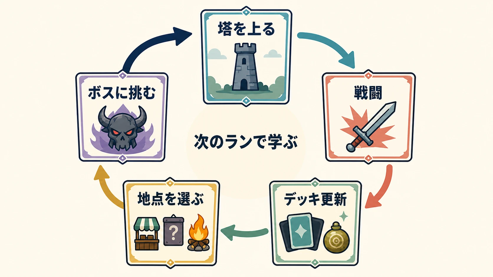
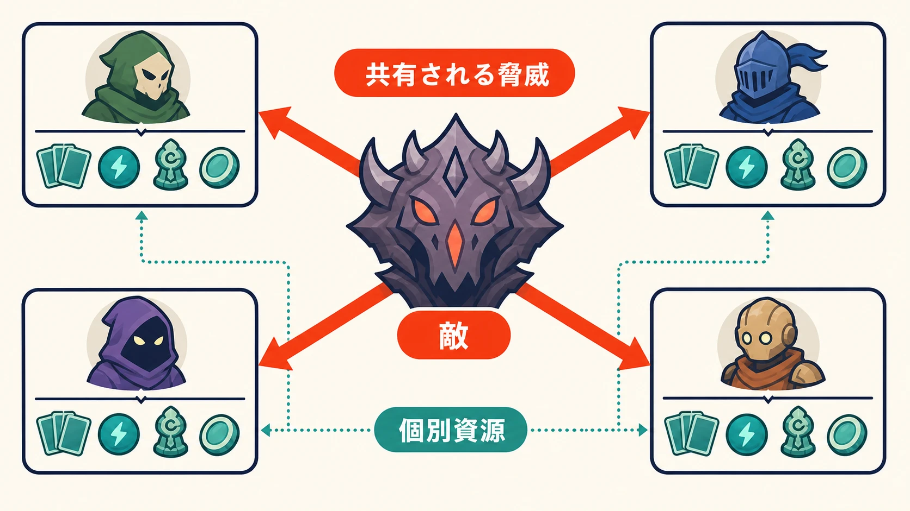
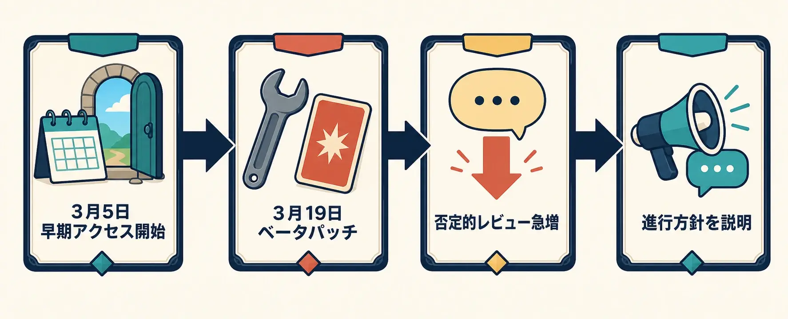
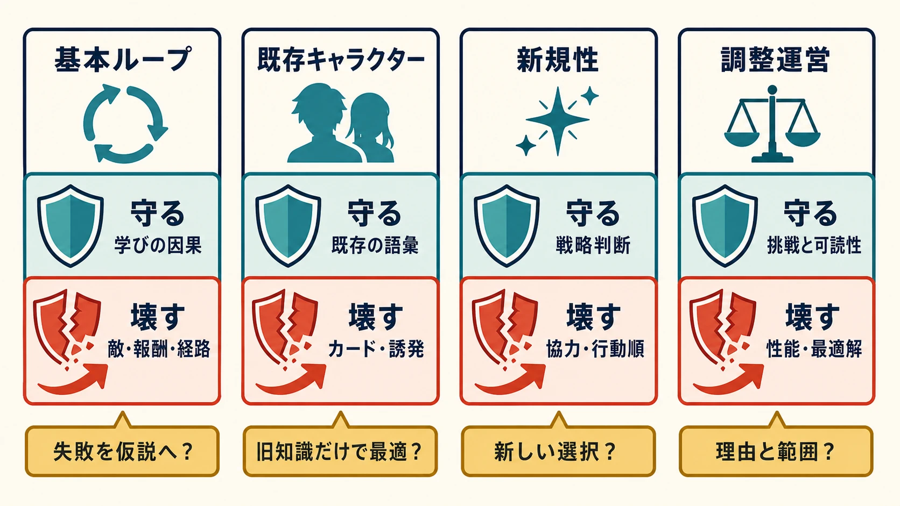

# 『Slay the Spire 2』は何を守り、何を壊したのか――ジャンルを定義したデッキ構築ローグライクの続編設計

> **注記**：本稿は2026年7月17日時点の早期アクセス版に基づく。今後の開発と更新により、カード、敵、バランス、協力プレイなどの内容は変更される可能性がある。[[1](#ref-1)]

2017年に早期アクセスへ登場した『Slay the Spire』は、カードを選んでデッキを育て、失敗するたびに最初から塔へ挑み直すという遊びの構造を広く定着させた作品である。開発元のMega Crit自身も、続編の告知文の中で、前作をこのジャンルの型を決定づけた作品として位置付けている。[[1](#ref-1)] 前作が早期アクセスを終えて1.0に到達したのは2019年1月である。[[2](#ref-2)]

その続編『Slay the Spire 2』は、2026年3月5日にSteamで早期アクセスを開始した。2026年7月17日現在、まだ1.0正式版には到達しておらず、カード、イベント、環境、敵などを早期アクセス期間中に追加・調整していく方針が公式に示されている。つまり本作は、完成した「正解」を眺める対象ではない。ジャンルの土台を残したまま、どこを作り替えるべきかをプレイヤーと一緒に確かめている途中の続編である。[[1](#ref-1)]

本稿が扱うのは、ローグライク一般の定義ではない。ローグライクという言葉の射程や系譜については「[結局ローグライクってなんなのさ？](what-is-a-roguelike.md)」に譲る。ここで見ていくのは、単一タイトルの続編が、既存プレイヤーが体で覚えた判断をどこまで活かし、どこに新しい判断を足したのかという設計の分析である。

***

## 1. 前作が残した「一周の問い」

『Slay the Spire』の一周、すなわち1回のラン（挑戦）は、流れだけを見れば単純である。分岐する経路をたどって塔を上り、戦闘・店・イベント・休憩地点を選び、戦闘報酬のカードやレリックでデッキを組み替え、ボスを越えられなければ次のランで別の選択を試す。ターン制のカード戦闘と、ランごとに変わる入手物を組み合わせることで、あらかじめ完成させたデッキを持ち込むのではなく、 **そのランで手に入る材料から勝ち筋を組み立てる** ことをプレイの中心に据えた。開発者のAnthony Giovannetti氏もGDC講演で、本作をローグライクとデッキビルダーの組み合わせだと説明している。[[3](#ref-3)]

この型で問われるのは、カードをたくさん取ることではない。次に来る敵、残りHP、手持ちの防御札、その先に待つボス、カード除去の機会を見比べて、目の前の1枚がデッキ全体の事故率と勝ち筋をどう変えるかを判断することだ。ランダム性は正解を隠すための仕掛けではない。毎回同じ強カード・同じ手順に収束するのを防ぎ、そのつど状況判断を求めるための仕掛けである。

したがって、続編の設計で真っ先に守るべきものは、カードや敵の名前そのものではない。プレイヤーが戦闘・報酬・経路選択を行き来しながら、敗北の経験を「次はこうしてみよう」という仮説に変えていける、その因果のつながりである。続編でも塔を登り、戦闘でカードを使い、報酬でデッキを組み替えて再挑戦する。この骨格が大きく崩れていないからこそ、以下で見ていく変更点を「別のゲーム」ではなく「続編ならではの更新」として読むことができる。[[1](#ref-1)]

***

## 2. 維持したもの：既存の知識を捨てさせない

早期アクセス開始時点のプレイアブルキャラクターは5人である。前作からアイアンクラッド、サイレント、デフェクトが続投し、新たにネクロバインダーとリージェントが加わった。前作をやり込んだプレイヤーなら、自己ダメージと回復（アイアンクラッド）、毒・短剣・捨て札（サイレント）、オーブ（デフェクト）という馴染みのある発想を、そのまま入口として使える。[[1](#ref-1)][[4](#ref-4)]

これは単なる懐古サービスではない。続編を始めて最初の数時間で、新キャラクター、新しい敵、新しい報酬、新しいUIを一度に覚えさせられると、プレイヤーは自分が負けた原因を切り分けられなくなる。見知った開始デッキ、見慣れたカード群、塔を登るときの判断を足場として残しておけば、失敗の原因を「新しい敵の性質」「新しいカードの評価」「経路の選び方」のどれなのかに切り分けやすくなる。実際、PC Gamerの実プレイ記事も、続投3人の開始デッキと開始レリック、カードプールの多くが前作からほぼそのまま引き継がれていると報じている。[[5](#ref-5)]

ここから引き出せる教訓は、続編の連続性を「見た目が似ているかどうか」で測らない、ということだ。プレイヤーがすでに身につけている判断のルールをどこまで再利用させるかを先に決め、その足場の上に新しい要素を重ねていくべきである。

***

## 3. 更新したもの：選択の密度を保ったまま別の軸を足す

### キャラクターの追加は「枚数」ではなく「問い」を増やす

新キャラクターのネクロバインダーは、使い魔のOsty、魂（Souls）、Doomという固有の仕組みを扱い、[[6](#ref-6)] リージェントはStarsという追加リソースと専用武器Sovereign Bladeを軸に戦う。[[7](#ref-7)] どちらも独自のリソースを持ち、前作の3人とは違う手順で手札と戦闘を組み立てることになる。つまりこの追加は、単にカードの総数を増やすものではなく、「何を貯めて、いつ使うか」というキャラクターごとの問いを新しく増やす更新である。

一方で、続投キャラクターも前作のまま据え置かれているわけではない。開発元は、前作のカードの一部を外し、新カードを加え、残したカードにも手を入れる方針を明らかにしている。その代表例が、サイレントに追加された新キーワード Sly だ。Sly を持つカードは、捨てられたときに無料で自動的に使用される。これまで捨て札といえば手札の質を整えるための補助動作だったが、Sly の登場によって、捨てる行為そのものが行動回数やダメージに直結するようになった。[[8](#ref-8)]

この変更のポイントは、「捨て札」というサイレントに馴染み深い言葉を残したまま、その意味を変えたことにある。捨て札カードは不要なカードを処分する手段であると同時に、Sly を誘発する起点にもなった。プレイヤーは1枚ごとの効率だけでなく、手札を動かす順番、無料使用をどう誘発するか、山札を一巡させる速さまで同時に考えることになる。既存キャラクターを作り直すとき、古い戦法を丸ごと捨てて新しいものに置き換えるよりも、 **慣れ親しんだ言葉の意味を少しだけずらす** 方が、学習の負担を抑えながら「もう一度発見する楽しさ」を生み出しやすい。

### 報酬と見せ方が、選択の質を変える

続編には、ラン中にカードへ付与される Enchantment という仕組みがある。カードに追加効果を与える修飾で、効果はそのランの間だけ続く。前作からあるカード強化とは別枠で、同じカードでも「今回のランでは何をさせるか」を変えられるため、暗記した評価表のとおりにカードの強さを判断するのではなく、その場の状況に応じて判断し直すことを促す仕組みになっている。[[9](#ref-9)]

また、前作のボスレリックに当たる位置づけとして、各Actの入口でAncientsと呼ばれる存在から強力な恩恵を選ぶ仕組みが加わった。恩恵の中には大きな代償を伴うものもある。次の戦闘を単純に有利にするだけの報酬ではなく、それ以降の経路やデッキ構成に制約をかける報酬が混ざることで、プレイヤーの選択は「どれが強いか」ではなく「どの不自由なら引き受けられるか」という問いに変わる。[[10](#ref-10)]

技術面に目を向けると、開発元は続編を作る理由として、Godotエンジンへの移植と安定化、拡張しやすい設計への刷新、アートとUIの一新を挙げている。見た目の滑らかさそれ自体が目的なのではない。敵の動きや選択肢、状態の変化をプレイヤーに読み取らせるための情報設計と、今後のコンテンツ追加を受け止められる制作基盤とを、同時に更新したことに意味がある。[[11](#ref-11)]

***

## 4. 型を壊す更新：4人オンライン協力プレイ

前作からもっとも大きく踏み出した変更が、最大4人のオンライン協力プレイである。前作は、一人で考え、失敗も一人で引き受けるゲームだった。続編では、そのラン自体を仲間と共有できる。といっても、全員で1つのデッキを回すわけではない。各プレイヤーはそれぞれ自分のエネルギー、カード、レリック、所持金を持ち、敵の能力値は参加人数に応じて変わる。敵の攻撃はパーティ全員に及び、全員がターン終了を選ぶと次のターンへ進む。[[12](#ref-12)]

重要なのは、この協力プレイが「人数を増やして難易度を下げる」仕組みとして作られていないことだ。報酬には協力プレイ専用のカードが出現し、味方の状態を見ながらカードを切ることになる。例えば、一人が敵に脆弱などのデバフを付け、続く味方が大技を重ねる。このときカードの価値は、単独プレイでのダメージ量ではなく、パーティ全体の行動順と互いの手札によって決まる。ゲーム内では味方の手札やエネルギー、カーソルの位置まで見えるため、誰が何を考えているのかを、言葉に頼りきらなくても最低限は共有できる。[[12](#ref-12)][[13](#ref-13)]

この構造は、デバフ役と攻撃役といった「役割」を固定するためのものではない。次の手番で誰が何を出せるかに合わせて、その場その場で役割を組み替えるための設計である。一人用であれば、カードAの後にカードBを出すという自分の中の順番だけを考えればよかった。協力プレイでは、カードAを誰が出すか、その効果を誰のカードBで活かすか、そして全員が危険な敵のターンを生き延びられるか、という全体の組み立てまでが一つの選択になる。

もちろん、複数人で遊べば、待ち時間や、進む経路をめぐる意見の食い違い、報酬の取り合いといった摩擦も生まれる。本作では、経路は各プレイヤーの投票と抽選で、宝箱の取り合いは画面上に表示される各プレイヤーの「手」を使った抽選の演出で決着させる。相談の余地は残しながら、話し合いが長引いてテンポが崩れることを防ぐ作りだ。協力要素の価値は、戦闘の火力が増えることではない。単独プレイには存在しなかった「他人の状況を読んで手順を組む」という判断を、新しく生み出せるかどうかにある。[[13](#ref-13)]

***

## 5. 早期アクセスは、バランス調整そのものを公開する

早期アクセスとは、単に「未完成」を言い換えた言葉ではない。カードゲームでは、カード単体の性能、カード同士の組み合わせ、敵、報酬、難易度が互いに連動している。だから、何をどう調整するかだけでなく、その調整をプレイヤーにどう伝えるかまでが、運営の設計に含まれる。

2026年3月19日（北米時間。日本時間では3月20日）に公開されたベータパッチ v0.100.0 は、無限コンボを成立しにくくすることを主な狙いとして、大規模な変更を行った。これは全プレイヤーへの強制的な更新ではなく、公開ベータブランチを自分で選んだプレイヤーだけに適用される調整だった。それでも公開直後からSteamには多数の否定的なレビューが集まり、Mega Critは、早期アクセス中の調整は一直線には進まず、どの変更も恒久的なものとは限らないと説明することになった。[[14](#ref-14)][[15](#ref-15)]

ここで注意したいのは、この反発を「プレイヤーは変化を嫌うものだ」と片付けないことである。無限コンボは、長い試行錯誤の末にたどり着いた達成感や、カードへの評価、上達の証と結び付いている。開発側から見れば、無限コンボを難しくすることで、挑戦のしがいやカード選択の多様性を守れる可能性がある。しかしプレイヤーの側から見れば、自分が苦労して覚えた解法を、後から取り上げられたように映る。パッチノートのたった一行の変更でも、デッキ全体の相互作用を読み込んでいるプレイヤーほど、その一行の持つ意味を大きく受け止めるのだ。

プランナーがここから学べるのは、数値を変える前に「これは何を守るための変更なのか」を説明し、様子を見る期間、変更を適用する対象ブランチ、元に戻す条件をあらかじめ明確にしておくことだ。無限コンボを減らすのであれば、想定外の即死コンボを抑えたいのか、単調な最適解への収束を防ぎたいのか、それともボス戦で別の勝ち筋を求めたいのかを、分けて語る必要がある。フィードバックの窓口をゲーム内にも用意するという公式方針は、不満の行き先がストアレビューだけに集中しないための導線づくりとして重要である。[[1](#ref-1)]

***

## 6. 続編を設計するときの切り分け

『Slay the Spire 2』の現時点の設計からは、ジャンルを定義した作品の続編を作るときに、何と何を切り分けて考えればよいかが見えてくる。

| 切り分ける対象 | 守るべきもの | 壊してよいもの | 確認すべき問い |
| --- | --- | --- | --- |
| 基本ループ | 塔を進み、その場で得た材料でデッキを組み替え、再挑戦から学ぶという因果 | 敵、報酬、経路の具体的な内容 | 失敗の理由を次のランの仮説に変えられるか |
| 既存キャラクター | 役割を理解するための入口と、慣れ親しんだ用語 | カード群、誘発条件、強い組み合わせ | 前作の知識は助けになるか、それだけで最適化できてしまわないか |
| 新規性 | 一人でも成立する戦略判断 | 協力、専用カード、複数人の行動順 | 人数を増やしたことが火力の増加で終わらず、新しい選択を生んでいるか |
| 調整運営 | 挑戦のしがい、判断の読み取りやすさ | 個別カードの性能、発見済みの最適解 | 変更の理由と検証の範囲を、プレイヤーの体験に即した言葉で伝えられるか |

続編において「型を守る」とは、前作のカードをそのまま写すことではない。プレイヤーがなぜ失敗し、そこから何を次のランへ持ち帰るのかという、学習の骨組みを守ることである。同様に「型を壊す」とは、目新しい要素をただ積み上げることではない。4人協力プレイのように、これまでの勝ち筋の知識だけでは足りず、他人の手札や行動順、リスクまで読む新しい判断を生み出すことである。

早期アクセスの間、この二つの境界線は固定されない。現段階の Sly や協力専用カード、無限コンボ対策が1.0正式版でどう変わるかは、まだ決まっていない。だからこそプランナーは、個々の数値変更を「弱体化かどうか」だけで評価するのではなく、基本ループから学び続けられるか、勝ち筋が多様に保たれているか、プレイヤーが発見を自分の手柄だと感じられているか、という複数の観点を同時に見ていくべきである。

『Slay the Spire 2』が残そうとしているのは、ジャンルを定義した前作の「答え」そのものではなく、答えを出すための「問い」の方である。その問いが、協力プレイや継続的な調整と合わさって、1.0正式版でどのような一本の体験にまとまるのか。それは今後の更新を見ながら判断していくべき課題である。

## References

1. [Slay the Spire 2 is out NOW in Early Access!!][1] - 2026年3月5日の早期アクセス開始、早期アクセス中の追加・調整方針、および前作をジャンルを定義した作品と位置付ける文言（原文は英語）を示すMega Crit公式発表。

2. [Slay the Spire 1.0: Farewell Early Access][2] - 前作の1.0移行を告知したSteam Communityの発表。

3. [Slay the Spire: Metrics Driven Design and Balance][3] - Mega Crit共同創業者Anthony Giovannetti氏によるGDC 2019講演資料。作品の基本構造と早期アクセスでの反復的なバランス調整を説明する。

4. [Slay the Spire 2 Releases in Early Access on March 5, 2026!][4] - 5人の開始時キャラクターと4人協力プレイを説明するMega Crit公式発表。

5. [After beating Slay the Spire 2 with an 8 year old deck, I think this is more of a remake than a sequel][5] - 続投キャラクターの開始デッキ、レリック、カードプールの継続性を扱う実プレイ記事。

6. [The Neowsletter - October 2025][6] - 新規キャラクター、ネクロバインダーの使い魔Osty、Doom、魂（Souls）の仕様を説明するMega Crit公式ニュースレター。

7. [The Neowsletter - December 2025][7] - 新規キャラクター、リージェントのStars資源と専用武器Sovereign Bladeの仕様を説明するMega Crit公式ニュースレター。

8. [The Neowsletter - May 2025][8] - 続投キャラクターの再設計方針と、サイレントのSlyの仕様を説明するMega Crit公式ニュースレター。

9. [The Neowsletter - February 2025][9] - ラン中だけカードへ追加効果を与えるEnchantmentを説明するMega Crit公式ニュースレター。

10. [The Neowsletter - November 2025][10] - Act開始時のAncientsとその恩恵、代償を説明するMega Crit公式ニュースレター。

11. [The Neowsletter - September 2024][11] - Godotへの移植、拡張性、パフォーマンス、アートとUI刷新を続編の目的として説明するMega Crit公式ニュースレター。

12. [How Slay the Spire 2 multiplayer co-op works][12] - 協力プレイの人数、戦闘、個別資源、協力専用カード、休憩地点の仕様をまとめた実プレイガイド。

13. [Slay The Spire 2's Next-Level Co-Op Makes It An Early GOTY Contender][13] - 味方の手札・資源の確認、経路投票、宝箱の競合処理など、協力プレイの情報設計を報じた記事。

14. [Slay the Spire 2 - Beta Patch Notes - v0.100.0][14] - 無限コンボを成立しにくくすることを主眼とした初の大規模公開ベータパッチの公式ノート。

15. [Slay the Spire 2 devs respond to a flurry of bad Steam reviews aimed at its first balance patch][15] - 公開ベータパッチ後のレビュー反応と、Mega Critの早期アクセスに対する説明を報じた記事。

[1]: https://www.megacrit.com/news/2026-03-05-early-access-launch/
[2]: https://steamcommunity.com/app/646570/eventcomments/1635292137556064731
[3]: https://media.gdcvault.com/gdc2019/presentations/Giovannetti_Anthony_SlayTheSpire.pdf
[4]: https://www.megacrit.com/news/2026-02-19-release-date-trailer/
[5]: https://www.pcgamer.com/games/roguelike/after-beating-slay-the-spire-2-with-an-8-year-old-deck-im-starting-to-feel-like-this-is-more-of-a-remake-than-a-sequel/
[6]: https://www.megacrit.com/news/2025-10-16-neowsletter-issue-15/
[7]: https://www.megacrit.com/news/2025-12-11-neowsletter-issue-17/
[8]: https://www.megacrit.com/news/2025-5-15-neowsletter-issue-10/
[9]: https://www.megacrit.com/news/2025-2-12-neowsletter-issue-7/
[10]: https://www.megacrit.com/news/2025-11-13-neowsletter-issue-16/
[11]: https://www.megacrit.com/news/2024-09-09-neowsletter-issue-2/
[12]: https://www.pcgamer.com/games/roguelike/slay-the-spire-2-multiplayer-co-op/
[13]: https://www.gamespot.com/articles/slay-the-spire-2s-next-level-co-op-makes-it-an-early-goty-contender/1100-6538638/
[14]: https://store.steampowered.com/news/app/2868840/view/503978984819655259
[15]: https://www.gamesradar.com/games/roguelike/slay-the-spire-2-devs-respond-to-a-flurry-of-bad-steam-reviews-aimed-at-its-first-balance-patch-this-progress-will-not-be-linear-and-no-change-is-necessarily-permanent/

----

この文書は、Perplexity、Claude、OpenAI Codex の3つのAIの支援を受けて著述されたものです。引用画像を除き、MIT License にて提供されています。
