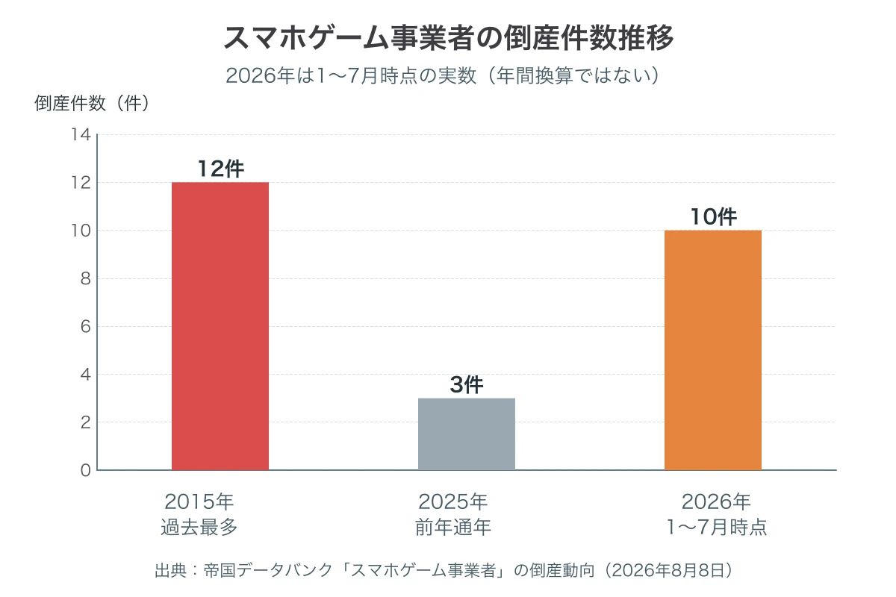
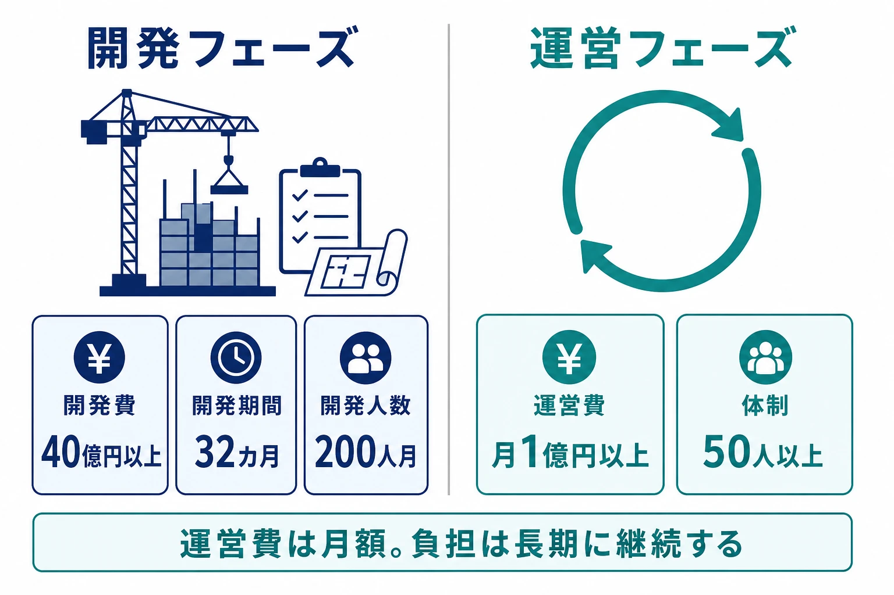
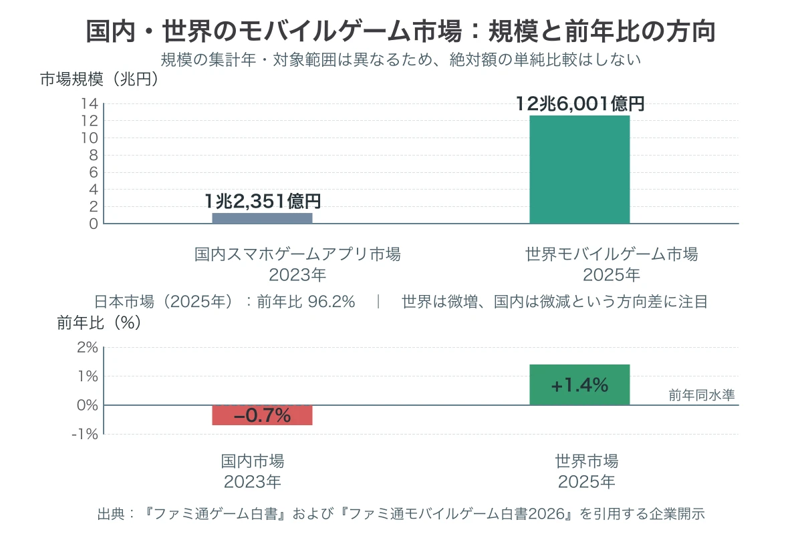

# スマートフォンゲーム会社の倒産はなぜ過去最多ペースなのか――2026年の数字から読む開発費・運営費と国内市場

2026年の国内スマートフォンゲーム事業者の倒産は、過去最多を更新しかねない速度で進んでいる。帝国データバンクは、同年1月から7月までに10件を確認した。前年2025年の通年3件をすでに大きく超え、過去最多だった2015年の12件に迫る水準である[[1](#ref-1)]。

これは個別タイトルの成否を一言で説明する数字ではない。大型化する初期投資、サービス開始後も止まらない運営費、海外企業を含む競争、そして国内市場の伸び悩みが重なる局面を示す数字である。本稿は、特定企業の経営判断を断罪せず、プランナーが企画と協業の前提として把握すべき構造を整理する。

***

## 統計が示す「過去最多ペース」の意味

帝国データバンクの「スマホゲーム事業者」の倒産動向は、2000年1月から2026年7月31日までを集計期間とし、負債1,000万円以上で法的整理に至った倒産を対象とする[[1](#ref-1)]。休廃業や、事業を続けるための組織再編までを一括りにした数字ではない点が重要である。

2026年1〜7月の10件は、年間換算の予測値ではなく、その時点までに確認された実数である。したがって年後半の件数を推測で補う必要はない。それでも、7カ月で過去最多年の12件まで残り2件という位置は、年間最多更新が視野に入ることを十分に示している。

小規模事業者への負荷も大きい。直近5年以内の倒産29件のうち、資本金1,000万円未満の事業者は15件、51.7%を占めた[[1](#ref-1)]。同レポートは、初期開発費の膨張、リリース後の高い運営維持費、海外企業との競争激化を背景に挙げる。さらに、大手ゲーム事業者の開発撤退で受注を失った小規模事業者の破綻も論点としている。自社タイトルの成否だけでなく、発注構造の変化が受託・協業先の継続性へ及ぶ構図である。

*出典：帝国データバンク「スマホゲーム事業者」の倒産動向（2026年8月8日）[[1](#ref-1)]。2026年は1〜7月時点の実数であり、年間換算値ではない。*

***

## 集計直後に確定した3社破産という事例

統計の締切直後にも、動向を更新する出来事が起きた。株式会社オッドナンバー、株式会社イグニス、パルス株式会社の3社は、2026年8月5日に東京地方裁判所から破産手続開始決定を受けた。信用調査会社等の報道で確認できる3社合計の負債総額は約297億円である。ただし報道間で各社の内訳表現には幅があるため、本稿では内訳を固定しない[[2](#ref-2)][[3](#ref-3)]。

3社が関わったタイトルには、『Link！Like！ラブライブ！』と『ヒプノシスマイク -Dream Rap Battle-』がある。前者は2023年5月に配信を始め、2026年4月6日に同年6月30日正午でのサービス終了を発表した[[4](#ref-4)][[5](#ref-5)]。オッドナンバーの2023年12月期は56億円の最終赤字、債務超過額は68億円まで拡大していたと報じられている[[2](#ref-2)]。

ここで注目すべきなのは、タイトルの体験設計と運営原価の接点である。運営は、蓮ノ空女学院スクールアイドルクラブの歩みを現実の時間軸に合わせて進めるカレンダー連動型の作品であり、その運営コストと人的負担は通常のゲーム運営を大きく上回ったと説明した。資金繰り悪化により主要コンテンツの制作体制維持が困難になったことも、終了告知で示されている[[4](#ref-4)]。

この説明は、リアルタイム連動という設計自体を失敗とみなすものではない。作品固有の魅力を生む一方で、更新を止めにくく、制作・配信・権利調整・コミュニティ対応をカレンダーに合わせ続ける約束にもなる。採算はリリース時の開発費だけでなく、その約束を何年履行するかまで含めて設計する必要がある。

なお、帝国データバンクの集計は7月31日までであり、8月5日の3社の破産手続開始決定は「2026年1〜7月の10件」には含まれていない可能性が高い。これは統計の誤りではなく締切日の違いである。8月8日の発表後も、2026年の倒産動向は更新され続けている。

***

## 一社の法的論点ではなく、業界トレンドとして読む

株式会社アンビションが運営していた『文豪ストレイドッグス 迷ヰ犬怪奇譚』も、2026年7月に破産・サービス終了へ至った。東京商工リサーチの報道によると、売上高は2022年3月期の約37億4,000万円から2025年3月期の約10億2,708万円へ縮小していた[[6](#ref-6)]。これは市場トレンドを具体化する一例として記すに留める。

同作の終了告知、前払式支払手段、払戻しを巡る論点は、[『文豪ストレイドッグス 迷ヰ犬怪奇譚』――告知から実質1日、廃業と「異能石」払戻し拒否が突いた法とサービス終了設計の隙間](bungo-stray-dogs-mayoi-inu-bankruptcy-shutdown-refund-gap.md)で扱っている。本稿では、資金決済法や終了時の手順には踏み込まない。更新頻度の低下など、外部から見える資金繰り悪化のシグナルについても同記事を参照されたい。

海外にも比較材料がある。韓国のクローバーゲームズは2026年4月9日、現地裁判所へ法人破産手続開始を申請した。『ロードオブヒーローズ』『あやかしライズ：妖怪退治AFK』などの運営会社である[[7](#ref-7)]。同社は日本国内事業者を対象とする帝国データバンク統計には含まれない。それでも、運営型モバイルゲームの資金と継続制作の問題が、日本だけに閉じた現象ではないことを考えるための比較材料にはなる。

***

## 開発40億円、月次運営1億円という前提

コスト高は数字の裏付けを持つ。CESAが2026年2月4日に経済産業省のゲーム分野専門委員会へ提出した資料は、モバイルの大型（AAA級）タイトルについて、開発費40億円以上、開発期間32カ月、開発人数200人月、運営費は月1億円以上、50人以上としている[[8](#ref-8)]。同資料は、トリプルAタイトルが家庭用ゲームと同等の40億円超に達し、長期にわたる月額1億円・50人以上の運営を加えると、規模はすでに家庭用ゲームを上回ると指摘する。

資料が描く背景は、グローバル市場の拡大に合わせて中規模タイトルが減り、より大きな投資を行うトリプルAへシフトするというものだ。グローバル展開作品では100億円以上の製作費が標準になりつつあるとも記される[[8](#ref-8)]。品質の上限だけでなく、多言語対応、各国の慣習対応、国別のプロモーションやSNS対応も、継続費用へ組み込まれる。

「運営費は月1億円以上」という数字を、単純に12倍して年間12億円と読むだけでは足りない。運営期間が長くなるほど、ライブイベント、シナリオ、アセット、QA、カスタマーサポート、インフラ、コミュニティのそれぞれで、品質を落とさずに固定費を下げることが難しくなる。運営型の企画書では、初月売上や開発回収だけでなく、売上が緩やかに低下した局面で、どの体験を守り、どこを可変費にできるかを先に決める必要がある。

*図：CESAの提出資料に示されたモバイルAAA級タイトルの開発・運営の規模感[[8](#ref-8)]。*

***

## 国内市場の停滞と世界市場の緩やかな成長

角川アスキー総合研究所の『ファミ通ゲーム白書』によれば、国内スマートフォンゲームアプリ市場は2023年に1兆2,351億円で、前年比0.7%減、3年連続のマイナスだった[[9](#ref-9)]。

一方、『ファミ通モバイルゲーム白書2026』を引用する上場企業の開示では、2025年の世界モバイルゲーム市場は12兆6,001億円、前年比1.4%増である[[10](#ref-10)]。同じ開示は日本市場を前年比96.2%としており、世界が緩やかに成長する間に国内が微減する対比を確認できる[[10](#ref-10)]。

つまり、モバイルゲーム市場全体が消滅したのではない。緩やかに成長する世界市場の中で、日本国内市場が相対的に停滞・微減し、その市場で高騰した開発・運営費を回収しようとする難度が増したのである。海外展開は市場を広げる選択肢である一方、CESA資料が示す通り、対応地域を増やすほど制作と運営のコスト構造も重くなる。市場拡大と採算改善は同義ではない。

*出典：『ファミ通ゲーム白書』[[9](#ref-9)]および『ファミ通モバイルゲーム白書2026』を引用する企業開示[[10](#ref-10)]。*

***

## プランナーが企画段階へ持ち帰るべきこと

この局面で問うべきは、「長期運営なら何でも増やす」ことではなく、継続する約束をどこまで収支モデルに織り込めているかである。

- ライブサービスの運営原価を仕様に含めること：リアルタイムカレンダー連動のように、更新頻度や制作締切を体験の核にする設計では、平常時だけでなく売上が想定を下回った時期にも維持できる最小体制を企画段階で置く。サービス水準を段階的に変える条件も、企画・制作・運営の共通前提にする。
- IPライセンサー側も継続性を評価すること：資本規模の小さい受託先・協業先と組む場合、表現力や実績に加え、資金余力、特定発注元への依存、引継ぎ可能な開発資産、緊急時の連絡・権利処理を確認する。これは相手を疑うためではなく、IPとユーザーへの約束を守るための設計である。
- 終了を最後の工程にしないこと：サービスを畳む際の具体的な運用手順は、[サービス終了をどう設計するか――オンラインゲームを破綻なく畳む実務](service-shutdown-design-and-practice.md)で整理している。ここでは、その手前にある「通常運営をいつまで維持できるか」という事業前提を、仕様とロードマップの双方に置くことを強調したい。

2026年の倒産件数は、個々のチームの努力を測る尺度ではない。だが、企画の規模、運営の約束、協業先の継続性、市場を選ぶ判断が、プランナー個人の担う仕事やキャリアの選択にも波及する環境になったことは確かである。この問いが現場のスキルアップと次の役割への移行にどうつながるかは、稿を改めて扱う。

## References

1. [「スマホゲーム事業者」の倒産動向（2026年8月8日）][1] - 帝国データバンク。集計期間、対象、2026年1〜7月の件数、小規模事業者比率、背景分析。

2. [オッドナンバーなど3社の破産に関する報道][2] - 東京商工リサーチ、2026年8月。3社の破産手続開始決定、負債総額、オッドナンバーの財務に関する報道。

3. [オッドナンバー、イグニス、パルスの破産に関する報道][3] - 帝国データバンク、2026年8月。3社の破産手続開始決定と負債総額に関する報道。

4. [スマホアプリ『Link！Like！ラブライブ！』サービス終了へ][4] - インサイド、2026年4月6日。運営の説明、カレンダー連動型の運営コストと人的負担、資金繰り悪化。

5. [『Link！Like！ラブライブ！』サービス終了のお知らせ][5] - ラブライブ！蓮ノ空女学院スクールアイドルクラブ公式、2026年4月6日。

6. [突如サービス終了する『文豪ストレイドッグス 迷ヰ犬怪奇譚』、運営元は“破産申立て済み”か][6] - AUTOMATON、2026年7月30日。東京商工リサーチの報道を引用した売上高推移。

7. [法人破産手続開始の申立て及びサービス終了に関する事前のご案内][7] - クローバーゲームズ、2026年4月9日。

8. [ゲーム産業の課題・提言について][8] - CESA、経済産業省「第12回エンタメ・クリエイティブ産業研究会 業種分野別専門委員会（ゲーム）」提出資料、2026年2月4日。

9. [2025年5月期第1四半期決算説明資料][9] - GameWith、2024年10月。『ファミ通ゲーム白書2024』を出典とする国内スマートフォンゲーム市場の推移。

10. [有価証券報告書][10] - コンフィデンス・インターワークス、2026年6月。『ファミ通モバイルゲーム白書2026』を出典とする2025年の世界・日本のモバイルゲーム市場規模。

[1]: https://www.tdb.co.jp/report/economic/20260808-smartphonegames26y1-7/
[2]: https://www.tsr-net.co.jp/news/tsr/detail/1203136_1521.html
[3]: https://www.tdb.co.jp/report/bankruptcy/flash/5252/
[4]: https://s.inside-games.jp/article/2026/04/06/179580.html
[5]: https://www.lovelive-anime.jp/hasunosora/appnews/detail/?p=2026-04-06-10-pyvygf54x8
[6]: https://automaton-media.com/articles/newsjp/20260730-457471/
[7]: https://blog-ja.lordofheroes.com/thank-you/
[8]: https://www.meti.go.jp/shingikai/mono_info_service/entertainment_creative/pdf/012_09_00.pdf
[9]: https://www2.jpx.co.jp/disc/65520/140120241009595405.pdf
[10]: https://disclosure2dl.edinet-fsa.go.jp/searchdocument/pdf/S100YKQ9.pdf

----

この文書は、Perplexity、Claude、OpenAI Codex の3つのAIの支援を受けて著述されたものです。引用画像を除き、MIT License にて提供されています。
