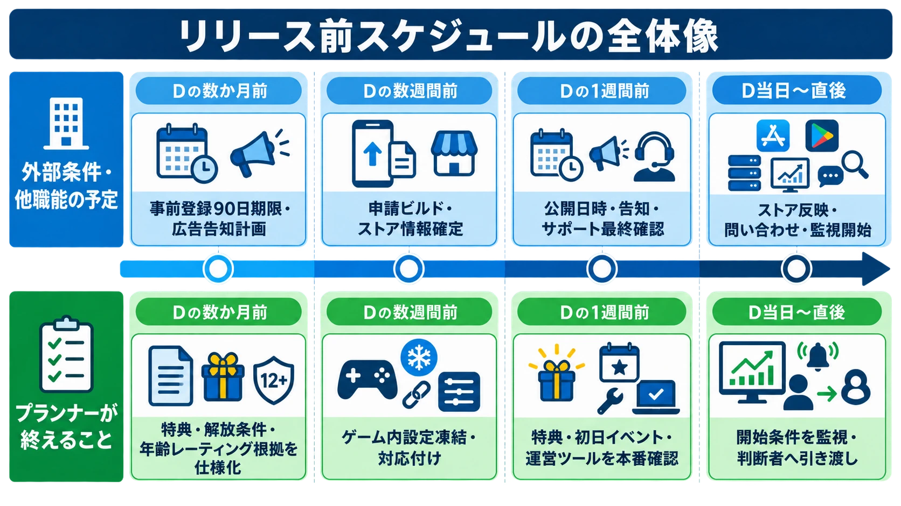
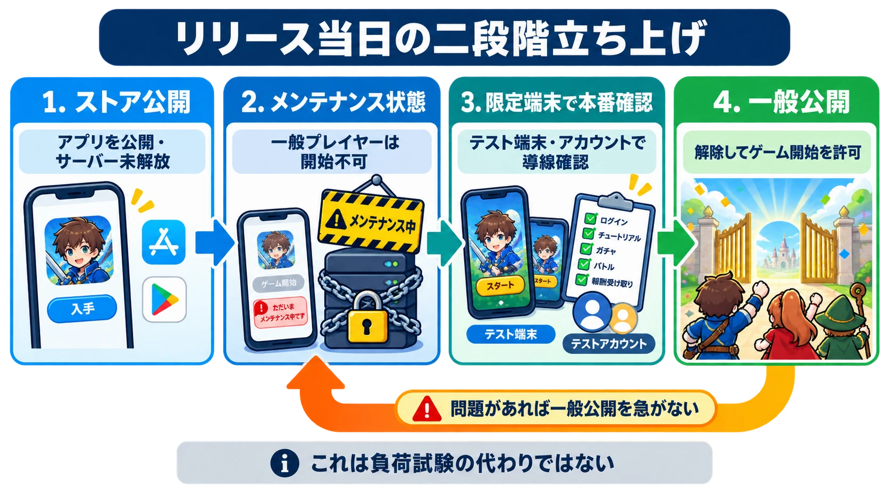

# スマホゲームのリリース前スケジュール――プランナーが準備すべきことの逆算チェックリスト

スマートフォンゲームのリリースには、チームだけでは動かせない締切がある。ストア審査、年齢レーティングの申告、事前登録の公開期間、ビルドの処理がそれにあたり、リリース日を決めても、その日まで自由に作業を並べられるとは限らない。たとえば Google Play の事前登録は、国・地域ごとに開始から90日以内に本番公開へ至る必要がある。期限を超えるとキャンペーンは全地域で終了し、新たな事前登録キャンペーンも開始できない。[[1](#ref-1)]

本稿は、審査で何が問題になるかを解説する記事ではない。表現・ポリシーの確認は既存記事「[App Store / Google Playにおけるゲーム表現の審査基準と対策](app-store-google-play-game-content-review-guide.md)」を参照されたい。ここで扱うのは、外部の締切を起点に、プランナーが自分で完了させるゲーム内準備をいつまでに閉じるかである。

広告出稿、プレスリリースの文面作成、配信日時の決定、インフルエンサー施策は、プロデューサー・マーケティング担当の仕事である。プランナーが担うのは、それらの施策によってプレイヤーがゲームへ到達したとき、特典、初日イベント、ログイン導線が仕様どおり動く状態を作り、確認可能にすることである。

まず、リリース日を `D` として、外部締切とゲーム内の完了条件を同じ表に置く。日数は固定の正解ではなく、差し戻しや修正を吸収するための管理上の目安である。タイトルの規模、配信地域、利用するSDK、ストアのアカウント状況によって前倒しする。

| 時期 | 外部条件・他職能の予定 | プランナーが終えること |
| --- | --- | --- |
| Dの数か月前 | Google Playの事前登録を始めるなら、国・地域ごとに90日後が公開期限になる。広告・告知計画はプロデューサー・マーケティング担当が持つ。 | 特典、解放条件、配布履歴、年齢レーティング申告の根拠を仕様化し、テスト可能にする。 |
| Dの数週間前 | Apple・Googleへ申請するビルドとストア情報を確定する。 | 審査用ビルドに入るゲーム内設定を凍結し、ビルド番号、設定データ、審査用アカウントを対応付ける。 |
| Dの1週間前 | 公開日時、告知、サポート体制を関係者間で最終確認する。 | 事前登録特典、初日イベント、初回ログインボーナス、運営ツールの設定を本番相当で通す。 |
| D当日〜直後 | 公開後のストア反映、問い合わせ窓口、監視が始まる。 | ゲーム内の開始条件を監視し、不具合の事実・影響範囲・暫定措置を判断者へ渡す。 |

*リリース前の四段階を、外部条件・他職能の予定とプランナーが終えることの2レーンで対比する。*

***

## 1. リリース数か月前：ゲーム内の土台を先に閉じる

### 1-1. 事前登録特典を「告知」ではなく「配布機能」として設計する

事前登録キャンペーンの告知文言を作ること、告知をどの媒体へ出すこと、広告を出稿することは、プロデューサー・マーケティング担当の仕事である。一方で、特典を実際に受け取れるゲーム内の仕組みはプランナーの責任範囲である。

Google Playでは、事前登録特典としてローンチ後に一回だけ無料提供するアイテムを設定できる。特典を設ける場合、事前登録トラックの Android App Bundle に課金権限が必要になるケースもあるため、実装担当と早めに前提を照合する。[[1](#ref-1)] ただし、ストア上の設定ができたことは、ゲーム内で安全に配れることの証明にはならない。

プランナーは、少なくとも次の仕様を一枚にまとめる。

- 特典のID、名称、数量、付与対象、付与回数
- 付与の起点。ストア事前登録の情報を直接使うのか、ゲーム内の条件達成で一律配布するのか
- 解放時刻とタイムゾーン。公開時刻、初日イベント開始時刻と矛盾しないか
- 初回ログイン、チュートリアル完了、メールボックスなど、受け取り画面へ至る導線
- すでに受け取ったアカウントへの二重付与を防ぐ識別子と、再ログイン時の挙動
- 配布に失敗した場合の再実行方法、問い合わせ時に確認するログ、補償の判断者

重要なのは、特典を「プレイヤーに見せる約束」と「サーバーが実行する状態遷移」に分けることである。前者の表現や告知はマーケティングの責任であり、後者のID、条件、保存データ、テスト観点はプランナーが取りまとめる。告知内容を見てから実装条件を考える順番にすると、条件の追加や例外がリリース直前の修正になる。

### 1-2. 年齢レーティングの回答を、ゲーム仕様から再現できる形にする

年齢レーティングの最終申告操作はアカウント権限を持つ担当者が行う場合もある。しかし、質問へ正確に答える根拠を集めるのは、ゲーム内容を把握するプランナーの重要な仕事である。

Appleでは、App Store Connectの年齢レーティング質問票で、コンテンツ記述子、ゲーム内の制御、機能の有無や頻度を回答し、その内容から年齢区分が算出される。年齢レーティングは必須のアプリ情報である。[[2](#ref-2)] Google Playでも、各ゲームについてコンテンツレーティング質問票への正確かつ完全な回答が求められ、回答を基に複数のレーティング機関による区分が付与される。[[3](#ref-3)]

この時期に、仕様書、演出リスト、実装済み画面、課金仕様、ユーザー生成コンテンツや交流機能の有無を突き合わせる。質問票の文言を読むだけではなく、「どの画面・どの機能・どのデータを見れば回答を再確認できるか」を残す。後から演出、抽選要素、チャット、広告の種類が変わったとき、回答を更新すべきかを判断しやすくなる。

### 1-3. 90日を「キャンペーンの長さ」ではなく公開不能日の上限として扱う

Google Playの事前登録は、開始から90日以内に公開する前提で計画する。国・地域を途中で追加した場合は、その国・地域での開始時点から90日の窓が始まる。[[1](#ref-1)] したがって、最初に事前登録を公開する日を `D - 90日` より後ろへ置くのではなく、審査差し戻しとビルド修正の余地を確保したうえで、公開日を選ぶべきである。

ここで必要なのは「事前登録者数の目標値」ではない。数値の達成をプランナーだけで約束することはできず、広告出稿や告知設計はプロデューサー・マーケティング担当の仕事である。プランナーは、事前登録特典が必要とする実装・データ準備の完了日と、公開期限が衝突していないことを確認する。

***

## 2. リリース数週間前：審査用ビルドを公開版として扱う

### 2-1. 申請日は審査時間の「平均」だけで決めない

Appleは、提出の平均90%を24時間未満で審査すると案内している。[[4](#ref-4)] これは早期公開を保証する期限ではない。申請が不完全なら遅延や不承認につながり得るため、リリース日に対して余白を取り、差し戻し、修正、再確認、ストアへの反映時間を吸収できる提出日を決める。

Google Playについても、プランナーが「何日で通る」と仮定してゲーム内の締切を置くべきではない。両ストアとも、審査用に提出する版は、リリース候補版として扱う。つまり、審査提出後にゲーム内の特典条件、初日イベントの開始時刻、チュートリアル完了報酬を変えれば、審査対象の版と実際の体験がずれる可能性がある。

この時期のプランナーの成果物は、単なる「最終版」というラベルではない。次の対応表である。

| 管理対象 | 記録する内容 | 確認する理由 |
| --- | --- | --- |
| iOSビルド | バージョン、ビルド番号、提出日時、審査用アカウント | 審査担当者が見る導線と公開版を結び付ける。 |
| Androidビルド | versionCode、Android App Bundle、提出したトラック | テスト版・事前登録版・本番版を取り違えない。 |
| サーバー設定 | 環境、設定データの版、反映予定時刻、変更担当 | アプリが同じでも、配布条件やイベント条件が変わるため。 |
| 審査用情報 | ログイン手順、到達手順、検証に必要な状態 | 審査担当者が機能へ到達できないことで確認が止まるのを防ぐ。 |

### 2-2. App Storeの手動公開は、余白を作るが責任を消さない

App Store Connectでは、申請時に手動公開を選べる。承認後、バージョンは `Pending Developer Release` となり、担当者が手動で公開するまで配信されない。公開を指示してからストアに現れるまで、Appleは最大24時間かかる場合があると案内している。[[5](#ref-5)]

この仕組みを使うと、審査を先に通してから公開日時を合わせられる。ただし、「承認済みだから内容は確定した」と考えてはならない。プランナーは、提出ビルド、公開対象ビルド、公開時に接続するサーバー設定を同じ管理単位で照合する。承認後に別のビルドを選び直す、サーバーの設定だけを変更する、イベント開始時刻を前倒しするといった変更は、公開時の体験を変える。

公開直前には、次の問いへすべて「はい」と答えられる状態を作る。

- 審査に提出したビルド番号と、公開するビルド番号は一致しているか。
- 審査用アカウントで通した導線は、本番設定でも成立するか。
- 審査提出後に変えたサーバー設定はあるか。あるなら、誰が差分を承認し、どの環境で再確認したか。
- 初日イベントと特典配布は、審査時に想定したゲーム進行を壊していないか。

### 2-3. 「公開準備完了」と「公開してよい」を分ける

プランナーは、二つの状態を分けて管理する。ビルドの承認は、ゲーム内のすべての開始条件がそろったことまでを保証しないためである。

1. **公開準備完了**：ビルド、ストア情報、レーティング申告、サーバー設定、ゲーム内のテスト結果がそろい、いつ公開しても仕様どおり遊べる状態である。
2. **公開してよい**：プロデューサーが事業上の公開判断を行い、マーケティング担当が告知・配信の準備を確認した状態である。

後者の決定はプロデューサー・マーケティング担当の仕事である。プランナーは前者を明確にし、未完了のゲーム内条件があれば、公開判断に必要な事実として早く伝える。

***

## 3. リリース直前1週間：ゲーム内の時刻をそろえる

リリース直前は、チェック項目を増やすだけでは足りない。公開時刻、特典解放時刻、イベント開始時刻、日次更新時刻の関係を、一つの時刻表で確認する。タイムゾーンと夏時間を採用する地域がある場合は、日時だけでなく基準時刻も明記する。

### 3-1. 本番相当で確認するゲーム内チェックリスト

- **事前登録特典**：対象アカウント、非対象アカウント、再ログイン、途中離脱、メールボックス満杯など、配布の境界を確認する。
- **初回ログインボーナス**：初回判定の保存時点、日次切替時刻、複数端末での表示、二重受け取りを確認する。
- **初日イベント**：開始・終了時刻、参加条件、解放クエスト、報酬、ランキングや集計の初期状態を確認する。
- **チュートリアル**：新規アカウントが特典や初日イベントへ到達するまでの導線が、進行不能なく完了するかを確認する。
- **運営ツール**：配布、停止、再実行、告知表示など、当日に使う操作の権限者と実行手順を確認する。
- **観測**：ログイン、特典付与、イベント参加、決済やエラーのどの指標を誰が見るかを決め、異常時の連絡先を一つにする。

ここでいう本番相当とは、本番のアイテムを誤って消費することではない。本番と同じ版の設定、時刻、権限、データ遷移を、隔離したアカウントまたは検証環境で再現することである。実行したチェックには、結果だけでなく、設定データの版と確認時刻を残す。直前の変更が入った場合に、どこを再試験するかが分かる。

### 3-2. プレスリリースの時刻とゲーム内の時刻を突き合わせる

プレスリリースの配信日時を決めること、その文章を作ること、広告出稿を調整することは、プロデューサー・マーケティング担当の仕事である。プランナーは、それらの時刻がゲーム内進行と矛盾しないかを確認する。

たとえば、告知で「配信開始」とする時刻に、ストアから取得した新規ユーザーが初日イベントへまだ参加できない、事前登録特典が受け取れない、意図せずサーバーがメンテナンス表示のまま、といった状態は避ける必要がある。プランナーは公開予定時刻を受け取ったら、イベント開始、特典解放、日次更新、配布ジョブ、導線解放を時系列に並べる。その上で、ゲーム側の準備完了時刻と制約を、プロデューサー・マーケティング担当へ返す。

***

## 4. リリース当日〜直後：初動で確かめるのは「約束した導線」である

リリース当日は、インフラ、クライアント、サーバー、QA、カスタマーサポート、プロデューサーと連携し、プレイヤー体験に何が起きているかを共通の言葉にする日である。プランナーが一人で障害対応や負荷対策を引き受ける日ではない。

### 4-1. ストア公開とゲーム開始を分け、限定端末で本番を確認する

近年のリリースでは、アプリをストアで先に公開し、ゲームサーバーはメンテナンス状態のまま保つ二段階の立ち上げがよく用いられる。ストアからの取得が始まっても、プレイヤーが本番のゲーム進行へ入る前に、運営側が最後の確認を行えるためである。ここで重要なのは、ストア公開時刻、メンテナンス解除時刻、初日イベント開始時刻を、別々の時刻として管理することだ。

メンテナンス状態を単なる待機画面として扱わない。プランナーは、次のような状態を仕様として明確にする。

- ストアから取得した一般プレイヤーに、何を表示し、いつゲーム開始を許可するか。
- メンテナンス中にログイン済みのユーザー、再起動したユーザー、通信が切れたユーザーをどう扱うか。
- 解除時刻の判定をクライアント、サーバー、運営ツールのどこが持ち、誰が実行するか。
- 解除前に実行する配布ジョブ、設定反映、初日イベントの準備が失敗した場合、何を止め、誰へ連絡するか。

さらに、特定の端末とテストアカウントだけを本番環境へ接続できるようにし、一般プレイヤーへ開放する前に実際の本番導線を通す方法がある。これは、検証環境では再現しにくいストア配信版、認証、配布設定、外部サービスとの接続を、本番の構成で確認するための段階である。端末の限定方法や認証方式は、インフラ・セキュリティ担当と決める。プランナーは、通すべき導線と、一般ユーザーがまだ入れないことの完了条件を定義する。

この限定確認では、少なくとも新規インストール、起動、規約同意、認証、初回ログイン、事前登録特典、初日イベント、メンテナンス解除前後の遷移を確認する。本番環境を使うからこそ、検証専用アカウント、消費しない検証用アイテム、確認後に残るデータの扱いも事前に決める。限定端末で問題が見つかった場合は、一般公開を急がず、メンテナンス状態を維持したまま原因と影響範囲を整理する。

この手順は、負荷試験の代わりではない。少数の端末による本番確認は導線と設定の事故を見つけるためのものであり、大量アクセスへの耐性は別途確認する必要がある。

*リリース当日は、ストア公開後に限定端末で本番導線を確認してから一般公開へ進む。問題があれば公開を急がず、これは負荷試験の代わりではない。*

### 4-2. 初動監視は、ゲームの開始条件から行う

公開後、プランナーは次の順で実際の導線を確認する。

1. ストアで対象地域・対象端末に公開状態が反映されているか。
2. 新規インストールから起動、規約同意、ログイン、チュートリアル開始まで進めるか。
3. 初回ログインボーナス、事前登録特典、初日イベントが、仕様どおりの条件と時刻で出現するか。
4. 問い合わせ、クラッシュ、進行不能の報告を、仕様上の既知条件、再現手順、影響範囲に分けられるか。
5. 不具合があったとき、止めるべき機能、継続できる導線、プレイヤーへ知らせるべき事実を判断者へ渡せるか。

当日の事実を残すときは、「不具合らしい」という言葉だけで終えない。発生時刻、対象のプラットフォーム・地域・アプリ版、再現手順、影響を受けるゲーム内機能、回避可否、観測できたログを揃える。これは、担当者が原因を調べるためだけではなく、公開継続、機能停止、告知、補償を判断する材料になる。

### 4-3. Google Playの段階的公開は、初回リリースの安全弁ではない

Google Playの段階的公開は、ユーザーの一部へ更新版を配信し、割合を後から増やせる機能である。問題を見つけた場合は配信を停止でき、Googleもクラッシュ報告とユーザーフィードバックを注意深く監視するよう案内している。[[6](#ref-6)]

ただし、この機能は初回の本番公開には使えない。Googleの公式ヘルプでは、初回のproduction公開で「本番公開を開始」を選ぶと、選択した国・地域の全Google Playユーザーへ公開され、初回公開では段階的公開の割合を選べないとしている。[[7](#ref-7)]

したがって、新規タイトルのリリース当日は、段階的公開を前提にした初動計画にしない。初回公開で確認するのは、公開状態とゲーム内導線である。段階的公開を使う場面は、リリース後に修正版や機能更新を出すときであり、そのときは同じユーザー群を対象に停止・再開できるという仕様も踏まえ、監視項目とロールバック方針を事前に決める。

負荷試験、キャパシティ、流量制御、障害時の優先順位をどのように準備するかは、「[本番想定の負荷試験・キャパシティプランニングの実務](production-load-testing-capacity-planning-for-planners.md)」で詳しく扱っている。本稿では、初動で得たゲーム内の事実を、専門担当が判断できる形で渡すところまでをプランナーの範囲とする。

### 4-4. 初動の先を「通常運営」と混同しない

初日から数日間は、公開直後の導線、特典、初日イベント、不具合報告を安定させる期間である。90日以降を含む継続的なイベント計画、KPIの評価、コミュニティ運営は、別のリズムで続く。そこから先の運用設計は「[ライブ運営の実務――リリース後90日から継続運営まで](live-ops-operations-from-launch-to-sustained-growth.md)」を参照されたい。

***

## 5. 結び：プランナーは「ゲーム内で成立する公開」を持つ

リリース準備で最初に分けるべきなのは、誰が告知を広げるかではなく、誰がプレイヤーを受け入れるゲーム内の状態を成立させるかである。広告、プレスリリース、SNS施策、配信日時の決定は、プロデューサー・マーケティング担当の仕事である。プランナーはそれらを代行しない。

その代わり、特典が正しく配られること、初回ログインから遊び始められること、初日イベントの時刻が公開時刻と矛盾しないこと、審査に出したビルドと公開時のゲーム内容が対応していることを、自分の責任範囲として閉じる。外部の締切から逆算してこの境界を早く共有できれば、リリース直前に「誰が確認するのか」が曖昧になる事態を減らせる。

## References

1. [Build awareness for your apps with pre-registration][1] - Google Playの事前登録の90日上限、国・地域ごとの期限、特典設定の要件。

2. [Set an app age rating][2] - App Store Connectの年齢レーティング質問票と必須情報。

3. [Content rating requirements for apps, games, and the ads served on both][3] - Google Playのコンテンツレーティング質問票と回答の正確性。

4. [App Review][4] - Appleが案内するApp Reviewの審査状況と、平均90%が24時間未満で審査されるという目安。

5. [Select an App Store version release option][5] - 手動公開、`Pending Developer Release`、公開後のストア反映時間。

6. [Release app updates with staged rollouts][6] - Google Playの更新向け段階的公開、停止、再開、監視。

7. [Prepare and roll out a release][7] - Google Playの初回production公開では段階的公開の割合を選べず、選択した国・地域へ公開される仕様。

[1]: https://support.google.com/googleplay/android-developer/answer/9859047?hl=en
[2]: https://developer.apple.com/help/app-store-connect/manage-app-information/set-an-app-age-rating
[3]: https://support.google.com/googleplay/android-developer/answer/9859655?hl=en
[4]: https://developer.apple.com/app-store/review/
[5]: https://developer.apple.com/help/app-store-connect/manage-your-apps-availability/select-an-app-store-version-release-option/
[6]: https://support.google.com/googleplay/android-developer/answer/6346149?hl=en
[7]: https://support.google.com/googleplay/android-developer/answer/9859348/prepare-and-roll-out-a-release?hl=en-GB

----

この文書は、Perplexity、Claude、OpenAI Codex の3つのAIの支援を受けて著述されたものです。引用画像を除き、MIT License にて提供されています。
