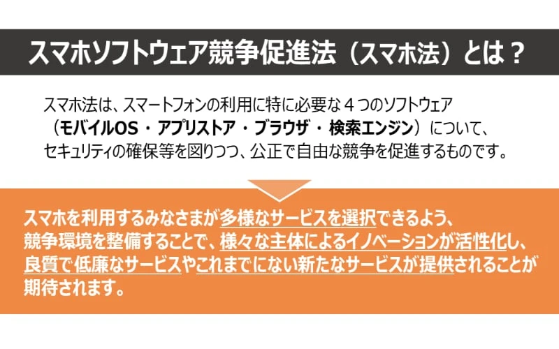
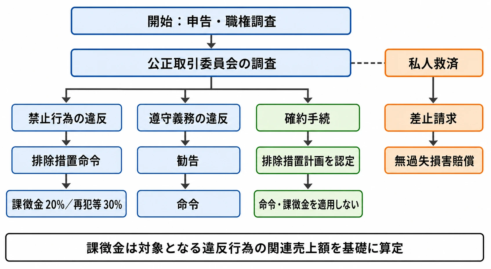
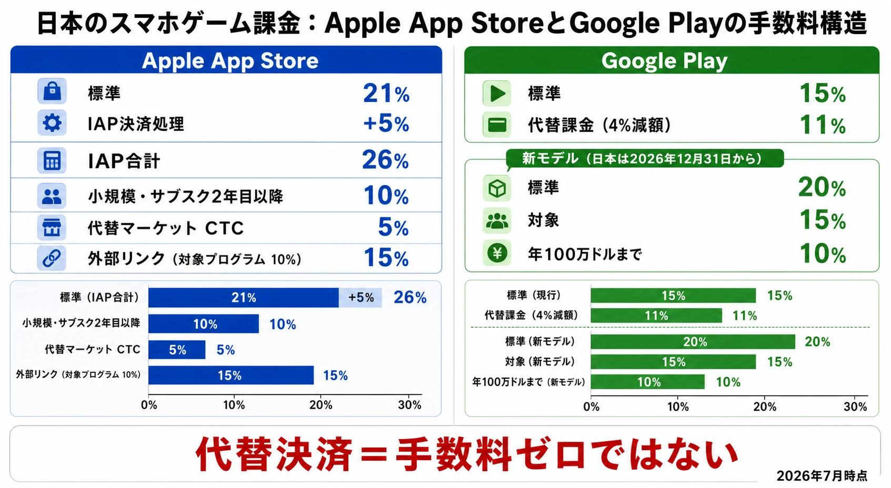

# スマートフォンソフトウェア競争促進法（スマホ新法）とゲーム業界への影響――競争法・ビジネスインパクトの角度から

スマートフォンゲームの収益設計は、ゲームの価格や課金アイテムの設計だけで決まるものではない。どのOSで動かし、どのストアで配信し、どの決済を使い、プレイヤーをどこへ案内できるかという、プラットフォームのルールにも左右される。

2025年12月18日に全面施行された「スマートフォンにおいて利用される特定ソフトウェアに係る競争の促進に関する法律」は、一般に「スマホ新法」や「スマホ法」と呼ばれる。本法は、スマホのOSやアプリストアをめぐる競争を促すため、一定規模以上の事業者に、事前に定められた禁止事項と遵守義務を課す法律である。[[1](#ref-1)]

本稿では、ストアの審査手順や表現ガイドラインではなく、競争法としての制度設計と、ゲーム事業の収益・運営に生じる影響に焦点を当てる。結論からいえば、スマホ新法は「App StoreとGoogle Playの手数料を直ちにゼロにする法律」ではない。代替ストア、代替決済、外部ウェブサイトへの誘導、OS機能へのアクセスをめぐる交渉力を変え、その結果として手数料や契約条件に競争圧力をかける法律である。

なお、以下の記述は2026年7月時点の公開資料に基づくものである。AppleやGoogleが今後料金・プログラムを変更する可能性があるため、実際の導入時には各社の最新規約と公正取引委員会の最新情報を確認する必要がある。

***

## 1. なぜスマホ新法が必要になったのか

### スマホは「二つのOSがある市場」ではなく、複数市場を束ねる生態系である

スマホの競争を考えるとき、端末の価格だけを見てはいけない。モバイルOS、アプリストア、ブラウザ、検索、決済、通知、認証、端末機能へのアクセスが一つの利用環境として結び付いているからである。政府の競争評価では、こうしたまとまりを「モバイル・エコシステム」と呼び、OSやストアを提供する事業者がルール設定を通じて強い影響力を持つことが競争上の懸念として整理された。[[2](#ref-2)]

ゲーム会社から見ると、問題は「ストアが一社しかない」ことだけではない。次のような依存関係が同時に発生する点にある。

- プレイヤーが最初にゲームを発見する場所がストアに集中する
- アプリの配信、アップデート、返金、年齢・不正利用対策がストアの仕組みに依存する
- ゲーム内のアイテムやサブスクリプションの決済が、ストアの決済システムに接続される
- ストアを運営する企業が、OSやストア上で自社サービスも提供している
- プレイヤーが獲得した購入履歴やアカウント情報を別の経路へ移すことが難しい

この構造では、ゲーム会社がストアの条件に不満を持っていても、配信をやめればプレイヤーへの接点を大きく失う。個々のゲーム会社が単独で交渉するより、プラットフォーム側のルールが事実上の業界標準になりやすいのである。

### 独占禁止法との違いは「違反を待つ」だけではないことにある

従来の競争法では、個別の行為が市場を閉鎖したか、競争を実質的に制限したかを調査し、違反を認定してから是正するという事後的な対応が中心になる。デジタル市場では、調査と訴訟に時間がかかる間にも、利用者や事業者が一つのエコシステムに固定される可能性がある。

そこでスマホ新法は、競争上の影響力が特に大きい事業者をあらかじめ指定し、一定の行為を類型的に禁止する事前規制を採用した。ただし、セキュリティ、プライバシー、青少年保護などを理由とする例外も置かれている。競争促進と安全確保を単純な二者択一にせず、正当化事由の有無を個別に判断する設計である。[[3](#ref-3)]

したがって、ゲームプランナーが見るべき変化は「審査がなくなる」ことではない。審査や安全対策を維持しながら、その条件が自社サービスだけに有利なものになっていないか、代替手段を使う事業者に不合理な負担を課していないかが、競争法上の論点になることである。

***

## 2. 日本法の対象――誰が指定され、何が変わるのか

### 「指定事業者」は、規模基準を満たす特定ソフトウェアの提供者である

スマホ新法における「指定事業者」とは、法律の対象になるソフトウェアを提供する事業者のうち、政令で定めた規模以上で、公正取引委員会から指定を受けた事業者を指す。初めて聞く人向けにいえば、スマホ市場で他社の事業活動を排除・支配し得るほど大きなOSやストアの提供者に、特別な競争ルールを適用する仕組みである。

対象になる「特定ソフトウェア」は、次の四種類である。

1. 基本動作ソフトウェア、つまりモバイルOS
2. アプリストア
3. ブラウザ
4. 検索エンジン

指定基準は、特定ソフトウェアごとに、国内向けに提供されるサービスを月1回以上利用するスマートフォン利用者数を年度の各月で平均し、4,000万人以上とするものである。会社全体の売上高だけで一括指定するのではなく、ソフトウェアの種類ごとに利用者規模を見る点が重要である。[[4](#ref-4)]

2025年3月に公正取引委員会が公表した指定では、Apple Inc.が基本動作ソフトウェア、アプリストア、ブラウザ、iTunes株式会社がアプリストア、Google LLCが基本動作ソフトウェア、アプリストア、ブラウザ、検索エンジンについて指定された。Apple Inc.とiTunes株式会社は、アプリストアを共同提供する関係として扱われている。[[5](#ref-5)]

この指定は「AppleとGoogleという会社がすべての事業で規制される」という意味ではない。どの指定を受けたかに応じて、禁止事項や遵守義務の対象となるソフトウェアが決まる。

### ゲーム事業に直結する禁止事項

ゲーム会社に影響が大きいものは、次の五つに整理できる。

#### 1. 取得したデータを自社サービスに不当に使うことの禁止

OSやアプリストアの提供を通じて得た他社ゲームの売上、仕様、利用状況などの非公開データを、競合する自社サービスのために使うことが禁じられる。たとえば、ストア運営者が他社ゲームの販売動向を把握し、その情報を使って自社ゲームの企画や販促を有利にすることが典型的な問題になる。

これは、単にデータを取得すること自体を禁止する規定ではない。どのデータを何の目的で取得・利用するのかを開示し、競争相手の事業に不当に転用しないことを求める規律である。

#### 2. 個別アプリ事業者への不公正な取扱いの禁止

ストア内の表示、検索、機能利用、契約条件などについて、競合関係にある事業者を不当に差別してはならない。ゲーム会社にとっては、決済方法を変えたことを理由に検索順位を下げる、特定の表示機能を使わせない、同じ条件の会社に異なる契約を適用する、といった行為が問題になり得る。

#### 3. 代替アプリストアを妨げることの禁止

指定事業者は、自社ストアだけに限定するなど、他社がアプリストアを提供することを妨げてはならない。これにより、ゲーム会社は自社ストア、パブリッシャー横断型ストア、特定ジャンルに特化したストアなどを事業選択肢として検討できる。

ただし、日本法は、ウェブサイトからアプリを直接ダウンロードすることまで一律に義務付けているわけではない。代替ストアの構築・運営には、認証、審査、アップデート、不正対策、問い合わせ対応などのコストが残る。法的に入口が開くことと、利用者が実際に使うストアが育つことは別問題である。[[6](#ref-6)]

#### 4. OS機能へのアクセスを不当に妨げることの禁止

OSが制御する機能について、指定事業者が自社アプリに利用させる場合と同等の性能で、他のアプリ事業者が利用することを不当に妨げてはならない。ゲームでは、認証、通知、決済、音声、外部機器連携、近距離無線通信など、プレイヤー体験に関わるOS機能が対象になり得る。

もっとも、セキュリティやプライバシーなどの保護に必要な場合は、正当化事由が認められる余地がある。したがって「ゲーム会社が要求すれば必ずAPIを開放しなければならない」という意味ではなく、拒否や制限の目的・方法・影響が説明可能であることが問われる。

#### 5. 代替決済や外部ウェブサイトへの誘導を妨げることの禁止

アプリ内課金（IAP）とは、ゲーム内で販売する有料アイテム、仮想通貨、サブスクリプションなどのデジタル商品を、アプリ内で購入する仕組みである。スマホ新法は、指定事業者が提供する決済システムだけを使うよう条件付けることや、他社の決済システムを実質的に使いにくくすることを禁止する。

また、ゲーム内で外部ウェブサイトの価格やキャンペーンを知らせたり、関連ウェブページへ誘導したりすることを制限してはならない。これがいわゆるアンチステアリング規制への対応である。アンチステアリング規制とは、アプリ事業者が利用者に外部の購入先を知らせたり、そこへ案内したりすることをプラットフォームが妨げるルールを指す。

この規定の実務上の焦点は、リンクの有無だけではない。代替決済を選んだゲームだけを検索で不利にする、外部決済のボタンを小さく表示させる、導入申請を不合理に遅らせる、代替決済を使うと過度な金銭負担が発生する契約にする、といった「使えるが、実際には選べない」状態も問題になり得る。公正取引委員会の指針は、代替決済の利用を困難にする蓋然性を、行為の態様、期間、ゲーム会社と利用者への影響などから総合判断すると整理している。[[7](#ref-7)]

### 指定事業者に課される遵守義務

禁止事項だけでなく、指定事業者には競争を機能させるための仕組みづくりも求められる。ゲーム事業に関係するものは次の通りである。

- データの取得・使用条件を事業者に開示する
- 利用者が指定した相手へ、データを円滑に移転できるようにする
- ブラウザや検索エンジンなどについて、選択画面を表示する
- 追加インストールやアンインストールに関する利用者の選択を確保する
- OS、ストア、ブラウザの仕様変更を開示し、事業者が対応する期間を確保する
- 仕様変更を公正に扱う体制、苦情処理・紛争解決の体制、国内管理人を整備する
- 法の遵守状況を記載した報告書を毎年度提出する

ゲーム会社にとって、最後の二つは見落としやすい。ルールの内容だけでなく、変更理由、変更時期、問い合わせ窓口、異議申立ての手順が見えることで、アップデート計画や決済移行計画を立てやすくなるからである。

*出典：公正取引委員会「スマホ法とは」[スマホソフトウェア競争促進法（スマホ法）][1]。本文の制度説明を補足するため、原図を改変せずに引用。*

***

## 3. 違反時の執行スキーム――何が起きるのか

### 申告、職権調査、報告徴収

スマホ新法では、誰でも違反の事実があると思うときに、公正取引委員会へ報告し、適当な措置を求めることができる。指定事業者は、その報告を理由に、報告者を不利益に扱ってはならない。

公正取引委員会は、申告を受けた場合に必要な調査を行うほか、職権で調査を開始することもできる。調査では、関係人への出頭・報告要求、資料提出命令、立入検査などが可能である。ゲーム会社が実務上備えるべきものは、規約のスクリーンショットだけではない。料金表の変更履歴、決済導線の画面、申請日、問い合わせ記録、売上への影響、同一条件の他社との比較など、行為と影響を時系列で再現できる資料である。

### 排除措置命令と課徴金

違反が認められた場合、公正取引委員会は、行為の差止め、事業の一部譲渡など、違反を排除するために必要な措置を命じることができる。これは単に「違反しています」と公表するだけではなく、契約やシステムの変更を求める命令である。

課徴金は、すべての禁止事項に一律に付くわけではない。第7条のOS機能・アプリストアなどに関する一定の禁止行為と、第8条のうち代替決済・リンクアウトに関する部分が対象で、違反行為に関係する商品・役務の売上額に原則20％を乗じた額とされる。過去10年以内に課徴金納付命令を受けていたなど一定の場合には、算定率が30％に加重される。[[8](#ref-8)]

この点は、ゲーム会社にとって実務上重要である。課徴金は会社全体の売上高に対して自動的に掛かるのではなく、違反行為に関係する売上額を基礎に算定される。したがって、どのサービス、どの期間、どの決済・配信条件が対象なのかを、会計・法務・プロダクトの間で切り分ける必要がある。

### 勧告、命令、確約手続

指定事業者が遵守義務に違反した場合、公正取引委員会は、違反行為をやめることや必要な措置を講じることを勧告できる。勧告を受けても正当な理由なく対応しない場合は、措置命令に移る。

一方、違反の疑いがある行為について、指定事業者が自ら排除措置計画を作成し、公正取引委員会の認定を受ける確約手続も設けられている。計画が十分で確実に実施される見込みがあると認められれば、その認定に係る行為について排除措置命令や課徴金納付命令を適用しない仕組みである。

これは「違反しても計画を出せば許される」という制度ではない。是正内容が十分で、実施可能であることが条件であり、計画に従わなければ認定取消しの対象になる。プラットフォームの規約を一度変更して終わりではなく、運用、表示、申請処理、監査を継続して改善できるかが問われる。

### 民事上の救済もある

禁止行為によって利益を侵害された事業者は、著しい損害などの要件を満たせば、指定事業者に対して侵害の停止・予防を請求できる。また、禁止行為をした指定事業者には、被害者への無過失損害賠償責任が規定されている。[[8](#ref-8)]

ゲーム会社がただちに訴訟を起こすべきだという話ではない。重要なのは、公取委への申告、業界団体を通じた意見提出、契約交渉、民事手続が、制度上それぞれ用意されていることである。小規模な開発会社でも、個社だけで抱え込まず、同種事例を記録して共有する意味が大きくなった。

*図：申告・調査から行政上の措置、確約手続、私人救済までの対応フロー。出典：[公正取引委員会「スマートフォン競争促進法の法律本文：違反に対する措置等」][8]。*

***

## 4. EUのデジタル市場法（DMA）との違い

### 似ているのは「大きなプラットフォームに事前ルールを課す」点である

EUのデジタル市場法（DMA）は、巨大なオンラインプラットフォームを「ゲートキーパー」として指定し、事業者と利用者の間の重要な入口を握るサービスに、すべきこと・してはいけないことを直接課す法律である。ゲートキーパーは、単に知名度が高い企業という意味ではなく、重要な入口として機能し、影響力が大きく、安定した地位を持つ事業者という法的な分類である。

日本の指定事業者も、他の事業者の活動を排除・支配し得る規模を基準に指定されるため、経済的な役割は似ている。しかし、両制度は同じものではない。

| 比較項目 | 日本のスマホ新法 | EUのDMA |
| --- | --- | --- |
| 指定の入口 | 特定ソフトウェアごとの国内利用者規模 | 企業の影響力、重要な入口、定着・持続性を基本に、売上高・企業価値・利用者数などの推定基準を併用 |
| 主な量的基準 | 年度各月の平均利用者数4,000万人以上 | EU域内の月間エンドユーザー4,500万人以上、年間ビジネスユーザー1万人以上、売上高75億ユーロ以上または企業価値750億ユーロ以上など |
| 主な対象 | モバイルOS、アプリストア、ブラウザ、検索エンジン | アプリストアに相当するオンライン仲介、OS、検索、ブラウザ、広告、SNS、メッセージングなどのコアプラットフォームサービス |
| 適用単位 | 指定事業者と、その指定に係る特定ソフトウェア | 企業をゲートキーパーに指定し、個々のコアプラットフォームサービスを対象に義務を適用 |
| 代替配信 | 代替アプリストアを妨げてはならないが、ウェブからの直接配信まで一律に義務付けるわけではない | iOSでは第三者アプリストアやウェブからのアプリ配信を可能にする義務がある |
| 主な執行者 | 公正取引委員会。必要に応じて関係行政機関と連携 | 欧州委員会がDMAの単独執行者 |
| 金銭制裁 | 対象となる違反行為の関連売上額に原則20％、再犯等は30％ | 全世界売上高の最大10％、再違反では最大20％。履行強制金や、最後の手段として構造的救済もあり |

DMAの指定基準は、EU域内における大きな経済力と、企業・利用者を結ぶ入口としての利用規模、地位の持続性を組み合わせる考え方である。日本法の4,000万人基準は、国内のスマホ利用者に対する市場影響力を、ソフトウェア単位で切り出して見る設計である。[[9](#ref-9)]

### ゲーム会社にとっての実感差

ゲーム会社の実務では、DMAの方が「代替配信と外部決済の選択肢を先に広げる」色が強い。一方、日本法はOS、ストア、ブラウザ、検索を一つの国内制度で対象にし、JFTCが報告書と情報提供を通じて運用を監視する構造である。

制裁の比較では、DMAの「全世界売上高の最大10％・再違反20％」という上限が目立つ。日本法の課徴金率は関連売上額に対する20％・30％であり、基礎となる売上の切り分け方が異なるため、数字だけを並べて単純に重さを比較してはいけない。それでも、両制度とも「規約を守らなければ少額の行政指導で終わる」とは考えにくい水準の抑止力を持たせている。

また、DMAではAppleが代替配信に対して導入したCore Technology Fee（CTF）が、第三者ストアやアプリの実効性を弱める条件ではないかと欧州委員会から問題視された。日本でも、代替手段を形式的に認めながら料金・契約・表示で利用を難しくすれば、同様に「実効性のある選択肢か」が問われることになる。[[10](#ref-10)]

***

## 5. 手数料競争はゲームの収益構造をどう変えるか

### 手数料は決済費用だけではない

プラットフォーム側は、ストア手数料を決済処理だけの対価とは説明していない。アプリの発見、配信、アップデート、返金、税務対応、詐欺・不正利用対策、開発者向けツール、OSと端末の安全性などを含む、ストアとOSのサービス全体への対価だという説明である。

この説明には実務上の意味がある。外部決済へ移れば、決済代行会社の手数料が必要になるだけではない。購入履歴、返金、チャージバック、未成年者対応、サブスクリプションの復旧、税務、問い合わせ、アカウント連携をゲーム会社が担う範囲が広がる。表面上の手数料率だけを比べると、移行コストを過小評価する。

他方、ストアのネットワーク効果とロックインが強い場合、プラットフォームが自分で設定した手数料を、ゲーム会社が受け入れざるを得ないこともある。スマホ新法の狙いは、ストアの機能を無償化することではなく、別のストアや決済が実際に選択肢になる程度に競争圧力を働かせることである。

### 引き下げの実例は、法制化前から始まっていた

Appleは2020年、年間収益100万ドル以下の小規模事業者などを対象に、App Storeの有料アプリとIAPの手数料を30％から15％へ引き下げるApp Store Small Business Programを発表した。Googleも2021年、デジタル商品・サービスについて、開発者1社あたり年間100万ドルまでの売上に対するGoogle Playのサービス手数料を15％とした。[[11](#ref-11)][[12](#ref-12)]

この二つは、競争法の施行による一律引き下げではない。小規模事業者、サブスクリプション、特定ジャンルなどに条件を付けた段階料金である。そのため、売上規模の大きい運営型ゲームでは、適用範囲と対象売上を確認しなければならない。

### 日本でのAppleの料金構造

Appleが日本向けに公開している2026年時点の条件では、App Storeでのデジタル商品・サービスに対する標準のApp Store commissionは21％である。AppleのIAPを使う場合は、これに5％のApple payment processing feeが加わるため、単純合算では26％となる。小規模事業者向けプログラムや、自動更新サブスクリプションの2年目以降などは10％の条件がある。

代替決済をアプリ内で使う場合は、Appleの決済処理を使わないため5％の決済処理料はかからないが、App Store commissionの対象は残る。外部ウェブサイトへリンクして販売する場合も、リンクをタップしてから7日以内の購入について、ストアサービスの手数料が設定されている。つまり、代替決済が認められたことと、Appleへの支払いがゼロになることは同じではない。[[13](#ref-13)]

ゲームの料金設計では、次の式で考えるとよい。

$$
\begin{aligned}
\text{純収益} ={}& \text{プレイヤー支払額} \\
&- \text{プラットフォーム手数料} \\
&- \text{決済代行費} \\
&- \text{税・返金・チャージバック対応費} \\
&- \text{導入・運用費}
\end{aligned}
$$

外部決済の方が有利になるのは、プラットフォーム手数料の差が、決済・サポート・不正対策の追加コストを上回る場合である。重課金ユーザーが多いゲームでは率の差が大きな金額になる一方、取引件数が少ないゲームでは、個別実装や問い合わせ体制の固定費が相対的に重くなる。

### AppleのCore Technology Commissionという対抗策

Core Technology Commission（CTC）は、Appleが開発者向けツール、技術、サービスなどの価値を理由として、App Store以外の代替アプリマーケットプレイスから配信されるiOSアプリや、その中のデジタル商品・サービスの売上に課す5％の手数料である。日本では、代替ストアや、そのストアから配信されるアプリが対象になる。

これは、従来の「ストアでの販売手数料」とは別の考え方で、配信経路が変わってもAppleプラットフォーム上の技術基盤を利用する以上、一定の対価を求める仕組みである。プラットフォーム側から見れば収益の防衛策であり、ゲーム会社から見れば代替ストアの経済性を評価する際のコストである。

EUでは、DMA対応として当初導入されたCTFが、2026年からデジタル商品・サービス売上に対するCTCへ移行する方針が示されている。代替ストアを認めることと、プラットフォームがどの費用を請求できるかは、別の競争政策上の争点なのである。[[14](#ref-14)]

### Googleの代替決済は「選択肢」だが、手数料は残る

Google Playでは、日本のユーザー向けに、Google Playの課金システムと代替課金システムを並べるユーザー選択型決済がゲームにも広げられた。代替課金を使った取引では、通常のサービス手数料から4％引き下げる条件が示されている。たとえば、15％の対象取引なら11％になる計算である。

一方、Googleは代替決済を使ってもサービス手数料を徴収する。Googleはこの手数料を単なる決済手数料ではなく、AndroidとGoogle Playの提供価値への対価と説明している。開発者は、決済事業者との契約、PCI-DSS対応、購入報告、問い合わせ、返金、サブスクリプション管理を自ら担う必要がある。[[15](#ref-15)]

さらにGoogleは2026年3月、地域ごとに請求手数料とサービス手数料を分け、IAPの新規インストールに対するサービス手数料を20％へ下げる新モデルを発表した。ただし、日本での導入予定日は2026年12月31日であり、2026年7月時点の日本のゲーム運営条件として扱うべきではない。[[16](#ref-16)]

### 代替決済は普及しているのか

現時点で、国内ゲーム市場全体について、代替決済がIAPの何％を占めるかを示す公的な普及率は確認できない。したがって、「新法で外部決済が一気に主流になった」とは言えない。

公表資料から確認できるのは、利用可能性と導入障壁である。Googleが2025年に日本のアプリ開発者253社を対象に実施した調査では、4社に3社が代替的なアプリ内決済を重要視する一方、ユーザーの混乱、支払情報への不安、機能の限定性、外部システムの開発・セキュリティ対応コストへの懸念も示された。この調査はGoogleが委託したもので、市場全体の利用率を示す統計ではない点に注意が必要である。[[17](#ref-17)]

ゲームの場合、外部決済へ移行するかは、手数料率だけでなく次の判断になる。

- 重課金・中課金・微課金・無課金ユーザーのどの層が外部決済を使うか
- 外部決済を使わないプレイヤーにも同じ価格・同じ商品を提供するか
- 二つの決済導線を並べることで購入率や問い合わせ率が変わるか
- 購入履歴をゲームアカウントと正確に同期できるか
- 返金、チャージバック、未成年者の購入、アカウント乗っ取りに対応できるか
- 日本版だけ別の決済を導入する運用コストが、海外版との共通化メリットを上回るか

競争圧力によって料金を下げられる可能性はある。しかし、外部決済の導入を目的化すると、決済事故やサポート品質の低下が収益改善を打ち消す。導入するなら、まず対象ユーザー、価格差、運用責任、撤退条件を事業計画に置く必要がある。

*図：日本国内におけるApple App StoreとGoogle Playの手数料構造（2026年7月時点）。出典：[Apple Developer「日本におけるiOSの変更」][13]、[Google Play Console ヘルプ「Google Playのサービス手数料引き下げについて」][16]。*

***

## 6. 国内ゲーム業界と開発現場の受け止め

### 業界団体は基本的に歓迎しつつ、実効性を問題にしている

2024年の法案段階では、MCF、JOGA、日本eスポーツ連合、CESAなど7団体が共同声明を出し、手数料低減、課金手段の多様化、一方的なルールへの依存からの転換を求めた。CESAも賛同団体に含まれており、ゲーム業界団体が制度の方向性を支持したことは確認できる。[[18](#ref-18)]

全面施行後の2026年2月には、MCF、JOGA、CESAなど7団体が緊急共同声明を出した。声明は、全面施行と、アプリ内に外部販売の情報や誘導情報を表示できるようになったことを歓迎する一方、AppleとGoogleの新規約に手数料や条件が残り、代替決済が実効的な選択肢になっていないとして、国際的なイコールフッティングとさらなる改善を要望している。[[19](#ref-19)]

ここから読み取れる業界の立場は、単純な「ストア反対」ではない。配信、決済、安全対策を担うプラットフォームの価値は認めつつ、料金・契約・外部誘導の条件が、実際の競争を妨げない水準であることを求めているのである。

### 開発現場で起きるのは、決済SDKの差し替えだけではない

ゲーム会社が代替決済を検討するとき、作業は決済画面の追加だけで終わらない。少なくとも次の担当領域が関係する。

- **プロダクト設計**：どの画面でどの決済を提示し、価格差をどう説明するか
- **クライアント開発**：決済結果を受け取り、アイテム付与や復旧を安全に行うか
- **サーバー開発**：二つ以上の決済元を統合し、重複付与や不正利用を防ぐか
- **アカウント設計**：端末、ストアアカウント、ゲームアカウントをどう紐付けるか
- **CS・運営**：返金、未反映、二重購入、解約、未成年者対応を誰が受けるか
- **法務・経理**：契約、税、個人情報、決済情報、取引記録をどう管理するか
- **分析**：決済経路ごとの購入率、客単価、継続率、返金率を比較するか

このため、開発現場では「手数料が数ポイント下がるならすぐ導入」という判断になりにくい。既存IAPの安定性、ユーザーの安心感、海外版との共通実装、運用チームの負荷を含めた総コストで見る必要がある。

逆に、長期運営タイトルや高いデジタル売上を持つタイトルでは、外部決済の選択肢が価格交渉力を生む可能性がある。実際に外部決済へ移行しなくても、「別経路を構築できる」ことが、プラットフォームとの契約条件を見直す交渉材料になるからである。

### 施行後に確認できる実務上の変化

2025年12月18日の全面施行後、Apple、iTunes株式会社、Googleは遵守報告書を提出し、公正取引委員会は2026年2月に秘密部分を除いて公表した。ただし、公正取引委員会は、公開された内容は各社の見解であり、委員会の認定ではないと明示している。[[20](#ref-20)]

公正取引委員会の2026年6月の資料では、施行後の変化として、代替アプリストア、代替決済、文字列による外部誘導、リンクアウトに関するAppleとGoogleの新しい料金・条件、標準料率、選択画面の導入が整理されている。ゲーム会社が見るべきなのは「新しいボタンが増えたか」だけではなく、申請条件、外部誘導の対象範囲、手数料の算定期間、売上報告義務まで含む運用条件である。[[21](#ref-21)]

また、Googleは日本向けの対応として、ゲームを含むアプリにユーザー選択型決済を広げ、Google Play内の購入と自社ウェブサイトの購入を並べて提示できるプログラムを開始したと説明している。AppleもiOS 26.2以降の日本向け機能として、代替アプリマーケットプレイス、代替決済、ブラウザエンジンなどを案内している。[[22](#ref-22)][[13](#ref-13)]

ただし、これらは制度上の選択肢が増えたことを示すものであり、国内ゲーム市場で代替ストアや代替決済が十分に普及したことを示すものではない。利用者の発見行動、インストール障壁、決済への信頼、ゲーム会社の運用能力が、次の普及段階を決める。

***

## 7. ゲームプランナーが持つべき判断軸

スマホ新法への対応は、法務部門だけの仕事でも、決済SDK担当だけの仕事でもない。企画初期から、配信・収益・安全性を一つの設計問題として扱う必要がある。

### 1. まず「どの選択肢を増やしたいのか」を定義する

代替ストアを使いたいのか、外部決済を使いたいのか、外部ウェブサイトを告知したいのか、OS機能の利用条件を改善したいのかで、必要な実装と交渉相手は変わる。目的を「手数料を下げる」とだけ置くと、価格変更、ユーザー体験、CS、セキュリティの論点が抜ける。

### 2. 利用可能性と実効性を分けて評価する

契約上は外部決済を使えるとしても、手数料、表示制限、審査、申請期間、売上報告、アカウント連携が重ければ、実際の選択肢にはなりにくい。次の項目を、契約書と実機の両方で確認するべきである。

- プレイヤーに価格・キャンペーン・購入先を知らせられるか
- 外部決済導線をIAPと同じ画面品質で表示できるか
- 代替決済を選んだことによる検索や表示の不利益がないか
- 返金・解約・未成年者対応の責任分界が明確か
- 売上報告と監査に必要なデータを取得できるか

### 3. 価格差をそのままプレイヤーへ転嫁しない

外部決済で手数料が下がった場合、その差額を価格低下、ゲーム内アイテムの増量、運営期間の延長、広告・サポートの強化、会社の利益改善のどこに配分するかは事業判断である。プラットフォーム手数料の低下が、そのままプレイヤー価格の低下を意味するわけではない。

一方で、購入経路ごとに価格や商品を変えるなら、表示の分かりやすさ、アカウント間の公平性、返金条件、規約、地域差を整理しなければならない。価格差が大きいほど、プレイヤーが安い経路を探す動機も強くなるため、CSと不正対策への影響を事前に測る必要がある。

### 4. セキュリティを競争政策との対立軸にしない

代替ストアや外部決済には、マルウェア、不正アプリ、決済詐欺、個人情報漏えい、購入復旧の不整合というリスクがある。これはプラットフォーム側の説明をそのまま受け入れるべきだという意味ではない。ゲーム会社側が、自社の署名、配布物の完全性、決済トークン、購入検証、返金処理、問い合わせ証跡を設計し、どの責任を自社が負うかを明確にする必要があるという意味である。

競争促進と安全性は、どちらか一方を選ぶ問題ではない。安全対策を理由にした制限が必要なら、その目的に対して過剰でないか、同じ目的をより競争制限の少ない方法で達成できないかを比較することが、今後の制度運用の中心になる。

***

## 8. 今後の見通し――「選択肢が増えた後」の競争へ

スマホ新法の第一段階は、規約上閉じられていた入口を開くことである。しかし、入口が開いただけで競争が成立するわけではない。次の段階では、代替ストアの利用者獲得、外部決済の信頼、手数料の合理性、検索・表示の公平性、OS機能へのアクセス条件が争点になる。

公正取引委員会は、指定事業者の遵守報告書を精査し、関係する事業者からの情報や意見を集めながら運用するとしている。2026年2月時点でも、報告書への意見や、報告書の記載と実際の取引が異なるという情報を受け付ける姿勢を示している。[[20](#ref-20)]

ゲーム業界では、次の三つの変化が現実的である。

第一に、大規模な運営型ゲームほど、複数決済と複数配信経路の採算を比較するようになる。すべてのタイトルが外部決済を導入するのではなく、売上規模、地域、ユーザー構成、運用体制によって選択が分かれる。

第二に、パブリッシャーとプラットフォームの契約交渉が、手数料率だけでなく、データ利用、検索表示、アップデート期間、OS機能、問い合わせ窓口を含む総合条件へ広がる。ゲームの競争力は、ゲーム内容だけでなく「どの条件でプレイヤーに届けられるか」にも依存するからである。

第三に、プラットフォーム側も、料金体系の分解、低料率プログラム、外部決済API、登録済みストア制度などを使って、競争圧力と自社サービスの価値を両立させようとする。AppleのCTCやGoogleの新料金モデルは、その対抗策の一例である。規制によって自由化された領域を、別名目の料金や複雑な条件で囲い直していないかが、今後の執行上の焦点になる。

スマホ新法をゲームプランナーが理解する意義は、法律知識を増やすことだけではない。手数料、配信、決済、データ、セキュリティ、ユーザー体験を、同じ事業設計の中で比較できるようになることにある。

競争が生む恩恵は、必ずしも「一番安い決済」を選ぶことではない。複数の経路を比較し、プレイヤーの安心、運営の継続性、開発費、収益性、プラットフォームの提供価値を含めて、どの条件ならゲームを長く届けられるかを判断できることである。スマホ新法の実効性は、法令の施行日ではなく、こうした比較可能な選択肢がゲーム事業の現場に根付くかどうかで決まる。

## References

1. [スマホソフトウェア競争促進法の概要][1] - 公正取引委員会による法律の目的、対象ソフトウェア、全面施行日の説明。

2. [モバイル・エコシステムに関する競争評価 最終報告に関する会見][2] - モバイル・エコシステムが不可欠なインフラとなり、ルール設定を通じた影響力が競争上の懸念になるとの説明。

3. [スマホソフトウェア競争促進法の概要][3] - 競争促進とセキュリティ・プライバシー保護を両立させる制度の概要。

4. [スマホソフトウェア競争促進法に関する下位法令・指針の概要][4] - 事業規模基準、禁止事項、遵守義務、施行準備の概要。

5. [スマートフォン法における特定ソフトウェア事業者の指定について][5] - Apple、iTunes株式会社、Googleの指定対象を示す公正取引委員会の発表。

6. [スマホソフトウェア競争促進法に関する指針][6] - 代替アプリストア、代替決済、リンクアウト、OS機能利用の具体的な考え方。

7. [スマホソフトウェア競争促進法に関する指針：代替決済の利用妨害][7] - 代替決済を困難にする行為の想定例と判断要素。

8. [スマートフォン競争促進法の法律本文：違反に対する措置等][8] - 排除措置命令、20％・30％の課徴金、確約手続、差止請求、無過失損害賠償の規定。

9. [Digital Markets Act - EUR-Lex][9] - DMAのゲートキーパー指定基準、対象サービス、欧州委員会による執行の概要。

10. [Commission closes investigation into Apple’s user choice obligations][10] - Appleの代替アプリ配信条件とCore Technology Feeをめぐる欧州委員会の予備的見解。

11. [Apple、App Store Small Business Programを発表][11] - 2020年に発表された小規模事業者向け15％手数料プログラム。

12. [Google Playのサービス手数料変更][12] - 2021年から年間100万ドルまでの売上に15％を適用するGoogleの発表。

13. [日本におけるiOSの変更][13] - 日本のApp Storeにおける代替決済、代替アプリマーケットプレイス、21％・5％・15％の料金、CTCの説明。

14. [Update on apps distributed in the European Union][14] - EUにおけるAppleのCTF、CTC、代替条件、料金体系の説明。

15. [Google Playでの代替課金システム][15] - 日本を含む対象地域のユーザー選択型決済、4％減額、導入要件、報告義務。

16. [Google Playのサービス手数料引き下げについて][16] - 2026年に発表された新料金モデルと日本での導入予定時期。

17. [Google LLC スマホソフトウェア競争促進法遵守報告書][17] - 日本のアプリ開発者253社を対象とした調査と、代替決済・外部購入の導入障壁に関する記載。

18. [スマホソフトウェア競争促進法案に対する7団体による共同声明文][18] - MCF、JOGA、CESAなど7団体による法案段階の共同声明。

19. [スマホソフトウェア競争促進法が全面施行されたことに関する緊急共同声明][19] - MCF、JOGA、CESAなど7団体による施行後の要望。

20. [スマホソフトウェア競争促進法に基づく遵守報告書の公表][20] - 指定事業者の遵守報告書の公表と、各社の見解であることの注記。

21. [公正取引委員会の最近の活動状況][21] - 全面施行後の料金条件、代替ストア、代替決済、リンクアウト、選択画面の整理。

22. [スマホソフトウェア競争促進法への対応について][22] - Googleによる日本向けのユーザー選択型決済、外部購入、選択画面などの対応説明。

[1]: https://www.jftc.go.jp/msca/index.html
[2]: https://www.cao.go.jp/minister/2210_s_goto/kaiken/20230616kaiken_00001.html
[3]: https://www.jftc.go.jp/file/sumahogaiyo2.pdf
[4]: https://www.jftc.go.jp/houdou/pressrelease/2025/jul/250729_smartphone.html
[5]: https://www.jftc.go.jp/houdou/pressrelease/2025/mar/250331_smartphone.html
[6]: https://www.jftc.go.jp/houdou/pressrelease/2025/jul/250729_01-4_smartphone_shishin.pdf
[7]: https://www.jftc.go.jp/houdou/pressrelease/2025/jul/250729_01-4_smartphone_shishin.pdf
[8]: https://www.jftc.go.jp/smartphone_msca.html
[9]: https://eur-lex.europa.eu/EN/legal-content/summary/digital-markets-act.html
[10]: https://digital-strategy.ec.europa.eu/en/news/commission-closes-investigation-apples-user-choice-obligations-and-issues-preliminary-findings
[11]: https://www.apple.com/jp/newsroom/2020/11/apple-announces-app-store-small-business-program/
[12]: https://blog.google/intl/en-in/products/platforms/boosting-developer-success-on-google-play/
[13]: https://developer.apple.com/jp/support/app-distribution-in-japan
[14]: https://developer.apple.com/support/dma-and-apps-in-the-eu/
[15]: https://support.google.com/googleplay/android-developer/answer/13821247?hl=en
[16]: https://support.google.com/googleplay/android-developer/answer/16954621?hl=ja
[17]: https://www.jftc.go.jp/file.jsp?Google+LLC_junshu.pdf=
[18]: https://japanonlinegame.org/wp-content/uploads/2024/05/JOGA_release_2024_0517.pdf
[19]: https://japanonlinegame.org/wp-content/uploads/2026/02/2026_0205.pdf
[20]: https://www.jftc.go.jp/houdou/pressrelease/2026/feb/260217_sumaho_junshuhoukoku.html
[21]: https://www.jftc.go.jp/houdou/panfu_files/katsudou.pdf
[22]: https://blog.google/intl/ja-jp/company-news/outreach-initiatives/complying-with-mobile-software-competition-act/

----

この文書は、Perplexity、Claude、OpenAI Codex の3つのAIの支援を受けて著述されたものです。引用画像を除き、MIT License にて提供されています。
