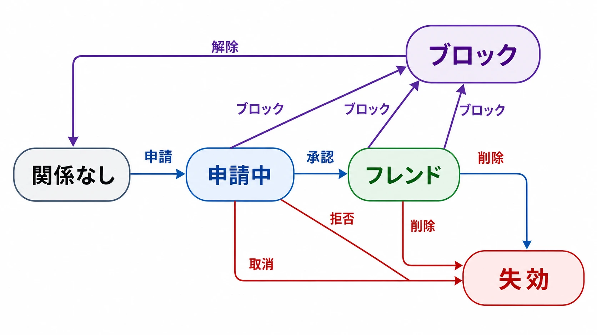
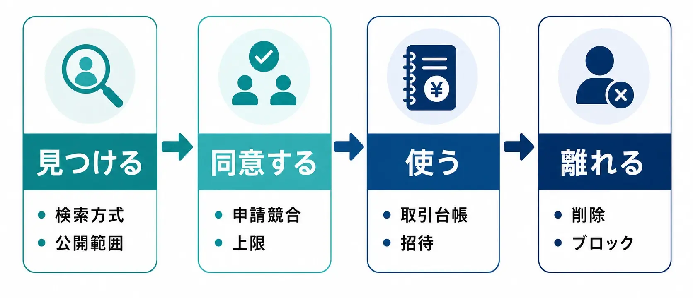
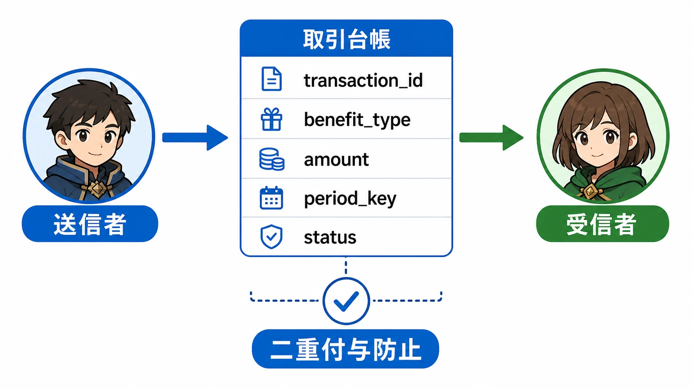
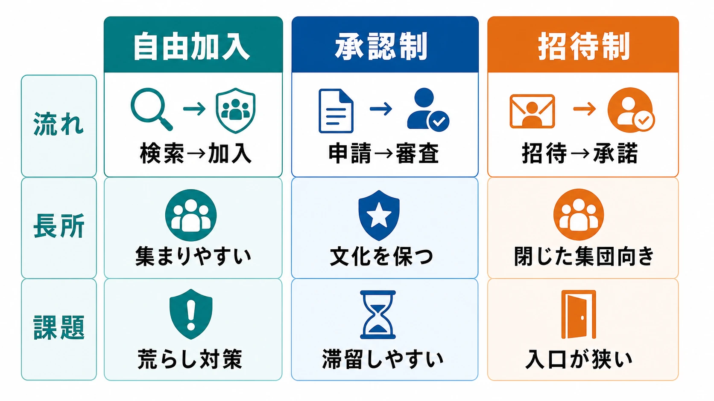
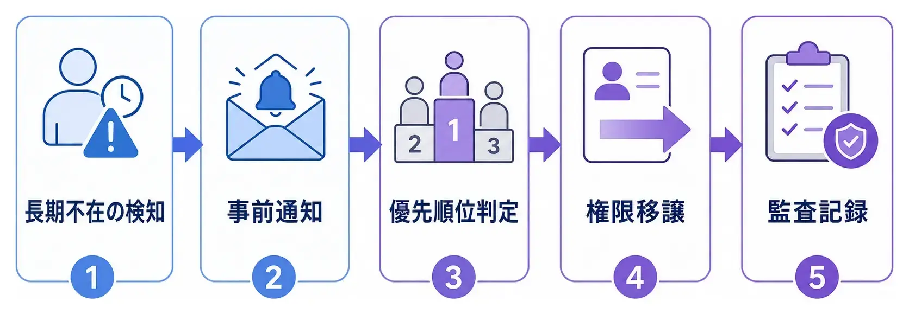
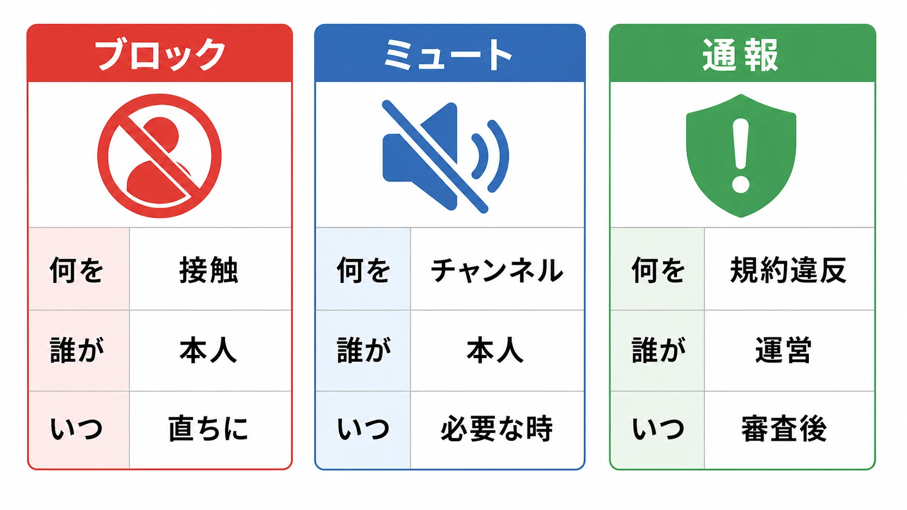

# ソーシャル機能設計の実務――フレンド・ギルドをどう作り、どう運用するか

フレンド申請ボタンを置き、ギルドを作成できるようにすれば、ソーシャル機能は完成する――わけではない。申請を送った相手が先に自分をブロックしていたらどうするか。報酬確定の直前にギルドへ加入した人へ何を配るか。唯一のマスターが利用停止になったら、誰が解散や追放を実行できるのか。

この種の問題は、画面上の機能一覧では見えにくい。しかし実装後には、データの不整合、問い合わせ、報酬の不正取得、コミュニティ内の紛争として現れる。ソーシャル機能の設計とは、人と人の関係を増やす企画ではなく、 **関係の状態、権限、公開範囲、利益、終了条件を一つの製品仕様として管理する仕事** である。

本記事は、コアループ・メタループ・ソーシャルループという全体設計を扱うものではない。この3層については「[コアループ・メタループ・ソーシャルループの3層設計](core-meta-social-loop-three-layer-game-design.md)」で扱っている。ここではフレンドとギルドを実装可能な仕様へ分解し、運用開始後に起こる問題まで先回りする。

***

## 最初に画面ではなく「関係」を定義する

ソーシャル機能の仕様書を、フレンド一覧画面から書き始めてはいけない。先に定義すべきものは、プレイヤー間の関係と状態遷移である。

Unity Friendsの公式仕様では、フレンド申請は送信者と受信者を持つ有向の関係、成立済みフレンドは双方の同意による無向の関係、ブロックは一方向の関係として扱われる。相互の申請がそろったときにフレンド関係へ変わるというモデルである。[[1](#ref-1)] この考え方をそのまま採用する必要はないが、少なくとも次の状態は区別した方がよい。

| 状態 | Aから見た意味 | Bから見た意味 | 許可する操作 |
|---|---|---|---|
| 関係なし | 未接続 | 未接続 | 申請、ブロック |
| 申請中 | 送信済み | 受信済み | 取消、承認、拒否、ブロック |
| フレンド | 成立済み | 成立済み | ギフト、招待、削除、ブロック |
| ブロック | AがBを遮断 | 詳細を知らせない | Aによる解除 |
| 失効 | 削除・退会などで終了 | 終了 | 再申請の可否を規則で決める |

*関係なし・申請中・フレンド・ブロック・失効の5状態と、状態間を移動させる操作の対応関係。*

最低限のデータは `relationship_id`、両者の不変なアカウントID、状態、申請者、作成日時、更新日時、失効日時である。表示名を主キーにしてはならない。改名、同名、文字コード差、プラットフォーム統合で破綻するからだ。

状態変更は履歴として残す。現在の状態だけでは、「申請を承認したはずなのに消えた」「自分から削除していない」という問い合わせを追えない。誰が、いつ、どのクライアント版から、どの理由で変更したかを監査イベントに記録する。ただし、プレイヤーへ見せる履歴と運営だけが参照する履歴は分ける。ブロックした事実や通報者を相手へ通知すると、報復の手掛かりになり得る。

さらに、各操作は **同じ要求が再送されても結果が増殖しない** ようにする。通信切断後の再試行で申請が二重に作られたり、ギフトが二重に届いたりする設計は危険である。クライアントが発行する操作IDを受け取り、サーバー側で処理済みか判定する方法が使える。

***

## フレンド機能は「見つける・同意する・使う・離れる」の4段階で考える

*フレンド機能は「見つける・同意する・使う・離れる」の4段階で設計する。*

### 見つける――検索しやすさと特定されにくさは両立しない

相手を見つける入口には、表示名検索、数値ID、フレンドコード、QRコード、最近一緒に遊んだ人、端末の連絡先、プラットフォームのフレンドなどがある。

表示名検索は便利だが、なりすましや誤申請が起こる。メールアドレスや電話番号の完全一致検索は強力だが、アカウントの存在確認に悪用されやすい。フレンドコードは現実の知人と安全に交換しやすい一方、入力の手間が増える。Nintendo Switchでは、Nintendo Accountに結び付いたフレンドコードから申請でき、コードを再発行する操作も用意されている。[[2](#ref-2)]

したがって検索方式は、一つへ絞るより利用場面で分けた方がよい。

- 現実の知人とは、短いコードやQRコードでつなぐ。
- 一度遊んだ相手とは、対戦・協力履歴からつなぐ。
- コミュニティ募集では、プレイヤーIDを明示的に共有してつなぐ。
- 無差別な表示名検索は、申請受信設定、レート制限、年齢設定と組み合わせる。

検索結果には、表示名だけでなく、アバター、所属、プレイヤーレベルなど識別に必要な最小限の情報を出す。ただし、最終ログイン、現在地、所持キャラクター、課金状況のような情報を検索段階で公開する必要はない。「相手を取り違えないための情報」と「相手を観察できる情報」を混同しないことが重要である。

### 同意する――正常系より例外系を先に書く

申請画面の仕様では、送信、承認、拒否だけでなく、次の競合を決める必要がある。

- AとBが同時に申請したら、その場で成立させるか。
- 承認直前に送信者が申請を取り消したら、どちらを優先するか。
- 上限到達中の相手へ申請できるか。受信箱には残すか。
- 拒否後、同じ相手が再申請できるまで待機時間を置くか。
- ブロック中の相手が別経路から招待した場合、通知を生成する前に遮断するか。
- アカウント統合・削除時に、関係をどのIDへ引き継ぐか。

フレンド上限は単なるデータベースの都合ではない。一覧の認知負荷、プレゼンス更新の配信量、ギフトの経済価値、スパム申請、運営費用を同時に制御する。Nintendo Switchは最大300人という上限を設けているが、これは全タイトルに適した正解ではない。[[3](#ref-3)] 毎日全員へギフトを送れるゲームと、一覧からパーティーへ誘うだけのゲームでは、同じ人数でも負荷が違う。

仕様では「成立済みフレンド」「送信中」「受信中」「ブロック」の各上限を別に持つかを決める。成立上限だけを設け、申請数を無制限にすると、受信箱が嫌がらせの経路になる。上限到達時には、古いフレンドの自動削除ではなく、並べ替えや最終交流日の表示など、本人が整理できる手段を用意する方が安全である。

### 使う――恩恵は関係ではなく取引として記録する

フレンド経由の恩恵には、スタミナ補助、ギフト、ゲスト参加、助っ人、応援ポイント、共同プレイ時のボーナスなどがある。Pokémon GOでは、ギフト送信や共闘などの交流でフレンドシップレベルが進み、段階に応じてレイドや交換の恩恵が変化する。ギフトから位置に関する情報が伝わり得ることも、公式ヘルプで明示されている。[[4](#ref-4)] この例は、報酬設計と公開範囲が切り離せないことを示している。

恩恵はフレンド表の列へ直接足すのではなく、独立した取引台帳として記録する。

| 項目 | 役割 |
|---|---|
| `transaction_id` | 二重付与を防ぐ一意なID |
| `sender_id` / `receiver_id` | 送受信者 |
| `benefit_type` | ギフト、スタミナ、応援ポイントなど |
| `amount` | 付与量 |
| `period_key` | 日次・週次の上限判定 |
| `relationship_snapshot` | 実行時に関係が成立していた証拠 |
| `status` | 予約、受領、失効、取消 |
| `created_at` / `claimed_at` | 送信・受領時刻 |

付与判定はサーバーで行う。「一日一回」は端末の日付ではなく、運営が定めたリセット時刻を基準にする。送信上限と受領上限も分ける。送る側に回数制限がなく、受ける側だけに上限があると、大量送信による通知スパムは止められない。

報酬量は、フレンド数に比例させすぎない方がよい。上限人数まで機械的に追加する行動、複数アカウント間の循環送付、外部掲示板でのコード収集が最適解になりやすいからだ。最初の数人との交流に価値を寄せる、受領総量に上限を置く、同一相手との反復に逓減を入れる、といった方法で「知人と遊ぶ価値」と「名簿を埋める作業」を分けられる。

ゲスト参加やゲーム招待では、招待データにロビーID、ゲームモード、参加期限、ビルド互換性、必要コンテンツ、満員時の扱いを持たせる。Steamworksも、招待を受けた相手が参加するための接続情報を渡す仕組みを提供している。[[5](#ref-5)] 招待ボタンの活性条件だけでなく、受信後にセッションが終了した、満員になった、クロスプレイ設定が合わない、といった失敗理由を表示する必要がある。

*恩恵はフレンド表の列ではなく、独立した取引台帳として記録する。*

### 離れる――削除とブロックを同じ操作にしない

フレンド削除は、成立済みの関係を終わらせる操作である。ブロックは、今後の接触を制限する一方向の安全機能である。目的が違うため、削除した相手からすぐ再申請が届く仕様はあり得ても、ブロックした相手から届いてはならない。

削除時には、未受領ギフト、共同ランキング、共有編成、予約中のパーティーをどうするかを決める。原則は、既に確定した資産を遡って没収せず、将来の権利を停止することである。ただし、フレンド成立と削除を繰り返して初回報酬を得られるなら、再成立時のクールダウンや「過去に成立済み」の履歴が必要になる。

***

## ギルドは「共有プロフィール付きの権限システム」である

ギルド、クラン、チーム、同盟は名称が違っても、永続的な集団、メンバーシップ、役職、共有データを持つ。PlayFab Groupsも、グループ作成、加入申請、招待、役職変更、メンバー削除、加入ブロック、グループデータ保存を別々の操作として提供している。[[6](#ref-6)]

最低限、次のデータを分ける。

- `guild`：不変ID、名前、説明、言語、公開設定、作成者、状態、作成日時。
- `membership`：ギルドID、プレイヤーID、役職、加入日時、最終活動日時、脱退予定、制裁状態。
- `join_request`：申請者、申請先、メッセージ、状態、有効期限、審査者。
- `invitation`：招待者、対象者、状態、有効期限。
- `role`：役職名と権限集合。
- `guild_progress`：レベル、経験値、シーズン、バージョン。
- `contribution_ledger`：誰が何によってどれだけ貢献したか。
- `audit_event`：昇格、降格、追放、設定変更、報酬確定などの履歴。

ギルド名は後から変更できるか、重複を許すか、禁止語に該当したら運営がどう仮名へ置換するかも必要である。検索用の正規化名と表示名は分ける。大文字小文字、全角半角、空白、似た文字を利用したなりすましを、表示名の完全一致だけでは防げない。

### 作成・加入・脱退・追放を状態遷移で書く

*自由加入・承認制・招待制、それぞれの長所と課題。*

加入方式は、少なくとも「自由加入」「承認制」「招待制」に分けられる。Clash of Clansでも、誰でも加入、招待または申請の承認、招待のみという設定が用意されている。[[7](#ref-7)]

自由加入は人数を集めやすく、審査の負担が小さい。その代わり、荒らしの出入りや報酬目的の渡り歩きを防ぐ規則が必要になる。承認制は文化を保ちやすいが、申請が滞留し、審査者の偏見も入り得る。招待制は閉じた集団に向く一方、新人が入口を見つけにくい。

一人が同時に複数ギルドへ所属できるかも早期に決める。複数所属を許すと交流は広がるが、ギルド対抗戦、共有資産、情報公開、報酬の帰属が複雑になる。一つに限定するなら、移籍時に旧ギルドを自動脱退させるのか、加入確定前に本人へ再確認するのかが必要である。Destiny 2では、別クランへの承認が直ちに旧クランからの離脱にならないよう、条件によって招待へ変換する処理がある。[[8](#ref-8)]

脱退と追放には、確認画面、一定時間の再加入制限、進行中イベントの報酬資格、寄付済み資産の扱いを明示する。追放理由をメンバー全体へ公開すると私刑を招く場合があるため、本人への定型理由、運営向けの内部理由、監査ログを分けた方がよい。

### 役職は名前ではなく権限表で設計する

「マスター」「サブマスター」「メンバー」という3段階だけを書いても実装仕様にはならない。必要なのは権限の一覧である。

| 操作 | マスター | サブマスター | メンバー |
|---|:---:|:---:|:---:|
| 加入申請の承認 | 可 | 可 | 不可 |
| 招待の送信 | 可 | 可 | 条件付き |
| 一般メンバーの追放 | 可 | 可 | 不可 |
| サブマスターの任命・解任 | 可 | 不可 | 不可 |
| ギルド説明の編集 | 可 | 可 | 不可 |
| 共有資産の使用 | 可 | 上限付き | 不可 |
| ギルド解散 | 可 | 不可 | 不可 |
| マスター移譲 | 可 | 不可 | 不可 |

Clash of Clansでは、長老、サブリーダー、リーダーごとに、招待、申請承認、追放、昇格などの権限が分けられている。[[9](#ref-9)] 重要なのは名称をまねることではなく、被害の大きな操作ほど権限を狭くし、連続実行を制限する考え方である。

権限判定はクライアントのボタン表示だけに頼らず、すべてサーバーで再確認する。実行中に役職が変わる競合もあるため、「画面を開いた時点ではサブマスターだった」ことを許可理由にしない。解散、マスター移譲、共有資産の大量消費には再認証、二段階確認、猶予時間、複数役職の承認を検討する。

役職を固定の序列ではなく、権限集合として持つと、イベント管理者、勧誘担当、会計担当のような役割を追加しやすい。ただし自由度が高いほど説明と問い合わせが増える。小規模タイトルでは固定役職の方が安全な場合もある。

### ギルド経験値と報酬は、集団の成長と個人の資格を分ける

ギルド経験値は、メンバーの行動を集団の進行へ変換する仕組みである。設計時には次を決める。

1. どの行動が経験値を生むか。
2. 個人・ギルド・一行動あたりの上限はあるか。
3. リセット周期と締め時刻はいつか。
4. 脱退・追放・移籍で貢献値はどうなるか。
5. ギルドレベルが下がることはあるか。
6. シーズン更新で何を残すか。

Destiny 2のクランでは、活動による個人貢献とクランXPに週次上限があり、クランレベルと特典はシーズン単位で更新される。また、加入前に獲得済みの週次報酬は受け取れず、移籍後の受領にも制限がある。[[10](#ref-10)] これは、少人数の極端な周回による進行独占と、報酬確定後だけ加入する行動を同時に抑える例である。

報酬分配には、主に次の方式がある。

| 方式 | 長所 | 問題 | 向く用途 |
|---|---|---|---|
| 在籍者へ均等配布 | 分かりやすく協力感がある | 無活動でも受け取れる | 軽い参加報酬 |
| 個人貢献に比例 | 努力を反映しやすい | 競争、作業化、役割格差を生む | 量を公平に測れる活動 |
| 閾値達成者へ配布 | 資格が明確 | 閾値直前の不満が強い | 週次ミッション |
| ギルド解放＋個人受領 | 集団目標と個人参加を両立 | 条件説明が複雑 | 段階報酬、シーズン施策 |
| 役職者が分配 | 社会的な裁量が生まれる | 横領、えこひいき、問い合わせ | 合意形成自体が遊びになる場合のみ |

実務上は、 **確定時点の所属と貢献をスナップショット化する** ことが重要である。配布処理中に加入・脱退が起きても結果を変えず、再実行しても同じ報酬になるようにする。報酬台帳にはシーズンID、ギルドID、対象者、資格判定理由、報酬版、受領状態を残す。マスターデータの更新後に過去報酬の中身が変わらないよう、報酬版も固定する。

***

## 非アクティブ、排他性、解散――運営開始後に効く仕様

### 幽霊部員を一つの最終ログイン日で決めない

非アクティブ判定を「何日ログインしていないか」だけにすると、休止中の古参、チャットだけ参加する人、低頻度の協力者を同じように扱ってしまう。見るべき信号は、最終ログイン、最終ギルド活動、イベント参加、寄付、チャット、役職、事前の休止申告などである。

システムができるのは、整理の補助である。非アクティブ候補のフィルター、最終活動日の段階表示、追放前の通知、一定期間の保護、復帰時の再申請導線を用意する。自動追放を採用するなら、初期値、警告時期、除外役職、サーバー障害中の停止条件まで決める。

より深刻なのはマスターの不在である。Clash of Clansでは、リーダーの長期不在に対して事前通知を行い、条件を満たす上位役職へ自動的にリーダーを移す仕組みがある。[[11](#ref-11)] 自作する場合は、後継者の優先順位を「役職、活動状況、在籍期間」などから決め、候補者の利用停止や辞退を扱う。自動移譲の前に本人と全体へ通知し、実行後の監査記録も残す。

*後継者不在に備えた自動移譲の手順と監査記録。*

### ギルドの閉鎖性は、ゲーム外の問題ではない

ギルドは、加入審査、役職、追放、限定報酬を通じて、内部と外部を分ける。これは共同体を作る機能であると同時に、排除の道具にもなる。初心者、特定のプレイ時間帯、成績の低い人を参加不能にする圧力は、報酬が強いほど高まりやすい。

対策は「仲良く使うように」と注意書きを置くことではない。ギルド未所属でも主要進行を失わない代替経路、ソロでも達成可能な下位報酬、公開募集の条件表示、初心者歓迎などの検索タグ、追放直後にイベント参加権を全損しない救済を仕様へ入れる。

ハラスメントはチャットだけで起こるとは限らない。繰り返しの招待、申請拒否と再申請、役職の昇降格、報酬分配、対戦メンバーからの意図的な除外も伝達経路になる。Fair Play AllianceとADLの枠組みも、問題行動を表現内容だけでなく、伝達経路、影響、原因から捉え、フレンド申請やゲーム外サービスを含む接点全体の点検を求めている。[[12](#ref-12)]

### 通報は「プレイヤーを通報」だけでは粗すぎる

通報対象を、プレイヤー、ギルド名、説明文、チャット発言、募集文、エンブレム、特定の権限操作に分ける。Xboxのコミュニティ基準でも、ゲーマータグを通報した場合はその名前が審査対象になるなど、対象とカテゴリを正しく選ぶ必要があると説明されている。[[13](#ref-13)]

通報時には、対象ID、コンテンツID、表示時点の内容、前後の文脈、通報カテゴリ、通報者、時刻、クライアント言語を保存する。後から名前や文章が編集されても、審査対象を再現できるスナップショットが要る。プレイヤーにスクリーンショット提出だけを求めると、改変の検証と収集の負担が大きい。

運営ツールには、次の機能が必要である。

- 通報対象と前後の文脈を同じ画面で確認する。
- 同一対象への通報を束ね、組織的な虚偽通報も見つける。
- 警告、コンテンツ非表示、チャット制限、役職停止、ギルド凍結、アカウント制裁を段階的に実行する。
- 誰がどの証拠を見て何を実行したかを監査する。
- 誤判定への再審査と復元を行う。
- 個人情報や有害な内容を、必要以上の担当者へ見せない。

ブロック、ミュート、通報は代替関係ではない。ブロックは本人が直ちに接触を減らす手段、ミュートは特定チャンネルを隠す手段、通報は運営が規約違反を審査する入口である。通報完了後に「同時にブロックする」を選べると、審査結果を待たず安全を確保できる。

*ブロック・ミュート・通報は代替関係ではなく、異なる役割を持つ。*

### 解散・統合・凍結を後付けしない

ギルド解散は、単純な行削除にしてはならない。共有資産、ランキング、対戦予約、未配布報酬、チャット、通報証拠、名前の再利用がぶら下がっているからだ。

安全な解散フローは、解散申請、再確認、猶予期間、全員への通知、新規加入停止、進行中イベント終了、未配布報酬の確定、論理削除、保持期限後の物理削除という段階を持つ。猶予中に取消可能とするか、運営制裁中は解散を禁止するかも決める。

統合はさらに難しい。どちらの名前、マスター、役職、レベル、共有資産を残すかという政治的問題に加え、メンバー上限、重複所属、シーズン報酬の資格が衝突する。最初から完全自動の統合機能を作らず、「移籍用招待を一括発行し、旧ギルドは告知専用にする」という段階的な移行でもよい。

凍結は、通報審査、重大な不正、マスターのアカウント回復などで一時的に変更を止める状態である。閲覧、チャット、報酬受領、加入、追放、資産消費のどれを止めるかを個別に定義する。全面停止しかないと、調査対象ではないメンバーまで不必要に巻き込む。

***

## オンライン状況は公開情報ではなくアクセス制御である

プレゼンスには、オンラインか、どのモードか、参加可能か、どのロビーか、最後にいつ遊んだか、といった情報が含まれる。便利さだけで考えると、監視や付きまといの経路になる。

AppleのGame Centerでは、ゲームがフレンド一覧へアクセスする際に本人の許可が必要であり、双方が許可したフレンドだけが一覧へ現れる。[[14](#ref-14)] Nintendo Switchも、オンライン状態を「すべてのフレンド」「ベストフレンドのみ」「誰にも見せない」、プレイ記録を「全員」「フレンド」「ベストフレンド」「誰にも見せない」から選べる。[[15](#ref-15)]

設計では、公開範囲をデータ項目ごとに分ける。

| 情報 | 公開範囲の例 | 初期値の考え方 |
|---|---|---|
| オンライン状態 | 全フレンド／お気に入り／非公開 | 年齢・地域要件を考慮して控えめにする |
| プレイ中モード | フレンド／同じギルド／非公開 | 機密性の高いモード名は隠せるようにする |
| 途中参加可否 | 招待可の相手のみ | ロビー権限と一致させる |
| 最終ログイン | ギルド役職者／全メンバー／非公開 | 正確な時刻でなく段階表示も検討する |
| プロフィール詳細 | 公開／フレンド／非公開 | 検索結果では最小限にする |

「オフライン表示」を選んだのに、ギルド名簿、対戦履歴、チャットの既読、ロビー検索から活動が分かるなら、設定は実質的に機能していない。各画面が同じ公開ポリシーを参照する必要がある。

ブロックもサービス横断で設計する。Unity Friendsでは、ブロックされた相手にプレゼンスを見せず、通知を送らせない一方、元のフレンド関係そのものは内部に残り得る。[[16](#ref-16)] 自作する場合は、フレンド解除、チャット非表示、招待遮断、マッチング回避、ギルド加入申請遮断、ランキング表示の匿名化をどこまで連動させるか決める。マッチング回避を絶対条件にすると、人口の少ない地域や高レート帯で成立しにくくなるため、「可能な範囲で避ける」と「絶対に同席させない」を用途で分ける必要がある。

***

## リテンションとK-factorは、機能の数ではなく成立した行動で測る

ソーシャル機能を導入した後、フレンド数やギルド加入率だけを成功指標にすると危険である。報酬のために無関係な相手を大量追加しても、数字は増えるからだ。

リテンションへの寄与を見るなら、導入前後の単純比較ではなく、初回フレンド成立、初回共同プレイ、初回ギルド加入などのコホートを作る。プレイ日数や到達度が高い人ほどソーシャル機能を使うという自己選択があるため、「フレンドがいる人は継続率が高い」だけで因果を断定しない。可能なら段階導入やA/Bテストを使い、通知量、報酬量、露出位置を分けて検証する。

実務で見る指標は次のように分解できる。

- 申請送信率、承認率、成立までの時間、拒否・ブロック率。
- 成立後に一度でも共同プレイやギフト交換へ進んだ割合。
- ギルド検索から加入申請、承認、初回貢献までの離脱率。
- 役職別の管理操作数、申請滞留時間、追放後の離脱率。
- 招待送信者一人あたりの有効招待数、招待から新規登録への転換率。
- 通報率、通報対象の種類、審査時間、再発率、異議申立て結果。

K-factorは、簡略化すれば「一人の既存ユーザーが送る有効招待数」と「招待された人が新規ユーザーとして成立する率」の積として見る指標である。ただし、インストールだけを成立とすると過大評価になる。チュートリアル完了、翌週の継続、招待者との初回共同プレイなど、製品にとって意味のある地点を転換条件にする方がよい。

「フレンドを招待しなければ先へ進めない」という強制型設計は、招待数を短期的に増やしても、次の運用負債を生む。

- 一人で遊びたい人や、同じゲームを遊ぶ知人がいない人を進行不能にする。
- 複数アカウント作成、使い捨てコード交換、外部でのスパムを促す。
- 招待を受ける側へ、ゲーム外の人間関係を使った圧力を移す。
- 子ども用アカウントやフレンドアクセスを許可しない利用者が不利になる。
- 招待機能や外部プラットフォームの障害が、ゲーム進行の障害になる。

招待は必須鍵ではなく、共同プレイへの短縮経路にした方が運用しやすい。招待者と被招待者の双方へ小さな恩恵を与えつつ、ソロで達成できる代替条件を用意する。報酬は「招待を送った」時点ではなく、不正判定を通過した有効な参加や継続の後に確定する。連絡先のアップロードやプラットフォームのフレンド利用には、拒否しても主要機能を使える導線を残す。

***

## 仕様レビューで使える実務チェックリスト

最後に、画面レビューだけでは抜けやすい確認事項をまとめる。

### フレンド

- 関係なし、申請中、成立、削除、ブロックの遷移と競合が定義されているか。
- 各一覧の上限、ページング、並べ替え、上限到達時の挙動があるか。
- コード再発行、申請受信停止、再申請制限があるか。
- ギフトやポイントがサーバー台帳で冪等に処理されるか。
- 削除・ブロック時の未受領報酬、招待、ランキングの扱いが決まっているか。

### ギルド

- 作成、検索、加入、承認、脱退、追放、再加入の全状態があるか。
- 役職ごとの権限表があり、サーバー側で検証されるか。
- マスター不在、利用停止、退会時の後継規則があるか。
- 経験値と報酬の締め時刻、上限、資格スナップショットがあるか。
- 解散、統合、凍結、シーズン更新後に残るデータが決まっているか。

### 安全性と運営

- 公開範囲がプロフィール、プレゼンス、ギルド名簿、履歴で一貫しているか。
- ブロックが通知、招待、チャット、加入申請へ反映されるか。
- 通報対象が具体的で、審査時の内容を再現できるか。
- 昇格、追放、解散、報酬確定の監査ログがあるか。
- 制裁の段階、再審査、誤操作からの復元手段があるか。
- KPIに成立後の共同行動、ブロック、通報、運営工数まで含まれるか。

ソーシャル機能は、プレイヤー同士へ運営の一部を委ねる仕組みでもある。だからこそ、楽しい交流の導線だけでなく、同意しない、離れる、拒む、引き継ぐ、止めるという操作が製品品質を決める。良い仕様とは関係を最大化する仕様ではない。 **望む関係を始めやすく、望まない関係を安全に終えられ、問題が起きたときに運営が事実をたどれる仕様** である。

## References

1. [Relationships][1] - 送信者・受信者を持つ `FRIEND_REQUEST`、双方合意による `FRIEND`、一方向の `BLOCK` という関係モデルを説明するUnity公式仕様。

2. [How to View or Change Your Friend Code on Nintendo Switch][2] - Nintendo Switchのフレンドコードによる申請とコード再発行を説明する任天堂公式サポート。

3. [Friend List on Nintendo Systems and Apps][3] - Nintendo Switchのフレンド申請、削除、ブロック、オンライン状態、および最大人数を説明する任天堂公式サポート。

4. [Friend List & Friendship Levels][4] - Pokémon GOのギフト、交流によるフレンドシップ進行、共同プレイの恩恵、公開情報と位置情報上の注意を説明する公式ヘルプ。

5. [ISteamFriends Interface][5] - ゲーム招待へ接続情報を付け、承認後にゲーム参加へつなぐ仕組みを示すSteamworks公式文書。

6. [Groups - REST API][6] - ギルドやクランに相当するグループの作成、申請、招待、役職変更、追放、ブロック、削除を列挙するPlayFab公式API資料。

7. [Recruiting Clan Members & Clan Notices][7] - Clash of Clansにおける自由加入、承認制、招待制の違いと募集設定を説明するSupercell公式サポート。

8. [Destiny 2 Clans Guide][8] - クランの加入方式、移籍、役職、権限、報酬、解散、通報をまとめたBungie公式ガイド。

9. [クランの役職][9] - Clash of Clansの役職別に、招待、承認、追放、昇格などの権限を説明するSupercell公式サポート。

10. [Destiny 2 Clans Guide: Clan Progression Features][10] - クランXPの個人・全体上限、シーズン更新、加入・移籍と週次報酬資格の関係を説明するBungie公式ガイド。

11. [Losing Leadership Status][11] - Clash of Clansにおける非アクティブなリーダーへの通知と自動交代条件を説明するSupercell公式サポート。

12. [Disruption and Harms in Online Gaming Framework: Assessing the Landscape][12] - フレンド申請、チャット、ゲーム外サービスを含む接点から問題行動を点検するFair Play AllianceとADLの実務資料。

13. [Xbox Community Standards][13] - ブロック、ミュート、通報と、通報対象・カテゴリを正しく選ぶ必要性を説明するXbox公式基準。

14. [Connecting players with their friends in your game][14] - Game Centerのフレンド一覧へアクセスする際の許可と、双方の許可に基づく表示範囲を説明するApple公式開発者文書。

15. [How to Edit User Profile Settings on Nintendo Switch][15] - オンライン状態、プレイ記録、申請受信、通知、ブロック一覧の公開・管理設定を説明する任天堂公式サポート。

16. [Block lists][16] - ブロックを一方向の関係として扱い、プレゼンスや通知を遮断するUnity公式仕様。

[1]: https://docs.unity.com/en-us/friends/concepts/relationships
[2]: https://en-americas-support.nintendo.com/app/answers/detail/a_id/22438
[3]: https://en-americas-support.nintendo.com/app/answers/detail/a_id/67509
[4]: https://niantic.helpshift.com/hc/en/6-pokemon-go/faq/2847-friend-list-friendship-levels-1614900279/
[5]: https://partner.steamgames.com/doc/api/ISteamFriends
[6]: https://learn.microsoft.com/en-us/rest/api/playfab/groups/groups
[7]: https://support.supercell.com/clash-of-clans/en/articles/recruiting-clan-members-3.html
[8]: https://help.bungie.net/hc/en-us/articles/360048720932-Destiny-2-Clans-Guide
[9]: https://support.supercell.com/clash-of-clans/ja/articles/clan-roles-3.html
[10]: https://help.bungie.net/hc/en-us/articles/360048720932-Destiny-2-Clans-Guide
[11]: https://support.supercell.com/clash-of-clans/en/articles/clans-automated-leader-rotation-2.html
[12]: https://www.adl.org/sites/default/files/pdfs/2022-12/fpa-framework-assessing-behavior-landscape-121520-1333.pdf
[13]: https://www.xbox.com/en-US/legal/community-standards
[14]: https://developer.apple.com/documentation/gamekit/connecting-players-with-their-friends-in-your-game
[15]: https://en-americas-support.nintendo.com/app/answers/detail/a_id/22332
[16]: https://docs.unity.com/en-us/friends/concepts/block-list

----

この文書は、Perplexity、Claude、OpenAI Codex の3つのAIの支援を受けて著述されたものです。引用画像を除き、MIT License にて提供されています。
