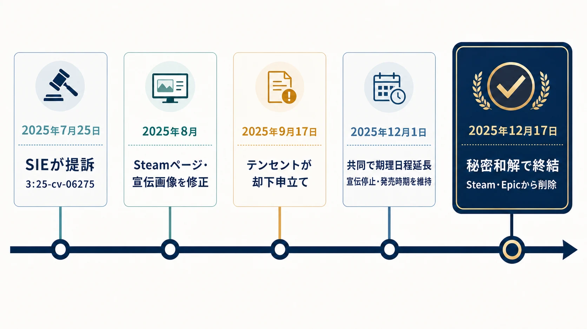
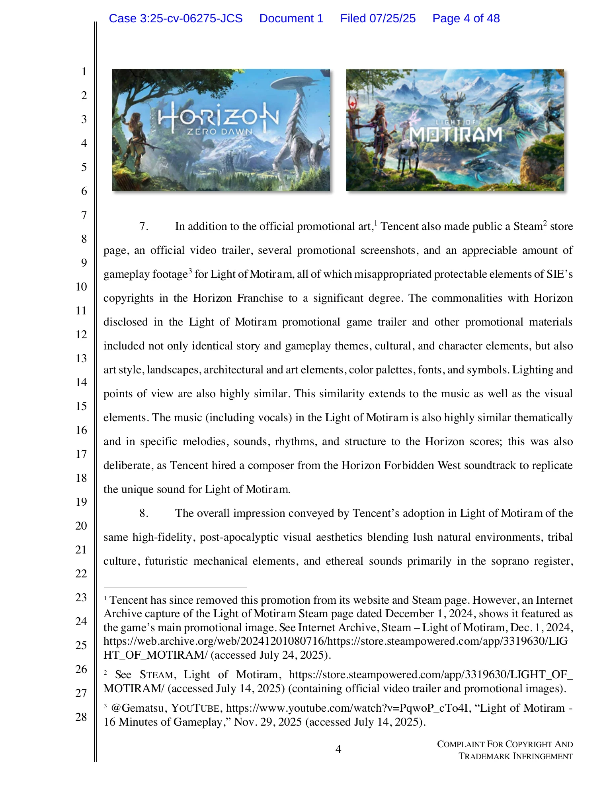
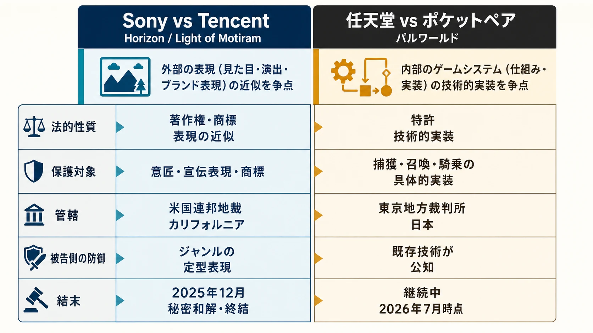

# ソニーvsテンセント『Horizon』対『Light of Motiram』訴訟の経緯と決着

## 概要

ソニー・インタラクティブエンタテインメント（SIE）は2025年7月、テンセント傘下スタジオが開発する『Light of Motiram』が自社の『Horizon』シリーズの「あからさまな模倣」であるとして、著作権・商標侵害訴訟を米カリフォルニア州北部地区連邦地方裁判所に提起した[[1](#ref-1)]。テンセントは9月に却下申立てを行い「ジャンルの定番表現を独占しようとしている」と反論し[[2](#ref-2)]、訴訟の最中にストアページや宣伝素材が静かに修正される一幕もあった[[3](#ref-3)]。最終的に2025年12月17日、両社は秘密和解に達し、訴訟は再提訴禁止の形で取り下げられ[[4](#ref-4)][[5](#ref-5)]、『Light of Motiram』はSteamとEpic Games Storeから削除された[[6](#ref-6)]。

*図：提訴から秘密和解・ストア削除までの主要な経緯。*

***

## 提訴の経緯（2025年7月）

SIEは2025年7月25日、テンセント・アメリカやProxima Beta、テンセント・ホールディングスなど複数のテンセント関連企業を被告として、著作権法および商標法違反を主張する訴状を提出した（事件番号3:25-cv-06275）。訴状によれば、テンセントは2023年頃から密かに『Light of Motiram』の開発を進めており、2024年3月のサンフランシスコでのゲーム業界カンファレンスでテンセント側がSIEに対し「Horizonの新作を共同開発しないか」と持ちかけたが、SIEはこれを断ったという。その後もテンセントは開発を継続し、Horizonと酷似した宣伝素材を用いてゲームを発表したとSIEは主張している[[1](#ref-1)]。

具体的な類似点として、SIEは以下を挙げた。

- 赤毛で部族衣装を着た女性主人公と、アーロイの「フォーカス」に酷似した装着型デバイス[[7](#ref-7)]
- 敵として登場するロボット動物（メカニマル）や、砂漠から雪山まで及ぶ環境バイオームの構成[[7](#ref-7)]
- ストアページ、トレイラー、宣伝用スクリーンショット・ゲームプレイ映像が「Horizonの著作権で保護される要素を著しく流用している」との主張[[1](#ref-1)]

SIEは登録済みHorizon著作権とアーロイキャラクター商標について「故意の侵害」の判断、配信差し止め命令、および侵害作品1件あたり最大15万ドルの損害賠償と侵害素材の破棄を求めた[[7](#ref-7)]。

*画像出典（引用）：[SIE提出訴状（2025年7月25日、4頁）](https://business.cch.com/ipld/SonyInteractiveTencentHoldingsComp20250725.pdf)。訴状に掲載された対比ページを、本文の論述に必要な範囲で無改変のまま引用。画像内のHorizon関連素材の著作権者はソニー・インタラクティブエンタテインメント、Light of Motiram関連素材の著作権者はテンセント／Polaris Quest。*

***

## テンセント側の却下申立て（2025年9月）

テンセントは2025年9月17日、Light of Motiramを実際に開発・発売するのはPolaris Quest等の別法人であるとしつつ却下申立てを提出し、SIEの訴えを「驚くべき」ものと呼び、「大衆文化のありふれた一角を独占しようとする試み」だと批判した。テンセントの主張の骨子は、赤毛の主人公、荒廃した文明、機械的な怪物といった要素はいずれも数十年にわたり多くのゲームで使われてきた「時代を超えた」ジャンルの定型表現であり、SIEが保護しようとしているのは独創的な創作物ではなく、ストーリーテリングの慣習そのものだという点にあった。加えて、裁判管轄の欠如や請求の不備、さらにLight of Motiramの発売が2027年第4四半期まで予定されていない点を挙げ、時期尚早な訴訟であることも主張した[[2](#ref-2)][[8](#ref-8)]。

***

## 訴訟中のストアページ・宣伝素材の修正

訴訟提起からわずか数週間後の2025年8月、テンセントはSteamストアページの記述や宣伝画像を控えめに変更した。「コロッサル・マシーン」や「メカニマル」といった表現、アーロイに酷似した外見の女性主人公を描いた画像や、巨大な機械生物を強調する要素が削除・修正された。この改変は訴訟と時期的に一致しており、テンセント側がリスクを認識して訴訟リスクを軽減しようとした可能性が指摘された[[3](#ref-3)]。

さらに2025年12月1日には、SIEと複数のテンセント関連法人が連名で審理スケジュールの延長を申し立てた。この共同申立てにより、SIEは仮差し止め命令の申し立てに対するテンセント側の応答期限を延長することに同意し、その見返りとしてテンセント側は次の3点を確約した。仮差し止め命令の審理が係属している間はLight of Motiramの新規の宣伝・公開テストを一切行わないこと、発売時期を（2025年8月のストアページ修正で既に設定済みだった）2027年第4四半期より前倒ししないこと、そして仮差し止め命令に関連した迅速な証拠開示手続きを求めないことである。つまりこの合意は、テンセント側が新たに発売延期を約束したものではなく、既に設定されていた2027年第4四半期という発売時期を前倒ししないという現状維持の確約だった点に注意が必要である[[9](#ref-9)][[10](#ref-10)]。

***

## 2025年12月の秘密和解による決着

2025年12月17日付の裁判所提出資料によると、両社は「秘密の和解」に達し、共同で訴訟の取り下げを申請した。文書には「保留中の申立てはすべて取り下げられ、本訴訟はここに、再提訴を禁じる形で棄却される。各当事者は自らの費用を負担する」と記されている[[4](#ref-4)]。和解と同時期に、Light of MotiramのストアページはSteamとEpic Games Storeから削除され、SteamDBでは提供終了を示す「retired」の表示に変わった[[6](#ref-6)]。テンセント・アメリカズの広報担当者は「SIEとテンセントは秘密の解決に至れたことを喜んでおり、本件について今後公にコメントすることはない。両社は今後も協力していくことを楽しみにしている」との趣旨の声明を出した[[11](#ref-11)]。和解内容自体は非公開だが、ゲームの公式サイトはストアへのリンクを残しつつも実際のリンク先は消滅しており、開発中止か大幅な仕様変更のいずれかが行われた可能性が指摘されている[[12](#ref-12)][[13](#ref-13)]。

***

## 著作権・商標が保護する範囲とジャンルの定型表現の境界線

この訴訟が業界的に注目された最大の理由は、著作権法・商標法が保護する「表現」と、誰でも自由に使える「アイデア・ジャンル的定型表現（トロープ）」の境界線が問われた点にある。米国著作権法上、アイデアそのもの（例：ポストアポカリプス世界、機械生物、部族社会というコンセプト）は保護対象外であり、保護されるのはそのアイデアを具体化した独自の表現（キャラクターデザインの詳細、特定の造形、固有の名称やロゴなど）に限られる。テンセントの却下申立ては、まさにこの原則を根拠に「赤毛の主人公」「機械動物」「荒廃した文明」といった要素は業界で広く共有されるジャンル的定型表現であり、SIEがこれらを独占しようとしているに過ぎないと主張した[[8](#ref-8)][[2](#ref-2)]。一方でSIEは、単一の要素ではなく「フォーカス」に酷似した装着デバイスの意匠、特定のバイオーム構成、宣伝素材の構図といった複数要素の組み合わせが、Horizonの独自表現を具体的に流用していると論じ、要素の集積によって「実質的類似性」が生じるという著作権侵害訴訟で典型的な論法を採った[[1](#ref-1)][[7](#ref-7)]。

なお、テンセントの却下申立てには興味深い反証も含まれている。Horizon Zero Dawnのアートディレクターを務めたヤン=バルト・ファン・ベーク氏は、開発当時の舞台裏ドキュメンタリーの中で、赤毛の女性が機械生物に支配された荒廃文明を旅するという同作の中核コンセプトが、2013年の『Enslaved: Odyssey to the West』と酷似していることを自ら認め、「この企画はやるべきではないと思う。あちらの要素に触れすぎている」と当時懸念を示していたと、テンセントは申立ての中で指摘している。SIEはこの企画を一度棚上げしたのち、独自性が乏しいと知りながら復活させたというのがテンセント側の主張である[[2](#ref-2)]。

この事件は和解によって判決が出なかったため、裁判所による明確な線引きの判例は残らなかったが、企画段階で「よくあるジャンル要素を使うこと」自体はリスクではなく、「特定作品を強く想起させる意匠・演出・宣伝表現の組み合わせ」がリスクになるという実務的な教訓を示した。

***

## 『パルワールド』特許訴訟との対比

Light of Motiram事件は米国における著作権・商標侵害訴訟だが、任天堂・ポケモン社がポケットペア『パルワールド』に対して起こした訴訟は日本国内の特許侵害訴訟であり、法的性質が根本的に異なる。任天堂側は2024年9月18日に東京地方裁判所へ提訴し、複数の特許（モンスターを捕獲する仕組みや、捕獲した生物に騎乗する仕組みなど）の侵害を主張した[[14](#ref-14)]。特許は「表現」ではなく「技術的な仕組み・アイデアの実装方法」そのものを保護する権利であるため、パルワールド側はゼルダの伝説やARK: Survival Evolved、トゥームレイダー、Titanfall 2など多数の既存作品を例示し、問題となった仕組みが既に業界で広く使われていた「公知技術」であると反論している。これはLight of Motiram事件でテンセントが採った「ジャンルの定型表現論」と構造的に似た防御ロジックであり、テンセントの却下申立て自体もゼルダの伝説やFar Cryシリーズ、Outer Wilds、Enslavedなどを同様の先行例として列挙していた[[2](#ref-2)]。

*図：争点となる権利、保護対象、管轄、防御ロジック、結末を対比した補助図。*

両事件はいずれも「大手パブリッシャーが新興・競合タイトルの模倣性を法的手段で問う」という構図は共通するが、著作権・商標は表現の外形的な近似性が問題になるのに対し、特許は内部的なゲームシステムの実装方法そのものが問題になる点で本質的に異なる。企画担当者にとっては、「見た目やキャラクター設定の近似」への注意と「操作・システムの実装方法の近似」への注意は、それぞれ別の法的リスク領域として管理する必要があることを示す好例といえる。

任天堂対ポケットペアの訴訟の経緯や、係争の背景にあるゲームデザイン面の分析については、関連記事「[『パルワールド』訴訟はゲームデザインをどう動かしたか――特許係争と1.0正式版までの歩み](palworld-nintendo-patent-lawsuit-and-game-design-analysis.md)」で詳しく整理している。

***

## 企画段階で独自性を検証する実務的な視点

新規タイトルの企画・開発初期段階でリスクを低減するための実務的なチェックポイントは、本事件の展開から次のように整理できる。

- 単一要素（赤毛の主人公、機械動物など）はジャンル的定型表現として保護対象外になりやすいが、複数要素の組み合わせ（デバイスの意匠、バイオーム構成、宣伝の構図まで）が既存作品と高い一致度を示すと「実質的類似性」のリスクが高まる[[1](#ref-1)][[7](#ref-7)]。
- 競合他社への協業提案を断られた直後に類似コンセプトを発表するなど、時系列上の経緯自体が「模倣の意図」を推認させる材料になり得るため、企画の着想時期や社内記録を明確に管理しておくことが望ましい[[1](#ref-1)]。
- 宣伝素材（ストアページの説明文、トレイラー、スクリーンショット）は法的リスクが顕在化した際に迅速な修正対象となりやすく、実際にテンセントは提訴後に「コロッサル・マシーン」等の表現や画像を差し替えた。企画段階からマーケティング表現が既存IPの宣伝素材とどの程度近似しているかを事前レビューする体制が有効である[[3](#ref-3)]。
- 著作権・商標のリスクと特許のリスクは別軸で検証する必要がある。キャラクターデザインやビジュアル面は著作権・商標の観点、捕獲・育成・戦闘といったゲームシステムの実装は特許の観点から、それぞれ独立してチェックするプロセスを企画書レビューに組み込むことが望ましい[[14](#ref-14)][[2](#ref-2)]。
- 訴訟が長期化・大型化すると、和解に終わった場合でも新規の宣伝・公開テストの停止といった実害が発生し得るため、開発初期段階での法務レビューは公開後の対応よりコストが低い[[9](#ref-9)][[2](#ref-2)]。

秘密和解で終わった本件は判例としての法的拘束力を残さなかったが、著作権・商標が保護する範囲とジャンル表現の境界という論点、そして訴訟がもたらす事業上のインパクトの大きさを示す事例として、企画実務における独自性検証の重要な参考材料となる。

## References

1. [Sony sues Tencent, claiming its Light of Motiram game is a "slavish clone" of its Horizon series][1] - SIEの提訴と主張の概要。

2. ["Sony Seeks an Impermissible Monopoly on Genre Conventions": Tencent Says Sony's Horizon Lawsuit Tries to "Fence Off a Well-Trodden Corner of Popular Culture"][2] - テンセント側の却下申立てと反論。

3. [Tencent coincidentally tweaks Steam page for Light of Motiram after Sony lawsuit][3] - Steamページの文言・画像修正の報道。

4. [Tencent 'Horizon clone' pulled from stores as Sony settles lawsuit][4] - 和解とストア削除の報道。

5. [Sony and Tencent settle lawsuit over "slavish clone" of Horizon: Zero Dawn][5] - 両社の和解に関する報道。

6. [Sony resolved its conflict with Tencent — the game Light of Motiram has been removed from stores][6] - ストアからの提供終了に関する報道。

7. [Sony files lawsuit against Tencent, calls Light of Motiram a "slavish clone" of Horizon Zero Dawn][7] - 訴状が挙げた類似点と請求内容の報道。

8. [Tencent Says Sony 'Monopolising' Genre Conventions][8] - ジャンルの定型表現を巡るテンセント側の主張。

9. [Tencent agrees not to promote Light of Motiram or run public tests as Sony's Horizon lawsuit heads toward key 2026 hearing][9] - 共同申立てで確約された宣伝・公開テスト停止の報道。

10. [Tencent's alleged Horizon rip-off is ironically back in the news as company agrees to halt promotion amid Sony lawsuit][10] - 発売時期を前倒ししない合意の報道。

11. [Sony's legal battle against Tencent's Horizon 'clone' is already over][11] - 和解後の声明に関する報道。

12. [Light of Motiram Copyright Settlement][12] - 和解後の公式サイト・ストアリンクの状況に関する報道。

13. [Sony and Tencent Settle 'Horizon' "Clone" Lawsuit as Game Vanishes][13] - 和解とゲームページ消失に関する報道。

14. [Nintendo Brings Patent Lawsuit Against Palworld][14] - 任天堂によるパルワールド特許訴訟の概要。

15. [Nintendo Is Wrong on One Patent Claim Against Palworld][15] - 既存技術を巡る反論の論点。

[1]: https://www.videogameschronicle.com/news/sony-sues-tencent-claiming-its-light-of-motiram-game-is-a-slavish-clone-of-its-horizon-series/
[2]: https://thegamepost.com/sony-monopoly-genre-tencent-horizon-lawsuit-light-of-motiram/
[3]: https://www.gamedeveloper.com/business/tencent-coincidentally-tweaks-steam-page-for-light-of-motiram-after-sony-lawsuit
[4]: https://www.videogameschronicle.com/news/tencent-horizon-clone-pulled-from-stores-as-sony-settles-lawsuit/
[5]: https://www.gamesindustry.biz/sony-and-tencent-settle-lawsuit-over-slavish-clone-of-horizon-zero-dawn
[6]: https://gameworldobserver.com/2025/12/18/sony-resolved-its-conflict-with-tencent-the-game-light-of-motiram-has-been-removed-from-stores
[7]: https://www.gosugamers.net/entertainment/news/76382-sony-files-lawsuit-against-tencent-calls-light-of-motiram-a-slavish-clone-of-horizon-zero-dawn
[8]: https://www.gadgets360.com/games/news/tencent-responds-sony-copyright-infringement-lawsuit-light-of-motiram-horizon-zero-dawn-9307047
[9]: https://thegamepost.com/tencent-promote-light-of-motiram-run-public-tests-sony-horizon-lawsuit-2026-hearing/
[10]: https://www.eurogamer.net/tencents-alleged-horizon-rip-off-is-ironically-back-in-the-news-as-company-agrees-to-halt-promotion-amid-sony-lawsuit
[11]: https://www.theverge.com/news/847080/sony-tencent-lawsuit-horizon-clone-light-of-motiram-settlement
[12]: https://games.gg/news/light-of-motiram-copyright-dispute/
[13]: https://hypebeast.com/2025/12/sony-x-tencent-settle-horizon-clone-lawsuit-as-game-vanishes
[14]: https://journals.library.columbia.edu/index.php/lawandarts/announcement/view/739
[15]: https://www.ip-brief.com/blogs/nintendo-is-wrong-on-one-patent-claim-against-palworld

----

この文書は、Perplexity、Claude、OpenAI Codex の3つのAIの支援を受けて著述されたものです。引用画像を除き、MIT License にて提供されています。
