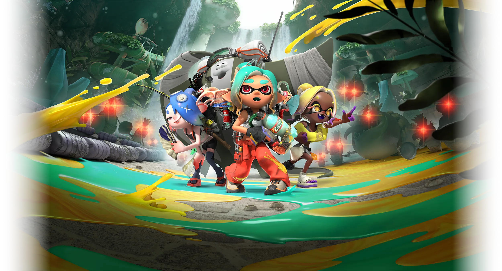
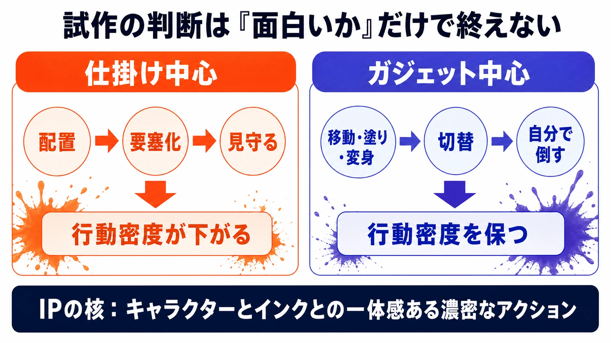
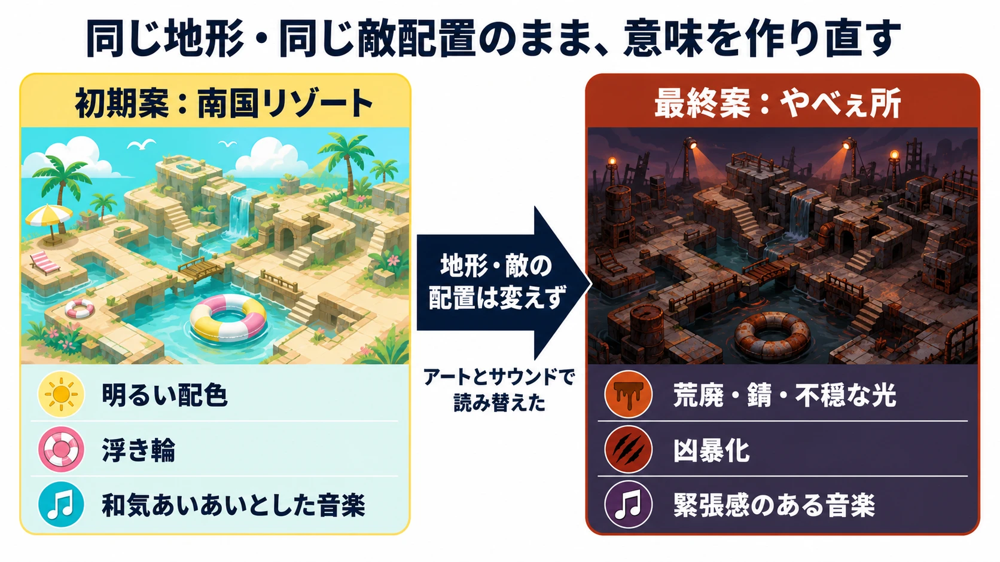

# 『スプラトゥーン4』ではなくスピンオフを選んだ理由――『スプラトゥーン レイダース』の二つの方向転換から学ぶ設計判断

## エグゼクティブサマリー

2026年7月23日にNintendo Switch 2向けに発売される『スプラトゥーン レイダース』は、ナンバリング最新作ではなく、シリーズ初のスピンオフである。対戦を中核に育ったシリーズから、協力プレイの「サーモンラン」やひとり用のストーリーモードにある遊びを独立させ、対戦に馴染めなかった人も入れる入口をつくる。その一方で、対戦の遊びづくりは今後も続ける方針である。[[1](#ref-1)][[2](#ref-2)]

本稿は、発売後の評価や販売実績を扱わない。任天堂公式インタビュー「開発者に訊きました Vol.22」全3章で開発陣が語った、二つの大きな方向転換を読む。ひとつは、面白く成立していたタワーディフェンス型の試作を、「スプラトゥーン」らしい濃密なアクションを失うとして切り替えた判断である。もうひとつは、牧歌的な南国リゾート風の島を、敵を倒す理由まで揺るがすプレイテストの反応を受けて、遊びと地形を残したまま不穏な環境へ作り直した判断である。[[1](#ref-1)][[3](#ref-3)]

ここからプランナーが持ち帰るべきなのは、企画を「面白いか」だけで判定しないための基準である。IPの核となるプレイヤー行動を先に言語化すること。感情的な反応を、動機づけや失敗の納得感という設計上の問題に翻訳すること。そして、大きな制約が固まった後でも、アートとサウンドを横断して体験の意味を立て直すことである。

出典：任天堂「[スプラトゥーン レイダース ｜ Nintendo Switch 2][2]」（© Nintendo）

***

## 1. スピンオフは主力シリーズの縮小ではなく、入口を増やす選択である

『スプラトゥーン』は、インクを使って陣地を塗り合うアクションシューティングとして始まり、初代から11年以上で3作とアップデートを積み重ねてきたシリーズである。『スプラトゥーン レイダース』は、その基本操作を引き継ぎながら、対戦ではなく、ひとりでアクションを掘り下げる作品として設計されている。[[1](#ref-1)]

ここで重要なのは、「次は『4』ではない」という見た目だけで、主力の対戦シリーズが後退したと読むべきではない点だ。プロデューサーの井上精太は、対戦だけでなく、4人で協力してシャケを倒し金イクラを集める「サーモンラン」や、ひとりで進めるストーリーモードもシリーズにはあると説明する。その非対戦要素を付加的なモードのままにせず、独立したスピンオフとして届けることで、新たな入口をつくることが開発の動機になった。対戦の遊びづくりも継続するため、本作を『スプラトゥーン4』ではなくスピンオフとして開発したという。[[1](#ref-1)]

これはブランドの約束を二つに分ける設計である。ナンバリング作品には、競技性を含む対戦の進化を期待する人がいる。一方で、インクを塗り、泳ぎ、跳び回る操作の手触りやキャラクターを好きでも、対戦の緊張感には入りにくい人もいる。両者に一つの作品だけで応えようとすると、主力シリーズの期待を薄めるか、新しい層への説明を後回しにするかの二択になりやすい。

スピンオフは、その二択をほどく。何を本編から外すかではなく、何を独立させれば別の遊び方に十分な密度を与えられるかを問うのである。本作では、サーモンランを起点にした「大量の敵をひとりでさばく」アクションを主役に据えた。すりみ連合は『スプラトゥーン3』で登場したフウカ、ウツホ、マンタローの3人組であり、本作では新主人公メカニックとともに島を探索する。シリーズの人物や操作感を橋にしながら、対戦とは別の目的で新規プレイヤーを迎える構造だ。[[1](#ref-1)][[2](#ref-2)]

***

## 2. 転換①：「面白い試作」をIPの核で止める

サーモンランは、4人での協力を前提に敵が設計されている。これをひとり用に翻案する最初の試作は、フィールドに多数の仕掛けを配置し、迫るシャケを迎え撃つタワーディフェンス型だった。仕掛けを組み上げ、要塞を築く遊びには明快な面白さがある。しかし突き詰めるほど、プレイヤーは要塞を整えた後に見守る時間が増えた。[[1](#ref-1)]

この段階で開発チームが捨てたのは、仕掛けそのものではない。プレイヤーが主体的に動き続けるという体験の優先順位である。伊藤は、「スプラトゥーン」の長所を、敵と戦いながら地面を塗り、イカになり、飛び移るような短時間で多くのアクションを行う濃密さとして捉えた。井上も、キャラクターやインクとの一体感を伴う濃密なアクションがあれば、対戦か否かを問わず「スプラトゥーンを遊んでいる」感覚になると語る。仕掛け中心の遊びには、この条件を満たしにくい問題があった。[[1](#ref-1)]

そこで設計の主語を、配置物からプレイヤーへ戻した。プレイヤーの行動を大きく拡張する「ガジェット」を中心に据え、突進、跳躍、浮遊などをブキと組み合わせ、複数のガジェットを切り替えながら大量のシャケに対処する構成へ転換した。ガジェットは成長・カスタマイズもできるが、ルール面では金イクラをコンテナへ納品する要素を外し、拾う行為だけを残して、濃密なアクションへの集中を優先している。[[1](#ref-1)]

この事例は、「既存IPらしさ」を雰囲気や記号で判定してはいけないことを示す。インクやシャケが出ていても、プレイヤーの主要な時間が待機と観察へ移れば、体験の核は変わる。逆に、対戦がなくても、移動、照準、塗り、変身といった操作が短い間隔で連鎖し、身体感覚を伴うなら、シリーズらしさは保てる。

試作を続けるか切り替えるかを決める際には、次の問いが有効である。

| 問い | 見るべきもの | 本作での判断 |
| --- | --- | --- |
| プレイヤーは何を繰り返し手で行うか | 操作頻度と行動の主語 | 仕掛けを見守るのではなく、ブキとガジェットを使い分ける |
| その反復はIP固有の手触りを生むか | 操作とキャラクターの一体感 | インク、変身、移動、攻撃が短い間隔で連鎖する状態を守る |
| 既存ルールは目的に必要か | ルールが行動密度を下げていないか | 金イクラの納品を外し、拾得と戦闘へ絞る |

プロトタイプが面白いことは、採用の十分条件ではない。既存IPの派生作品では特に、「この作品でプレイヤーが自分の手で何をし続けるか」を、シリーズの核と照合する必要がある。そこがずれたなら、実装量が少ない時期ほど切り替える価値が高い。

*図：試作は面白さに加え、プレイヤーの行動密度とIP固有の操作感で評価する。*

***

## 3. 転換②：「かわいそう」を動機づけの破綻として受け取る

二つ目の転換は、遊びのルールではなく、その遊びをしてよいと感じられる文脈から始まった。ウズシオ諸島は、既存シリーズの街から切り離したスピンオフの舞台として、当初から島に定められた。初期のコンセプトアートは、浮き輪で遊ぶシャケもいる、明るく爽やかな南国リゾート風の無人島だった。[[3](#ref-3)]

だが、その場所でプレイすると、楽しく暮らしているシャケを一方的に倒し、大事な宝を奪っているように見えた。シャケを生き物として親しみやすく描いたこともあり、試遊した人から「シャケがかわいそう」という反応が繰り返し出たという。これは好みの問題ではない。敵を倒し、報酬を得るというプレイの目的自体が、感情面で受け入れにくくなっていたのである。音楽も冒険感のある和気あいあいとした方向だったため、敵を倒す行為の意味がさらに曖昧になった。[[3](#ref-3)]

プランナーがこの種の反応を受けたとき、「かわいくしすぎた」とだけ処理すると修正が表層で終わる。ここで翻訳すべき設計言語は、少なくとも三つある。

1. **敵対の理由**：なぜプレイヤーは戦うのか。相手は脅威として理解できるか。
2. **失敗の納得感**：負けたとき、プレイヤーは自分の未熟さだけでなく、その場所や敵の危険さを受け取れるか。
3. **報酬の意味**：探索で得るものは、世界設定の中でどう位置づくか。

本作では、地形の大まかな特性や敵のラインナップはすでに変えにくい段階だった。そこでチームは「やべぇ所に来ちまった」を共通のキーワードにし、周囲のオブジェクト、ライティング、敵の見せ方、音楽までを再設計した。初期のウォータースライダーのような地形は残しつつ、壊れ、荒廃し、錆びたものへ変えた。島の不思議な塩によってシャケが凶暴化する設定を置き、危険な場所に踏み込んだという感触を、アートとサウンドの両面から作った。[[3](#ref-3)]

このピボットの要点は、レベルデザインを捨てずに、プレイの解釈を変えたことにある。敵の配置や地形を変更できないなら、残されたアートが飾りになるわけではない。背景、光、敵の振る舞い、音、収集物の意味を一つの方向へ揃えれば、同じ地形でも「楽しいリゾートを荒らす」体験から、「危険な場所に踏み込み、危険な敵を突破する」体験へ読み替えられる。

ただし、これは不穏な表現を足せばよいという話ではない。チームは「やべぇ所」という短い言葉を起点に、地殻変動で海と山のものが混ざる不自然さや、居心地の悪さを具体化し、作曲者もそれに合う音を提示した。制約下のピボットでは、抽象的な違和感を、各職能が判断できる共通語に圧縮することが重要になる。[[3](#ref-3)]

*図：大枠の地形と敵配置を保ったまま、環境表現と音でプレイの意味を読み替える。*

***

## 4. 難易度と救援を、非対戦の入口として組み込む

対戦ゲームは、プレイヤー同士の腕前の差が結果に表れやすい。本作はそこから離れ、プレイヤーの成長によって主人公メカニックが強くなるひとり用の進行を用意した。加えて「トラベラー」「レイダー」「サバイバー」の3段階を選べる難易度設定を導入している。井上は、これを「スプラトゥーン」シリーズとして初の難易度選択だと説明する。各難易度で、気持ちのよい忙しさと成長の達成感を味わえるように調整したという。[[4](#ref-4)]

この設計を単なる易化と読むのは不十分である。入門者に必要なのは、忙しさを消すことではなく、忙しさを学べる速度にすることである。難易度が戦闘の圧力を調整し、装備と操作の両方で徐々にできることを増やすなら、シリーズ経験の差を、上達の過程へ置き換えられる。[[1](#ref-1)][[4](#ref-4)]

さらに、オンラインの「ヘルプ」機能では、進行度が違うプレイヤー同士で遊んでも、それぞれのレベルに合わせてプレイヤーと敵の強さが調整される。熟練者がすべてを片づけるのではなく、始めたばかりの人も協力の手応えを持てる状態を目指した仕組みである。非対戦スピンオフの入口を広げるなら、「遊べる」と「助けを求められる」を別の機能として用意する必要がある。[[4](#ref-4)]

***

## 5. 小さな遊びを、人材育成の場にもする

アジト船で遊べる2Dミニゲームは、若手中心で社歴の浅いスタッフがチームを組んで開発し、シリーズのゼネラルプロデューサーである野上恒が協力する形を取った。野上はドット絵を描き、ブラウン管テレビ風の表示について若いスタッフへ説明も行ったという。[[4](#ref-4)]

これは本編の重要部分を経験者だけで固めず、作品内の独立性が高い小規模な領域を、次の世代の制作機会にした例である。井上は、初代『スプラトゥーン』を10代で遊んでいた人が開発チームに入り、いま一緒にゲームをつくっていると語る。シリーズを初代から遊んできた世代が開発に加わる時期には、過去の手触りを知っていることだけでは足りない。自分たちで仕様を決め、試し、古い表現の理由を先輩から受け取る場が要る。[[4](#ref-4)]

長期運営IPの人材育成は、単に若手を会議に参加させることではない。完成品の品質を守る範囲で、企画から実装までを任せられる小さな単位をつくることだ。ミニゲームは主役ではないが、そこで得た判断と技術は、将来に本編の新しい遊びを託すための蓄積になる。

***

## 6. おわりに：ピボットを三つの判断として残す

『スプラトゥーン レイダース』の開発過程は、既存IPのスピンオフが「本編より小さい企画」ではないことを示す。対戦の開発を継続しながら、非対戦の遊びに独立した入口を与える。そこで必要なのは、既存の要素を増やすことではなく、何がシリーズの核を保つかを改めて決めることである。[[1](#ref-1)]

プランナーが持ち帰る判断は、次の三点に整理できる。

1. **「IPらしさ」を主要行動で判定する。** 試作が成立していても、プレイヤーの大半の時間がIPの核から離れるなら、記号や設定だけでは補えない。本作では、仕掛けを置く遊びから、プレイヤー自身が動き続けるガジェット中心の遊びへ転換した。[[1](#ref-1)]
2. **感情的な反応を、設計上の問題へ翻訳する。** 「シャケがかわいそう」は、キャラクター造形への好悪ではなく、敵対の理由、失敗の納得感、報酬の意味が噛み合っていないという警報だった。[[3](#ref-3)]
3. **制約下では、アートを体験の意味に接続する。** 地形と敵の大枠が固まっていても、環境、光、敵の印象、サウンドを一つのコンセプトへ揃えれば、プレイヤーがその場所で何をしているのかを立て直せる。[[3](#ref-3)]

ピボットは、前の案が無駄だったことの証明ではない。どの仮説が、遊びの密度、動機づけ、世界設定の一貫性を支えられないかを、試作とテストから見つける工程である。ブランドを広げるときほど、変えるものと変えないものを、プレイヤーの体験として判断しなければならない。

## References

1. [開発者に訊きました：スプラトゥーン レイダース 第1章「究極のワンオペ」][1] - スピンオフを選んだ理由、対戦開発の継続方針、サーモンランのひとり用試作、タワーディフェンス型からガジェット中心への転換を示す任天堂公式インタビュー。

2. [スプラトゥーン レイダース ｜ Nintendo Switch 2][2] - 2026年7月23日の発売日、メカニックとすりみ連合、ウズシオ諸島、ガジェットの概要を示す任天堂公式商品ページ。

3. [開発者に訊きました：スプラトゥーン レイダース 第2章「やべぇ所に来ちまった」][3] - 南国リゾート風の初期案、試遊者の「シャケがかわいそう」という反応、地形などを残したアート・サウンド面の方向転換を示す任天堂公式インタビュー。

4. [開発者に訊きました：スプラトゥーン レイダース 第3章「多才な主人公」][4] - 若手中心のミニゲーム制作、野上恒による支援、3段階の難易度設定、レベル差を調整するオンラインのヘルプ機能を示す任天堂公式インタビュー。

[1]: https://www.nintendo.com/jp/interview/aadla/index.html
[2]: https://www.nintendo.com/jp/games/switch2/aadla/index.html
[3]: https://www.nintendo.com/jp/interview/aadla/02.html
[4]: https://www.nintendo.com/jp/interview/aadla/03.html

----

この文書は、Perplexity、Claude、OpenAI Codex の3つのAIの支援を受けて著述されたものです。引用画像を除き、MIT License にて提供されています。
