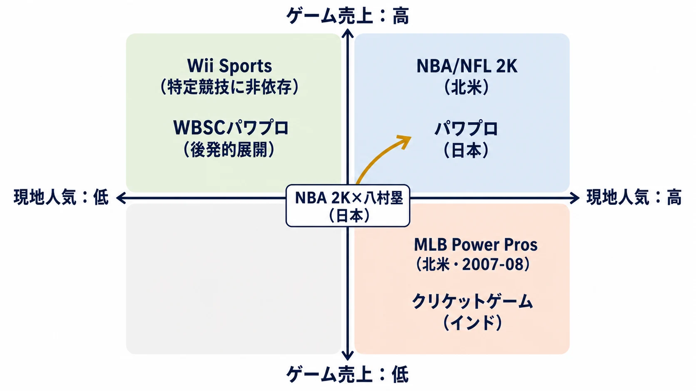

# 「その国のスポーツ人気」だけでスポーツゲームの売上は語れるか

新しいスポーツゲームの企画を通したいとき、プランナーがまず直面するのはたいてい同じ反論である。「そのスポーツ、うちの市場で誰が見ているんだ」。2K SportsのNBA 2Kシリーズは北米市場を主戦場とし、2025年は米国での年間スポーツゲーム売上でトップ、全ジャンル総合でも『Battlefield 6』に次ぐ2位を記録した[[1](#ref-1)]。2019年発売の『NBA 2K20』も、発売月だけでその年の全米ベストセラーとなっている[[2](#ref-2)]。一方、コナミの実況パワフルプロ野球（パワプロ）シリーズは日本国内向けに特化し、1994年の初代発売から2025年9月時点で家庭用ゲームの累計販売本数は2,620万本、モバイル版の累計ダウンロードも5,300万を超える。2024年発売の30周年記念作『パワフルプロ野球2024-2025』はシリーズ史上初めて出荷100万本を突破し、しかもNintendo Switch版がPS4版を大きく上回る、任天堂ハード優先の構造が定着している[[3](#ref-3)][[4](#ref-4)][[5](#ref-5)]。

この対称的な現状を見せられると、「その国で人気のスポーツのゲームでなければ売れない」という結論に飛びつきたくなる。だが、この理屈をそのまま企画書に書いてディレクターやプロデューサーの前に出すと、おそらく一発で切り返される。同じ野球という土台を共有しながら、北米で企画が失敗した例があるからだ。以下、通説への反論を4つの角度から検証し、最後に「人気」以外にどんな変数が売上を左右するのかを整理する。

***

## 反論1：同じスポーツでも売れないことがある——MLB Power Pros（2007〜2008年）

野球という土台を共有しながら、コナミが2K Sportsと提携して北米展開した『MLB Power Pros』（2007年、2008年）は商業的に振るわなかった。2007年版はWii・PS2向けに発売され、批評家からはMetacritic83点という高評価を得たものの[[6](#ref-6)]、VGChartzの推定では北米累計販売本数は約23万本にとどまり、翌2008年版はさらに落ち込んで北米累計約11万本で終わった[[7](#ref-7)][[8](#ref-8)]。3作目は投入されず、シリーズは日本国内・モバイルでの巨大フランチャイズ路線に専念することになる。

同時期に発売されていた『MVP Baseball』『MLB The Show』『MLB 2K7』といった競合が北米市場を既に占有していたことに加え、コナミ側の事情も響いた。当時ローカライズチームに在籍したライアン・グラフ氏によれば、コナミの本社がカリフォルニア州レッドウッドシティからロサンゼルスへ移転した際、旧経営陣と新経営陣とで力を入れるタイトル・フランチャイズの方針が食い違い、シリーズへの継続投資の優先順位が下がったという[[9](#ref-9)]。

つまりこの事例が示すのは、「野球というスポーツ自体は北米でも大人気」という条件が揃っていても、①デフォルメされたキャラクターデザインが北米の野球ゲーム市場が期待する見た目と噛み合わなかったこと、②先発の強力な競合IPが既に棚を埋めていたこと、③ローカライズへの持続的な投資体制が社内事情で失われたこと、という3つが重なれば市場浸透は失敗する、という反例である。

***

## 反論2：人気とゲームは相互に作られる——NBA 2K×八村塁

2K社は2020年、NBA 2Kシリーズの日本オフィシャルアンバサダーに八村塁選手（当時ワシントン・ウィザーズ）を起用した[[10](#ref-10)]。翌年発表の『NBA 2K22』では、同シリーズ史上初めて日本人選手が日本限定版のパッケージカバーを飾っている[[11](#ref-11)]。八村選手自身、中学時代からNBA 2Kシリーズをプレイしていたと語っており、ゲーム内でのレーティングもシーズン中の活躍に応じて更新され続けている（『NBA 2K24』では75〜80 OVRの間で変動）[[12](#ref-12)]。

この事例が示すのは、「バスケットボール人気が既に日本にあるからNBA 2Kが売れる」という一方向の関係ではない。著名な自国選手をカバーアスリート・アンバサダーとしてアイコン化することで、日本市場での競技関心とゲーム購買意欲を相互に強化する、マーケティング主導の循環が成立している点である。人気がゲームを支えるだけでなく、ゲーム側の演出が競技人気の底上げに寄与する双方向の関係と言い換えられる。

***

## 反論3：競技への土地勘を切り離す設計もある——Wii Sports

Wii Sportsは、特定のスポーツ文化圏への依存を意図的に排除した設計で世界的ヒットとなった。テニス・野球・ボウリング・ゴルフ・ボクシングの5種目を収録し、Wiiリモコンのモーションコントロールによって「複雑なボタン操作を覚えなくても、実際の動作を真似るだけで遊べる」体験を作った。全世界で約8,290万本を売り上げ、単一プラットフォーム専用タイトルとしては史上最多の販売数を記録している[[13](#ref-13)]。

この大ヒットの起点は、Nintendo of America社長（当時）のレジー・フィサメィ氏が本体への無料バンドルを強く主張し、当初難色を示していた岩田聡氏・宮本茂氏を説得したことにある。北米・欧州・オセアニアでは本体にバンドルされ、日本・韓国では単体販売とされた[[14](#ref-14)]。バンドルされた地域でWiiの普及が特に加速したことを踏まえると、「特定競技の本場人気」よりも「操作の民主化」「非ゲーマー層への訴求」「本体戦略との一体化」こそが世界的ヒットの条件になり得たと読める。スポーツへの土地勘そのものをゲーム体験の前提から外す設計もまた、通説の反例になる。

***

## 反論4：人気があっても売れないこともある——クリケット×インド

インドはクリケットの競技人口・観戦人口ともに世界最大級の市場でありながら、公式クリケットゲームの正規販売は長年低迷してきた。EA Sportsの『Cricket』シリーズは1996年から2007年まで展開されたが、『Cricket 07』を最後に新作が途絶えている[[15](#ref-15)]。

主因として挙げられるのが、インド・パキスタンなど南アジア地域における深刻な海賊版の蔓延である。2007〜2010年頃の推定として、インドではソフトウェア全般の海賊版率が80〜90%に達していたとする学術研究がある[[16](#ref-16)]。加えて、インドクリケット統制委員会（BCCI）とのライセンス契約が法的な行き詰まりに陥り、インド代表選手の使用権を失ったことも収益悪化に拍車をかけた。EA Sportsのアンドリュー・ウィルソンVP（当時）は、南アジア市場を収益化するには海賊版対策への市場側の対応が必要だと述べている[[17](#ref-17)]。

この事例が示すのは、通説の逆方向の反証である。競技人気の規模がどれほど大きくても、購買力・決済インフラ・法制度・海賊版対策といった商業化の前提条件が整わない限り、正規ゲーム市場は成立しない。

***

## 迂回策の実例：WBSCパワプロの100円配信（2023年）

では、人気の薄い市場に後から食い込む方法はないのか。コナミが2023年に打った施策が一つの答えになる。同年2月、コナミは世界野球ソフトボール連盟（WBSC）公式タイトルとして『WBSC eBASEBALL パワフルプロ野球』を発表し、日本を含む62カ国でNintendo SwitchとPlayStation 4向けにダウンロード専売、価格は追加課金要素なしの100円（税込）という破格で配信した[[18](#ref-18)]。

この施策は、育成・ストーリー要素を排除して「野球勝負」のみに特化することで参入障壁を下げ、英語表示にも対応して世界中のプレイヤーとオンライン対戦できる仕様とした点が特徴である[[19](#ref-19)]。コナミとWBSCの狙いは単体タイトルの売上最大化ではなく、eスポーツを通じて野球・ソフトボールファン層そのものを世界的に拡大し、グローバルな大会運営基盤を作ることにあった[[20](#ref-20)]。実際、2025年11月には米国ノースカロライナ州立大学で世界大会「WBSC eBaseballシリーズ2025」のワールドファイナルが開催されるなど、単なる販売施策からコミュニティ・エコシステムの形成へと発展している[[21](#ref-21)]。

日本国内に強く根付いた既存IPを、超低価格と参入障壁の除去という手法で「野球人気が薄い国」にも展開し、人気を後発的に醸成する。Wii SportsやNBA 2K×八村塁の事例と同じく、ゲーム側の設計とマーケティングが競技人気を作り出せることを示す実例である。

***

## まとめ：「人気」は必要条件だが、決定要因は別にある

| 事例 | 現地人気との関係 | 売上を左右した実際の要因 |
| --- | --- | --- |
| NBA/NFL 2Kシリーズ（北米） | 人気と売上が概ね一致 | 現地流通基盤、eスポーツ連携、既存ファンダム[[1](#ref-1)] |
| パワプロ（日本） | 人気と売上が概ね一致 | キャラクターデザインの間口の広さ、モバイル展開[[3](#ref-3)] |
| MLB Power Pros（北米、2007-08） | 野球人気はあるが売上不振 | 競合IPの強さ、ローカライズ体制の欠如、絵柄と市場期待のズレ[[7](#ref-7)][[9](#ref-9)] |
| NBA 2K×八村塁（日本） | 人気がゲームを、ゲームが人気を強化 | 著名自国選手のアイコン化によるマーケティング効果[[10](#ref-10)][[11](#ref-11)] |
| Wii Sports（世界） | 特定競技人気に依存せず大ヒット | 操作の民主化、非ゲーマー層への訴求、本体バンドル戦略[[13](#ref-13)][[14](#ref-14)] |
| クリケットゲーム（インド） | 圧倒的人気だが売上不振 | 海賊版率の高さ、決済・購買力の壁、ライセンス問題[[16](#ref-16)][[17](#ref-17)] |
| WBSCパワプロ（世界60カ国+） | 人気の薄い国への逆輸出的展開 | 超低価格・参入障壁の除去によるファン層の後発的創出[[18](#ref-18)][[20](#ref-20)] |

これらの事例を総合すると、「スポーツゲームの売上はその国のスポーツ人気だけで決まる」という通説は、必要条件としては正しいが十分条件ではない。人気はあくまで需要の土台を提供するに過ぎず、実際の売上を左右するのは、絵柄とシミュレーション期待の適合、既存競合IPとの力関係、決済・海賊版対策を含む市場インフラの整備、そして操作性の民主化やアイコン選手起用のようなマーケティング施策である。

企画会議で「その国はこの競技が人気ではないので厳しいのでは」と聞かれたとき、プランナーが返せる材料はここにある。市場選定の議論を競技人気の大きさだけで終わらせず、絵柄・演出が現地の期待とズレていないか、後押しできる著名選手やスターがいるか、購買力と流通・海賊版対策のインフラが整っているかまで含めた複合的な市場分析として提示できれば、企画の説得力は変わってくる。

## References

1. [Sports Business Journal「NBA 2K26 is the bestselling sports game of 2025」][1] - Circana調べによる2025年米国年間ソフト売上で、NBA 2K26がスポーツゲーム首位・全ジャンル総合2位（『Battlefield 6』に次ぐ）となったことを報じる記事。

2. [Video Games Chronicle「NBA 2K20 is already 2019's best-selling game in the US」][2] - 『NBA 2K20』が発売月だけで2019年の全米年間ベストセラーになったと報じる記事。

3. [コナミデジタルエンタテインメント公式ニュース「『パワフルプロ野球2024-2025』シリーズ初！累計出荷本数が100万本を突破！」][3] - パワプロシリーズ30周年記念作の出荷100万本突破と、シリーズ全体の家庭用累計販売本数（2,620万本）・モバイル累計ダウンロード数（5,300万）を発表する公式ニュース。

4. [ファミ通.com「2024年7月のソフト・ハード売上ランキング」][4] - 『パワプロ2024-2025』のSwitch版が首位、PS4版が3位だったと報じる記事。

5. [ファミ通.com「2024年8月ソフト・ハード売上ランキング公開」][5] - 『パワプロ2024-2025』が2ヶ月連続でSwitch版首位だったと報じる記事。

6. [Metacritic「MLB Power Pros (Wii) Critic Reviews」][6] - 『MLB Power Pros』Wii版の批評家レビュースコア一覧（83点）。

7. [VGChartz「MLB Power Pros for Wii - Sales」][7] - 『MLB Power Pros』Wii版の地域別推定販売実績（北米累計約0.23m）。

8. [VGChartz「MLB Power Pros 2008 for Wii - Sales」][8] - 『MLB Power Pros 2008』Wii版の地域別推定販売実績（北米累計約0.11m）。

9. [Inverse「Remembering the weirdest MLB game you've never heard of」][9] - 元コナミローカライズ担当者ライアン・グラフ氏らへの取材を基に、『MLB Power Pros』シリーズが北米で継続されなかった背景（コナミの本社移転を含む）を伝える記事。

10. [2Kジャパン公式ニュース「八村塁選手が『NBA 2K20』日本オフィシャルアンバサダーに就任」][10] - 八村塁選手のNBA 2Kシリーズ日本オフィシャルアンバサダー就任を伝える公式ニュース。

11. [ファミ通.com「『NBA 2K22』プレイレビュー」][11] - 八村塁選手が同シリーズ史上初の日本人カバー選手として『NBA 2K22』日本限定版に起用されたことを報じる記事。

12. [2Kratings「Rui Hachimura」][12] - 八村塁選手のNBA 2Kシリーズ各作品におけるレーティング推移データ。

13. [The Strong National Museum of Play「Wii Sports」][13] - Wii Sportsの世界販売実績（約8,290万本）と、単一プラットフォーム専用タイトルとしての販売記録を紹介する文化施設公式サイトの解説。

14. [Nintendo Life「Reggie Had To Fight For Wii Sports As A Pack-In, And Miyamoto Wasn't Happy」][14] - レジー・フィサメィ氏（元Nintendo of America社長）の証言に基づく、Wii Sportsを北米で本体バンドルにした経緯（岩田聡氏・宮本茂氏の当初の反対を含む）を伝える記事。

15. [Half-Glass Gaming「A Brief History of Codemasters' and EA Sports' Cricket Video Games」][15] - EA SportsおよびCodemastersのクリケットゲームシリーズの展開史（1996〜2007年）をまとめた記事。

16. [Journal of International Economics and Reform「Piracy as a Market Strategy for Video Games」][16] - ゲームソフトの地域別海賊版率を扱う学術論文。2000年代のインド・ブラジル等における推定海賊版率（80〜90%）を紹介。

17. [Sportzwiki「Revealed: The reason why EA sports stopped developing cricket series」][17] - EA SportsがCricketシリーズを終了した理由として、BCCIとのライセンス問題と南アジア市場における海賊版対策の必要性を挙げるVPコメントを紹介する記事。

18. [コナミデジタルエンタテインメント公式ニュース「『WBSC eBASEBALL™パワフルプロ野球』本日発売！」][18] - 『WBSC eBASEBALL パワフルプロ野球』の発売（62カ国、100円配信）を発表する公式ニュース。

19. [World Baseball Softball Confederation公式ニュース「WBSCとKONAMIが共同。」][19] - WBSCとコナミの提携によるNintendo Switch/PlayStation向け配信の仕様・狙いを発表する公式ニュース。

20. [ITmedia「『パワプロ』新作を100円で発売」][20] - コナミが「eスポーツを通して野球・ソフトボールファンの拡大を目指す」との狙いを説明する記事。

21. [コナミデジタルエンタテインメント公式ニュース「『WBSCパワプロ』の世界大会『WBSC eBaseball™ シリーズ 2025』ワールドファイナル」][21] - 米国ノースカロライナ州立大学で2025年11月に開催されたワールドファイナルを発表する公式ニュース。

[1]: https://www.sportsbusinessjournal.com/Articles/2026/01/30/nba-2k26-is-the-bestselling-sports-game-of-2025/
[2]: https://www.videogameschronicle.com/news/nba-2k20-is-already-2019s-best-selling-game-in-the-us/
[3]: https://www.konami.com/games/corporate/ja/news/topics/20251222pawa/
[4]: https://www.famitsu.com/article/202408/13545
[5]: https://www.famitsu.com/article/202409/16665
[6]: https://www.metacritic.com/game/mlb-power-pros/critic-reviews/?platform=wii
[7]: https://www.vgchartz.com/game/7569/mlb-power-pros/sales
[8]: https://www.vgchartz.com/game/23587/mlb-power-pros-2008/sales
[9]: https://www.inverse.com/input/gaming/remembering-the-weirdest-mlb-game-youve-never-heard-of
[10]: https://2kgames.jp/news/277/
[11]: https://www.famitsu.com/news/202109/27234540
[12]: https://www.2kratings.com/rui-hachimura
[13]: https://www.museumofplay.org/games/wii-sports/
[14]: https://www.nintendolife.com/news/2022/05/reggie-had-to-fight-for-wii-sports-as-a-pack-in-and-miyamoto-wasnt-happy
[15]: https://halfglassgaming.com/2022/09/a-brief-history-of-codemasters-and-ea-sports-cricket-video-games/
[16]: https://jier.org/index.php/journal/article/download/3453/2764/6170
[17]: https://sportzwiki.com/cricket/the-reason-why-ea-sports-stopped-developing-cricket-series/
[18]: https://www.konami.com/games/corporate/ja/news/topics/20230209/
[19]: https://www.wbsc.org/ja/news/wbsc-and-konami-team-up-to-release-wbsc-ebaseball-power-pros-on-nintendo-switch-and-playstation
[20]: https://www.itmedia.co.jp/news/articles/2302/10/news100.html
[21]: https://www.konami.com/games/corporate/ja/news/topics/20251106/

----

この文書は、Perplexity、Claude、OpenAI Codex の3つのAIの支援を受けて著述されたものです。引用画像を除き、MIT License にて提供されています。
