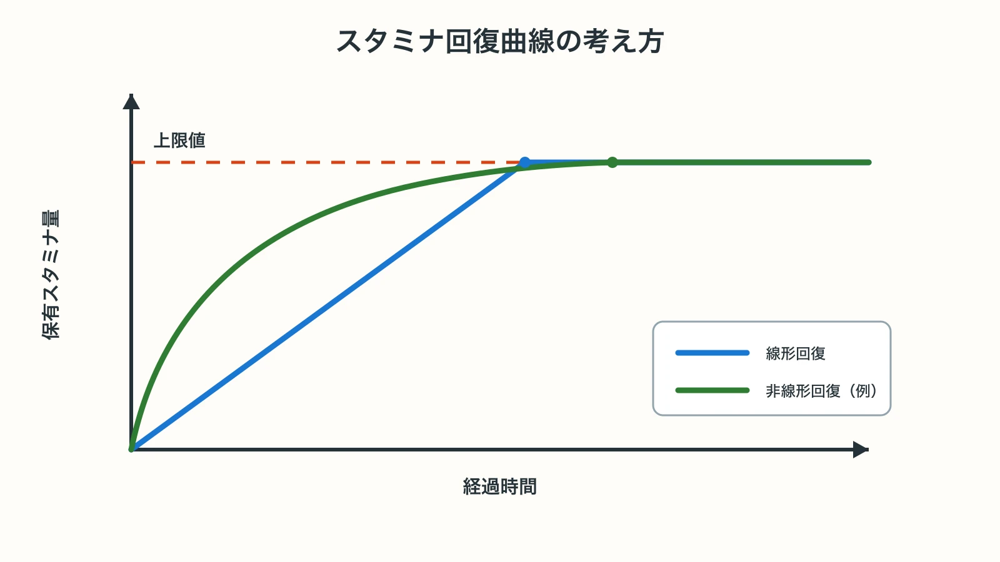
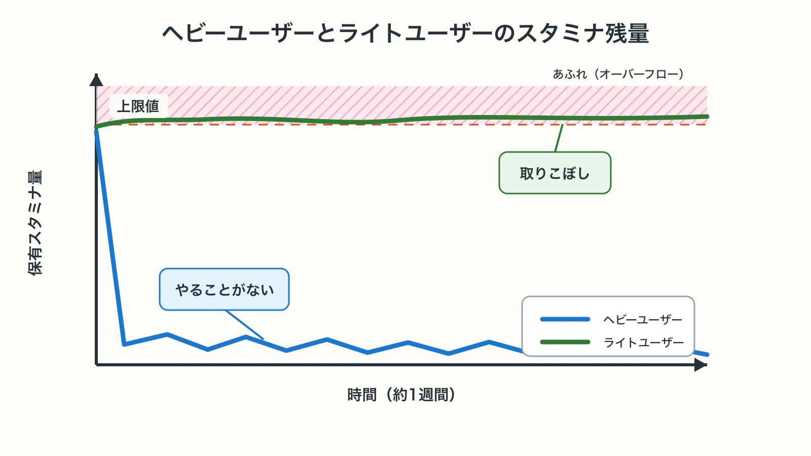
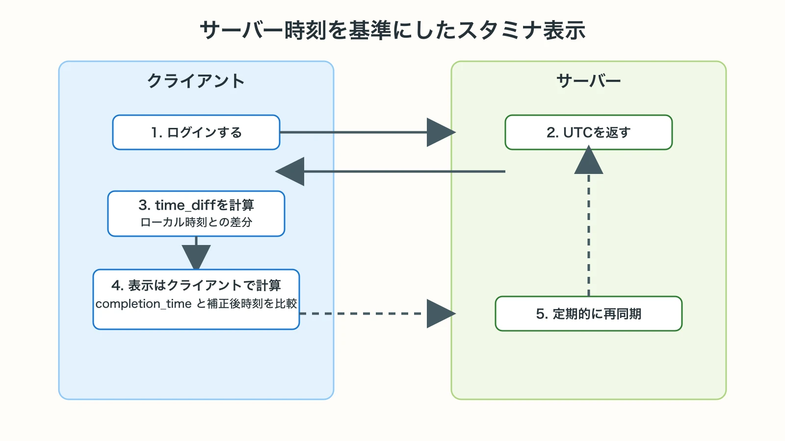
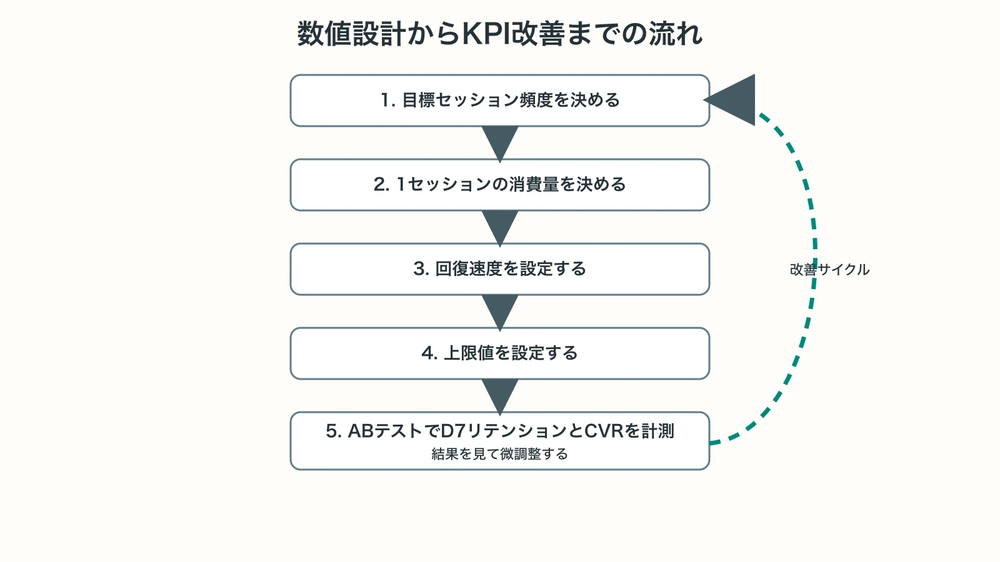

# スタミナ・AP（行動力）システムの設計実務

## 1. スタミナ制を「なぜ入れるか」、そして「なぜ外す流れがあるか」

### 導入する3つの目的

スタミナ（AP/行動力）システムには、設計上の正当な理由が3つある。[[1](#ref-1)][[2](#ref-2)]

1. **習慣形成（Habit Formation）**  
   1日に複数回アプリを開くサイクルを作り、ゲームを生活の一部にする。スタミナが満タンに戻るタイミングが「昼休み」「帰宅後」に合うよう設計することで、時刻と行動の紐付けが生まれる。[[2](#ref-2)]

2. **コンテンツペーシング**  
   プレイヤーが一気にコンテンツを消費し、遊ぶ目的を失って離脱するのを防ぐ。リリース後のコンテンツ供給が追いつかない期間に特に有効で、5〜20分のセッションを1日4〜8時間ごとに設計するのが標準的な値域である。[[2](#ref-2)]

3. **課金導線の設計**  
   「もっと遊びたいのに、いまは遊べない」という制約を、回復アイテムや月額パスの購入動機につなげる設計である。2023年に『MONOPOLY GO!（モノポリー GO!）』はリリースから7か月で10億ドルの売上を達成し[[3](#ref-3)]、『Coin Master（コインマスター）』の開発元Moon Activeも同年に7億8,800万ドルのアプリ内売上を計上しており[[4](#ref-4)]、標準的なスタミナ制は決して時代遅れではない。[[1](#ref-1)][[2](#ref-2)]

### 近年「緩和・撤廃」が起きている理由

一方で、プレイヤーからの反発と競合差別化を狙い、スタミナを廃止・緩和するタイトルが増えている。2025年10月にグローバルリリースした『デュエットナイトアビス』は、クローズドβテストで集めたプレイヤーデータとアンケート結果を分析した結果、ガチャとスタミナ制への不満が根強いと判断し、両方を撤廃して無制限スタミナへ切り替えた。[[5](#ref-5)] プロデューサーのDeca Bear氏はAUTOMATON WESTのインタビューで、ガチャとスタミナをどれだけ調整してもプレイヤーの根本的な不満は解消できないと判断したと説明しており、収益化はコスメティック課金へ一本化されている。[[6](#ref-6)]

撤廃が「成立しやすい条件」は以下の通りである：[[1](#ref-1)]

- 非同期PvP/非同期コンテンツへの依存が高い
- クエスト報酬制（ハースストーンのデイリークエスト方式）でコンテンツ消費を別軸でコントロールできる
- マネタイズがコスメティック中心でゲームプレイ差がつかない

逆に言えば、 **コンテンツの消費速度をコントロールしたい一般的なRPG・育成系ゲームでは、スタミナ制は依然有効な手段** である。

***

## 2. 数値設計：回復速度・上限値・消費量

### 基本構造と計算式

スタミナの状態は4つの値から求められる：[[7](#ref-7)]

| パラメータ | 役割 | 保存場所 |
|---|---|---|
| `completion_time` | スタミナが上限に達する予定UTC時刻 | DBに保存 |
| `overflowed_stamina` | 上限を超えて付与された分 | DBに保存 |
| `MAX_STAMINA` | 上限値 | マスターデータ |
| `SECONDS_PER_STAMINA` | 1回復あたりの秒数 | マスターデータ |

設計の要点として、 **変更があるのは「消費時」と「アイテム等による回復時」の2タイミングのみ** であり、毎フレームや毎秒通信する実装は誤りである。現在値は `completion_time` と現在時刻の差分からリアルタイム計算する。[[7](#ref-7)]

### 代表的な数値帯（業界参考値）

| タイトル例 | 上限 | 回復ペース | 備考 |
|---|---|---|---|
| 原神（Ver.4.7以降） | 200 | 1/8分（180/日） | Ver.4.6以前は160[[8](#ref-8)] |
| NTE | 240 | 1/6分（240/日） | 円石課金上限6回/日[[9](#ref-9)] |
| プロ野球スピリッツA | 100 | 1/3分（480/日） | 自然回復の上限は100固定[[10](#ref-10)] |

標準設計の目安として、 **1セッション5〜20分相当のスタミナが4〜8時間で回復する** 設計が多い。[[2](#ref-2)]

### 上限設計の考え方

**オフライン時間を踏まえた上限設計** が重要である。24時間の自然回復量と上限値を揃えると（NTE方式）、毎日1回ログインすれば無駄なく消費できる構造になり、ライトユーザーへの配慮になる。逆に上限が低すぎると（例：旧『原神』の天然樹脂160）、上限引き上げはプレイヤーコミュニティから長らく望まれており、Ver.4.7でついに200へ緩和された。[[8](#ref-8)]

- **短い上限**：セッション頻度↑、スタミナ切れによる離脱リスク↑
- **長い上限**：ライトユーザーが取りこぼさない、ヘビーユーザーは不満なし

**段階的回復** （Linear regen）が最も実装しやすいが、序盤を早く後半を遅くする **非線形回復** も設計可能である。保存データを変えずに回復カーブのみ変更できる。[[7](#ref-7)]


*線形回復は一定速度で上限に到達し、非線形回復は序盤を速く後半を遅くする。いずれも上限到達後は頭打ちになる。*

### 繰越・超過スタミナの扱い

アイテムで上限を超えた場合の `overflowed_stamina` は別変数で管理し、自然回復とは独立させる。上限到達後は自然回復を止め、超過分を先に消費する設計が一般的である。プロスピAのように「エナジー1消費でスタミナ20回復」かつ「スタミナ300まで貯蔵可能（3回課金）」という形で、課金によるバッファを明示するUIも参考になる。[[10](#ref-10)][[7](#ref-7)]

***

## 3. 課金回復アイテムの価格設計とユーザー体験差

### ユーザーセグメントと課金動機

SBペイメントサービスの2025年調査によれば、スマホゲームに課金している割合は全体の35.2%で、20代・30代男性では50%超。課金目的の1位は「イベント参加・限定アイテム入手」であり、20代男性のみ「ゲームの進行を加速するため」が1位である。スタミナ回復はこの「進行加速」カテゴリに直接対応する。[[11](#ref-11)]

**ユーザー4分類と体験差の設計指針**:

| セグメント | 特性 | スタミナ設計上の配慮 |
|---|---|---|
| 重課金 | LTV最大・進行加速への支払い意欲高 | 課金上限（1日N回まで）を設け廃課金防止、高額バンドルのお得感 |
| 中課金 | イベント完走を目的に課金 | イベント期間中のスタミナ消費加速設計でコンバート誘導 |
| 微課金 | 月額パスや1回限りのお試し | 「月額パスで毎日+N スタミナ」などサブスクとの組み合わせ |
| 無課金 | 広告視聴での回復、時間待ち | 広告1回=スタミナ回復1回相当の設計（モンスターストライク〈モンスト〉の動画CM方式[[12](#ref-12)]）で満足度維持 |

### 価格設計の実務

```
課金1回あたりのスタミナ回復価値 = 回復量 × クエスト1回の所要AP ÷ セッション価値
```

「1回の課金で何クエスト分か」がプレイヤーの判断基準になる。また、課金回数に上限を設けることで「廃課金化」を防ぐ設計も重要である（NTEは1日6回までで、4回目以降は消費量が増加する仕組み）。[[9](#ref-9)]

***

## 4. ライトユーザーとヘビーユーザーの両立

### セッション設計の非対称問題

ヘビーユーザーはスタミナを一瞬で使い切り「やることがない」と感じ、ライトユーザーはスタミナが溢れて取りこぼす。どちらの不満も離脱につながる。


*ヘビーユーザーは消費後に0付近へ張り付きやすく、ライトユーザーは上限付近で取りこぼしが起きやすい。*

**上限設計の原則：**
- オフライン最大蓄積 = ターゲットユーザーの最長非プレイ時間 × 回復速度
- 日本ユーザーの「睡眠8時間 + 仕事8時間 = 16時間」を基準に24時間上限を設定するケースが多い

**ヘビーユーザー向け対策：**
- イベント専用スタミナ（例：Pocket Champsのイベントチケット方式）を追加し、通常スタミナとは別軸で消費させる[[2](#ref-2)]
- 週次コンテンツ（トラウンスドメイン等）は週回数制限を設け、上限突破課金に差別化軸を持たせる

**「スタミナ切れ待ち」問題への対処：**

スタミナが切れた後にユーザーがすることを設計する（コレクション整理、PvPコンテンツ、ソーシャル機能）。スタミナと紐づかないコンテンツを常に提供することで、離脱を防ぐ。[[1](#ref-1)]

***

## 5. サーバー側実装の注意点

### タイムスタンプ管理とUTC基準

**スタミナ回復はすべてUTCタイムスタンプで管理する**。以下が鉄則：[[13](#ref-13)]

1. サーバーはUTCでタイムスタンプを生成・保存
2. クライアントにUTCタイムスタンプを送信（ISO-8601形式推奨）
3. クライアント側でローカルタイムゾーンに変換して表示
4. タイムゾーンの正誤はクライアント設定に委ね、サーバーは関与しない

サーバーとクライアントの時刻同期は、ログイン時にサーバータイムスタンプを送信し、クライアントが差分（`time_diff`）を計算して以後は定期的に補正する方式が標準である。[[14](#ref-14)]


*サーバーはUTCタイムスタンプを返し、クライアントは `time_diff` で補正した表示用の現在時刻を使う。*

### 不正操作（クロック操作）への対策

端末の時刻を進めることでスタミナを不正回復する攻撃への対処：[[15](#ref-15)]

- **基本原則：スタミナの回復計算はサーバー側のみで行う**。クライアントは表示用に近似計算するが、実際の付与はサーバー判定。[[16](#ref-16)]
- サーバータイムスタンプをオンライン接続時に取得し、保存されたタイムスタンプと比較。大きな逆転があれば不正と見なす。[[17](#ref-17)]
- オフラインでもプレイ可能な設計の場合は、「オフライン回復の上限を24時間分に制限する」設計（例：最大24時間分しかオフライン回復しない）でリスクを限定する。[[15](#ref-15)]
- リソースの付与は必ずサーバー側で検証し、クライアントのメモリ書き換えによる数値改ざんを防ぐ。[[16](#ref-16)]

### 実装例（Rubyベース）

以下はスタミナ現在値の計算ロジックの要点である。保存する値は `completion_time`（満タン到達予定時刻）と `overflowed_stamina`（超過分）の2つのみである：[[7](#ref-7)]

```ruby
def value
  t = full? ? MAX_STAMINA :
    [MAX_STAMINA - ((completion_time - now) / SECONDS_PER_STAMINA.to_f).ceil, 0].max
  t + overflowed_stamina
end
```

***

## 6. スタミナ切れによる離脱・炎上リスクとユーザー心理

### 実証研究が示す離脱メカニズム

東京工科大学の野島ら（DiGRA Japan 2014）によるAP制ソーシャルゲームの実証実験では、離脱要因を意図的に実装したゲームで55%のユーザーが離脱（通常版は22%）した。離脱理由の上位は「時間的拘束（20%）」「単純作業化（20%）」であり、「阻害（プッシュ通知等）」は最も低い5%だった。これは、 **スタミナ回復の待ち時間そのものより、ゲームプレイが「待って遊ぶだけの作業」に感じられることが本質的な離脱原因** であることを示している。[[18](#ref-18)]

スマホゲームのユーザー実態調査（Lighthouse Studio, 2026）では、1年以上続けたゲームを辞める要因として「ゲームに飽きた（38.3%）」に次いで「**日課が作業に感じた（29.0%）**」が2位だった。スタミナ消化が「デイリーミッション的な義務」に変質することで、長期離脱が引き起こされる。[[19](#ref-19)]

### 重課金要素が引き起こすコミュニティ炎上

慶應義塾大学大学院の研究（中国市場のソーシャルゲームユーザーを対象とした調査であり、日本市場への一般化には注意が必要）では、 **重課金因子がユーザーの離脱に正の影響を持つ** と示されている。[[20](#ref-20)] つまり、重課金者が目立つほど非課金ユーザーが不公平感を持ち離脱する傾向がある。スタミナ制においても、課金ユーザーだけが大量にコンテンツを消費してランキングを独占する設計は炎上リスクが高い。

### SNS炎上の典型パターン

- **原神の天然樹脂問題**：上限160の当時は「16時間分しか回復しない」「あふれた分が無駄になる」という不満がコミュニティで根強く、Ver.4.7（2024年5月）で200に緩和された。[[8](#ref-8)][[21](#ref-21)]上限を引き上げても、課金で天然樹脂を大量入手した際の消費先に困るという声は残っており、上限設計と課金効果の実感を両立させる難しさを示す事例である。

- **課金前提のイベント設計**：イベント期間中にスタミナが足りなくなる設計は「課金しなければイベントをクリアできない」という批判を生みやすい。[[2](#ref-2)]

**炎上を防ぐ設計原則：**
- 「無課金でも週N回はイベントを完走できる」という定量基準をチーム内で明文化する
- 課金は「速さを買う」設計にし、「遊ぶ権利を買う」設計を避ける

***

## 7. KPIとの紐付け方

### スタミナ設計が影響するKPI

| KPI | スタミナ設計との関係 |
|---|---|
| **DAU / セッション頻度** | 回復周期＝1日の推奨セッション回数を決定する。4時間回復 → 1日4〜5セッション誘導 |
| **D1/D7/D30リテンション** | 上限が低すぎ → スタミナ切れ起因の初期離脱増加 |
| **課金転換率（CVR）** | 課金誘導タイミング（スタミナ切れ直後・イベント終了直前）に課金UIを表示 |
| **ARPU / ARPPU** | スタミナ回復アイテムのバンドル設計・上限回数設計が直接影響 |
| **DAU/MAU（スティッキネス）** | 習慣形成の成否＝スタミナサイクルの設計質で決まる |

### 数値設計→KPI改善の思考フロー

```
1. 目標セッション頻度を決める（例: 1日3回）
   ↓
2. 1セッションの消費量を決める（例: 40AP）
   ↓
3. 回復速度を設定する（例: 120AP ÷ 8時間 = 1AP/4分）
   ↓
4. 上限値を設定する（オフライン最大時間 × 回復速度 例: 16時間 × 15AP/h = 240AP）
   ↓
5. ABテストでD7リテンションとCVRを計測し微調整
```


*スタミナ設計は、目標セッション頻度から上限値までを仮説化し、ABテスト結果を見て継続的に調整する。*

セッション頻度を上げる施策として「スタミナ全回復プッシュ通知」が有効だが、通知過多によるアンインストールリスクもある。通知はオプトイン設計を推奨し、過剰な通知が逆効果であることは前述の実証研究でも確認されている。[[22](#ref-22)][[18](#ref-18)]

### コホート分析による検証

スタミナ設計変更後は、 **変更前後コホートのD7・D30リテンションとCVR** を比較することが必須である。特に「スタミナ上限を上げた場合」は短期的にDAUが下がる可能性があるため、LTV（Lifetime Value）で評価する。セッション数が減ってもARPU・ARPPUが改善すれば設計としては成功である。[[23](#ref-23)][[24](#ref-24)]

***

## 8. スタミナ設計チェックリスト

リリース前・仕様確定時に以下を確認する。

**数値設計**
- [ ] 無課金ユーザーの最長非プレイ時間（8〜16時間）で上限が溢れないか
- [ ] 1日1〜3回の自然セッションで主要コンテンツを完走できるか
- [ ] 課金回復の1回あたり価値（何クエスト分か）が明確か
- [ ] イベント期間中のスタミナ消費設計で無課金完走が可能か

**ユーザー体験**
- [ ] スタミナが切れた後にプレイできる「ノーコストコンテンツ」があるか
- [ ] 重課金ユーザーがスタミナを使い切った後の「やることがない」状態を防いでいるか
- [ ] 課金UIがスタミナ切れ直後に自然に出るが過度にプッシュしていないか

**サーバー実装**
- [ ] スタミナ計算はサーバー側UTCタイムスタンプで行っているか
- [ ] クロック操作による不正回復への対策があるか
- [ ] オフライン回復の上限が設けられているか（推奨：24時間分）
- [ ] 消費処理はサーバー側でアトミックに行われているか（二重消費防止）

---

## References

<a id="ref-1"></a>1. [Energy Archives][1] - モバイルF2Pゲームにおけるエナジー/スタミナシステムの設計意図を解説するMobile Free To Playのコラム。

<a id="ref-2"></a>2. [Mastering Mobile Game Design: Choose the Best Energy System][2] - エナジー制の類型とセッション設計への影響を解説するReverseNerfのコラム。

<a id="ref-3"></a>3. ['Monopoly Go' Generates $1 Billion In Revenue In 7 Months][3] - 『MONOPOLY GO!（モノポリー GO!）』が2023年の発売から7か月で10億ドルを売り上げたことを報じるForbesの記事。

<a id="ref-4"></a>4. [Annual mobile revenue of Moon Active 2015-2025 YTD][4] - 『Coin Master（コインマスター）』開発元Moon Activeの年間モバイル売上高推移を示すStatistaの統計データ。

<a id="ref-5"></a>5. [「デュエットナイトアビス」，10月28日にリリース決定][5] - ガチャ・スタミナシステム撤廃などの仕様変更を報じる4Gamerの記事。

<a id="ref-6"></a>6. [Duet Night Abyss decides to abolish gacha systems just before launch][6] - 『デュエットナイトアビス』プロデューサーDeca Bear氏へのインタビューを掲載するAUTOMATON WESTの記事。

<a id="ref-7"></a>7. [ソーシャルゲーム開発のベストプラクティス][7] - スタミナの状態管理を含むソーシャルゲーム開発の実装知見をまとめたcocone engineeringのブログ記事。

<a id="ref-8"></a>8. [『原神』天然樹脂の上限が200に][8] - Ver.4.7での天然樹脂上限引き上げ（160→200）を報じるファミ通.comの記事。

<a id="ref-9"></a>9. [【NTE】スタミナ(本性ピクセル)回復のやり方と使い道【ネバエバ】][9] - NTEのスタミナ回復量・課金回復回数を解説するゲームウィズの攻略記事。

<a id="ref-10"></a>10. [【プロスピA】スタミナ回復方法一覧と使い道][10] - プロスピAのスタミナ上限・回復ペースを解説するゲームエイトの攻略記事。

<a id="ref-11"></a>11. [【調査結果】スマホゲームの課金状況と人気の決済手段を紹介！][11] - スマホゲーム利用者1,673人を対象とした課金状況調査を示すSBペイメントサービスの記事。

<a id="ref-12"></a>12. [ミクシィ、『モンスト』で8月18日のメンテ後にVer.18.1アップデート！][12] - 動画CM視聴によるスタミナ回復機能の実装を報じるgamebizの記事。

<a id="ref-13"></a>13. [Device time vs server time on mobile application][13] - クライアント時刻とサーバー時刻の使い分けを議論するStack Overflowのスレッド。

<a id="ref-14"></a>14. [Synchronize time and time zone between client and server][14] - クライアント・サーバー間の時刻同期方式を解説する技術ブログ記事。

<a id="ref-15"></a>15. [Simple server time anti-cheat][15] - サーバー時刻を信頼できる時刻源として不正操作を防ぐ手法を解説するUnity公式ドキュメント。

<a id="ref-16"></a>16. [How to Promote Cheat Prevention in Mobile Games][16] - メモリ改ざん対策を含む不正防止手法を解説するGuardsquareのブログ記事。

<a id="ref-17"></a>17. [How to prevent time-based cheats on a time-based simulation game][17] - 時間ベースのシミュレーションゲームにおける不正対策を議論するStack Overflowのスレッド。

<a id="ref-18"></a>18. [アクションポイント制ソーシャルゲームにおける離脱要因の実証実験による検証][18] - 東京工科大学の野島豪太氏らによるDiGRA Japan 2014年次大会予稿集の論文。

<a id="ref-19"></a>19. [スマホゲームの離脱・継続・復帰に関するユーザー実態を調査][19] - スマホゲームユーザー300人を対象とした離脱理由調査を示すLighthouse Studioの記事。

<a id="ref-20"></a>20. [ソーシャルゲームにおける重課金者と離脱率に関する検証][20] - 中国市場のユーザーを対象に重課金因子と離脱率の関係を分析した慶應義塾大学大学院の修士論文。

<a id="ref-21"></a>21. [Developers Discussions: Genshin Impact Will Increase Resin Cap][21] - 『原神』の天然樹脂上限引き上げの経緯を解説するBossRushの記事。

<a id="ref-22"></a>22. [10 Key Metrics That Mobile Game Developers Should Track][22] - DAUなどモバイルゲームの主要KPIを解説するMy.comトラッカーのブログ記事。

<a id="ref-23"></a>23. [Mobile Game Monetization Strategies: A Guide][23] - モバイルゲームのマネタイズ戦略とLTV評価を解説するStripeのガイド。

<a id="ref-24"></a>24. [DAU and Retention Analysis for Mobile Games][24] - DAUとリテンション分析の手法を解説するPlayio Coのブログ記事。

[1]: https://mobilefreetoplay.com/tag/energy/
[2]: https://reversenerf.com/mastering-mobile-game-design-choose-the-best-energy-system/
[3]: https://www.forbes.com/sites/dbloom/2023/11/16/monopoly-go-game-doesnt-stop-collects-1-billion-in-7-months/
[4]: https://www.statista.com/statistics/1264730/moon-active-annual-app-revenue/
[5]: https://www.4gamer.net/games/747/G074787/20250827004/
[6]: https://automaton-media.com/en/news/duet-night-abyss-decides-to-abolish-gacha-systems-just-before-launch-we-ask-the-devs-what-happens-to-the-games-monetization/
[7]: https://engineering.cocone.io/2024/04/23/social-game-best-plactice/
[8]: https://www.famitsu.com/article/202405/5765
[9]: https://gamewith.jp/nte/550719
[10]: https://game8.jp/prospi_a/509007
[11]: https://www.sbpayment.jp/support/ec/smartphone-game-payment-survey/
[12]: https://gamebiz.jp/news/273875
[13]: https://stackoverflow.com/questions/50257774/device-time-vs-server-time-on-mobile-application-what-is-the-good-practice
[14]: https://luyuhuang.tech/2020/05/08/sync-time-zone.html
[15]: https://docs.unity.com/en-us/cloud-code/scripts/use-cases/server-time-anti-cheat
[16]: https://www.guardsquare.com/blog/cheating-easy-how-prevent-mobile-game-memory-tampering
[17]: https://stackoverflow.com/questions/8918642/how-to-prevent-time-based-cheats-on-a-time-based-simulation-game
[18]: http://endohlab.org/paper/withdrawalfactor.pdf
[19]: https://lighthouse-studio.voyage/news/016/
[20]: https://koara.lib.keio.ac.jp/xoonips/modules/xoonips/download.php/KO40003001-00002021-3846.pdf?file_id=165183
[21]: https://bossrush.net/2024/05/developers-discussion-genshin-impact-will-increase-resin-cap/
[22]: https://tracker.my.com/blog/10-key-metrics-that-mobile-game-developers-should-track
[23]: https://stripe.com/resources/more/mobile-game-monetization-strategies
[24]: https://blog.playio.co/dau-retention-analysis-mobile-games-2026

----

この文書は、Perplexity、Claude、OpenAI Codex の3つのAIの支援を受けて著述されたものです。引用画像を除き、MIT License にて提供されています。
