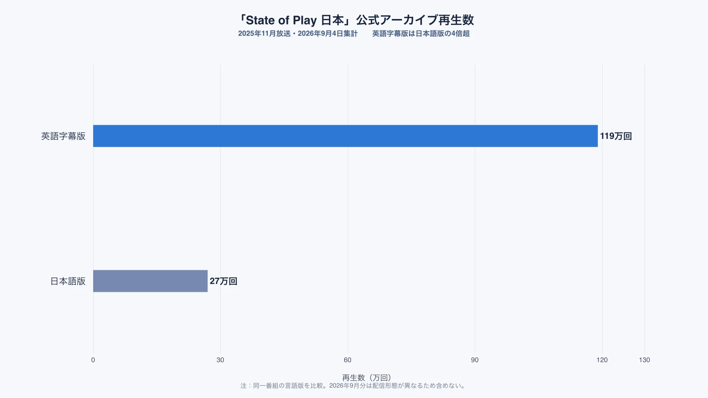
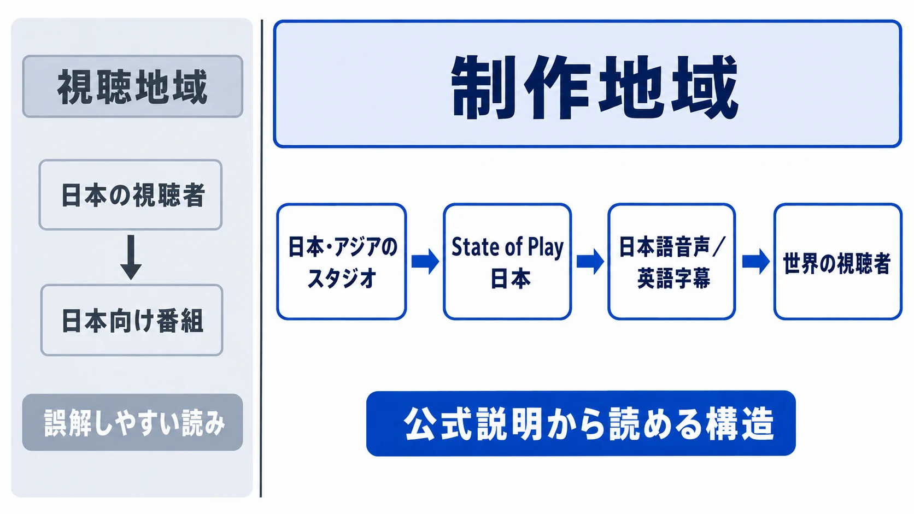

# 「State of Play 日本」は誰に向けた番組か――地域別ショーケースの設計

## 1. 2026年9月3日22時、二つの番組が続けて流れた

2026年9月3日、日本時間22時からPlayStationの情報番組「State of Play」と「State of Play 日本」が連続して放送された。前半の「State of Play」はPlayStation Studiosとソフトウェアメーカー各社の新情報を紹介し、最後にスクウェア・エニックスの『ファイナルファンタジーVII リベレーション』を長めの映像で取り上げた。直後に始まった「State of Play 日本」では、声優の梶裕貴氏が司会を務め、日本・アジアのスタジオが手がける作品を、ゲームプレイ、開発者の説明、新発表を交えて掘り下げた。二番組を通じて30作以上が紹介されている。[[1](#ref-1)][[2](#ref-2)]

ここでいう **ショーケース** とは、企業が複数の新作や更新情報をまとめて見せる発表番組である。店頭の陳列棚と同じく、何を、どの順番で、どれだけ長く見せるかによって、個々の作品の見え方が変わる。

また、**パブリッシャー** とは、ゲームを市場へ届ける役割を担う会社や部門である。開発費の負担、販売、宣伝、各プラットフォームとの調整などを担うことが多い。実際にゲームを作るスタジオと同じ会社の場合もあれば、別会社の場合もある。「State of Play」は、PlayStation自身の作品だけでなく、こうした外部パブリッシャーや開発会社の作品も載せる発表枠である。

今回の目立つ点は、内容が多かったことだけではない。世界各地の作品を扱う番組の直後に、日本・アジアへ焦点を絞った別番組を置いたことである。なぜ一つの番組ではなく、二つの枠だったのだろうか。

***

## 2. 公式が説明していること、していないこと

放送前のPlayStation公式発表は、二つの枠を次のように分けていた。前半は “updates from studios around the world”（世界各地のスタジオからの最新情報）、後半は “upcoming games from game studios in Japan and Asia”（日本・アジアのゲームスタジオによる今後の作品）である。さらに、前半は英語音声と日本語字幕、後半は日本語音声と英語字幕で配信すると案内した。[[1](#ref-1)]

一方、公式発表は、なぜ二つの番組へ分けたのかを説明していない。尺を確保するためなのか、作品の見せ方を変えるためなのか、あるいは別の理由なのかは、公表資料から確定できない。

したがって、本稿では理由を当てにいかない。公式が示した区分、会社の変化、公開された動画の再生数、放送時刻という観察可能な事実を並べ、その枠がどのような性格を持つかを読む。以下の議論は、社内の編成意図を断定するものではない。

***

## 3. 「日本」を冠する番組を出している会社

「State of Play 日本」を運営するソニー・インタラクティブエンタテインメント（SIE）の出発点は日本にある。1993年11月、ソニー株式会社とソニー・ミュージックエンタテインメントの合弁で、株式会社ソニー・コンピュータエンタテインメント（SCE）が設立された。[[3](#ref-3)]

2016年4月、SCEとネットワーク事業を担っていたソニー・ネットワークエンタテインメントインターナショナルの事業組織を統合し、SIEが発足した。主本社は米国カリフォルニア州サンマテオに置かれ、東京とロンドンにもグローバル規模の業務組織を置く体制となった。初代の社長兼グローバルCEOはアンドリュー・ハウス氏である。[[4](#ref-4)] 同日、地域の販売・マーケティングを担っていたソニー・コンピュータエンタテインメントジャパンアジアは、ソニー・インタラクティブエンタテインメントジャパンアジアへ名称を変えた。[[5](#ref-5)] 現在の公式サイトは、グローバル本社をサンフランシスコ ベイエリアとし、住所を「2207 Bridgepointe Pkwy, San Mateo, CA 94404」と示す一方、東京にも二つの拠点を掲げている。[[6](#ref-6)]

ここで変わったのは資本の国籍ではなく、PlayStation事業の **グローバル本社機能の置き場所と組織の組み方** である。SIEは東京に本社を置くソニーグループ株式会社の傘下にある。[[4](#ref-4)]

地域ごとの扱いが変化してきた例は、ハードの発売にも見える。PlayStation 4は北米で2013年11月15日、欧州とラテンアメリカで11月29日に発売された一方、日本発売は2014年2月22日だった。[[7](#ref-7)][[8](#ref-8)] 日本は北米より約3か月遅い。この発売順は国内の期待とのずれを生み、当時のインタビューでも日本発売を遅らせた理由が問われた。SCEJAプレジデント河野弘氏は、米国で開発された作品を日本向けに整える時間と、日本のゲーム会社による作品をそろえる必要を理由として説明している。[[9](#ref-9)]

2021年4月には、PlayStation Studios JAPAN Studioが『ASTRO's PLAYROOM』の開発チームであるTeam ASOBIを中心とする組織へ再編された。SIEが公表した声明によれば、外部制作、ソフトウェアのローカライズ、JAPAN Studio作品のIPマネジメントはPlayStation Studiosのグローバル部門へ集約された。IPとは作品名、キャラクター、設定など、作品を継続して展開する土台となる知的財産を指す。[[10](#ref-10)]

これらは、PlayStationが日本で生まれた事業から、複数地域の機能を束ねる運営へ変化してきた事実を示す。ただし、この企業構造が「State of Play 日本」の編成を決めたという因果関係は公表されていない。番組を読むための背景として、ここまでに留める必要がある。

***

## 4. 観客はどの言語で受け取ったか

公式YouTubeのアーカイブは、番組の届き方を考える手掛かりになる。2026年9月4日に確認した2025年11月放送分の再生数は、PlayStation Japanの日本語版がおよそ27万回、グローバルのPlayStationチャンネルにある英語字幕版がおよそ119万回だった。英語字幕版は日本語版の4倍を超える。[[11](#ref-11)][[12](#ref-12)]

*図：2026年9月4日時点の公式アーカイブ再生数[[11](#ref-11)][[12](#ref-12)]。2026年9月分は配信形態が異なるため含めていない。*

YouTubeの再生数から、視聴者一人ひとりの居住地までは分からない。同じ人が複数版を見た可能性もあり、再生数は視聴者数そのものでもない。それでも、**日本・アジア制作の作品を扱う番組に対して、英語字幕で受け取る規模の大きな需要があった** ことは確認できる。

参考として、2026年9月3日放送分は、配信のおよそ15時間後にあたる9月4日午前の確認時点で、日本語版がおよそ73万回、英語版がおよそ280万回、英語字幕版がおよそ84万回だった。[[13](#ref-13)][[14](#ref-14)][[15](#ref-15)] ただし、こちらのアーカイブは前半の「State of Play」と後半の「State of Play 日本」を分割せず、一つの動画にまとめている。放送直後の暫定値でもあるため、2025年11月の単独番組と単純比較はできない。本稿の根拠に使うのは、同じ番組の言語版を比べられる2025年11月の数字である。

なお、日本語版のタイトルが「12.11.2025」、英語字幕版が「November 11, 2025」と一日ずれているのは、同じ放送を日本時間と米国時間で表記したためである。別々の番組ではない。

***

## 5. 放送時刻が語っていたもの

2025年11月の「State of Play 日本」は、日本時間11月12日午前7時から40分以上にわたって放送された。[[16](#ref-16)] 米国では前日の西部時間14時、東部時間17時に当たる。番組名には「日本」とあるが、日本では通勤・通学が始まる朝、米国では午後から夕方という配置だった。

2026年9月は、日本時間22時からの連続放送へ移った。反対に米国では、西部時間6時、東部時間9時である。[[1](#ref-1)] 日本の視聴者が生放送を見やすい夜へ移る一方、米国では朝になった。放送時刻は、どの地域の視聴者にリアルタイム参加を求めるかという編成上の選択である。少なくとも二回の配置は、「日本」という番組名だけから想像するほど固定的ではない。

この間の出来事として、2025年4月1日には西野秀明氏がSIEの社長兼CEOへ就任している。[[17](#ref-17)] 時系列に並べると、社長CEO交代、2025年11月の朝7時放送、2026年9月の夜22時放送の順である。ただし、経営体制の変更が放送時刻を変えたとする公式説明はない。同じ時期に起きた二つの変化を、因果関係として結ぶことはできない。

***

## 6. 「地域別」には二つの意味がある

ここまでの観察は、「地域別番組」という言葉に含まれる二つの切り分けを区別すると、一つにつながる。

一つ目は、**見る人の地域で分ける** という考え方である。この意味なら、「State of Play 日本」は主として日本の視聴者へ向けた番組に見える。日本語音声で、日本の声優が司会を務め、日本の夜に放送されれば、なおさらそう感じやすい。

二つ目は、**作る人の地域で分ける** という考え方である。公式が一貫して示している定義はこちらだ。2025年11月は「日本およびアジア地域で制作されたゲーム」、2026年9月は「日本・アジアのゲームスタジオによる今後の作品」を特集すると説明している。[[16](#ref-16)][[1](#ref-1)] 区切りの基準は、視聴者の居住地ではなく、紹介する作品の制作地域に置かれている。

*図：「視聴地域」で区切る読みと、公式説明から読める「制作地域」で区切る構造の対比。*

この読み替えをすると、日本を冠した番組の英語字幕版が日本語版より多く再生された事実は矛盾ではなくなる。「State of Play 日本」は、まず日本のファンだけを囲う枠ではなく、**日本・アジアで作られる作品を選び、世界へ差し出す枠** と読めるからである。

もちろん、これは公式が掲げた番組目的の引用ではなく、公開された構造から導く解釈である。2026年9月に日本の夜へ放送時刻が移ったことは、日本の視聴者を重視していないという意味でもない。制作地域で作品を束ねながら、音声、字幕、時刻を変えて複数地域の観客へ届ける。その二層を分けて考えることが、この枠の性格をつかむ鍵となる。

***

## 7. 枠の性格を読むということ

ゲームプランナーにとって、発表枠は完成した映像を置くだけの容器ではない。自社作品をどの枠へ載せるかによって、準備すべき素材が変わる。

- **映像の尺**：短い初報で関心をつかむのか、長いゲームプレイで仕組みまで理解してもらうのか。
- **字幕と音声の言語**：誰が話し、どの言語を音声にし、どの地域へ字幕を用意するのか。
- **情報の粒度**：作品名と発売時期を示す段階なのか、操作、成長、物語など一段深い内容を説明する段階なのか。
- **公開のタイミング**：生放送へ参加してほしい地域と、後からアーカイブで見る地域をどう想定するのか。

たとえば、制作地域を入口にしつつ世界へ届ける枠なら、日本語での開発者インタビューは作品の出自を伝える強みになる。同時に、短く翻訳しやすい説明、映像だけでも理解できるゲームプレイ、英語字幕を読む時間を含む編集が重要になるだろう。これは「State of Play 日本」への参加条件を示す公式ルールではなく、枠の構造から企画側が検討できる一般的な準備項目である。

枠の名前だけを見て「国内向け」と決めつければ、海外の観客へ伝える素材が足りなくなる。逆に「世界配信だから英語だけでよい」と考えれば、その地域で作られた作品を深掘りする枠の持ち味を失う。誰が作った作品を、誰が見る可能性のある場所へ、どう翻訳して載せるのか。発表枠の設計を読むとは、この三つを分けて考えることである。

***

## 8. おわりに

2026年9月3日の連続放送は、「State of Play 日本」の「日本」が何を指すのかを見直す機会になった。公式の区分は視聴者の地域ではなく、作品を作るスタジオの地域である。2025年11月の英語字幕版が日本語版を大きく上回ったことも、この枠を日本・アジア産タイトルの世界向けショーケースと読めば、自然に理解できる。

一方、2026年9月の22時放送が今後も定着するかは、2026年9月4日時点では確認できない。次回以降も日本の夜に置かれるのか、単独番組へ戻るのか、二番組を連続させる形式が続くのかは未確定である。だからこそ、番組名から対象者を決めつけず、紹介作品、音声と字幕、配信チャンネル、放送時刻という実際の設計を、その都度読む必要がある。

## References

1. [State of Play & State of Play Japan return on September 3｜PlayStation.Blog][1] - 2026年9月の二番組の区分、言語、放送時刻を示す公式発表。

2. [State of Play & State of Play Japan: all announcements, trailers｜PlayStation.Blog][2] - 二番組で30作以上を扱ったことと各発表をまとめた公式記事。

3. [沿革（詳細）｜ソニー・インタラクティブエンタテインメント][3] - 1993年のSCE設立を含む公式年表。

4. [「ソニー・インタラクティブエンタテインメントLLC」設立のお知らせ｜ソニー・インタラクティブエンタテインメント][4] - 2016年の統合、主本社、東京・ロンドンの業務組織、初代経営体制を示す公式発表。

5. [社名変更およびコーポレートサイトURL変更のお知らせ｜ソニー・インタラクティブエンタテインメント][5] - SIEJAへの名称変更と当時の地域機能を示す公式発表。

6. [企業情報・会社概要｜ソニー・インタラクティブエンタテインメント][6] - 現在のグローバル本社と東京拠点を示す公式会社情報。

7. [PLAYSTATION 4 LAUNCHES NOVEMBER 15 IN NA, NOVEMBER 29 IN EUROPE AND LA｜Sony Group][7] - PS4の北米、欧州、ラテンアメリカ発売日を示す公式資料。

8. [「プレイステーション 4」日本国内で2014年2月22日発売｜ソニー・インタラクティブエンタテインメント][8] - PS4の日本発売日と国内向けソフトウェアラインアップを示す公式発表。

9. [SCE：遅らせたPS4の国内発売　新ハードPSVitaTVの狙いは？　河野弘プレジデントを直撃｜MANTANWEB][9] - 河野弘氏が日本発売を遅らせた理由を説明した当時のインタビュー。

10. [Report: Sony Interactive Entertainment JAPAN Studio downsizing, but Team ASOBI remains｜Gematsu][10] - SIEが示したJAPAN Studio再編の声明全文を掲載。

11. [State of Play 日本｜12.11.2025［日本語 - JAPANESE］｜PlayStation Japan][11] - 2025年11月放送の日本語版公式アーカイブ。

12. [State of Play Japan｜November 11, 2025［English Subtitles］｜PlayStation][12] - 2025年11月放送の英語字幕版公式アーカイブ。

13. [State of Play｜2026年9月3日［日本語］｜PlayStation Japan][13] - 2026年9月の二番組をまとめた日本語版公式アーカイブ。

14. [State of Play｜September 3, 2026［English］｜PlayStation][14] - 2026年9月の二番組をまとめた英語版公式アーカイブ。

15. [State of Play｜September 3, 2026［English Subtitles］｜PlayStation][15] - 2026年9月の二番組をまとめた英語字幕版公式アーカイブ。

16. [日本時間11月12日（水）午前7時から「State of Play 日本」放送決定！｜PlayStation.Blog 日本語][16] - 2025年11月放送の開始時刻、尺、対象作品を示す公式発表。

17. [New Leadership at Sony Interactive Entertainment｜Sony Group][17] - 西野秀明氏の社長兼CEO就任日を示す公式発表。

[1]: https://blog.playstation.com/2026/08/31/state-of-play-state-of-play-japan-return-on-september-3/
[2]: https://blog.playstation.com/2026/09/03/state-of-play-state-of-play-japan-all-announcements-trailers/
[3]: https://sonyinteractive.com/jp/our-company/expanded-company-timeline/
[4]: https://sonyinteractive.com/jp/press-releases/2016/160126a/
[5]: https://sonyinteractive.com/jp/press-releases/2016/160401-3/
[6]: https://sonyinteractive.com/jp/our-company/
[7]: https://www.sony.com/en/SonyInfo/IR/news/20130821_01E.pdf
[8]: https://sonyinteractive.com/jp/press-releases/2013/130909a/
[9]: https://mantan-web.jp/article/20130909dog00m200062000c.html
[10]: https://www.gematsu.com/2021/02/report-sony-interactive-entertainment-japan-studio-downsizing-but-team-asobi-remains
[11]: https://www.youtube.com/watch?v=A-tsdI_jD6w
[12]: https://www.youtube.com/watch?v=DJp8K40TSxc
[13]: https://www.youtube.com/watch?v=o7-9kDxZMTE
[14]: https://www.youtube.com/watch?v=dcTYz_mJpkU
[15]: https://www.youtube.com/watch?v=KpXesINIQc4
[16]: https://blog.ja.playstation.com/2025/11/10/20251110-sop/
[17]: https://www.sony.com/en/SonyInfo/News/Press/202501/25-007E/

----

この文書は、Perplexity、Claude、OpenAI Codex の3つのAIの支援を受けて著述されたものです。引用画像を除き、MIT License にて提供されています。
