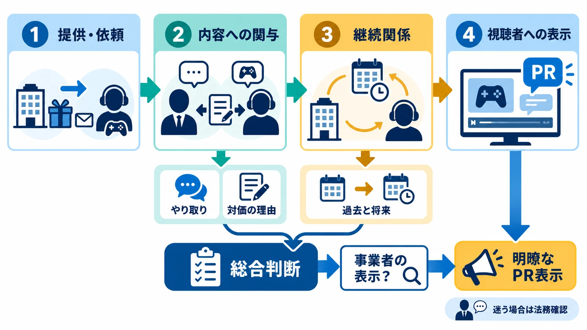
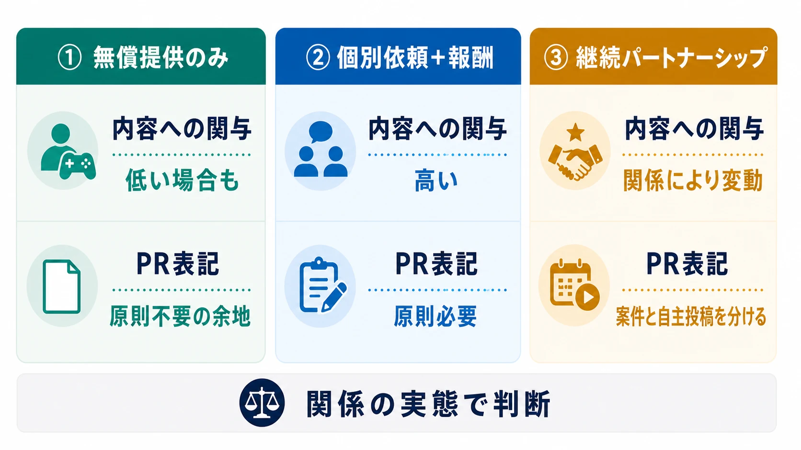

# その配信、PRですか？――ステルスマーケティング規制とゲーム実況・VTuberタイアップの実務

> **注意：** 本稿は公開資料を基に制度と実務上の判断軸を整理したものであり、個別の法的助言ではありません。「事業者の表示」に当たるかどうかは、契約書の名称や報酬の有無だけでなく、実際の依頼、提供物、確認工程、過去と将来の関係によって決まります。企画の実施前には最新の法令・運用基準・プラットフォーム規約を確認し、法務部門や弁護士へ相談してください。

## 1. 2019年の「アナ雪2」騒動から、2023年の規制へ

2019年12月、『アナと雪の女王2』を題材にした感想漫画がTwitterへ相次いで投稿された。投稿時刻がほぼ重なり、広告であることを示す表記もなかったため、第三者の自発的な感想に見せた宣伝ではないかと疑われた。ウォルト・ディズニー・ジャパンは当初、広告表示が抜けたのは伝達ミスであり「ステルスマーケティングではないという認識」と説明した。[[1](#ref-1)] 翌12月5日には公式に謝罪し、7名のクリエイターへ感想漫画の投稿を依頼した企画であり、本来は「PR」と明記する予定だったと公表した。[[2](#ref-2)]

感想漫画には、作者の絵柄、体験、言葉がある。宣伝はバナー広告のように独立せず、創作物の中へ溶け込む。ゲーム実況やVTuberの案件配信も同じである。視聴者が見に来るのはゲーム会社の広告文ではなく、配信者の反応、攻略、雑談、失敗を含む一本のコンテンツだ。その創作性が高いほど、企業との関係が見えなければ「本人が自発的に選んだゲーム」という印象も強くなる。

「ステマ」という言葉が社会へ浸透する契機の一つは、2012年のペニーオークション詐欺事件だった。複数の芸能人が、実際には落札していない商品を安く落札したかのようにブログで紹介し、広告であることも示していなかった。[[3](#ref-3)] それから十年以上、広告主の関与と第三者らしい外観だけを捉える専用の不当表示類型がない状態が続いた。2023年10月1日、景品表示法第5条第3号に基づく指定告示が施行され、日本でもステルスマーケティングが景品表示法上の不当表示として直接規制されるようになった。[[4](#ref-4)]

既存記事「[ゲームプランナーが知っておくべき法令ガイド](game-planner-japanese-law-guide.md)」は、コンプガチャや排出率表示を中心に、商品内容・取引条件の誤認を扱っている。本稿が扱うのは、発信内容の真偽より前にある **「誰の広告なのかを隠していないか」** という別の論点である。

***

## 2. 規制されるのは「配信者」ではなく「事業者」である

指定告示の正式名称は「一般消費者が事業者の表示であることを判別することが困難である表示」である。告示本文は、次の二段階を規制対象としている。[[4](#ref-4)]

1. ゲーム会社やパブリッシャーが、自社のゲームの取引について行う **「事業者の表示」** である。
2. その表示が事業者のものだと、一般消費者には判別しにくい。

ここで重要なのは、景品表示法上の規制対象が、広告・宣伝を依頼した **事業者** だという点である。依頼を受けて投稿する実況者、VTuber、タレント、アフィリエイターは、原則としてこの告示の規制対象ではない。クリエイターが広告主と共同で商品・サービスを供給している例外的な場合は別だが、通常の案件配信では、行政上の責任をまず負うのはゲーム会社・パブリッシャー側である。[[5](#ref-5)][[6](#ref-6)]

これは、配信者が何をしてもよいという意味ではない。契約違反、プラットフォーム規約、ほかの法令、視聴者との信頼は別に残る。しかしステマ告示への対応を「配信者が自主的にPRタグを付けるか」というモラルの問題へ置き換えると、発注側の責任を見失う。

ゲーム会社は、代理店や芸能事務所を間に挟んでも、最終投稿で関係が明瞭になるよう企画を設計する必要がある。『アナと雪の女王2』の事例が示したのも、まさにこの点である。社内ではPR表記を予定していても、発注書、事務所への連絡、クリエイターへの指示、投稿確認のどこかで抜ければ、視聴者が見る表示には反映されない。責任ある運用とは、善意を期待することではなく、伝達経路の最後まで表示を仕様化することである。

***

## 3. 「事業者の表示」は、契約名ではなく関係の実態で決まる

外形上は配信者の動画や投稿でも、ゲーム会社が表示内容の決定に関与したと認められれば「事業者の表示」になる。言い換えれば、客観的に見て、配信者が本当に自主的な意思で内容を決めたとは認めにくい場合である。運用基準と消費者庁Q&Aは、明示的な台本やセリフの指定がなくても、主に次の三群を総合して判断するとしている。[[5](#ref-5)][[6](#ref-6)]

| 判断する事情 | ゲーム実況で確認するもの | 危険側へ寄る例 |
|---|---|---|
| **やり取りの内容と態様** | メール、発注書、口頭説明、送付状、配信ガイド、事前確認 | 投稿日時、扱うモード、訴求点、言い回し、評価の方向を指定する |
| **対価の内容と理由** | 金銭、ゲームキー、限定版、機材、イベント招待、先行プレイ権 | 宣伝や投稿を得る目的で提供し、投稿を条件に報酬を支払う |
| **過去と将来の関係** | 過去案件、アンバサダー契約、継続招待、次回起用の示唆 | 好意的な投稿が次の案件や先行アクセスにつながると感じさせる |

対価は現金に限られない。物品、イベントへの招待、その他の経済上の利益も含まれ得る。ゲームでは、一般発売前のビルドへ触れられること、限定イベントへ参加できること、今後もレビューコードの送付先に残れることが、関係性を判断する事情になり得る。[[5](#ref-5)]

一方、 **無償でゲームを提供しただけで、直ちに「事業者の表示」になるわけではない** 。運用基準は、無償提供と投稿依頼があっても、第三者が自主的な意思で内容を決めた表示は事業者の表示に当たらない例を示している。特定のインフルエンサーへ提供する場合は、不特定多数への試供品配布よりも一定の関係が生じやすいが、それでも無償提供だけで結論は決まらない。提供の目的、投稿前後のやり取り、過去の取引、将来の起用可能性までを見る。[[5](#ref-5)][[6](#ref-6)]

したがって、「報酬ゼロだからPRではない」とも、「レビューコードを渡したから必ず広告だ」とも一律にはいえない。実務では、法的な該当性の最低線を狙うより、提供を受けた事実を視聴者に短く示すほうが説明しやすい。たとえば「○○社からレビューコードの提供を受けています。内容や評価の指定はありません」と記載すれば、報酬案件と独立レビューの違いも伝えられる。

***

## 4. ゲーム実況・VTuberタイアップを三つに分けて考える

### 1. アーリーアクセス版・レビューコードの無償提供のみ

ゲーム会社がレビュー目的でキーを送り、投稿の有無、公開日時、評価、話す内容を指定せず、配信者が自分の判断で取り上げる。この形なら、投稿が配信者の自主的な意思によるものと認められ、「事業者の表示」に当たらない余地がある。

ただし、名称が「レビューコード提供」でも、次の条件が加われば判断は変わる。

- 指定日時に必ず配信するよう求める
- 紹介してほしい機能や、避けてほしい評価を伝える
- 台本、サムネイル、タイトル、投稿文を事前承認する
- 好意的な投稿を、次回の先行プレイやイベント招待の条件として示唆する
- 長期のクリエイタープログラムの中で、継続的に便益を提供する

発売前情報の漏えいを防ぐための解禁日時や、客観的な誤りの確認だけで直ちに広告になるとは限らない。内容の正確性・秘密情報の管理と、評価の方向を支配することは分ける必要がある。発注側は「何を守ってほしいか」だけでなく、 **感想と評価はクリエイターが独立して決める** ことも文書に残すべきである。

この型での実務上の安全策は、報酬案件と同じ「PR」を機械的に付けることだけではない。「ゲームキー提供」「先行プレイ機会の提供」「交通・宿泊の提供」など、何を受け取ったかを具体的に示す方法がある。消費者庁Q&Aも、元から投稿する意思があり、自主的な内容と認められる場合にPR表記を一律要求してはいない一方、提供を受けた旨の記載は有益だとしている。[[6](#ref-6)]

### 2. 個別に投稿を依頼し、報酬を支払う案件配信

タイトルを指定して配信を依頼し、報酬を支払う案件は、もっとも整理しやすい。消費者庁Q&Aは、個別の投稿依頼を受けて報酬を受領する場合、投稿内容の細かな指定がなくても「事業者の表示」に該当する可能性が高いとしている。[[6](#ref-6)]

この型では、配信者に自由な感想を認めることと、広告であることは両立する。「自由に話してよいから広告ではない」という整理にはならない。ゲーム会社が企画を依頼し、配信という表示を得るために報酬を支払っている以上、配信者が批判もできる契約であっても、視聴者には依頼関係を明らかにするのが基本である。

契約書には、少なくとも次の項目を入れる。

- 配信タイトル、概要欄、画面内で使う開示文言
- 表示を出す時間と位置
- ライブ配信後のアーカイブでも表示を維持すること
- 切り抜き・Shorts・SNS告知を作る場合の表示方法
- 代理店や事務所を介する場合の確認担当者
- 公開後に表示漏れが見つかった場合の修正手順と期限

### 3. 継続的なパートナーシップ契約

公式アンバサダー、長期スポンサー、クリエイタープログラムの上位枠など、継続的な関係では、個々の投稿に報酬が付いていなくても判断が複雑になる。過去に対価を提供した関係がどの程度続いたか、今後も対価や便益を提供する関係がどの程度続くかは、運用基準が明示する考慮要素である。[[5](#ref-5)]

継続契約中の配信は、案件対象と自発的な通常配信を社内台帳で分ける。案件対象には共通の表示テンプレートを適用し、対象外の配信についても、契約上の関係が視聴者の評価に影響し得るなら「○○社の公式パートナーです。本配信の内容指定・個別報酬はありません」と関係を説明する運用が分かりやすい。

過去に案件を受けた会社の別タイトルを、後日自費で購入して自主的に配信するだけなら、その過去の取引だけで常に「事業者の表示」になるわけではない。[[6](#ref-6)] 問題は肩書ではなく、その配信について会社が内容を決められる程度の関係があったかである。継続契約ではこの境界が外から見えにくいため、契約時に「案件」「提供のみ」「完全に自主的な投稿」の三分類を作っておくと運用しやすい。

***

### 初の措置命令が、ゲームのレビュー施策へ投げかけるもの

ステマ告示に基づく初の措置命令は、2024年6月6日、医療法人社団祐真会に対して行われた。同法人が運営するクリニックは、インフルエンザワクチンの接種費用を割り引く条件として、来院者にGoogleマップで星5または星4の評価を投稿するよう伝えていた。消費者庁は、その投稿を法人が内容の決定に関与した「事業者の表示」と認定し、しかも広告主との関係が明瞭ではないとして措置命令を出した。[[7](#ref-7)] これはステマ告示に基づく最初の措置命令と位置づけられている。[[8](#ref-8)]

ゲームのユーザーレビュー施策にも、同じ構造が現れる。「レビューを投稿した人へ壁紙を配布する」「感想を投稿した人から抽選でグッズを贈る」だけなら、投稿内容を利用者が自主的に決める限り、通常は事業者の表示に当たらない場合がある。消費者庁Q&Aも、口コミ投稿と引き換えの割引や、レビュー投稿者への次回クーポンについて、内容を指示しない場合は通常違反しないという考え方を示している。[[6](#ref-6)]

一方、「星5を付ける」「おすすめと書く」「高評価のレビュー画面を送る」といった条件は、事業者が表示内容を決める。祐真会の事案は、文章を書かせなくても、星の数を指定するだけで内容への関与になり得ることを示した。ストアレビュー、Googleの口コミ、SNSキャンペーンのどれであっても、 **投稿を増やす施策** と **好意的な評価を条件にする施策** は分けなければならない。さらに、各ストアやプラットフォームが独自にインセンティブ付きレビューを制限している場合があるため、景品表示法だけで実施可否は決まらない。

***

## 5. 芸能人のYouTubeチャンネルでは、契約経路を表示経路へ変える

芸能人のYouTubeチャンネルを使ったゲーム実況は、VTuberや個人配信者と別の法律が適用されるわけではない。ただし、ゲーム会社、広告代理店、芸能事務所、タレントという契約経路が文書化されやすい分、誰が何を依頼し、どの対価で、誰が投稿を確認したかを整理しやすい場合がある。

その反面、組織が増えるほど「誰かがPR表記を入れるはず」という空白も生まれる。ゲーム会社の発注書には表示義務があっても、事務所からタレントや編集会社へ渡す制作指示に落ちていなければ、最終動画には出ない。概要欄を事務所が管理し、動画内テロップを制作会社が管理し、タイトルをチャンネル担当者が管理する体制なら、一人へ「適切に表示すること」と頼むだけでは足りない。

契約書と制作進行表では、表示を媒体単位で担当分けする。

| 表示箇所 | 主担当の例 | 納品・公開前に残す証跡 |
|---|---|---|
| タイトル・概要欄 | チャンネル運用担当 | 公開予約画面のスクリーンショット |
| 動画内テロップ・口頭説明 | 制作会社・タレント | 確認用動画とタイムコード |
| サムネイル | デザイナー・運用担当 | 最終画像 |
| YouTubeの有料プロモーション設定 | チャンネル管理者 | 設定画面の確認記録 |
| 切り抜き・SNS告知 | 二次利用の担当者 | 投稿案と公開URL |

ゲーム会社側は、事務所との契約締結を完了条件にせず、公開された表示まで確認する。契約関係が明確であることは、視聴者に広告だと伝わることと同じではない。芸能人が普段からゲームを遊ぶチャンネルほど、視聴者は通常回との区別を付けにくいため、表示はむしろ明示的であるべきだ。

***

## 6. PR表記は「書いたか」ではなく「気付けるか」で決まる

運用基準が挙げる分かりやすい文言は、「広告」「宣伝」「プロモーション」「PR」、または「A社から商品の提供を受けて投稿している」といった文章である。特定の一語だけが法律上の正解なのではなく、表示内容全体から、一般消費者が事業者の表示だと理解できる必要がある。以下の配置例は、告示が媒体ごとの定型を定めたものではなく、この判断軸をゲーム配信の制作工程へ落とし込んだ実務案である。[[5](#ref-5)][[6](#ref-6)]

ゲーム実況なら、関係に合わせて次のように書き分けられる。

- 報酬案件：`【PR】○○社の依頼で『ゲーム名』を配信しています`
- ゲームキー提供：`○○社からレビューコードの提供を受けています。内容・評価の指定はありません`
- 先行イベント招待：`○○社から先行体験会への招待と交通費の提供を受けています`
- 継続契約：`○○社の公式パートナーとして配信しています`

不十分になりやすいのは、広告である旨を認識できないほど短時間だけ出す、長い動画の途中や末尾にしか出さない、小さく薄い文字にする、大量のハッシュタグへ埋める、といった表示である。動画は途中から見始める人もいるため、消費者庁Q&Aは、冒頭だけの表示では見逃される場合があり、画面上へ常時「広告」と表示するなど、動画全体を通して明瞭にすることが望ましいとしている。[[5](#ref-5)][[6](#ref-6)]

### ライブ配信

タイトルの先頭に `【PR】` を置き、配信画面には視認できる大きさの `PR` または `○○社提供` を継続表示する。開始時には口頭でも関係を説明し、概要欄の冒頭と固定コメントにも同じ情報を置く。固定コメントだけでは、チャットを閉じた視聴者や途中参加者へ届かないため、画面内表示の代わりにはしない。

### アーカイブ動画

ライブ終了後も、タイトル、概要欄、画面内の表示を残す。2023年10月1日より前の投稿でも、施行後に表示が継続していれば行政処分の対象となる可能性があると消費者庁Q&Aは示している。[[6](#ref-6)] 過去案件を非公開にする必要が常にあるわけではなく、広告だった投稿へ明瞭な表示を追加できるかを点検する。

### 切り抜き・Shorts

元配信にPR表示があっても、そこから作った切り抜きが独立して流通すれば、元動画の冒頭説明は届かない。切り抜きごとにタイトル、画面、説明欄へ関係を表示する。外部の切り抜きチャンネルへ二次利用を許可する場合は、素材の利用条件にPR表示テンプレートを含める。

### サムネイルとSNS告知

サムネイルは視聴前に単独で見られるため、案件配信では `PR` を入れる運用が分かりやすい。ただし、サムネイルだけに小さく表示して完了とはしない。タイトル、動画内、概要欄でも重ねて伝える。SNS告知も、返信欄ではなく投稿本文に `PR` や依頼関係を記載する。消費者庁Q&Aは、本文ではなく返信だけに「広告」と書く方法は、通常気付かれにくいとしている。[[6](#ref-6)]

YouTubeで有料プロモーションを含む動画を公開する場合は、動画詳細の「有料プロモーション」設定も有効にする。YouTubeは、この申告を受けると動画冒頭の10秒間に開示メッセージを表示する。[[9](#ref-9)] ただし、消費者庁Q&Aは冒頭だけでは不十分になり得るとしているため、プラットフォームの自動表示を、タイトルや画面内表示の代替にしない。 **プラットフォーム設定と、日本の表示規制に合わせた開示を両方行う** のが実務上の基本である。

***

## 7. 新規タイアップ企画前の確認表

PR表示は、公開直前に付け足す注意書きではない。提供条件を決める時点から、次の項目を企画書・発注書・進行表へ入れる。

- [ ] **提供物を列挙したか**：報酬、ゲームキー、限定版、機材、先行プレイ権、イベント招待、交通・宿泊などを記録した
- [ ] **提供理由を説明できるか**：単なる贈答か、投稿・宣伝を得るための提供かを社内で整理した
- [ ] **投稿への関与を記録したか**：日時、モード、訴求点、台本、評価、事前確認のうち何を指定するかを明確にした
- [ ] **秘密保持と評価の自由を分けたか**：解禁日時・未公開情報・客観的誤りの確認と、感想の方向を支配する指示を混同していない
- [ ] **過去と将来の関係を確認したか**：過去案件、継続契約、次回起用、クリエイタープログラム上の便益を把握した
- [ ] **案件の分類を決めたか**：「報酬案件」「提供のみ」「自主投稿」のどれかを決め、判断理由を残した
- [ ] **契約書に表示義務を書いたか**：使用文言、位置、表示時間、アーカイブ、切り抜き、SNS告知まで指定した
- [ ] **媒体ごとの担当者を決めたか**：ゲーム会社、代理店、事務所、タレント、制作会社、チャンネル運用担当の役割を割り振った
- [ ] **途中視聴でも気付けるか**：タイトル、画面内、概要欄、口頭説明を組み合わせ、冒頭の一瞬だけに頼っていない
- [ ] **二次利用でも表示が残るか**：切り抜き、Shorts、サムネイル、SNS転載へ表示を引き継げる
- [ ] **プラットフォーム設定を確認したか**：YouTube等の有料プロモーション申告と、各サービスのレビュー・広告ポリシーを確認した
- [ ] **公開後の修正手順があるか**：表示漏れの発見者、連絡先、修正担当、期限、証跡の保存方法を決めた

最後の判断軸は単純である。 **視聴者が、その配信者自身の自発的な選択・評価だと思って見るのか、それともゲーム会社が関与した宣伝だと理解して見るのか** 。その違いが購買判断へ影響するなら、関係を隠さず、短く、繰り返し、切り抜かれても残る形で示す。

ゲーム実況やVTuber配信の価値は、企業の広告文をそのまま読むことではなく、配信者の創作と反応にある。PR表記はその価値を弱める印ではない。誰が企画へ関与したかを明らかにし、視聴者が内容を適切に受け取るための前提である。発注側がその前提を仕様として守ることが、タイアップを一度きりの露出ではなく、継続できる信頼関係へ変える。

## References

1. [ITmedia NEWS「『伝達ミスだった』『ステマではないと認識』 アナ雪2の“ステマ疑惑”にディズニーがコメント」][1] - 2019年12月の一斉投稿、PR表記の欠落、ウォルト・ディズニー・ジャパンの当初説明を報じた記事。

2. [ウォルト・ディズニー・ジャパン「『アナと雪の女王2』感想漫画企画に関するお詫び」][2] - 7名のクリエイターによる企画であり、本来予定していたPR表記が関係者間のコミュニケーション不足で抜けたとする公式発表。

3. [国民生活センター「ステマ規制をめぐるわが国の動向や海外の現況」][3] - ペニーオークション事件と「ステルスマーケティング」という言葉が社会へ浸透した経緯を整理した解説。

4. [消費者庁「一般消費者が事業者の表示であることを判別することが困難である表示」][4] - 景品表示法第5条第3号に基づく令和5年内閣府告示第19号。2023年10月1日施行。

5. [消費者庁「『一般消費者が事業者の表示であることを判別することが困難である表示』の運用基準」][5] - 事業者による表示内容への関与、対価・継続関係の考慮要素、明瞭・不明瞭な表示例を示す公式基準。

6. [消費者庁「ステルスマーケティングに関するQ&A」][6] - 規制対象、無償提供、報酬付き投稿、口コミ、動画、過去投稿などの具体例を示す公式Q&A。

7. [消費者庁「医療法人社団祐真会に対する景品表示法に基づく措置命令について」][7] - 星5または星4の口コミ投稿を条件にワクチン接種費用を割り引いた表示への、2024年6月6日付措置命令。

8. [長島・大野・常松法律事務所「医療広告を巡る規制動向・執行状況のアップデート」][8] - 祐真会への命令をステマ規制に基づく初の措置命令と位置づける弁護士解説。

9. [YouTubeヘルプ「有料プロダクト プレースメント、スポンサーシップ、おすすめ情報を追加する」][9] - 有料プロモーションの申告方法と、動画冒頭10秒間の自動開示についての公式説明。

[1]: https://www.itmedia.co.jp/news/article/1912/04/1191204154/
[2]: https://www.disney.co.jp/corporate/news/2019/20191205
[3]: https://www.kokusen.go.jp/wko/pdf/wko-202309_01.pdf
[4]: https://www.caa.go.jp/policies/policy/representation/fair_labeling/public_notice/assets/representation_cms216_230328_07.pdf
[5]: https://www.caa.go.jp/policies/policy/representation/fair_labeling/guideline/assets/representation_cms216_230328_03.pdf
[6]: https://www.caa.go.jp/policies/policy/representation/fair_labeling/faq/stealth_marketing/
[7]: https://www.caa.go.jp/notice/entry/038178/
[8]: https://www.nagashima.com/publications/publication20240830-1/
[9]: https://support.google.com/youtube/answer/154235?hl=ja

----

この文書は、Perplexity、Claude、OpenAI Codex の3つのAIの支援を受けて著述されたものです。引用画像を除き、MIT License にて提供されています。
