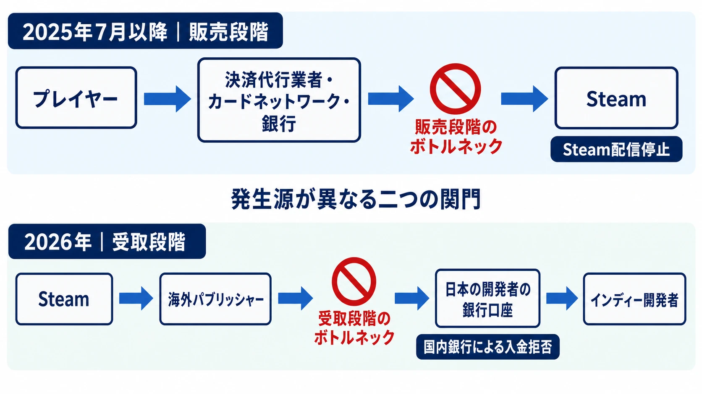
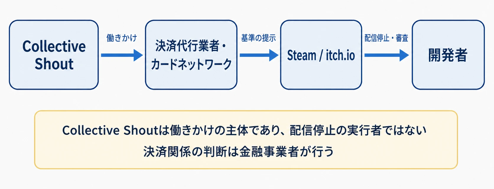
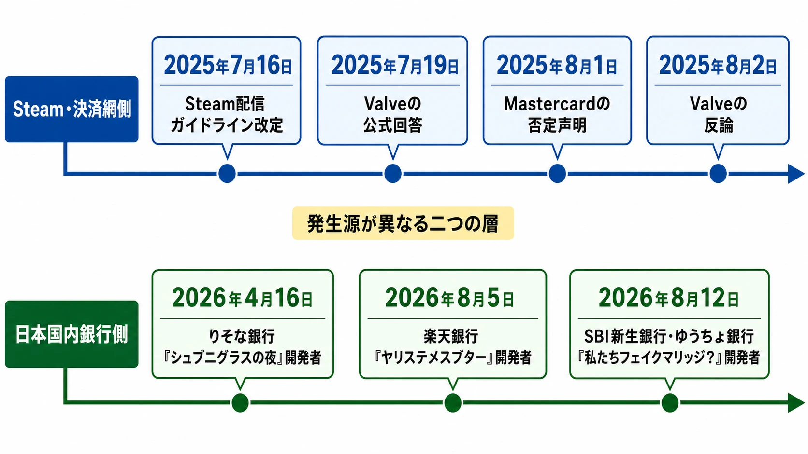

# Steam成人向け規制と国内銀行の入金拒否――インディー開発を止める二重の資金ボトルネック

## はじめに

ゲームが売れてから開発者の手元に資金が届くまでには、複数の金融事業者が介在する。プレイヤーの支払いは決済代行業者やカードネットワーク、銀行を通ってSteamへ届き、Steamの売上はValveや海外パブリッシャーから開発者の銀行口座へ送られる。2025年7月以降、この入口と出口の両方で成人向けゲームを巡る資金の停止が表面化した。

一つ目は、Steamが決済手段を維持するために配信作品を削除する **販売段階のボトルネック** である。二つ目は、海外から送られた売上を日本の銀行が口座へ入金しない **受取段階のボトルネック** である。後者はSteamの配信可否とは別の審査であり、作品が販売を続けていても発生する。

本稿は、[ゲームの年齢区分や各国のレーティング制度](game-global-rating-regulations.md)ではなく、作品と開発者を市場へ接続する金融インフラに焦点を絞る。ゲーム内容の評価や規制の是非を論じるのではなく、誰がどの地点で資金を止めうるのかを時系列に沿って整理する。

***

## 資金の通り道には二つの関門がある

デジタル販売の決済には、ストアだけでなく複数の事業者が関わる。 **決済代行業者** は、ストアに代わってカードなどの支払いを処理する事業者である。VisaやMastercardのような **カードネットワーク** は、加盟店側とカード発行会社側をつなぐ取引網と共通ルールを提供する。 **アクワイアリング銀行** は、加盟店側でカード決済を取り扱う銀行を指す。

売上の受取側にも別の経路がある。日本の開発者が海外パブリッシャーを通じてSteamで販売する場合、パブリッシャーから国内口座へ国際送金が行われる。受取銀行は送金目的、送金元との関係、契約書などを確認し、口座へ入金するかを判断する。

| 段階 | 主な経路 | 資金が止まったときの影響 |
|---|---|---|
| プレイヤーが購入する | プレイヤー → 決済代行業者・カードネットワーク・銀行 → Steam | Steamで作品を販売できなくなる |
| 開発者が売上を受け取る | Valve・海外パブリッシャー → 国際送金 → 国内銀行 → 開発者 | 作品が売れても開発資金として使えない |

二つの関門は同じ金融業界に属していても、判断主体と契約関係が異なる。国内銀行による入金拒否が、2025年のSteam規制や特定のカード会社からの指示で起きたことを示す公表資料はない。したがって両者は一本の因果関係としてではなく、発生源の異なる二重のボトルネックとして捉える必要がある。

***

## 2025年7月、Steamの配信基準に金融事業者が入った

2025年7月16日、Steamworksの配信ガイドラインに新しい禁止項目が加わった。対象は「Steamの決済代行業者、それに関連するカードネットワークや銀行、インターネット・ネットワーク事業者のルールや基準に違反する可能性があるコンテンツ」であり、とりわけ「特定の種類の成人専用コンテンツ」が挙げられた。どの表現が該当するかを列挙した基準は示されなかった。[[1](#ref-1)]

改定と前後して、Steamでは日本作品を含む複数の成人向けタイトルが販売終了となった。7月19日、Game*SparkはValveから得た回答を掲載した。Valveによれば、Steam上の特定作品が決済代行業者と、その背後にあるカード関連会社や銀行の基準に違反すると通知されたため、Steam全体の支払い方法を失わないよう対象作品の販売を終了したという。対象開発者には直接通知し、将来別のゲームを配信する場合に使えるアプリクレジットを提供するとした。[[2](#ref-2)]

この説明が示したのは、個々の作品の売上規模だけで判断できない連鎖である。金融事業者がSteamとの取引を広く停止すれば、影響は指摘された作品にとどまらず、ほかのタイトルや追加コンテンツの購入手段にも及ぶ。Valveは特定作品の販売継続と、ストア全体の決済手段の維持を同じ秤に載せ、後者を選んだことになる。

***

## Collective Shoutは決済網へ働きかけた

この動きの前段には、オーストラリアを拠点とする活動団体Collective Shoutのキャンペーンがあった。同団体が2025年7月28日に公表した時系列によると、3月以降、Steamに対して特定作品と同種のゲームの削除を求めたが、Steamから返答を得られなかった。4月には請願やメール送付を続け、5月26日に決済事業者へのメール運動へ移行し、7月11日にはPayPal、Mastercard、Visa、JCBなどへ公開書簡を送った。[[3](#ref-3)]

同団体はitch.ioに対しても、性的暴力や近親相姦を扱うと判断したゲームの削除を直接求めている。一方、Steamに対しては、プラットフォームへの要求が応答されなかったことを理由に、決済代行業者やカード会社へ働きかける経路へ切り替えた。Collective Shout自身の公開書簡は、Steamとitch.io上の該当コンテンツについて決済処理を直ちに止めるよう金融事業者へ求める内容だった。[[4](#ref-4)]

itch.ioは7月24日、成人向けコンテンツを検索・一覧から一時的に外した。同社は、Collective Shoutが両プラットフォームのコンテンツについて決済事業者へ問題を提起し、決済インフラを守るために緊急の審査が必要になったと説明した。Steamが掲載前審査を行う閉じたストアであるのに対し、誰でも投稿しやすいitch.ioでは対象を絞り込めず、広範な非表示措置になったという。[[5](#ref-5)]

Collective Shoutの判断軸は、各地域の法律に違反するかどうかだけではない。2025年8月30日に公開され、日本では9月1日に報じられたTweakTownのメールインタビューで、同団体のキャンペーンマネージャーCaitlin Roperは、違法でなくても女性や少女を性的対象として扱う表現や虐待的描写を批判し、 **「合法性は決定的な要素ではない」** との立場を明言した。団体が問題視する「害」を基準に金融事業者へ働きかける以上、法令順守だけではキャンペーンの対象外になることを保証しない。[[6](#ref-6)][[7](#ref-7)]

ここでCollective ShoutをSteamや銀行の意思決定者と同一視することはできない。同団体は働きかけの主体であり、配信停止を実行したのはプラットフォーム、決済関係を判断したのは金融事業者である。重要なのは、プラットフォームへ直接要求する経路よりも、決済網へ要求する経路のほうが広い経済的影響を与えたという構造である。

***

## MastercardとValveの説明は食い違った

2025年8月1日、Mastercardは公式声明で、報道や主張に反して「いかなるゲームも審査しておらず、ゲーム制作者のサイトやプラットフォームに活動制限を要求していない」と表明した。同社は、ネットワーク上では合法な購入を認める一方、加盟店には違法な成人向けコンテンツの購入を防ぐ管理を求めていると説明した。[[8](#ref-8)]

翌8月2日、Valveは海外メディアを通じて異なる経路を説明した。Valveによれば、MastercardはValveからの直接協議の求めには応じず、決済代行業者やアクワイアリング銀行と連絡を取り、その内容が決済代行業者からValveへ伝えられた。Valveが合法なゲームの販売継続を主張すると、決済代行業者は拒否し、Mastercard Rules 5.12.7条を示したという。[[9](#ref-9)]

同条は「違法またはブランド価値を損なう取引」を扱い、違法性だけでなく、Mastercardの裁量で同社の信用やブランド表示に悪影響を与えうる取引も対象とする。規則本文には、芸術的価値を欠く明白に不快な製品・サービスや、Mastercardがブランドと結び付けて販売することを不適切と判断する素材も含まれている。[[10](#ref-10)]

両社の声明は、接触の **直接性** と規則の **作用** を異なる角度から述べている。Mastercardはゲームを個別審査して制限を直接要求したことを否定し、ValveはMastercardの規則が決済代行業者とアクワイアリング銀行を通じて示され、販売継続を拒まれたと主張した。公開情報だけでは、やり取りの全文や各社の判断過程までは確定できない。ただし、カード会社からストアへ直接命令が届かなくても、規則が契約の連鎖を通じて配信判断へ届きうることは、この食い違いから読み取れる。

***

## 2026年、日本では売上の受取口が止まり始めた

Steam上の規制は、プレイヤーが作品を買う入口を止める。2026年に日本で相次いで公表された事例は、売上が海外パブリッシャーから開発者へ届く出口で起きた。

ここで用語を整理しておく。報道では一連の入金拒否を「デバンキング」と呼ぶことがあるが、この語は本来、口座の閉鎖や開設拒否など、銀行取引そのものから顧客を排除する状態を指す。特定の送金だけが受け付けられない段階に当たるのは **デリスキング** である。FATF（金融活動作業部会）は、金融機関がリスクを管理するのではなく回避するために、顧客または顧客カテゴリーとの取引関係を終了または制限する現象をデリスキングと定義している。同時にFATFは、個々の顧客のリスク水準やリスク低減措置を十分に考慮せず特定分野の顧客を一括で切り離すことは、自らが求めるリスクベース・アプローチに沿わないとも述べている。[[11](#ref-11)] 本稿では、以下の事例を送金単位での取引制限、すなわちデリスキングとして扱う。

### りそな銀行と『シュブニグラスの夜』開発者

2026年4月16日、Game*Sparkは、サークルRENを主宰し『シュブニグラスの夜』を開発するイツキ舞が、海外パブリッシャー072 Projectからりそな銀行口座への送金を受け取れなくなった事例を報じた。実際の入金停止は同年3月に始まったとされる。イツキは販売実績や作品の表現基準を説明したが、銀行の判断は変わらなかった。[[12](#ref-12)]

イツキは弁護士の助言を受け、約款や内部規定のどの条項に基づく拒否かを書面で示すよう求めた。公表された回答は、送金内容、送金形態、取引背景などを踏まえた「総合的な判断」で入金を見送ったという内容であり、具体的な判断基準や内部検討の詳細は開示されなかった。開発者が契約書や事業内容を説明しても、次の取引が通る条件を特定できない状態が残った。

### 楽天銀行と『ヤリステメスブター』開発者

2026年8月5日には、『ヤリステメスブター』の開発者ぬぷ竜が、台湾のパブリッシャーから楽天銀行への海外送金を拒否された事例が報じられた。銀行から送金者との関係や取引内容を示す資料を求められ、契約書などを提出した後も、入金は認められず、理由は回答できないと通知されたという。[[13](#ref-13)]

『ヤリステメスブター』はDLsiteで約12万5千本、Steam版『ヤリモノ』は2025年7月までに20万本を突破したと公表されている。ただし、報道後のぬぷ竜本人の補足によれば、楽天銀行が拒否した送金は同作ではなく、別のSteam向け成人ゲームの売上だった。販売実績はぬぷ竜の事業背景を示す数字であり、拒否された個別送金の対象作品を示す数字ではない。

二つの事例では、海外パブリッシャーとの契約や作品の販売が成立していても、国内口座への入金審査が独立して残る。Steamが作品を配信していることも、継続的な販売実績があることも、受取銀行の承認を意味しない。

***

## 全年齢作品でも、審査は開発者のポートフォリオへ広がった

2026年8月10日、『私たちフェイクマリッジ？』の開発者で、百合ゲームブランド「黒彩黄泉路」を運営する滝井ノアメは、同作の発売延期を発表した。8月12日のGame*Spark報道によると、同作は成人向け描写を含まない全年齢向けの百合恋愛アドベンチャーである。それでも、海外パブリッシャーからの売上を受け取る経路を確保できないことが延期の背景になった。[[14](#ref-14)]

滝井はSBI新生銀行からSteam公開作品に関する資料提出を求められ、成人向け作品を含むポートフォリオを提出した。その結果、成人向け描写のあるゲームが含まれることを理由として入金を拒否されたと説明している。次に、成人向け作品を含まない売上の送金先としてゆうちょ銀行を指定したが、同様に資料審査を経て拒否された。ゆうちょ銀行側の具体的な拒否理由は公表されていない。

この事例で表面化したのは、審査単位が「今回の送金に対応する一作品」だけにとどまらない可能性である。少なくともSBI新生銀行の判断については、開発者がほかに公開している成人向け作品が、全年齢向け新作の売上受取にも影響したと当事者が説明している。個別作品を全年齢向けに設計しても、取引主体である開発者のポートフォリオ全体が審査材料になれば、作品単位の区分では資金経路を分離できない。

ゆうちょ銀行は、海外からの送金をすべて内容確認のうえで入金し、送金目的や原資、送金人との関係を示す資料を求める場合があると案内している。資料から法令・規制上必要な確認ができないと判断した場合や、取引相手の詳細情報を得ることが難しいと判断した場合には、入金を断ることがある。[[15](#ref-15)] ただし、この一般的な案内だけで滝井の個別事例の拒否理由を特定することはできない。

***

## 「総合的判断」が残す計画上の空白

三つの国内事例には、資料提出後も判断基準の全体が開示されないという共通点がある。りそな銀行は個別案件として総合的に判断したと回答し、楽天銀行とゆうちょ銀行の具体的な拒否理由は公表されていない。SBI新生銀行の事例では成人向け作品の存在が理由として伝えられたものの、どの表現、取引形態、契約条件を変えれば承認されるのかまでは明らかになっていない。

日本政府と金融庁がマネー・ローンダリング、テロ資金供与、金融犯罪への対策を強化していること自体は公表資料で確認できる。金融庁は2026年7月の報告書でも、金融機関のリスク管理態勢の有効性確保と高度化を掲げている。[[16](#ref-16)] 一方、元国会議員で表現の自由に関する活動を行うくりした善行による、こうした規制強化が一連の入金拒否事例へ影響している可能性があるとの発言は、関係者による推測である。三つの入金拒否をAML、すなわちマネー・ローンダリング対策の結果だと確定する銀行や当局の資料は公表されていない。

プランナーにとっての空白は、審査基準を仕様へ落とし込めない点にある。年齢区分やストアガイドラインであれば、公開された項目を読み、作品単位で修正範囲を検討できる。送金の「総合的判断」は、審査対象、判断条件、再審査の境界が外部から見えにくい。さらに審査が開発者の別作品まで広がるなら、新作一本の内容だけを整えても、受取可否を見通せない。

***

## 終わりに――販売できることと、売上を受け取れることは別である

2025年7月以降のSteam規制は、決済代行業者、カードネットワーク、銀行の基準が、プラットフォームの配信可否へ届く経路を可視化した。2026年の国内事例は、それとは別に、海外で成立した売上を日本の開発者が受け取る段階にも独立した審査があることを示した。全年齢向け作品であっても、開発者の別作品を含むポートフォリオが判断材料になったとされる事例まで現れている。

現時点で、この二重のボトルネックに対する確立された回避策はない。別の銀行、別の送金経路、作品単位の表現調整が将来も機能するという公的な保証はなく、個別の成功例を一般解として扱うこともできない。

ここで衝突しているのは、作りたいものを作り、販売によって次の制作費を得ようとするインディー開発と、表現や取引主体への評価を理由に販売機会や資金受取を絶ちうる仕組みである。この問題は結論の出た過去の騒動ではなく、判断基準が十分に見えないまま進行している。作品が完成し、ストアに並び、売上が立っても、その資金が開発者へ届くとは限らない。この構造を知っておくこと自体が、ゲームプランナーにとってのリスク管理となる。

## References

1. [Onboarding - Rules and Guidelines][1] - Steamworksが示す配信禁止コンテンツ。2025年7月16日時点の公開ページ。

2. [相次ぐSteam成人向け削除は「クレジット決済代行業者や銀行の要請によるもの」Valve、弊誌らに回答][2] - Valveの回答、販売終了の理由、対象開発者へのアプリクレジット提供。

3. [Setting the record straight: Timeline of our campaign to take down rape, sexual torture + incest games][3] - Collective Shoutが公表したSteamへの要求と決済事業者への働きかけの時系列。

4. [Media Release｜Global anti-sexual exploitation leaders call on payment gateways to stop profiting from rape, incest and child abuse themed games][4] - 決済処理の停止を求めた公開書簡の宛先と要求内容。

5. [Update on NSFW content][5] - itch.ioによる成人向けコンテンツの非表示、決済事業者からの審査、Steamとの対応差の説明。

6. [Collective Shout Interview: 'Steam's Sexual Violence Game Defenders Are Abusers in Real Life'][6] - Caitlin Roperへのメールインタビューと、合法性を決定的要素としない同団体の立場。

7. [Steamなどでの成人向けゲーム削除に励む団体、“運動”の意義を語る][7] - TweakTownインタビューを2025年9月1日に紹介したGame*Sparkの記事。

8. [Clarifying recent headlines on gaming content][8] - ゲームの審査やプラットフォームへの制限要求を否定したMastercardの公式声明。

9. [成人向けゲーム規制に無関係と表明したMastercard、実は圧力をかけていた？“間接的な影響を与えてきた”とValveは主張][9] - 決済代行業者とアクワイアリング銀行を介した連絡についてのValveの説明。

10. [Mastercard Rules（2025年6月3日版）][10] - 5.12.7条「Illegal or Brand-damaging Transactions」の規則本文。2025年8月当時の版を用いており、現行版とは条項の掲載ページが異なる。

11. [FATF clarifies risk-based approach: case-by-case, not wholesale de-risking][11] - FATFによるデリスキングの定義と、一括での顧客排除がリスクベース・アプローチに沿わないとする見解。

12. [成人向けゲームを海外パブリッシャー経由してSteamで販売したら日本への送金が国内銀行により停止された][12] - イツキ舞、072 Project、りそな銀行の入金拒否と書面回答。

13. [数十万本ヒット成人向け『ヤリステメスブター』開発者、Steamからの売上を銀行に受け取り拒否されたことを明かす〖UPDATE〗][13] - ぬぷ竜の楽天銀行事例、販売本数、拒否対象作品に関する本人補足。

14. [Steam全年齢向け百合ゲー、銀行からの入金拒否を受け発売延期][14] - 『私たちフェイクマリッジ？』の発売延期とSBI新生銀行・ゆうちょ銀行の入金拒否。

15. [国際送金のお受け取り（外国から日本への送金）][15] - ゆうちょ銀行による被仕向送金の確認と入金拒否がありうる条件の一般案内。

16. [「マネー・ローンダリング等及び金融犯罪対策の取組と課題（2026年7月）」の公表について][16] - 金融庁が示す2025事務年度の対応状況と対策高度化の方針。

[1]: https://partner.steamgames.com/doc/gettingstarted/onboarding?language=english&pubDate=20250716
[2]: https://www.gamespark.jp/article/2025/07/19/155183.html
[3]: https://www.collectiveshout.org/steam_campaign_history
[4]: https://www.collectiveshout.org/media-release-payment-gateways
[5]: https://itch.io/updates/update-on-nsfw-content
[6]: https://www.tweaktown.com/news/107433/collective-shout-interview-steams-sexual-violence-game-defenders-are-abusers-in-real-life/index.html
[7]: https://www.gamespark.jp/article/2025/09/01/156677.html
[8]: https://www.mastercard.com/us/en/news-and-trends/press/2025/august/clarifying-recent-headlines-on-gaming-content.html
[9]: https://www.gamespark.jp/article/2025/08/02/155698.html
[10]: https://www.mastercard.com/content/dam/mccom/fi_fi/shared/business/support/rules-pdfs/mastercard-rules.pdf
[11]: https://www.fatf-gafi.org/en/publications/Fatfgeneral/Rba-and-de-risking.html
[12]: https://www.gamespark.jp/article/2026/04/16/165251.html
[13]: https://www.gamespark.jp/article/2026/08/05/170232.html
[14]: https://www.gamespark.jp/article/2026/08/12/170561.html
[15]: https://www.jp-bank.japanpost.jp/kojin/sokin/kokusou/kj_sk_ks_gaikoku.html
[16]: https://www.fsa.go.jp/news/r8/260703/20260703.html

----

この文書は、Perplexity、Claude、OpenAI Codex の3つのAIの支援を受けて著述されたものです。引用画像を除き、MIT License にて提供されています。
