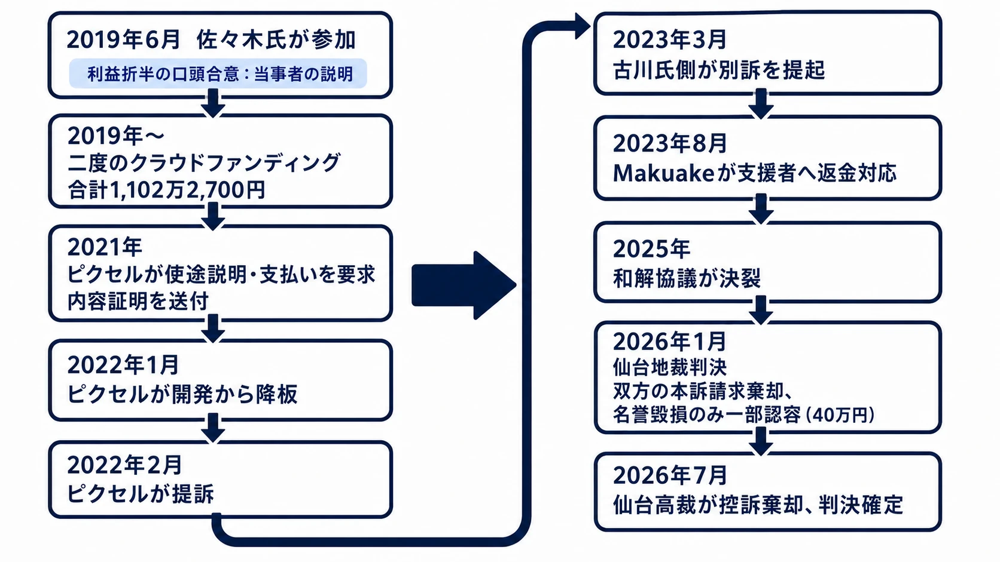
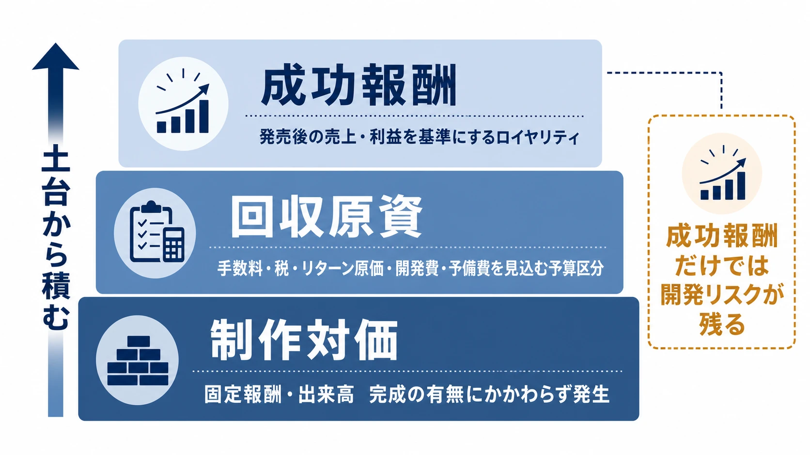
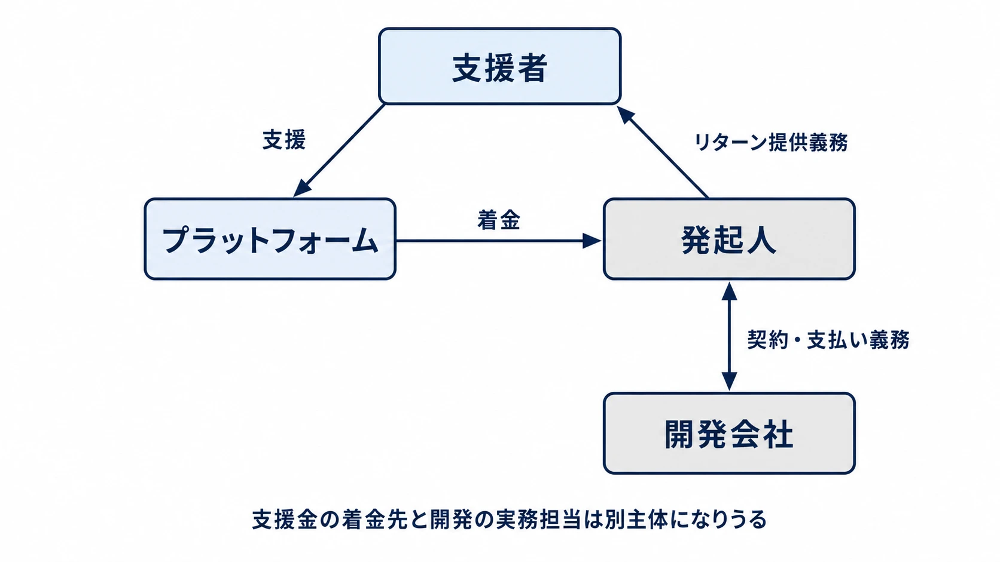

# 『スチームパイロッツ』の資金・契約トラブルから学ぶ――インディーゲームのクラウドファンディング・ガバナンス

クラウドファンディングは、資金を集める仕組みであると同時に、支援者への履行責任を引き受ける仕組みでもある。ゲームでは特に、発起人、開発会社、イラストレーター、音楽家、プラットフォーム、支援者という複数の当事者が関わる。企画が拡張したとき、その間の資金と権限の流れを曖昧にしたまま走り続けると、制作の遅延だけでは終わらない。

本稿では、PC向け縦スクロールシューティングゲーム『スチームパイロッツ』を巡る資金・契約トラブルと、2026年7月に終結した訴訟を扱う。目的は当事者のどちらが正しかったかを裁定することではない。クラウドファンディングを使うインディーゲーム開発者が、着手前、企画拡張時、対立発生時に何を決め、何を支援者へ示すべきかを考えることである。

***

## 1. 名の知れた作曲家が掲げたシューティング企画

『スチームパイロッツ』の発起人は古川もとあき氏である。古川氏はコナミのサウンドチーム「矩形波倶楽部」で活動した作曲家であり、アーケード版『グラディウスII ゴーファーの野望』『A-JAX』『ゼクセクス（XEXEX）』などのシューティングゲームの楽曲で知られる。ピクセルが2019年のイベント告知で紹介したプロフィールにも、元コナミ矩形波倶楽部のリーダーであること、ゲームや音楽の制作を継続していることが記されている。[[1](#ref-1)]

この来歴は、企画にとって強い初速になる。著名な作曲家が自ら音楽を担い、複数のクリエイターが集まるオリジナルSTGという組み合わせは、往年のコナミ作品を知る層に完成イメージを伝えやすい。実際、MakuakeのプロジェクトページはWindows向けゲーム、サウンドトラック、設定資料集などをリターンとして掲げていた。[[2](#ref-2)]

ただし、知名度は制作体制の代替にはならない。発起人の実績が集めるのは、まず期待と支援金である。誰が仕様を決め、誰が開発費を受け取り、変更を誰が承認するかまで自動的に決まるわけではない。むしろ注目度が高い企画ほど、支援者が期待する完成度と、少人数チームが実行できる範囲の差を早期に管理する必要がある。

***

## 2. 短期イベント向けの認識から、二度の資金調達へ

本件の初期経緯には、当事者間で食い違う説明がある。ピクセル側の公表・報道によれば、2019年6月、前任開発者の降板後に同社代表の佐々木英州氏が参加した。当初はイベントに間に合わせる短期開発の簡易STGという認識で、古川氏側と「ゲーム販売後の利益を折半する」旨を口頭で合意して開発に着手したとされる。[[3](#ref-3)][[4](#ref-4)] これはピクセル側が示した経緯であり、裁判所が初期の個別のやり取りをそのまま事実認定したものではない。

その後、企画は当初想定を超える規模へ広がった。Makuakeでは2019年から二度のクラウドファンディングが実施され、支援総額は合計1,102万2,700円となった。報道で引用されたプロジェクト説明では、開発遅延への対応と完成に向けた資金確保を理由に二度目の募集が行われたとされる。[[5](#ref-5)]

ここで分けて考えるべきものがある。支援総額は、開発会社が使える制作予算でも、発起人の自由な収入でもない。決済・プラットフォーム手数料、税、リターンの製造・発送、広報、外注、開発、予備費を差し引いた後に、どの契約にいくら充てるかを決めなければならない。ストレッチゴールや追加リターンで企画を広げるなら、増える売上ではなく、増える義務とキャッシュアウトを先に計算する。

***

## 3. 資金と契約を巡る対立、そして訴訟

ピクセル側は、クラウドファンディングで得た資金から同社へ支払いは一切なかったと説明している。2021年には使途の説明と開発費の支払いを求め、内容証明郵便を送付したとし、2022年1月に開発から降板したと公表した。古川氏側は、クラウドファンディングは外注等を含む完成に必要な経費へ備えるためのものであり、ピクセルへ制作費を支払うために実施したものではないと回答したと報じられている。[[5](#ref-5)]

このように、同じ調達資金についても「開発会社への報酬原資」とみる説明と、「完成に必要な全体経費のリスクに備える資金」とみる説明が並立した。契約書、予算表、承認記録がなければ、プロジェクトの途中で双方が異なる前提へ立っていることに気付きにくい。

2022年2月、ピクセルは古川氏を相手に仙台地方裁判所へ開発費等の支払いを求めて提訴した。古川氏側は2023年3月、ピクセルへの損害賠償と、佐々木氏個人への慰謝料を請求する別訴を提起した。[[6](#ref-6)] 両者が公表した主張には、資金使途、降板の経緯、契約内容をめぐる相違が含まれる。本稿では、裁判所が認定していない詐欺的意図などの評価を事実として扱わない。

支援者側の問題も残った。2023年8月、リターンの遅延を受けて、Makuakeから支援者への返金対応が行われた。報道では、Makuakeが実行者へ対応を促してきたが対応がなされなかったことを理由として案内したとされる。[[7](#ref-7)] 返金は支援者の損失を軽減しうるが、開発会社と発起人の契約関係、成果物の権利、未払いの対価を整理するものではない。

### 訴訟の終結で確定したこと

2025年には裁判所からの和解勧告を受けた協議が行われたが、ピクセル側の公表によれば和解は決裂した。[[4](#ref-4)] 2026年1月29日、仙台地方裁判所はピクセルの報酬請求と、古川氏側のピクセルに対する損害賠償請求をいずれも棄却した。一方、佐々木氏個人に対する名誉毀損の慰謝料請求は一部認容され、40万円の支払いが命じられた。判決の紹介では、共同制作契約についてゲーム販売後の利益折半が合意されていたため、完成前のクラウドファンディング調達資金の分配は求められないと判断されたと報じられている。[[6](#ref-6)]

ピクセルは控訴したが、仙台高等裁判所は2026年7月7日に一審を支持して控訴を棄却し、判決は確定したと同社が公表した。[[8](#ref-8)] ここで確定したのは、双方の本訴請求が認められなかったことと、佐々木氏個人への名誉毀損請求が一部認められたことである。判決は、どちらか一方のプロジェクト運営全般を正当化する認定ではない。

***

## 4. 教訓1：口頭合意のまま、制作を始めない

口頭の合意自体が常に無効というわけではない。しかし、ゲーム制作では後から確かめるべき事項が多すぎる。誰が作るか、何を納品するか、いつ検収するか、どの時点でいくら払うか、仕様変更を誰が決めるか、完成前に離脱したときデータと権利をどう扱うか。これらを口頭だけで共有すると、後で「同じ言葉を別の意味で理解していた」状態になりやすい。

インディー開発で最低限必要なのは、長大な契約書より先に、次の一枚を双方で合意することである。

| 決める項目 | 着手前に書く内容 |
| --- | --- |
| 役割 | 発起人、開発、アート、音楽、広報、経理の責任者 |
| 最初の完成範囲 | 対応プラットフォーム、ステージ数、主要機能、リリース目標 |
| 対価 | 固定報酬、出来高、売上分配の比率と支払時期 |
| 支払条件 | 前払い・中間金・検収後の額、請求方法、遅延時の扱い |
| 変更管理 | 仕様追加の見積もり、期限延長、承認者、記録場所 |
| 離脱と権利 | 中止・交代時の成果物、ソースコード、素材、利用権の帰属 |

この一枚は、法務確認を省くためのものではない。契約に何を書くべきかを見える形にし、作業開始後の「聞いていない」を減らすための仕様書である。発起人が友人や知人であっても、署名済みの合意とバージョン管理された見積もりを残す。

***

## 5. 教訓2：「利益折半」は報酬設計ではない

利益分配は、成功時の追加報酬としては機能しうる。しかし、それだけで日々の開発費を賄う設計にすると、完成前に誰が人件費と外注費を負担するかが消える。本件で争点となったように、販売後の利益を分ける約束と、クラウドファンディングで調達した資金を開発中に分ける約束は同じではない。

報酬は少なくとも三層に分けるべきである。

1. **制作対価**：完成の有無にかかわらず、合意した作業に対して発生する固定報酬または出来高。
2. **回収原資**：クラウドファンディングの手数料、税、リターン原価、開発費、予備費を差し引く予算管理上の区分。
3. **成功報酬**：発売後の売上や利益を基準にするロイヤリティ、レベニューシェア、利益分配。

三層を一つの「利益折半」に畳み込むと、資金が尽きた時点で開発を続ける人だけがリスクを抱える。固定費を払えないなら、販売後の分配率を魅力的に見せて契約するのではなく、完成範囲を縮小するか、資金調達を先に済ませるか、開発開始を延期する。

***

## 6. 教訓3：企画が膨らんだ日に、契約を作り直す

クラウドファンディングは成功すると、追加のリターン、著名クリエイターの参加、ストレッチゴール、対応機種の拡大を誘発する。これは企画の勢いであると同時に、元の見積もりを無効にする出来事でもある。

追加募集や大幅な仕様変更を決める会議では、必ず次の四つを同時に決める。

- 追加するリターンと仕様、削る仕様
- 追加作業の担当と再見積もり
- 資金の受取口座、支払承認者、週次または月次の残高確認
- 支援者へ出す新しい納期、リスク、変更理由

このうち一つでも未確定なら、追加募集を始めない方がよい。特に「支援が増えたから、前より良い作品にする」は、予算と納期を伴わなければ約束ではない。開発側が口頭で了承したとしても、再見積もりと変更合意を文書化するまで追加作業に着手しない運用が必要である。

***

## 7. 教訓4：支援金の受け皿と分配を、支援者にも示す

購入型クラウドファンディングでは、支援者は完成品だけでなく、実行者が約束を履行できる体制にも期待している。Makuake自身も、実行者がリターンを提供する流れを示している。[[9](#ref-9)] そこで公開すべきなのは細かな領収書の全件ではなく、少なくとも「誰が管理し、何に充て、何が変われば知らせるか」である。

公開用の資金計画には、以下を載せるとよい。

| 支援者へ示す項目 | 例 |
| --- | --- |
| 受け皿 | 実行者名義の事業用口座、会計責任者、支払承認者 |
| 使途の区分 | プラットフォーム手数料・税、開発、外注、リターン製造・発送、予備費 |
| 開発費の流れ | 契約済みの外注先、支払マイルストーン、未確定費用の扱い |
| 進捗の基準 | 実装済み機能、残タスク、次の検収日、遅延リスク |
| 変更時の扱い | 追加調達の理由、追加分の用途、納期・リターンへの影響 |

金額を細部まで公開できない契約もある。その場合でも、予算の区分、変更時の承認手順、リターンの履行優先順位は説明できる。支援者向けの活動レポートと、制作チーム内の予算表を別々にせず、同じ更新根拠から作ることが重要である。

***

## 8. 教訓5：プラットフォームは安全網であって、制作管理者ではない

2023年の返金対応は、プラットフォームが支援者救済に介入しうることを示した。しかし、それを開発プロジェクトのリスク管理として当てにすることはできない。返金が行われても、失われた制作時間、チームの解散、成果物の引継ぎ、評判への影響は元に戻らないからである。

プラットフォームごとに、返金の条件、実行者への連絡、支援者の申請期限、対象となるリターンは異なる。Makuakeの現行の返金保証規約でも、リターン未提供後の実行者への返金要請、申請期限、プロジェクトごと・年間の上限などが定められている。[[10](#ref-10)] これは本件の2023年返金にそのまま適用された規約ではないが、プラットフォームの介入が無条件かつ無制限ではないことを理解する材料になる。

開発者が持つべき順序は、「返金制度があるから募集する」ではない。「リターンを届けられない場合の中止基準と返金原資を先に決め、その上でプラットフォームの制度を確認する」である。

***

## 9. 教訓6：対立が起きたときは、SNSで相手を一方的に非難しない

資金や契約を巡る対立が表面化すると、当事者は支援者へ説明する必要がある。一方で、相手方の意図や人格を断定する投稿は、問題解決を早めるとは限らない。本件でも佐々木氏個人に対する名誉毀損の請求が一部認容された。これは、プロジェクトの資金・契約を巡る主張とは別に、発信内容そのものが法的な争点になりうることを示す。

対立時の公開文は、次の三層に分けるべきである。

- **支援者への事実連絡**：リターン、納期、返金窓口、次回更新日。
- **契約相手との協議**：請求、証拠、交渉、法的な主張。弁護士を通じて記録する。
- **外部への意見表明**：将来の再発防止に必要な範囲に限り、相手の内心や未認定の不正を断定しない。

支援者が知るべきなのは、誰が悪いと感じているかより、何が届くのか、届かないならどう手続きできるのかである。説明責任を果たす文章と、相手方を非難する文章を同じ投稿に混ぜないことが、支援者とチームの双方を守る。

***

## おわりに：資金調達を「約束の運用」として設計する

『スチームパイロッツ』の経緯は、著名な発起人、好調な資金調達、制作規模の拡大という前向きに見える要素だけでは、ゲームを完成へ運べないことを示している。クラウドファンディングで集めるのは金額だけではない。リターンを届ける約束、制作チームへの支払責任、変更時に説明する責任も同時に集めている。

インディーゲームのプランナーが募集開始前に確認すべきことは、派手なストレッチゴールではない。誰が口座を管理するか、開発者の固定報酬はいくらか、追加仕様を誰が承認するか、遅れたときに何を優先するか、チームが分かれたときに何を引き継げるかである。これらを最初に書き、企画が大きくなるたびに書き直し、支援者への説明と一致させる。その地味なガバナンスこそが、クラウドファンディングを完成へつなぐ制作機能になる。

## References

1. [仙台市アエルで開催！インディゲーム・レトロゲーム・マイナーゲームの展示・頒布を目的としたイベント「インディゲームマーケット」｜株式会社ピクセル][1] - 古川もとあき氏のプロフィール。

2. [オリジナルシューティングゲーム『スチームパイロッツ』を、夢のメンバーで作りたい！｜Makuake][2] - 初回プロジェクトのリターン内容と予定。

3. [クラファンで1000万円集めたシューティングゲーム、制作費用未払いとして開発会社が企画者を訴訟。はたしてゲームは完成するのか｜AUTOMATON][3] - 2019年6月の参加経緯、前任開発者の降板、利益折半の口頭合意についてのピクセル側の説明。

4. [損害賠償・名誉毀損について和解決裂へ。1,000万円以上クラウドファンディングで獲得するも開発費未払いにより未完のSTG｜Game*Spark][4] - ピクセル側が公表した経緯説明、および2025年の和解協議決裂。

5. [開発費未払いに関して訴訟中の『スチームパイロッツ』古川氏側の回答をピクセルが公開「CF調達資金で開発費を支払う目的はなかった」｜Game*Spark][5] - 二度の募集と調達額、当事者双方の資金目的に関する説明。

6. [クラファンで約1000万円集めたゲームの責任者と開発会社“双方向”の訴訟、いずれも棄却｜AUTOMATON][6] - 2022年の提訴、2023年の別訴、2026年1月の仙台地裁判決。

7. [国内クラウドファンディングで約1000万円を集めたゲーム、完成しないままクラウドファンディング運営元が出資者に返金対応へ｜AUTOMATON][7] - 2023年8月の返金対応。

8. [1,000万円以上をクラウドファンディングで集めるも開発費未払いにより未完のSTG『スチームパイロッツ』、裁判が結審｜Game*Spark][8] - 仙台高裁による控訴棄却と確定の報道。

9. [Makuake（マクアケ）出品案内ページ｜Makuake][9] - 購入型クラウドファンディングにおける実行者とリターン提供の流れ。

10. [Makuake返金保証規約｜Makuake][10] - 現行の返金保証の対象、要件、上限。

[1]: https://igm.pixel-co.com/igm1/index.html
[2]: https://www.makuake.com/project/msart_games/
[3]: https://automaton-media.com/articles/newsjp/20220305-194427/
[4]: https://www.gamespark.jp/article/2025/10/10/158267.html
[5]: https://www.gamespark.jp/article/2023/01/18/126240.html
[6]: https://automaton-media.com/articles/newsjp/20260130-414751/
[7]: https://automaton-media.com/articles/newsjp/20230825-261687/
[8]: https://www.gamespark.jp/article/2026/07/21/169522.html
[9]: https://lp-mk-2.makuake.com/
[10]: https://www.makuake.com/pages/refund-policy/

----

この文書は、Perplexity、Claude、OpenAI Codex の3つのAIの支援を受けて著述されたものです。引用画像を除き、MIT License にて提供されています。
