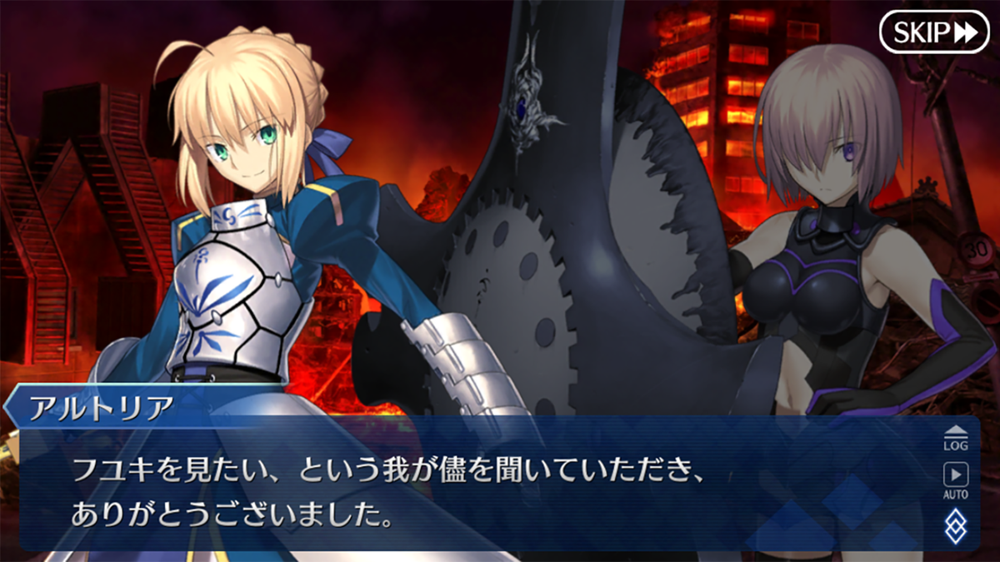
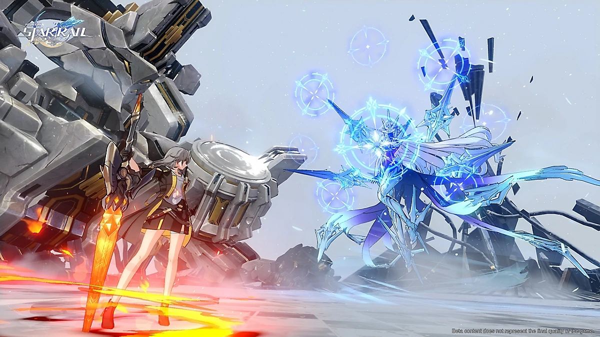
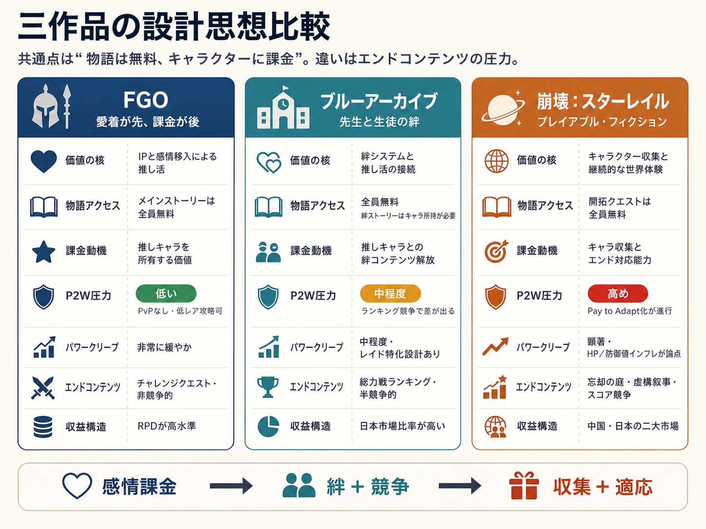

# 無料の物語は、なぜガチャを回させるのか――FGO、ブルーアーカイブ、崩壊：スターレイルの課金設計
## 日本・韓国・中国の代表作から見る「推し活経済」とPay to Win（P2W）への態度

***

## エグゼクティブサマリー

F2Pゲームにおいて、ストーリーやキャラクターへの感情的な投資を課金の起点とする「ストーリードリブン・マネタイズ」は、日本・韓国・中国それぞれで異なる形で発展してきた。日本の **Fate/Grand Order（FGO）** はIP親和性と「推し活」文化を核にした感情先行型課金モデルを確立し、韓国の **ブルーアーカイブ** は「先生（プレイヤー）と生徒たちの絆」という物語構造を通じて推し消費を設計した。中国の **崩壊：スターレイル** は「プレイアブルなフィクション」という哲学のもとで、より広範な層に向けてRPGを再定義している。三作品に共通するのは「ストーリーは無料、キャラクターに課金」という基本設計だが、エンドコンテンツにおけるP2Wへの姿勢には顕著な違いがある[[1](#ref-1)][[2](#ref-2)][[3](#ref-3)]。

***

## 1. 日本：Fate/Grand Order — 「愛着が先、課金が後」の完成形

*画像引用: [App Store - Fate/Grand Order](https://apps.apple.com/jp/app/fate-grand-order/id1015521325)*

### ストーリーとIP戦略

FGOは、TYPE-MOONの『Fate/stay night』を原作とするスマートフォン向けRPGで、Aniplexがパブリッシング、開発はラセングル（旧Delightworks、2022年にAniplexの完全子会社化）が担当している。2015年7月（iOS）／8月（Android）にリリースされ、10周年を迎えた2025年時点でも日本のモバイルゲーム市場で強い存在感を示し続けている。Sensor Towerによれば、リリースから2025年8月までの日本国内の累計ダウンロード数は1,200万を超え、世界累計収益は60億ドル（約9,000億円）以上に達している[[7](#ref-7)]。直近3年間の日本国内収益では『モンスターストライク』に次ぐ2位を維持しており、ダウンロードあたりの収益（RPD）は他のロングヒット作の約2倍と突出している[[7](#ref-7)]。

FGOの最大の特徴は、ガチャRPGをほぼビジュアルノベルとして機能させている点にある。「ガチャRPGに付随する物語というより、物語に付随するガチャRPG」と評されるほど、ストーリーが体験の中核を占める。奈須きのこ氏を中心とした高品質なシナリオは、第六特異点キャメロットや第二部ロストベルトなど章を追うごとに評価を高め、プレイヤーのゲームへの愛着を段階的に強化していく構造となっている[[8](#ref-8)][[9](#ref-9)]。なお、第二部メインストーリーは2025年12月に完結したが、サービスは継続しており、2026年1月からは新たな物語「The Beginning of Aftertime」が始動している[[10](#ref-10)]。

この「物語が先に感情を作る」構造が強く表れた転換点が、第六特異点「神聖円卓領域キャメロット」である。キャメロットでは、プレイヤーは単に円卓の騎士を倒すのではなく、獅子王の理想、円卓の騎士たちの忠義、そしてベディヴィエールが抱え続けてきた悔恨を順に理解していく。敵として登場するサーヴァントにも、それぞれの正義と破綻が与えられているため、戦闘は性能確認の場ではなく「この人物をどう受け止めるか」を迫る場面として機能する。物語を読み終えたあとにガチャ画面で同じサーヴァントを見ると、そこには単なるユニットではなく、章の記憶を背負った人物がいる。

第七特異点「絶対魔獣戦線バビロニア」では、この設計がさらに拡張される。ウルクの市民生活、ギルガメッシュ王の統治、エルキドゥ／キングゥの葛藤、エレシュキガルの孤独といった複数の感情線を積み上げたうえで、終盤の破局へと向かうため、プレイヤーは「世界を救う」以前に「この都市と人々を失いたくない」と感じるようになる。終局特異点ソロモンで過去に出会ったサーヴァントたちが集結する展開も、FGOが長期間の読書体験を資産化していることを象徴している。ガチャで入手したキャラクターは、攻略上の駒である前に「自分が見届けた物語から来た仲間」になる。

第二部ロストベルトでは、さらにプレイヤーの立場そのものが揺さぶられる。異聞帯を攻略することは、別の歴史とそこに生きる人々を剪定することでもあり、勝利が必ずしも道徳的な快感に直結しない。Lostbelt No.6「妖精円卓領域アヴァロン・ル・フェ」では、アルトリア・キャスター、モルガン、オベロンといったキャラクターが、味方・敵・黒幕という単純な分類を越えて、妖精國という閉じた世界の希望と歪みを体現する。こうした章を通過したあと、プレイヤーが彼らを召喚したいと思う理由は「強いから」だけではない。物語の中で一度失われた関係を、手元のカルデアで引き受け直したいという欲望が生まれるのである。

### 「推し活」としての課金構造

TesTeeがFGO課金者を対象に行った調査では、課金理由として **74.7%が「欲しいキャラクターのため」** と回答しており、他のゲームアプリ課金者の44.7%と比べて30ポイント以上高い。また、「欲しいキャラクター」に求めているものとして、FGO課金者の79.9%が「キャラクター自体（デザインや推しキャラであること）」と回答したのに対し、他のゲームアプリ課金者は57.6%が「ステータス（能力やスキルなど）」を挙げている。この対比は、FGOが他のゲームとは質的に異なる課金動機を生み出していることを示している[[11](#ref-11)]。

このメカニズムについて、日本の分析記事はこう指摘する。ガチャの確率の低さだけでは人は引かない。FGOが優れているのは、まずストーリーで「このサーヴァントのために何かしたい」という感情を作ったうえで、ガチャという戦場にプレイヤーを送り出す設計にある——「愛着が先、課金が後」という順序だ。ガチャで引いたサーヴァントはフィギュアと違って「一緒に戦い続ける」存在であり、絆レベルの上昇で解放されるマイルームボイスなど、時間をかけた関係性の蓄積が「持続する所有感」を生み出している[[1](#ref-1)]。

### エンドコンテンツとP2Wへの態度

FGOにはプレイヤー対プレイヤー（PvP）要素がなく、エンドコンテンツはチャレンジクエストや高難度ストーリーが中心である。重要なのは、 **「★3以下の低レアサーヴァントだけで全コンテンツをクリア可能」** という実証がコミュニティ内で積み重ねられていることだ。これにより、FGOは一般的な意味でのPay to Winには分類されず、「Pay to Love（推しのために課金する）」とでも呼ぶべき独自のカテゴリで語られる[[12](#ref-12)][[13](#ref-13)]。

ガチャシステム自体は決して親切ではない。天井（確定召喚）は330連と業界でも長い水準にあり、しかも天井のカウントはバナーをまたいで引き継がれない[[14](#ref-14)]。それでも課金意欲が維持されるのは、戦力上の優位性ではなく **感情的な優位性** ——「このキャラを持っている」「この子とずっと戦ってきた」——が報酬として機能しているためである。TesTee調査ではFGOプレイヤーの課金経験率は男性59.6%・女性55.0%とゲームアプリ全般の倍近くにのぼり、その課金動機は競争優位の追求ではなく「推し活」としての自己表現に近い[[11](#ref-11)]。

***

## 2. 韓国：ブルーアーカイブ — 「先生」と生徒たちの共感設計

*画像引用: [App Store - ブルーアーカイブ](https://apps.apple.com/jp/app/%E3%83%96%E3%83%AB%E3%83%BC%E3%82%A2%E3%83%BC%E3%82%AB%E3%82%A4%E3%83%96/id1515877221)*

### ストーリー設計の哲学

ブルーアーカイブは、NEXON Games傘下のIO Division内にあるMX Studioが開発したタイトルで、日本での運営はYostar、グローバル版の運営はNexon自身が手がけている[[15](#ref-15)]。2021年2月4日に日本で先行リリースされた[[16](#ref-16)]。ゲームデザイン上の最大の特徴は、プレイヤーが「先生」として生徒たちと関わるという構造にある。「クラブ存続」「試験突破」といった素朴な目標を物語の軸に据えつつ、丁寧に描かれたキャラクター描写によって感情的な重みを生み出す[[3](#ref-3)]。

物語設計について開発陣は、複雑な世界設定の解読に時間を割かせるのではなく、キャラクターのメッセージやストーリーテリングそのものを楽しんでもらう、というアプローチを意図的に採っている。たとえば「Vol.1 対策委員会編」は、砂漠化と借金に苦しむアビドス高等学校を舞台に、廃校寸前の学校を守ろうとする少人数の生徒たちの物語として始まる。プレイヤーは「世界の危機」ではなく、放課後に集まる部室、返済計画、街に残る思い出といった小さな生活圏からキヴォトスへ入っていく。ここで「先生」は強大な指揮官ではなく、生徒たちが諦めずに済むための大人として配置されるため、以後の物語でもプレイヤーの役割は勝利条件の達成より「生徒の選択を支えること」に置かれる。

「Vol.2 時計じかけの花のパヴァーヌ編」では、ミレニアムサイエンススクールの「ゲーム開発部」がたった数人の部員と先生で廃部の危機に立ち向かい、自作ゲームの完成にこぎつけるまでが描かれる。「廃部を阻止する」というささやかな目標が、合理性を尊ぶ学園文化に対する情熱の物語として展開されるこの章は、シリーズ屈指の人気エピソードとなっている[[4](#ref-4)]。重要なのは、ゲーム開発部の生徒たちが単に「可愛いキャラクター」としてではなく、不器用な創作衝動や友人関係のすれ違いを抱えた人物として描かれる点である。FGOが壮大な歴史改変を、HSRが惑星規模の舞台劇を通じて感情を作るのに対し、ブルーアーカイブは部活、学園祭、試験、補習、放課後といった日常的なスケールから愛着を積み上げる。

また、「Vol.3 エデン条約編」は、トリニティ総合学園とゲヘナ学園の政治的対立、補習授業部の落ちこぼれたち、アリウス分校の復讐心を重ね合わせながら、「赦し」と「大人の責任」を主題化する。聖園ミカとアリウススクワッド・錠前サオリの和解、ミカが歌う賛美歌「Kyrie」のシーンは、プレイヤーの間で語り草となっている屈指の名場面だ[[6](#ref-6)]。さらに「Vol.1 対策委員会編」第3章「夢が残した足跡」(2024年実装)では、シリーズ最初期から登場する小鳥遊ホシノが、かつての先輩との「言えなかった別れ」と向き合い、自らを赦すまでの過程が描かれる[[5](#ref-5)]。これらは派手な演出に頼った「泣かせ」ではなく、長い時間をかけてキャラクター一人ひとりへの愛着を積み上げた末に訪れる感情的な収束として機能している。

### 日本市場への異例の集中

ブルーアーカイブは **開発元が韓国にもかかわらず、収益の72%以上が日本市場から** 生まれるという、極めて異例の構造を持つ。Sensor Towerの2024年9月公表のレポートによれば、日本プレイヤーが全ダウンロードの34%を占め、収益では他市場を圧倒している。日本のプレイヤーベースは2024年第2四半期時点で約90%が男性、最大層は25〜34歳であり、『アークナイツ』や『学園アイドルマスター』といった「女性キャラクターと豊かなストーリーを特徴とするゲーム」を好む層と重なる[[17](#ref-17)]。

この日本集中の背景には、「キャラクターの多様な体型と個性」「日常系コンテンツとの親和性」「快適でポジティブな雰囲気」といった、日本の「推し活」文化と深く共鳴する設計上の特徴がある。絆ストーリーは生徒を入手・育成することで解放される個別ストーリーであり、「キャラクターを所有すること」自体に固有の物語体験が紐づく構造が、推し消費を強化している[[18](#ref-18)][[19](#ref-19)]。

さらにブルーアーカイブの場合、日本市場での価値はゲーム内収益だけでは測りにくい。Yostarは日本向けにYostar OFFICIAL SHOP ONLINEを運営しており、ブルーアーカイブ単独カテゴリでは多数の公式グッズが販売されている。商品カテゴリもアクリル製品、缶バッジ、書籍、音楽・映像、アパレル、文具、キッチン用品など広く、キャラクターへの愛着をゲーム外の購買に変換する導線が整っている[[39](#ref-39)]。加えて、JR秋葉原駅店での先行販売や周年イベント会場でのオフィシャルグッズ販売、事後通販も展開されており、Yostarはゲーム内ガチャだけでなく、リアルグッズ、イベント、コラボ商品を含むIPビジネスとしてブルーアーカイブを運営している[[40](#ref-40)][[41](#ref-41)]。この点は、同作の日本偏重を単なるアプリ売上の偏りではなく、日本の推し活消費圏に深く組み込まれたIP展開として見る必要があることを示している。

### エンドコンテンツとP2Wへの態度

ブルーアーカイブの競技コンテンツは「総力戦」と呼ばれる隔週のレイドが中心で、プレイヤーはスコアランキングで競い合う。このシステムは半競争的な性質を持つため、FGOと比べると「P2W的な圧力」が存在することは否めない。特定のレイドボスに特化した生徒が強力で、上位ランクを目指すプレイヤーにとってはガチャへの投資が有利に働く[[20](#ref-20)][[21](#ref-21)]。

ただし、「P2Wだから不公平」という批判が大規模な炎上に発展しにくい背景には、 **プレイヤーコミュニティの課金観が「推しのためのサポート」に基づいている** ことが挙げられる。ランキング最上位を目指すプレイヤーは少数派にとどまり、大多数は好きな生徒との物語体験を目的にプレイしている。開発陣も「AIが生成したアートには誰もお金を使いたがらない」という信念のもと、キャラクターの魅力そのものへの投資を継続しており、課金を正当化する根拠をキャラクターの質に置いている[[22](#ref-22)]。

***

## 3. 中国：崩壊：スターレイル — 「プレイアブルなフィクション」と適応するための課金の台頭

*画像引用: [PlayStation - 崩壊：スターレイル](https://www.playstation.com/ja-jp/games/honkai-star-rail/)*

### HoYoverseの設計哲学

崩壊：スターレイル（Honkai: Star Rail、以下HSR）はHoYoverseが2023年4月にリリースしたターン制RPGで、2025年3月にモバイル累計収益が20億ドルを突破した[[23](#ref-23)]。GDC 2025でリードゲームデザイナーのChengnan An氏が語った設計哲学は「 **プレイアブルなフィクション** 」である。3つの原則として「没入感（Immersive）」「シンプルさ（Simple）」「拡張性（Expandable）」を掲げ、プレイヤーが物語の一部となれる演出と、定期的な新コンテンツの供給によってリテンションを維持する設計だ[[2](#ref-2)][[24](#ref-24)]。

An氏は「映画は1本のストーリーを提供するが、私たちはTVシリーズのように定期的に新しいシーズンを届けている」と述べており、ライブサービスとしての継続的な世界観構築がビジネスモデルの根幹を成している。メインストーリー（開拓クエスト）は全プレイヤーに無料で開放されており、新しい世界の体験はゲームプレイの主目的として位置づけられている[[2](#ref-2)]。

この「TVシリーズ型」のストーリードリブン設計が最も明確に表れたのが、Ver.2.0以降のピノコニー編である。ピノコニーは「祝祭の星」として提示され、ホテル、夢境、ジャズエイジ風の都市景観、ショービジネスの華やかさを前面に出しながら、その裏側にある支配構造、ファミリー（調和の運命を歩む一団）の秩序、夢から醒めることへの恐怖を徐々に露出させていく。プレイヤーは単に新マップを攻略するのではなく、夢の中の演出装置や視点変更を通じて、物語の不確かさそのものを体験する。これは「没入感」「シンプルさ」「拡張性」を掲げるプレイアブルなフィクションの具体例であり、戦闘や探索を物語の幕間ではなく、物語を進めるための舞台装置として機能させている[[35](#ref-35)]。

また、ピノコニー編ではアベンチュリン、黄泉、ロビン、サンデー、ホタルといったキャラクターが、単なるバナー商品ではなく、章全体のテーマを担う登場人物として配置されている。たとえばアベンチュリンは、軽薄な賭博師として登場しながら、カンパニーに回収された過去と「賭けること」以外で自分を証明できない孤独を背負う人物として描かれる。ホタルもまた、プレイヤーとの短い逃避行と「夢の中でしか自由でいられない」という設定によって、性能より先に喪失感と保護欲を喚起する。ブルーアーカイブが「先生と生徒」の近さで愛着を作るのに対し、HSRは惑星ごとの大きな舞台劇の中でキャラクターを一度強く印象づけ、その余韻がガチャへの欲望に変換される構造を持っている。

### パワークリープと適応するための課金の問題

HSRが他の2タイトルと大きく異なるのは、エンドコンテンツにおける **パワークリープ（インフレ）の深刻さ** である。「HoYoverseは、これまでの体験を上回るほど強いキャラクターを実質無料で配布できるほど自信を持っている」と指摘されるほど、新キャラクターの性能インフレが継続的な課題となっている[[25](#ref-25)][[26](#ref-26)]。

さらに、「無料配布キャラが優秀だが、そのキャラを真に活かすにはバナーキャラクターが必要」という設計も批判の的になっている。たとえば調和の開拓者（調和主人公）は無料で入手できる優秀なサポーターだが、同バナーで実装された限定星5キャラクター「ホタル」とのシナジーが極めて高く設計されており、「節約している錯覚」を与えながら課金を誘導している、との指摘がある[[27](#ref-27)]。

こうした状況を指して、HSRのエンドコンテンツではPay to Winより「 **Pay to Adapt（適応するための課金）** 」という表現が用いられる。PvPが存在しないため厳密な意味でのP2Wではないが、「記憶」のような新しい運命（他のゲームでいうところのロール）の登場後は、最新キャラクターなしではエンドコンテンツのクリアが困難になりつつあり、F2Pプレイヤーには毎月わずかずつ取り残されていく感覚が生じる構造になっている。HSRのストーリーモードは引き続き全員に開放されているが、オプション扱いのエンドコンテンツで「全クリア」を目指すには、実質的な課金圧力が存在する[[28](#ref-28)]。

ただし、HoYoverseがこの問題を放置しているわけではない。第一の対策は、過去キャラクターの直接的な強化である。Ver.3.4では「キャラクター強化」システムが導入され、銀狼、刃、カフカ、鏡流といった初期から中期の限定星5キャラクターが性能調整の対象になった。これは、ガチャで入手したキャラクターの価値が短期間で失われることへの不満を和らげ、「過去に引いた推しを使い続けられる」という信頼を回復するための施策と読める[[36](#ref-36)]。

第二に、限定キャラクターの配布や無償資源の配布の厚さによって、Pay to Adaptの圧力を相殺しようとしている。代表例がVer.1.6からVer.2.1まで実施されたDr.レイシオの無料配布で、限定星5キャラクターをログインとメール機能の解放だけで入手できる異例の施策だった[[37](#ref-37)]。また、周年ログインイベントでは20連分の星軌専用チケットが配布されるなど、同じHoYoverse作品の『原神』と比較しても、短いプレイ時間でまとまったガチャ資源を受け取りやすい設計が目立つ[[38](#ref-38)]。つまりHSRは、インフレによって「適応」を迫る一方で、古いキャラクターの延命、限定キャラクターの例外的な配布、恒常的なチケット配布によって、F2Pプレイヤーが完全に脱落しないための緩衝材も同時に用意している。

***

## 比較分析：三作品の設計思想の違い

*図: 三作品のマネタイズ、物語アクセス、課金圧力、運営構造の比較。*

***

## 4つのメカニズム：ストーリーが課金を生む構造

各タイトルの成功は、以下の4つのメカニズムが連鎖することで実現している。

第一に、 **感情先行の原則** 。課金ページに誘導する前に、ストーリーを通じてキャラクターへの愛着を形成する。FGOはこの設計を最も純粋な形で実装している[[1](#ref-1)]。

第二に、 **所有の意味づけ** 。ガチャで引いたキャラクターに固有の物語（絆ストーリー、キャラクタークエスト）を付与することで、「所有すること」自体に価値を生む。ブルーアーカイブの絆システムはその典型である[[19](#ref-19)]。

第三に、 **限定性と取り逃し不安** 。期間限定バナーは「今しか入手できない」というFear of Missing Out（FOMO）を生み出す。いずれの作品でも、期間限定キャラクターが主要な収益ドライバーになっている[[29](#ref-29)]。

第四に、 **コミュニティの推し活サイクル** 。プレイヤーが推しキャラについてSNSで発信し、それが新規プレイヤーへの自然な宣伝として機能する。FGOでは、新規プレイヤーの大半が広告経由ではなくオーガニック流入であり、こうしたクチコミ効果が機能している[[30](#ref-30)]。

***

## 文化的背景：日本・韓国・中国の課金観の違い

**日本** では、「推し活」が社会的に認知された消費文化として確立している。CDGとOshicocoによる「推し活総研」の2025年調査では、日本人口（15〜69歳男女）の16.7%、約1,384万人が推し活に参加しており、市場規模は年間約3.5兆円と推計されている。性別・年齢別では、特に若年層女性で参加率が高く、野村證券のレポートによれば15〜19歳女性では推し活率が56.0%に達する[[31](#ref-31)][[32](#ref-32)]。FGOはこの文化的土壌の上に立ち、「キャラクターのために財布を開くことが自己表現になる」という価値観を活用してきた。

**韓国** では、K-POP・アイドル文化の影響を受けた「グッズ購入・ランキング支援」型の応援文化が強い。ブルーアーカイブが競技的なレイドランキングを採用していることは、応援消費としての課金をスコアという可視化された形で受け止める設計とも読める。

**中国** では、ゲームを「文化的輸出品」として位置付けるHoYoverseの姿勢が、スターレイルの壮大な世界観や『Fate/stay night』とのコラボレーションといったIP戦略に反映されている。HoYoverseは資本主義への批判的視点を物語のモチーフに織り込むことも多く、欧米市場を含む広いオーディエンスへのアクセシビリティを重視した設計が特徴的だ[[33](#ref-33)][[34](#ref-34)]。

***

## 結論：「推し」と「戦力」のバランスが長期運営を決める

三作品の比較から明らかになるのは、F2Pゲームの長期的な成功において「ストーリーへの感情投資」と「エンドコンテンツの公平感」のバランスが決定的に重要だということである。

FGOはパワークリープを最小化することで、「課金しないと先に進めない」という不満を抑えながら、推し活への感情的課金を10年以上にわたって維持することに成功している。一方HSRは急速な成長を遂げながらも、パワークリープによる「Pay to Adapt」化が、F2Pプレイヤーの離脱リスクを徐々に高めつつある。ブルーアーカイブは競技性と推し活を組み合わせる独自のポジションを取っているが、「課金しなくてもランキングに参加できる」という設計のおかげで大規模な炎上を回避してきた[[20](#ref-20)][[25](#ref-25)]。

最終的には、「ストーリーがキャラクターへの愛着を生み、愛着が課金を生む」というサイクルを壊さない限り、これらのゲームはF2Pモデルの健全な形を維持できる。そのサイクルを最も一貫して守ってきたのが、日本市場で生まれ育ったFGOの設計思想だと言えるだろう。

---

## References

1. [【お金】推し活3.5兆円の正体を経営者目線で聞いたら - note](https://note.com/smocrea_fantezca/n/na50696432cb6)

2. [［GDC 2025］HoYoverseが語る「崩壊：スターレイル」のデザイン哲学 - 4Gamer](https://www.4gamer.net/games/599/G059954/20250321048/)

3. [A Crazed and Probably Unnecessary Rant about How Great Blue Archive Is - Reddit](https://www.reddit.com/r/BlueArchive/comments/vpb4m3/a_crazed_and_probably_unnecessary_rant_about_how/)

4. [【「ブルーアーカイブ」ストーリーのススメ】Vol.2 時計じかけの花のパヴァーヌ編――私たちは合理の世界でパッションを突き通す - Gamer](https://www.gamer.ne.jp/news/202303290002/) - 時計じかけの花のパヴァーヌ編（ゲーム開発部）の紹介と評価について。

5. [対策委員会編3章と小鳥遊ホシノ論 - note](https://note.com/rkgkhmr/n/n9208a6045a79) - 対策委員会編第3章「夢が残した足跡」(2024年7月実装)におけるホシノの物語の終着点について。

6. [【ブルアカ】ストーリーのススメVol.4 エデン条約編3〜4章 - Gamer](https://www.gamer.ne.jp/news/202304260002/) - 「劇場版ブルアカ」と評される、エデン条約編クライマックスの評価について。

7. [『FGO』直近3年間の収益が『モンスト』に次いで2位を記録 - ファミ通](https://www.famitsu.com/article/202509/54080) - Sensor Towerによる10周年データ。日本累計DL1,200万以上、収益60億ドル以上。

8. [Will N.A. catch up to JP? - r/FGO Reddit](https://www.reddit.com/r/FGO/comments/1mgyvvh/fgo_will_na_catch_up_to_jp/)

9. [How good is the FGO story compared to the rest of the series? - Reddit](https://www.reddit.com/r/fatestaynight/comments/odvzet/how_good_is_the_fgo_story_compared_to_the_rest_of/)

10. [Fate Grand Order JP Reveals New Story Arc After Its 'Final Chapter' - Game8](https://game8.co/articles/latest/fate-grand-order-jp-reveals-new-story-arc-after-its-final-chapter) - 2025年12月の第2部「Cosmos in the Lostbelt」完結後、2026年1月7日に新章「The Beginning of Aftertime」が開始されたことを報道。

11. [Fate/Grand Orderに関する調査 - TesTee Lab](https://lab.testee.co/fgo-result/)

12. [Is Fate Grand Order F2P friendly? - r/grandorder Reddit](https://www.reddit.com/r/grandorder/comments/vd4nkd/is_fate_grand_order_f2p_friendly/)

13. [FGO is not as bad as some make it out to be - Reddit](https://www.reddit.com/r/gachagaming/comments/1ed530g/fgo_is_not_as_bad_as_some_make_it_out_to_be_and/)

14. [【FGO】天井（確定召喚）の覚えておきたい基礎知識 - 電撃オンライン](https://dengekionline.com/articles/112741/) - 天井330連、バナーごと個別カウント。

15. [An Interview with IO Division's Executive & Studio Producers on 'Blue Archive' - DayOne](https://playday.one/2025/09/04/an-interview-with-io-divisions-executive-studio-producers-on-blue-archive/) - 開発はNEXON Games内のIO Division傘下のMX Studio、Executive Producerはキム・ヨンハ氏。

16. [新作「ブルーアーカイブ -Blue Archive-」は2021年2月4日にリリース - 4Gamer](https://www.4gamer.net/games/519/G051983/20210125121/)

17. [Blue Archive earns over 70% of its revenue from Japan, but who's playing? - AUTOMATON WEST](https://automaton-media.com/en/news/blue-archive-earns-over-70-percent-of-its-revenue-from-japan-but-whos-playing/) - Sensor Tower 2024年9月レポート。日本がDLの34%、収益の72%を占める。

18. [Game Focus: Blue Archive exceeds $500 million in revenue - Reddit](https://www.reddit.com/r/BlueArchive/comments/1amorbp/game_focus_blue_archive_exceeds_500_million_in/)

19. [Story/Bond Story ｜ Blue Archive Wiki ｜ Fandom](https://bluearchive.fandom.com/wiki/Story/Bond_Story)

20. [microtrans or p2w? - Steam Community](https://steamcommunity.com/app/3557620/discussions/0/546740620659611451/)

21. [Total War ｜ Blue Archive Wiki - Fandom](https://bluearchive.fandom.com/wiki/Total_War)

22. ["Nobody wants to spend money on AI-generated images," Blue Archive producer says - AUTOMATON WEST](https://automaton-media.com/en/news/nobody-wants-to-spend-money-on-ai-generated-images-blue-archive-producer-says-suggesting-ais-role-lies-in-reducing-non-creative-labor/)

23. [Honkai: Star Rail rockets past $2bn on mobile in under two years - PocketGamer.biz](https://www.pocketgamer.biz/honkai-star-rail-rockets-past-2bn-on-mobile-in-under-two-years/) - 2025年3月23日に20億ドル達成。地域構成: 中国36%、日本29%、米国13%。

24. [Honkai: Star Rail's gacha system may be treacherous, but the RPG has a big heart - TechRadar](https://www.techradar.com/gaming/consoles-pc/honkai-star-rails-gacha-system-may-be-treacherous-but-the-rpg-has-a-big-heart)

25. [Power creep has ruined the experience for players - Reddit](https://www.reddit.com/r/HonkaiStarRail/comments/1orx5dt/power_creep_has_ruined_the_experience_for_players/)

26. [Understanding Honkai: Star Rail's Power Creep Formula - YouTube](https://www.youtube.com/watch?v=KpA32qHeQhA)

27. [How Does Hoyoverse Design Their Characters? ｜ Honkai Star Rail 3.0 - YouTube](https://www.youtube.com/watch?v=4Ayq7EUlAZE)

28. [Is it true that the game is p2w, slowly going towards pay to play? - Reddit](https://www.reddit.com/r/HonkaiStarRail/comments/1jv5wv4/is_it_true_that_the_game_is_p2w_slowly_going/)

29. [Everything you need to know about gacha mobile games - Adjust](https://www.adjust.com/blog/gacha-mechanics-for-mobile-games-explained/)

30. [9周年を迎えたFGOは人気が継続 - Sensor Tower](https://sensortower.com/ja/blog/fgo-9th-anniversary) - 2023年1月〜7月のDL元はオーガニック58%、広告22%、ウェブ20%。

31. [推し活人口は1384万人、市場規模は3兆5千億円に！ - 推し活総研（CDG・Oshicoco）](https://prtimes.jp/main/html/rd/p/000000069.000025413.html) - 第2回推し活実態アンケート調査（2025年）。回答者23,069人、推し活率16.7%。

32. [推し活の市場規模は1兆円以上？ - 野村證券・岡崎康平](https://www.nomura.co.jp/wealthstyle/article/0392/) - 15〜19歳女性の推し活率は56.0%。

33. [What's your opinion regarding Chinese culture / story / philosophy - Reddit](https://www.reddit.com/r/gachagaming/comments/1ry5jyb/whats_your_opinion_regarding_chinese_culture/)

34. [Honkai Star Rail x Fate/Stay Night collab confirmed - Reddit](https://www.reddit.com/r/fatestaynight/comments/1kdsx06/honkai_star_rail_x_fatestay_night_collab/)

35. [Honkai: Star Rail Interview: Penacony Reworks, Black Swan's Design, & Story Content Planning - Screen Rant](https://screenrant.com/honkai-star-rail-interview-penacony-2-0-plans/) - ピノコニーのデザイン、夢を軸にした世界設計、バージョン更新におけるストーリー計画について。

36. [3.4 Character Buffs and Reworks - Game8](https://game8.co/games/Honkai-Star-Rail/archives/507475) - Ver.3.4での銀狼、刃、カフカ、鏡流の性能調整について。

37. [How To Get Dr. Ratio For Free In Honkai: Star Rail - GameSpot](https://www.gamespot.com/articles/how-to-get-dr-ratio-for-free-in-honkai-star-rail/1100-6520472/) - Ver.1.6〜2.1期間の限定星5キャラクターDr.レイシオ無料配布について。

38. [Festive Gifts Event Guide - Game8](https://game8.co/games/Honkai-Star-Rail/archives/448217) - 周年ログインイベントでの星軌専用チケット20枚配布について。

39. [Yostar OFFICIAL SHOP ONLINE / ブルーアーカイブ](https://shop.yostar.co.jp/products/list?category_id=MTExODQ4OTE%3D) - ブルーアーカイブ公式グッズカテゴリ。アクリル製品、書籍、映像・音楽、アパレル、文具などの販売導線について。

40. [『ブルーアーカイブ』新作グッズがJR秋葉原駅店で先行販売中！ - Yostar Plus](https://plus.yostar.co.jp/goods-bluearchive-251031/) - Yostar OFFICIAL SHOP JR秋葉原駅店での先行販売について。

41. [かわいいがたくさん！『ブルーアーカイブ』5周年記念グッズ紹介！ - Yostar Plus](https://plus.yostar.co.jp/goods-bluearchive-2601/) - リアルイベント会場でのオフィシャルグッズ販売と事後通販について。

----

この文書は、Perplexity、Claude、OpenAI Codex の3つのAIの支援を受けて著述されたものです。引用画像を除き、MIT License にて提供されています。
