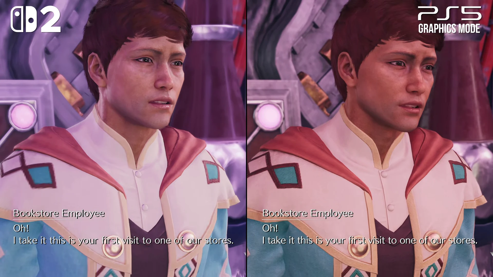

# Nintendo Switch 2へ移植できるゲームは何で決まるのか――重量級タイトルから読む四つの判定軸

## エグゼクティブサマリー

2025年6月5日のNintendo Switch 2発売から一年あまりで、『サイバーパンク2077 アルティメットエディション』、『ファイナルファンタジーXIV』、そして『ファイナルファンタジーVII リメイク インターグレード』『ファイナルファンタジーVII リバース』を含むファイナルファンタジーVII リメイクシリーズ三部作が同機へ届いた。第3作『ファイナルファンタジーVII リベレーション』も、2027年春にNintendo Switch 2を含む複数プラットフォームで同時発売することが告知されている。[[1](#ref-1)][[2](#ref-2)][[3](#ref-3)]

これは「AAAなら移植できる」「現世代専用なら無理」といった粗い線引きが、企画判断に役立たなくなったことを示す事例群である。同じ大作でも、GPUが限界になる作品、CPUが限界になる作品、画面の破綻が許されにくい作品、サーバーや運営費が支配的になる作品は異なる。本稿は特定作品の優劣を判定するものではなく、自社タイトルのNintendo Switch 2版を検討するときの診断順を作るためのものである。

先に結論を置く。確認すべき軸は、 **GPUとCPUの負荷がどちらへ偏るか** 、 **低い内部解像度を許容できる絵作りか** 、 **オンラインの制約がクライアントか運用か** 、 **ストレージ待ちをどこまで減らせるか** の四つである。GPU性能だけを比較して「載る」と決めると、密集NPC、物理演算、ネットワーク、アセット供給のどれかで見積もりを落とす。

***

## 1. GPUは伸びたが、CPUの問題は別に残る

Nintendo Switch 2のSoCはArm Cortex-A78C 8コアCPU、12GBのLPDDR5Xメモリーを備える。開発者がゲームに使えるメモリーは9GBと報じられている。Digital Foundryが開発資料を基に報じた動作値では、GPUの理論演算性能は携帯モード約1.71TFLOPS（561MHz）、TVモード約3.072TFLOPS（1007MHz）である。CPUの動作値は携帯モード1.1GHz、TVモード998MHzとされる。任天堂はこれらの詳細なクロック値を公表していないため、企画の固定前提ではなく、実機検証を始めるための目安として扱うべきである。[[4](#ref-4)][[5](#ref-5)]

ここでGPUとCPUを一つの「性能」にまとめないことが重要である。GPUは画素、ジオメトリー、影、ポストエフェクトを主に担い、CPUはゲームロジック、AI、物理、描画命令の準備、ネットワーク処理などを担う。GPUが空いていても、CPUが一フレームに必要な仕事を終えなければ、フレームレートは上がらない。これをCPUバウンドと呼ぶ。

### GPU側はDLSSと可変解像度で予算を作れる

DLSS（Deep Learning Super Sampling）は、低い内部解像度で描いた画像を学習済みモデルで再構成し、出力解像度に近い見え方を目指す技術である。内部解像度を下げればGPUの画素処理予算を、影・ライティング・遠景・描画密度へ振り替えられる。Nintendo Switch 2がDLSSを利用できることは、携帯機で重量級タイトルを成立させる際の大きな差である。[[6](#ref-6)][[7](#ref-7)]

『サイバーパンク2077 アルティメットエディション』はその典型である。Nintendo Switch 2本体と同日の2025年6月5日に発売され、TVモードでは1080p出力・30〜40fps、携帯モードでは720pを目標にDLSSを使う。64GBゲームカードに本編と拡張を収録した点も、初回の大容量ダウンロードを必須にしない商品設計である。CD PROJEKT REDの技術担当Charles Tremblay氏は移植について「想定より挑戦的ではなかった」と述べたが、これは全タイトルが容易に移植できるという意味ではない。DLSS、品質設定、30fpsを含む設計上の選択を行った結果として読まなければならない。[[7](#ref-7)][[8](#ref-8)][[9](#ref-9)]

『ファイナルファンタジーVII リバース』は、より露骨にGPU予算の配分を見せる。TVモードの内部解像度は1920×1080から960×540、携帯モードは1344×756から672×380まで動的に変化し、DLSSで再構成する。目標は30fpsであり、短いヒッチや細部の破綻は残るが、広いフィールドを切り捨てずに持ち込むために、内部解像度を積極的に変える選択をした。[[10](#ref-10)][[11](#ref-11)]

この二例から導けるのは、「ネイティブ1080pを維持できるか」ではなく、「GPU予算を食う要素を、可変解像度と再構成でどこまで移せるか」を問うべきという指針である。移植の初期検証では、最高画質の一場面ではなく、戦闘、遠景、エフェクト、カットシーンを含む最悪ケースで内部解像度とフレーム時間を記録したい。

### CPUバウンドな設計は、別の試験表を作る

一方、NPCの群集AI、複雑な当たり判定、多数の物理オブジェクト、協力プレイ時のシミュレーションは、解像度を下げても大きく軽くならない。GPU設定の削減だけでは救えない領域である。

『HITMAN World of Assassination』Nintendo Switch 2版は、解像度を落としたときの挙動をCPU負荷とGPU負荷で分けて見る実例になる。Digital Foundryの検証では、720p出力を選ぶとGPU負荷が大きい場面ではフレームレートが上がる一方、群集密度が高いCPU集約的な場面では伸びが小さいと報告された。これは、解像度を下げれば常にフレームレートが同じ割合で改善するわけではないことを示す。[[12](#ref-12)]

同作はNintendo Switch 2向けに発売済みであり、CPUバウンドな設計であること自体が移植の可否を決めるわけではない。問うべきなのは、どの場面を目標フレームレートに収めるために、群集の密度、AIの更新頻度、物理演算の精度、描画距離をどこまで調整するかである。グラフィックが地味でも、街で常時更新するNPC数、行動状態の組み合わせ、物理や戦術AIが多いなら、CPUバウンドなタイトルとして別枠で測る必要がある。[[12](#ref-12)]

プランナーが技術チームへ最初に渡すべき問いは、「画質を一段落とせば成立するか」だけではない。「プレイヤーが最も多くのエンティティを同時に見て、AI・物理・オンライン状態が重なる瞬間はどこか」である。後者の答えが曖昧な企画は、GPUの試験に合格しても製品化判断を早まれない。

***

## 2. 絵作りの許容度が、再構成の成否を決める

DLSSは、低い内部解像度から学習済みモデルで画像を再構成する技術であり、入力情報が少ない領域ほど再構成の精度に限界が生まれる。細い線、透明物、髪、草、粒子、画面速度の速い輪郭は、時間方向の揺れ、ディザリング、輪郭の不安定さとして現れやすい。特に人肌、毛髪、布、金属の反射を近接で見せる写実系は、プレイヤーが差に気付きやすい。

『ファイナルファンタジーVII リバース』のNintendo Switch 2版は、携帯モードで内部解像度が最低672×380まで下がる。技術分析では、髪など高周波の細部に再構成由来の不安定さが見える場面が指摘されている。これは移植の失敗を意味しない。むしろ「広域の風景、戦闘、人物の近接演出を同じ画面品質で守る」という表現上の要求が、再構成の弱点を表面化させる例である。[[10](#ref-10)][[11](#ref-11)]

*出典：Digital Foundry「[Final Fantasy 7 Rebirth Switch 2/Xbox Series X｜S Demo Tested - A Miracle Port for Switch 2?][11]」（Digital Foundry、動画07:09付近）からのフレーム引用。左：Nintendo Switch 2、右：PS5 Graphics Mode。*

ここから得られる指針は、輪郭、色面、マテリアル、カメラ距離、画面を横切る速度といったルールが、低い内部解像度でも読みやすさを保つかを問うことである。太いシルエット、明快な色分け、近接時に極細ディテールへ依存しないキャラクター設計は、再構成の瑕疵を「情報の欠落」として認識されにくくする。様式化されたアートであれば常に安価だとは限らない。絵本調でも大量の半透明エフェクトや細密な草を画面全体に置けば、同じ問題を抱える。

『ELDEN RING Tarnished Edition』がよい警告になる。当初2025年発売予定だったNintendo Switch 2版は、公開試遊での性能上の懸念を受け、開発元が「性能調整」のため2026年へ延期した。2026年8月28日の発売が決まった現在も、延期前の試遊版を最終製品の性能と同一視してはならない。ただし、様式化されたダークファンタジーであっても、広い地形、植生、戦闘エフェクト、移動速度を同時に満たすには性能予算の再配分が必要だという事実は残る。[[13](#ref-13)][[14](#ref-14)]

移植可否の判定では、アートディレクターと技術チームが早い段階で、次のような「壊れてはいけない一枚」を共有したい。顔のアップ、髪と半透明物が重なる会話、草地を高速移動する場面、粒子が密集する戦闘、暗部から明部へ切り替わる場面である。画面写真で合格しただけでは足りない。カメラ移動時の連続した動画で確認し、何を捨てても作品らしさが残るかを決める必要がある。

***

## 3. オンラインでは、クライアントの限界と運営の限界を分ける

『ファイナルファンタジーXIV』Nintendo Switch 2版は2026年8月4日に発売された。約一か月の先行プレイ期間を経て正式サービスへ移る構成で、Nintendo Switch Onlineへの加入を求めず、他プラットフォームと同じサーバー・ワールドを共有する完全クロスプレイとして提供される。[[2](#ref-2)][[15](#ref-15)]

この事例で重要なのは、MMOの壁を「サーバーが重いから携帯機では無理」と一括りにしないことである。サーバーが多数のプレイヤー状態を同期できても、各クライアントはその状態を受け取り、可視範囲のキャラクター、装備、エフェクト、UIを描画しなければならない。吉田直樹プロデューサーは安定30fpsを目標としつつ、街中など同時に描画するキャラクター数が多い場所では部分的なフレームレート低下が起こり得ると説明している。これはサーバー接続そのものより、クライアント側の同時描画と更新負荷が表に出るケースである。[[16](#ref-16)]

したがってMMOや大規模オンラインゲームの移植では、同接人数だけでなく、次の三つを分解して測るべきである。

- **サーバー処理**：権威判定、マッチメイキング、永続データ、帯域と遅延。
- **クライアント処理**：可視キャラクター数、装備・アニメーションの更新、エフェクト、UI、描画命令。
- **プレイ規約**：PC版・据置版と同一ワールドに入るなら、表示制限や簡略化が対戦・協力の公平性、読み取りやすさ、アクセシビリティへどう作用するか。

『グランド・セフト・オートV』を対比に置くと、もう一つの壁が見える。同作のNintendo Switch 2版は、2026年8月時点でRockstar Gamesから公式発表されていない。仮に技術的に移植できたとしても、既存のライブサービスを新プラットフォームへ投入するには、認証、クロスプレイ方針、パッチ配信、チート対策、カスタマーサポート、年齢区分や販売導線を継続する費用がかかる。技術的な「動く」と、事業としての「運営する」は別の判断である。

この区別は、新作の企画にも使える。オンライン要素をNintendo Switch 2へ持ち込むなら、移植終盤にネットワーク試験を足すのではなく、同時描画の上限、遠距離プレイヤーの表現、重要情報の優先順位、回線品質の下限、運営期間を最初から仕様へ入れたい。特に一人の画面へ誰を何人、どの精度で出すかは、ゲームデザインで先に決められる性能予算である。

***

## 4. ストレージは、世界をつなぐコストを変えた

Nintendo Switch 2は256GBの内蔵ストレージとmicroSD Expressに対応する。microSD Expressは従来のmicroSDとは別規格であり、本体の拡張ストレージとして利用するには同規格のカードが必要である。SoCにはデータ展開をCPUから分離する専用のファイル展開機構もあると報じられた。これはGPUやCPUの演算性能を増やすものではないが、移動中に必要なアセットを読み込む設計の待ち時間とCPU負荷を減らす方向に働く。[[5](#ref-5)][[17](#ref-17)]

『ホグワーツ・レガシー』は分かりやすい傍証である。Nintendo Switch 2版はNintendo Switch版を土台にした移植ではなく、新規ビルドとして制作され、Nintendo Switch版にあった区切りや大幅な簡略化を外した。TVモードで30fpsをおおむね維持し、ホグワーツとホグズミードの間も読み込み画面なしで移動できると技術分析で確認されている。これはストレージだけの成果とは断定できない。GPU、CPU、メモリー、アセット構成の再設計が組み合わさった結果である。しかし、「SSD相当のストリーミングを前提としたゲームが携帯機へ来るには、演算性能だけを見ればよい」という見方を改めるには十分な例である。[[18](#ref-18)][[19](#ref-19)]

初代Nintendo Switchではクラウド版のみだった『HITMAN World of Assassination』、『バイオハザード7 レジデント イービル』、『バイオハザード ヴィレッジ』、そして「キングダム ハーツ」シリーズも、Nintendo Switch 2ではネイティブ版へ切り替わった。各タイトルの技術構成は同じではなく、この動きだけから「microSD Expressが移植を可能にした」と因果を断定してはならない。それでも、通信先で実行するしかなかった作品群が、ローカルで実行する選択肢を得たことは、演算性能とストレージ帯域を合わせた基盤の変化を示す傍証である。[[20](#ref-20)][[21](#ref-21)][[22](#ref-22)]

プランナーがここで確認すべきなのは、総容量だけではない。エリア境界の読み込み、ファストトラベル、死亡からの復帰、衣装変更、メニュー遷移、シェーダー生成など、プレイヤーが「待たされた」と感じる操作列を棚卸しする。続いて、各待ちがストレージI/O、CPU展開、GPUのリソース生成、ネットワーク待ちのどれに支配されるかを分ける。ロード時間を一つの数字にしてしまうと、性能改善の担当を誤る。

***

## おわりに：移植可否を決めるための四軸チェックリスト

Nintendo Switch 2で『サイバーパンク2077』、『ファイナルファンタジーXIV』、ファイナルファンタジーVII リメイクシリーズ三部作が成立した事実は、移植の可否が「AAAかどうか」ではなく個別の負荷特性で決まることを示している。企画段階では、次の順に答えを集めるとよい。

| 判定軸 | 最初に確認する問い | 企画で先に決めること |
| --- | --- | --- |
| GPU／CPUの非対称性 | 最悪場面は画素処理で遅いのか、AI・物理・描画命令で遅いのか | 30fps目標、同時エンティティ数、エフェクトと遠景の優先順位 |
| 絵作りの許容度 | 低い内部解像度と再構成で、何が壊れると作品らしさを失うか | 顔・髪・透明物・植生・カメラ速度の品質下限 |
| オンライン構成 | 制約はサーバー、クライアント、または運営費のどこにあるか | 表示人数、簡略化の規約、クロスプレイ、継続運営の責任範囲 |
| ストレージ | プレイヤーの待ち時間はI/O、展開、リソース生成、通信のどれか | エリア分割、先読み、アセット容量、ゲームカードとダウンロードの方針 |

この表を埋めるとき、「AAAだから」「オープンワールドだから」という分類は補助情報に下がる。必要なのは、自作の最悪ケースを一つずつ観測可能な負荷へほどくことである。

『黒神話：悟空』や『バルダーズ・ゲート3』のように、Nintendo Switch 2版を待望するプレイヤーがいるタイトルは、公式発表があった時点で四軸の線引きを確かめる観測点になる。前者なら高密度な写実表現と高速戦闘を、後者なら多数の状態を伴うシミュレーションを、それぞれどこまで携帯機へ持ち込めるかが問われる。プランナーが確認すべきなのは他社の移植予定ではなく、同じ負荷特性を持つ自社タイトルの最悪ケースである。

## References

1. [Nintendo Switch 2 を 2025年6月5日に発売][1] - Nintendo Switch 2の発売日、価格、256GB内蔵ストレージ、microSD Express対応を確認した。

2. [Nintendo Switch 2 版 8月4日（火）発売！ 予約受付中 ＆ 今なら30％OFF！][2] - 『ファイナルファンタジーXIV』Nintendo Switch 2版の2026年8月4日発売を確認した。

3. [ファイナルファンタジーVII リベレーション][3] - ファイナルファンタジーVII リメイクシリーズ三部作の完結編『ファイナルファンタジーVII リベレーション』が2027年春にNintendo Switch 2を含む複数プラットフォームで同時発売されることを確認した。

4. [New Switch 2 specs show large performance dip in undocked mode][4] - Digital Foundryが分析したGPUクロック、CPU構成、メモリー、ファイル展開機構を確認した。数値は任天堂の正式仕様表ではない。

5. [機能・仕様｜Nintendo Switch 2｜任天堂][5] - Nintendo Switch 2の256GB内蔵ストレージ、microSD Express対応、CPU/GPU仕様（クロック数の詳細は含まれない）を確認した。

6. [Nintendo Switch 2はレイトレーシングとDLSSに対応。NVIDIAが公式blogで明かす][6] - Nintendo Switch 2のDLSS・レイトレーシング対応が、NVIDIA公式ブログの発表に基づくことを確認した。

7. [Cyberpunk 2077 on Switch 2: a cutting-edge game translates well to Nintendo's console hybrid][7] - 『サイバーパンク2077 アルティメットエディション』Nintendo Switch 2版のDLSS利用、動作モード、技術分析を確認した。

8. [Cyberpunk 2077: Ultimate Edition coming Launch Day to Nintendo Switch 2!][8] - 『サイバーパンク2077 アルティメットエディション』がNintendo Switch 2本体と同日発売され、64GBゲームカードに本編・拡張とも収録されダウンロード不要であることを確認した。

9. [CDPR "thought it was going to be more of a challenge" porting Cyberpunk 2077 to Nintendo Switch 2, but beefier specs and microSD made it "surprisingly fast"][9] - CD PROJEKT REDのCharles Tremblay技術担当VPによる、Nintendo Switch 2移植が「想定より挑戦的ではなかった」という趣旨の発言を確認した。

10. [Final Fantasy VII Rebirth's Switch 2 port was built around “what to preserve,” not “what to cut.”][10] - 『ファイナルファンタジーVII リバース』Nintendo Switch 2版の内部解像度範囲とDLSS利用を、浜口直樹氏への取材から確認した。

11. [Final Fantasy 7 Rebirth Switch 2/Xbox Series X｜S Demo Tested - A Miracle Port for Switch 2?][11] - 『ファイナルファンタジーVII リバース』の動的解像度、フレームレート、再構成画像の技術分析を確認した。

12. [Hitman: World Of Assassination Has A Hidden 'Performance Mode' On Switch 2][12] - Digital Foundryの検証を基に、解像度低下によるフレームレート改善が、GPU負荷の大きい場面と群集密度の高いCPU集約的な場面で異なることを確認した。

13. [ELDEN RING Tarnished Editionの発売時期を2026年に変更][13] - 性能調整のため発売時期を変更した公式告知を確認した。

14. [ELDEN RING Tarnished Edition launches August 28, 2026][14] - Nintendo Switch 2版の発売日を確認した。

15. [Nintendo Switch 2 版 リリース決定！][15] - 『ファイナルファンタジーXIV』Nintendo Switch 2版の約一か月の先行プレイ、Nintendo Switch Online不要の案内を確認した。

16. [『ファイナルファンタジーXIV』Nintendo Switch™ 2 版 発売記念！ 公開生放送 in 渋谷サクラステージ][16] - 吉田直樹氏が説明した30fps目標と、混雑場面のクライアント側描画負荷に関する説明を確認した。

17. [microSD Expressカードを使いはじめる][17] - Nintendo Switch 2で使用するmicroSD Expressカードの公式案内を確認した。

18. [Hogwarts Legacy for Switch 2 is not a port of the Switch version][18] - 『ホグワーツ・レガシー』Nintendo Switch 2版が新規ビルドである開発元の説明を確認した。

19. [Hogwarts Legacy - Switch 2 Review - The Big Face-Off][19] - 『ホグワーツ・レガシー』Nintendo Switch 2版の性能とストリーミングに関するDigital Foundryの技術分析を確認した。

20. [Hitman World of Assassination – Signature Edition launching on Nintendo Switch 2][20] - Nintendo Switch 2向けネイティブ版『HITMAN World of Assassination』を確認した。

21. [Resident Evil 7 biohazard Gold Edition／Resident Evil Village Gold Edition Nintendo Switch 2版FAQ][21] - Nintendo Switch 2向け『バイオハザード7』『バイオハザード ヴィレッジ』のネイティブ版の出力解像度等の仕様を確認した。

22. [キングダム ハーツ コレクション [I~III]（Nintendo Switch 2）][22] - 初代Nintendo Switchではクラウド版だった「キングダム ハーツ」シリーズの、Nintendo Switch 2向けローカル実行版コレクションを確認した。

[1]: https://www.nintendo.co.jp/corporate/release/2025/250402.html
[2]: https://jp.finalfantasyxiv.com/lodestone/topics/detail/252ef267c24c00f8d3b7bc7d1f2f00c0db3fbde7
[3]: https://www.jp.square-enix.com/ffvii_revelation/
[4]: https://arstechnica.com/gaming/2025/05/new-switch-2-specs-show-large-performance-dip-in-undocked-mode/
[5]: https://www.nintendo.com/jp/hardware/switch2/specs/index.html
[6]: https://www.4gamer.net/games/990/G999030/20250404007/
[7]: https://www.eurogamer.net/digitalfoundry-2025-cyberpunk-2077-on-switch-2-a-cutting-edge-game-translates-well-to-nintendos-console-hybrid
[8]: https://www.cyberpunk.net/en/news/51356/cyberpunk-2077-ultimate-edition-coming-launch-day-to-nintendo-switch-2
[9]: https://www.gamesradar.com/games/rpg/cdpr-thought-it-was-going-to-be-more-of-a-challenge-porting-cyberpunk-2077-to-nintendo-switch-2-but-beefier-specs-and-microsd-made-it-surprisingly-fast/
[10]: https://automaton-media.com/en/interviews/final-fantasy-vii-rebirths-switch-2-port-was-built-around-what-to-preserve-not-what-to-cut-director-naoki-hamaguchi-on-optimizing-a-massive-ope/
[11]: https://www.youtube.com/watch?v=jISSWd4aiy0
[12]: https://www.nintendolife.com/news/2025/07/hitman-world-of-assassination-has-a-hidden-performance-mode-on-switch-2
[13]: https://en.bandainamcoent.eu/elden-ring/news/elden-ring-tarnished-edition-release-window-changed-2026
[14]: https://en.bandainamcoent.eu/elden-ring/news/elden-ring-tarnished-edition-launches-august-28-2026
[15]: https://jp.finalfantasyxiv.com/lodestone/topics/detail/2f1efc7f1647b4c43062e643072a80a105f8a964
[16]: https://www.youtube.com/watch?v=MhaL0WCzgbE
[17]: https://support.nintendo.com/jp/switch2/mastery/sdcard/start-using/index.html
[18]: https://www.gamespot.com/articles/hogwarts-legacy-for-switch-2-is-not-a-port-of-the-switch-version/1100-6531087/
[19]: https://www.youtube.com/watch?v=MAl9NcEDO1s
[20]: https://ioi.dk/hitman/news/2025/hitman-world-of-assassination-signature-edition-launching-on-nintendo-switch-2
[21]: https://www.capcom.co.jp/support/faq/platform_switch2_biohazard7_GE_0268083.html
[22]: https://store.jp.square-enix.com/estore/g/gPOT-P-ABU8A/

----

この文書は、Perplexity、Claude、OpenAI Codex の3つのAIの支援を受けて著述されたものです。引用画像を除き、MIT License にて提供されています。
