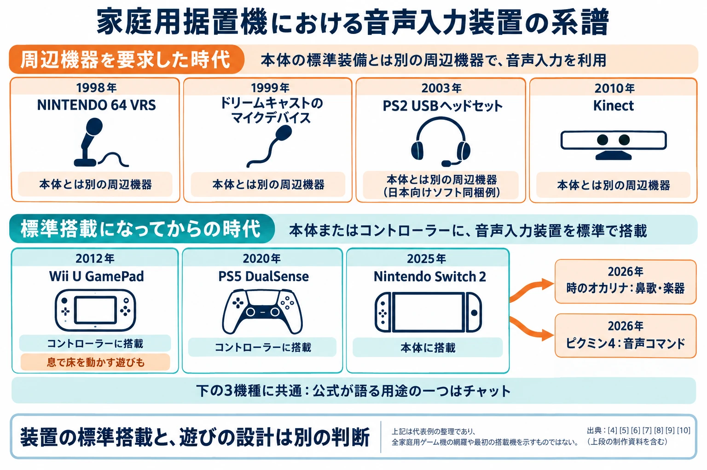
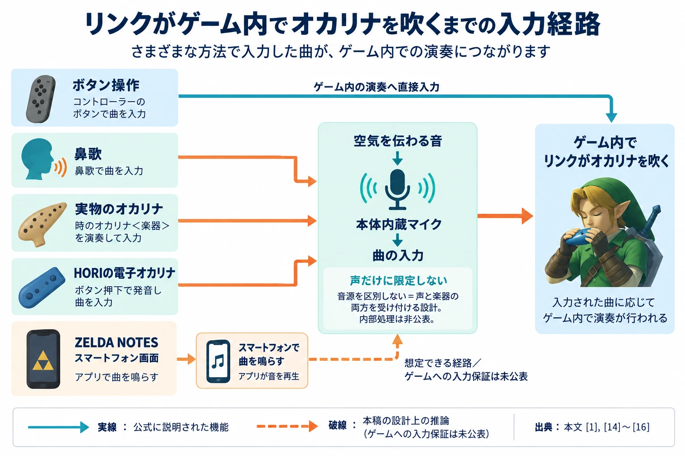
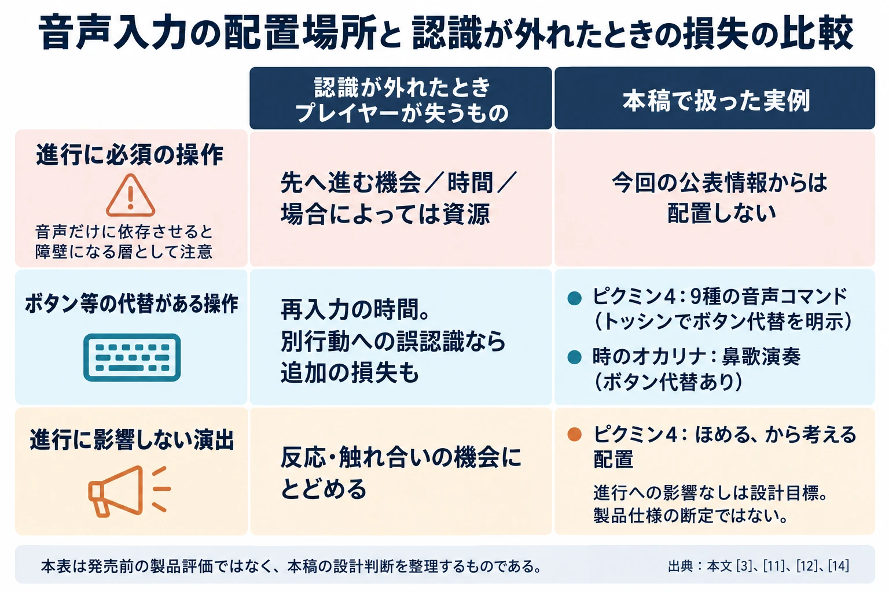

# 鼻歌でも、実物のオカリナでもいい ― Switch 2 が音声入力に出した答え

## 概要

鼻歌を歌えば、リンクがオカリナを演奏する。相棒に声をかければ、オッチンが指示に応える。2026年9月8日の「ゼルダの伝説40周年 Direct」と翌9日の「Nintendo Direct」は、Nintendo Switch 2 の内蔵マイクを遊びに使う、二つの実装を紹介した。[[1](#ref-1)][[2](#ref-2)]

『ゼルダの伝説 時のオカリナ』は11月5日、『ピクミン4 Nintendo Switch 2 Edition + だれでもチャレンジ! ダンドリ検定』は11月12日に発売予定である。本稿は2026年9月11日時点の公式の説明文を材料に、公表された機能から設計意図を読む記事であり、実機検証記事ではない。認識精度や遅延、失敗時の挙動は評価の対象に含めない。[[1](#ref-1)][[3](#ref-3)]

持ち帰りたい主張は、次の一文である。

**音声入力を成立させるのは認識の賢さではない。①入力装置が全員の手元にあることと、②認識が外れても損をしない置き場所を用意することである。**

もちろん、必要な音を受け取れる認識性能は前提になる。そのうえで、声を出すために何を買い足すのか、声が届かなかったら何を失うのかを考える。今回の二作は、その設計を考える具体的な材料になる。

***

## 第1章｜マイクは14年前から据置機に載っていた

据置型の家庭用ゲーム機で、マイクを標準の装備に含める試みは以前からあった。2012年発売のWii Uでは、同梱のWii U GamePadにマイクが載っていた。任天堂の「各部機能」でも、GamePad正面の部品として列挙されている。専用マイクを別に買わなくても、音を受け取る装置が購入者の手元に届く構成である。[[4](#ref-4)][[5](#ref-5)]

用途の一つは、人同士の会話だった。任天堂は内蔵ソフト「Wii U Chat」を、離れた家族や友人とテレビ電話を楽しむものとして紹介していた。2020年発売のPS5でも、DualSenseの内蔵マイクを使える。PlayStationの公式販売ページは、その用途を “Chat online through the built-in microphone” と説明している。[[6](#ref-6)][[7](#ref-7)][[8](#ref-8)]

2025年発売のNintendo Switch 2も、本体にマイクを内蔵する。本体公式ページで「本体にはマイクを内蔵。」という説明が現れるのは、ゲームチャットの紹介部分だ。本体から離れた話し声を拾い、相手へ届ける機能として語られている。GamePad、DualSense、Switch 2本体と搭載場所は異なるが、いずれも標準の装備でチャットに参加できる。[[9](#ref-9)]

Wii Uのマイクは、遊びにも使われていた。『スーパーマリオ 3Dワールド』の公式説明には、GamePadへ息を吹きかけて床を動かす仕掛けがある。こうした事例がある以上、2012年からの14年間は、マイクがゲームに使われなかった空白期間ではない。[[10](#ref-10)]

それでも、装置を標準搭載する判断と、その装置でどんな遊びを成立させるかは別の問題である。マイクがあれば導入の手間は減る。しかし、誰もが毎回声を出したくなる理由まで、ハードウェアが用意してくれるわけではない。

既刊の[『かつて僕らは「ハドソーン！」と叫んだ — 家庭用ゲーム機における音声入力の歴史』](voice-input-history-in-console-games.md)は、音声入力を音圧検知、定型語彙、汎用アシスタント、LLM自由対話という四段階で整理した。この軸は、何を認識できるようになったかを説明する。一方、標準搭載から遊びへの定着までの隔たりを考えるには、もう一本の軸が要る。 **プレイヤーが声を使う場面と、使えなかったときの扱い** である。

*機器の導入条件を比べた代表例。ソフト同梱の機器も、本体の標準装備とは別の周辺機器に含む。出典：本文の参考資料[[4](#ref-4)]〜[[10](#ref-10)]。上段の資料：[任天堂「ピカチュウげんきでちゅう」](https://www.nintendo.co.jp/n01/n64/software/nus_p_npgj/index.html)、[セガ「ドリームキャスト 関連・周辺機器」](https://www.sega.jp/history/hard/dreamcast/devices.html)、[GAME WatchのPS2ソフト同梱例](https://game.watch.impress.co.jp/docs/20030626/som.htm)、[Microsoft Research掲載のKinect解説論文](https://www.microsoft.com/en-us/research/wp-content/uploads/2016/02/Microsoft20Kinect20Sensor20and20Its20Effect20-20IEEE20MM202012.pdf)。*

***

## 第2章｜語彙を9つに絞る ―『ピクミン4 Nintendo Switch 2 Edition + だれでもチャレンジ! ダンドリ検定』

『ピクミン4』の追加機能「わんコマンド」は、相棒のオッチンに声で指示を出すものだ。日本語の公式ソフトページは、内蔵マイクに呼びかけるとオッチンが反応し、「いいこ」と言えばなでることもできると説明する。[[3](#ref-3)]

英語版公式には “nine different voice commands” とあり、コマンドは9種類だ。9月10日公開の日本語の任天堂トピックスにも、全部で9種類と記されている。同記事が示す例は、声によるトッシン、オタカラを運ぶ指示、そしてオッチンをほめる呼びかけである。[[11](#ref-11)][[12](#ref-12)]

ここで絞られているのは、ゲームが受け付ける指示の種類である。9種類のコマンドがあるという説明は、任意の相談や自由な会話を受け付けるという説明とは異なる。ただし、一つの指示に何通りの言い方が許されるかまでは示されていない。 **コマンド数と、認識できる語句の数は分けて考える** 必要がある。

### 既存の操作に、声で届く経路を足す

任天堂トピックスは、トッシンについて、声をかけるとボタンを押さずに行えると説明している。少なくともこの操作では、ボタンで出していた指示へ声でも到達できる。音声は、既存の行動に別の入り口を足す位置づけである。9種類すべての内訳とボタン操作との対応表は、公表された説明にはない。[[12](#ref-12)]

プランナーにとって大事なのは、声を使う理由を操作速度以外にも置けることだ。相棒へ直接呼びかけ、相棒が応じる。そのやり取り自体に価値があれば、ボタンより速い入力を目指す必要は薄れる。急いで指示したい場面ではボタンを選び、呼びかけを楽しみたい場面では声を選ぶ、という併存を考えられる。

「ほめる」は、この方向をいっそう分かりやすくする。公式の紹介では、仕事を命じる操作と並んで、相棒をかわいがる行為として置かれている。進行条件や報酬への影響は説明されていないため、製品仕様として「進行に一切影響しない」とまでは断定できない。それでも、 **成果を得る指示と、親しみを伝える発話を並べる** という配置は読み取れる。[[3](#ref-3)][[12](#ref-12)]

これを設計原則へ移すなら、ほめる声が届かなかったときは、もう一度呼びかければよいようにする。資源を減らさず、課題の失敗にもつなげない。反応するとうれしく、反応しなくても進行を損なわない場所は、声を試す入り口になる。これは発売前の挙動の断定ではなく、「ほめる」という実装から持ち帰れる設計上の提案である。

### DS『逆転裁判』との違いは、何を言う場面か

音声入力史の記事で扱ったニンテンドーDS『逆転裁判 蘇る逆転』は、Yボタンを押しながら発話する方式だった。カプコン公式FAQは、同作が発言内容も識別し、異議を唱える場面で別のセリフを言っても認識しないと説明している。[[13](#ref-13)]

あらかじめ決まった発話をゲーム内の指示へ対応させる、という機能上の分類では「わんコマンド」も同じ層にある。認識アルゴリズムが同じという意味ではない。違うのは、法廷で決めぜりふを発する場面に置くか、相棒へ仕事を頼み、ほめる場面に置くかだ。語彙を広げなくても、プレイヤーが発話したくなる理由は変えられる。

***

## 第3章｜判定対象を「言葉」から外す ―『ゼルダの伝説 時のオカリナ』

『時のオカリナ』が受け取るのは、覚えた曲である。9月8日のDirectで、シリーズプロデューサーの青沼英二氏は、鼻歌に合わせてリンクが演奏する機能を紹介した。続いて実物のオカリナを吹き、「楽器でも反応します」と説明している。[[1](#ref-1)]

英語版公式も、正しい音をボタン操作で鳴らす方法と、本体内蔵マイクへ鼻歌を聞かせる方法を併記し、実物のオカリナでも試せると案内する。演奏した曲は、新しい道を開く、昼夜を変えるといった冒険上の変化につながる。[[14](#ref-14)]

人の声と楽器の音が、同じ曲の演奏につながる。この説明から、ゲームが必要としているのは発話内容ではなく、旋律、すなわち音の並びだと読める。鼻歌の歌詞を理解したり、話者の意図を文章へ変換したりする必要はない。プレイヤーに求める条件を、ゲーム内で必要な情報へ絞っている。

「ゲームは音源が何かを区別していない」と言うなら、それは **入力条件として、人の声だけを正解にしていない** という意味である。内部で音色を分析しているか、どの程度の音程差やテンポ差まで受け付けるかは非公表だ。誰のどんな音でも無条件に通ることとは異なる。

### 電子オカリナは、ボタンから音へ回り道をする

任天堂の40周年関連商品ページには、発売日未定の「時のオカリナ＜楽器＞」が掲載されている。また、任天堂オーストラリアの公式発表は、演奏できる楽器版に加え、HORIによる電子版を予告する。電子版はボタンを押すと音や曲が鳴り、ゲームはこうした楽器にも反応すると説明されている。[[15](#ref-15)][[16](#ref-16)]

ここには「ボタン → 音 → 空気 → 本体内蔵マイク → ゲーム」という経路がある。コントローラーのボタンなら直接ゲームへ届くところを、あえて部屋の中に音を鳴らしてから届ける。その回り道によって、プレイヤーの手元の楽器と、リンクの持つオカリナが結びつく。

楽器を吹く技能がなくても、発音ボタンを使えば音を鳴らせる。入力の出どころを一つに限定しない設計は、同じ遊びへ参加する方法を増やす。内蔵マイクで受け取るからこそ、専用の接続規格を持たない鼻歌や実物の笛も、その候補に入る。

### 楽器の音を入力する前例と、評価対象の違い

『Rocksmith 2014』は、実物のギターやベースを弾きながら演奏を学ぶソフトである。Ubisoftは2016年12月13日、『Rocksmith 2014 Edition Remastered』にマイクモードを追加した。専用のUSBマイクをゲーム機やPCにつなぎ、アコースティックギターへ向ければ、Real Tone Cableを使わずに演奏を入力できる。[[17](#ref-17)]

このモードでも、正しく弾いた音を知らせ、技能に応じて難易度を調整する。Authentic Tonesによる音作りは無効になり、マイクの距離や向きの調整、比較的静かな部屋での演奏が推奨されている。実物の楽器を空気とマイクを通してゲームへ入力する仕組みには、こうした前例がある。[[17](#ref-17)]

『SingStar』は、楽曲に合わせて歌い、歌唱を楽しみながらスコアを競う音楽ゲームだ。SCEAのシニアプロデューサーSarah Stocker氏は、PlayStation.BlogでPS3版を紹介する際、音程に基づいて歌唱を採点すると説明していた。別途、公式ストアの説明には、専用マイクに加えてスマートフォンをマイクにするアプリも登場する。声の音程を扱うことも、入力装置に別経路を用意することも、以前から試みられてきた。[[18](#ref-18)][[19](#ref-19)]

今回の『時のオカリナ』で注目したいのは、演奏を置く先である。Rocksmithでは演奏の習得、SingStarでは歌唱と得点が遊びの中心になる。『時のオカリナ』の公表された機能は、覚えた曲をゲーム内で演奏し、冒険を動かすためのものだ。演奏の巧拙を競う課題としてではなく、 **世界を変化させる合図** として旋律を使う。正しい曲を伝えることと、上手な演奏で高得点を取ることでは、判定に担わせる役割が異なる。[[14](#ref-14)]

### スマートフォンにも、音を鳴らす入り口がある

Directでは、本作で青沼氏と共にプロデューサーを務める藤林氏が、Nintendo Switch App内のサービス「ZELDA NOTES」に追加される「オカリナ演奏」も紹介した。スマートフォンの画面を押して演奏でき、楽譜のガイド、自動演奏、楽譜の作成とQRコードでの共有にも対応する。[[1](#ref-1)]

こちらも、同じ曲を鳴らす別の入り口になる。スマートフォンから鳴る曲を本体マイクへ聞かせる経路は、音源を限定しない設計の延長として考えられる。ただし、公式の説明はアプリ内の演奏機能までであり、ゲーム内のリンクを動かす接続方法や動作保証までは示していない。この経路は設計上の可能性として位置づける。

*実線は公式に説明された機能、破線は本稿の設計上の推論。声と楽器の両方を受け付けることを示し、内部処理や任意の音源への対応を断定するものではない。出典：[[1](#ref-1)][[14](#ref-14)][[15](#ref-15)][[16](#ref-16)]。*

***

## 第4章｜認識器は、各社が自前で作るものではなくなった

ゲーム開発会社には、音声認識をソフトウェア部品として組み込む選択肢もある。東芝デジタルソリューションズは2025年6月5日、Nintendo Switch 2向け「RECAIUS 音声認識ミドルウェア ボイストリガー」の提供を開始した。あらかじめ設定した言葉を検出し、キャラクターの操作などへつなぐ部品である。[[20](#ref-20)]

同社の説明では、トークスイッチをその都度押さずに常時検出でき、別の言葉に挟まれたトリガーワードも拾える。通信ネットワークがない環境でも動作する。これは、プレイヤーの話全体を会話として理解するよりも、必要な合図を発話の中から取り出す用途に適した形だ。[[20](#ref-20)]

日立ソリューションズ・テクノロジーも、2026年1月7日付でNintendo Switch 2向け「Ruby Spotter」の提供開始を発表した。40言語以上の音声コマンドに対応し、効果音やBGMへのノイズ耐性、CPU負荷とメモリ消費を抑える設計を特徴に挙げている。リリースでは提供開始を告知しているが、発表日とは別の開始日や、登録できるコマンド数は示していない。[[21](#ref-21)]

両社がここで提供しているのは、キーワードやコマンドを検出する部品である。音声認識で文章を得て、大規模言語モデルで返答を作り、音声合成で話すという自由対話の仕組みとは、必要な仕事が異なる。

この供給の形から読めるのは、 **受け付ける指示を絞る設計が、市場にある部品の役割と一致している** ということだ。認識器の開発を一から引き受けずとも、ゲーム側は何を合図とし、どの行動につなぎ、いつ受け付けるかに注力できる。

今回の任天堂二作品の認識処理の中身は非公表であり、これらのミドルウェアの採用も公表されていない。部品の提供状況から分かるのは開発上の選択肢であって、二作品の内部構成ではない。

***

## 第5章｜設計として持ち帰れること

音声入力史の記事は、主流化を阻んだ要因として、リアルタイム性、誤認識、家族のいるリビングで声を出す気まずさ、そしてコントローラーのほうが速いことを挙げた。今回の発表をこの四点へ重ねると、技術が解消すべき問題と、操作の置き方で避けられる問題を分けられる。

### 必須の操作には、声を使わない経路を残す

急ぐ場面では、発話を終えて認識を待つこと自体が負担になりうる。音声を必須にせず、同じ結果へ至るボタン操作を残せば、プレイヤーは声を待たずに行動できる。『時のオカリナ』の公式説明は、その併存を明示している。『ピクミン4』でも、トッシンはボタンに代わる声の指示として紹介されている。[[14](#ref-14)][[12](#ref-12)]

この設計は、声を出せない事情にも対応する。[『ゲームのアクセシビリティ設計――「遊べない」を減らす企画・実装・検証の実務』](game-accessibility-design-guide.md)は、発話の難しさや同居人が寝ている状況に対して、音声入力やボイスチャットだけに依存する協力を障壁として挙げる。静かに遊ぶ経路が残っていれば、音声は参加条件を増やさずに、楽しみ方を増やせる。

### 「聞き取れない」と「別の操作になる」を分ける

誤認識への配慮は、代替ボタンを置くだけでは完結しない。声が無視される失敗と、別の指示として実行される失敗では、損失が異なる。仮に戦闘中の指示が別の行動に化ければ、ボタンへ戻せても、その間の時間や機会は取り戻せない。

だからこそ、進行に影響しない演出へ発話を置く価値がある。「ほめる」をそのように設計できれば、反応がなかったときに失うのは一度の触れ合いの機会にとどまる。対して、資源を使う操作や取り消せない行動では、発話だけで即座に確定してよいかを別に判断する必要がある。

ここで目指す「損をしない」は、すべての認識失敗が無害になるという予測ではない。 **失敗を進行の損失へ変えない場所を、意図して用意する** という設計目標である。

### 判定に必要な情報を減らし、音を出す方法を増やす

言葉を理解する必要がなければ、旋律や音圧を合図にできる。『時のオカリナ』なら必要なのは曲を伝えることであり、発話を文章として扱う必要はない。ただし、旋律にも音程やタイミングの判定は要る。判定対象を替えることは、誤認識が消えることではなく、ゲームに必要な情報へ問題を絞ることである。

さらに、声と楽器の両方を受け付ければ、音を出す手段を選べる。歌う、吹く、電子楽器のボタンを押すという違いを、同じゲーム内の結果へつなげられる。一方、家族が寝ている部屋では、楽器も音を出す。音源の選択肢を増やす工夫と、無音で操作できる代替を残す工夫は、両方が必要だ。

四つの阻害要因への答えは、声をコントローラー以上に万能にすることではなく、声を選んでも、選ばなくても進めることにある。そのうえで、声だからこそ楽しい触れ合いや演奏を置く。そうすれば、操作速度で劣る場面があっても、音声入力を選ぶ理由は残る。

*発売前の製品評価ではなく、設計判断の整理。「ほめる」の失敗を触れ合いの機会にとどめることは設計目標であり、製品仕様の断定ではない。出典：[[3](#ref-3)][[11](#ref-11)][[12](#ref-12)][[14](#ref-14)]。*

***

## 結論

声でゲームの世界に触れたいという欲求は、長く続いてきた。今回の二作から読みたい変化は、それを受け止める設計側にある。マイクが標準で手元に届き、指示は限られたコマンドへ、演奏は旋律へと絞られ、ボタンからも同じ行動へ届くようにする。

その先で必要になるのが、外れたときに何も失わせないという配慮だ。相棒に気持ちが伝わればうれしい。自分の鼻歌にリンクが応じれば楽しい。その一回が成立しなくても、冒険を続けられるようにする。

鼻歌でも、実物のオカリナでもいい。声を出したくない日は、ボタンでもいい。音声入力を遊びとして根づかせる条件は、プレイヤーに求める正しさを増やすことよりも、 **試してみたくなる入り口と、外れても困らない行き先を用意すること** にある。

## References

1. [任天堂「ゼルダの伝説40周年 Direct 2026.9.8」本文][1] — 青沼氏による鼻歌・楽器入力と、藤林氏によるZELDA NOTESの紹介。

2. [任天堂「Nintendo Direct 2026.9.9」本文][2] — 『ピクミン4 Nintendo Switch 2 Edition』紹介部分。

3. [任天堂『ピクミン4 Nintendo Switch 2 Edition + だれでもチャレンジ! ダンドリ検定』][3] — わんコマンド、なでる反応、発売予定日。

4. [任天堂「『Wii U』発売日と価格のお知らせ」][4]（2012年9月13日）。

5. [任天堂「各部機能｜Wii U」][5] — GamePad正面のマイク。

6. [任天堂「Wii U Chat」][6] — 当時のテレビ電話機能の紹介。

7. [PlayStation.Blog「新世代の幕明け──ついにPlayStation®5の発売です」][7]（2020年11月12日）— PS5の発売時期。

8. [PlayStation Direct「DualSense Wireless Controller — White」][8] — 内蔵マイクによるチャットの説明。

9. [任天堂「Nintendo Switch 2 本体」][9] — ゲームチャット紹介内の内蔵マイク説明、発売日。

10. [任天堂『スーパーマリオ 3Dワールド』「冒険にWii U GamePadが大活躍！」][10] — 息を吹きかけて床を動かす仕掛け。

11. [Nintendo UK「Pikmin 4 – Nintendo Switch 2 Edition + Dandori Academy」][11] — 音声コマンド9種類の説明。

12. [任天堂トピックス「『ピクミン4 Nintendo Switch 2 Edition + だれでもチャレンジ! ダンドリ検定』を11月12日に発売。」][12]（2026年9月10日）— トッシンのボタン代替、ほめる行為、9種類の指示。

13. [カプコン「音声が正しく認識されない（逆転裁判 蘇る逆転）」][13] — 発言内容の識別と場面に対応したセリフ。

14. [Nintendo UK「The Legend of Zelda: Ocarina of Time」][14] — ボタン、鼻歌、実物のオカリナによる演奏と、冒険における曲の役割。

15. [任天堂「Products｜ゼルダの伝説40周年」][15] — 時のオカリナ＜楽器＞、発売日未定。

16. [Nintendo Australia「The Legend of Zelda 40th Anniversary celebration revealed in new Nintendo Direct presentation」][16]（2026年9月9日）— HORIの電子オカリナとゲームでの楽器入力。

17. [Ubisoft「Rocksmith Now Supports Acoustic Guitars」][17]（2016年12月13日）— マイクモード、音の判定、難易度調整、利用条件。

18. [PlayStation.Blog「Inside the Developers Studio: Sarah Stocker」][18]（2007年7月4日）— PS3版SingStarの音程に基づく採点。

19. [PlayStation Store「SingStar」][19] — 専用マイクとスマートフォン用マイクアプリによる入力の紹介。

20. [東芝デジタルソリューションズ「Nintendo Switch 2 向け『RECAIUS 音声認識ミドルウェア ボイストリガー』を提供開始」][20]（2025年6月5日）。

21. [日立ソリューションズ・テクノロジー「『Nintendo Switch 2』向け多言語音声コマンド認識ソフトウェア『Ruby Spotter』を提供開始」][21]（2026年1月7日）。

[1]: https://www.nintendo.com/jp/nintendo-direct/description/20260908_ja-JP.html
[2]: https://www.nintendo.com/jp/nintendo-direct/description/20260909_ja-JP.html
[3]: https://www.nintendo.com/jp/games/switch2/ampyc/index.html
[4]: https://www.nintendo.co.jp/corporate/release/2012/120913.html
[5]: https://www.nintendo.co.jp/hardware/wiiu/parts/index.html
[6]: https://www.nintendo.co.jp/hardware/wiiu/chat/index.html
[7]: https://blog.ja.playstation.com/2020/11/12/20201112-ps5/
[8]: https://direct.playstation.com/en-us/buy-accessories/dualsense-wireless-controller-white-for-ps5-pc-mac-mobile
[9]: https://www.nintendo.com/jp/hardware/switch2/index.html
[10]: https://www.nintendo.co.jp/wiiu/ardj/about/gamepad.html
[11]: https://www.nintendo.com/en-gb/Games/Nintendo-Switch-2-Edition/Pikmin-4-Nintendo-Switch-2-Edition-Dandori-Academy-3188744.html
[12]: https://www.nintendo.com/jp/topics/article/6d1198af-8fbf-4172-9e60-d8504a6bddb7
[13]: https://www.capcom.co.jp/support/faq/platform_othersgames_nintendods_saiban_037061.html
[14]: https://www.nintendo.com/en-gb/Games/Nintendo-Switch-2-games/The-Legend-of-Zelda-Ocarina-of-Time-3115664.html
[15]: https://www.nintendo.com/jp/character/zelda/products/index.html
[16]: https://www.nintendo.com/au/news-and-articles/the-legend-of-zelda-40th-anniversary-celebration-revealed-in-new-nintendo-direct-presentation/
[17]: https://news.ubisoft.com/en-us/article/3Lsdfx0dJMcVWQLVx6tkPO/rocksmith-now-supports-acoustic-guitars
[18]: https://blog.playstation.com/2007/07/04/inside-the-developers-studio-sarah-stocker/
[19]: https://store.playstation.com/en-us/concept/204382/
[20]: https://www.global.toshiba/jp/news/digitalsolution/2025/06/news-20250605-01.html
[21]: https://www.hitachi-solutions-tech.co.jp/corporate/news/2026/nr260107.html

----

この文書は、Perplexity、Claude、OpenAI Codex の3つのAIの支援を受けて著述されたものです。引用画像を除き、MIT License にて提供されています。
