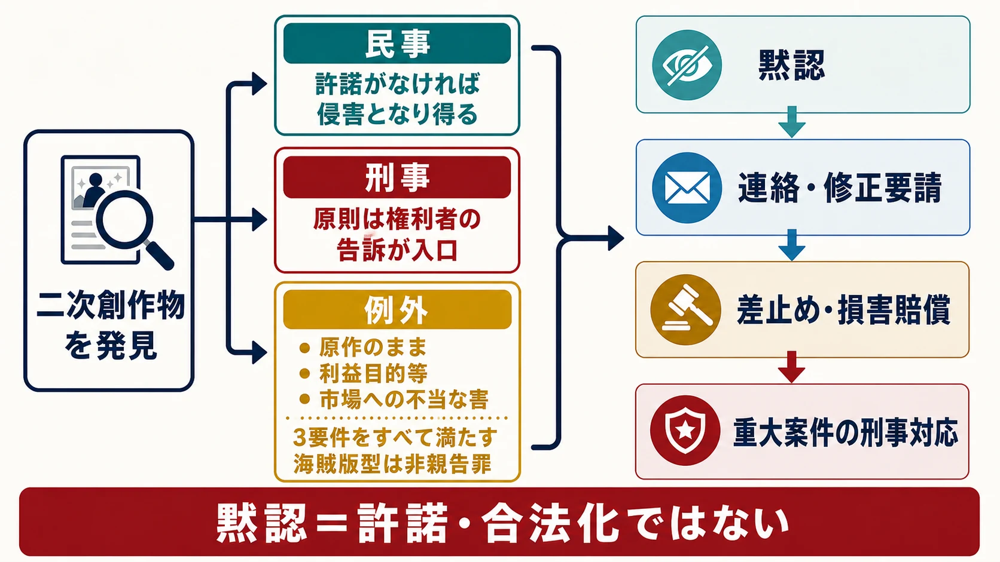
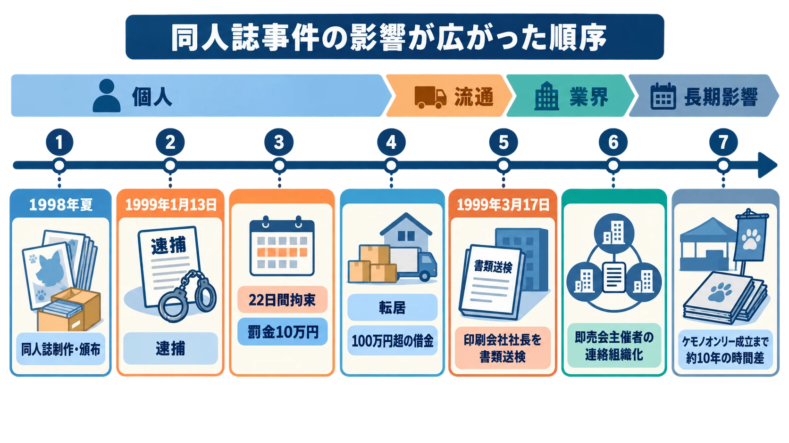
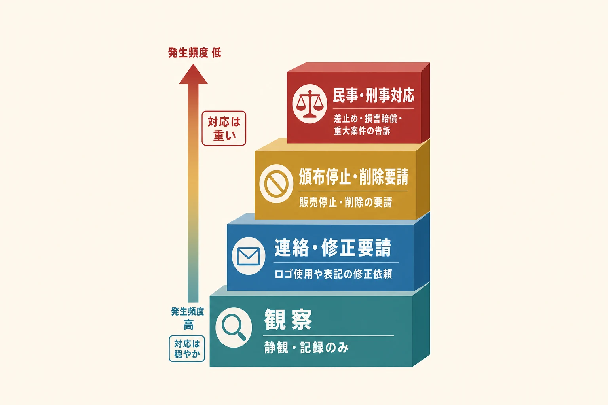

# 黙認という法的・商慣習的グレーゾーン――版元はなぜルールを明文化しないのか

> **注意：** 本稿は公開資料を基に、ゲーム会社が二次創作頒布へ向き合う際の論点を整理したものであり、個別の法的助言ではありません。実際の対応では、権利関係、表現内容、頒布規模、販売経路、地域の法令を確認し、法務・知的財産・広報・コミュニティ運営の担当者と協議してください。

## 1. 自社IPの二次創作を、どこまで許容するか

コミックマーケットのカタログに、自社ゲームのキャラクターを描いた同人誌が並んでいる。作品への愛情が伝わる本もあれば、公式商品と見分けにくいグッズ、成人向け表現を含む本、相当数を通販するサークルもある。このとき版元は、すべてを許諾するか、すべてを止めるかという二択では動いていない。

多くの現場で採られてきた第三の運用が **「黙認」** である。版元は包括的な許諾を公表せず、個々の二次創作を常時審査もしない。その一方で、市場代替、公式との誤認、第三者の権利侵害、重大なブランド毀損などが生じたときは介入する。これは「違法だが見逃す」という一文だけでは捉えきれない。権利者の裁量、刑事手続の入口、コミュニティの慣行、監視と審査の費用、将来の創作者層という複数の条件で成り立つ運用である。

黙認は許諾ではない。創作者に確定した権利を与えるものでも、版元が将来の権利行使を放棄するものでもない。それでも明文化しない余白が選ばれるのは、曖昧さそのものが目的だからではなく、事前に列挙しきれない作品へ比例的に対応する余地を残せるからである。本稿では、コミケの企業ブースや販促施策ではなく、個人による二次創作頒布の許容範囲に論点を絞る。

***

## 2. コミケの成立理念――「プロ予備軍ではなく、誰でも参加できる場」

コミックマーケットは1975年、既存の「日本漫画大会」への不満を背景に、漫画評論サークル「迷宮'75」が構想した。迷宮は、原田央男（霜月たかなか）、亜庭じゅん、高宮成河、米沢嘉博らによって結成され、漫画ファンが創造的に交流できる場を模索していた。第1回コミックマーケットは同年12月21日に開かれ、32サークル、推定700人が参加した。[[1](#ref-1)][[2](#ref-2)]

その前史にある『COM』の「ぐら・こん」は、全国の漫画研究会や創作同人を結び、新人発掘と「まんが家予備軍」の組織化を進めた。商業誌の投稿欄と連動し、プロ作家への道を意識した仕組みだった。対してコミケが育てたのは、プロになる意思や編集部からの評価を参加条件とせず、同人誌を作り、持ち寄り、読み手へ直接届ける市場である。創作者と読者の役割も固定せず、次回には一般参加者がサークル参加者になり得る。[[1](#ref-1)]

コミックマーケット準備会が後年まとめた理念も、アマチュアとプロの双方が発信者になれる場、全員が対等な参加者である場、表現の自由を広く保つためルールを最小限にする場だと説明している。[[3](#ref-3)] したがって「有望なアマチュアが将来プロになり、版元へ協力してくれる」という効用は、コミケ創設の参加資格や目的ではない。開かれた発表・頒布の場を続けた結果として生まれた、副次的な人材育成効果と整理すべきである。

この順序は版元の判断でも重要だ。二次創作を採用候補者の無償ポートフォリオとしてだけ評価すると、売上や採用へ直結しない表現を切り捨てやすい。コミュニティの価値は、まず参加と表現の裾野にあり、その一部が長い時間をかけて商業制作へ接続する。

***

## 3. 黙認が法的に成立する仕組み――親告罪という土台

二次創作の黙認を考えるとき、民事と刑事を分ける必要がある。キャラクターや物語の創作的表現を無断で翻案・複製した二次創作は、著作権侵害となり得る。権利者は差止めや損害賠償を求め得るため、黙認された作品が自動的に合法化されるわけではない。

刑事手続では、著作権法第123条が長く重要な調整弁となってきた。2018年の改正施行前、著作権等侵害罪は原則として親告罪であり、権利者等の告訴がなければ公訴を提起できなかった。権利者が告訴しないという判断は、国家が二次創作へ刑罰を適用する入口を閉じる効果を持ったのである。[[4](#ref-4)][[5](#ref-5)]

この運用が支えた規模を示す一例として、弁護士の福井健策氏は2015年の明治大学シンポジウムで、コミケの全同人誌の75％がパロディ系だと「言われる」と紹介した。[[6](#ref-6)] これは2015年時点の講演で引用された推計であり、現在の公式統計ではない。それでも、個別許諾では処理しきれない大量の二次創作が、権利者と創作者の「あうんの間合い」によって流通してきた状況を示している。

### TPP交渉で揺らいだ前提

日本がTPP交渉へ正式参加した2013年7月、著作権侵害罪の非親告罪化によって、権利者が問題視していない二次創作にも捜査や起訴が及ぶのではないかという懸念が広がった。[[7](#ref-7)] 漫画家の赤松健氏が同年に提案した「同人マーク」は、作品へマークを付けることで、同人誌即売会での二次創作と頒布をあらかじめ許諾する仕組みである。審査や登録を要しない一方、委託書店やデジタル配信など、マークのライセンスにない利用まで許すものではなかった。[[8](#ref-8)]

赤松氏は2022年5月13日のX投稿で、当時を「一漫画家としての立場で、TPPからコミケなど二次創作を守る活動をしていた」と振り返っている。[[9](#ref-9)] 同人マークは、すべての作品へ義務付ける統一制度ではなく、非親告罪化への備えとして権利者が明示的な意思を示せる選択肢だった。

2015年10月のTPP大筋合意後、国内では二次創作を萎縮させない範囲の制度設計が検討された。最終的に日本では、TPP11の発効に合わせて2018年12月30日から著作権等侵害罪の一部が非親告罪化された。ただし対象は、利益を得る目的等があり、有償著作物等を「原作のまま」利用し、権利者の利益を不当に害する場合という三要件をすべて満たす行為に限定された。文化庁は、一般的なコミケの二次創作は原作のままの利用ではなく、市場で原作と競合しないため、通常は非親告罪の対象にならないと説明している。海賊版型には権利者の告訴を待たず対応しつつ、通常の二次創作には従来の親告罪の構造を残す「限定的な非親告罪化」が選ばれたのである。[[5](#ref-5)] 全作品を明示許諾へ移す制度ではなく、通常の二次創作について既存の黙認と親告罪の運用を残した点で、実質的な「現状維持」が選好されたと整理できる。

ここで維持されたのは、二次創作の包括的な合法化ではない。民事責任の可能性と、重大な海賊版行為に対する非親告罪の例外は残る。黙認の土台は、親告罪だけでなく、権利者が民事・刑事・広報上の手段をどの案件へ使うか判断する裁量と、創作者側の自制によって成り立っている。

***

## 4. 黙認を破ったときのコスト――ポケモン同人誌事件

権利者が刑事告訴を選ぶと、影響は対象作品の回収にとどまらない。1999年の「ポケモン同人誌事件」は、その連鎖を具体的に示した。

### 1998年から1999年――逮捕、拘束、罰金

1998年夏、『ポケットモンスター』を題材にした性的表現を含む同人誌が制作・頒布された。権利者側の告訴を受け、京都府警は1999年1月13日、福岡県の作者を複製権侵害の疑いで逮捕した。作者は京都へ移送され、22日間拘束された後、略式手続で罰金10万円となった。[[10](#ref-10)][[11](#ref-11)]

作者本人が後に公開した手記によれば、事前の警告はなく、自宅の捜索から逮捕へ進んだ。拘束だけが損害ではない。約2か月仕事ができず、住居からの退去を求められ、福岡と京都の移動費、荷物の送料、急な転居費用を負担し、借金は100万円を大きく超えたという。[[10](#ref-10)][[12](#ref-12)] 罰金10万円だけを「事件のコスト」と見ると、刑事手続が個人の仕事・住居・信用へ及ぼす損害を見落とす。

### 1999年3月――印刷会社へ波及

捜査は作者だけで終わらなかった。京都新聞は1999年3月18日、同人誌460冊を7万3000円で印刷した印刷会社社長が、前日の17日に著作権法違反のほう助容疑で書類送検されたと報じた。[[13](#ref-13)] 印刷会社が内容確認を強めれば、法的判断の専門家ではない事業者が、受注の可否を防衛的に決めざるを得なくなる。萎縮は一人の作家から、印刷、イベント、書店という流通基盤へ伝播する。

### 業界の防衛的組織化

ガタケット代表だった坂田文彦氏は、京都府警へ説明に赴いた際、同人活動が反社会勢力の資金源ではないかという誤解まであったと回想している。この経験から、即売会主催者が著作権や表現上の問題について情報を共有し、外部へ説明できる組織が必要だと判断した。米沢嘉博氏らの協力を得て、全国同人誌即売会連絡会の発足へ動き、印刷会社や同人書店も交えた勉強会が行われるようになった。[[14](#ref-14)]

米沢氏は朝日新聞1999年3月11日朝刊「アニメやゲームのファン活動と著作権衝突」の取材で、パロディーは漫画・アニメ文化を厚くするファン活動でもあり、許容される表現の議論がないまま事件だけが先行すれば、表現の幅を狭めると懸念した。[[15](#ref-15)] 権利行使そのものを否定したのではなく、一件の刑事事件が不明確な一線を業界全体へ推測させることを問題視したのである。

### 約10年後まで残った影響

長期的影響も、単純な販売停止では測れない。ケモノ文化を研究する猪口智広氏は、耳キャラクター中心の「みみけっと」が2000年に始まった一方、ケモノオンリーイベントの成立はそこから10年近く遅れたと説明し、1999年の事件がコミュニティへ与えた衝撃をその背景に置いている。[[16](#ref-16)] これは「ケモノ系の創作がすべて消えた」という意味ではなく、専門即売会として組織化されるまでの時間差を示す証言である。因果を事件だけへ還元はできないが、介入の余波が2010年代まで観察された事例として重い。

この事件から版元が学ぶべきことは、「権利行使をしてはいけない」ではない。刑事告訴は、対象物を止める以上のシグナルを市場へ送る。警告、連絡、販売停止要請、民事措置、刑事告訴のどこから始めるかは、侵害の深刻さだけでなく、周辺の創作者と事業者がどう受け取るかまで含めて選ぶ必要がある。

***

## 5. 黙認のもう一つの理由――将来の人材輩出

コミケは職業訓練機関として始まったわけではない。それでも、作品を完成させ、印刷し、価格と部数を決め、対面で反応を受け取る経験は、結果として商業制作へ進む人材を育ててきた。

### CLAMP――同人活動から商業誌へ

創作集団CLAMPは、菊地秀行の小説『魔王伝』を題材にした同人誌『新宿純愛物語』を初のCLAMP名義作として制作し、その後、オリジナル同人誌『SHOTEN』シリーズなどを発表した。現存する頒布物の書誌情報からも、『新宿純愛物語』が1987年に発行され、『SHOTEN 5』も1990年の同人誌として残ることを確認できる。[[17](#ref-17)][[18](#ref-18)] そして1989年、新書館『サウス』第3号の『聖伝-RG VEDA-』で商業誌デビューした。[[19](#ref-19)]

この経歴は、すべての二次創作が採用へ直結することを意味しない。版元が黙認すれば将来の取引先を必ず得られる、という投資回収の式にもできない。ただし、自由参加の制作市場から、完成経験を持つ作家が現れる経路が実在することは示している。

### ブルーアーカイブ――IPエコシステムとしての二次創作

『ブルーアーカイブ』の統括プロデューサー、キム・ヨンハ氏は、韓国のゲームメディアInvenによる2023年のインタビューで、次のように述べた。

> 「二次創作や同人活動も、すべてIPエコシステムの一部だと考えています」（韓国語原文「2차 창작이나 동인 활동도 모두 IP 생태계의 일부라고 생각합니다」から筆者訳）[[20](#ref-20)]

キム氏は、見る人と作る人の双方を生態系の構成員と位置づけている。同じ取材では、グッズ販売業者と同人頒布者、商業と同人の境界を厳密に引けば制約が生まれる一方、線を引かなければ生態系に不利益が出るという難しさにも言及した。つまり、歓迎の言葉だけで無制限な頒布を認めたのではなく、境界管理をIP運営の課題として捉えている。[[20](#ref-20)]

その広がりはコミケにも表れた。韓国語メディア「デイリーゲーム」は、C103で『ブルーアーカイブ』が単一IP基準の参加サークル数1位を記録したと報じている（韓国語記事から筆者訳）。[[21](#ref-21)] 日本側でも、C103では同作が初めて独立ジャンルとなり、コミケWebカタログを基にした編集部の目視集計で1718サークル、作品単独ジャンルとして最多と報じられた。[[22](#ref-22)] これは二次創作がゲームの売上を何円押し上げたかを示すデータではないが、作り手が時間と費用を投じて参加した規模を示す実績である。

一方、二次創作の参加者が後に公式イラストレーターへ起用されたという逸話も、業界内では語られる。ただし『ブルーアーカイブ』について、その因果関係を確認できる公式資料は公表されていない。キム氏本人の発言、C103の参加実績、採用に関する伝聞は同じ証拠ではない。人材輩出を社内説明へ使うなら、確認できる経歴や契約実績と、期待・逸話を分けるべきである。

***

## 6. 明文化という選択肢とそのトレードオフ――カプコンの事例

黙認を続けることだけが解ではない。カプコンは2021年に動画ガイドライン、2025年に二次創作ガイドラインを公開した。知的財産部の保田祐子氏は、制定前にはゲーム実況などへのスタンスが社内で統一されておらず、担当者によって判断が揺れ、ユーザーも何がよくて何がだめか分からず疑心暗鬼になる状況があったと説明している。そこで会社としての統一見解を「共通言語」にし、創作活動を応援する線を示した。[[23](#ref-23)]

同社が掲げた理由は内部統制だけではない。ファンの発信がブランド認知を広げ、新しいユーザーを呼ぶ循環を後押しし、「ユーザーの皆様と一緒にブランドを育てていきたい」という共創の姿勢でもある。[[23](#ref-23)] 実際のガイドラインは、個人または法人格のない団体による二次創作、趣味の範囲における少量・少額の頒布など、対象と条件を文章で示している。[[24](#ref-24)]

明文化には二つの直接的な利点がある。

1. **外部の線引きを明確にする**：創作者は、公式素材の転用、営利性、禁止表現などを制作前に確認できる。
2. **内部の判断をそろえる**：法務、開発、広報、サポートが、同じ案件へ矛盾した回答を返す危険を減らせる。

さらに「いつ削除されるか分からない」という萎縮を抑え、版元が歓迎する範囲へ創作を誘導できる。ガイドラインの具体的な設計要素は、既存記事「[ゲームプレイの配信と二次創作：ルール設計の実践ガイド](game-streaming-fan-creation-guideline-design.md)」で詳しく扱っている。

一方、明文化には継続費用が生じる。少量とは何部か、少額とは売上か利益か、イベント後の通販はどこまで含むか、合同サークルや海外頒布をどう扱うか。数値を固定すれば、その直前へ行為が集中し、書かなければ問い合わせが残る。新しい頒布形態が現れるたびに改定、社内周知、多言語化、旧版との整合確認も必要になる。

また、列挙した禁止事項が、想定外のエッジケースへの対応を硬直させることもある。禁止と書かなかった行為をユーザーが「公認」と受け止めたり、例外的に許したい企画が一般ルールと衝突したりするからである。これはカプコンのガイドラインに問題があるという意味ではなく、明文化一般が負う設計上のトレードオフである。

したがって選択肢は、黙認か明文化かの二択ではない。公開ガイドラインで安全圏を示しつつ、個別案件の裁量を留保する。禁止事項だけを明文化し、それ以外を包括許諾とはしない。特定タイトルや期間に限って許諾する。IPの知名度、権利者数、海外展開、問い合わせ件数、社内判断のばらつきに応じて、明文化の粒度を決めるべきである。

***

## 7. 権利を完全に解決するコスト――なぜ個別審査は現実的でないか

コミックマーケット107は2025年12月に2日間で2万4000サークル・スペースを配置し、応募は3万数千に達した。[[25](#ref-25)] 一つのサークルが複数の新刊、既刊、グッズを扱い、制作物は開催直前まで変わり得る。全サークルの全ページ、印刷部数、価格、通販予定、共同制作者の権利まで版元が事前審査するなら、確認対象はスペース数をはるかに上回る。

しかも、審査には法務だけでなく、作品設定、ロゴ、年齢区分、地域別契約、音楽・俳優・コラボ先などの知識が必要になる。回答が遅ければ入稿に間に合わず、回答を急げば誤許諾の危険が増える。許諾料を取れば契約、請求、税務、海外送金の処理が加わり、無料でも問い合わせ窓口と記録管理は残る。個別審査は、事故をゼロにするほど広げると、イベントの規模と速度に耐えない。

そこで実務上は、すべての侵害可能性を同じ強度で処理せず、害の大きさに応じて介入を選ぶ。

- **観察**：少部数で創作性が高く、公式との誤認や市場代替が見られない。
- **連絡・修正要請**：ロゴの使い方、公式表記、年齢表示など、限定的な修正で害を減らせる。
- **頒布停止・削除要請**：公式素材の大量転用、公式商品との競合、第三者権利の侵害など、継続被害がある。
- **民事・刑事対応**：海賊版、反復的な大規模販売、詐欺的な公式偽装、警告無視など、重大性と緊急性が高い。

親告罪の仕組みは、この選択的介入のうち刑事手続を権利者の意思へ結び付けてきた。しかし、選択的介入の合理性すべてを親告罪だけで説明してはならない。民事請求に告訴は不要であり、2018年末以降は一定の海賊版型が非親告罪となった。版元が持つ実務上の裁量は、どの被害へ、どの手段を、どの順番で用いるかというエンフォースメント設計にある。

黙認は、この設計を公表しないまま運用する方法である。柔軟で低コストな反面、創作者から一線が見えにくく、担当者交代で判断が揺れる。問い合わせや問題案件が増え、社内の不統一によるコストが黙認の便益を上回ったとき、カプコンのような明文化が合理的になる。

***

## 8. まとめ――黙認から介入へ切り替える確認表

プランナーが自社IPの二次創作頒布を見つけたとき、最初に「好きか嫌いか」「成人向けかどうか」だけで判断すると、作品ごとの感情と会社の権利行使が混ざる。法務・知的財産・広報・コミュニティ運営へ共有できる観察事実に分解する必要がある。

| 判断軸 | 黙認・観察を検討しやすい状態 | 介入を検討すべき一線 | 最初の対応 |
|---|---|---|---|
| 創作性 | 描き下ろし、独自の物語・批評・表現が中心 | ゲーム画像、ロゴ、音声、設定画をほぼそのまま転用 | 使用箇所と素材の出所を記録する |
| 市場代替 | 少部数の同人誌で、公式商品と用途が異なる | 公式商品と競合する大量のグッズ、海賊版、データ複製 | 部数、価格、販路、在庫、反復性を確認する |
| 公式との誤認 | 非公式であることが外観から分かる | 公式ロゴ、告知様式、認証表示を使い、公式商品・企画に見せる | 表示修正やロゴ使用停止を優先して求める |
| 営利性・規模 | 趣味の範囲の小規模頒布 | 法人運営、継続的な大量生産、卸売、多店舗・大規模EC | 売上だけでなく組織性と継続性を見る |
| 内容と安全 | ファン間の表現として適切な区分・表示がある | 違法表現、脅迫、差別扇動、年齢区分の欠落、現実の安全被害 | 緊急性に応じ法務・安全担当へ即時共有する |
| 第三者の権利 | 自社IPだけで完結し、共同権利者の条件にも沿う | コラボ先、楽曲、俳優、ブランド、個人情報を無断利用 | 自社だけで許諾できる案件かを確認する |
| 未公開情報 | 公開済みのゲーム内容を基にする | リーク、秘密保持違反、解析で得た未公開素材を頒布 | 証拠保全後、情報管理・法務へエスカレーションする |
| コミュニティへの影響 | 個別連絡で限定的に是正できる | 模倣が急増し、放置が公式黙認の表示として利用される | 個別対応か全体告知かを広報と選ぶ |
| 対応履歴 | 初回で、悪質性や再発が見られない | 警告無視、再犯、名義変更、証拠隠滅 | 段階的対応の記録を残し、強度を上げる |

実務では、次の順番が扱いやすい。

1. **事実を固定する**：現物、商品ページ、日時、価格、部数表示、販売者、公式誤認につながる表示を保存する。
2. **権利と害を分ける**：法的に主張できる権利と、実際に生じている市場・安全・信用上の害を別々に書く。
3. **比例的な手段を選ぶ**：修正で足りるなら修正を求め、販売停止が必要なら対象を限定し、刑事対応は重大性と波及を踏まえて選ぶ。
4. **横展開を決める**：一件だけの対応でよいか、FAQ、禁止事項、ガイドラインまで明文化すべき反復問題かを検討する。
5. **定期的に再評価する**：小規模頒布が大規模通販へ変わるなど、規模と販路の変化を追う。

黙認の強みは、すべてを白か黒に固定せず、創作性、規模、害に応じて介入を変えられることにある。弱みは、その一線が創作者にも社内にも見えにくいことだ。自社IPに必要なのは「二次創作に寛容か厳格か」という標語ではなく、黙認を維持できる条件、介入へ切り替える条件、最初に使う手段を組織内で共有することである。

## References

1. [コミックマーケットの源流――「迷宮'75」][1] - 明治大学米沢嘉博記念図書館による、コミケの前身「迷宮'75」の結成メンバーと第1回コミックマーケットの開催概要。

2. [コミックマーケット年表][2] - コミケット準備会による、第1回開催（1975年12月21日・32サークル・来場約700人）を含む開催記録。

3. [コミックマーケットの理念と目的][3] - コミケット準備会による公式の理念説明。アマチュア・プロ双方が対等な発信者になれる開かれた場という位置づけ。

4. [著作権法第123条][4] - e-Govによる法令データ。著作権等侵害罪における親告罪の規定。

5. [環太平洋パートナーシップ協定に伴う著作権法改正について][5] - 文化庁による解説。TPP11発効（2018年12月30日）に伴う非親告罪化の三要件。

6. [2015年3月24日明治大学シンポジウム資料][6] - 弁護士福井健策氏の発言。コミケの同人誌の75%がパロディ系と「言われる」という紹介。

7. [TPP政府対策本部の情報][7] - 内閣官房による、日本のTPP交渉正式参加（2013年7月）の記録。

8. [「同人マーク」運用始まる][8] - ITmediaによる報道。赤松健氏が提案した二次創作許諾マークの仕組み。

9. [赤松健氏によるTPPと同人マークの振り返り][9] - 赤松健公式サイト。2022年5月13日のX投稿を引用し、TPPからコミケなど二次創作を守る活動をしていたと振り返る。

10. [ポケモン同人誌事件の記録（作者本人による手記・逮捕直後）][10] - Web Archiveに保存された当事者の手記。逮捕の経緯と拘束期間。

11. [ポケモン同人誌事件を扱う学術論文][11] - 関西大学リポジトリ。事件の経緯と著作権法上の論点整理。

12. [ポケモン同人誌事件の記録（作者本人による手記・その後の負担）][12] - Web Archiveに保存された当事者の手記。転居・借金など事件後の負担。

13. [京都新聞1999年3月18日報道][13] - Web Archiveに保存された記事。印刷会社社長の書類送検（1999年3月17日）。

14. [同人誌即売会と著作権をめぐる歴史][14] - 文化庁メディア芸術カレントコンテンツ。坂田文彦氏の証言と全国同人誌即売会連絡会の発足経緯。

15. 朝日新聞「アニメやゲームのファン活動と著作権衝突（ニュース・スナップ）」1999年3月11日朝刊、27面（[朝日新聞クロスサーチ][15]、契約者向け） - 米沢嘉博氏による、パロディー表現の萎縮への懸念の取材記事。

16. [けもの系同人文化とポケモン同人誌事件の影響][16] - デンファミニコゲーマー。「みみけっと」（2000年開始）からケモノオンリーイベント成立まで約10年の時間差があった経緯。

17. [CLAMP初期同人誌の紹介][17] - 刀剣ワールド。菊地秀行『魔王伝』を題材にした『新宿純愛物語』（1987年）の内容。

18. [『SHOTEN 5』商品情報][18] - 駿河屋の中古書誌情報。1990年発行のCLAMP同人誌。

19. [CLAMP展公式ページ][19] - 国立新美術館。1989年、新書館『サウス』第3号『聖伝-RG VEDA-』での商業誌デビュー。

20. [キム・ヨンハ氏インタビュー][20] - 韓国のゲームメディアInvenによる2023年の取材。「二次創作や同人活動も、すべてIPエコシステムの一部」という発言（引用は筆者訳）。

21. [『ブルーアーカイブ』のコミケ参加実績を振り返る記事][21] - 韓国メディアDaum配信。C103で単一IP基準の参加サークル数1位を記録したという報道。

22. [C103における『ブルーアーカイブ』の参加サークル数集計][22] - 株式会社オタクリエイトが運営する専門ニュース媒体「オタク総研」による、公式Webカタログを基にした目視集計。1718サークルで単独ジャンル最多と報じる。

23. [カプコンが二次創作のガイドラインを制定した背景][23] - NiEWによる、知的財産部保田祐子氏へのインタビュー。ガイドライン制定の内部要因と「共創」の姿勢。

24. [カプコン ファンコンテンツガイドライン][24] - カプコン公式。二次創作の対象・条件を定めたガイドライン本文（2025年11月4日公開）。

25. [コミケットアピール107][25] - コミケット準備会による、コミックマーケット107（2025年12月30日・31日）の開催規模（配置スペース数・申込数）の公式案内。

[1]: https://www.meiji.ac.jp/manga/yonezawa_lib/archives/exh_genryu/index.html
[2]: https://www.comiket.co.jp/archives/Chronology.html
[3]: https://www.comiket.co.jp/info-c/IdealsAndVision.html
[4]: https://laws.e-gov.go.jp/law/345AC0000000048
[5]: https://www.bunka.go.jp/seisaku/chosakuken/hokaisei/kantaiheiyo_hokaisei/
[6]: https://www.isc.meiji.ac.jp/~ip/_src/20150324/20150324part1panel.pdf
[7]: https://www.cas.go.jp/jp/tpp/tppinfo/2013/index.html
[8]: https://www.itmedia.co.jp/news/article/1308/28/1130828067/
[9]: https://kenakamatsu.jp/articles/20965
[10]: https://web.archive.org/web/20010609181149/http://www.nitiyo.com/zine/poke/poke19990212.htm
[11]: https://kansai-u.repo.nii.ac.jp/record/2000779/files/KU-1100-20120319-09.pdf
[12]: https://web.archive.org/web/20010609182240/http://www.nitiyo.com/zine/poke/poke19990220.htm
[13]: https://web.archive.org/web/20010711213937/http://www.kyoto-np.co.jp/kp/topics/99mar/18/05.html
[14]: https://mediag.bunka.go.jp/article/article-18965/
[15]: https://alc.chiba-u.jp/db/asahi.html
[16]: https://news.denfaminicogamer.jp/kikakuthetower/kemono_friends
[17]: https://www.touken-world.jp/tips/11967/
[18]: https://www.suruga-ya.jp/product/detail/ZHONI7385
[19]: https://nact.jp/exhibition_special/2024/clamp/index.html
[20]: https://www.inven.co.kr/webzine/news/?news=281937
[21]: https://v.daum.net/v/UabxSnuSvV
[22]: https://0115765.com/archives/46957
[23]: https://niewmedia.com/specials/2602capcom_edsbt_wrmtm/
[24]: https://www.capcom-games.com/ja-jp/fan-content-guidelines/
[25]: https://www.comiket.co.jp/info-c/C107/C107Appeal.pdf

----

この文書は、Perplexity、Claude、OpenAI Codex の3つのAIの支援を受けて著述されたものです。引用画像を除き、MIT License にて提供されています。
