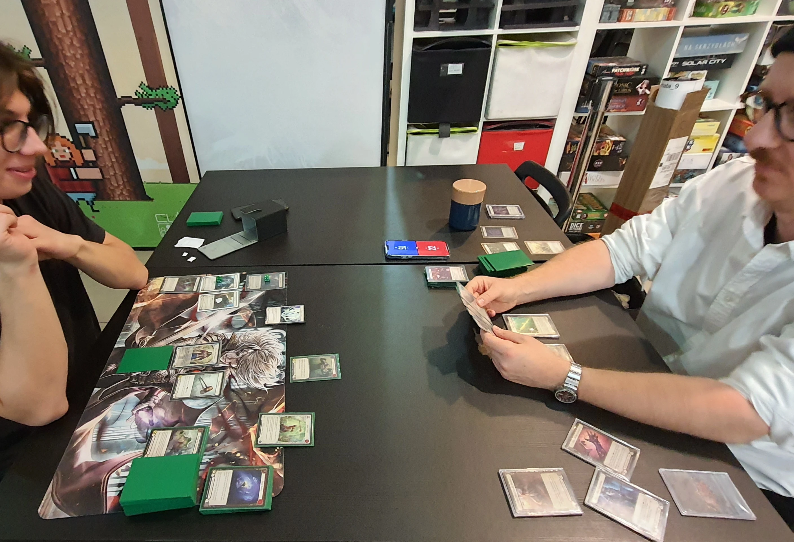
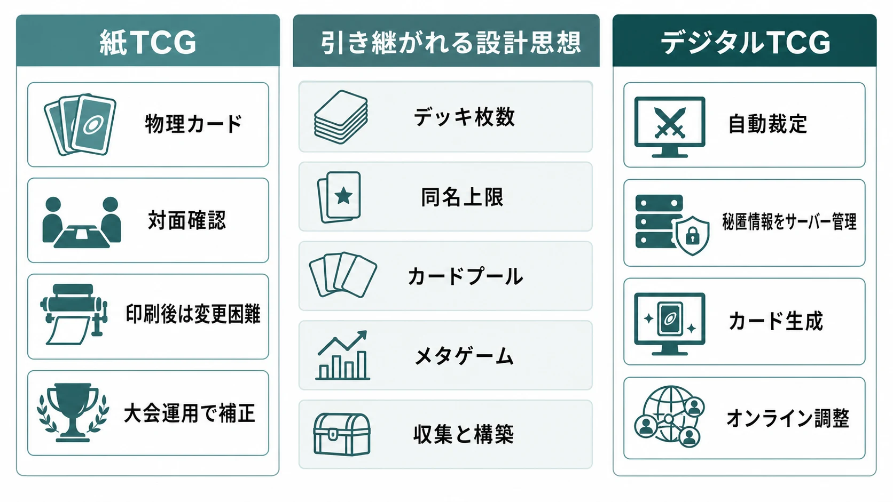
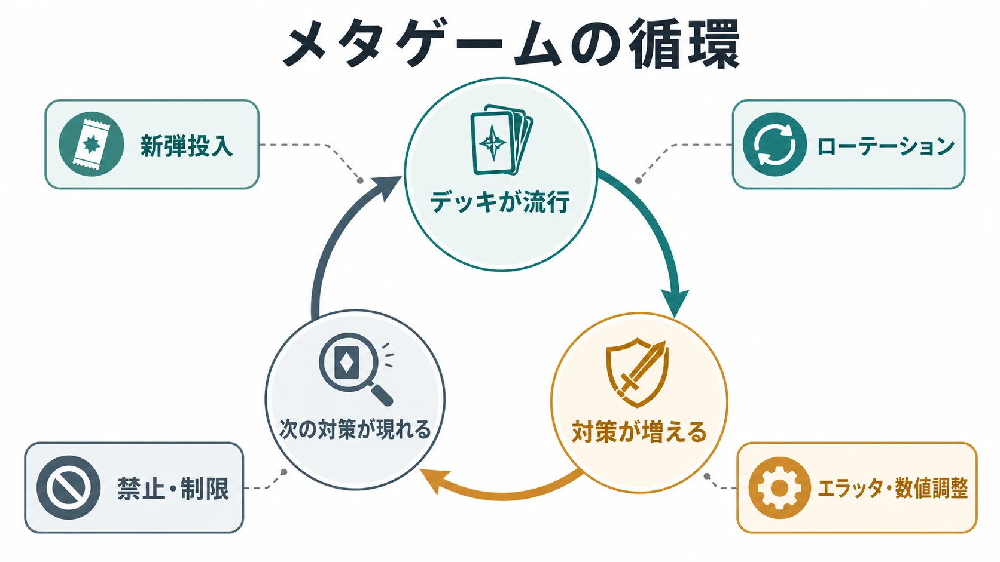
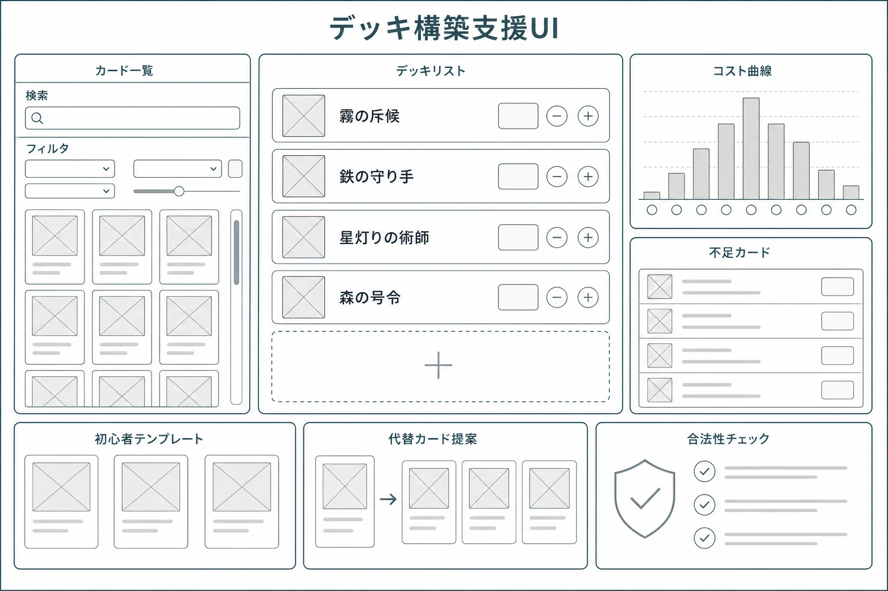
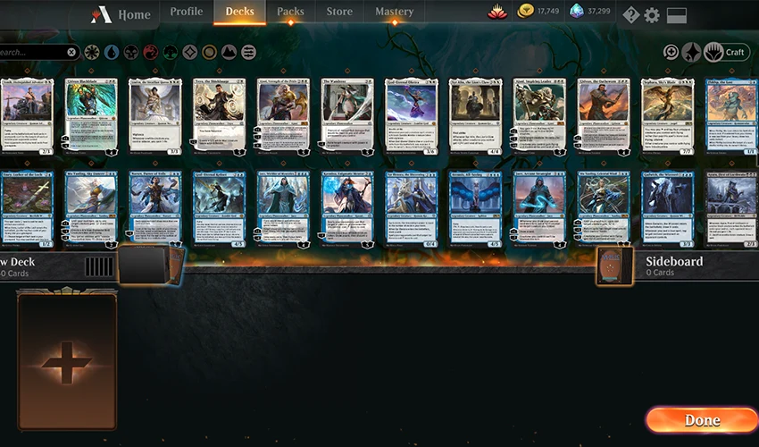
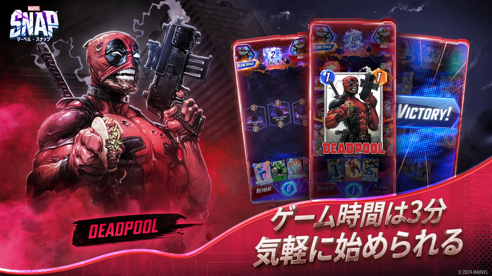

# トレーディングカードゲームのデジタル化とデッキ構築設計の実務

***

## はじめに

トレーディングカードゲーム（以下TCG）は、カードを集め、選び、組み合わせ、対戦で検証する遊びである。紙のTCGでは、物理カードを買い、交換し、デッキケースに入れ、対面でシャッフルする。この制約は単なる不便ではない。デッキ枚数、同名カード上限、サイドボード、レアリティ、ローテーションといった仕組みは、物理的な商品と大会運営の制約から生まれ、結果として戦略の骨格になった。

*画像出典（引用）：Klapi, [Flesh and Blood card game 2022](https://commons.wikimedia.org/wiki/File:Flesh_and_Blood_card_game_2022.jpg), Wikimedia Commons, [CC BY-SA 4.0](https://creativecommons.org/licenses/by-sa/4.0/) / 物理カード、デッキ、対面確認の手触りを示す資料として引用。WebP変換。*

デジタルTCGは、この骨格をそのまま移植するだけでは成立しない。クライアントがルール処理を自動化し、見えない情報を正確に管理し、カードテキストを配信後に修正でき、デッキ構築UIが未所持カードまで含めて検索できるからだ。一方で、物理的な摩擦が減るほど、プレイヤーは強いデッキへ速く収束し、メタゲームの変化も速くなる。

本記事は、パック開封の収益構造や法規制そのものを掘り下げない。その論点は「[ガチャは違法になったのか？ コンプガチャ規制から確率表示までの歴史](gacha-regulation-japan-history.md)」に譲る。通貨発行、シンク、プレイヤー間取引の一般論も「[ゲーム内経済の設計](in-game-economy-design.md)」に譲る。ここで扱うのは、収集要素が「デッキを作る遊び」とどう接続し、デジタル化によって設計実務がどう変わるかである。[[1](#ref-1)][[2](#ref-2)]

***

## 1. 紙のTCGが作った設計思想

紙のTCGの基本は、限られたカードプールから一定枚数のデッキを作り、ランダムに引いた手札を使って勝ち筋へ近づくことだ。マジック：ザ・ギャザリングの公式フォーマットページでは、Standardは60枚以上のメインデッキ、Booster Draftは40枚以上のデッキとして示されている。[[3](#ref-3)] ここで重要なのは、40枚や60枚という数字そのものではなく、枚数制約が確率、選択、収集を同時に制御している点である。

60枚デッキは、特定カードを毎試合必ず引ける状態を避けながら、戦略の再現性を作る。40枚デッキは、限定されたカードプールから即席で構築するLimited向けに、引きたいカードへ届きやすくする。海外版『Yu-Gi-Oh! TRADING CARD GAME』(TCG)も公式ルールブックとデッキ構築ルールを分け、ゲームの基本ルールと禁止・制限カードの運用を別のレイヤーとして管理している。日本国内の遊戯王OCGとは禁止・制限カードの指定が一部異なるため、ここでは区別してTCGと表記する。[[4](#ref-4)][[5](#ref-5)]

この構造から、TCG的な企画で最初に決めるべきことが見える。

| 設計項目 | 決めること | プレイヤー体験への影響 |
|---|---|---|
| デッキ枚数 | 最小枚数、最大枚数、実質的な推奨枚数 | 再現性、事故率、構築の難度 |
| 同名カード上限 | 1枚制限、2枚制限、3枚制限、4枚制限など | コンボの安定度、資産要求、カード価値 |
| カードプール | 全カード使用、最新セット中心、イベント限定など | 新規参入のしやすさ、環境の寿命 |
| 交換枠 | サイドボード、予備デッキ、対戦前変更の可否 | 対策カードの意味、読み合いの深さ |
| 禁止・制限 | 禁止、1枚制限、2枚制限、デジタル補正など | 環境修正の速度、所有物への信頼 |

紙のTCGは、カードが印刷された後に内容を変えにくい。そのため、禁止・制限リスト、ローテーション、再録、次弾のカード設計で環境を動かす。マジックの公式Banned and Restricted Listsは、多様性と健全なトーナメント環境を保つため、強すぎるカードや特定戦略へ環境を歪めるカードを禁止・制限すると説明している。[[6](#ref-6)] これは、カード単体の強さだけでなく、デッキ選択肢の多様性を守るための運用である。

***

## 2. デジタル化で何が変わるか

デジタル化の最大の変化は、物理的な処理をソフトウェアが引き受けることだ。シャッフル、手札の秘匿、山札の順序、効果の対象確認、誘発処理、同時処理、カード生成、公開情報のログ化をクライアントが管理する。紙ではプレイヤーが宣言し、相手が確認し、ジャッジが裁定する場面も、デジタルではシステムが許可した操作だけが実行される。

マジックのComprehensive Rulesは、通常の入門書ではなく、ルール上の例外や隅のケースを参照するための文書として位置づけられている。[[7](#ref-7)] デジタル移植では、この「隅のケース」を人間の裁定ではなくプログラムとして実装しなければならない。カードテキストの一語が、UI、サーバー状態、リプレイ、ログ、AI、チュートリアルに波及する。

特に注意が必要なのは、次の三つである。

### 見えない情報

手札、山札、裏向きカード、ランダム生成候補は、プレイヤーには見えないがシステムには見えている。デジタルでは、チート対策、観戦、リプレイ、切断復帰、AI判断のために、どの情報をクライアントへ送るかを厳密に決める必要がある。見せない情報をクライアントに渡して隠すだけでは、解析や改造に弱い。

### スタック処理と優先権

スタックとは、解決待ちの効果を順番に積み、後から積まれたものから解決する考え方である。紙では確認会話で進められるが、デジタルでは「いま割り込めるか」「自動でパスしてよいか」「相手に待ち時間を与えるか」をUIに落とす必要がある。すべての割り込みを手動確認にするとテンポが壊れ、すべて自動化すると上級者の意思決定が失われる。

### 物理的にできないカード

デジタルでは、試合中にカードを生成する、山札外から候補を提示する、カードの数値を永続的に変える、対戦中の履歴を参照する、といった処理が自然にできる。MTGアリーナのAlchemyは、Standardを土台にしつつ、デジタル専用カードとリバランス版カードを組み込むデジタル専用フォーマットとして説明されている。[[8](#ref-8)] これは紙の再現ではなく、デジタルだから可能になった別フォーマットである。

***

## 3. デッキ構築は「確率を編集する遊び」である

デッキ構築を、単に強いカードを詰め込む行為と見てはいけない。実務上は、プレイヤーが自分の勝ち筋に合わせて、引く確率、使えるタイミング、相互作用、弱点を編集する遊びである。

### コスト曲線

コスト曲線とは、デッキ内のカードを使用コスト別に並べた分布である。序盤用カードが少なければ、強いカードを持っていても何もできないターンが増える。高コストカードが多すぎれば、勝ち筋は派手でも再現性が低い。逆に低コストに寄せすぎると、終盤の決定力が落ちる。

プランナーが見るべき指標は、平均コストだけではない。

- 1ターン目から3ターン目までに行動できる初手率
- 中盤に複数アクションできる比率
- 手札を使い切った後の補充手段
- 後攻時に相手の展開へ干渉できる枚数
- キーカードを引けなかったときの代替ルート

平均コストが同じでも、2コストに厚いデッキと5コストに厚いデッキではプレイ感が違う。デジタルでは実戦ログから「使用できずに手札へ残ったカード」「勝利時に実際に使われたカード」「初手キープ率」を取れるため、カードの理論値と実プレイを分けて検証しやすい。

### シナジー設計

シナジーとは、カード同士が組み合わさることで単体以上の価値を出す関係である。TCGの面白さの中心だが、管理を誤ると環境を一気に狭める。

シナジーには段階がある。

| 型 | 例 | 設計上の注意 |
|---|---|---|
| 軽い相性 | 同じ属性を参照する、同じカードタイプを支援する | 初心者にも理解しやすいが、単調になりやすい |
| エンジン | 毎ターン資源を生む、手札と墓地を循環させる | 放置するとゲーム時間と選択肢が増えすぎる |
| コンボ | 複数枚がそろうと大きな勝ち筋になる | 必要枚数、探索手段、妨害可能性をセットで見る |
| メタ対策 | 特定戦略だけに強いカード | 入れ得になるとメインデッキを圧迫する |

強いシナジーを作るときは、成立率だけでなく、対戦相手の介入点を設計する必要がある。対策不能なコンボは、勝率が極端に高くなくても不満を生む。逆に、妨害されやすいが達成感のあるコンボは、カジュアル層の自己表現として機能する。

### パワーレベル管理

カードの強さは、攻撃力やコスト効率だけでは測れない。手札補充、サーチ、再利用、踏み倒し、相手ターン干渉、ランダム生成、直接勝利条件などは、環境全体へ与える影響が大きい。

実務では、カードごとに次のタグを持たせるとレビューしやすい。

| タグ | 意味 | レビュー観点 |
|---|---|---|
| 資源加速 | 通常より早く高コストへ届く | 後続カードの上限を壊さないか |
| サーチ | 特定カードへアクセスする | コンボ成立率が上がりすぎないか |
| 再利用 | 墓地や使用済みカードを戻す | 無限ループや長時間化を生まないか |
| 全体除去 | 複数カードをまとめて処理する | 展開型デッキだけを抑えすぎないか |
| ロック | 相手の行動を制限する | 負けるまで操作できない時間が長くないか |
| 直接勝利 | 通常のライフ競争を迂回する | 達成条件と妨害手段が明確か |

デジタルTCGでは、配信後の数値調整がしやすい。ただし、調整できることは、強すぎるカードを安易に出してよい理由にはならない。カードは所有物であり、デッキはプレイヤーの投資と時間の結果だからである。

***

## 4. 収集要素とデッキ構築の接続

TCGにおける収集は、単にコレクションを埋める遊びではない。デッキを作るための素材を増やし、別の戦略へ移れる自由度を広げる仕組みである。

デジタルTCGのパック開封で見るべきなのは、売上最大化だけではない。プレイヤーが「作りたいデッキへ近づいている」と感じられるかである。MTGアリーナの報酬分布ページは、パック内のレアリティ配分、ワイルドカード、報酬獲得などを公開している。[[9](#ref-9)] ワイルドカードのような任意交換資源は、ランダム入手と目的デッキの間をつなぐ緩衝材になる。

設計上は、次の三つを分けるとよい。

| 収集要素 | 主な役割 | デッキ構築との接続 |
|---|---|---|
| ランダムパック | 発見、驚き、広いカードプールへの接触 | 想定外のデッキを試すきっかけになる |
| 生成資源 | 目的カードへの到達 | 作りたいデッキへの距離を可視化する |
| 構築済みデッキ | 初期戦力、学習教材 | アーキタイプの型を体験させる |

ハースストーンの公式ページは、すぐランク戦へ入れる既製デッキを紹介している。[[10](#ref-10)] これは初心者向けの救済であると同時に、デッキ構築の学習教材でもある。最初から全カードを自由に選ばせるより、「このデッキは何を狙うのか」「どのカードを入れ替えると何が変わるのか」を見せたほうが、実務上は離脱を抑えやすい。

ただし、収集と構築を強く結びすぎると、強いデッキを作る権利が資産量だけで決まっているように見える。特に対戦ゲームでは、未所持カードのせいで負けたという感覚が強く残る。したがって、対戦環境の中核になるカードは、入手機会、生成コスト、代替カード、構築済み配布のどれかで支える必要がある。

ここで重要なのは、パックの「期待値」よりも、デッキ完成までの「見通し」である。プレイヤーは全カードを即座に欲しがっているとは限らない。しかし、あと何枚、どの資源、どの期間で目的デッキへ届くかが不明だと、構築の試行錯誤が止まる。

***

## 5. メタゲームは自然発生ではなく、運用対象である

メタゲームとは、プレイヤー集団の間で流行しているデッキ、対策、読み合いの状態である。あるデッキが流行すると、そのデッキに強いデッキが増え、さらにそれへ強いデッキが現れる。この循環があるから、同じカードプールでも環境は変化する。

ただし、デジタル環境では変化が速い。デッキリストは共有され、対戦ログは集計され、配信者やランキング上位者の構築がすぐ模倣される。新弾投入直後の発見期間は短くなりやすい。

運営が使える主要な手段は四つある。

| 手段 | 効く対象 | 主な副作用 |
|---|---|---|
| 新弾投入 | 新しい戦略、既存戦略の補強 | パワーインフレ、旧資産の陳腐化 |
| ローテーション | カードプールの整理、新規参入 | 好きなデッキが使えなくなる |
| 禁止・制限 | 極端なカードやコンボの停止 | 所有カードの価値低下、告知負荷 |
| エラッタ・数値調整 | デジタル上の細かい補正 | 紙版との差分、記憶負荷 |

紙由来タイトルは、紙版との互換性を守るほど、カード本文を頻繁に変えにくい。デジタルネイティブタイトルは、数値調整をしやすい代わりに、プレイヤーが「また変わるかもしれない」と感じる。どちらが正しいかではなく、所有物への信頼と環境健全性のどちらをどの程度優先するかの設計判断である。

デジタルTCGで最低限見るべきメタ指標は、次の通りである。

- デッキ使用率
- デッキ勝率
- 先攻勝率と後攻勝率
- ミラーマッチを除いた勝率
- 対主要デッキ別の相性表
- 平均ターン数と投了ターン
- 初心者帯、中級帯、上位帯の差
- 所持カード量別の勝率差

全体勝率だけで判断すると危ない。勝率52％でも使用率が非常に高ければ、環境の体感は単調になる。勝率が高くなくても、対戦相手の操作時間を長く奪うロック型デッキは不満を生む。逆に、上位帯だけで強い複雑なデッキを安易に弱体化すると、熟練者の研究余地を削る。

***

## 6. マッチメイキングとランク設計

TCGのマッチメイキングは、一般的な対戦ゲームより難しい。プレイヤーの腕前だけでなく、デッキ相性、カード資産、流行デッキへの理解、先攻後攻、フォーマット知識が勝敗に影響するからである。レーティングやランクの一般的な設計は「[対戦ゲームのマッチメイキングとレーティング](competitive-game-matchmaking-rating-explained.md)」で扱っているため、ここではデッキ構築ゲーム特有の論点に絞る。[[11](#ref-11)]

TCGで避けたいのは、プレイヤーが「自分の判断で負けた」と感じる前に、「相手のデッキが見えなかったから負けた」「資産差で負けた」「流行デッキばかりで飽きた」と感じる状態である。相手のデッキが対戦前に見えない非対称情報は、読み合いを生む一方で、理不尽感も生む。

設計上の選択肢は、次のように整理できる。

| 設計論点 | 選択肢 | 向いている場面 |
|---|---|---|
| デッキ公開 | 非公開、クラスだけ公開、リーダーだけ公開、リスト公開 | 非公開は驚き、公開は競技性を重視 |
| マッチング基準 | プレイヤー実力、ランク、デッキ強度、カード資産 | 初心者保護では資産差も考慮しやすい |
| Bo1とBo3 | 1本先取、サイドあり複数戦 | Bo1は短時間、Bo3は対策込みの競技性 |
| 先攻後攻補正 | ルール補正、報酬補正、マッチング補正 | 先攻有利が大きいゲームで重要 |
| 連敗保護 | 初心者帯のみ、一定条件のみ、なし | 学習前の離脱を抑える |

デッキ強度をマッチングに使う場合は慎重であるべきだ。強いカードを入れるほど強い相手に当たるなら、カードを集める動機が弱くなる。逆に資産差を完全に無視すると、新規が完成デッキに押しつぶされる。実務上は、初心者保護期間だけカード資産や構築済みデッキを考慮し、その後はプレイヤー実力を中心に寄せるほうが説明しやすい。

ランク報酬も、デッキ構築と衝突しやすい。勝利報酬が大きすぎると、プレイヤーは研究中のデッキを試しにくくなる。カジュアルキューに報酬を置きすぎると、上級者が低圧力の場へ強デッキを持ち込む。ランク、カジュアル、イベント、練習AI、フレンド対戦の役割を分け、デッキ実験の逃げ場を用意する必要がある。

***

## 7. デッキ構築支援UIの実務

デジタルTCGで、デッキ構築UIは単なる一覧画面ではない。カードプールが増えるほど、UIは学習、探索、収集、課金、対戦準備をつなぐ中核機能になる。

最低限必要な機能は、次の通りである。

| 機能 | 実務上の要件 |
|---|---|
| 検索 | カード名、効果文、タグ、種族、属性、コスト、レアリティを横断できる |
| フィルタ | 所持、未所持、生成可能、フォーマット合法、禁止・制限を切り替えられる |
| 並び替え | コスト、レアリティ、入手順、使用率、名前順を切り替えられる |
| 曲線表示 | コスト分布、カードタイプ比率、色や属性の比率を見せる |
| 不足表示 | デッキ完成に必要なカードと生成資源を明示する |
| 合法性チェック | 枚数不足、同名上限、禁止カード、フォーマット違反を即時表示する |
| テンプレート | 初心者用、環境入門用、イベント用の完成例を提示する |
| 入れ替え提案 | 未所持カードの代替、過剰カードの削減、弱点補完を提案する |

初心者向けのデッキテンプレートは、強いデッキリストを渡すだけでは足りない。なぜそのカードが入っているか、どのカードを引いたら何を狙うか、何を抜くと弱くなるかをUIで示す必要がある。説明文を長く出すより、カードを選んだときに「序盤の守り」「手札補充」「決め札」「除去」などの役割タグを見せるほうが使いやすい。

レコメンド機能は便利だが、プレイヤーの発見を奪いやすい。全員に同じ最適カードを勧めると、環境収束を早める。したがって、推薦は一つの正解ではなく、複数の方向性として出すほうがよい。

*画像出典（引用）：Wizards of the Coast配信画像、[MTG Arena State of the Game - October 2019](https://mtgazone.com/mtg-arena-state-of-the-game-october-2019/) / デッキ構築画面の実例として引用。WebP変換。*

***

## 8. 主要タイトルから見える設計思想の違い

個別タイトルの内部データは公開されていないため、ここでは公開仕様から見える一般的傾向として整理する。

| 系統 | 例 | 設計思想の傾向 | 注意点 |
|---|---|---|---|
| 紙媒体由来のデジタル移植 | MTGアリーナ、遊戯王マスターデュエル、Pokémon TCG Liveなど | 紙のルール、カード資産、公式大会との接続を重視する | 紙版との差分が増えるほど説明負荷が上がる |
| 紙由来だがデジタル専用フォーマットを持つ | MTGアリーナのAlchemyなど | 紙の基礎を使いながら、デジタル専用カードや調整を導入する | どのカードがどの形式で有効かをUIで明確にする必要がある |
| デジタルネイティブのカードゲーム | ハースストーン、MARVEL SNAP（マーベル・スナップ）など | 自動処理、短時間プレイ、既製デッキ、カード生成や数値調整を前提にできる | 調整頻度が高いと、所有物への信頼や記憶負荷に影響する |
| デッキ構築要素を持つ別ジャンル | デッキ構築ローグライト、RPG内カードバトルなど | 対人メタより、プレイ中の選択と成長を重視できる | TCG風に見えても、収集と対戦公平性の要求は異なる |

MARVEL SNAP（マーベル・スナップ）公式ページは、12枚デッキと短時間マッチを特徴としている。[[12](#ref-12)] これは、60枚デッキを前提にした紙TCGとは別の方向で、デジタル向けに意思決定を圧縮した例である。デッキ枚数が少ないほど、キーカードの再現性は上がる。そのぶん、ロケーション、同時公開、短いターン数など、別の揺らぎや読み合いでゲームを成立させる必要がある。

*画像出典（引用）：Second Dinner Studios Inc., [MARVEL SNAP (マーベル・スナップ) - App Store](https://apps.apple.com/jp/app/marvel-snap-%E3%83%9E%E3%83%BC%E3%83%99%E3%83%AB-%E3%82%B9%E3%83%8A%E3%83%83%E3%83%97/id1592081003) / 3分マッチを示す公式ストア掲載画像として引用。WebP変換。*

一方、紙媒体由来のデジタル移植では、カードテキストの互換性、公式フォーマット、既存プレイヤーの知識資産が価値になる。ここでデジタル独自要素を入れるなら、どのモードで有効か、紙と同じカードなのか、リバランス版なのかを明確に分けなければならない。

***

## 9. 自作へTCG的要素を入れるときの実務チェックリスト

TCG的な要素を自作へ入れるとき、最初から大量のカード、複雑なレアリティ、対人ランクを作る必要はない。むしろ、カード枚数が少ない段階で次の問いに答えられることが重要である。

### デッキ構築の目的は何か

プレイヤーに自己表現をさせたいのか、攻略対象に合わせて対策させたいのか、収集の長期目標を作りたいのかで、必要なカード量は変わる。

### デッキの失敗は面白いか

TCGには手札事故がある。だが、事故が多すぎるとプレイヤーは構築ではなく運のせいにする。デジタルなら、初手補正、マリガン、固定初期手札、役割別カード保証なども選べる。乱数一般の設計は「[ゲームプランナーが知っておくべき乱数の話](random-numbers-for-game-planners.md)」で扱っているため、ここではデッキ体験としての事故率に絞って検証する。[[13](#ref-13)]

### 収集はデッキを広げているか

カードを増やしても、実際に使えるデッキが増えなければ収集は作業になる。新カードは、既存デッキの単純強化だけでなく、別の構築理由を作るべきだ。

### 強いデッキへの到達経路は説明できるか

パック、生成資源、イベント報酬、構築済み配布のどれで完成へ近づくのかをUIで示す。目的デッキへの距離が見えないと、収集は不安になる。

### メタゲームをどう観測するか

リリース前から、デッキ使用率、勝率、先攻後攻、ターン数、投了率、カード採用率、初心者帯の離脱を記録できるようにしておく。調整会議で「強そう」だけを根拠にしない。

### 調整方針を事前に言語化するか

禁止を使うのか、数値調整を使うのか、補償をするのか、ローテーションを入れるのかを先に決める。プレイヤーは弱体化そのものだけでなく、予測できない運営方針にも不安を持つ。

### UIは構築の失敗理由を教えているか

初心者は「なぜ勝てないか」より前に、「なぜこのデッキが回らないか」でつまずく。コスト曲線、カードタイプ比率、勝ち筋、入れ替え候補をUIで見せると、構築の学習が対戦前に始まる。

***

## おわりに

TCGのデジタル化は、紙の置き換えではない。紙のTCGが作ったデッキ枚数、同名上限、カードプール、収集、メタゲームという設計思想を引き継ぎつつ、デジタルは自動裁定、秘匿情報管理、ログ分析、UI支援、オンライン調整という別の力を持つ。

ゲームプランナーにとって重要なのは、カードを増やすことではなく、プレイヤーが「自分の意図でデッキを作り、試し、直した」と感じられる循環を作ることだ。パックはその入口の一つにすぎない。デッキ構築の自由度、収集の見通し、対戦の公平感、環境の変化速度が噛み合ったとき、TCG的な遊びは単なるカード集めを超えて、長く考え続けられるゲームになる。

## References

1. [ガチャは違法になったのか？ コンプガチャ規制から確率表示までの歴史][1] - 本稿で深入りしないパック開封、確率表示、法規制の既存記事。

2. [ゲーム内経済の設計――通貨とアイテムを壊さず回し続ける実務][2] - 本稿で深入りしない通貨、アイテム循環、シンクとフォーセットの既存記事。

3. [MTG Formats][3] - マジック：ザ・ギャザリングの公式フォーマットページ。Standard、Booster Draftなどのデッキ枚数とフォーマット概要を参照。

4. [Rulebook & Beginner's Guide][4] - Yu-Gi-Oh! TRADING CARD GAMEの公式ルールブック案内。

5. [Deck Construction Rules][5] - Yu-Gi-Oh! TRADING CARD GAMEの公式デッキ構築ルール。禁止、制限、準制限の扱いを参照。

6. [Banned and Restricted Lists][6] - マジック：ザ・ギャザリングの公式禁止・制限リスト。多様性と環境健全性の説明を参照。

7. [Rules][7] - マジック：ザ・ギャザリング公式ルールページ。Comprehensive Rulesの位置づけを参照。

8. [MTG Alchemy Format][8] - MTGアリーナの公式Alchemyページ。デジタル専用カードとリバランス版カードを含むフォーマット説明を参照。

9. [Magic: The Gathering Arena - Reward Distribution & Drop Rate Information][9] - MTGアリーナの公式報酬分布とドロップ率情報。パック、レアリティ、ワイルドカードの説明を参照。

10. [Hearthstone][10] - ハースストーン公式ページ。基本無料、既製デッキ、複数モードの説明を参照。

11. [対戦ゲームのマッチメイキングとレーティング――仕組みと設計トレードオフ][11] - レーティングとマッチメイキング一般論の既存記事。

12. [MARVEL SNAP][12] - 公式ページ。12枚デッキ、短時間マッチ、デジタルネイティブなカードゲーム設計の公開説明を参照。

13. [ゲームプランナーが知っておくべき乱数の話][13] - 乱数設計一般論の既存記事。

[1]: gacha-regulation-japan-history.md
[2]: in-game-economy-design.md
[3]: https://magic.wizards.com/en/formats
[4]: https://www.yugioh-card.com/en/rulebook/
[5]: https://www.yugioh-card.com/en/limited/
[6]: https://magic.wizards.com/en/banned-restricted-list
[7]: https://magic.wizards.com/en/rules
[8]: https://magic.wizards.com/en/mtgarena/alchemy
[9]: https://magic.wizards.com/en/mtgarena/drop-rates
[10]: https://hearthstone.blizzard.com/en-us
[11]: competitive-game-matchmaking-rating-explained.md
[12]: https://marvelsnap.com/
[13]: random-numbers-for-game-planners.md

----

この文書は、Perplexity、Claude、OpenAI Codex の3つのAIの支援を受けて著述されたものです。引用画像を除き、MIT License にて提供されています。
