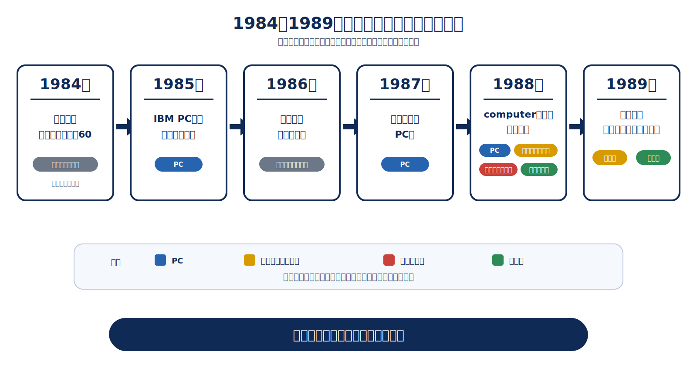
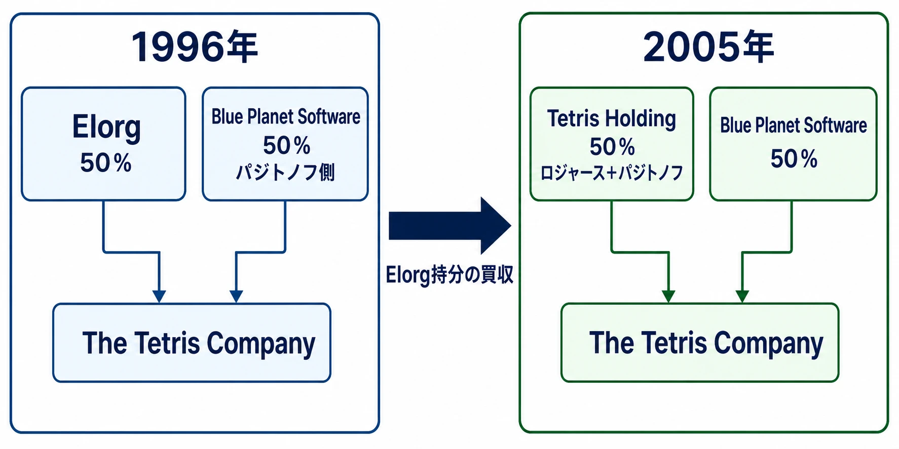
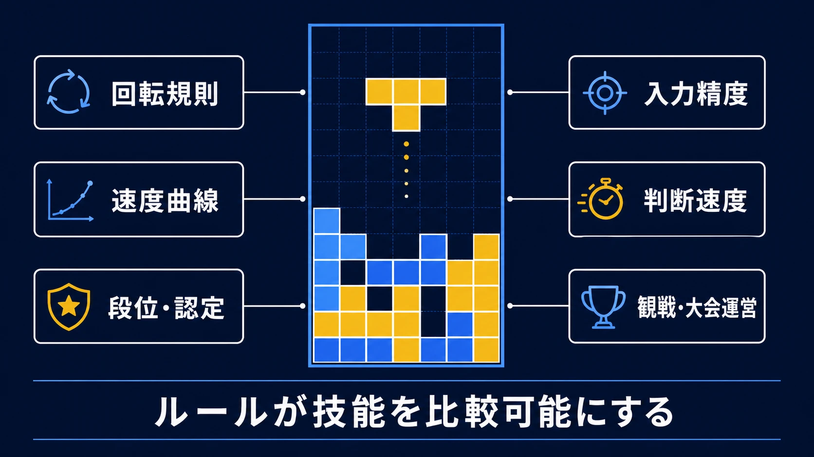
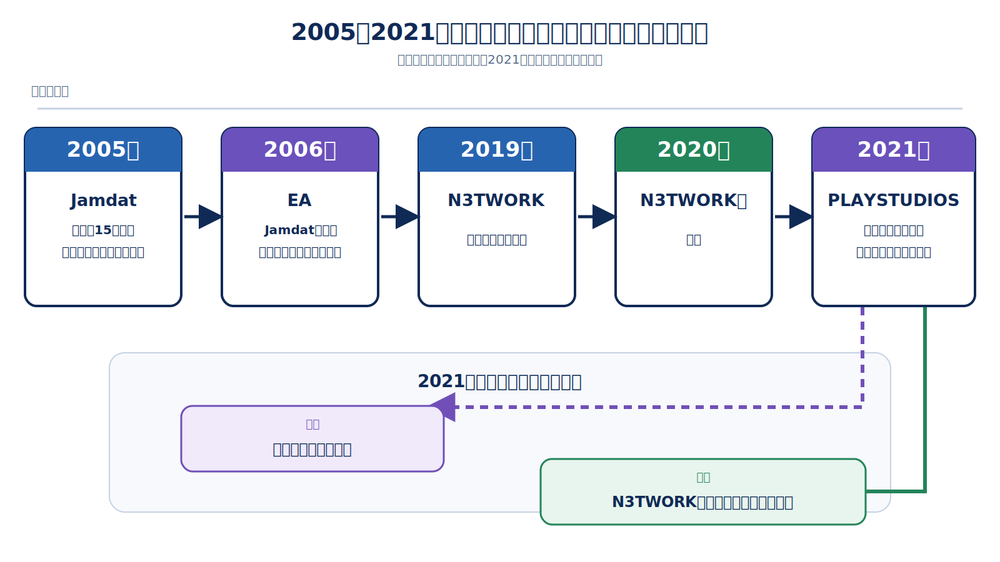

# 鉄のカーテンを越えたパズル――テトリスの誕生からeスポーツ化まで

## はじめに：映画の筋書きではなく、権利の履歴を読む

2023年公開のApple Original Films作品『テトリス』は、ヘンク・ロジャースを主人公に、冷戦末期のライセンス交渉をスリラーとして再構成した映画である。映画は実在の交渉を題材にするが、二時間のエンターテインメントとして脚色された作品でもある。[[1](#ref-1)]

本稿の目的は映画の真偽判定でも、アレクセイ・パジトノフやロジャースの人物評伝でもない。落下パズルとしてのテトリスが、ソ連の研究機関から各国のPC・家庭用ゲーム機・携帯機・モバイルへ移る間に、誰がどの媒体の権利を持ち、どの表現を守り、どのように競技として設計されていったのかを整理することである。

テトリス史は、単純な「発明者が世界へ売った」という直線ではない。ソ連の国家機関、契約に現れた媒体区分、サブライセンス、ブランド管理、競技ルールが重なる履歴である。当事者の後年の証言に依存する箇所は、証言であることを明示して扱う。

***

## 1. 1984年のモスクワ：四マスの落下パズル

テトリスの最初の版は、1984年にソ連科学アカデミー計算センターのエレクトロニカ60上で作られた。公式説明によれば、アレクセイ・パジトノフは子どもの頃から親しんだペントミノを着想に、四つの正方形から成る七種類のピースをリアルタイムに落下・配置するゲームへ変換した。「Tetris」という名称は、ギリシャ語で「四」を意味する *tetra* と、好んでいたテニスを組み合わせたものだとされる。[[2](#ref-2)]

エレクトロニカ60は文字ベースの端末であり、初期版ではブロックを文字で表す必要があった。後年のインタビューでパジトノフは、満たした行を消す発想を「画面に残しておく理由がなく、次のピースを置く空間が必要だった」と振り返っている。[[3](#ref-3)] ここで重要なのは、完成した視覚デザインより先に、落下、回転、隙間を残さず横一列を作る、消去して盤面に余地を戻す、という短い循環が成立した点である。

PC版への移植と普及には、ドミトリー・パブロフスキー、バジム・ゲラシモフが関わったとする後年の技術史資料がある。特にゲラシモフによるIBM PC向けのカラー版は、研究機関の端末から複製可能なPCソフトへとテトリスを移す役割を果たしたと整理されている。一次の契約文書が残りにくい初期工程であるため、ここでは協力者ごとの厳密な担当分界より、試験機版からPC版へ移った経路を押さえるべきである。[[4](#ref-4)]

### 設計上の核は「制約を更新し続ける」こと

テトリスはピースを消すゲームではなく、盤面の将来の選択肢を維持するゲームである。消去は得点演出であると同時に、置ける形の集合を回復する操作である。落下速度が上がれば、同じ七種のピースでも認知、入力、配置判断の猶予が削られる。この小さな状態遷移が、後に機種ごとに入力法や表示を変えても移植可能だった理由になる。

***

## 2. 鉄のカーテンを越える：複製と契約は別の速度で進んだ

1985年にはIBM PCへ移植され、フロッピーディスクの複製を通じてソ連国内へ急速に広がった。パジトノフ自身も、当時はソフトウェアを店頭で買う仕組みが乏しく、友人へ渡したコピーが広がったという趣旨を証言している。公式年表は1987年を北米・欧州のPC発売年としている。[[3](#ref-3)][[5](#ref-5)]

1986年ごろに東欧、とりわけハンガリー経由で西側の事業者がゲームを認知した経緯は、後年の取材や技術史に繰り返し現れる。しかし「西側へ渡った年」と「正規の商用PC版が発売された年」は同じではない。本稿では、1986年を交渉と非公式な拡散の入口、1987年を公式年表上の北米・欧州PC展開として区別する。

この時間差が、後の紛争の土台になった。ゲームのコピーは国境を越えて存在していた一方、ソ連側で海外ライセンスを扱う窓口と、媒体別の許諾範囲はまだ整理途上だったからである。プランナーがここから読むべきなのは、プロトタイプの流通と商品化権の帰属は別の問題だということである。遊べるビルドが海外にあることは、販売権の連鎖を証明しない。

***

## 3. ライセンス争奪戦：曖昧な「computer」が生んだ余白

ロバート・スタインのAndromeda Softwareは、ソ連の技術輸出機関Elorgとの交渉を進めた。しかし、後年の取材では、スタインはソ連側との正式契約を完了する前にPC版をMirrorsoftと、その米国側のSpectrum HoloByteへ売り込んだとされる。1988年春にElorgと結んだ契約も中心は「computer」権であり、アーケードと携帯機は明示的に除外されていた。[[6](#ref-6)]

MirrorsoftとSpectrum HoloByteの関係を理解するには、ロバート・マクスウェルが率いたMirror Groupの企業構造も無視できない。両社はPC版を市場へ出し、テトリスの認知を一気に広げた。しかし、販売を始めた事実と、全媒体の権利を持つ事実は一致しなかった。ここに、正規PC版の成功と、コンソール・アーケード・携帯機版の権利をめぐる争いが同時進行する構図が生まれた。

ロジャースは1988年のCESでテトリスを見つけ、日本での販売を求めた。本人の後年の説明では、Spectrum HoloByteから日本でのPC・コンソール流通に関する権利を得て、Bullet-Proof SoftwareからPC版とファミリーコンピュータ版を展開したという。これは「日本で売る」という事業上の入口であったが、ソ連側の原権利者がコンソールを許諾したことを意味しなかった。[[3](#ref-3)][[6](#ref-6)]

*図：テトリスの販売経路と、PC・家庭用・アーケード・携帯機という原権利の許諾範囲を分けて読むための年表。*

### 「媒体名」は機能名ではなく、契約上の定義である

争点は、テトリスのルールを誰が発明したかではなく、契約上の *computer* がどの装置までを指すかだった。家庭用ゲーム機にもプロセッサがあるという技術的な説明はできるが、契約実務では、PC、家庭用コンソール、アーケード、携帯機を別の市場・販売網・対価として切ることがある。Elorgが携帯機とアーケードを除外したという記録は、この区分が単なる言葉遊びではなく、交渉可能な商品単位だったことを示す。[[6](#ref-6)]

現代の契約でも同じである。「モバイル」「クラウド」「サブスクリプション」「ストリーミング対応機器」を慣用語だけで書けば、後から新しい流通形態が既存の区分に入るかが争点になる。対象機器、配信方法、地域、再許諾、将来技術への扱いを、定義と留保に落とす必要がある。

***

## 4. ゲームボーイという運命の組み合わせ

1989年、ロジャースは携帯機権を求めてモスクワのElorgへ直接交渉に向かった。本人の後年の証言では、まず携帯機の独占ライセンスを得て任天堂へ許諾し、約一か月後に任天堂の荒川實、ハワード・リンカーンとともにコンソール権を確保したという。[[3](#ref-3)]

この交渉で決定的だったのは、Elorg側がファミリーコンピュータ用カートリッジを見て、既存の「computer」契約が家庭用ゲーム機の許諾を含まないと認識した点である。映画的にいえば劇的な場面になりやすいが、実務的には成果物の実物が契約分類の不一致を可視化した場面である。誰が何を販売しているかを、カートリッジという媒体が証拠化したのである。[[6](#ref-6)]

任天堂はハードにゲームを同梱しない方針だった一方、Nintendo of Americaは北米版ゲームボーイにテトリスを同梱した。ロジャースは、マリオではなくテトリスを選ぶことで幅広い層へ訴求できると荒川實に説明したと振り返っている。公式年表はゲームボーイ版が3,500万本超を売ったと記す。ここで「携帯機権」と「コンソール・アーケード権」を分けて確保したことは、単に訴訟リスクを避けた以上の意味を持った。携帯端末の短い空き時間、十字ボタン、画面の制約、誰にでも説明できるルールが、北米での同梱という流通設計と噛み合ったのである。[[3](#ref-3)][[5](#ref-5)]

ただし、「ゲームボーイがテトリスを成功させた」あるいは「テトリスがゲームボーイを成功させた」という一文だけでは設計判断を見落とす。前者はハードの到達範囲、後者はソフトの普遍性を示す。実際の成功は、適合するゲーム設計、権利の確定、北米での同梱による標準搭載、地域ごとの販売網が同時に成立した結果である。

***

## 5. 権利を集約し、ブランドを維持する

パジトノフの説明によれば、ソ連科学アカデミー計算センターを通じた海外利用の取り決めは10年で、1995年に終わった。ソ連崩壊後、Elorgは国家機関ではなくなっており、商標・著作権登録と原作者の権利主張が再び交差した。本人は、権利が戻った時点でElorgも権利を主張するだろうと考え、ロジャースに支援を求めたと述べている。これは当事者の回想であり、個別契約の全条項を公開する一次資料ではない点に注意が必要である。[[3](#ref-3)]

1996年、パジトノフ側とロジャースのBlue Planet Software、Elorgの間でThe Tetris Companyが設立され、ライセンスの窓口が一本化された。ロジャースの2009年インタビューによれば、設立時のThe Tetris CompanyはElorgとBlue Planet Softwareが50対50で保有する共同事業で、パジトノフはBlue Planet側にいた。したがって「二人が直ちに全権利を対等出資で保有した」と単純化するより、原作者側と事業運営側がElorgと対等な持分構造を組んだ、と読むのが正確である。[[7](#ref-7)]

公式年表は同社を「テトリスの全ライセンスの唯一の供給元」と位置づけ、同年に品質・一貫性のためのTetris Guidelinesを作ったとしている。これはロイヤリティの受け皿を作るだけでなく、どの製品を「公式のテトリス」として出すかを管理する仕組みでもあった。パジトノフが継続的にロイヤリティを得る体制に至った経路は、発明の評価が遅れて支払われた美談ではなく、契約満了後に権利、登録、ライセンス窓口を再編した結果として理解すべきである。[[5](#ref-5)][[7](#ref-7)]

2005年にはロジャースがElorgの持分を買い取り、パジトノフとTetris Holdingを作ったと本人が説明している。現在も公式サイトの権利表記は、Tetris Holdingが商標・トレードドレス等を保有し、The Tetris Companyに許諾する構造を示す。権利の帰属と日々のライセンス運用を分けることが、長期IPでは重要になる。[[7](#ref-7)][[2](#ref-2)]

*図：ElorgとBlue Planet Softwareの共同事業から、Elorg持分の買収後の持分構造へ移った流れ。*

***

## 6. クローン訴訟：ルールではなく、表現と識別を守る

1990年代末以降、The Tetris Companyはフリーウェアやシェアウェアを含む無許諾クローンに削除要請を行ってきた。だが、ここで注意すべきは「落下するブロックを並べ、行を消す」という抽象的なゲームルールそのものが自動的に独占されるわけではないことだ。著作権法はアイデア、手続、方法そのものを保護対象から外すという原則を持つ。[[8](#ref-8)]

境界を具体化したのが、2012年の *Tetris Holding, LLC v. Xio Interactive, Inc.* である。iPhone向けクローン『Mino』をめぐり、被告Xioは、ルールや機能のような保護されない要素だけを注意深く写したと主張した。裁判所は原告の請求を認め、被告側の反対請求を退けた。判決は、保護の対象を一般的なゲーム概念ではなく、テトリミノの形と配置、プレイフィールド、ピースの動き・回転、表示の組み合わせといった視覚的表現の全体として検討している。[[8](#ref-8)]

これは「テトリミノを使うゲームはすべて違法」という判決ではない。むしろ、ゲームデザインの発想と、その発想を特定の視覚・画面構成・ブランド識別として実装した表現を分けて考えよ、という実務上の教材である。裁判所自身も、著作権はアイデアではなく表現を保護すると確認している。[[8](#ref-8)]

ライセンス契約は、その境界をさらに運用可能な仕様に変える。2005年の公開契約文書には、Tetris Design Guidelinesへの適合、モバイル端末に限る独占許諾、既存ライセンスの留保、再許諾の条件が明記されている。IP防衛は訴訟だけで完結しない。何を公式製品に含めるかを定義し、承認、品質、媒体、再許諾、終了後の扱いを契約で管理して初めて、ブランドの一貫性を維持できる。[[9](#ref-9)]

***

## 7. eスポーツとしてのテトリス：TGMと競技の可視化

テトリスの競技性は、対人戦の有無だけでは決まらない。高速落下で正確に積む操作、回転規則、猶予時間、得点、段位、リプレイ可能な課題が、上達を比較できる形式へ変える。

1995年に、カプコンを退社した西谷亮が設立したアリカは、1998年にアーケード向け『テトリス ザ・グランドマスター』を発表した。アリカの会社情報は、同社の設立を1995年11月1日、西谷のカプコン退社と同年の設立を記す。公式製品ページは本作を1998年のアリカ製アーケード作品とし、速度、正確さ、技術を分析する19段階のランク認定システムを特徴として挙げる。単に長く生き残るだけでなく、プレーの質を段位として返す設計が入ったことで、プレイヤーは自分の到達点と改善対象を共有できるようになった。[[10](#ref-10)][[11](#ref-11)]

TGM系では、壁際での回転時に位置を補正するウォールキック、落下・接地の扱い、段位認定、速度曲線が、積み方だけではない技術差を生む。これらは「難しくする追加要素」ではない。高速時に成立する回転の範囲を定め、失敗の原因を入力、判断、ルール理解へ分解するための競技規則である。アリカの三原一郎は後年の公式インタビューで、ライトユーザーとヘビーユーザーをともに満足させることを基本方針に挙げ、通信対戦では特にラグが難題になるとも語っている。競技性を求めるほど、ネットワーク遅延、判定、モード目的を仕様として扱う必要がある。[[12](#ref-12)]

一方、海外では2010年にClassic Tetris World Championship（CTWC）が始まり、初代の世界王者が決まった。CTWCはクラシックなNES版を競技基盤にした大会で、現在は世界各地のライブイベントとオンライン番組を持つと主催者は説明する。TGMが高速プレーと段位を通じて「何を熟練と呼ぶか」を体系化したのに対し、CTWCは既存のクラシック版を共通ルールとして観戦・大会運営に載せた。両者は同じ一つの競技シーンではないが、テトリスを個人のスコアアタックから比較可能なパフォーマンスへ変えた点で連続している。[[13](#ref-13)]

*図：回転規則、速度曲線、段位・認定、入力精度、判断速度、観戦・大会運営が、競技として比較可能な技能を形作る。*

***

## 8. 現代のテトリス：媒体は増え、ライセンスは動き続ける

2019年2月、任天堂はNintendo Switch Online加入者向けに『TETRIS 99』を配信した。99人が同時に戦い、ライン消去で相手を攻撃し、標的選択とK.O.バッジで攻撃力が変化する設計は、単独プレーの盤面管理をバトルロイヤルのターゲティングへ接続したものだ。テトリスの核を保ったまま、対戦の情報設計を足している。[[14](#ref-14)]

モバイルでは、EAが2006年にJamdat買収を通じて独占ライセンシーとなり、2005年のJamdatによる15年の世界的ライセンス取得という経緯が公式年表にある。その後、2019年にN3TWORKとの新たな提携が公表され、N3TWORK版は2020年初頭に導入された。さらに2021年、PLAYSTUDIOSはThe Tetris CompanyとN3TWORKとの提携を通じ、中国を除く世界の複数タイトル向けモバイル独占権を引き受けたと発表した。[[5](#ref-5)][[15](#ref-15)]

このEA→N3TWORK→PLAYSTUDIOSという変遷は、古いライセンス争奪戦の繰り返しではない。スマートフォンという一つの端末群でも、契約期間、地域除外、開発・運営権、既存アプリの引継ぎ、ロイヤリティが分けて設計されることを示している。実際、PLAYSTUDIOSの発表は「中国を除く」世界権とし、N3TWORKの既存プロダクトを運営・発展させると明記した。媒体名だけでは、許諾範囲を読み切れない。[[15](#ref-15)]

*図：Jamdat、EA、N3TWORK、PLAYSTUDIOSへ続くモバイル・ライセンスの変遷。地域除外と既存プロダクトの継承も契約条件として残る。*

***

## 終章：プランナーが持ち帰る三つの示唆

テトリス史は、シンプルなメカニクスが長寿であることと、権利処理が単純であることは別だと教える。

- **媒体区分を事業の単位として書く**：携帯機、コンソール、PC、モバイルを技術名ではなく、対象デバイス、流通、地域、配信方法、再許諾の可否まで含む契約上の定義にする。将来の媒体を想定できないなら、包括語を置くだけでなく、留保と協議手順を設ける。
- **曖昧さを「後で解釈すればよい」としない**：初期テトリスの争いは、販売の勢いより早く権利が確定しなかったことで拡大した。プロトタイプ、デモ、移植版、商品版のどれに何の権利が付くかを、公開前に台帳化する。
- **核を守り、周辺を設計し直す**：四マスの落下と行消去は、北米版ゲームボーイでの同梱、段位認定、高速ルール、99人対戦、モバイル運営へ移っても残った。長寿IPでは、変更できないコアと、機種・観戦・運営に合わせて変更する外縁を分けることが重要である。

テトリスは一つのゲームであると同時に、媒体別ライセンス、IP防衛、競技規則、流通設計が四十年以上にわたり積み重なった事例である。盤面に隙間を残さないように、権利と仕様の隙間もまた、発売前に埋めなければならない。

## References

1. [Tetris — Apple TV+](https://tv.apple.com/jp/movie/%E3%83%86%E3%83%88%E3%83%AA%E3%82%B9/umc.cmc.1vk9ef4y6k1l83g8f7l6f9x0m) - 2023年の映画作品の公式ページ。本稿が映画ではなく権利史を扱う対象との差分を示す。

2. [About Tetris ｜ Tetris](https://tetris.com/about) - 1984年の起源、ペントミノ、名称の由来、現在の権利表記。

3. [Tetris at 30: An Interview with the Historic Puzzle Game’s Creator ｜ TIME](https://time.com/2837390/tetris-at-30-pajitnov-interview/) - パジトノフとロジャースへのインタビュー。初期の複製、10年の取り決め、1989年の交渉、および任天堂とNintendo of Americaで異なるゲームボーイ同梱方針に関する当事者証言。

4. [Tetrisの初期PC移植に関する研究資料 ｜ Aalto University](https://aaltodoc.aalto.fi/server/api/core/bitstreams/97bc6a50-fae6-4420-8284-8b835ad77e02/content) - パブロフスキー、ゲラシモフ、IBM PC版に関する後年の学術資料。

5. [The History of Tetris ｜ Tetris](https://tetris.com/news/the-history-of-tetris) - 公式年表。1985年PC移植、1987年のPC展開、1989年のゲームボーイ版と販売本数、1996年の会社設立、モバイル史。

6. [The Complicated True Story Behind Apple TV+’s Tetris Movie ｜ TIME](https://time.com/6266810/tetris-movie-apple-tv-true-story/) - スタイン、Elorg、Mirrorsoft、Spectrum HoloByte、媒体別の許諾範囲を整理した専門メディア記事。

7. [The Man Who Won Tetris ｜ Game Developer](https://www.gamedeveloper.com/business/the-man-who-won-tetris) - ロジャースへのインタビュー。1996年のThe Tetris Companyの持分構造と2005年の再編に関する当事者説明。

8. [Tetris Holding, LLC et al. v. Xio Interactive, Inc. ｜ U.S. District Court, D.N.J.](https://www.govinfo.gov/content/pkg/USCOURTS-njd-3_09-cv-06115/pdf/USCOURTS-njd-3_09-cv-06115-0.pdf) - 2012年の判決本文。著作権、トレードドレス、アイデアと表現の区別。

9. [Tetris mobile license agreement exhibit ｜ U.S. SEC](https://www.sec.gov/Archives/edgar/data/1135271/000110465905017589/a05-7063_1ex10d27.htm) - Tetris Design Guidelines、モバイル端末向け許諾、既存契約の留保、再許諾条件を確認できる公開契約資料。

10. [会社概要 ｜ アリカ](https://www.arika.co.jp/company/company.html) - 西谷亮のカプコン退社、1995年のアリカ設立、三原一郎の役職を示す公式会社情報。

11. [Tetris: The Grand Master ｜ Tetris](https://tetris.com/products/video-game/tetris-the-grand-master) - 1998年のアリカ製アーケード作品とランク認定システムの公式説明。

12. [『テトリス』スペシャルインタビュー（その3） ｜ アリカ](https://www.arika.co.jp/special/special_interview/inter_tap/inter_tap03.html) - 三原一郎によるTGM系の設計方針、通信対戦と遅延に関する公式インタビュー。

13. [History ｜ Classic Tetris World Championship](https://thectwc.com/history/) - 2010年開始のCTWCと現在の大会運営に関する主催者情報。

14. [TETRIS 99 ｜ 任天堂](https://www.nintendo.com/jp/switch/arzna/index.html) - 99人対戦、標的選択、Nintendo Switch Online向けの配信開始日を示す公式ページ。

15. [PLAYSTUDIOS Secures Exclusive Rights to Tetris Franchise for Mobile Devices](https://ir.playstudios.com/news-events/press-releases/detail/37/playstudios-secures-exclusive-rights-to-tetris-franchise) - 2021年のモバイル権引継ぎ、地域除外、既存プロダクト運営を示す公式発表。

----

この文書は、Perplexity、Claude、OpenAI Codex の3つのAIの支援を受けて著述されたものです。引用画像を除き、MIT License にて提供されています。
