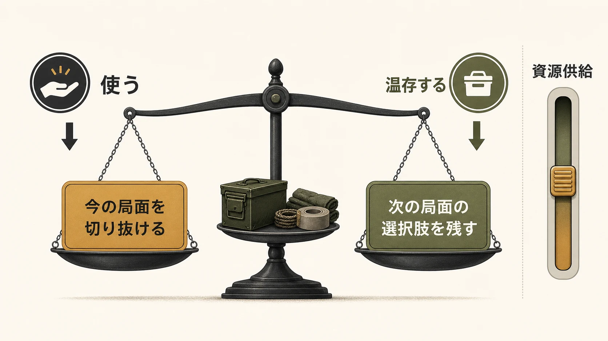

# 『The Last of Us』は、なぜ「生き残る判断」を手放させないのか
## 資源経済、遭遇、敵AI、エリーのコンパニオンAIから読むPS3版の核設計

***

## はじめに：二人の旅を、操作の連続へ置き換えた作品

『The Last of Us』は、Naughty Dogが開発し、Sony Computer EntertainmentがPlayStation 3向けに2013年6月14日に発売したアクションアドベンチャーである。[[1](#ref-1)][[2](#ref-2)] 舞台は、コーディセプス変異菌のパンデミックによって文明が大きく変わってから約20年後の北米だ。感染者と武装した人間集団が生存者を脅かすなか、過去に深い傷を抱えるジョエルは、14歳のエリーを軍の隔離区域から連れ出す仕事を引き受ける。小さな運び屋の仕事は、荒廃したアメリカを横断する過酷な旅へ変わっていく。[[1](#ref-1)]

この設定だけなら、感染者が登場する終末後の物語として受け取れる。しかし、Naughty Dogが置いた中心は感染の原因を解くことではなく、ジョエルとエリーの関係が変わる旅であった。発売前のインタビューでクリエイティブディレクターのNeil Druckmannは、世界と病気を調べながらも、焦点は二人の関係と旅にあると説明している。[[3](#ref-3)]

評価の面でも本作は強い到達点を示した。第17回D.I.C.E. Awardsでは13部門にノミネートされ、Game of the Yearを含む10部門を受賞した。[[4](#ref-4)][[5](#ref-5)] BAFTA Games Awards 2014では10部門にノミネートされ、Best Gameを含む5部門を受賞している。[[6](#ref-6)][[7](#ref-7)] Naughty Dogは2014年3月、全世界累計600万本突破も公表した。[[8](#ref-8)]

こうした評価を物語や映像だけへ還元すると、遊んでいる最中に生じる緊張の設計が見えにくい。本作のシングルプレイは、弾を使うか、隠れるか、敵をどこまで見てよいか、同行者をどこまで現実らしく振る舞わせるかという小さな選択を連続させる。その選択の積み重ねが、ジョエルとエリーが簡単には前へ進めない世界を、プレイヤーの手元に作る。

本稿はPS3版『The Last of Us』のシングルプレイに対象を絞る。後年のリマスター／リメイクの技術的差分、Part IIのアクセシビリティ、マルチプレイ「Factions」は扱わない。

***

## 1. 資源経済は、攻撃を「いつ使うか」の判断へ変える

本作では弾薬、回復用の物資、火炎瓶や爆弾に使う素材が、探索中に拾う有限の資源として置かれる。公式のプレイレポートも、少ない弾薬が一つひとつの判断へ緊張を与え、部品や素材を集めて装備を作る際にも、限られた資源をどこへ配分するかを問うと説明している。[[9](#ref-9)]

ここで重要なのは、希少性が単に「弾を少なくする」数値調整ではないことである。1発を撃つとき、プレイヤーは現在の敵を確実に減らす効果と、次の遭遇で使える選択肢を失う効果を同時に引き受ける。素材を即席の回復に使えば、次に使える攻撃道具は作れない。資源は所持品であると同時に、将来の局面に残す手段の束である。

そのため、同じ敵を前にしても答えは一つにならない。見つからずに通過する、背後から一人ずつ倒す、投擲物で場所を動かす、銃撃で短期決着を狙う。選んだ行為の価値は敵の数だけでなく、現在の残弾、素材の組み合わせ、次に何があるか分からない不確実性で変わる。射撃の照準精度だけではなく、使わずに済ませる判断も上達として残る。

### 難易度は、敵の強さだけでなく「先送りできる余力」を調整する

難易度設計は敵の体力や攻撃力に目が向きやすい。本作の系譜では、資源の供給量も緊張を作る調整対象である。『The Last of Us Part I』の公式説明は、資源難易度が世界で見つかる弾薬・物資の量、敵が落とす弾薬の量、仲間から受け取る物資や弾薬の頻度を調整すると明記している。[[10](#ref-10)]

PS3版を分析する際も、具体的なドロップ確率を推測する必要はない。供給を絞れば、プレイヤーが「ここで銃を使っても次へ進める」と確信できる局面は減る。反対に供給が多ければ、探索とクラフトは攻める手段を選び直すための余裕になる。敵の強さを同じに保っても、資源の見通しを変えるだけで、同じ遭遇は慎重な潜入にも、即興的な戦闘にも近づく。

プランナーが資源量を調整するときは、平均所持数だけを追うべきではない。「有効な手段が一つしかない時間」をどの程度作るかを見る必要がある。完全に枯渇させれば、選択は消える。十分に余らせれば、温存の理由が消える。本作が置くのは、撃てはするが撃ち切れない、作れはするが全種類は作れないという帯域である。

*図：資源経済は、現在の局面を切り抜ける効果と、次の局面の選択肢を残すことの間に判断を作る。資源供給の調整は、このトレードオフの重さを変える。*

***

## 2. ステルスと戦闘は、同じ遭遇を異なる読み方へ開く

本作の戦闘空間には、遮蔽物、迂回路、投擲できる物、敵の視線と配置が同じ場所に置かれ、プレイヤーは状況に応じて隠密と戦闘を行き来する。PlayStation.Blogが発売前に「シューターではない」と表現したのは、射撃の頻度ではなく、射撃を万能な正解にしない構造を指している。[[9](#ref-9)]

この往還を支える一つがリスニングモードである。周囲の敵の位置を把握できる情報は、闇雲な待機を減らし、迂回、待ち伏せ、投擲、静かな排除といった計画を立てる材料になる。

リスニングモードは、正解を教えるナビゲーションではない。敵の存在とおおよその関係を見せる代わりに、遮蔽物をどうつなぐか、誰から処理するか、発見後にどこへ退くかはプレイヤーに残す。情報を少し与えることで、失敗が「敵が見えなかった」だけにならず、「見えていた状況をどう読んだか」に移る。

### 発見は失敗の終点ではなく、戦術の状態遷移である

ステルスを唯一の正解にすると、発見はリトライの合図になる。反対に戦闘だけを正解にすると、物陰や敵の巡回は飾りになる。本作は発見の前後で、資源の価値と空間の価値を組み替える。潜入中は遮蔽物と視線の切れ目が主な資源であり、発見後は弾薬、投擲物、退路、近接攻撃の機会が前に出る。

この設計の肝は、両方を等価にすることではない。戦闘になれば弾薬を失いやすく、消耗すれば次の局面の選択肢も減る。そのコストがあるから、潜入は安全な演出ではなく、資源経済と結び付いた戦略になる。一方で、潜入が崩れた瞬間にも立て直せるため、偶発的な発見が即座に体験の中断へ変わらない。

遭遇を設計する際には、攻略ルートを一つ作るより先に、少なくとも三つを確認するとよい。敵を避ける経路、静かに人数を減らす経路、発見後に退避と反撃をつなぐ経路である。それぞれが同じ資源を異なる速度で消費するなら、プレイヤーの選択は操作の好みだけでなく、次の局面へ持ち越す余力の選択になる。

***

## 3. 感染者と人間は、異なる知覚モデルで恐怖の質を分ける

敵AIは、強さだけでなく知覚のあり方によっても性格が変わる。何を見て、何を聞き、どのように追うかは、プレイヤーに何を恐れさせるかを決める。本作では感染者と人間の敵対集団が同じ空間で異なる圧力を持つ。Travis McIntoshがNaughty DogのリードプログラマーとしてGDC 2014で行った「The Last of Us: Human Enemy AI」は、人間敵AIについて、ナビゲーション、リアルタイムのレベル分析、戦闘、捜索、ステルスの意思決定を扱った講演である。[[11](#ref-11)]

### 感染者は、接近の恐怖を身体へ寄せる

感染者には、走って接近するランナーと、クリック音を用いるクリッカーがいる。公式のシリーズ紹介は、感染者が音、視覚、反響定位によって未感染者を検知し、感染段階ごとに性質が異なると説明している。[[12](#ref-12)]

この知覚モデルは、ホラーの恐怖を「距離が破られる恐怖」として作る。ランナーの勢いは、発見された後に安全な照準時間を奪う。クリッカーの反響定位は、見えていることよりも音を立てないこと、近寄らせないことへ注意を移す。プレイヤーは敵の残り体力を削るより先に、音、距離、通路幅、逃げ場を読む。

ここで感染者のAIは、人間のように賢く戦術を変える存在である必要はない。予測できる感覚規則と、近接されたときの大きな損失があれば、プレイヤーは自分の身体が置かれた場所へ強く意識を向ける。ホラーに必要なのは、複雑な意思決定を見せることより、近づかせてはいけない境界を明確にすることである。

### 人間の敵は、見られ、探され、囲まれる不安を作る

人間の敵は、遮蔽物を使い、捜索し、戦闘とステルスに応じた振る舞いを持つ。McIntoshの講演が人間敵AIを独立して扱ったこと自体が、本作で人間の遭遇が単なる射撃対象ではなく、空間を分析してプレイヤーを追い詰める仕組みとして設計されたことを示している。[[11](#ref-11)]

人間がもたらすのは、感染者とは異なるスリラーの恐怖である。相手も遮蔽物を使い、こちらを探し、射線を通そうとする。プレイヤーは音を避けるだけでなく、「最後に見られた場所」からどの経路を警戒されるかを考える。リスニングモードで得た位置情報も、人間敵では包囲を避ける判断に直結する。

同じ作品のなかで知覚モデルを分ける利点は、敵の見た目を変えるだけでは得られない。感染者の場では距離と音が中心になる。人間の場では視線、射線、捜索、側面が中心になる。プレイヤーの入力は似ていても、先に読むべき情報が変わるため、恐怖の質が単調にならない。

| 敵の層 | 主に読ませる情報 | 生まれる恐怖 | プレイヤーに残る判断 |
| --- | --- | --- | --- |
| 感染者 | 音、距離、接近経路、狭い通路 | 近接されること、逃げ場を失うこと | 音を抑える、近寄らせない、退路を先に取る |
| 人間の敵 | 視線、射線、捜索範囲、遮蔽物 | 見つけられること、囲まれること | 側面を取る、最後に見られた場所から離れる、戦闘と潜入を切り替える |

***

## 4. エリーのAIは、現実らしさよりも関係を壊さないことを選んだ

ジョエルとエリーの旅をゲームプレイで成立させるには、エリーが画面内にいて、移動し、ときに戦いへ関わる必要がある。しかし、同行者が狭い通路で立ち止まる、敵の前へ出て潜入を失敗させる、頻繁に助けを求めるなら、プレイヤーは物語上の相棒を障害物として認識する。二人の関係を中心に置く作品には、致命的なねじれである。

Naughty DogのエンジニアであるMax Dyckhoffは、GDC 2014の「Ellie: Buddy AI in The Last of Us」で、この問題を扱った。講演内容を収録した論文は、開発終盤まで敵が同行者を視認できる構成を試していたが、潜入中の同行者を敵NPCから不可視にする判断へ至ったと説明する。同行者が一度でもプレイヤーの位置を露呈させれば、プレイヤーとの絆が損なわれることを避けるためである。[[13](#ref-13)]

### 「見えない」はごまかしではなく、責任の所在を揃える設計である

敵から見えないエリーは、画面上では不自然に見える瞬間を持ち得る。それでも、この例外はプレイヤーの責任範囲を明確にする。潜入の成否は、ジョエルをどこへ動かし、どの音を出し、どの敵を警戒したかによって決まる。エリーの経路探索の偶然で失敗するなら、プレイヤーは自分の判断を改善できない。

ここで不可視化は、同行者を消すための処理ではない。エリーは会話、移動、戦闘への参加によって、ジョエルのそばにいることを見せ続ける。ただし、潜入の判定へ入る主体からは外す。画面の存在感とゲーム上の責任を分離することで、「隣にいる相棒」と「自分の選択の結果」を両立させている。

コンパニオンAIの評価を、敵に見つからない確率だけで行うと、この判断は後退に見える。だが、評価軸は現実再現だけではない。同行者がプレイヤーの意図を支え、物語上の関係を損なわず、失敗の理由を理解できることまで含める必要がある。本作は、完全なシミュレーションよりも、プレイヤーがエリーを信頼できることを優先した。

### コンパニオンAIの仕様は、三つの責任を分けて書く

相棒を設計するときは、「どのように動くか」だけでは仕様が足りない。少なくとも次の三つを分けると、例外規則の目的を共有しやすい。

| 責任 | エリーに求められること | 失敗した場合の問題 |
| --- | --- | --- |
| 画面上の存在 | 会話し、ジョエルに追従し、旅を共にしていると感じさせる | 相棒が背景へ退き、物語と操作が分離する |
| 戦闘上の支援 | 必要な場面で参加し、プレイヤーが孤立していないと感じさせる | 相棒が無力、または主役を奪う存在になる |
| 潜入の責任 | プレイヤーの選択を不意に無効化しない | 理解不能な失敗が続き、相棒への信頼が敵意に変わる |

不可視化は三つ目の責任を守る例外である。この例外を最初から前提にするのではなく、まずは自然な追従、位置取り、敵の誘導を試し、それでもプレイヤーの意図を守れない箇所に限定して用いる。Dyckhoffの講演が示すのは、AIの賢さを競うより、プレイヤーと同行者の関係がどの失敗で壊れるかを先に定義する重要性である。

***

## おわりに：制約を積み上げ、旅の重さをプレイヤーへ渡す

『The Last of Us』のシングルプレイは、資源経済、遭遇設計、二層の敵AI、エリーのコンパニオンAIという複数の仕組みが積み重なって成立している。資源経済は「いま撃つ」ことへ将来の代価を与える。遭遇は潜入と戦闘の間を行き来させ、発見後にも判断を残す。感染者と人間は異なる知覚モデルで、近接の恐怖と捜索される不安を描き分ける。エリーのAIは、現実らしい判定を一部手放すことで、プレイヤーの潜入の意図と二人の関係を守る。

四つの仕組みに共通するのは、プレイヤーから判断を奪わず、判断を成立させない不条理だけをゲーム側が引き受ける姿勢である。弾薬をすべて補充しない。攻略手順も固定しない。敵の知覚は恐怖の種類ごとに変える。しかし、同行者の偶発的な失敗で選択を無意味にはしない。

ゲームプランナーが持ち帰るべき問いは、「どれだけ現実らしくするか」だけではない。各制約は、プレイヤーにどの判断を残し、どの失敗を自分の選択として受け止められるようにするか。この境界を資源、遭遇、AIのそれぞれで揃えられたとき、物語上の過酷な旅は、眺めるものではなく、自分で生き残ったものとして記憶される。

## References

1. [The Last of Us special editions showcased in new trailers][1] - PlayStation.Blog、2013年5月1日。発売日、舞台、ジョエルとエリーの旅の概要。

2. [The Last of Us Multiplayer Revealed][2] - PlayStation.Blog、2013年6月4日。世界同時発売日の告知。

3. [The Last of Us – Neil Druckmann on Creating a Future Classic][3] - PlayStation.Blog、2013年6月7日。世界設定の調査と、ジョエルとエリーの旅を中心に置く方針。

4. [The Last of Us wins DICE awards game of the year][4] - GameSpot、2014年2月6日。第17回D.I.C.E. AwardsのGame of the Year受賞。

5. [The Last of Us honored with 10 awards including Game of the Year at 17th Annual D.I.C.E. Awards][5] - Academy of Interactive Arts & Sciences、2014年2月6日。受賞10部門の公式発表。

6. [Nominations Announced: British Academy Games Awards in 2014][6] - BAFTA、2014年2月12日。10部門ノミネートの公式発表。

7. [British Academy Games Awards in 2014 Winners Announced][7] - BAFTA、2014年3月12日。Best Gameを含む5部門受賞の公式発表。

8. [The Last of Us passes 6 million sales][8] - Naughty Dog／PlayStation.Blog、2014年3月14日。全世界累計600万本突破の発表。

9. [Hands-On With The Last of Us][9] - PlayStation.Blog、2013年2月6日。弾薬・素材の希少性、クラフト、探索と戦闘の紹介。

10. [The Last of Us Part I: full list of accessibility features][10] - PlayStation.Blog、2022年8月26日。難易度のResources項目が調整する供給要素。

11. [The Last of Us: Human Enemy AI][11] - Travis McIntosh（Naughty Dog）、GDC 2014。人間敵AIの意思決定、ナビゲーション、レベル分析、戦闘、捜索、ステルスの講演概要。

12. [Discover The Last of Us][12] - PlayStation。感染者の段階と、音・視覚・反響定位による検知の公式紹介。

13. [Ellie: Buddy AI in The Last of Us][13] - Max Dyckhoff（Naughty Dog）、Game AI Pro 2、2015年。コンパニオンAI、潜入中の不可視化、関係性を守る設計の解説。

[1]: https://blog.playstation.com/archive/2013/05/01/the-last-of-us-special-editions-showcased-in-new-trailers/
[2]: https://blog.playstation.com/2013/06/04/the-last-of-us-multiplayer-revealed/
[3]: https://blog.playstation.com/2013/06/07/the-last-of-us-neil-druckmann-on-creating-a-future-classic/
[4]: https://www.gamespot.com/articles/the-last-of-us-wins-dice-awards-game-of-the-year/1100-6417582/
[5]: https://www.interactive.org/news/17th_annual_dice_awards_winners.asp
[6]: https://www.bafta.org/media-centre/press-releases/nominations-announced-british-academy-games-awards-in-2014/
[7]: https://www.bafta.org/media-centre/press-releases/british-academy-games-awards-in-2014-winners-announced/
[8]: https://blog.playstation.com/archive/2014/03/14/last-us-passes-6-million-sales
[9]: https://blog.playstation.com/2013/02/06/hands-on-with-the-last-of-us/
[10]: https://blog.playstation.com/2022/08/26/the-last-of-us-part-i-full-list-of-accessibility-features/
[11]: https://www.gdcvault.com/play/1020338/The-Last-of-Us-Human
[12]: https://www.playstation.com/en-us/the-last-of-us/
[13]: https://www.gameaipro.com/GameAIPro2/GameAIPro2_Chapter35_Ellie_Buddy_AI_in_The_Last_of_Us.pdf

----

この文書は、Perplexity、Claude、OpenAI Codex の3つのAIの支援を受けて著述されたものです。引用画像を除き、MIT License にて提供されています。
