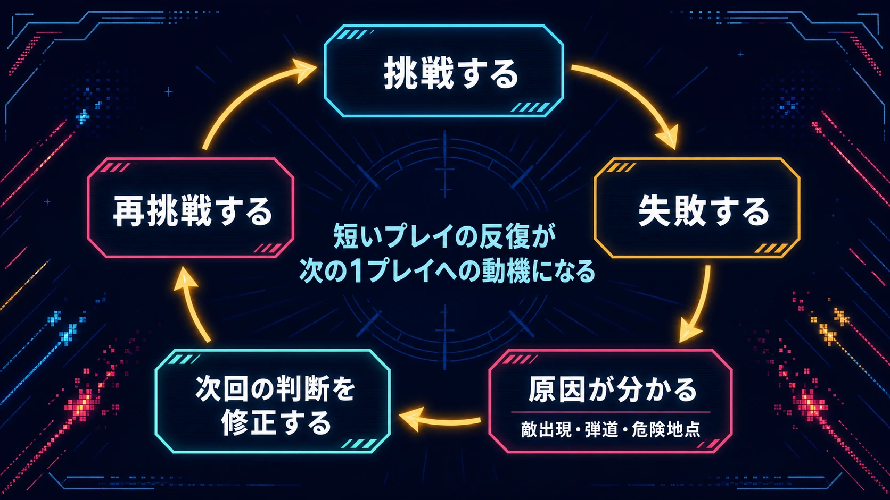
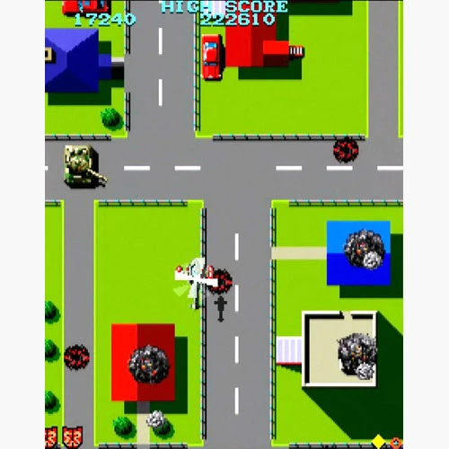
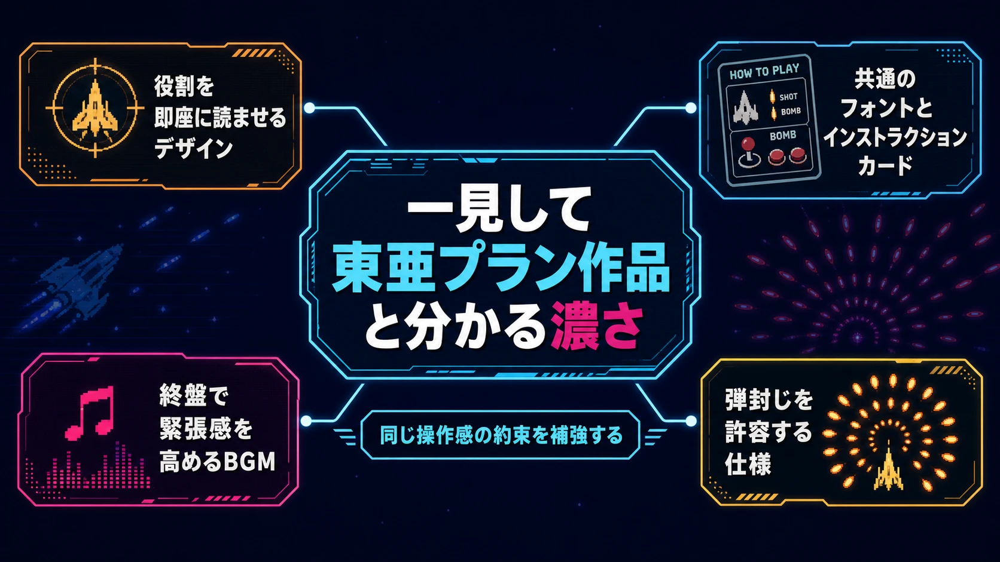
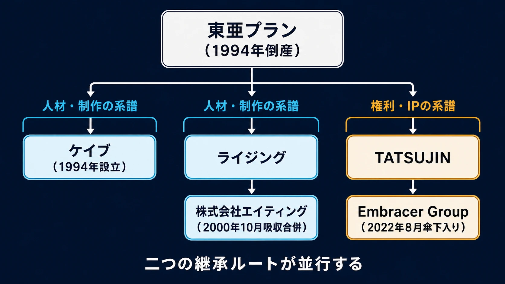
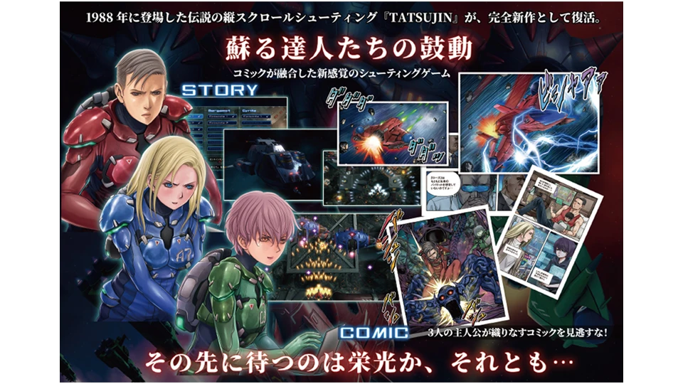

# 東亜プランの企業史：消えた組織から、複数のシューティング設計文化が生まれるまで

## はじめに：会社は消えても、設計文化は消えなかった

東亜プランは、1980年代から1990年代前半のアーケードゲームで、縦スクロールシューティングを主力にした開発会社である。『タイガーヘリ』『究極TIGER』『TATSUJIN』『達人王』『BATSUGUN』などを送り出し、短い操作系で強い緊張感と上達の手応えを作った。現在の権利管理会社TATSUJINも、これらを含む25作品を現行環境向けのアプリとして扱っている。[[1](#ref-1)]

東亜プランは1994年に倒産した。だが、この出来事を「名門メーカーが一社なくなった」という一点で終わらせると、後史を取り逃がす。スタッフは離散し、ケイブ、ライジング、タクミコーポレーション、ガゼルなど、複数の開発会社と制作チームへ分かれた。各々は同じ作品の続編を作ったのではない。弾の密度、難度の見せ方、スコア、演出、家庭用への展開に別々の重心を置き、東亜プランで培った「撃って避ける」設計を更新したのである。

本稿の主題は、組織が消滅しても設計文化は人を通じて生き延びうる、という構造にある。弾幕シューティングというジャンル全体の歴史ではなく、東亜プランという一社が、どのように設計の型を作り、何を抱えたまま市場変化に直面し、なぜ複数の答えへ分岐したのかを、ゲームプランナーの視点から読む。

***

## 1. 確立期：「撃って避ける」を学習可能にする

1985年稼働の『タイガーヘリ』は、縦画面・縦スクロール、レバーとショット／ボンバーの2ボタンで構成された作品である。[[2](#ref-2)] ルールの入口は簡潔だが、プレイの中身は単純な連射ではない。敵を早く破壊して安全な空間を作り、危険な局面ではボンバーという限られた資源を切る。プレイヤーは失敗しても、次回に「どの敵を先に倒すか」「どこでボムを使うか」を一つずつ修正できる。

この学習可能性が、東亜プランらしさの核である。優れた高難度ゲームは、最初から全体を理解させない。短いプレイを繰り返すたびに、敵出現、弾道、アイテム、危険地点の因果が見え、操作の精度と判断の順序が上達として返ってくる。残機制のアーケードゲームでは、これは単なる難度調整ではなく、次の1プレイへの動機を作る設計でもあった。

*短いプレイの反復は、原因の理解と次回の判断修正を通じて、再挑戦への動機を作る。*

*画像出典（引用）：TATSUJIN Co., Ltd. [タイガーヘリ｜TOAPLAN TITLES Curated by TATSUJIN](https://www.toaplangames.co.jp/license/license-01.html)。アーケード版の「撃って避ける」基本画面を示す資料として引用。WebP変換。*

『飛翔鮫』では、縦スクロールに加えて自機の左右移動へ連動する横スクロールを採用し、画面外へ敵を誘導して回避する余地を広げたと、現在の作品紹介は説明する。[[3](#ref-3)] ここで重要なのは、敵弾を反射神経だけで処理させない点である。自機の位置で弾の向きや敵の出現位置を変えられるなら、回避は「見てから避ける」だけでなく、「安全な状況を先に作る」遊びになる。

### 外観と演出も、攻略情報の一部である

東亜プラン作品には、軍用機、戦車、異形の巨大ボス、強い輪郭を持つ爆発や弾といった、即座に戦場の役割を読ませる表現が多い。これは美術の好みだけではない。縦スクロールSTGでは、背景、敵、敵弾、アイテム、自機の攻撃が同時に流れる。何が危険で、何を倒すべきかを一瞬で読み分けられなければ、難度は攻略の深さではなく視認性の不足になる。

東亜プランの公式40周年サイトには、同社のゲームを「一見して」判別できる濃さがあった、というゲームデザイナー神谷英樹のコメントが掲載されている。[[4](#ref-4)] これは設計上の一貫性を考える手がかりになる。ショット、ボンバー、敵の攻撃、機械的な画面構成、強いサウンドが、作品ごとに違っても同じ操作感の約束を補強していた。シリーズ名より先に、手触りで会社の作風を認識させるブランドであった。

*個別の表現と仕様が、同じ操作感の約束を補強する。*

***

## 2. 高難度化は、弾数の増加ではなく判断密度の深化である

1990年代前半の東亜プランは、自機の火力と敵の攻撃量をともに増やし、画面の密度を高めていった。『達人王』は『TATSUJIN』の続編として、装備変更・パワーアップ・スピードアップ・ボム補給などを持つ。[[5](#ref-5)] プレイヤーは敵を倒すだけでなく、現在の装備、移動速度、次の危険に備える資源を同時に判断する。

この深化の面白さは、成功時の圧力と解放が大きくなることにある。強い自機で大量の敵を薙ぎ払う快感と、敵の激しい攻撃を抜けた直後の達成感は、互いを強め合う。単に敵を硬くする、弾を速くするよりも、攻防の出力を両方上げることで、プレイヤーは「強くなった」と「なお危険だ」を同時に感じられる。

一方で、判断密度を上げ続ける設計には副作用がある。初見のプレイヤーにとって、敵を倒す優先順位、ショットの強化段階、ボムを使う閾値、敵弾の抜け方が同時に要求されるからだ。上級者にとっては反復するほど読める豊かな課題でも、入口のプレイヤーには「何を直せばよいか分からない短い失敗」になりうる。

1993年の『BATSUGUN』は、その緊張を別の方向へ扱った。縦スクロール、ショットとボンバーという基本操作を保ちながら、敵を倒して得る経験値による自機レベルアップを採用している。[[6](#ref-6)] 派手な自機攻撃と成長の可視化は、短期の達成感を明確にする。後の弾幕系STGを先駆ける作品として語られることが多いが、東亜プランの企業史においては、熟練者向けの緊張感を保ちながら、成長の分かりやすさを加えようとした末期の試行と捉えたい。

ここで注意したいのは、難度が高いから市場が狭まった、と単純に因果を置かないことである。高難度は固定ファンの反復プレイや店舗での見せ場を生む。問題は、専門性の高い設計が、遊び手の入口、設置する店舗の期待、競合するゲームの変化と、同時に噛み合い続ける必要がある点にある。

***

## 3. 市場の地殻変動：強い専門性が、設置面積を争う

1990年代前半のアーケードでは、対戦格闘ゲームの隆盛によって、店舗で長く遊ばれ、観戦も生み、対戦相手を呼び込むタイトルの存在感が急速に高まった。ここで大切なのは、対戦格闘ゲームがシューティングを「倒した」とする単純な物語ではない。限られた床面積と運営資源の中で、シューティングは別のプレイ価値と収益性を説明しなければならなくなった、という変化である。

シューティングは基本的に一人用で、上達には反復と攻略知識が必要である。対して対戦は、二人が同時に遊び、対戦相手や観戦者を介して参加理由を増やせる。これは作品の優劣ではなく、店舗の回転、プレイヤーの集まり方、初見で共有される楽しさの違いである。対戦格闘ゲームのジャンルそのものの展開は、別記事「[対戦格闘ゲームの歴史：アーケードの対戦から現代の入口設計まで](fighting-game-genre-history.md)」で扱っている。

東亜プラン末期の作品群には、従来のシューティング一本ではない試行も見える。1993年には格闘アクションの『ナックルバッシュ』、1994年には固定画面アクションの『スノーブラザーズ2』が稼働している。[[1](#ref-1)] 『BATSUGUN』のレベルアップも含め、入口を分かりやすくし、扱う遊びの幅を広げる動きだったと読める。ただし、作品単位の調整だけで、市場の主役、流通、設置の判断が変わるわけではない。

東亜プランは1994年に倒産した。ケイブの創立メンバーへの公式インタビューは、前身の東亜プランで働いた後、倒産時のメンバーが集まってケイブを設立したこと、そして再出発した頃にはアーケードゲームが右肩下がりだったことを振り返っている。[[7](#ref-7)] したがって倒産を一本の原因に還元せず、専門ジャンルの高難度化、アーケード市場の競争環境、事業継続の条件が重なった結果として捉えるべきである。

***

## 4. 倒産後の分岐：同じ源流から、異なる作風が生まれた

東亜プランの後に残ったのは、法人としての一社ではなく、人と制作経験のネットワークだった。分岐先のすべてを一つの系譜として同一視することはできないが、少なくとも二つの重要な方向が確認できる。

*東亜プランの後には、人材・制作と権利・IPという二つの継承ルートが並行して存在する。*

### ケイブ：高密度の回避を、独自の文法へ進める

株式会社ケイブは1994年6月15日設立である。[[8](#ref-8)] 同社の社員インタビューは、東亜プランの倒産時のメンバーが集まってケイブを設立したと証言する。[[7](#ref-7)] また、同社の有価証券報告書には、創業者の高野健一と、後にSTG制作で知られる池田恒基が東亜プランから1994年にケイブへ移った経歴が記載されている。[[9](#ref-9)]

ここから生まれた作品群は、敵弾の密度、当たり判定、スコア規則、ボムなどを結び直し、回避そのものを見せ場にする方向へ進んだ。これは東亜プランをそのまま拡大したというより、同社で積み上げられた攻防の圧力を、より明確なルールと演出へ特化させた回答である。東亜プランの40周年サイトでも、池田を「弾幕シューティングの礎を築き」その後の発展に影響を与えた人物として紹介している。[[10](#ref-10)]

### ライジング：別の速度と、別の資源管理を選ぶ

もう一つの分岐が、株式会社ライジングである。同社は、東亜プランの制作経験を持つスタッフが関わったアーケードSTGの制作会社として、魔法、蒸気機関、戦闘機など異なる題材を使いながら、強い攻防と攻略の反復を別の形で展開した。

ライジングは2000年10月、有限会社ロジック・アンド・マジックとともに株式会社エイティングへ吸収合併された。これは推測ではなく、エイティング公式の沿革に明記されている。吸収合併後のエイティングは開発体制を強化し、家庭用ゲームソフトの受託制作を拡大した。[[11](#ref-11)] すなわちライジングという会社名は消えたが、その人材と技術は、別の事業構造へ組み込まれたのである。

この二つを並べると、継承とは作品名や会社名を引き継ぐことだけではないと分かる。ケイブは高密度な回避と得点設計を研ぎ澄まし、ライジングは別の速度感や資源管理を含む攻略性を育てた。同じ出身者を抱えていても、目指す市場、チームの組成、販売先、得意とする制作技術が違えば、設計文化は一つに収束しない。

弾幕系STGのより広い設計史は、別記事「[弾幕シューティングの歴史：なぜ「撃つゲーム」は「避けるゲーム」へ進化したのか](danmaku-shmup-history.md)」を参照してほしい。本稿で重要なのは、東亜プランの倒産がジャンルの終わりではなく、複数の制作上の仮説が別々のスタジオで検証される出発点になったことである。

***

## 5. なぜ一つの後継企業ではなく、複数の答えになったのか

企業史として見ると、東亜プランの分岐は例外的なドラマではなく、専門集団の解体後に起こりうる自然な現象である。設計文化は、ソースコードや商標だけに保存されない。敵配置の作り方、テストで見るべき失敗、弾の視認性に対する感覚、音と爆発の同期、プレイヤーの上達をどう読むかといった、言語化しきれない判断の蓄積にも宿る。それを持つ人が複数の場所へ移れば、文化も分岐する。

分岐が起きる理由は、少なくとも三つある。

- **専門の違い**：プログラム、企画、サウンド、演出、運営は、同じ「シューティング制作」でも重視する問題が異なる。各チームは得意な問いから新しい作品を作る。
- **市場の違い**：アーケード、家庭用、受託開発、後年のモバイルでは、求められる一本あたりの体験、収益回収、継続運用が異なる。守るべき設計原則と、変えるべき仕様の境界も変わる。
- **組織の違い**：同じ人材が集まっても、意思決定者、販売会社、開発規模、期限が違えば、実装可能なアイデアは変わる。文化はコピーではなく、制約への応答として再構成される。

プランナーにとっての教訓は、専門特化を否定することではない。東亜プランのような強い作風は、制作の判断を速くし、プレイヤーへ一貫した約束を渡せる。反面、外部環境が変わると、強みである規格が新規層や流通の要求とずれる危険がある。したがって、核となる体験を守るチームほど、「初見の人は何を理解できるか」「店舗やプラットフォームは何を必要とするか」「別の遊び方へ変換できるか」を、作品の完成後ではなく企画段階から別軸で検証したい。

***

## 6. 現在への継承：IPは保存物ではなく、再解釈の基盤になる

現在、旧東亜プラン作品の著作物は株式会社TATSUJINが管理している。同社は2022年9月の告知で、スウェーデンのEmbracer Groupの傘下に入ったこと、旧東亜プランのIPカタログを引き続き管理しながら新作を開発することを表明した。[[12](#ref-12)] 買収は2022年8月に行われ、TATSUJINの告知が翌9月に公表された、という時系列で理解するのが適切である。

ここでの継承は、過去作を保管するだけではない。TATSUJINは25作品をスマートフォン向けアプリへまとめ、画面方向、入力、無敵モードなど現行環境に合わせた設定を提供している。[[13](#ref-13)] これは、当時の筐体や操作環境をそのまま前提にできない時代に、原作の遊びをどこまで保持し、どこに入口を足すかという再設計である。

さらに『TATSUJIN EXTREME』は、1988年の『TATSUJIN』で企画・開発・作曲を手がけた弓削雅稔が総指揮する完全新作として、2026年7月30日の発売が告知された。初心者向けの「HEART STARTER」とオンラインスコアアタックの「ARENA」を併設するという。[[14](#ref-14)] これは、東亜プランの核であった「撃つ、避ける、壊す」を保存するだけでなく、初心者の入口と競技的な継続を分けて用意する現代的な回答である。

*画像出典（引用）：© THQ Nordic Japan／© TATSUJIN Co., Ltd. [『TATSUJIN EXTREME』2026年7月30日発売決定｜株式会社TATSUJIN](https://www.tatsujin.tokyo/news/news/a131)。完全新作におけるゲーム画面とコミック表現を示す公式紹介画像として引用。WebP変換。*

IP継承の価値は、原作の見た目を複製することだけで決まらない。どの操作感、危険と報酬の関係、上達の感覚を守るのかを明確にし、現代のプレイヤーがそこへ到達できる導線を作れるかにある。

***

## おわりに：残すべきものを、組織名より具体的に定義する

東亜プランの企業史は、専門性の高い会社が残した強い作品群と、その専門性だけでは市場変化を吸収しきれない難しさを、同時に示している。1994年の倒産は組織の終わりだったが、設計の終わりではなかった。人材が複数のスタジオへ分かれたことで、同じ源流はケイブやライジングなどの異なる作風に変換され、さらに権利管理と新作開発を担うTATSUJINへも別の形でつながっている。

ゲームプランナーが持ち帰るべき視点は三つある。

- 専門特化は、判断を速くし作品の輪郭を強くする。ただし、入口と市場の変化を別途設計しなければ、強みは対象者を狭める。
- 組織がなくなっても、設計文化は人、習慣、テスト観点、作品群を通じて残る。後継は一社に一本化されるとは限らない。
- IP継承では、外形の復刻と同じだけ、原作が約束した体験を現行の遊び手へ届かせる入口が重要である。

組織の看板は変わる。しかし、プレイヤーに何を見せ、何を学ばせ、どの瞬間に「もう一回」と思わせるかという設計の判断は、次のチームへ運ばれていく。東亜プランの後史は、その運ばれ方が一つではなかったからこそ、今も読み返す価値がある。

## References

1. [「AMUSEMENT ARCADE TOAPLAN」サービス提供開始のお知らせ｜株式会社TATSUJIN][1] - 東亜プラン作品25本と各作品の稼働日を掲載する公式発表。

2. [タイガーヘリ｜TOAPLAN TITLES Curated by TATSUJIN][2] - 『タイガーヘリ』の縦画面・2ボタン・ボンバー型という基本構成を確認した。

3. [飛翔鮫｜TOAPLAN TITLES Curated by TATSUJIN][3] - 『飛翔鮫』の横スクロールと、画面外への誘導による回避についての現行紹介。

4. [東亜プランアーケード・マスターピース40周年公式ページ][4] - 東亜プラン作品の作風に関する神谷英樹のコメントを参照した。

5. [達人王｜TOAPLAN TITLES Curated by TATSUJIN][5] - 『達人王』の装備・アイテム構成を確認した。

6. [BATSUGUN｜TOAPLAN TITLES Curated by TATSUJIN][6] - 『BATSUGUN』の経験値によるレベルアップと基本操作を確認した。

7. [ゲーム愛が溢れすぎている杭｜株式会社ケイブ][7] - ケイブ創立メンバーによる、東亜プラン倒産とケイブ設立時の回想。

8. [会社概要｜株式会社ケイブ][8] - 株式会社ケイブの設立日を確認した。

9. [株式会社ケイブ 有価証券報告書][9] - 高野健一と池田恒基の東亜プランおよびケイブでの経歴を確認したEDINET資料。

10. [東亜プランアーケード・マスターピース40周年公式ページ][10] - 池田恒基の紹介文を参照した。

11. [沿革｜株式会社エイティング][11] - 2000年10月の株式会社ライジングおよび有限会社ロジック・アンド・マジックの吸収合併を確認した。

12. [Joining the Embracer Group｜株式会社TATSUJIN][12] - TATSUJINのEmbracer Group参画と旧東亜プランIPカタログの管理継続を確認した。

13. [「AMUSEMENT ARCADE TOAPLAN」サービス提供開始のお知らせ｜株式会社TATSUJIN][13] - スマートフォン向け展開と各種設定を確認した。

14. [『TATSUJIN EXTREME』2026年7月30日発売決定｜株式会社TATSUJIN][14] - 完全新作の開発総指揮、発売日、初心者向け・スコアアタック向けモードを確認した。

[1]: https://www.atpress.ne.jp/news/412823
[2]: https://www.toaplangames.co.jp/license/license-01.html
[3]: https://www.toaplangames.co.jp/license/license-03.html
[4]: https://toa40th.com/
[5]: https://www.toaplangames.co.jp/license/license-11.html
[6]: https://www.toaplangames.co.jp/license/license-14.html
[7]: https://www.cave.co.jp/recruit/interview/page-01/
[8]: https://www.cave.co.jp/company/about/
[9]: https://disclosure2dl.edinet-fsa.go.jp/searchdocument/pdf/S100E0JW.pdf
[10]: https://toa40th.com/
[11]: https://www.8ing.co.jp/company/history/
[12]: https://www.tatsujin.tokyo/news/news-en/a27
[13]: https://www.atpress.ne.jp/news/412823
[14]: https://www.tatsujin.tokyo/news/news/a131

----

この文書は、Perplexity、Claude、OpenAI Codex の3つのAIの支援を受けて著述されたものです。引用画像を除き、MIT License にて提供されています。
