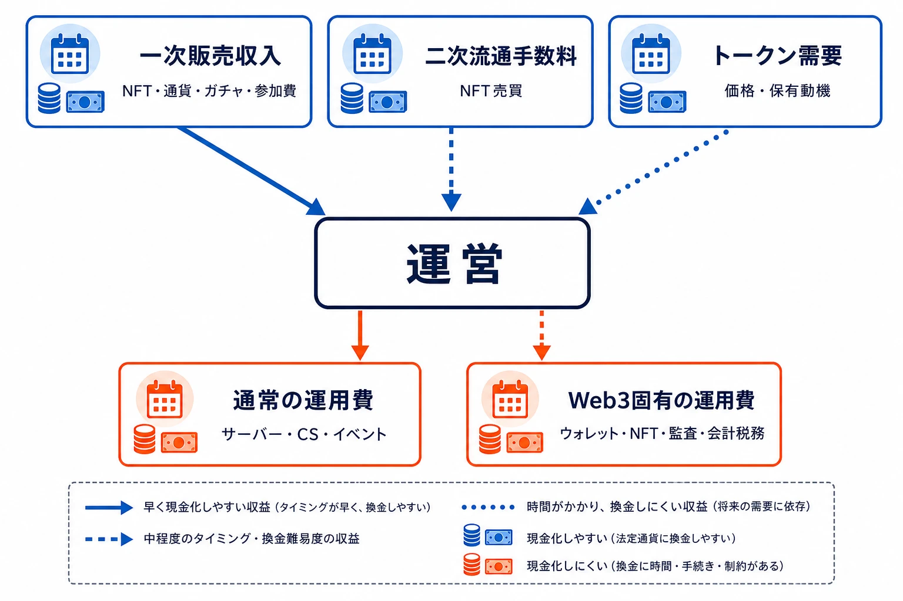
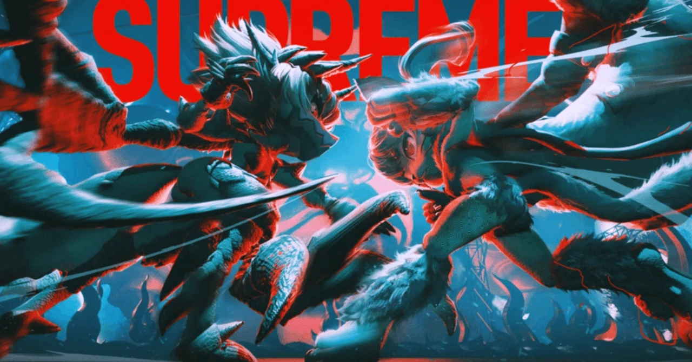
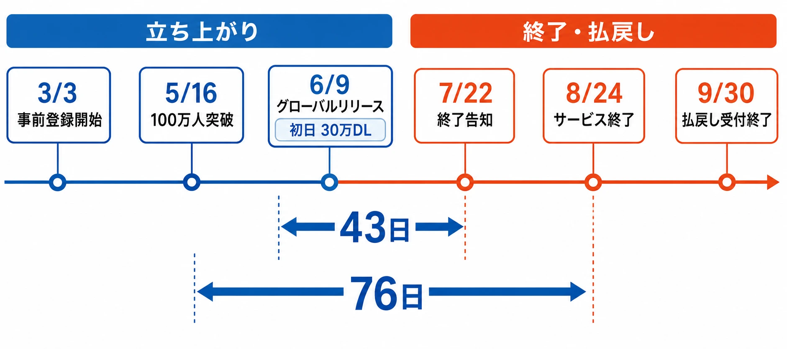

# TOKYO BEASTはなぜ76日で終わったのか――P2Eゲームの大型プロジェクトを読み解く個別事例

## はじめに――短命だった一作を、後知恵で片付けないために

2025年6月9日にグローバルリリースされた『TOKYO BEAST TRIALS』は、8月24日にサービスを終了した。リリース日から数えると76日である。開始日当日には国内ストア無料ゲームランキング1位と累計30万ダウンロードを公表し、賞金総額最大1.5億円相当を掲げた特別大会も予定されていたため、立ち上がりの規模と終わりの早さは強い対比をなす。[[1](#ref-1)][[2](#ref-2)]

短期間で終わったタイトルは、遊んだ人にも、存在を後から知る人にも、情報が断片としてしか残りにくい。しかし、だからといって「ブロックチェーンゲームだから失敗した」「トークン価格が下がったから終わった」と一語で済ませると、企画に使える知見は残らない。

本稿は、P2Eゲーム一般の正解集ではない。公開資料から確認できる『TOKYO BEAST』固有のゲーム構造、開発規模、リリース後の動き、終了時の補填を追い、なぜ早期終了の判断に至りうる収支構造だったのかを考える個別事例である。運営の未公表の財務数値や内部意思決定を推測で補うことはしない。公式が述べた終了理由を出発点に、公開された設計と外部市場データから、プランナーが検証すべき因果関係を切り分ける。

なお、P2E企画を立ち上げる段階で確認すべき一般的な論点は、別記事「[P2Eゲーム制作を指示されたとき、ゲームプランナーが確認・検討すべきこと](p2e-game-development-planner-checklist.md)」で扱っている。本稿の焦点は、そこで挙げた論点が一つの大型プロジェクトでどう絡んだかにある。

***

## P2E・ブロックチェーンゲームを読むための最小限の前提

### NFT、トークン、P2Eは何を変えるのか

NFT（Non-Fungible Token、非代替性トークン）は、一つひとつを区別して扱えるブロックチェーン上の記録である。ゲームではキャラクター、装備、会員証などに割り当てられ、対応するウォレットを通じて外部へ移転・売買できる設計に使われる。ここでいう「保有」は、ゲームのサーバー内データを永久に利用できる保証ではない。一般には、チェーン上のトークンを移転できることと、サービス内でそのトークンに機能が与えられることが組み合わさる。

トークンは、ブロックチェーン上で発行・移転できるデジタルな単位の総称である。NFTと異なり、同じ単位同士を交換できるものは、ゲーム内報酬や決済、ステーキングに使われやすい。本稿で扱う TGT もこの種のトークンである。トークンエコノミーとは、トークンを誰に配り、何に使わせ、どのように流通・消却させるかを含む経済設計を指す。

P2E（Play to Earn）は、プレイを通じて、外部で価値を持ちうるトークンやNFTなどを得られる設計である。「遊べば安定して儲かる」という意味ではない。報酬の価格、換金の流動性、参加費、手数料、税務、プレイ時間を含めて初めて手取りが決まる。ゲーム側は、通常の基本プレイ無料ゲームと同様に、ゲーム内通貨、ガチャ、シーズンパスなどで収益を作れる。一方、外部移転できる資産を組み込む場合には、ユーザーが報酬を外部で売却する流れと、その資産を買う需要まで設計対象になる。

### 収益はどこから入り、どこから出ていくか

P2Eゲームの収益源には、概ね三つの層がある。第一は、NFTの初回販売、ゲーム内通貨、ガチャ、参加費など、運営が直接受け取る一次販売収入である。第二は、ユーザー間のNFT売買に課す二次流通手数料である。第三は、トークンの保有・利用によって生まれる需要であり、これは運営に現金収入を直接もたらすとは限らないが、報酬やNFTの期待価値に影響する。

問題は、これらを同じ「売上」として扱えない点にある。初回NFT販売は、発売や大きな更新に集中しやすい。二次流通手数料は、取引量がなければ発生しない。トークンの市場価格上昇は、財務上の売上と同義ではなく、運営が保有分を売却するか、どのような原資を持つかによって初めて資金繰りへ影響する。

さらにブロックチェーンゲームには、通常のゲーム運用に加え、外部ウォレット連携、トークンの出庫・ステーキング、NFT発行、マーケットプレイス連携、スマートコントラクト監査、暗号資産の会計・税務・法務確認、価格変動時の問い合わせ対応が必要になる。チェーンのガス代を運営または利用者のどちらが負担するかも仕様になる。すべてのコストがオンチェーン手数料ではない。むしろ、資産が外部へ移転できるために増えるサポート、セキュリティ、経済監視、説明責任の運用が、継続費として積み上がる。

この構造では、プレイヤー数が増えても自動的に採算が改善するとは限らない。無料配布や外部報酬が多ければ、利用者増加は報酬原資、CS、イベント、サーバーの負担も増やす。したがって、KPIはダウンロード数だけでなく、継続率、課金収入、NFTの一次・二次流通額、トークンの売買量、報酬発行量、運用費、そして現金ベースのランウェイを一つの表で見る必要がある。

***

## TOKYO BEASTとは何だったのか

### 2124年の東京で、戦う側と予想する側を接続した

『TOKYO BEAST TRIALS』の舞台は2124年の東京である。意志を持つアンドロイド「レプリカント」が普及し、かつて流行したレプリカントモデル「BEAST」のコピーデータを戦わせる「XENO-karate」が人気エンターテインメントとなった、という設定だった。プレイヤーはBEASTを4体編成して大会を目指し、観客側は週末のチャンピオンシップの結果を予想してベッティングできた。[[3](#ref-3)]

ゲームプレイの核は、3Dで演出されるオートバトルである。操作反射だけで勝敗を決めるのではなく、BEASTの編成、育成、パーツやパラメータ、スタミナの使い方を準備し、戦闘結果とランキングを競う。週末のチャンピオンシップでは、その対戦結果を予想する遊びが重なった。ここでいうベッティングは、単にプレイヤー同士が金銭を賭ける機能ではなく、ゲーム内で得るチップを使い、予想報酬としてゲーム内資産や外部へ移転可能な資産に接続する設計として説明されていた。[[3](#ref-3)]

重要なのは、「戦うプレイヤー」と「結果を予想する参加者」を同じ週次イベントへ集めようとした点である。競技者だけに依存せず、観戦と予想にも参加動機を作るための設計であった。一方で、この接続は報酬、賞金、ベッティングの運用がゲーム体験の周縁ではなく、毎週の価値提案の中心に近づくことも意味する。

*画像出典（引用）：TOKYO BEAST, [「TOKYO BEAST TRIALS」事前登録を全世界同時に開始！〜賞金総額最大1.5億円をかけた特別大会も開催！〜](https://note.com/tokyobeast/n/n2f3ea4c53d4f), 2025年3月3日。公式配布のキービジュアルを、出典を明記して無改変で引用。*

### BASEとTRIALSを分け、NFT保有を必須にしなかった

『TOKYO BEAST』は、通常ゲームとして遊ぶ「TRIALS」と、NFT・TGTの保有、育成、ステーキング、ベッティングを扱う「BASE」の二層で構成されていた。TRIALSはスマートフォン、PCなどで遊ぶ基本プレイ無料のゲーム側であり、NFTや暗号資産を購入しなくても遊べ、強さにも影響しないと案内されていた。[[3](#ref-3)]

BASEは、TGTのステーキング、BEAST NFTのミント・調整・ブリード、LUCKY TICKET NFTをロックして得るチップによるベッティングなど、Web3側の活動を担う。TRIALSでは、BEAST NFTのコピーである「PROXY BEAST」をガチャなどで獲得し、バトルとランキングを遊べる仕組みだった。NFTそのものを持たないユーザーにもゲーム側の入口を用意したことは、初期のウォレット作成・NFT購入という摩擦を下げる意図として読める。[[4](#ref-4)]

しかし、二層化は経済を単純化するものではない。TRIALSのプレイ、ランキング、予想報酬が、BASEにおけるNFT・TGT・チップの需要へつながる必要がある。TRIALSが面白くてもBASEの資産需要が生まれなければ、NFTやTGTの利用動機は弱い。逆にBASEの期待価値が先行しすぎれば、ゲーム側の継続プレイより資産価格への関心が前面に出る。この接続を継続的に成立させることが、本作の事業上の難所だった。

### 大型の共同プロジェクトとして始まった

開発・運営はTOKYO BEAST FZCO、gumi、チューリンガムの共同事業として発表された。チューリンガムの発表は、日本の有名ゲームで経験を積んだスタッフと、Web3ゲームとしては類を見ない開発予算を掲げている。リリース前の公式発表では、構想4年、総開発費30億円超の大型プロジェクトと説明された。これは実績値として監査された原価ではなく運営側の発信だが、少人数・小規模な実験ではなく、高品質な3Dゲーム、グローバル展開、Web3基盤を同時に抱える前提だったことを示す材料にはなる。[[5](#ref-5)][[3](#ref-3)]

ブロックチェーン基盤にはImmutable zkEVMが採用された。ImmutableとIMX Ecosystem Foundationによる技術・マーケティング支援も公表されていた。TGTは単に『TOKYO BEAST』内で使う通貨ではなく、将来は複数のAAAゲームを誘致・展開する「プラットフォームトークン」と位置付けられていた。TGTのステーキングではTGT報酬やBEAST RAWDISK NFTが得られ、BEAST NFTのステーキングでもTGTが報酬となる。[[6](#ref-6)][[7](#ref-7)]

この設計は、成功すれば一作の売上を超えて資産と参加者を横断させられる。ただし、最初のフラッグシップが止まる局面では、トークンの用途、報酬原資、コミュニティの期待を同時に説明しなければならない。タイトル単体のサービス終了より、整理する対象が広くなる構造である。

***

## 立ち上がりから終了まで――短い期間に何が起きたか

| 日付 | 公開された出来事 | 事例として読むべき点 |
| --- | --- | --- |
| 2025年3月3日 | 全世界同時の事前登録と、特別大会「THE $1M GAMING CHAMPIONSHIP」を発表 | 大会の優勝賞金・予想配当をリリース前の参加動機に置いた。[[3](#ref-3)] |
| 2025年5月16日 | 正式リリース日を6月9日と発表。事前登録100万人突破、賞金総額最大1.5億円相当を告知 | 登録数と賞金額は期待形成の材料であり、継続利用・収益を直接示す指標ではない。[[8](#ref-8)] |
| 2025年6月9日 | グローバルリリース。国内ストア無料ゲームランキング1位、累計30万ダウンロードを公表 | 認知獲得は速かった。だがDLは収益、定着、報酬原資の充足を示さない。[[2](#ref-2)] |
| 2025年7月22日 | 8月24日17時のサービス終了を告知。理由を「運用コストとのバランスを取ることが困難」と説明 | リリースから43日後の終了告知である。損失が拡大する前に撤退判断へ移ったと読める。[[9](#ref-9)] |
| 2025年7月22日〜31日 | TBストア販売を終了。BASEの主要機能を停止し、残存機能・手数料を整理 | 新規販売を止めつつ、保有資産のアンロック、受取、アンステークを優先した。[[9](#ref-9)] |
| 2025年8月22日〜24日 | アリーナ終了、最終チャンピオンシップ、マッチアップ終了。TRIALSを終了 | 競技・予想という中核イベントを段階的に閉じた。[[9](#ref-9)] |
| 2025年8月25日〜9月30日 | 払戻し申請を受け付け、アプリ配信を停止 | 有償ジュエルの法令に沿った払戻しと、NFT・TGT保有者への別枠補填を分けた。[[9](#ref-9)] |

時系列から確実に言えるのは、発売初日の集客発表と、43日後の終了告知が同じタイトルで起きたこと、そして終了まで約1か月を使って資産・機能・払戻しを分離して閉じたことである。反対に、30万ダウンロードの内訳、日次アクティブユーザー、課金率、実際のイベント収支、開発費の消化額は公表資料から確認できない。早期終了の原因をDLの質や特定の不具合へ単純に帰すことはできない。

***

## なぜ短期間で終了したのか――公表理由を収支構造へ戻す

### 終了理由は「運用コストと収益のバランス」である

運営はサービス終了告知で、「運用コストとのバランスを取ることが困難な状況に至った」と説明した。これは「ユーザーがいなかった」「トークン価格が下がった」「開発が失敗した」といった個別原因を名指ししたものではない。したがって本稿でも、それらを公式原因として断定しない。[[9](#ref-9)]

ただし、収支の視点に翻訳すると、毎月の現金収入と、ゲーム・Web3の継続費、イベント・報酬・サポート費、そして終了補填に耐えられる資金の関係が、継続不能な領域へ入ったことを意味する。大型タイトルであれば、リリース後にコンテンツを追加しなくても、3Dゲームのサーバー、対戦・ランキング運用、CS、コミュニティ、複数プラットフォームの更新、セキュリティ、外部資産の管理を止められない。開発費30億円超という発信がそのまま月次運用費を意味するわけではないが、大型制作体制を維持するほど損益分岐点が上がりやすい、という方向性は妥当である。[[3](#ref-3)]

### 報酬と大会が価値提案の中心に近い

本作では、TGTのステーキング、BEAST NFTのステーキング、ランキング、くじ、チャンピオンシップの上位報酬が、遊びと資産価値を接続していた。ホワイトペーパーでは、チャンピオンシップのTGT報酬の原資をBASE内のLUCKY CHOICE売上の一部としており、報酬配分・還元率はサービス状況に応じて調整しうるとしていた。[[10](#ref-10)]

これは、売上と報酬を接続する合理的な考え方でもある。一方、イベントの参加動機に大きな賞金や外部価値を置くなら、売上が計画を下回った場合に報酬期待と原資の間に差ができる。報酬を減らせばイベントの魅力が落ち、維持すれば現金・トークンの負担が増す。ゲームの面白さだけで継続するプレイヤー比率が十分でない時期ほど、この調整は厳しい。

特別大会で示された「最大1.5億円相当」は、TGTの完全希薄化後時価総額が500億円相当の場合などを前提とした想定額であり、TGT価格によって円換算額が変動すると明記されていた。つまり、見出しの金額は固定の現金原資ではなく、トークン価格を含む前提に依存していた。[[8](#ref-8)]

### TGT価格の下落は、原因ではなくリスク増幅要因として見る

TGTは2025年5月22日に1トークン当たり0.1502米ドルの過去最高値を記録したと価格追跡サイトは示す。一方、サービス終了告知の時期には、その過去最高値から大きく水準を切り下げた価格で推移していた。データ提供元・取引所・出来高が限られる暗号資産価格は、単独で事業状態を表すものではない。それでも、リリース前後から終了告知時期にかけて、ドル建ての評価が大きく変動・低下したこと自体は、TGT建ての報酬や賞金の説明を難しくする条件だった。[[11](#ref-11)][[12](#ref-12)]

ここで注意すべきは、価格下落を終了の唯一原因にしないことである。価格は、ゲーム内の需要だけでなく、市場全体、取引所の流動性、保有者の売買、期待の変化など複数の要因で動く。公開資料からは、運営がTGTをいつ・いくら売却したか、トークン下落が運用費を何円圧迫したかは分からない。

それでも、価格変動は少なくとも三つのリスクを増幅する。第一に、TGT建ての賞金・報酬を円やドルで説明したとき、参加者の期待と実価値が乖離しやすい。第二に、ステーキングやNFT保有の期待が弱まり、一次販売・二次流通・ゲーム内消費に波及しうる。第三に、トークンで補填すれば補填直後の売却圧がさらに価格を下げるという、撤退時特有の問題が生じる。本件の補填通貨の選択は、この第三の問題を正面から扱ったものだった。

### 一次販売に寄るモデルの難しさ

NFTの初回販売は、開発費の回収や初期のコミュニティ形成に使える。しかし、販売は同じユーザーへ繰り返し続けられるとは限らない。初回販売の収入で大型開発の固定費を支え、二次流通の手数料とトークン需要で運用を回すモデルは、新規の買い手、既存保有者の継続利用、ゲームとしての定着の三つが同時に必要になる。

『TOKYO BEAST』では、BASEにおけるTGTステーキングからBEAST RAWDISK NFTを得て、ガチャやブリードでBEAST NFTへ接続する流れが設計されていた。TRIALSでのバトル・ランキング・予想が、このNFT・TGTの需要を強めることが期待された。[[4](#ref-4)][[7](#ref-7)]

だが、初期のNFT販売や話題性は、一度の大きな収入・集客としては機能しても、月次運用費の代替にはならない。継続判断では、「次の販売が成功するか」ではなく、「新規販売がゼロでも、既存プレイヤーのゲーム内消費と二次流通手数料で、次の四半期を回せるか」を問うべきである。本件は、その問いを早期に突き付けられた事例として読むのが適切である。

***

## 終了後の対応をどう評価するか

### USDCで補填した意図

運営は、対象ユーザーのウォレットへ米ドル連動型ステーブルコインである USDC を返金すると発表した。1 USDC＝1米ドルの換算レートを示し、TGTによる補填では補填後の価格下落で実質価値が不安定になりうること、TGTへの過剰な売り圧を避けることを理由に挙げた。[[9](#ref-9)]

これは、TGTを「将来も使える資産」として残す構想と、終了する作品の利用者への補填を分離する選択である。TGT補填はチェーン内で扱いやすい反面、受け取ったユーザーが換金するほど価格が動き、補填額の実質価値が読めなくなる。USDCにもウォレット・チェーン・換金の手間、ステーブルコイン固有のリスクはあるが、少なくとも補填額をドル建てで固定する意図は明確だった。

補填は一律ではなかった。未使用GEMと一次販売分のLUCKY TICKET NFTは全額補填、BEAST NFTは二次流通フロア価格にミント価格を加えた評価、TGTステーキングは7月20日時点の市場価格を基準とするなど、資産・取得経路ごとに基準を分けた。これは、購入額、保有資産の市場評価、ゲームへの関与を一つの式に混ぜずに扱おうとした点で、実務上の整理として評価できる。[[9](#ref-9)]

### 公開質問会を受け、熟練度基準へ修正した

初回告知後、運営は7月24日にDiscordでAsk Me Anything（AMA、何でも質問できる公開質問会）を実施し、7月25日にBEAST NFTの補填基準を「BEASTランク別」から「熟練度」に応じた設定へ変更した。熟練度が高いほど補填額を増やす方式である。[[9](#ref-9)]

この変更は、単に声の大きい人へ譲歩したかどうかでは判断できない。ランクは保有資産の状態を表すが、熟練度は少なくともゲーム内で使い込んだ度合いを反映しうる。サービス終了補填では、購入金額を守るのか、市場価値を守るのか、プレイ・育成への関与を報いるのかを先に選ばなければ、どの基準にも不満が残る。本件は、告知後にその優先順位を説明・調整した例である。

一方で、基準変更は、終了時までに資産を保有していた人、途中で売却した人、配布で得た人の間に別の不公平感を生みうる。終了計画では、補填対象日時、取得経路、評価時点、通貨、端数、対象外条件を最初から仕様として設計し、変更可能性と意思決定者を明記する必要がある。

### 受け取る側に残る税務上の論点

以下は日本の一般的な論点であり、個別の申告方法を断定する税務助言ではない。居住地、取得経緯、事業性、他の取引、契約内容によって扱いが変わるため、取引履歴を保存したうえで税理士または税務署へ確認すべきである。

国税庁は、暗号資産交換業者から暗号資産に代えて受ける金銭補償について、契約内容と補償の性質を総合的に判断するとしたうえで、一般には暗号資産を売却して金銭を得た場合と同様の結果となり、雑所得として課税対象になりうると説明している。本件のUSDC補填は同一の事案ではないが、「補償だから当然に非課税」とは言えないことを考える出発点になる。USDCを受け取った時点の評価、NFT・TGTの取得価額、補填の法的性質をどう捉えるかは、個別確認が必要である。[[13](#ref-13)]

所得計算では、取得のための支出や、取引に直接必要な費用の記録が重要になる。TGTやNFTの購入額、購入・送付手数料、補填の算定資料、受取時刻とレート、ウォレットのトランザクションIDを残すべきである。購入額が補填額を上回る場合に、何を必要経費または取得価額として扱えるかも、保有目的と取引経緯で変わりうる。[[14](#ref-14)]

また、通常の雑所得で損失が出ても、給与所得など他の所得から控除する損益通算はできない。国税庁は、雑所得の損失は他の各種所得から控除できないとしている。暗号資産に係る通常の雑所得の損失を翌年へ自由に繰り越せる制度も一般にはないため、「補填額が購入額を下回ったから税務上も自動的に相殺される」と考えるのは危険である。例外・区分がありうるため、ここでも個別確認を前提とする。[[15](#ref-15)]

***

## プランナーが持ち帰るべき四つの実務判断

### 1. 運用費は「発売後の平常月」で耐えるか

ローンチ時のNFT販売、事前登録、キャンペーン、特別大会を通常収益として予算へ入れてはならない。企画審査では、次の三つを別シートに分けるべきである。

| シート | 置く数字 | 判断に使う問い |
| --- | --- | --- |
| ゲーム運用 | DAU、継続率、ゲーム内消費、サーバー、CS、イベント、アップデート費 | NFT販売がなくても、プレイヤー体験を維持できるか |
| 資産経済 | NFT一次販売、二次流通額・手数料、トークン発行・消費、取引量 | 新規買い手が減ったときも、売却以外の使い道が残るか |
| 財務安全性 | 現金収入、トークン保有・売却前提、報酬原資、補填引当、ランウェイ | トークン価格が10分の1、販売がゼロでも何か月継続できるか |

『TOKYO BEAST』は高品質なゲーム、グローバル配信、イベント、NFT・トークンの経済圏を同時に運用する構造だった。この組み合わせ自体を否定する必要はない。しかし、どれか一つの収益が外れたときに、他の二つのコストがすぐ縮まないなら、開発規模の大きさが撤退判断を早める。

### 2. トークン価格をKPIの分母にも分子にも置きすぎない

トークン価格は、コミュニティの期待や外部流動性を示す観測値にはなる。しかし、価格上昇を成功KPIとすると、ゲーム体験の改善より、短期的な発行制限・期待形成・報酬告知が優先されやすい。反対に、価格下落だけを失敗KPIにすれば、市場全体の変動でゲームの評価まで誤読する。

実務では、少なくとも次を分けて追うべきである。

- プレイヤー価値：継続率、対戦参加率、編成変更率、観戦・予想参加率、問い合わせ理由
- 事業価値：現金売上、粗利、イベント原価、CS原価、月次キャッシュバーン
- 資産経済：トークンの発行量・消費量、保有者集中、取引量、NFTの一次・二次流通、外部価格

賞金の見出しをトークンの想定時価総額から作る場合は、価格が半分、10分の1、流動性が薄い場合の表示・支払・参加者説明まで、事前に承認しておくべきである。金額を大きく見せる設計と、持続可能な原資設計は別物である。

### 3. 早い撤退は、失敗の否認ではなく損失管理になりうる

発売から43日で終了を告知することは、利用者にとって重い出来事である。だが、運営が収支改善の見込みが薄いと判断した後も、次の販売やトークン価格回復に賭けて続ければ、既存利用者の追加負担と将来の補填負債を増やす可能性がある。

本件では、販売停止、資産のアンロック、機能の段階終了、USDC補填、有償ジュエル払戻しという順に閉じた。これは、早期撤退そのものを美化する根拠ではないが、撤退が避けられない場合に、告知を先延ばしして販売を続けるよりは、対象と期限を分けて整理する方針として評価できる。[[9](#ref-9)]

継続・撤退の判断基準は、ローンチ後に初めて作るべきではない。たとえば「3か月連続で通常月の現金粗利が運用固定費を下回る」「トークン価格ではなく、売買量と利用率が一定以下」「外部報酬原資が承認上限を超える」といったトリガーを、経営・開発・運用・法務で合意しておく。数値がトリガーを超えたときに打つ手を、報酬調整、縮小運用、販売停止、終了準備へ段階化する。

### 4. 補填は「終了時の広報」ではなく、サービス仕様である

外部移転できるNFT・トークンを扱うなら、終了時の補填・払戻しは利用規約の末尾だけに置く問題ではない。少なくとも以下を発売前に決める必要がある。

- 有償ゲーム内通貨、NFT、未受領報酬、ステーキング、二次購入分を、どの資産区分で扱うか
- 評価の基準日、参照市場、取得価格、市場価格、プレイ実績のどれを優先するか
- 補填通貨を法定通貨、ステーブルコイン、自社トークンのどれにするか。その価格・換金・税務の説明は誰が担うか
- ウォレット未連携、秘密鍵喪失、誤送付、不正取得、国・地域制限、未成年利用者をどう扱うか
- 補填原資を、運転資金と切り分けてどこまで確保するか

本件が示したのは、補填方法の正解がUSDCだということではない。自社トークンの価格安定と利用者への確定額補填が衝突する局面を、終了後ではなく企画段階から想定すべきだということである。

サービス終了後のチーム内検証をどう設計するかは、別記事「[重大インシデント後のポストモーテムを設計する――ゲーム開発チームのための事後検証と学習の方法論](postmortem-methodology-after-major-incidents-for-game-teams.md)」で扱っている。本件に当てはめるなら、まず公開情報と社内の収支・報酬・販売・問い合わせ記録を区別し、誰かの判断を犯人探しにするのではなく、どの予測がどの時点で外れ、どの指標が撤退判断へ結び付いたかを記録するのが出発点になる。

***

## おわりに――TOKYO BEASTの76日は何を示したか

『TOKYO BEAST』は、NFTを持たなくても遊べる3Dオートバトルと、NFT・TGT・予想・大会をつなげた大型の共同プロジェクトだった。初日の30万ダウンロードという認知獲得と、運用コストとの収支不均衡を理由とする早期終了は、同じ企画において両立しうる。

この一件固有の教訓は、「ダウンロードが出たか」でも「トークン価格が上がったか」でも、持続可能性を判定できないことである。高い制作・運用コスト、外部価値を伴う報酬、一次販売の集中、トークン価格の変動、終了時の補填責任は、別々の論点ではなく一つの収支構造として動く。

プランナーが見るべきなのは、華々しい発売日の次に来る平常月である。販売が鈍り、トークン価格が下がり、賞金の期待を維持しづらくなっても、誰がなぜ遊び続け、何が現金収入と資産需要を支えるのか。その答えが事前に数値と運用手順で置けなければ、ゲームの魅力があっても、大型の経済圏は短期間で止まりうる。TOKYO BEASTの76日は、その問いを具体的な形で残した。

## References

1. [「TOKYO BEAST TRIALS」事前登録を全世界同時に開始！〜賞金総額最大1.5億円をかけた特別大会も開催！〜][1] - タイトルの設定、ゲーム構造、NFT非保有でも遊べる方針、開発規模、大会の公表内容。

2. [ストア無料ゲームランキング1位＆30万DL突破記念プレゼント！][2] - 2025年6月9日の国内ストア無料ゲームランキング1位・累計30万ダウンロードの運営発表。

3. [「TOKYO BEAST TRIALS」事前登録を全世界同時に開始！〜賞金総額最大1.5億円をかけた特別大会も開催！〜][3] - 2124年東京、4体編成、予想参加、配信地域、大会の説明。

4. [TOKYO BEASTの全体像][4] - BASE・TRIALS、PROXY BEAST、TGT・NFT・チップを結ぶ設計の公式ホワイトペーパー。

5. [チューリンガム、株式会社gumi、TOKYO BEAST FZCOと完全オリジナルWeb3 IPプロジェクト「TOKYO BEAST」を共同プロジェクトとして開始][5] - 共同事業の参加企業と大型開発プロジェクトとしての発表。

6. [TOKYO BEAST、Immutableからタイトル支援およびパートナーシップ締結を発表][6] - Immutable zkEVM採用と技術・マーケティング支援の公表。

7. [ミッションとエコシステム構想][7] - TGTを複数タイトルへ展開するプラットフォームトークンとして位置付けた公式構想。

8. [一獲千金を夢みた熱狂体験が味わえる新作ゲーム「TOKYO BEAST」がついにリリース日決定！][8] - 2025年6月9日の正式リリース、事前登録、特別大会の賞金・TGT価格前提に関する注記。

9. [サービス終了のお知らせ][9] - 終了理由、段階的な機能停止、払戻し、USDC補填、AMA後の補填基準変更の公式告知。

10. [PvP][10] - チャンピオンシップのTGT報酬とLUCKY CHOICE売上の一部を原資とする説明。

11. [Tokyo Games Token Price, Market Cap & Historical Data][11] - TGTの過去最高値に関する価格追跡データ。

12. [TOKYO GAMES TOKEN Historical Data][12] - 2025年7月17日から23日のTGT日次価格データ。

13. [No.1525 暗号資産交換業者から暗号資産に代えて金銭の補償を受けた場合][13] - 暗号資産の代替補償に関する一般的な所得税上の考え方。

14. [暗号資産等に関する税務上の取扱い及び計算書について][14] - 暗号資産取引の所得区分・計算書に関する国税庁の案内。

15. [No.2250 損益通算][15] - 雑所得の損失を他の各種所得から控除できないことに関する国税庁の説明。

[1]: https://note.com/tokyobeast/n/n2f3ea4c53d4f
[2]: https://note.com/tokyobeast/n/ncd76f192f9e5
[3]: https://note.com/tokyobeast/n/n2f3ea4c53d4f
[4]: https://tokyogamestoken.gitbook.io/tokyobeast-whitepaper/ja/overview-of-tokyo-beast
[5]: https://turingum.com/news/press-release/tokyobeast/
[6]: https://prtimes.jp/main/html/rd/p/000000013.000127222.html
[7]: https://tokyogamestoken.gitbook.io/tokyobeast-whitepaper/ja/readme/mission-and-ecosystem-plan
[8]: https://note.com/tokyobeast/n/n87dc6db08b56
[9]: https://note.com/tokyobeast/n/n01c397dc1483
[10]: https://tokyogamestoken.gitbook.io/tokyobeast-whitepaper/ja/activities-in-base-and-trials/activities-in-trials/battles/pvp
[11]: https://www.coingecko.com/en/coins/tokyo-games-token
[12]: https://ng.investing.com/crypto/tokyo-games-token/historical-data
[13]: https://www.nta.go.jp/taxes/shiraberu/taxanswer/shotoku/1525.htm
[14]: https://www.nta.go.jp/publication/pamph/shotoku/kakuteishinkokukankei/kasoutuka/index.htm
[15]: https://www.nta.go.jp/taxes/shiraberu/taxanswer/shotoku/2250.htm

----

この文書は、Perplexity、Claude、OpenAI Codex の3つのAIの支援を受けて著述されたものです。引用画像を除き、MIT License にて提供されています。
