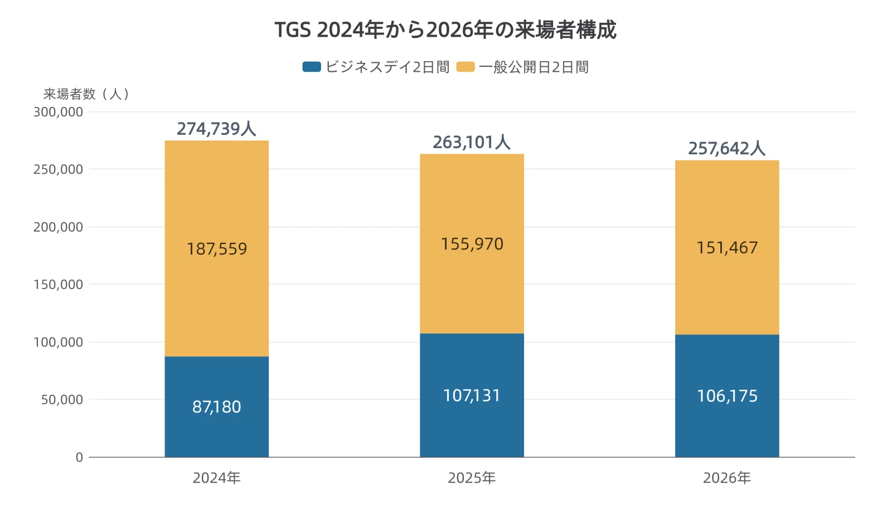
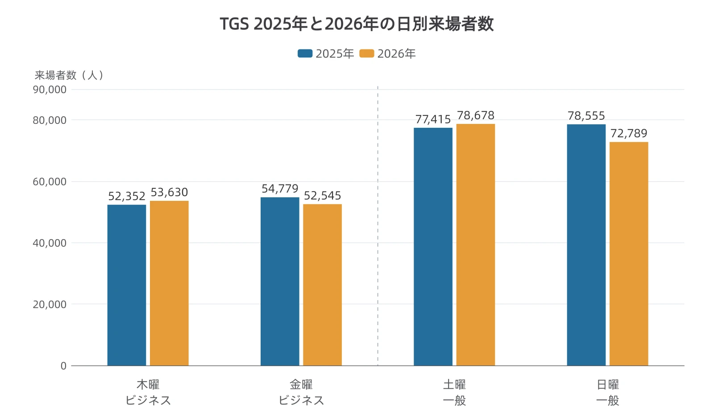

# 東京ゲームショウはなぜ5日間なのか——来場者数と会期の設計を読む

## 第1章　5日間の見本市が、4日間で終わった

2026年9月17日、30周年を迎えた東京ゲームショウ（TGS）が開幕した。幕張メッセを中心とする会場には、53の国・地域から1,138の企業・団体が出展した。予定された会期は9月21日（月・祝）まで。史上初の5日間開催だった。[[1](#ref-1)]

TGSには、ゲーム業界の関係者が商談や取材などを行う「ビジネスデイ」と、一般のゲームファンが試遊やステージを楽しめる「一般公開日」がある。2026年は木・金のビジネスデイ2日間を維持し、一般公開日を土・日・月曜の祝日の3日間に増やす計画だった。[[1](#ref-1)]

しかし、最終日のリアル開催は中止された。主催するコンピュータエンターテインメント協会（CESA）は9月20日夜、台風25号の接近を受け、往復の移動を含む来場者・出展社・関係者の安全を優先すると発表した。4日間の総来場者数は257,642人。一方、安全を確保して実施できる公式番組は、翌日も予定どおり配信するとした。同じ発表には、次回も2027年9月16日（木）〜20日（月・祝）の5日間、幕張メッセで開催する予定が記されている。[[2](#ref-2)]

会期の日数は、何を根拠に決まるのだろうか。来場者が増えれば延ばし、減れば縮める、という見方だけで説明できるだろうか。

本稿では、日数と来場者の構成から、出展する場の役割を考える。ブースで遊んでもらう内容の作り方は[展示会・イベント向け体験ビルド制作の実務ガイド](exhibition-demo-build-production-guide-for-planners.md)、オンラインでの体験版の出し方は[体験版戦略の功罪](game-demo-strategy-console-vs-early-access.md)に譲り、ここでは「誰と会うために、どの日を使うか」に焦点を絞る。

***

## 第2章　来場者数は、会期の長さを説明しない

まず、直近3年の数字を並べよう。2024年と2025年は予定どおり4日間、2026年は5日間の予定のうち4日目までの実績である。各年とも実際に開催されたのは、木・金のビジネスデイと土・日の一般公開日だった。[[2](#ref-2)][[3](#ref-3)][[4](#ref-4)]

| 年 | 総来場者数 | うちビジネスデイ2日間 | うち一般公開日2日間 | ビジネスデイの割合 |
| --- | ---: | ---: | ---: | ---: |
| 2024 | 274,739人 | 87,180人 | 187,559人 | 31.7% |
| 2025 | 263,101人 | 107,131人 | 155,970人 | 40.7% |
| 2026 | 257,642人 | 106,175人 | 151,467人 | 41.2% |

出典：CESAの各年の来場者発表。区分別合計と割合は日別の公表値から算出し、割合のみ小数第1位に丸めた。2024年のビジネスデイは42,031人と45,149人の合計であり、概数ではない。[[2](#ref-2)][[3](#ref-3)][[4](#ref-4)]

総来場者数は、この3年の間に2年連続で減っている。一方、ビジネスデイの人数は2024年から2025年に大きく増え、2026年は前年より956人減ったものの、10万人を超える水準を保った。2026年の比率上昇は、ビジネスデイの人数増加によるものではなく、一般公開日の減少がより大きかったためである。

この割合は、日別来場者数を足し合わせた集計の中での比重を表す。「来場した人の41.2%が商談をした」「商談の成果が増えた」という意味にはならない。目的や成果を読むには、別の数字が必要だ。

2026年は本来5日間予定のうち4日目までの実績。5日目のリアル開催は中止。出典：CESAの各年来場者発表。[[2](#ref-2)][[3](#ref-3)][[4](#ref-4)]

2025年と2026年を日別に分けると、動きは一様でないこともわかる。

| 日の区分 | 2025年 | 2026年 | 前年との差 |
| --- | ---: | ---: | ---: |
| 木曜・ビジネスデイ | 9月25日：52,352人 | 9月17日：53,630人 | ＋1,278人 |
| 金曜・ビジネスデイ | 9月26日：54,779人 | 9月18日：52,545人 | −2,234人 |
| 土曜・一般公開日 | 9月27日：77,415人 | 9月19日：78,678人 | ＋1,263人 |
| 日曜・一般公開日 | 9月28日：78,555人 | 9月20日：72,789人 | −5,766人 |

出典：CESAの2025年・2026年来場者発表。差分は公表値から算出。[[2](#ref-2)][[4](#ref-4)]

2026年は、一般公開日3日間を前提に日付指定券が販売されていた。同じ木曜から日曜の4日間でも、最初から4日間を予定した2025年とは条件が異なる。月曜に来場を予定した人がどれだけいたか、天候が各日にどれほど影響したかは、この表からは分からない。したがって、5日間開催の需要や混雑緩和の成否を、4日間の合計だけで判定することはできない。[[5](#ref-5)]

2026年は一般公開3日間の予定。5日目の9月21日（月・祝）はリアル開催中止のため、グラフには含めていない。出典：CESAの2025年・2026年来場者発表。[[2](#ref-2)][[4](#ref-4)]

では、主催者は延長をどう説明したのか。9月17日の基調講演を報じた村田征二朗氏のファミ通記事によると、CESA会長の辻本春弘氏は、来場者が過去最高の298,690人となった2018年の深刻な混雑を振り返った。対策として人気ブースを分散させ、さらに会場を広げることも1日の開催時間を延ばすことも難しい中で、利用者の要望を受けて一般公開日を増やしたという。これは講演を取材した記事による説明である。[[6](#ref-6)]

気賀沢昌志氏の講演レポートでも、土日だけでは来られない人への対応と、来場の分散による混雑緩和が、5日間化の狙いとして報告されている。説明の軸は、直近の前年比よりも、ピーク時の混雑と参加できる日の選択肢に置かれている。[[7](#ref-7)]

**会期全体の人数と、特定の日・場所に人が集中する問題は、別々に見る必要がある。** 合計が減っていても、人気ブースへ向かう人が短い時間帯に集中すれば、体験しやすくなるとは限らない。会期には、人数を受け入れるだけでなく、その集中をほどく役割がある。

***

## 第3章　ビジネスデイは何の場か

ビジネスデイには、入場資格の境界がある。CESAの2026年の告知では、チケット購入時にゲーム業界関係者であることを事前審査し、通過者が入場できるとしている。有料の事前登録枠があり、18歳未満と学生は入場できない。一般公開日より早く遊べる券として、誰もが買える仕組みではない。[[5](#ref-5)]

その一方で、対象は企業の商談担当者だけに収まらない。主催者は公式サイトで、「より多くの方に情報を届けるため」に、ゲーム実況などを配信・投稿する人がビジネスデイから入場できる窓口を用意していると説明している。[[8](#ref-8)]2026年の公式サイトには、ゲーム実況やSNS投稿を行うインフルエンサー向けの登録枠がある。一般インフルエンサーは18歳以上で学生を除き、単一SNSの登録者・フォロワー数が3万超、または複数SNSの合計が5万超という条件を満たす必要がある。登録承認や投稿内容の審査に関する規定も設けられている。[[8](#ref-8)]

| 2026年のインフルエンサー枠 | 主な条件 | 入場できる最初の日 |
| --- | --- | --- |
| 招待 | 出展社、所属・契約する事務所やMCNから招待され、招待コードを取得 | 9月17日・ビジネスデイ初日 |
| 一般 | SNS規模などの条件を満たし、有料登録 | 9月18日・ビジネスデイ2日目 |

出典：TGS2026公式「インフルエンサー」。会期前に示された登録条件であり、最終日の中止とは区別している。[[8](#ref-8)]

この枠は2026年に突然生まれたものでもない。2024年の公式案内にも、招待・一般の区分、SNS規模による条件、事務局の審査が記載されていた。業界関係者に限るという原則を保ちながら、ゲームの情報を届ける人もビジネスデイへ迎える運用が続いている。[[9](#ref-9)]

また、2026年の出展社は国内540社に対して海外598社で、海外が半数を超える。出展する相手も、情報を届ける相手も国境をまたいでいる。[[1](#ref-1)]

来場者数とは別に、商談そのものの件数も公表されている。CESAは2026年の閉幕発表で、「TGSビジネスマッチングシステム」を活用した商談が過去最多の3,673件になったと記した。 **ビジネスデイの来場者が前年より956人減った年に、この数字は過去最多を記録している。** 来場者数と商談件数は別々に動く指標であり、第2章で保留した「目的や成果を読むための別の数字」の一つがこれにあたる。ただし同システムを経由しない商談は含まれないため、会場で行われた商談の総量ではない。[[2](#ref-2)]

出展側から見れば、同じビジネスデイでも、販売や開発の協力先との面談、記者への説明、配信者の撮影対応では必要な時間と担当者が違う。「商談の場」とひとまとめにせず、誰との接点を作る日なのかを分けて考えることが重要になる。ただし、インフルエンサー枠の存在や海外出展社数だけで、第2章の来場者構成の変化の原因まで説明できるわけではない。

***

## 第4章　E3は、逆の方向へ動いて終わった

TGSが業務用の日を分けたまま一般公開日を増やしたのに対し、米国のゲーム見本市E3は、業界関係者中心だった本会場に一般客を迎え入れた。2017年に初めて、一般向けチケット15,000枚の販売へ踏み切ったのである。主催するESAのRich Taylor氏はGameSpotの取材に、会場内で遊びたいファンと、ファンに接したい出展社の双方の要望に応える判断だと説明した。[[10](#ref-10)]

現地を取材した当時の週刊ファミ通編集長・林克彦氏は、業界関係者と一般客が全日程で混在したことで、初日の会場の移動や試遊が難しくなったと記している。予定外の作品を発見して記事にする取材もしにくく、初日だけでもビジネスデイにすれば商談や取材がしやすかったのではないか、と提案した。一方、一般客を迎えた活気や情報発信の広がりは肯定している。[[11](#ref-11)]

ここで記録されているのは、一般公開の価値と、それを既存の業務へ重ねたときの摩擦である。商談の成約率がどれだけ落ちたかという測定ではないが、仕事に使う時間と空間を確保する必要性を、取材者の経験が具体的に示している。

E3は2023年12月に終了が表明された。GameSpotが掲載したESA会長兼CEOのStanley Pierre-Louis氏の発言は、ファンやパートナーへ到達する新たな機会があることを、終了判断の理由に挙げている。同記事は、主要企業の独自イベントへの移行、競合イベント、コロナ禍、その後の開催中止や出展意欲の低下も報じた。2017年の一般公開と、後年の終了を単一の因果関係でつなぐ根拠はない。[[12](#ref-12)]

TGSとの比較で注目したいのは、一般客を招くこと自体の是非より、業務とファン体験をどのように同居させるかである。そして、会場以外にも相手へ届く経路がある、という終了時の説明は、TGSの配信を考える手掛かりにもなる。

***

## 第5章　台風の日に、何が残ったか

### 5-1　公表された事実

CESAの9月20日の発表では、翌21日のリアル開催を中止する一方、来場を伴わず安全に実施できる公式番組は予定どおり配信するとされた。中止の対象と、継続する対象を分けた告知である。また、翌年も5日間の開催予定を示しているが、このリリースでは5日間を続ける判断の詳細までは説明していない。[[2](#ref-2)]

この「予定どおり」という言い方には根拠がある。CESAは中止の告知で、「同日にイベントステージで予定していた公式番組・配信コンテンツ」を配信すると記している。9月21日に何も予定がなかったわけではなく、会場のイベントステージで行う計画があった。[[2](#ref-2)]

ただし、9月10日に公開された公式番組のタイムテーブルを見ると、配信枠が置かれていたのは9月15日から20日までで、 **21日の列に番組は入っていない** 。同じ発表のイベントステージ側には、21日の「Red Bull Revenge」と、5日間を振り返る「エンディングステージ」が並んでいた。つまり中止を受けて起きたのは、新しい企画の追加ではなく、 **会場で行う予定だったプログラムを配信へ移すこと** である。[[13](#ref-13)]

配信の規模も公表されている。会期を通じて25本の公式番組が配信され、YouTube、X、Twitchなどの公式アカウントやニコニコのほか、中国向けにはDouYu・bilibili、欧米向けにはIGNと連携した。会場とオンラインを組み合わせた運営が、もともと敷かれていたことになる。[[2](#ref-2)]

将来については、気賀沢氏の基調講演レポートが三つの論点を伝えている。日本産ゲームが世界で競争するための投資やインディー支援、人材育成、そして世界から見た日本ゲーム市場とTGSの役割である。最後の論点で辻本氏は、海外メーカーのビジネス機会につながる商談の場として、TGSの位置づけを高める方向を語っている。一般公開日を増やした説明と、商談機能を強める方向は、同じ講演に並んでいた。[[7](#ref-7)]

### 5-2　ここからは編者の考察

ここからは編者の考察である。リアル開催の中止後も配信を継続する判断からは、TGSが「現地で人と人が会う機能」と「離れた人へ情報を届ける機能」を組み合わせ、それぞれを分けて運用していると読める。

ただし、21日のプログラム自体がもともと計画されていた事実は、「今回の中止を機にイベントが別の形へ転換した」という解釈を弱める。変わったのは企画の有無ではなく、それを届ける場所だった。また、配信の継続だけで、失われた試遊や対面の会話まで補えたとはいえない。今回見えたのは、会場を使えない日に情報発信の一部を残せるという、既存の組み合わせの性質だと読める。

一般公開日の追加と商談機能の強化も、二つの役割を同時に育てる方向として読める。一般客には参加日を選びやすくし、業務目的の来場者には相手と話す条件を整える。両者は矛盾する方針ではなく、見本市が抱える別々の課題への対応だという説明も立つ。

E3の終了時に語られた「会場以外でもファンやパートナーに届く」という状況と、TGSで配信を継続する判断は、情報発信の経路が増えたという点で重なる。その中で、対面で集まる時間に何を残し、オンラインに何を担わせるかが、会期設計の問いになっていると読める。

***

## 第6章　プランナーへの持ち帰り

出展計画では、まず「会期のどこに、何のための時間を置くか」を決めたい。たとえば、販売を任せる企業を探すなら、面談相手が参加できるビジネスデイに説明担当者を置く。一般客の反応を知りたいなら、一般公開日の試遊後に感想を聞く時間を確保する。同じ人数がブースに来ても、この二つの成果は別に記録する必要がある。

次の項目を、日程表と一緒に確認するとよい。

- [ ] **出展の目的を決める**：商談、取材、配信者との接点、一般客の体験のうち、今回は何を最優先するか。
- [ ] **会いたい相手が入れる日を確かめる**：ビジネスデイか一般公開日かだけでなく、登録枠ごとの入場開始日と、その年度の条件も確認したか。
- [ ] **日ごとに時間と人を割り当てる**：予約面談、取材・撮影対応、一般試遊を担当できる人員がいるか。説明や移動に必要な時間も確保したか。
- [ ] **目的に合う成果を測る**：商談なら次回面談や資料送付に進んだ件数、取材なら掲載や追加取材につながった件数、一般試遊なら体験者数と感想、配信なら視聴後のサイト訪問など、次の行動まで記録できるか。
- [ ] **人数と混雑を別々に見る**：一日の来訪者数に加え、時間帯別の待ち時間や受け入れを断った件数を残し、どこに負荷が集中したかを把握できるか。
- [ ] **追加する一日の費用と役割を照合する**：人件費、宿泊、機材などの負担に対し、その日に誰と会い、どんな成果を得たいのかを説明できるか。
- [ ] **現地を使えない場合の連絡と継続範囲を決める**：面談の再調整、公開予定の情報、配信の実施可否を誰が判断するか。対面でしか得られない体験も区別したか。
- [ ] **会期後の比較条件をそろえる**：開催日数、一般公開日の数、中止の有無、集計対象を添え、総来場者数だけで前年の出展と優劣を決めていないか。

会期は、出展目的を実行するための時間の配分でもある。日数を見たら、その内訳と入場条件を読む。そして、自分たちが必要とする出会いを、日程・担当者・成果の測り方に結びつける。そこまで落とすことで、見本市のニュースが次の出展計画に使える情報になる。

## References

1. [CESA「史上最長の5日間開催となる30周年の東京ゲームショウ2026 ついに開幕！」][1] — PR TIMES、2026年9月17日。主催者発表。出展数・国内外内訳・会期を参照。

[1]: https://prtimes.jp/main/html/rd/p/000000161.000013057.html

2. [CESA「30周年の東京ゲームショウ2026 リアル開催閉幕！4日間の総来場者数は25万7642人」][2] — PR TIMES、2026年9月20日21時50分。日別来場者数は掲載画像の2024〜2026年の表を直接確認。9月21日の配信については、この発表時点の継続方針を参照。

[2]: https://prtimes.jp/main/html/rd/p/000000164.000013057.html

3. [CESA「東京ゲームショウ2024 来場者集計速報」][3] — TGS2024公式サイト、2024年9月29日。1ページPDF。ビジネスデイ42,031人・45,149人を含む日別実績。

[3]: https://expo.nikkeibp.co.jp/tgs/2024/assets/pdf/news0929jp.pdf

4. [CESA「東京ゲームショウ2025 閉幕！4日間の総来場者数は26万3101人！来年の東京ゲームショウ2026 会期決定！史上初の5日間開催に！」][4] — TGS2025公式サイト、2025年9月28日。

[4]: https://tgs.cesa.or.jp/2025/en/news/detail/41040

5. [CESA「TGS2026 来場者向け情報を一斉公開！」][5] — PR TIMES、2026年7月8日。一般公開日の券は日付指定。ビジネスデイの事前審査・入場資格を参照。

[5]: https://prtimes.jp/main/html/rd/p/000000151.000013057.html

6. [村田征二朗「【基調講演まとめ】TGS30年の歩みと30年後に向けて。知的産業の中核を担うゲーム産業の発展のために必要なこと【TGS2026】」][6] — ファミ通.com、2026年9月18日。9月17日の講演を取材した記事。「規模拡大に伴う混雑問題と、その緩和」を参照。本文は逐語録として扱っていない。

[6]: https://www.famitsu.com/article/202609/88500

7. [気賀沢昌志「【TGS2026】懐かしの写真で振り返る東京ゲームショウ30年―歩みの先に見据える『次の30年』とは【基調講演レポ】」][7] — GameBusiness.jp、2026年9月19日。会期延長の狙いと次の30年に向けた論点を参照。講演の取材記事。

[7]: https://www.gamebusiness.jp/article/2026/09/19/28100.html

8. [TGS事務局「インフルエンサー／クリエイターラウンジ」][8] — TGS2026公式サイト、2026年9月22日確認。2026年の招待・一般の登録条件を参照。

[8]: https://tgs.cesa.or.jp/2026/influencer

9. [TGS事務局「インフルエンサーの登録について」][9] — TGS2024公式サイト、2026年9月22日確認。2024年にも審査付きの登録枠が存在したことを確認。

[9]: https://expo.nikkeibp.co.jp/tgs/2024/jp/business/influencer-creator/

10. [Eddie Makuch「E3 Opens To The Public For The First Time Ever」][10] — GameSpot、2017年（掲載ページの更新表示は5月16日）。一般券15,000枚の2月13日発売告知と、ESAのRich Taylor氏への取材を参照。

[10]: https://www.gamespot.com/articles/e3-opens-to-the-public-for-the-first-time-ever/1100-6447663/

11. [林克彦「【現地コラム】一般入場者を招き、E3の光景は変わったのか？【E3 2017】」][11] — ファミ通.com、2017年6月16日。執筆当時の週刊ファミ通編集長による現地の記録。

[11]: https://www.famitsu.com/news/201706/16135613.html

12. [Darryn Bonthuys「E3 Is Permanently Canceled」][12] — GameSpot、2023年12月12日。Stanley Pierre-Louis氏の発言は同記事がThe Washington Postから紹介したもの。終了の背景に関する記述とは区別した。

[12]: https://www.gamespot.com/articles/e3-is-permanently-canceled/1100-6519882/

13. [CESA「【TGS2026 開幕直前情報】出展社数、小間数発表＆会場マップ公開！」][13] — PR TIMES、2026年9月10日。「イベントステージ＆公式番組タイムテーブル・配信プラットフォーム公開！」を参照。

[13]: https://prtimes.jp/main/html/rd/p/000000157.000013057.html

----

この文書は、Perplexity、Claude、OpenAI Codex の3つのAIの支援を受けて著述されたものです。引用画像を除き、MIT License にて提供されています。
