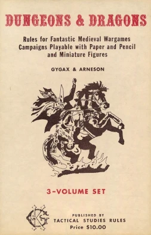
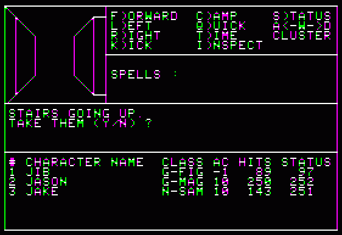
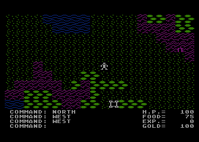
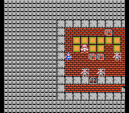
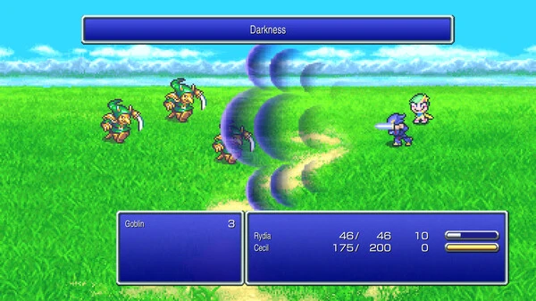
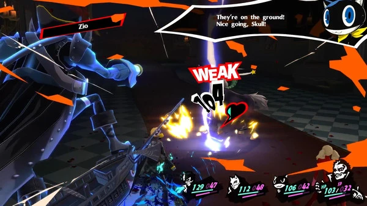
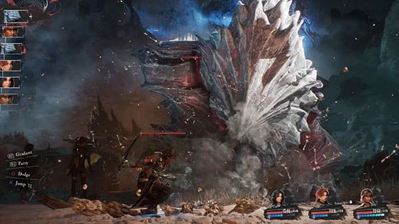

# ターンベースRPGの進化史
## ――テーブルトップの夜明けから「リアクティブ・ターン制」の現代まで

***

## はじめに

ターンベースRPGは「コマンドを選んで待つ、静的な戦闘形式」という批判をたびたび受けながら、それでも半世紀にわたって生き続けてきた。その理由は単純だ――深い戦略性と明確なフィードバックが生み出す「考える喜び」は、反射神経に依存するアクションゲームとは本質的に異なる体験を提供するからである。本レポートでは、テーブルトップゲームを源流とし、CRPGの誕生、JRPGの隆盛、ATBシステムの革新、ペルソナシリーズの台頭、F2P時代の到達点としての『崩壊：スターレイル』、そして2025年の『Clair Obscur: Expedition 33』による新たな頂点まで、ターンベースRPGの設計哲学がどのように進化してきたかを体系的に解説する。

***

## 第1章：源流――ウォーゲームとD&Dの誕生（〜1974年）

*画像引用: [Wikipedia - Dungeons & Dragons (1974)](https://en.wikipedia.org/wiki/Dungeons_%26_Dragons_%281974%29) / オリジナル版Dungeons & Dragonsのボックスセット。本文中のTRPG史解説のため引用。*

ターン制戦闘の概念は、RPGより遥か以前から存在していた。それはテーブルトップの「ウォーゲーム」文化に根ざしている。ミニチュアを盤上に並べ、交互に駒を動かす形式は19世紀の軍事シミュレーションに端を発し、20世紀に入ってからChainmail（1971年）などのゲームを経て、ついに1974年、**ダンジョンズ＆ドラゴンズ（D&D）** が誕生する。[[1](#ref-1)]

D&Dを生み出したのはゲイリー・ガイギャックスとデイヴ・アーンスンの二人だった。このゲームは現代でも通じるRPGの基礎概念――キャラクタークラスと能力値、種族、経験点（EXP）、ヒットポイント（HP）、レベルアップ、そして **ターン制戦闘** ――を一挙に定義した。戦闘は「プレイヤーが行動を宣言し、ダイスを振って結果を判定する」という順番制の処理で行われ、これが今日のコンピュータRPGにおけるコマンド入力→結果表示のサイクルの直接の祖先となった。[[2](#ref-2)][[3](#ref-3)]

> **【コラム：D&DとAD&D】**  
> D&Dは1977年にBasic版とAdvanced版（AD&D）に分岐した。AD&Dは戦闘ルール、魔法システム、モンスターの分類を大幅に精密化したバージョンであり、1980年代初頭にコンピュータRPGを開発した若者たちが最も参照したルールブックはAD&Dである。WizardryもUltimaも「AD&Dをコンピュータで遊べるようにする」という動機から生まれた。

***

## 第2章：CRPGの二大始祖――UltimaとWizardry（1981年）

1981年は、コンピュータRPG（CRPG）の歴史において決定的な年だった。この年に **Wizardry**（Sir-Tech）と **Ultima**（Origin Systems）が相次いでApple IIに登場したのである。[[4](#ref-4)]

*画像引用: [MobyGames - Wizardry: Proving Grounds of the Mad Overlord (Apple II) screenshot](https://www.mobygames.com/game/1209/wizardry-proving-grounds-of-the-mad-overlord/screenshots/apple2/43910/) / Apple II版のゲーム画面。本文中の作品解説のため引用。*

*画像引用: [The Avocado - Franchise Festival #68: Ultima (Part One)](https://the-avocado.org/2019/09/20/franchise-festival-68-ultima-part-one/) / 『Ultima』Atari 8-bit版の画面。本文中の作品解説のため引用。*

| タイトル | 発売年 | 視点 | 戦闘形式 | 後のJRPGへの影響 |
|---------|--------|------|----------|-----------------|
| Wizardry | 1981 | 一人称3Dダンジョン | パーティ制ターンコマンド戦闘 | ドラクエの戦闘画面・魔法体系 |
| Ultima | 1981〜 | 俯瞰2Dマップ | 別画面コマンド戦闘（Ultima III〜） | ドラクエのフィールドマップ |

**Wizardry** は「3Dダンジョン探索＋パーティ制ターン制戦闘」の始祖であり、最大6人のパーティを組んで一人称視点のダンジョンを探索する形式は、当時D&Dのプレイヤーたちに「一人でもD&Dが遊べる」という衝撃を与えた。一方、**Ultima** はロード・ブリティッシュことリチャード・ギャリオットが開発した。前作『Akalabeth』（1979年）をベースに進化させたこのシリーズは、広大な2Dフィールドマップと街・ダンジョンの往来を特徴とした。[[5](#ref-5)][[6](#ref-6)][[4](#ref-4)]

この二作が持つ異なる強みは、後に「Wizardryの戦闘システム＋Ultimaのフィールドマップ」という形で統合され、JRPGの原型を生み出すことになる。[[7](#ref-7)][[4](#ref-4)]

> **【設計者の視点】**  
> Wizardryのターン制戦闘は、実はD&DよりもAD&Dに近い厳密な判定ロジックを持っていた。攻撃の命中・回避はアーマークラス（AC）と攻撃ボーナスの比較によって計算され、「ランダム性の中に戦略性を埋め込む」設計は、今日のコマンドRPGの数値設計の基礎をなしている。

***

## 第3章：日本へ――ドラゴンクエストとJRPGの誕生（1986年）

CRPGが日本に輸入されるにあたり、重要な中継地点が存在した。それが1984年に発売された **ザ・ブラック・オニキス**（Bullet-Proof Software）だ。オランダ生まれのアメリカ人ヘンク・ロジャースが日本でWizardryに相当するゲームがないことに気づいて開発した本作は、15万本を超えるヒットとなり、「日本でもRPGが売れる」ことを証明した。[[8](#ref-8)]

そして1986年、堀井雄二、中村光一、鳥山明の三者が集結して **ドラゴンクエスト** が誕生する。堀井はUltimaの俯瞰マップとWizardryの戦闘・ステータス画面を組み合わせて、ファミコンという非力なハードでも動作する設計に落とし込んだ。戦闘はWizardry寄りの「画面端に配置した敵を正面から見るコマンド選択式」を採用したが、最大の革新は **「複雑さの排除」** にあった。[[7](#ref-7)]

*画像引用: [MobyGames - Dragon Warrior (NES) screenshot](https://www.mobygames.com/game/9223/dragon-warrior/screenshots/nes/42494/) / 北米NES版『Dragon Warrior』（『ドラゴンクエスト』）のゲーム画面。本文中の作品解説のため引用。*

堀井は「日本人の生活観にあった設計」を重視した。「頑張り続ければ必ず報われる」という体験設計を意識し、レベルを上げさえすれば誰でも先に進めるバランスを徹底した。コマンドはたった4〜5種類、魔法名は直感的なカタカナ造語（メラ、ギラ、ホイミ……）、そして鳥山明のカラフルなキャラクターデザインが「RPGは難しそう」という壁を取り払った。[[9](#ref-9)]

ドラゴンクエストは日本で爆発的なヒットを記録し、続編ごとに記録を更新。第3弾（1988年）では販売時に社会問題となるほどの行列が生じた。堀井自身が行列に出向いて確認したという逸話も残っている。JRPGというジャンル名が示す通り、ドラゴンクエストは「日本固有のRPG文化」の始点となった。[[10](#ref-10)]

***

## 第4章：時を操るATB――ファイナルファンタジーIV（1991年）

ドラゴンクエストが「コマンド制ターン制RPGの様式」を確立した一方、1991年にスクウェアがスーパーファミコンで発売した **ファイナルファンタジーIV** は、そのターン制概念に根本的な問いを投げかけた。

*画像引用: [Steam - FINAL FANTASY IV](https://store.steampowered.com/app/1173800/FINAL_FANTASY_IV/) / 『FINAL FANTASY IV』ピクセルリマスターの戦闘画面。本文中のATB解説のため引用。*

**「なぜ、プレイヤーが考えている間、敵は静止して待っているのか？」**

この問いに答えたのが、バトルデザイナーの **伊藤浩之** が考案した **アクティブタイムバトル（ATB）** システムだ。ATBは「各キャラクターと敵が独立した内部タイマーを持ち、ゲージが溜まった者から行動できる」という仕組みである。これは従来の「プレイヤー全員行動→敵全員行動」という交互ターン制から、**時間軸上の連続的なアクション** へとパラダイムを転換した。[[11](#ref-11)]

### ATBの主要な特徴

- **速度ステータスの意義化**：素早さが高いキャラクターは行動頻度が増え、単純なHP/攻撃力の大小ではない戦力差が生まれる[[11](#ref-11)]
- **アクティブモード/ウェイトモード**：アクティブモードではメニュー操作中も時間が流れるため、慣れないプレイヤーは「ウェイト（メニュー中は停止）」を選択できる[[12](#ref-12)]
- **ヘイスト/スロウ魔法の戦略的意義**：時間を操る魔法がATBゲージの充填速度を変えることで、タイム・マネジメントが戦略の軸になる[[13](#ref-13)]

ATBは1995年に特許取得（伊藤浩之・坂口博信名義）され、特許が2010年に失効するまで他社が容易に採用できなかった。その後のFFシリーズ（V〜IX）はすべてATBを採用し、クロノ・トリガー（1995年）はATBと「戦闘フィールド上の敵の位置」を組み合わせた発展形を実現した。[[14](#ref-14)][[11](#ref-11)]

> **【設計者の視点：FFXのCTBへの転換】**  
> ファイナルファンタジーXでは、ターン制に回帰するかたちで **CTB（コンディショナルターンバトル）** が採用された。これは「誰が次に行動するか」を画面上の行動順リストで可視化する方式で、ATBが持つ「焦り」の要素を除去し、純粋な戦略思考を促す設計だ。FFXのバトルディレクターを務めた土田俊郎はあえてATBを捨て、「考えるための空間」を取り戻した。[[15](#ref-15)][[11](#ref-11)]

***

## 第5章：弱点と連鎖の美学――ペルソナシリーズとプレスターン（2006年〜）

2000年代以降、ターン制コマンドRPGは「古い」「時代遅れ」という評価にさらされるようになっていた。だが、アトラスのペルソナシリーズはその潮流に真っ向から対抗した。

### ペルソナシリーズのバトル設計の核心：ワンモアバトル

ペルソナシリーズ（ペルソナ3以降）で採用されている **ワンモアバトル** システムの仕組みは以下の通りだ：[[16](#ref-16)][[17](#ref-17)]

1. **弱点を突く／クリティカルを出す** → 追加行動「ONE MORE」が発生し、もう一度コマンドを入力できる
2. **バトンタッチ（P5から）** → ONE MOREを別のキャラクターに譲渡できる。受け取ったキャラは攻撃力がアップ
3. **全員ダウン** → 全員がダウン状態になると「総攻撃」が発動し、大ダメージを与えて戦闘終了
4. **敵も同じルールで動く** → プレイヤーが弱点を突かれると敵もONE MOREを得る。「自分の弱点を管理する」という双方向の緊張感が生まれる

このシステムは親シリーズの真・女神転生シリーズが持つ **プレスターンバトル**（弱点攻撃でターンアイコンが増加し、最大でターンが倍になる設計）を、より直感的かつアクション的に再解釈したものだ。[[18](#ref-18)][[19](#ref-19)]

> **プレスターン vs ワンモアの違い（ゲームデザイン的観点）**  
> プレスターン（SMT）では4人パーティが全員弱点を突くと8回行動できる。ワンモア（P5）では弱点を突いたキャラが再行動できるだけだが、バトンタッチにより最大で4人×4回=16回の行動連鎖も理論上可能。よりアグレッシブな連鎖設計になっている一方、SMTのプレスターンの方がターン喪失のリスクが厳しい（攻撃が吸収・反射されると即座に全ターンを失う）。[[18](#ref-18)]

### ペルソナ5（2016年）と世界的評価

**ペルソナ5**（2016年発売、PS3／PS4）は、このワンモアシステムをさらに洗練させた。スタイリッシュなUIデザイン、怪盗団のアクションとシームレスに接続されたダンジョン攻略、「社会リンク（コープ）」による日常パートとの有機的な結合――これらの要素が合わさり、「コマンド選択制ターン制RPGでも、これほど映画的でスタイリッシュな体験ができる」ことを世界に証明した。[[20](#ref-20)]

*画像引用: [Steam - ペルソナ５ ザ・ロイヤル](https://store.steampowered.com/app/1687950/Persona_5_Royal/) / 『ペルソナ５ ザ・ロイヤル』の戦闘画面。本文中のワンモアバトル解説のため引用。*

2017年の **The Game Awards** でペルソナ5はBest Role-Playing Gameを受賞した。これは「ターン制コマンドバトルのJRPGが初めてこの賞を受賞した」快挙であり、JRPGの世界的な復権を象徴するマイルストーンとなった。ペルソナ5と『P5 ザ・ロイヤル』の累計販売本数は2025年8月時点で1,000万本（約1,045万本）を突破している。[[21](#ref-21)][[22](#ref-22)][[23](#ref-23)]

ペルソナチームは続いて2024年に **メタファー：リファンタジオ** をリリース。発売当日に累計100万本を突破し、アトラス作品史上最速の売れ行きを記録。**ターン制戦闘とリアルタイムアクション（フィールド上での奇襲）** を組み合わせた新設計で、The Game Awards 2024のBest RPGも受賞している。[[24](#ref-24)]

***

## 第6章：基本プレイ無料とターン制の新フロンティア――崩壊：スターレイル（2023年）

2023年4月に登場した **崩壊：スターレイル**（HoYoverse）は、基本プレイ無料＋キャラクターや光円錐の「跳躍」（ガチャ）という運営型タイトルの枠組みに、あえてターン制RPGを組み合わせた作品だ。同じHoYoverseの『原神』がリアルタイムアクションを前面に出したのに対し、本作はコマンド選択型のバトルを採用した。アクション操作を得意としないプレイヤーにも届く設計にした点が、スターレイルの大きな特徴である。[[25](#ref-25)]

*画像引用: [PlayStation - Honkai: Star Rail](https://www.playstation.com/en-us/games/honkai-star-rail/) / 公式スクリーンショット。本文中のバトルシステム解説のため引用。*

### スターレイルのバトルシステム設計

| 要素 | 詳細 |
|------|------|
| アクションバー | 味方と敵の行動順を画面上で確認でき、次に誰が動くかを見ながらコマンドを選べる[[26](#ref-26)] |
| SP管理 | 通常攻撃でSPを1回復し、戦闘スキルでSPを1消費する。SPはパーティ全体で共有されるため、誰に戦闘スキルを使わせるかが重要になる[[26](#ref-26)] |
| 靭性と弱点撃破 | 敵の弱点属性で攻撃して靭性を削り切ると弱点撃破が発生し、ダメージや行動順への影響が生まれる[[26](#ref-26)] |
| 必殺技 | EPが溜まると発動可能になり、通常の行動順に割り込んで使える。ターン制でありながら、任意のタイミングで戦況に介入できる[[26](#ref-26)] |
| 速度と行動順 | 速度が高いほど行動順が早く回りやすく、長期戦では行動回数の差として表れる[[26](#ref-26)] |

このシステムは、コマンドを選んだ結果がすぐに返ってくるテンポの良さと、行動順を見ながら次の一手を組み立てる計画性を両立させている。短時間でも遊びやすく、タッチ操作でも状況を把握しやすい点で、モバイルとターン制の相性をうまく活かした設計といえる。[[27](#ref-27)]

### 基本プレイ無料とターン制の商業的成功

スターレイルは2025年3月に、サービス開始からわずか23ヶ月でモバイル累計収益20億ドル（約3,000億円）を突破した。2024年通年のモバイル収益は8億7,090万ドルに達し、同じHoYoverseの『原神』の7億3,010万ドルを上回った。月間アクティブユーザーは2025年2月時点で3,010万人。[[28](#ref-28)][[29](#ref-29)]

「ターン制RPGは基本プレイ無料の運営型ゲームに向いていない」という先入観を覆し、**ターン制の戦略性がプレイヤーの継続率を支える** ことを示した点でも重要な事例だ。

> **【ゲームデザイン的考察】**  
> 運営型ゲームにターン制が向いている理由の一つに、キャラクターごとの役割を見せやすいことがある。アクションゲームでは操作技術で補える場面も多いが、ターン制では通常攻撃、戦闘スキル、必殺技、属性、速度といった性能差がそのまま編成の意味につながる。新キャラクターの強みをプレイヤーに伝えやすく、跳躍による入手動機とも結びつきやすい。

***

## 第7章：タイミングの再発見――インタラクティブなターン制の系譜

スターレイルやペルソナとは別の方向で、「ターンの間にプレイヤーを参加させる」という設計アプローチが長年模索されてきた。この系譜を理解することは、Clair Obscurを正確に評価するために不可欠だ。

| タイトル | 年 | 実装されたインタラクション |
|---------|-----|--------------------------|
| スーパーマリオRPG | 1996 | 攻撃・防御の瞬間にボタン入力でダメージ増幅/軽減[[30](#ref-30)] |
| レジェンド オブ ドラグーン | 1999 | 攻撃タイミングでボタン入力を連打するADDITIONSシステム[[30](#ref-30)] |
| シャドウハーツ | 2001〜 | ジャッジメントリング（回転する盤に合わせたタイミング入力）[[30](#ref-30)] |
| ロストオデッセイ | 2007 | 攻撃にリング型タイミング入力[[30](#ref-30)] |
| 龍が如く7 光と闇の行方 | 2020 | ターン制移行＋タイミング入力による強化攻撃[[31](#ref-31)] |
| Sea of Stars | 2023 | クロノ・トリガー影響下の完全タイミング統合ターン制[[30](#ref-30)] |

特に注目すべきは **龍が如く** シリーズの転換だ。2020年の7作目は開発中に「RPGスタイルのエイプリルフールPV」が予想外に好評だったため、急遽ターン制RPGへと設計変更された。コマンド制ながら戦闘フィールド内でのキャラクター位置や環境オブジェクトを活用できる独自システムを実装し、続編『龍が如く８』ではさらに洗練された。[[32](#ref-32)][[20](#ref-20)][[45](#ref-45)]

*画像引用: [Steam - 龍が如く７ 光と闇の行方 インターナショナル](https://store.steampowered.com/app/1235140/Yakuza_Like_a_Dragon/) / 公式スクリーンショット。本文中のターン制移行解説のため引用。*

***

## 第8章：ターン制の頂点――Clair Obscur: Expedition 33（2025年）

2025年4月24日、フランスのインディースタジオ **Sandfall Interactive**（わずか30人規模）が開発し、Kepler Interactiveが発売した **Clair Obscur: Expedition 33** は、ターン制RPGというジャンルの可能性を更新した作品として世界的に評価されている。

### 世界観と背景

舞台は「ベル・エポック（世紀末のフランス）」をモチーフにした幻想世界。毎年「ペイントレス（絵描き）」と呼ばれる謎の存在が数字を描くことで、その年齢以下の人間が全員消滅する「消去（ゴマージュ）」が繰り返される世界で、33番目の遠征隊が真相に挑む。[[33](#ref-33)]

### バトルシステム：リアクティブターン制

Expedition 33は **「リアクティブターンベースRPG」** と自ら名乗る。その特徴は以下の通りだ：[[34](#ref-34)]

*画像引用: [セガ - Clair Obscur: Expedition 33](https://www.sega.jp/game/detail/expedition33/) / 公式スクリーンショット。本文中のリアクティブターン制解説のため引用。*

- **攻撃にQTE（クイックタイムイベント）**：スキル使用時に画面上に現れる入力タイミングをクリアすると、ダメージや効果が増幅される[[33](#ref-33)]
- **回避（ドッジ）**：敵の攻撃に短い回避ウィンドウがあり、タイミングよく発動すると回避できる[[35](#ref-35)]
- **パリィ（受け流し）**：さらに精密なタイミングでのパリィ成功は強力なカウンター攻撃につながる[[35](#ref-35)][[33](#ref-33)]
- **キャラクター固有メカニズム**：主人公ギュスターヴは『チャージ』を蓄積して『オーバーチャージ』で大ダメージを与える、魔法使いのルネは「ステイン」蓄積による呪文強化、剣士のマエルは姿勢（構え）切り替えによる戦術変化など、キャラクターごとに独自のバトルロジックが存在する[[33](#ref-33)]

このシステムは「ペルソナのスタイリッシュなUI」「ファイナルファンタジーのターン管理」「レジェンド オブ ドラグーンのタイミング入力」「スーパーマリオRPGのQTE精神」を統合し昇華させたものと評された。[[36](#ref-36)][[33](#ref-33)]

### 受賞と販売成績

Expedition 33のメタスコアは93点。発売後3日で100万本を突破し、2025年12月の **The Game Awards 2025でGame of the Year（GOTY）を含む9冠** を達成した。GOTY受賞後はSteamとPS5での1日あたり販売本数が6倍に跳ね上がり、2026年4月（発売1周年）時点で累計800万本を突破している。[[37](#ref-37)][[38](#ref-38)][[39](#ref-39)][[34](#ref-34)]

Xbox Game Passへのデイワン収録がサブスクリプションサービスの「売上を食い潰す」という通説に反してむしろ認知拡大に貢献したとも分析されており、インディースタジオとサブスクリプション戦略の親和性についても重要な事例となった。[[40](#ref-40)]

Larian Studios（バルダーズ・ゲート3開発元）のパブリッシング・ディレクターは「ターン制RPGとして適切な品質と価格設定があれば、900万〜1,500万本規模のヒットが可能だ」という見解を示しており、Expedition 33の成功はターン制RPG市場の底力を改めて証明した。[[41](#ref-41)]

***

## 第9章：2020年代のターン制RPGルネッサンス

以上の文脈を踏まえると、2020年代は「ターン制RPGの第二黄金期」と呼べる状況になっていることがわかる。

### 2020年代の主要タイトルと評価

| タイトル | 年 | 特徴 | 成果 |
|---------|-----|------|------|
| 龍が如く7 光と闇の行方 | 2020 | 既存ACTシリーズのターン制転換 | シリーズ最高評価の一作[[21](#ref-21)] |
| バルダーズ・ゲート3 | 2023 | D&D準拠のターン制CRPG | GOTY 2023受賞、世界的ヒット[[42](#ref-42)] |
| 崩壊：スターレイル | 2023 | F2Pガチャ×ターン制 | 23ヶ月で累計収益20億ドル[[28](#ref-28)] |
| メタファー：リファンタジオ | 2024 | アクション奇襲＋プレスターン | 最速100万本、GOTY 2024 Best RPG[[24](#ref-24)] |
| DQ III HD-2Dリメイク | 2024 | クラシックターン制の現代的再解釈 | 発売3週間で世界200万本以上[[43](#ref-43)] |
| Clair Obscur: Expedition 33 | 2025 | リアクティブターン制の頂点 | GOTY 2025含む9冠、800万本[[39](#ref-39)][[34](#ref-34)] |

アトラスのペルソナチームを率いる和田和久は「ターン制RPGの復活と騒がれているが、自分たちは一度も諦めていない」と語っている。これは重要な視点だ――ターン制RPGは死んでいたのではなく、「主流から外れた時期に純化と深化を続けていた」のである。[[44](#ref-44)]

***

## まとめ：ターン制RPGが生き続ける理由

50年にわたるターン制RPGの進化を振り返ると、以下のような設計思想の進化が見えてくる。

| 時期 | 代表的な作品・潮流 | 設計思想の転換 |
|------|--------------------|----------------|
| 1974年 | D&D | ルール化された戦闘の抽象化 |
| 1981年 | Wizardry / Ultima | コンピュータへの移植と「一人でも遊べる」化 |
| 1986年 | ドラゴンクエスト | コンソール向け簡略化と、戦闘・探索・成長の物語化 |
| 1991年 | FF IV ATB | 時間軸の導入による「待つ」戦闘からの脱却 |
| 2006年〜 | ペルソナ3以降 | 弱点連鎖とターン数の増減を戦略資源にする設計 |
| 2023年 | 崩壊：スターレイル | 基本プレイ無料市場に合わせたターン制最適化と、可視的な行動順 |
| 2025年 | Clair Obscur | 防御行動のリアルタイム化と、全行動への参加意識 |

ターン制RPGが生き続ける根本的な理由は、「思考と意思決定そのものをゲームプレイにする」という設計哲学にある。アクションゲームが反射神経と身体的スキルを試すとすれば、ターン制RPGは計画、読み、資源管理、そして相手のパターン解析という **知的な格闘** を提供する。

Clair Obscur: Expedition 33は「ターン制でも、プレイヤーが受動的な観客になる必要はない」ことを究極のかたちで証明した。防御においても常に集中と判断を要求するその設計は、D&Dからの50年間の積み重ねを一枚のゲームに凝縮している。そして次の50年に向けて、このジャンルはまだ進化の途上にある。

---

## References

1. [How D&D Grew Out of Historical Wargames][1] - Dungeons & Dragons has influenced all gaming since its inception, but D&D itself is an inspiration b...

2. [Dungeons & Dragons][2] - The game was first published in 1974 by Tactical Studies Rules (TSR).

3. [A history of RPGs][3] - The roots of the modern RPG videogame can be traced back to tabletop games and beyond.

4. [第一回】初代ドラクエはRPGへの逆風の中に生まれた][4] - 『ウィザードリィ』と『ウルティマ』の誕生をドラクエの原型として紹介している。

5. [知られざる初期ウルティマ - 神殿岸2 - はてなブログ][5] - 初期ウルティマの2Dマップと3Dダンジョンの特徴について述べている。

6. [RPGのルーツ][6] - ウルティマやウィザードリィなど初期RPGの受容についてまとめている。

7. [Dragon Quest][7] - Dragon Quest series overview and historical background.

8. [1982-1987 - The Birth of Japanese RPGs, re-told in 15 Games][8] - Japanese RPG origins and early influential titles.

9. [Analyzing Japanese Game Design 1985 - 1995][9] - Horii's design philosophy and Japanese game design context.

10. [How Dragon Quest Spawned an Urban Legend][10] - Dragon Quest's cultural impact and launch-day legend.

11. [Active Time Battle][11] - ATB is a role-playing video game mechanic invented by Hiroyuki Ito.

12. [Active Time Battle ｜ Final Fantasy Wiki][12] - The ATB system was first used in Final Fantasy IV.

13. [Turn-based, ATB, or other? What combat style do you prefer?][13] - Discussion of ATB, CTB, and Final Fantasy battle systems.

14. [Chrono Trigger - Parry Everything][14] - Chrono Trigger's turn-based design and field-position elements.

15. [Battle system ｜ Final Fantasy Wiki - Fandom][15] - Overview of Final Fantasy battle systems, including ATB and CTB.

16. [『ペルソナ5』レビュー 大幅な進化と変わらない“らしさ”が融合 ...][16] - ペルソナ3以降のワンモアバトルについて触れている。

17. [31日目 ワンモアプレスバトルシステム！！！ - きりちにの日記][17] - ペルソナ5のワンモアプレスバトルを紹介している。

18. [プレスターン変遷｜ヒンツ・ヤン][18] - ATLUSのプレスターンバトルの変遷についてまとめている。

19. [「プレスターン」 vs 「ワンモア」 : r/PERSoNA][19] - Press Turn and One More systems are compared in discussion.

20. [『JRPG』が復活した6つの理由と10年前に指摘された ... - Kultur][20] - コマンド選択だけではないターン制戦闘の進化について述べている。

21. [2024年はJRPGの年だった！――The Game Awards ...][21] - 『ペルソナ5』がJRPG復権のきっかけだった可能性に触れている。

22. [全世界が選ぶ「The Game Awards 2017」にて『ペルソナ5』が ...][22] - 『ペルソナ5』のBest Role-Playing Game受賞告知。

23. [ATLUS's Latest Title Metaphor: ReFantazio Releasing Today!][23] - Metaphor's battle system combines quick action with turn-based combat.

24. [Metaphor: ReFantazio][24] - Metaphor: ReFantazio overview and release information.

25. [The reason Honkai: Star Rail needed to have turn-based ...][25] - Turn-based combat advantages and slower pace of gameplay.

26. [Inside Honkai: Star Rail's Turn-Based Combat System][26] - Honkai: Star Rail's core combat loop and battle mechanics.

27. [Honkai Star Rail is a masterclass in turn-based combat ...][27] - Discussion of Honkai: Star Rail's turn-based combat and endgame.

28. [Honkai: Star Rail Statistics 2026][28] - Honkai: Star Rail mobile revenue and active user statistics.

29. [Honkai: Star Rail rockets past $2bn on mobile in under two ...][29] - Honkai: Star Rail mobile revenue compared with Genshin Impact.

30. [The Evolution of Active Turn-based RPGs][30] - Active turn-based RPG lineage from Super Mario RPG onward.

31. [Yakuza: Like a Dragon][31] - Yakuza: Like a Dragon overview and turn-based RPG shift.

32. [Yakuza: Like a Dragon's turn-based combat came from an ...][32] - The turn-based combat change came from an April Fools concept.

33. ['Clair Obscur: Expedition 33' Makes Turn-Based Combat ...][33] - Expedition 33 combat blends style with turn-based systems.

34. [『Clair Obscur: Expedition 33』リリース一周年で全世界売上 ...][34] - リリース一周年で全世界売上800万本突破を報告している。

35. [Expedition 33 Is a Stunning RPG That Feels Both Classic & ...][35] - Review describing Expedition 33 as a classic and modern RPG.

36. [I Hate Turn-Based Games, I Love 'Clair Obscur: Expedition ...][36] - Review praising Expedition 33's story, characters, and systems.

37. [爆売れ】「Clair Obscur: Expedition 33」全世界で800万本の ...][37] - Expedition 33の全世界累計販売本数800万本達成を報じている。

38. [『Clair Obscur: Expedition 33』が500万本達成 新エリア・新 ...][38] - Expedition 33の高評価と販売実績について報じている。

39. [大ヒットRPG『Clair Obscur: Expedition 33』、「GOTY受賞後」 ...][39] - GOTY受賞後の売上増加について報じている。

40. [『Clair Obscur: Expedition 33』が発売1年で800万本超えの ...][40] - Xbox Game Passデイワン登場と販売実績について述べている。

41. [Baldur's Gate 3 publishing director weighs in on the ...][41] - Baldur's Gate 3 publishing director comments on modern turn-based RPG potential.

42. [Sorry, Baldur's Gate 3 Isn't Leading To A Classic RPG ...][42] - Baldur's Gate 3 and the classic RPG genre discussion.

43. [DRAGON QUEST III HD-2D REMAKE SELLS MORE THAN ...][43] - Dragon Quest III HD-2D Remake sales announcement.

44. [アトラスの『ペルソナ』チームを率いる和田和久氏がターン制 ...][44] - 和田和久氏のターン制RPGに関する見解を紹介している。

45. [龍が如く８｜セガ SEGA][45] - セガ公式の商品ページで日本向けタイトルが『龍が如く８』と表記されている。

[1]: https://www.cbr.com/dnd-historical-wargame-roots/
[2]: https://en.wikipedia.org/wiki/Dungeons_&_Dragons
[3]: https://www.denofgeek.com/games/a-history-of-rpgs/
[4]: https://news.denfaminicogamer.jp/column03/game-gatari01
[5]: https://kandatas.hatenablog.com/entry/2026/02/08/210028
[6]: https://web6047.sakura.ne.jp/cgi-bin/prj/20180306-home%EF%BC%8FRPG%E9%96%8B%E7%99%BA/20180306-RPG%E3%81%AE%E3%83%AB%E3%83%BC%E3%83%84/RPG%E3%81%AE%E3%83%AB%E3%83%BC%E3%83%84.pdf
[7]: https://en.wikipedia.org/wiki/Dragon_Quest
[8]: https://crpgbook.wordpress.com/articles/1982-1987-the-birth-of-japanese-rpgs-re-told-in-15-games/
[9]: https://scholarship.shu.edu/cgi/viewcontent.cgi?article=3905&context=dissertations
[10]: https://www.ign.com/articles/how-dragon-quest-spawned-an-urban-myth
[11]: https://en.wikipedia.org/wiki/Active_Time_Battle
[12]: https://finalfantasy.fandom.com/wiki/Active_Time_Battle
[13]: https://www.reddit.com/r/FinalFantasy/comments/7jl8r4/turnbased_atb_or_other_what_combat_style_do_you/
[14]: https://parryeverything.com/tag/chrono-trigger/
[15]: https://finalfantasy.fandom.com/wiki/Battle_system
[16]: https://automaton-media.com/articles/impressionjp/persona5-review/
[17]: https://kiritiny.hatenablog.com/entry/2021/09/08/001126
[18]: https://note.com/hi_tyan763/n/neb08bffebd2d
[19]: https://www.reddit.com/r/PERSoNA/comments/1i6pluc/press_turn_vs_one_more/
[20]: https://kultur.jp/why-jrpgs-are-back/
[21]: https://jp.ign.com/metaphor-re-fantazio/77908/feature/2024jrpgthe-game-awards-2024best-rpgjrpg
[22]: https://p-ch.jp/news/863/
[23]: https://blog.playstation.com/2024/10/10/20241011-refantazio/
[24]: https://en.wikipedia.org/wiki/Metaphor:_ReFantazio
[25]: https://automaton-media.com/en/column/20230523-19046/
[26]: https://ourcodeworld.com/articles/read/2721/inside-honkai-star-rails-turn-based-combat-system
[27]: https://www.reddit.com/r/JRPG/comments/132ldvs/honkai_star_rail_is_a_masterclass_in_turnbased/
[28]: https://rec0ded88.com/pt/statistics/honkai-star-rail/
[29]: https://www.pocketgamer.biz/honkai-star-rail-rockets-past-2bn-on-mobile-in-under-two-years/
[30]: https://lordsofgaming.net/2025/04/the-evolution-of-active-turn-based-rpgs/
[31]: https://en.wikipedia.org/wiki/Yakuza:_Like_a_Dragon
[32]: https://www.gamedeveloper.com/design/-i-yakuza-like-a-dragon-i-s-turn-based-combat-came-from-an-april-fools-joke-that-went-too-well
[33]: https://www.vice.com/en/article/clair-obscur-expedition-33-is-the-turn-based-rpg-youve-been-dreaming-about-for-years-review/
[34]: https://www.gamespark.jp/article/2026/04/24/165655.html
[35]: https://www.inverse.com/gaming/clair-obscur-expedition-33-review
[36]: https://www.forbes.com/sites/paultassi/2025/04/29/i-hate-turn-based-games-i-love-clair-obscur-expedition-33/
[37]: https://ascii.jp/elem/000/004/398/4398924/
[38]: https://jp.ign.com/clair-obscur-expedition-33/81239/news/clair-obscur-expedition-33-500
[39]: https://automaton-media.com/articles/newsjp/clair-obscur-expedition-33-20251217-375147/
[40]: https://mudauchi.info/gnr/articles/8076/
[41]: https://automaton-media.com/en/news/baldurs-gate-3-publishing-director-weighs-in-on-the-potential-success-of-a-modern-turn-based-final-fantasy/
[42]: https://screenrant.com/baldurs-gate-3-crpg-genre-bg3/
[43]: https://press.na.square-enix.com/DRAGON-QUEST-III-HD-2D-REMAKE-SELLS-MORE-THAN-2-MILLION-UNITS-WORLDWID
[44]: https://mudauchi.info/gnr/articles/9717/
[45]: https://www.sega.jp/game/detail/ryu-ga-gotoku-eight
