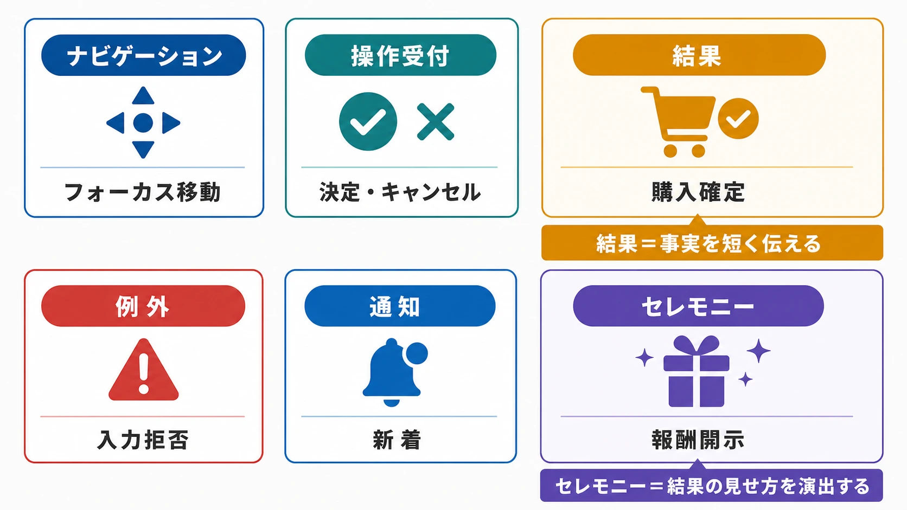
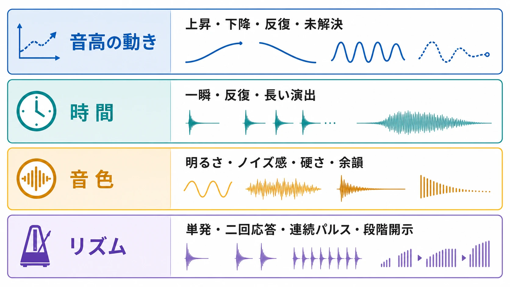
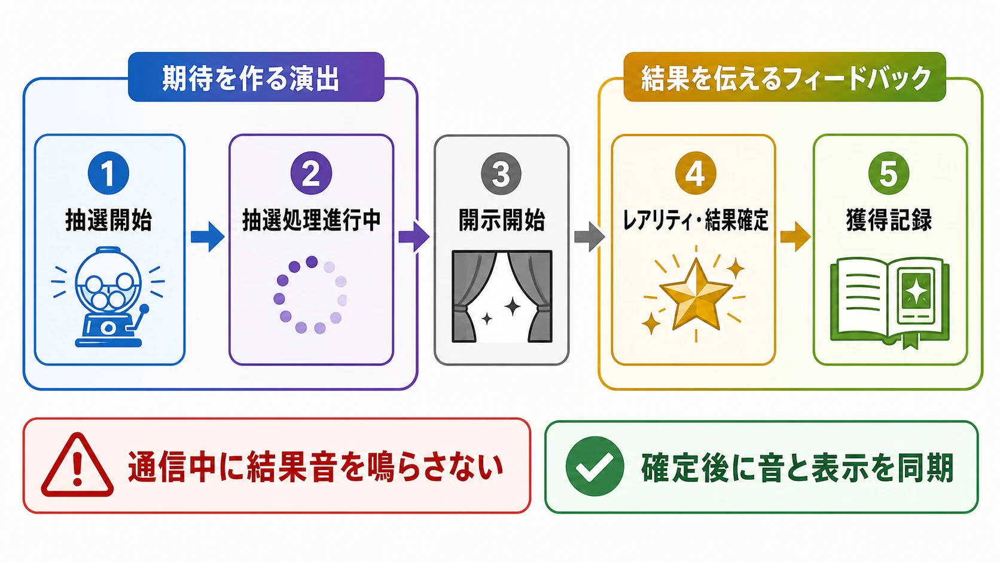
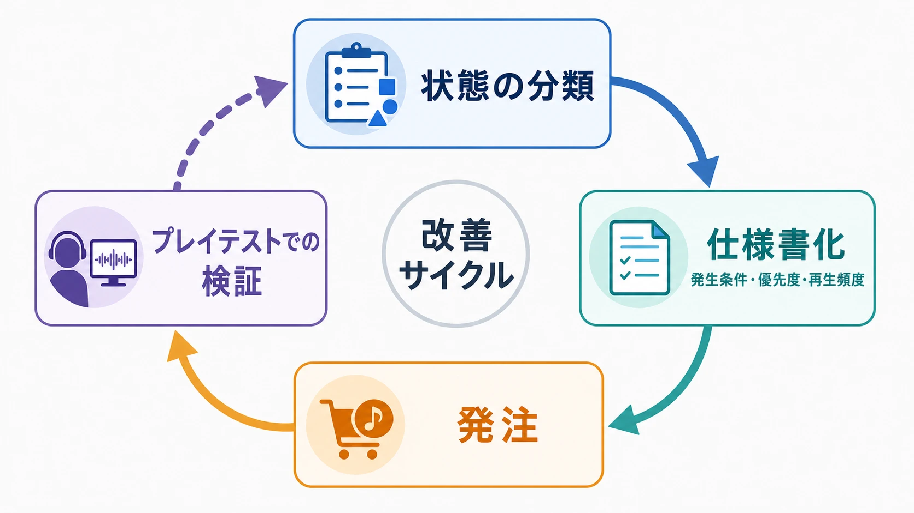

# UIサウンド・フィードバックSE設計基礎
### ゲームプランナーが「状態を伝える音」を仕様化するために

## はじめに：UIサウンドは「状態を伝える音」である

ゲームの音を考えるとき、最初に思い浮かぶのは、森の風や街の雑踏のような環境音、あるいは場面の感情を導く音楽かもしれない。これらは重要な設計領域である。一方、ボタンを選んだ、購入が確定した、操作が受け付けられなかった、新しい通知が届いた、リザルトが確定した、といった出来事を短い音で伝える仕事もある。本稿ではこれを **UIサウンド** と呼ぶ。

UIサウンドは、単に「メニューで鳴る効果音」ではない。プレイヤーの入力やシステムの処理に対して、いま何が起きたのか、次に何をすべきか、処理が終わったのかを伝えるフィードバックである。AppleのHuman Interface Guidelinesも、フィードバックを「現在の状態」「重要な操作の成功・失敗」「警告」「誤りを直す機会」を知らせるものとして整理している。音だけでなく、色、文字、ハプティクスなどを組み合わせて、受け取り方を増やすことも求めている。[[1](#ref-1)]

ここで、本ブログの既存のサウンド記事との境界を明確にしておきたい。環境音はゲーム内の空間や出来事に属する音であり、音楽は時間の流れや感情の方向を設計する音である。UIサウンドは、画面上の操作対象やシステム状態に結びつく音だ。購入確定音、エラー音、通知音、リザルト演出音などは、画面を閉じたあとに世界の中で鳴り続ける音ではなく、操作と状態の関係を理解させるために鳴る。

たとえば、ショップで商品を選んだ時点の音は「選択した」というUIサウンドである。サーバーから購入成功が返ったあとに鳴る音は「取引が確定した」という状態フィードバックである。そこにキャラクターが喜ぶ声や、世界の中でコインが落ちる音を重ねることはできるが、それらは別の役割を持つ。この切り分けが曖昧だと、試着や確認の段階で購入済みのように聞こえたり、失敗したのに達成感のある音が鳴ったりする。

本稿の対象は、UIサウンドの設計判断、発注、仕様化、プレイテストである。ミドルウェアのバス構成やダッキングの実装、劇伴の制作進行は主題にしない。プランナーが「どの状態を、誰に、いつ、どの程度の強さで伝えるか」を決めるための基礎を扱う。

***

## 1. 環境音・音楽・UIサウンドを分けて考える

### 1-1. 似ているが、設計の起点が違う

三つの領域は、音色を聞いただけで必ず判別できるものではない。同じ電子音でも、宇宙船の端末から鳴ればゲーム内の環境音や機械音になり、画面上の決定操作に同期すればUIサウンドになる。分類を決めるのは音色よりも、音が何に従って鳴るかである。

| 領域 | 主な起点 | プレイヤーに伝えるもの | 代表例 |
| --- | --- | --- | --- |
| 環境音 | 空間、物体、距離、時間帯 | その場に何があり、どこにいるか | 風、機械の駆動音、街の雑踏 |
| 音楽 | 場面、展開、感情、プレイ状況 | いまの場面をどう受け止めるか | 探索曲、戦闘曲、リザルト曲 |
| UIサウンド | 入力、画面状態、システム処理 | 何が選ばれ、成功し、失敗し、待機しているか | フォーカス音、購入確定音、エラー音 |

任天堂の制作資料では、効果音についても「操作の結果を何種類に鳴らし分けるか」を考え、結果の違いを音の内容に反映している。さらに、同時に複数の効果音が鳴ると役割が分かりにくくなるため、発生タイミングを整理する例も紹介されている。[[2](#ref-2)] UIサウンドも同じで、音を足すことより、状態の差を聞き取れる形に並べることが先である。

UIデザインの構造を音の構造へ反映するという考え方も有効である。AudiokineticのUIオーディオ解説は、インベントリやマップのように画面の構造が異なるなら音のグループも分け、共通機能には共通の音のパレットを使う考え方を示している。[[3](#ref-3)]

### 1-2. UIサウンドの基本分類

最初から「ボタン音を何個作るか」と数えると、似た音が増殖しやすい。先に、伝えたい状態を分類する。

- **ナビゲーション**：フォーカスが移った、ページが切り替わった、タブが変わった。
- **操作受付**：押下、決定、キャンセル、開閉、切り替えが受け付けられた。
- **結果**：購入が確定した、報酬を受け取った、ステージをクリアした。
- **例外**：条件不足、入力拒否、通信失敗、期限切れ、破壊的操作の警告。
- **通知**：新着、完了、再開可能、待機終了など、現在の操作とは別に発生した状態。
- **セレモニー**：リザルト表示、報酬の開示、ガチャの演出など、結果を印象づける一連の演出。


*図：UIサウンドを6分類し、結果音とセレモニー音の役割を対比したもの。*

この分類では、結果音とセレモニー音を分けている。結果音は事実を短く伝え、セレモニー音は結果の見せ方を演出する。ガチャの開示演出が長くても、通信エラー時に鳴る「成功したようなファンファーレ」は結果音の代わりにならない。演出をスキップできる場合にも、事実を伝える最小限の音は残すのか、視覚だけで確認できるのかを仕様に書く必要がある。

### 1-3. 画面上の音か、ゲーム内の音か

UIサウンドは、必ずしも無機質な電子音である必要はない。ファンタジー作品なら鈴や紙、SF作品なら短い合成音を使ってもよい。ただし、音の素材が作品の雰囲気に合っていることと、UIの状態を伝えられることは別条件である。

「購入確定」をコインの音で表す場合、コインが実際に落ちた音なのか、画面上の確認記号なのかを決める。前者ならゲーム内の出来事と結びつく可能性があり、後者ならUIの状態を表す抽象記号になる。どちらを採用してもよいが、同じ音が「所持金が増えた」「ショップを開いた」「購入が確定した」の三つを表すと意味が衝突する。

プランナーが決めるべきなのは、音の材質よりも意味の境界である。

***

## 2. 視覚に頼らず状態を伝える

### 2-1. 音は第二の表示ではなく、別の知覚経路である

UIサウンドが役に立つのは、プレイヤーが画面を見ていないときだけではない。片手でスマートフォンを操作している、通知だけを確認している、画面の一部を見失っている、周囲の明るさや騒音で視覚情報が読み取りにくい、といった状況でも、音は状態の変化を知らせられる。

ただし、重要な情報を音だけに任せてはいけない。Appleは、成功チャイムやエラー音、ゲームフィードバックに対応するハプティクスを検討し、音を知覚できない場合や消音している場合にも別の経路を用意するよう案内している。さらに、音による誘導には視覚的な手がかりも加えるよう求めている。[[4](#ref-4)]

MicrosoftのXbox Accessibility Guidelinesも、重要な視覚情報には音声やハプティクスなど別の手段を追加し、重要な音声情報にも視覚的な手段を追加するという相互補完の考え方を示している。音が聞こえない環境や、視覚に頼れないプレイヤーの双方を想定した設計である。[[5](#ref-5)]

したがって、UIサウンドの目標は「音を聞けば画面が不要になる」ことではない。「画面、音、ハプティクス、テキスト読み上げなどのどれかが欠けても、重要な状態へ到達しやすい」ことである。

### 2-2. 成功・失敗・警告・待機を音で分ける

音の高低、長さ、音色、リズムには、状態を区別するための手がかりを持たせられる。以下は初期設計の仮説であり、普遍的な意味ではない。

| 状態 | 音の設計仮説 | 注意点 |
| --- | --- | --- |
| 成功 | 上向きの動き、明るい倍音、終わりが安定する短い音 | 購入確定、報酬獲得、ステージクリアで同じ強さにしない |
| 失敗 | 下向きの動き、濁り、短く閉じる音 | 単なる未選択や通信待ちと混同させない |
| 警告 | 繰り返し、音程差、硬いアタック | 緊急度を上げるほど回数を増やすとは限らない |
| 待機 | 解決していない響き、柔らかな脈動、余白 | 成功音の終止感を避け、処理中だと分かるようにする |
| 通知 | 短く自己完結する音、発生源を想像しやすい特徴 | 頻度の高い通知は強い音にしない |
| セレモニー | 複数の段階、期待を作る間、結果に対応した終止 | 事実を知らせる最小音と演出音を分離する |

高い音を成功、低い音を失敗に割り当てればよいという話ではない。作品のジャンル、既存の音源、文化的な慣習、再生環境で受け止め方は変わる。重要なのは、同じUIサウンド群の中で、状態間の差を一貫して作ることである。

設計時には、少なくとも次の四つの軸を分けて考えるとよい。

1. **音高の動き**：上昇、下降、反復、解決しない音程差のどれか。
2. **時間**：一瞬の受付音か、状態が続くことを示す反復音か、結果を見せる長い演出か。
3. **音色**：明るさ、ノイズ感、硬さ、素材感、余韻の長さ。
4. **リズム**：単発、二回の応答、連続パルス、段階的な開示。


*図：音高の動き、時間、音色、リズムの4軸と、それぞれの選択肢。*

音量だけを変えて状態を表すのは危険である。プレイヤーの音量設定、端末のスピーカー、周囲の騒音で意味が変わるからだ。音量は優先度や聞き取りやすさの補助とし、音高の動き、アタック、リズム、終止感を組み合わせて差を作る。

### 2-3. 片手操作、読み上げ、音を切った状態を想定する

モバイルゲームでは、プレイヤーが画面を凝視していない瞬間が多い。ボタンを押したときの受付音がなければ、指が正しい場所に触れたのか、通信が始まったのか、処理が止まったのかが分からない。しかし、音を足せば解決するとは限らない。誤タップのたびに大きな音が鳴れば、片手操作を助けるどころか疲労を増やす。

仕様では、次のように状態を分ける。

- タップしただけで鳴る音
- 操作が入力として受理されたときに鳴る音
- 処理が開始されたときに鳴る音
- サーバー処理が成功したときに鳴る音
- 処理が失敗したときに鳴る音

この五つを一つの音で済ませると、通信待ちと成功を区別できない。画面を見ていないプレイヤーほど、音の意味を頼りに次の行動を決めるため、状態遷移を先に整理することが重要である。

また、Xboxの音声アクセシビリティ指針は、音楽、ボイス、重要な効果音、環境音、ナレーション、ボイスチャットなどを別々に調整できることを推奨している。UIサウンドを独立した音量項目にすることは、単なる好みの設定ではなく、重要な状態音を残しながら音楽や環境音を下げるための選択肢になる。[[6](#ref-6)]

ゲーム内の重要な状態は、UIサウンド、画面表示、振動、読み上げやテキストのうち、必要な組み合わせで伝える。片方の耳で聞く、モノラル再生、音量を下げる、音を切る、といった条件でも意味が失われないかを確認する。

***

## 3. OS標準音とゲーム独自SEの境界

### 3-1. OSの通知とゲーム内UIは別の設計対象として扱う

スマートフォンでは、アプリの画面内で鳴るUIサウンドと、アプリがバックグラウンドで送るOS通知音を分けて考える必要がある。後者はユーザーの生活空間へ割り込む音であり、ゲームの演出とは違う制約を受ける。

iOSでは、通知に標準音またはカスタム音を指定できるが、カスタム通知音のファイルは端末に用意しておく必要があり、30秒を超える場合は標準音が再生される仕様になっている。[[7](#ref-7)] Appleの通知ガイドも、通知音は体験を高められる一方、ユーザーが聞けない可能性があるため、重要な情報を音だけに依存しないよう案内している。[[8](#ref-8)]

Android 8.0以降では、通知は通知チャンネルへ割り当てる。チャンネルごとに表示や音の振る舞いを設定でき、作成後の振る舞いはアプリから変更できず、ユーザーが最終的に制御する。[[9](#ref-9)] 重要度が高い通知ほど音や画面上の割り込みが強くなるため、通常のログイン報酬を緊急通知のように扱うべきではない。Androidの通知ガイドも、重要度はユーザーの時間と注意を考慮して選ぶよう求めている。[[10](#ref-10)]

この違いから、プランナーは通知仕様に次の項目を持たせるとよい。

- アプリ内UIか、OS通知か
- ユーザーがその通知を許可・停止・変更できるか
- 標準音を使うか、カスタム音を使うか
- 音を聞けない場合の表示、バッジ、テキスト、読み上げ
- 連続通知の抑制方針
- 通知の重要度と、割り込みを正当化できる理由

### 3-2. 標準の慣習は意味に使い、音色まで借りすぎない

OS標準の慣習には、プレイヤーがすでに理解している利点がある。通知の許可、消音、音量、ヘッドホンへの出力、端末の通知設定などは、ゲーム側が独自ルールに置き換えるべきではない。Appleも、音量や消音スイッチなどのシステム操作はユーザーの期待どおりに振る舞わせ、OSの音声操作を別の意味に流用しないよう案内している。[[11](#ref-11)]

一方、ゲーム内のフォーカス音や購入確定音まで、他機種の標準UI音をそのまま模倣する必要はない。プレイヤーが学習すべき意味は「選択」「戻る」「決定」「失敗」といった機能であり、特定OSの音色や間合いではない。標準音を無批判に踏襲すると、どのタイトルを触っても同じに聞こえ、作品固有の手触りが薄くなる。

実務上は、次の境界が扱いやすい。

| 対象 | 基本方針 |
| --- | --- |
| OSの通知、許可、消音、端末設定 | OSの仕組みとユーザー設定を尊重する |
| ゲーム内のフォーカス、決定、キャンセル | ゲーム独自の音源ライブラリで意味を統一する |
| 購入や報酬の確定 | ゲーム固有の確認音を使う。ただし確定前に鳴らさない |
| 端末外へ届く通知 | 標準音・カスタム音・重要度をプラットフォーム仕様に合わせる |
| 作品の象徴となる演出 | 独自の音色を使い、OSの警告や通知と混同させない |

マルチプラットフォームでは、すべての機種で同じ波形を使うことより、同じ状態に同じ意味を持たせることを優先する。携帯端末の小型スピーカーで聞こえにくい音は、別の倍音や余韻に置き換えてもよい。ただし、状態の対応関係は変えない。

***

## 4. F2Pで増えるUIサウンドの設計課題

F2Pでは、ログイン、報酬受け取り、抽選、ショップ、キャンペーン、ミッション、受信箱など、UI上で結果を確認する回数が多い。音が結果を分かりやすくする一方、同じ短い音を何度も聞かせる設計にもなりやすい。ここでは「音が鳴ると課金したくなる」といった単純な効果を前提にしない。音は、結果の認識、期待の演出、操作の手応えを補助するものであり、課金率への効果はタイトル、文脈、頻度、ユーザー設定によって変わるからである。

### 4-1. ガチャ演出は、事実と期待を分ける

ガチャや抽選の音は、少なくとも次の段階を持つ。

1. 抽選を開始した。
2. 抽選処理が進行している。
3. 開示が始まった。
4. レアリティや結果が確定した。
5. 獲得が記録された。


*図：抽選開始から獲得記録までを、期待を作る演出と結果を伝えるフィードバックに分けたフロー。*

このうち、1と2は期待を作る演出、4と5は結果を伝えるフィードバックである。通信中に結果音を鳴らさず、サーバーから確定結果を受け取ったあとで、視覚表示と音を同期させる。演出をスキップする場合は、5だけを短く鳴らす、あるいは音を省略しても状態が画面で明確になるようにする。

レアリティ差は、音量だけでなく、音の構造で作るとよい。通常結果は短く控えめにし、上位結果では音程の広がり、倍音、余韻、段階的な開示などを追加する。ただし、最高レアリティの音が「購入成功」「ステージクリア」「緊急警告」と同じであってはならない。希少性を表す音が他の重要状態を覆い隠すと、派手さが情報設計を壊す。

さらに、連続抽選や結果一覧では、すべての項目に長いファンファーレを付けない方がよい場合がある。個別の結果音、まとめ結果の音、最高結果だけの強調音を分ければ、演出を保ちつつ反復負荷を抑えられる。

### 4-2. ログインボーナスは「存在」「受け取り」「継続」を分ける

ログインボーナスでは、次の状態が混ざりやすい。

- 受け取れる報酬がある。
- 受け取り操作を受け付けた。
- 報酬が付与された。
- 連続ログインの日数や特別報酬が更新された。

ホーム画面を開くたびに受け取り音が鳴ると、すでに受け取ったのか、まだ受け取れるのかが分かりにくい。未受取の通知は小さな合図、受け取り確定は一度だけの完了音、特別な節目は別のセレモニー音にする、といった階層を決める。

### 4-3. 課金導線では、音を「圧力」にしない

課金画面では、商品を選んだ音、購入確認へ進んだ音、ストア処理が始まった状態、購入が成功した音、失敗・キャンセル・保留の音を区別する。購入ボタンを押した瞬間に成功音を鳴らすと、決済が未確定でも購入済みのように受け取られる。通信やストアの応答を待つ間は、未解決の待機音か無音にし、確定後にのみ確認音を鳴らす。

高揚感のある音を、確認前のボタン押下や残り時間の強調に使うと、情報提供よりも焦燥感の演出に近づく。そうした意図を採るなら、少なくとも音量設定、通知設定、キャンセル可能性、購入状態の表示を含めて検討する必要がある。プレイヤーにとっての「気持ちよさ」と、判断を急がせる「圧力」は同じではない。

***

## 5. プランナーが発注仕様書へ落とし込む方法

### 5-1. 「汎用決定音」ではなく状態表を書く

サウンドデザイナーへ「かっこいい決定音」「高級感のあるガチャ音」とだけ依頼しても、画面上の状態や再生頻度が伝わらない。CRIWAREの効果音発注ガイドも、「汎用決定音」のような名前だけでは意図が不足し、何が起きる音なのか、どの状況で使うのかを具体化する必要があると説明している。[[12](#ref-12)]


*図：状態の分類からプレイテストまでを回し、分類を見直す発注仕様化の改善サイクル。*

仕様書は、音源の注文票ではなく状態の一覧として作る。最低限、次の列を持たせる。

| 項目 | 記載内容 |
| --- | --- |
| ID | 実装側と音源側で共通の識別子 |
| 発生条件 | どの状態遷移で鳴るか。タップ時か、処理成功時か |
| プレイヤーへの意味 | 選択、受付、成功、失敗、警告、待機など |
| 優先度 | 重要状態か、頻出操作か、装飾か |
| 再生頻度 | 連続入力、1画面に一度、1セッションに一度など |
| 音の役割 | 単発の合図、継続状態、結果、セレモニー |
| 音の方向性 | 明るさ、硬さ、素材、音高の動き、余韻、避けたい印象 |
| 参照音源 | 参照URL、既存ライブラリのID、比較対象とする自社音源 |
| 代替手段 | 画面表示、テキスト、ハプティクス、読み上げの有無 |
| 音量グループ | UI、通知、ボイスなど、ユーザーが調整する単位 |
| 完了条件 | 何を確認できれば発注を受け入れるか |

たとえば、次のような一行なら、音の発想を任せながら判断基準を共有できる。

| ID | 状態 | 優先度 | 再生条件 | 方向性 | 非採用条件 |
| --- | --- | --- | --- | --- | --- |
| `UI_SHOP_PURCHASE_SUCCESS` | 購入がサーバー・ストア双方で確定 | A | 確定通知を受けた一回のみ | 短く明快、終止感、報酬音と区別 | 確定前に成功と聞こえる、警告音に近い |
| `UI_SHOP_PURCHASE_PENDING` | 決済処理中 | B | 処理が長引く場合のみ | 解決を保留した柔らかな反復 | 成功や失敗に聞こえる |
| `UI_SHOP_PURCHASE_ERROR` | 購入失敗またはキャンセル | A | エラー確定時 | 成功音と異なる下降・閉じ方 | 大きすぎる、端末通知の警告に似る |
| `UI_GACHA_REVEAL_RARE` | 結果が上位レアリティ | B | 結果表示と同期 | 段階的、余韻あり、購入成功と別系統 | 連続結果で疲れる、通常結果と差がない |
| `UI_LOGIN_BONUS_AVAILABLE` | 未受取報酬がある | C | 画面初回表示など、頻度制限あり | 小さく自己完結 | 毎回の画面遷移で鳴る |

優先度Aは、失敗や確定を誤解すると不利益が出る状態、優先度Bは頻出する操作や結果、優先度Cは雰囲気や演出を補う音、といった基準にする。優先度は音量の大きさではなく、聞き逃したときの影響で決める。

### 5-2. 命名規則とライブラリの関係を決める

命名規則は、音源ファイルの見た目を整えるためだけにあるのではない。機能追加で音が増えたとき、同じ状態に別名の音が作られるのを防ぐためにある。

たとえば、次のように機能、操作、状態、変種を固定する。

```
UI_<AREA>_<ACTION>_<STATE>_<VARIANT>
UI_SHOP_PURCHASE_SUCCESS_A
UI_SHOP_PURCHASE_ERROR_A
UI_GACHA_REVEAL_RARE_A
```

`A`や`B`を単なる最新版の番号にせず、音の変種として扱う。差し替えたときは履歴や使用箇所を管理し、古い音源が別画面に残っていないか確認する。Wwiseでは状態をグループ化し、ゲーム条件に応じた状態の変化を音へ適用する仕組みが用意されている。[[13](#ref-13)] FMODでも、イベントを再生単位とし、ゲーム側からパラメータを設定してイベントの振る舞いを変える考え方が公式マニュアルに示されている。[[14](#ref-14)][[15](#ref-15)]

ここで重要なのは、特定ミドルウェアの機能を使うことではない。「購入画面用の音源A」というアセット名だけを増やすのではなく、「購入成功」という意味を中心に、音源、再生条件、状態、派生演出を紐づけることである。

### 5-3. 参照音源は「似せる音」ではなく「判断軸」を示す

参照音源には、URLや既存タイトル名だけでなく、どこを参考にするかを書く。

- アタックの速さを参考にする
- 上昇する音程の印象を参考にする
- 短い余韻と、低い音量でも聞き取れる輪郭を参考にする
- 作品の既存UI音と同じ素材感にする
- OS標準音そのものは模倣しない

「このゲームの購入成功音に近く」だけでは、音色、長さ、演出の強さ、ブランドの距離感のどれを指しているか分からない。参照音源は、完成品を決めつけるものではなく、判断軸をそろえる道具である。

***

## 6. プレイテストで聞き取りと疲労を確認する

### 6-1. プレイテストの質問を状態に結びつける

「音がよかったか」だけを聞くと、好みの話で終わる。UIサウンドのテストでは、画面を見た場合と音を意識した場合を分け、次のような問いを使う。

- いま何が起きたと感じたか。
- 操作は受け付けられたか、待機中か、成功したか。
- 直前の音と今回の音を区別できたか。
- 音を聞き逃しても、画面表示から状態を復元できたか。
- 音量を下げたとき、重要な結果音だけが埋もれなかったか。
- 連続して同じ操作をしたとき、音が邪魔にならなかったか。
- ヘッドホン、端末スピーカー、モノラルなどで意味が変わらなかったか。

視覚を遮る試験だけでアクセシビリティを判断するのは不十分である。実際の支援技術や、見え方・聞こえ方の異なるプレイヤーによる確認を組み合わせる。視覚に頼らないプレイを想定する場合も、音だけで全てを解決しようとせず、読み上げ、テキスト、ハプティクス、操作可能性をまとめて評価する。

### 6-2. 既存音源ライブラリとの一貫性を聞く

新しい音を単体で聞くと良くても、既存ライブラリの中では浮くことがある。チェックするのは、音の美しさだけではない。

1. 同じ状態の音が複数の画面で同じ意味を持っているか。
2. 同じ画面のフォーカス音、決定音、戻る音が一つの系統に聞こえるか。
3. 成功、警告、失敗、待機が、音高・余韻・リズムの複数の軸で区別できるか。
4. レア報酬やリザルトの演出が、重要なエラーや購入確定を覆っていないか。
5. 機能追加で例外音が増え、既存の共通音を使わなくなっていないか。

任天堂の制作資料でも、実際のプレイで音を確認し、音そのものと鳴らし方を改善する反復が説明されている。また、音が重なる状況や機器ごとの聞こえ方まで含めて全体を整える必要がある。[[2](#ref-2)] UIサウンドは短いから確認が簡単なのではなく、短いからこそ一音の意味が露出する。

### 6-3. 音を切っても壊れないかを確認する

音を切った状態でも、ボタンの状態、処理中、成功、失敗、購入内容、通知の詳細が画面や読み上げで分かるかを確認する。逆に、画面を見ている状態で音が多すぎないかも確認する。アクセシビリティのために増やした音が、別のプレイヤーにとって新たな負荷になることもある。

UI音量を独立させる場合は、最低音量付近でも重要な音の輪郭が残るか、最大音量付近で連打音が苦痛にならないかを聞く。ここでの合格条件は「すべての音が聞こえる」ではなく、「必要な状態を誤解しない」ことである。

***

## 7. よくある失敗と修正の方向

### 7-1. 「サウンド疲労」が起きる

カーソル移動、タブ切り替え、スクロール、押下、画面遷移、ポップアップ表示の全てに音を付けると、短時間では手応えが出る。しかし、周回や連続入力では、音が状態を伝える前にノイズの列になる。

修正の起点は、音を削ることではなく、鳴る条件を整理することだ。フォーカス移動は意味のある対象へ移ったときだけ、連続スクロールは節目だけ、同じ通知はまとめて、装飾的な音は音量を下げる。頻出音ほど短く、輪郭を簡単にする。

### 7-2. 状態ごとの音が似すぎている

音色を同じにしたまま、音量や長さだけを変えると、選択、決定、成功、購入、報酬が混ざる。特に、上向きの明るい音をあらゆる肯定的な場面に使うと、重要度の差が消える。

共通の素材感は残しながら、音高の動き、リズム、終止感、余韻の長さのうち二つ以上を変える。逆に、無関係な状態へ別系統の音色を割り当てすぎると、ライブラリ全体の一貫性が失われる。共通性と識別性を同時に設計する。

### 7-3. BGMや他の音に埋もれる

UIサウンドを単純に大きくすると、音楽やボイスを押しのける。音の役割に応じて、音楽、ボイス、ゲームプレイSE、環境音、UI、通知を設定上も整理し、どの状態を優先するかを決める。UIサウンドの聞き取りやすさは、音量だけでなく、重なりにくい音域、短いアタック、発生タイミングでも作れる。

ただし、ミックスの実装仕様をプランナーが独断で決める必要はない。仕様書では「BGMが鳴っているリザルト画面でも、確定音の輪郭を聞き取れること」「ボイス台詞と重なる場合に状態を誤解しないこと」のように、体験上の合格条件を示せばよい。

### 7-4. 機能追加のたびに音が増殖する

新機能ごとに専用の決定音、専用の通知音、専用の成功音を作ると、数か月後には同じ状態を表す音が何種類も残る。対策は、共通音を使う条件と、固有音を許す条件を先に決めることだ。

- 既存音で意味が伝わるなら再利用する。
- 新しい状態が既存の分類に入るなら、まず共通音の変種を検討する。
- 固有音を追加する場合は、なぜ共通音では足りないかを書く。
- 使わなくなった音源と参照箇所を定期的に棚卸しする。

新しい音を作ることより、既存の音の意味を守ることの方が、長期運営では大切になる。

### 7-5. 音の演出が事実を先回りする

購入確定前の成功音、通信エラー時の報酬音、未受取報酬がないのに鳴るログインチャイムは、プレイヤーの判断を誤らせる。UIサウンドは感情を盛り上げる前に、状態を正しく伝えなければならない。

仕様レビューでは、「この音が鳴った直後に、画面上で何が確定しているか」を問い直す。答えが曖昧なら、音の方向性ではなく状態遷移の仕様から直す。

***

## まとめ：音を作る前に、状態を分ける

UIサウンドは、環境音や音楽の小さな一部ではなく、入力と状態を伝える独立した設計領域である。ボタン操作音、購入確定音、エラー音、通知音、リザルト演出音は、同じ「効果音」に見えても、伝える情報、再生頻度、聞き逃したときの影響が異なる。

プランナーが最初に決めるべきなのは音色ではない。どの状態が存在するか、どの状態を音で補助するか、視覚やハプティクスで何を補うか、確定前と確定後をどう分けるかである。そのうえで、成功、失敗、警告、待機を、音高、長さ、音色、リズムの組み合わせとして整理する。

最後に、発注前の確認項目をまとめる。

- これは環境音、音楽、ゲームプレイSE、UIサウンドのどれか。
- 音が伝える状態は一文で説明できるか。
- 入力受付、処理中、成功、失敗を混同していないか。
- 音が聞こえない場合の画面表示、テキスト、ハプティクスはあるか。
- OS通知とゲーム内UIを分けているか。
- 参照音源のどの要素を参考にするか書いてあるか。
- 連打、周回、連続通知で疲れないか。
- 既存音源ライブラリの意味と矛盾しないか。
- 新しい専用音を作る理由があるか。
- プレイテストで「何が起きたか」を聞き取れるか。

UIサウンドの完成度は、目立つ音を作れるかでは決まらない。必要なときに必要な状態だけが聞こえ、音を切っても情報設計が崩れず、長く遊んでも疲れないことによって決まる。

## References

<a id="ref-1"></a>1. [Feedback - Apple Human Interface Guidelines][1] - フィードバックが状態、成功・失敗、警告などを伝え、色・文字・音・ハプティクスを組み合わせてアクセシブルにするための指針。

<a id="ref-2"></a>2. [ゲームサウンドが出来上がるまで - 任天堂][2] - 効果音を操作結果ごとに鳴らし分け、重なりを整理し、プレイと機器ごとの聞こえ方を確認する制作工程の解説。

<a id="ref-3"></a>3. [Approaching UI Audio from a UI Design Perspective - Part 1][3] - UIの構造やグループ分けを音の設計へ反映し、共通機能に音のパレットを再利用する考え方。

<a id="ref-4"></a>4. [Accessibility - Apple Human Interface Guidelines][4] - 成功チャイムやエラー音などをハプティクスや視覚的手がかりで補完し、重要情報を音だけに依存しないための指針。

<a id="ref-5"></a>5. [Xbox Accessibility Guideline 103: Additional channels for visual and audio cues][5] - 重要な視覚・音声情報を複数の知覚経路で伝えるためのゲームアクセシビリティ指針。

<a id="ref-6"></a>6. [Xbox Accessibility Guideline 105: Audio accessibility][6] - 音楽、ボイス、重要な効果音、環境音、ナレーションなどを個別に調整するための指針。

<a id="ref-7"></a>7. [UNNotificationSound - Apple Developer Documentation][7] - iOS通知で標準音やカスタム音を指定する方法と、カスタム通知音のファイル条件。

<a id="ref-8"></a>8. [Notifications - Apple Human Interface Guidelines][8] - 通知音は体験を高めるが、ユーザーが聞けない可能性があるため重要情報を音だけに依存しないという指針。

<a id="ref-9"></a>9. [Create and manage notification channels - Android Developers][9] - Android 8.0以降の通知チャンネル、重要度、ユーザーによる通知音・振る舞いの制御。

<a id="ref-10"></a>10. [About notifications - Android Developers][10] - 通知の重要度と、ユーザーの時間・注意を考慮して割り込みの強さを選ぶための設計指針。

<a id="ref-11"></a>11. [Playing audio - Apple Human Interface Guidelines][11] - 音量、消音、外部音声制御、システム音声の期待に沿ってアプリの音を扱うための指針。

<a id="ref-12"></a>12. [伝わりにくい発注リスト、足りない情報について（効果音 前編） - CRIWARE Portal][12] - 効果音の発注で、音の名前だけでなく、素材、状況、規模、距離などの具体的な条件を示す必要性を解説。

<a id="ref-13"></a>13. [Working with States - Audiokinetic Wwise Documentation][13] - 状態をグループ化し、ゲーム条件による状態の変化を音のプロパティへ適用するWwiseの仕組み。

<a id="ref-14"></a>14. [Authoring Events - FMOD Studio User Manual][14] - イベントをゲームからトリガーできる音の単位として扱い、イベント内の音源やパラメータを構成するFMODの基本概念。

<a id="ref-15"></a>15. [Parameters - FMOD Studio User Manual][15] - ゲームコードからパラメータを設定し、イベントの音や振る舞いを動的に制御するFMODの仕組み。

[1]: https://developer.apple.com/design/human-interface-guidelines/feedback
[2]: https://www.nintendo.co.jp/jobs/introduction/sound/work02.html
[3]: https://www.audiokinetic.com/en/blog/approaching-ui-audio-ui-design-perspective-1/
[4]: https://developer.apple.com/design/human-interface-guidelines/accessibility
[5]: https://learn.microsoft.com/en-us/xbox/accessibility/xbox-accessibility-guidelines/103
[6]: https://learn.microsoft.com/en-us/xbox/accessibility/xbox-accessibility-guidelines/105
[7]: https://developer.apple.com/documentation/usernotifications/unnotificationsound
[8]: https://developer.apple.com/design/human-interface-guidelines/notifications
[9]: https://developer.android.com/develop/ui/compose/notifications/channels
[10]: https://developer.android.com/design/ui/mobile/guides/home-screen/notifications
[11]: https://developer.apple.com/design/human-interface-guidelines/playing-audio
[12]: https://criware.info/sound_order_list_02/
[13]: https://www.audiokinetic.com/en/public-library/2025.1.4_9062/?id=working_with_states_working_with_states&source=Help
[14]: https://www.fmod.com/docs/2.03/studio/authoring-events.html
[15]: https://www.fmod.com/docs/2.03/studio/parameters.html

----

この文書は、Perplexity、Claude、OpenAI Codex の3つのAIの支援を受けて著述されたものです。引用画像を除き、MIT License にて提供されています。
