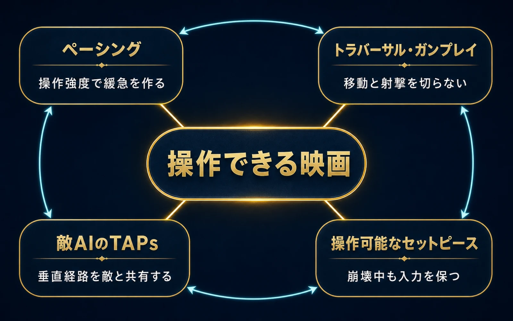
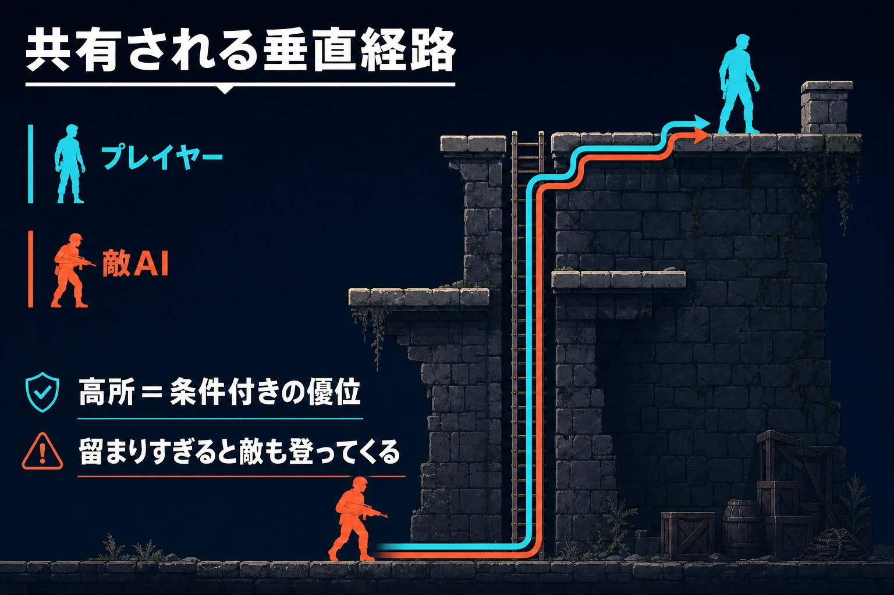
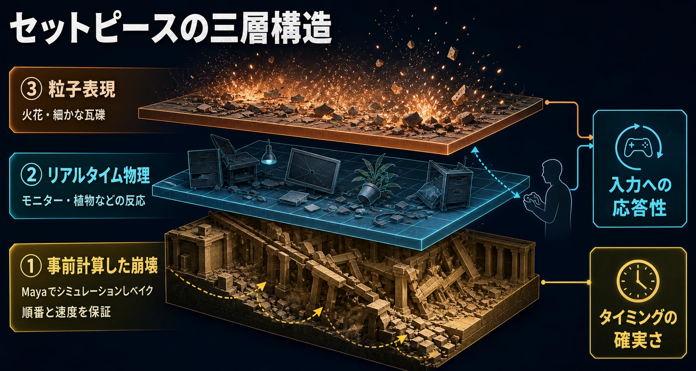

# 『アンチャーテッド 黄金刀と消えた船団』が実現した「操作できる映画」――四つの核設計

## はじめに：「操作できる映画」を全設計の判断基準にする

2009年10月13日、Sony Computer Entertainment Americaは北米でPlayStation 3専用ソフト『アンチャーテッド 黄金刀と消えた船団』を発売した。開発はNaughty Dogであり、公式にはシリーズ第2作に位置付けられている。[[1](#ref-1)][[2](#ref-2)] ゲームディレクターはBruce Straley、クリエイティブディレクター兼脚本統括はAmy Hennig、共同リードデザイナーの一人はNeil Druckmannである。[[3](#ref-3)][[4](#ref-4)][[5](#ref-5)]

評価は同年末から翌年にかけて形になった。Spike TVの2009 Video Game AwardsではGame of the Year、Best PS3 Game、Best Graphicsを受賞し、同年の最多受賞作となった。[[6](#ref-6)] 2010年2月の第13回Interactive Achievement Awardsでは、Game of the Yearを含む10部門を受賞している。[[7](#ref-7)] さらにNaughty Dogは2010年9月、全世界販売本数が380万本を超えたと発表した。[[8](#ref-8)] 批評、技術、商品成果の三面で、PlayStation 3世代を代表する作品の一つになったのである。

Naughty Dogが開発時に掲げた言葉は「Active Cinematic Experience」であった。DruckmannとStraleyはGame Developers Conference 2010の講演で、大規模な見せ場をプレイ可能にしながら、登場人物への感情的な関与も成立させる「インタラクティブなサマーブロックバスター」を目標として説明している。[[3](#ref-3)] 本稿ではこの目標を「操作できる映画」と呼ぶ。

ここでいう「映画」は、画面を映画らしく見せるカメラやカットシーンだけを意味しない。プレイヤーが操作を続けたまま、場面の緩急、空間の見せ方、敵の動き、崩壊する舞台を一つのドラマとして経験できる状態を指す。ペーシング、トラバーサル・ガンプレイ、敵AIのTraversal Action Packs、セットピースは、それぞれ独立した工夫ではなく、この一つの目標を異なる層から支えた設計である。

なお、シリーズのクライミングをロード時間の隠蔽技術として読む観点は、[ゲームにおけるロード時間の隠蔽技術史](history-of-hiding-load-times-in-games.md)で扱っている。また、コンパニオンAIは[『The Last of Us』のシングルプレイヤー設計](the-last-of-us-single-player-core-design.md)で掘り下げた。本稿は両論点を広げず、『黄金刀と消えた船団』が操作と演出を接続した仕組みに焦点を絞る。

***

## 1. ペーシングは、操作強度で「編集」を作る

映画の編集は、緊張を高める場面と静かな場面を切り替え、観客の感情を導く。ゲームで同じリズムを作るには、映像をつなぐだけでなく、プレイヤーが何を、どの密度で操作するかまで設計する必要がある。『黄金刀と消えた船団』は銃撃戦、移動、探索、会話を交互に置き、入力の種類と緊張度を変えることで場面を編集した。

Druckmannは発売直後のインタビューで、開発中にペーシングを繰り返し議論したと説明している。判断の単位は「この戦闘は長すぎないか」「このシークエンスは長すぎないか」「戦闘が続きすぎていないか」「そろそろ落ち着く場面が必要か」という具体的な問いであった。[[5](#ref-5)] 戦闘時間を増やせば遊びが豊かになる、という足し算ではない。ひとつの戦闘が次の場面の効果を弱めていないかまで含めて、体験全体を調整していたのである。

チベットの村は、この考え方がよく表れた区間である。激しい雪山の展開を経た後、プレイヤーはTenzinに従って村をゆっくり歩く。Druckmannは、ここでプレイヤーを意図的に減速させ、村人やTenzinとの関係を作ることが、後の危機に対する感情へつながると語っている。村人に攻撃ボタンを押すと握手し、子どもの近くではボール遊びに変わる文脈依存の反応も加えられた。[[5](#ref-5)] 入力を取り上げて静けさを見せるのではなく、同じ入力の意味を変えて静かな場面を操作させたのである。

Richard Lemarchandは開発後の振り返りで、全体の流れを追うスプレッドシートやプレイテストを用い、物語とゲームプレイのペースを調整したと記している。[[9](#ref-9)] Benson Russellも、物語の出来事とゲームメカニクスを表に並べ、同じ仕組みの連続使用や長い空白を確認したと説明している。[[10](#ref-10)] ペーシングは脚本の後から戦闘を配置する工程ではなく、物語と操作の双方を同じ時間軸で組み直す作業だった。

「操作できる映画」の土台は、入力の密度と意味を切り替えながら、プレイヤー自身に緩急を通過させることにある。派手さを抑えた操作も、次の緊張を強めるための能動的な時間になる。

***

## 2. トラバーサル・ガンプレイは、高低差を選択肢に変える

次に必要なのは、移動の見せ場と銃撃戦を別々の時間へ分けないことである。Russellは本作の戦闘設計を振り返り、「Traversal Gunplay」という言葉で、よじ登りながら撃つ、平均台状の足場から撃つ、跳躍中に撃つといった組み合わせを説明している。プレイヤーは、ほぼすべてのトラバーサル動作から射撃へ接続できる。[[11](#ref-11)]

この接続によって、壁や梁は戦闘前に通過する障害物から、戦闘中に使う経路へ変わる。Russellは、プレイヤーが高所へ移動して有利な位置を取り、環境そのものを小さな戦術パズルとして読む設計を狙ったと述べている。[[11](#ref-11)] 高所は単なる「隠れ場所」ではない。どの経路で上がり、いつ身体をさらし、どこから撃ち、次にどこへ移るかを選ぶための立体的な資源である。

レベル制作でも、この考え方は早い段階から反映された。戦闘空間はMayaで大まかな形を作り、従来の平面的な撃ち合いから上下へ広げられた。プレイテストではプレイヤーの詰まりや進行の流れ、死亡地点を確認し、遮蔽物、射線、登攀経路を調整している。[[10](#ref-10)] 「登れる背景」を増やしたのではなく、移動判断が火力と安全性を変える空間を作ったのである。

トラバーサル・ガンプレイでは、プレイヤーが移動と射撃の接続を選ぶことで、映画的な身軽さと画面上の魅せ場を自分の判断として成立させる。「操作できる映画」は、ここでは垂直移動を戦術へ変換する設計として現れている。

***

## 3. TAPsは、高所の優位を「条件付き」にする

プレイヤーだけが垂直経路を使える場合、高所を確保した時点で空間の問題は解けてしまう。本作は敵にもTraversal Action Packs、略してTAPsを与えた。TAPsとは、壁を越える、段差を上り下りする、はしごを使う、隙間を跳び越す、細い足場を渡るといった、場所固有の移動動作を敵AIへ教えるための仕組みである。[[11](#ref-11)]

実装上、TAPsは敵のナビゲーション領域同士を接続し、その場所で必要なアニメーションを指定する。これにより敵は、床の上だけで経路探索するのではなく、プレイヤーを追って壁やはしごを通過できる。[[12](#ref-12)] Russellは戦闘空間の解説で、プレイヤーが一か所へ留まりすぎると、敵がプレイヤーと同じ登攀経路を使うようにしたと述べている。[[10](#ref-10)] 高所は有利であり続ける一方、籠もるだけで永続的な安全を得られる場所ではなくなった。

ここでは、敵が経路を「通れる」仕組みと、どの位置へ向かうかを「選ぶ」仕組みを分けて考える必要がある。後者では、敵が一定間隔で候補地点を評価し、プレイヤーとの距離、遮蔽物、側面への回り込みやすさ、視認性などへ重みを付ける。[[12](#ref-12)] TAPsが垂直方向の到達可能性を広げ、位置評価がその中から圧力の掛かる目的地を選ぶ。二つが組み合わさることで、高低差はプレイヤーの優位だけでなく、挟撃や奇襲につながり得る脅威にもなる。

このAI機能が担う役割は、難易度調整より広い。プレイヤーが大胆に上り、敵も別の面から追い付き、戦線が場所を変えていくことで、戦闘は静止した射撃場から追跡劇へ近づく。「操作できる映画」という狙いは、敵にも舞台を移動する能力を与えることで維持されている。

***

## 4. セットピースは、崩壊のタイミングと入力を両立させる

本作を象徴する列車と崩落するホテルは、「操作できる映画」が最も見えやすい到達点である。発売時の公式発表も、崩壊する建物や走行中の列車で戦いながら、プレイヤーが映画的な体験の能動的な参加者になることを特徴として掲げていた。[[1](#ref-1)]

列車では、背景だけを流して前進を装うのではなく、車両そのものがゲーム空間を移動する。Naughty Dogはこの課題のため、動いている物体の上でも、プレイヤー、味方、敵が通常の移動能力と戦闘能力を保つ仕組みを整えた。[[5](#ref-5)][[9](#ref-9)] 列車が曲がれば見える地形と射線が変わり、障害物を通過すれば状況も変わる。それでも、プレイヤーは所定の瞬間を待つ観客ではなく、移動し、狙い、撃つ当事者であり続ける。

ホテル崩落でも、設計の優先順位は同じである。建物が倒れる大規模演出の最中に、プレイヤーは操作と射撃を続けられる。Evan Wellsは、崩落をカットシーンにせず操作可能にするため、走る、リロードする、反応する、移動するといったアニメーションを重ね合わせ、入力への反応を保ったと説明している。[[13](#ref-13)] 演出の完成度を高めるために操作を止めるのではなく、演出中に必要な操作を成立させる技術へ投資したのである。

大規模破壊の制作には、事前計算とリアルタイム処理の役割分担が使われた。Naughty DogのMike Hatfieldによれば、建物崩壊のような主要な破壊はMayaで事前にシミュレーションし、アニメーションとしてベイクしてゲームエンジンへ渡した。その決められた崩壊の上に、モニターや植物などのリアルタイム物理、さらに粒子表現を重ねている。[[14](#ref-14)]

この手法は、すべてを物理演算へ委ねる方式と、すべてを映像として再生する方式の中間にある。建物がどの順番で、どの速度で倒れるかは事前に演出できる。一方で、その内部にいるプレイヤーの入力、射撃、細かな物体反応はリアルタイムに残せる。作者が必要とするタイミングの確実さと、プレイヤーが必要とする応答性を、異なる層へ分解して両立したのである。

この体験の核は、セットピースの規模より、その最中にもゲームの基本動詞を保ったことにある。「操作できる映画」は、演出と操作が同じ瞬間に成立するよう、舞台、アニメーション、物理、戦闘を組み直した成果である。

***

## おわりに：一つの狙いが、四つの設計判断をつなぐ

『アンチャーテッド 黄金刀と消えた船団』は、映画的な場面を増やすと同時に、「操作できる映画」という狙いを体験の時間、プレイヤーの動詞、敵の到達可能性、舞台の技術構造まで一貫して通した。

- ペーシングは、戦闘、移動、会話を交互に置き、操作の強度と意味で緩急を作った。
- トラバーサル・ガンプレイは、よじ登りと射撃を接続し、垂直方向を戦術的な経路に変えた。
- TAPsは敵にもその経路を開き、高所の優位を固定解から条件付きの選択へ変えた。
- セットピースは、事前に演出した大規模変化とリアルタイムの入力を層として両立させた。

ゲームプランナーにとって重要なのは、「映画的に見える場面」を企画の終点にしないことである。その場面でプレイヤーへ残す動詞は何か、前後の操作強度はどう変わるか、空間と敵はその動詞をどう揺さぶるか、確定させる演出とリアルタイムに残す反応をどこで分けるか。この順に設計を掘り下げると、コンセプトは宣伝文句から各職種が共有できる判断基準へ変わる。

本作の列車、村、立体的な銃撃戦は、見た目も遊び方も異なる。それでも記憶の中で一つの作品として結び付くのは、どの場面も「見せたい瞬間ほど、プレイヤーに操作させる」という同じ選択から作られているためである。

## References

1. [Award-Winning UNCHARTED 2: Among Thieves Debuts Exclusively on the PlayStation 3][1] — Sony Computer Entertainment America、2009年10月13日。発売日、PS3独占、シリーズ続編としての位置付け

2. [「アンチャーテッド」シリーズ公式ページ][2] — PlayStation

3. [GDC Sessions: Friday, March 12][3] — Naughty Dog、2010年3月12日。「Creating the Active Cinematic Experience」講演の概要

4. [Naughty Dog @ GDC10][4] — Naughty Dog、2010年3月9日。GDC2010でのセッション一覧

5. [Reflecting On Uncharted 2: How They Did It][5] — Game Developer、2009年11月13日。Neil Druckmannへのインタビュー。ペーシング設計、チベットの村での減速演出

6. [Spike TV Announces 2009 'Video Game Awards' Winners][6] — Paramount、2009年12月13日。Game of the Year・Best PS3 Game・Best Graphics受賞

7. [UNCHARTED 2 Nabs 10 Awards, Game of the Year at the Interactive Achievement Awards][7] — Naughty Dog、2010年2月19日。第13回IAAでの10部門受賞

8. [UNCHARTED 2: Among Thieves Game of the Year Edition Coming October 12th][8] — PlayStation.Blog、2010年9月28日。全世界販売本数380万本突破の言及

9. [Postmortem: Naughty Dog's Uncharted 2: Among Thieves][9] — Richard Lemarchand、Game Developer Magazine、2010年3月。スプレッドシートを用いたプレイテスト分析とペーシングの振り返り

10. [Designing Combat Encounters in Uncharted 2][10] — Benson Russell、Game Developer、2010年8月3日。戦闘空間の垂直拡張とプレイテストによる調整

11. [A Deeper Look Into the Combat Design of Uncharted 2][11] — Benson Russell、Game Developer、2010年7月1日。「Traversal Gunplay」とTAPsの導入

12. [The Secrets Of Enemy AI In Uncharted 2][12] — Benson Russell、Game Developer、2010年11月3日。TAPsの技術的説明と敵の位置評価システム

13. [Uncharted 2 Interview: The Animation of Naughty Dog, Page 4][13] — PCWorld、2009年10月2日。Evan Wellsによる、崩落シーンをカットシーンにせず操作可能に保つ設計の説明

14. [How Uncharted 2 set the technical benchmark][14] — Mike Hatfield（Naughty Dog）、Develop、2010年9月2日（Internet Archive収録）。Mayaでの事前シミュレーションとリアルタイム物理の層構造

[1]: https://sony.mediaroom.com/2009-10-13-Award-Winning-UNCHARTED-2-Among-Thieves-Debuts-Exclusively-on-the-PlayStation-3
[2]: https://www.playstation.com/ja-jp/uncharted/
[3]: https://www.naughtydog.com/blog/gdc_sessions_friday_march_12
[4]: https://www.naughtydog.com/blog/naughty_dog_gdc10
[5]: https://www.gamedeveloper.com/design/reflecting-on-i-uncharted-2-i-how-they-did-it
[6]: https://ir.paramount.com/news-releases/news-release-details/spike-tv-announces-2009-video-game-awards-winners
[7]: https://www.naughtydog.com/blog/uncharted_2_nabs_10_awards_game_of_the_year_at_the_interactive_achievement_
[8]: https://blog.playstation.com/2010/09/28/uncharted-2-among-thieves-game-of-the-year-edition-coming-october-12th/
[9]: https://media.gdcvault.com/GD_Mag_Archives/GDM_March_2010.pdf
[10]: https://www.gamedeveloper.com/design/designing-combat-encounters-in-i-uncharted-2-i-
[11]: https://www.gamedeveloper.com/design/a-deeper-look-into-the-combat-design-of-i-uncharted-2-i-
[12]: https://www.gamedeveloper.com/design/the-secrets-of-enemy-ai-in-i-uncharted-2-i-
[13]: https://www.pcworld.com/article/519877/uncharted_2_interview_p4.html
[14]: https://web.archive.org/web/20100912114632/http://www.develop-online.net/features/971/How-Uncharted-2-set-the-technical-benchmark

----

この文書は、Perplexity、Claude、OpenAI Codex の3つのAIの支援を受けて著述されたものです。引用画像を除き、MIT License にて提供されています。
