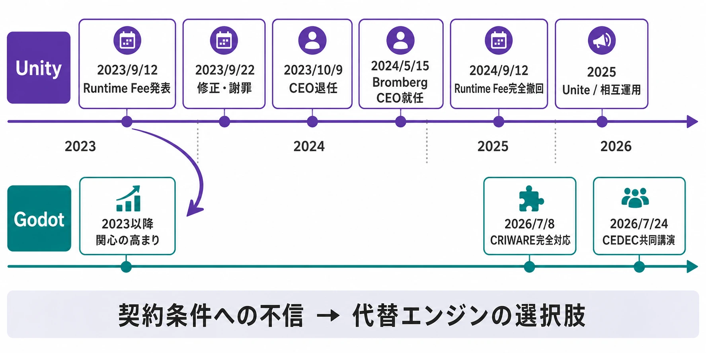
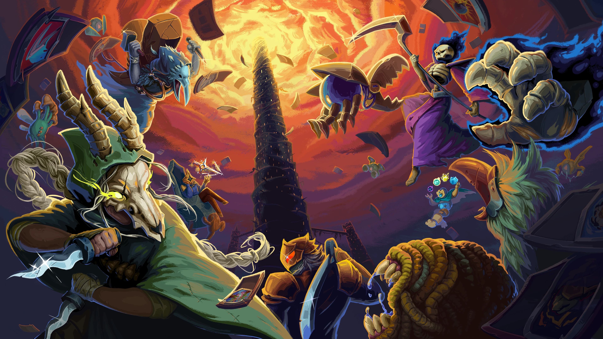
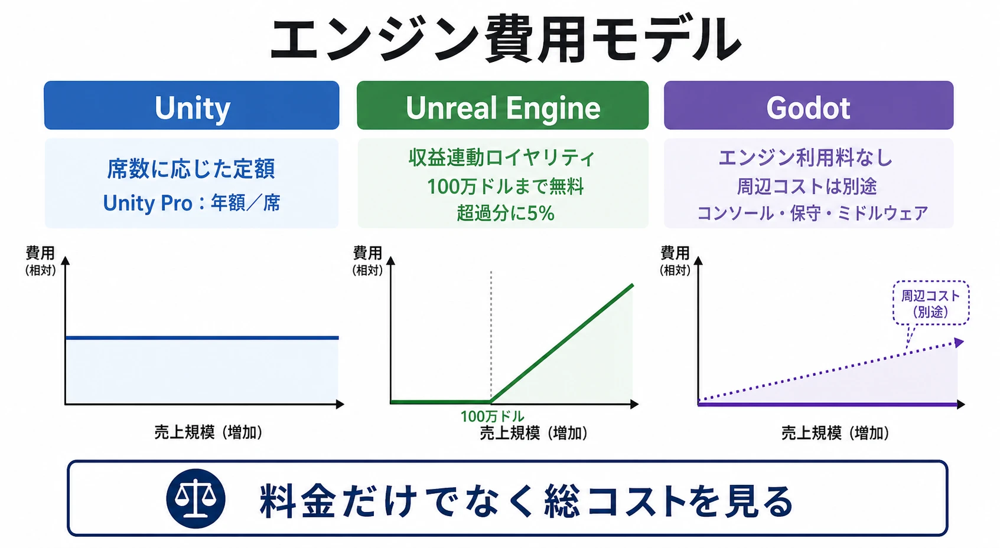
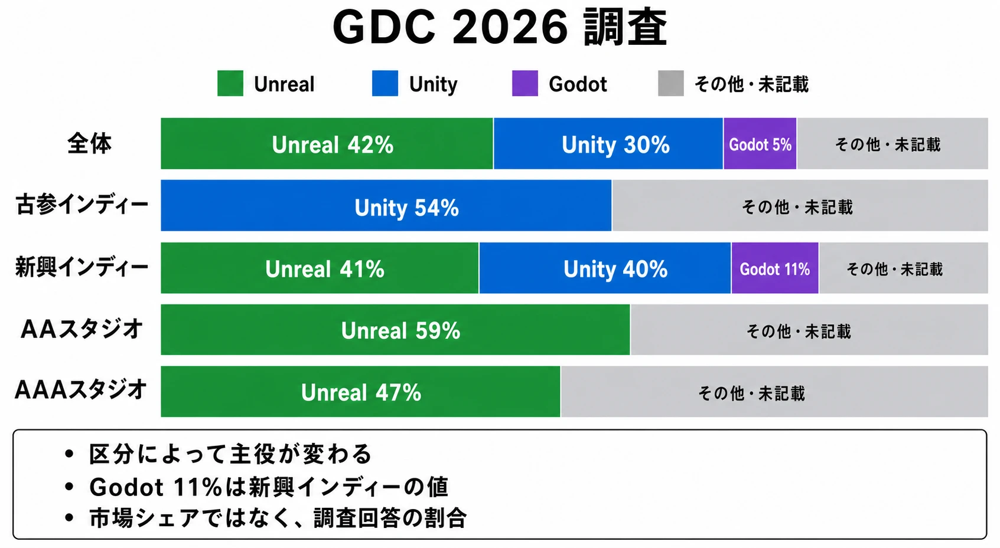
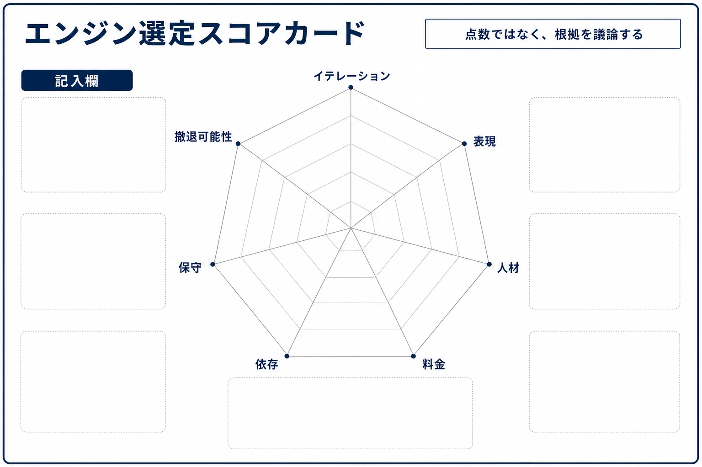

# Unity Runtime Fee騒動から2026年のマルチエンジン時代へ――Godot台頭とゲームエンジン選定戦略

ゲームエンジンは、映像を表示するだけの道具ではない。入力、UI、物理、音声、アセット管理、ビルド、機種対応、運用ツールまで含めて、チームが何をどの速度で作れるかを決める開発基盤である。

ただし、エンジン選定の最終的な意思決定権を持つのは、通常はゲームディレクターやテクニカルディレクターである。ゲームディレクターは作品の方向性と開発全体の責任を負い、テクニカルディレクターは技術方針、性能、開発環境、将来の保守を統括するからである。

プランナーはその決定者ではない。しかし、エンジンの違いが企画に与える制約を知らなければ、実現可能性の判断を誤る。イテレーション速度、対応プラットフォーム、チームのスキルセット、ライセンス費用の予見可能性、特定ベンダーへの依存度を理解し、企画書や提案の場で技術サイドに的確な問いを投げることが、プランナーの役割である。

本稿では、2023年のUnity Runtime Fee騒動を料金問題だけに限定せず、契約条件への信頼、エンジン移行のコスト、Godotの成長、Unityの巻き返しという流れで整理する。そのうえで、2026年にエンジンを選ぶ際に、企画職が何を確認すべきかを考える。

*図：Unity側の方針変更と、Godot側の対応環境の拡大を同じ時間軸に置いたもの。*

***

## 1. Unity Runtime Feeは何を変えようとしたのか

### 1-1. 「ランタイム」とインストール数課金

ランタイムとは、プレイヤーの端末上でゲームを実行するための部分を指す。エディター、つまり開発者がゲームを作る作業環境とは区別される。Unityが2023年9月12日に発表したRuntime Feeは、このUnity Runtimeがゲームのインストールを通じて配布されることに対して、一定条件を満たす作品へ料金を課す構想であった。[[1](#ref-1)]

発表当初の案では、一定の収益とインストール数の両方を超えたゲームについて、Unityのプランや地域に応じた1インストール単位の料金が発生する設計であった。報道された最高額は1インストールあたり0.20米ドルである。[[2](#ref-2)] 料金の発生は2024年1月1日以降の新規インストールを対象とする説明だったが、過去の収益や累積インストール数が適用条件の判定に関係することが、開発者の警戒を強めた。

ここで重要なのは、従来の座席型サブスクリプションとの違いである。座席型とは、誰がエディターを使うかを基準に、席数に応じて料金を払う方式である。一方、インストール数課金は、ゲームがどれだけ配布されたかという、プレイヤー側の行動に料金を結び付ける。売上が増えないまま、無料配布、セール、サブスクリプション、バンドルなどでインストールだけが増える場合、開発者が費用を事前に制御しにくい。

### 1-2. 反発の背景は単価よりも予見可能性にあった

反発の背景には、単に「料金が高い」という問題だけではなく、次のような実務上の不確実性があった。

- 無料配布やサブスクリプションで大量にインストールされた場合、誰が料金を負担するのか
- 再インストール、デモ、海賊版、不正なインストールをどう数えるのか
- 既に開発中の作品にも、エンジンのバージョンアップを通じて新条件が及ぶのか
- 料金の基礎となるインストール数を、開発者が検算できるのか

Unityは発表直後、再インストール、不正インストール、体験版、Web配信、ストリーミングなどを課金対象から外すと説明した。[[3](#ref-3)] しかし、開発者が問題視したのは個別の例外だけではない。ゲームの成功によって増える配布量と、エンジン提供者が定める契約条件が結び付くことで、企画段階の損益予測が不安定になる点である。

GDCの2024年調査では、回答者の約3分の1が、過去1年間にエンジンを変更したか、変更を検討したとされた。UnityのRuntime Feeが反発と方針修正を招いたことも、調査の背景として扱われている。[[4](#ref-4)] すべての回答者がUnityから移行したわけではないが、エンジンを固定資産のように扱うことへの不安が、業界全体で可視化された数字である。

### 1-3. 2023年9月末の修正と、CEOの退任

Unityは2023年9月22日、謝罪とともに方針を修正した。Unity PersonalではRuntime Feeを適用せず、収益と資金調達の上限を10万米ドルから20万米ドルへ引き上げた。また、料金の対象は2024年以降に出る次のLTS版からとし、対象となるゲームには、インストール数に基づく金額と収益の2.5％のいずれか低い方を選べる仕組みを示した。[[5](#ref-5)]

LTSとは、長期間の修正とサポートを前提にした安定版である。既存プロジェクトをすぐに新条件へ巻き込まないための措置だったが、発表から修正までの短さ自体が、開発者に「契約条件は今後も動くのではないか」という印象を残した。

同年10月9日には、John RiccitielloがUnityの社長、CEO、会長などを即時退任すると発表された。後任がただちにRuntime Feeの責任を認めたという意味ではないが、騒動と経営体制の変化が近接したことで、料金改定が単独の製品施策ではなく、経営判断の問題として受け止められる結果になった。[[6](#ref-6)]

### 1-4. 2024年9月の完全撤回と、その後の値上げ

2024年9月12日、Unityの新CEOであるMatt Brombergは、ゲーム向けRuntime Feeを即時撤回すると発表した。ゲーム向け料金は従来の座席型サブスクリプションへ戻し、Unity Personalの収益・資金調達上限を20万米ドルへ引き上げる一方、Unity Proは年額2,200米ドルへ8％、Unity Enterpriseは25％値上げする方針も同時に示した。[[7](#ref-7)]

つまり、撤回は「料金を上げない」という意味ではなかった。新しい従量課金を取り下げ、値上げの中心をProとEnterpriseのサブスクリプションへ戻したのである。

その後も価格改定は続いた。Unityの現行価格ページによれば、Unity ProとEnterpriseは2026年1月12日から5％値上げされた。[[8](#ref-8)] Runtime Feeそのものは実装されず、ゲームに課金された実績もない。それでも、開発者の予算表から見れば「契約条件が変更される可能性」は残っている。

***

## 2. 撤回後も消えなかった不安

### 2-1. 料金の大きさと、条件変更の信頼性は別の問題である

Unityは2024年の撤回発表で、今後はより伝統的な年次の価格改定サイクルに戻る意向を示した。また、エディターの利用条件が変わっても、現在使っているバージョンを使い続ける限り、以前に合意した条件を維持できるという約束も改めて説明した。[[7](#ref-7)]

これは改善である。しかし、開発者の不安を完全に消すには、料金表だけでは足りない。ゲームの開発期間は数年に及ぶことがあり、途中でエンジンを変えると、アセット、ツール、シェーダー、プラグイン、セーブデータ、ビルド環境、スタッフの教育を見直すことになる。契約の変更が合理的な値上げであったとしても、変更を予想できないこと自体が移行判断を早める。

ここでいう「信頼」は、ベンダーが一度も値上げしないという意味ではない。どの条件が、いつ、どの契約に対して変わるのかを予測でき、複数年の計画に織り込めることである。Runtime Fee騒動は、この予見可能性を損なった。

### 2-2. すべての移行が成功したわけではない

騒動後にUnityからGodotやUnreal Engineへ関心が移ったことは確かである。しかし、エンジン移行はボタン一つで完了しない。エンジン固有のシーン、マテリアル、アニメーション、UI、入力、ビルド設定、サードパーティ製プラグインを作り直す場合があり、短期的には開発速度を落とす。

したがって、騒動の教訓を「Unityを使うべきではない」と単純化するのは危険である。正確な教訓は、エンジンの性能比較に加えて、契約の変更余地、移行可能性、代替ツールの有無まで企画段階で確認すべきだということである。

***

## 3. Godot台頭は「無料だから」だけではない

### 3-1. Godotのライセンスと開発モデル

GodotはMITライセンスで提供されるオープンソースのゲームエンジンである。MITライセンスは、著作権表示とライセンス文の同梱などを守れば、商用利用、改変、再配布を広く認める、比較的制約の少ないライセンスである。[[9](#ref-9)]

この構造は、ベンダーの料金表に依存しないという強みを持つ。一方、料金がないことは、サポート、コンソール向けの認証済みポート、商用の責任分界まで無料という意味ではない。Godot Foundationは、オープンソースの性質上、公式のコンソールポートや商用保証を自ら提供していない。コンソール展開には、プラットフォームホルダーの承認と、認証済みの第三者プロバイダーや自社ポートが必要になる。[[10](#ref-10)]

企画職にとっては、「ライセンス費用が無料」という一行ではなく、「どこから先に外部費用と技術責任が発生するか」を見る必要がある。

### 3-2. 2026年の利用状況は、世代間で差がある

GDCの2026年State of the Game Industryでは、エンジンに関わる職種の回答者に限ると、主に使うエンジンはUnreal Engineが42％、Unityが30％であった。ただし、これは過去の調査と質問対象が異なるため、単純な市場シェアの時系列とみなすべきではない。[[11](#ref-11)]

同じ調査のスタジオ区分では、古参インディーの回答者の54％がUnityを使っていた。一方、新興インディーではUnreal Engineが41％、Unityが40％、Godotが11％であった。[[12](#ref-12)]

この差は、Unityが消えたことを意味しない。既存のチームには、Unityの知識、アセット、社内ツール、採用市場、運用実績が蓄積されているからである。新しいチームにはその蓄積が少ないため、Godotのライセンス、軽量な導入、オープンな開発モデルを比較対象にしやすい。2026年の「マルチエンジン時代」とは、全員が同じ割合で三つのエンジンを使う状態ではなく、チームの年齢、作品の規模、企画のタイプによって主役が変わる状態である。

| 調査上の区分 | 確認できる傾向 | 読み方 |
| --- | --- | --- |
| 全体の開発者 | Unreal Engine 42％、Unity 30％ | 2026年調査の質問対象に限った一次集計であり、業界全体の売上シェアではない |
| 古参インディー | Unity 54％ | 既存の人材、アセット、社内ツール、運用知識が効いている |
| 新興インディー | Unreal Engine 41％、Unity 40％、Godot 11％ | UnityとUnreal Engineが拮抗し、Godotが無視できない選択肢になっている |

### 3-3. 『Slay the Spire 2』は「途中移行」の象徴になった

Godotの台頭を象徴する事例が、Mega Critの『Slay the Spire 2』である。同社の公式FAQでは、本作にGodotを使っていること、開発開始が2021年5月頃であることを説明している。[[13](#ref-13)] 2023年のRuntime Fee発表時点では、すでにUnityで2年以上開発していたと報じられており、プロジェクトの途中でエンジンを変更した事例である。[[14](#ref-14)]

これは、Godotなら移行コストが存在しないという話ではない。むしろ、2D中心のゲームで、チームが必要な機能を見極め、変更を引き受ける判断をしたから成立した事例である。カード、敵、イベント、協力プレイ、改造対応などのゲーム固有ロジックを、エンジン依存のコードからどれだけ分離していたかも重要になる。

「大手スタジオが一斉にGodotへ移った」とまでは、公開情報から断定できない。確認できるのは、規模の大きなインディー作品が途中移行を選び、既存プロジェクトの節目でもGodotを選択肢にしやすいミドルウェアと支援環境が整い始めたことである。この程度に線を引く方が、現状を過大評価しない。

出典：Mega Crit公式プレスキット「Slay the Spire 2」[[24](#ref-24)]（公式キーアート、無改変）

### 3-4. ミドルウェアと国内カンファレンスが示す変化

エンジンの普及は、エディターのダウンロード数だけでは決まらない。音声、動画、広告、入力、ネットワーク、コンソール対応などのミドルウェアが揃って初めて、商用開発の選択肢になる。

CRI・ミドルウェアは2026年7月8日、音声・映像ミドルウェアCRIWAREがGodotに完全対応すると発表した。同社はゲーム向けに1万以上のライセンス実績を持ち、Godot対応を既存の技術資産を新しい開発環境でも使えるようにする動きとして位置付けている。[[15](#ref-15)]

同発表は、Godotの近年のバージョンが2026年2月時点で200万ダウンロード規模に達したとも紹介している。[[15](#ref-15)] ただし、ダウンロード数は継続利用者数や商用ゲームの出荷数ではない。普及の勢いを示す補助指標として扱うべきである。

さらにCEDEC2026では、Godot FoundationとCRI・ミドルウェアによる「Godot Engineにおける外部ツールの活用とGodot Foundationの日本展開」というセッションが、2026年7月24日に予定されている。[[16](#ref-16)] これはGodotが、個人制作の選択肢から日本の商用開発者が議論する対象へ広がっていることを示す材料である。

Godot Foundation自身も、2026年の成長報告で、ウェブサイト、GitHub、Steam、Google Playなど複数の経路から利用状況を追っているが、正確な市場シェアではないと注意している。SteamDBに基づくGodot製ゲームのリリース数も、アルゴリズムで変動する概算値として扱われている。[[17](#ref-17)] 数字が伸びていることと、AAAやコンソールの商用案件をUnityやUnreal Engineと同じ条件で比較できることは別問題である。

***

## 4. Unityの巻き返しは、機能より「関係の再構築」が先にある

### 4-1. Matt Bromberg体制

Matt Brombergは2024年5月15日付でUnityのCEO、社長、取締役に就任した。ZyngaやElectronic Artsでゲーム事業を担った経験を持ち、Unityは新体制を「開発者を第一に考える」方向性とともに紹介した。[[18](#ref-18)]

新CEOの就任だけで信頼が回復するわけではない。Unityが再び選ばれるためには、契約条件の説明、エンジン品質、長期サポート、プラグインの安定性、プラットフォーム対応を積み上げる必要がある。

### 4-2. Unite 2025が示した「選択と柔軟性」

Unite 2025の公式報告では、Unityは開発、配信、運用を一つのエコシステムで支える方針を示し、2Dツールの改善、第三者ツールの安全性を高めるUnity Core Standards、Production Verificationを発表した。Production Verificationとは、実際のゲーム制作で技術を検証し、実運用で問題が出にくいかを確認する取り組みである。[[19](#ref-19)]

同じ基調講演では、Epic GamesのTim Sweeneyが登壇し、UnityとUnreal Engineの相互運用性を高める協力も発表された。より大きく報じられたのは、UnityのゲームをFortniteへ展開し、5億以上の登録アカウントを持つFortniteのクリエイターエコノミーに参加できるようにするという提携である。加えて、Unityの決済・商取引基盤をUnreal Engineにも対応させ、Unreal Engine側の開発者もUnityのアプリ内課金APIを選べるようにする内容も発表された。競合エンジンを閉じた城壁の中に囲い込むのではなく、開発者の選択肢を広げる方向にかじを切った点が特徴である。

また、Unityは25以上のプラットフォーム対応、Nintendo Switch 2とAndroid XRへの初日対応、アカウント、セーブ、実績、コントローラー所有権などを共通APIで扱うPlatform Toolkitを示した。共通APIとは、機種ごとに異なる呼び出し方を一つの窓口にまとめる仕組みである。これが実際にどこまで認証や保守の手間を減らすかは、対象機種とゲームの構成で検証する必要があるが、マルチプラットフォームを主戦場とするUnityの強みを再整理した動きである。

### 4-3. 2025～2026年のロードマップ

Unityの2025年ロードマップは、機能を増やすことより、安定性、性能、イテレーション速度、対応範囲を中心に据えた。URPのDeferred+、可変レートシェーディング、Project Auditor、WebGPU、Android XR、PC・コンソール向けの改善などが示されている。URPやHDRPはUnityのレンダリングパイプライン、つまり3Dデータを最終画面へ変換する処理の流れである。[[20](#ref-20)]

UIでは、Unity 6.3 LTSでUI ToolkitのSVG、カスタムシェーダー、ぼかしや色調補正、UIテスト、UI Builderなどが改善された。XRではAndroid XRの顔追跡や物体追跡などが追加された。[[21](#ref-21)]

もう一つの大きな計画がCoreCLRである。CoreCLRはC#を動かす.NETの実行基盤であり、Unityは2026年を通じてスクリプト実行環境を段階的に更新し、Unity 6.8ではMonoを選択肢から外してCoreCLRを基盤にする計画を示している。コードの再読み込みや将来の.NET対応を改善する狙いがある一方、アセンブリやAPIの互換性に影響する変更も予定されている。[[22](#ref-22)]

企画職の視点では、これらは「新機能が多い」という話ではない。数年間運用する作品なら、LTSの期間、更新時の破壊的変更、プラグインの対応時期、検証済み機能の範囲をスケジュールへ織り込めるかが問題になる。

***

## 5. 2026年のマルチエンジン時代をどう読むか

### 5-1. エンジンは三つの料金体系を持つ

2026年時点で、主要エンジンの料金体系はおおまかに三つに分かれる。

| エンジン | 基本的な料金の考え方 | 企画段階で確認すること |
| --- | --- | --- |
| Unity | Personalは条件内で無料。Proは2026年価格で年額2,310米ドル／席。企業の売上・資金調達が20万米ドルを超える場合はProが必要 | 席数、更新年の価格、LTS、コンソール対応、Unityサービスの利用範囲 |
| Unreal Engine | ゲームは生涯総収益100万米ドルを超えた部分に原則5％のロイヤリティ。Epic Games Storeの売上は免除対象 | 売上の定義、配信先ごとの扱い、ロイヤリティ報告、カスタム契約の有無 |
| Godot | MITライセンス。エンジン利用料やロイヤリティはない | 商用サポート、コンソールポート、ミドルウェア、社内で引き受ける保守範囲 |

Unityの2026年Pro価格と売上基準は公式価格ページに示されている。[[8](#ref-8)] Unreal Engineの標準ライセンスは、生涯総収益100万米ドルを超えた部分へ5％のロイヤリティを課す。[[23](#ref-23)] GodotのMITライセンスにはエンジン利用料やロイヤリティはないが、コンソール対応に第三者費用が発生し得る。[[9](#ref-9)][[10](#ref-10)]

*図：席数課金、収益連動、エンジン利用料なしという料金モデルの違いと、Godotの周辺コストを示した図。*

この表から「Godotが最安」と結論付けるのは早い。エンジンの料金を払わなくても、技術者の採用、社内ツールの開発、コンソールポート、認証、サポート、アップデート検証には費用がかかる。逆に、UnityやUnreal Engineの料金は、既存の機能、サポート、プラットフォーム対応、人材市場を含めて評価すべきである。

### 5-2. 古参インディーと新興インディーは別の最適解を持つ

古参インディーでは、Unityを使い続ける合理性が大きい。既存のゲームコードやアセットがあり、スタッフが慣れており、過去のコンソール移植や運用の知見もあるからである。料金改定の不安があるとしても、途中移行の費用と納期リスクがそれを上回るなら、Unityを継続する判断は合理的である。

新興インディーでは、UnityとUnreal Engineが拮抗し、Godotが急伸している。GDCの2026年調査で新興インディーのUnreal Engineが41％、Unityが40％、Godotが11％だったことは、初心者向けの印象論ではなく、少なくとも調査回答上の選択が分散していることを示す。

ただし、調査は回答者の構成に左右される。Godotの11％を「ゲーム市場の11％」と読んではならない。同じ調査の全回答者（2,300名超）を通した集計では、Godotの利用率は5％にとどまり、AA・AAAスタジオではUnreal Engineがそれぞれ59％・47％を占めている。つまり11％という数字は、あくまで新興インディーという一部区分に限った値である。売上、出荷本数、Steam作品数、開発者の主利用エンジンは、それぞれ別の指標である。プランナーは数字を見つけたら、分母、対象地域、対象職種、回答時期、一次エンジンか併用エンジンかを確認する必要がある。

*図：GDC 2026調査で確認できる区分別の回答割合。記載のない内訳は「その他・未記載」としている。*

### 5-3. 単一エンジンから複数エンジンへ、ではなく複数の逃げ道を持つ

マルチエンジン時代という言葉は、一つのゲームをUnityとUnreal EngineとGodotで同時に作るという意味ではない。通常、それは人員と検証コストが大きすぎる。現実的には、次のような複数の逃げ道を持つ設計を指す。

- ゲーム固有のルール、データ、計算をエンジン依存コードから分離する
- アセットの元データを、特定エンジン専用形式だけで保存しない
- セーブデータ、リプレイ、通信プロトコルをエンジン外の仕様として定義する
- 音声、動画、ネットワーク、分析などのミドルウェアを複数エンジンで使えるか確認する
- 企画初期に小さな縦切り試作を行い、移行可能性を実測する

縦切り試作とは、製品の一部を完成に近い品質で作り、ゲームの面白さと技術リスクを同時に検証する試作である。エンジン選定を契約書の比較だけで決めず、実際のカメラ、UI、入力、アニメーション、保存、機種ビルドまで通して確認することが重要である。

***

## 6. プランナーが技術サイドとの対話に持ち込む論点

### 6-1. 「何が作れるか」より「何を維持できるか」

企画初期の会話を、「このエンジンでこの表現は可能か」だけで終わらせてはいけない。ほとんどの主要エンジンで、単発のデモなら多くの表現が可能だからである。重要なのは、必要な品質を、想定チームが、予定期間と予算の中で、複数機種へ安定して出せるかである。

プランナーが確認すべき問いは次のようになる。

1. 想定チームのプログラマー、アーティスト、テクニカルアーティストは、どのエンジンの経験を持つか。経験者がいない場合、教育期間を何週間見込むか。
2. 企画の面白さを検証する最初の試作は、どのエンジンなら何日で遊べる状態になるか。
3. 目標プラットフォームはPCだけか、コンソール、スマートフォン、Web、XRまで含むか。各機種で別の描画・入力・認証対応が必要か。
4. UI、アニメーション、音声、ネットワーク、分析、課金に必要なミドルウェアは、選択したエンジンの対象機種で動くか。
5. 3年後の想定売上、座席数、サポート契約、ロイヤリティ、為替を含めた総コストを、複数のケースで計算したか。
6. ベンダーの料金や利用条件が変わった場合、旧バージョンを維持できるか。セキュリティ修正やプラットフォームSDK更新は誰が担うか。
7. 半年後にエンジンを変える必要が生じた場合、データ、コード、アセット、セーブ、ツールをどこまで持ち出せるか。

### 6-2. 企画書に入れられる簡易スコアカード

エンジンの優劣を一つの点数で決めるのではなく、企画のリスクを見える化するために、次のような表を技術サイドと共同で作るとよい。点数そのものが結論ではなく、点数の根拠を議論することが目的である。

| 評価軸 | 確認する質問 | 低リスクの状態 |
| --- | --- | --- |
| イテレーション | 仕様変更からプレイ確認まで何分かかるか | プランナーが日常的に試作と確認を回せる |
| 表現 | 作品の代表シーンを対象機種で再現できるか | 縦切り試作で性能の上限が見えている |
| 人材 | 採用、外注、引き継ぎが可能か | 特定の一人だけに知識が集中していない |
| 料金 | 売上、人数、席数、更新を含めて予測できるか | 悲観・標準・成功の三ケースを作れる |
| 依存 | ベンダーや単一プラグインが止まったらどうするか | 代替手段と移行期間が定義されている |
| 保守 | OS、SDK、コンソール、ミドルウェアの更新に追随できるか | 担当者、予算、検証環境が確保されている |
| 撤退可能性 | プロジェクトの節目で他エンジンへ移せるか | エンジン外に置くデータとコードが定義されている |

この表で特に重要なのは「撤退可能性」である。移行を前提に作ると初期コストが上がる場合があるが、契約変更、買収、サポート終了、プラットフォーム方針の変更に対する保険になる。すべてを抽象化する必要はない。ゲームのルール計算、データ定義、セーブ仕様、アセットの元データなど、後で作り直すと高くつく部分から分離すればよい。

*図：イテレーション、表現、人材、料金、依存、保守、撤退可能性を、根拠とともに検討するための記入用テンプレート。*

### 6-3. プランナーが投げるべき質問の形

悪い質問は「GodotでAAAは作れるか」である。AAAはチーム規模、品質、機種、運用期間が混ざった言葉であり、答えが曖昧になる。

よい質問は「PCとNintendo Switch 2を同時に対象とし、2Dのカード演出とオンライン協力プレイを含む企画で、Godotを使った場合に、コンソールポート、CRIWARE、ネットワーク、認証の責任者と費用は誰になるか」である。この質問なら、技術サイドはエンジン本体、外部プロバイダー、プラットフォームホルダー、社内ツールに論点を分解できる。

同じように、「Unityなら何ができるか」ではなく、「Unity 6.3 LTSから6.8へ更新する計画で、CoreCLR移行時に既存アセットとプラグインをどう検証するか」と聞くべきである。企画職が技術用語を完全に使いこなす必要はない。必要なのは、企画上の要件を、技術上の検証対象へ翻訳することである。

***

## 結び――エンジン選定は、単一ベンダー依存のリスク管理である

Unity Runtime Fee騒動が残した教訓は、Unityが悪く、Godotが正しいという単純な二択ではない。エンジンは長期契約、人材、アセット、ミドルウェア、プラットフォーム、運用を束ねるため、一度選ぶと変更コストが高い。その高い変更コストを前提に、提供者の契約条件が変われば、ゲームの損益と納期が同時に揺らぐ。

2026年の状況は、Unityの失速とGodotの勝利だけでもない。古参インディーではUnityの蓄積が強く、新興インディーではUnreal EngineとUnityが拮抗し、Godotが伸びている。UnityもMatt Bromberg体制で、品質、安定性、プラットフォーム対応、CoreCLR、第三者ツールの信頼性を立て直そうとしている。

プランナーが担うべきなのは、最終決定を技術サイドから奪うことではない。企画の要件を明確にし、技術的制約と費用の変動を可視化し、どの条件ならどのエンジンが合理的かを問い続けることである。エンジンを選ぶことは、表現方法を選ぶことと同時に、将来どの変更を受け入れ、どの変更から逃げられるようにするかを選ぶことでもある。

単一ベンダーへの依存をゼロにはできない。しかし、契約条件の確認、縦切り試作、データの分離、代替ミドルウェア、旧バージョンの保守計画を用意すれば、依存を管理できる。ゲームエンジン選定の成熟とは、最も高性能な道具を選ぶことではなく、作品の成功条件と失敗時の退路を同じ企画書に書けることである。

## References

1. [Unity to start charging fee pegged to game installs][1] - 2023年9月のRuntime Fee発表と、インストール数を基準にした新料金の概要を報じたGame Developerの記事。

2. [Unity rushes to clarify price increase plan][2] - 発表当初に示された最大0.20米ドルのインストール単位料金と、開発者の懸念を報じたAxiosの記事。

3. [Unity plan pricing and packaging updates][3] - Unity公式フォーラムによる再インストール、不正インストール、デモ、Web、ストリーミング等の扱いの説明。

4. [Game Developers Conference’s 2024 State of the Game Industry Survey][4] - GDC 2024調査の、エンジン変更または変更検討に関する結果とRuntime Fee騒動の影響。

5. [An open letter to our community][5] - Unityが2023年9月22日に示したRuntime Feeの修正、Unity Personalの上限変更、2.5％との比較方式。

6. [Unity Announces Leadership Transition][6] - John Riccitielloの2023年10月9日付の退任発表。

7. [Unity is Canceling the Runtime Fee][7] - 2024年9月12日のRuntime Fee撤回、Pro・Enterpriseの2025年価格改定、Matt Brombergの説明。

8. [Unity Pricing Changes][8] - Unity Pro・Enterpriseの2026年1月12日からの5％値上げ、各プランの収益基準と価格。

9. [Complying with licenses][9] - GodotのMITライセンス、商用利用、ライセンス文の表示要件。

10. [Console support in Godot][10] - Godot Foundationが公式コンソールポートと商用保証を提供しない理由、第三者プロバイダーによる対応。

11. [GDC 2026 State of the Game Industry Reveals Impact of Layoffs, Generative AI, and More][11] - GDC 2026調査の回答者数、全体のUnreal Engine・Unity利用率、古参インディーと新興インディーの傾向。

12. [2026 State of the Game Industry Report][12] - 新興インディーのUnreal Engine 41％、Unity 40％、Godot 11％など、スタジオ区分別の集計を含む報告書。

13. [FAQ - Mega Crit Games][13] - 『Slay the Spire 2』の開発時期、Godot採用、対応プラットフォームを示す開発元公式FAQ。

14. [Slay the Spire 2 ditched Unity for open-source engine Godot][14] - 『Slay the Spire 2』がUnityで2年以上開発された後にGodotへ移行した経緯を報じた記事。

15. [CRIWARE、利用者拡大中のゲームエンジン「Godot」に完全対応][15] - CRIWAREのGodot完全対応、1万以上のゲーム向けライセンス実績、Godotの利用拡大に関するCRI・ミドルウェア公式発表。

16. [無料ライブ配信セッション一覧｜CEDEC2026][16] - CEDEC2026で予定されるGodot FoundationとCRI・ミドルウェアの共同セッション。

17. [Godot usage and engine growth][17] - Godot Foundationによる2026年の利用状況、SteamDB集計、データの限界に関する報告。

18. [Unity Appoints Matthew Bromberg as New CEO][18] - Matt BrombergのCEO就任日、ゲーム業界での経歴、Unityの新体制に関する公式発表。

19. [Highlights from the Unite 2025 Keynote][19] - Unity Core Standards、Production Verification、Platform Toolkit、25以上のプラットフォーム対応、Epic Gamesとの相互運用方針。

20. [What’s next: A look at Unity’s 2025 roadmap][20] - Unity 6.1、性能・安定性、XR、WebGPU、Project Auditor、CoreCLRなどの2025年ロードマップ。

21. [Unity 6.3 LTS is now available][21] - UI Toolkit、Android XR、Platform Toolkit、Production VerificationなどUnity 6.3 LTSの変更点。

22. [Path to CoreCLR, 2026: Upgrade Guide][22] - Unity 6.8へ向けたCoreCLR移行計画、Monoの扱い、互換性と破壊的変更の説明。

23. [Unreal Engine licensing options][23] - Unreal Engineの100万米ドル基準、5％ロイヤリティ、Epic Games Store売上の扱い。

24. [Slay the Spire 2 - Mega Crit Games][24] - Mega Crit公式プレスキットに掲載された『Slay the Spire 2』の公式キーアート。

[1]: https://www.gamedeveloper.com/business/unity-to-start-charging-fee-pegged-to-game-installs
[2]: https://www.axios.com/2023/09/13/unity-runtime-fee-policy-marc-whitten
[3]: https://discussions.unity.com/t/unity-plan-pricing-and-packaging-updates/927079
[4]: https://www.businesswire.com/news/home/20240118843393/en/Game-Developers-Conferences-2024-State-of-the-Game-Industry-Survey-Shows-Developer-Concern-About-Layoffs-Generative-AI-Usage-Game-Engine-Pricing-Changes-and-Return-to-Office-Policies
[5]: https://unity.com/blog/an-open-letter-to-our-community
[6]: https://unity.com/news/unity-announces-leadership-transition-0
[7]: https://unity.com/blog/unity-is-canceling-the-runtime-fee
[8]: https://unity.com/products/pricing-updates
[9]: https://docs.godotengine.org/en/stable/about/complying_with_licenses.html
[10]: https://godotengine.org/consoles/
[11]: https://gdconf.com/article/gdc-2026-state-of-the-game-industry-reveals-impact-of-layoffs-generative-ai-and-more/
[12]: https://investgame.net/wp-content/uploads/2026/01/2026-01-29-dec052f4_d88e_48ce_9f83_a18ce2f2a6e5_541400_GDC26_PDF_SOTI_Report.pdf
[13]: https://megacrit.com/faq/
[14]: https://www.pcgamer.com/games/roguelike/slay-the-spire-2-ditched-unity-for-open-source-engine-godot-after-over-2-years-of-development/
[15]: https://www.cri-mw.co.jp/news/newsrelease/21940/
[16]: https://cedec.cesa.or.jp/2026/timetable/free_lives/
[17]: https://godotengine.org/article/godot-growth-stats-2026/
[18]: https://unity.com/news/unity-appoints-matthew-bromberg-as-new-ceo
[19]: https://unity.com/blog/highlights-from-unite-2025-keynote
[20]: https://unity.com/blog/unity-engine-2025-roadmap
[21]: https://unity.com/blog/unity-6-3-lts-is-now-available
[22]: https://discussions.unity.com/t/path-to-coreclr-2026-upgrade-guide/1714279
[23]: https://www.unrealengine.com/license
[24]: https://www.megacrit.com/press-kits/slay-the-spire-2/

----

この文書は、Perplexity、Claude、OpenAI Codex の3つのAIの支援を受けて著述されたものです。引用画像を除き、MIT License にて提供されています。
