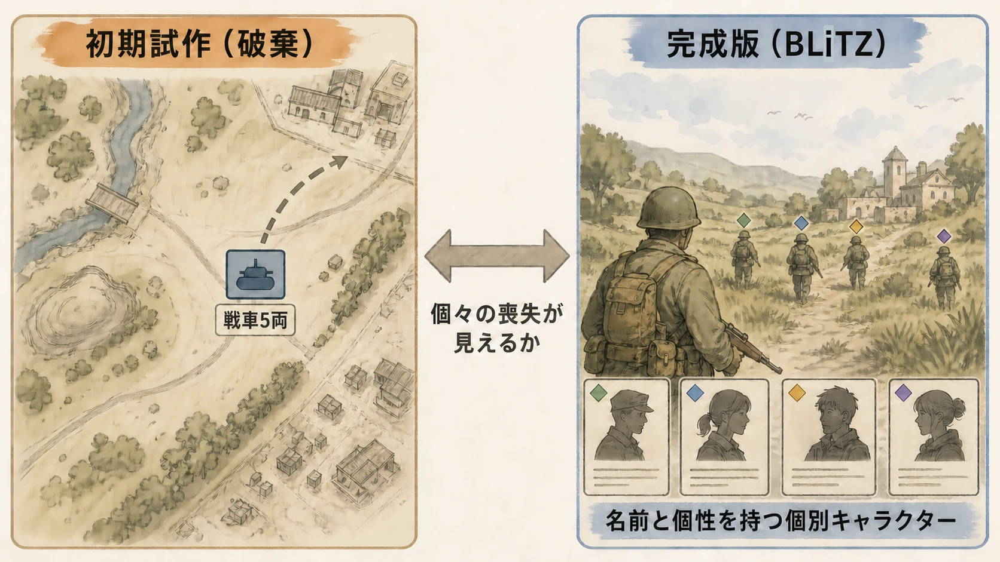
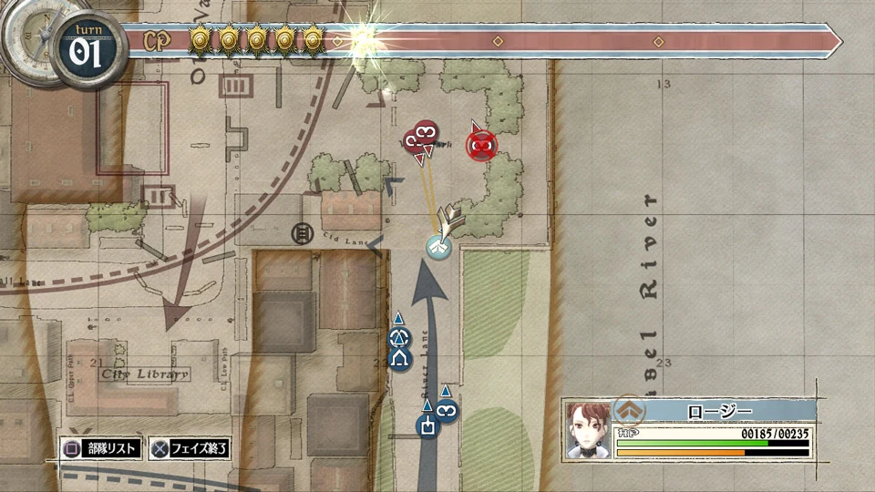
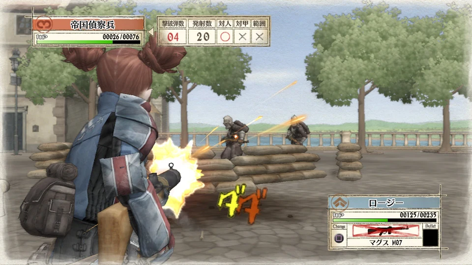
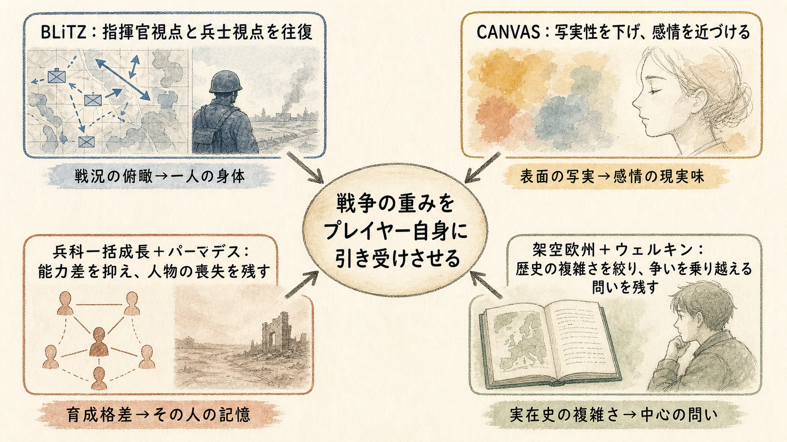

# 『戦場のヴァルキュリア』はなぜ写実を捨てたのか――CANVAS、BLiTZ、パーマデスを貫く「戦争の重み」の設計

## はじめに：軽く見える絵が、重い感情を運ぶ

セガは2008年4月24日、PlayStation 3向けに『戦場のヴァルキュリア』を発売した。公式ジャンル名は「アクティブ・シミュレーションRPG」である。[[1](#ref-1)] 鉛筆の輪郭と水彩のにじみを思わせる画面、見下ろしの作戦画面から兵士一人の背後へ降りる戦闘、名前と個性を持つ隊員の死。これらは別々の売り文句に見える。

開発者の発言をつなぐと、三つは一つの狙いへ収束する。戦争を遠くから眺める題材にせず、誰を前へ出し、誰を助け、誰を失ったかという責任をプレイヤーへ返すことである。写実を避けた判断も、戦争を軽く見せるためではない。現実らしい表面が感情への入口を塞ぐなら、表面の現実感を下げてでも、人間の感情を直接届けるという選択だった。[[2](#ref-2)][[3](#ref-3)]

本稿では、見下ろし視点で複数のユニットを動かすタクティカルRPGの定型を、なぜ最初の試作で捨てたのかを起点にする。そのうえで、水彩表現、戦闘システム、育成と死亡、舞台と主人公を、同じ設計目標から読み直す。プランナーが持ち帰るべきものは、個々の機能の模倣ではなく、作品の感情目標から逆算して既存ジャンルの定型を捨てる判断である。

***

## 1. 初期試作は、感情目標を満たせず作り直された

本作の最初のビルドは、見下ろし型の通常のタクティカルRPGだった。ここで一次資料上の事実を正確に分けておきたい。野中竜太郎プロデューサーによれば、初期版は見下ろし型だったが、グリッドは最初から採用していない。開発チームが作って遊んだ結果、求めていた「プレイヤーがキャラクターへ自己同一化する感覚」を表現できていないと判断した。そこで細かな修正を重ねるのではなく、三人称アクションに近い視点、立体的なマップ、遮蔽物へ身を隠す戦いへ一度に大きく作り替えた。[[2](#ref-2)]

問題は、タクティカルRPGとして機能するかではなく、その形式が何を感じさせるかにあった。野中氏は従来型の例として、一つのユニットが複数の兵士や戦車を表し、戦闘後に残存数だけが減る構造を挙げている。盤面上の一駒が「戦車5両」や「兵士4人」をまとめて表すなら、損失は戦力の差分として理解しやすい。一方、その中の誰が倒れたかは見えにくい。[[2](#ref-2)]

プレイヤーを高所の指揮官に置く視点は、広い戦況を読みやすくする。その読みやすさは同時に、銃弾を受ける人物からプレイヤーを遠ざける。初期版を捨てた判断は、見下ろし視点そのものを否定したのではない。「個人の戦場ドラマ」を中心にする企画に対して、その距離が合わなかったのである。アミューズメントメディア総合学院のカンファレンス採録でも、野中氏は一人の英雄が活躍するFPSではなく、個々のユニットを活かすシミュレーションゲームとして人間ドラマを描きたかったと説明している。[[3](#ref-3)]

### 銃が、剣と魔法の前衛・後衛ロジックを作り替えた

定型を壊す必要は、武器の性質からも生じた。剣なら前へ出て接近し、魔法なら後方から唱えるという前衛・後衛の役割を作りやすい。銃やバズーカは、その置き換えでは説明できない。射線、距離、遮蔽物、狙い、移動中に受ける反撃が関係するため、「銃を遠距離魔法として扱う」だけでは戦場らしい判断にならない。開発チームはここを出発点に、ゲームプレイの論理全体を組み直した。[[2](#ref-2)]

若手プランナーが注目すべきなのは、初期試作の評価基準である。入力できる、勝敗がつく、マップを攻略できるという機能確認だけなら、最初のビルドも成立していた可能性がある。しかし作品の感情目標は満たしていなかった。プロトタイプには「動くか」「面白いか」に加え、「企画で約束した感情が起きたか」という判定が必要なのである。

***

## 2. BLiTZは、指揮官と兵士を往復させる

完成版の戦闘を支えるのがBLiTZである。正式には「Battle of Live Tactical Zone systems」の略で、部隊へ指示を出すコマンドモードと、選んだ隊員をコントローラで直接動かすアクションモードを組み合わせた戦闘システムを指す。[[3](#ref-3)]

コマンドモードでは、プレイヤーは戦場全体を見て、誰を動かすかを決める。隊員を選ぶと視点はその人物の背後へ移り、移動し、狙いを定め、攻撃する。敵の迎撃を受ける状況では、考えているあいだも安全な盤外にはいられない。野中氏はこの設計について、神のようにチェスの駒を動かすのでなく、プレイヤー自身を戦場へ入れ、反撃される恐怖と緊張を感じさせたかったと語っている。[[2](#ref-2)]

ここには、二つの距離が必要である。戦術だけを見せるなら、俯瞰視点だけでよい。個人の恐怖だけを見せるなら、三人称アクションだけでもよい。『戦場のヴァルキュリア』は、決定するときには部隊全体を見せ、その決定の結果を引き受けるときには一人の身体へ近づける。コマンドとアクションの併置は、二つのジャンルを足しただけではない。「誰を危険へ送るか」と「送られた人物が何を見るか」を同じプレイヤーに連続して経験させる仕組みである。

この往復によって、ユニットは効率値だけで完結しにくくなる。俯瞰画面で最適な一手に見えた進軍も、視点が地上へ降りれば長い射線や薄い遮蔽物として見える。作戦上の判断と身体的な危険が切り離されないため、プレイヤーは命令する側と実行する側の両方を担当することになる。

*コマンドモード。画像出典（引用）：[セガ公式サイト](https://portal.valkyria.jp/vc1/ps3/) ©SEGA*

*アクションモード。画像出典（引用）：[セガ公式サイト](https://portal.valkyria.jp/vc1/ps3/) ©SEGA*

***

## 3. CANVASは、現実感を減らして感情を近づける

CANVASは、3Dのキャラクターと戦場を、鉛筆線と水彩画のようなタッチで動かす本作独自の描画システムである。出発点は「PS3らしい写実性をどこまで上げるか」ではなかった。架空の世界へノスタルジックな雰囲気を与え、戦車に乗る人物を描きながら、血なまぐさい表現を苦手とする人にも届く画面を作るという要求だった。[[3](#ref-3)]

キャラクターモデルリーダーの飯田牧子氏は、3Dツールのシェーダーを使い、写実的なタッチとアニメ的なタッチの両方を試した。その試行錯誤の末に水彩表現へ到達する。野中氏が方向性を支持し、静止画だけでなく同じタッチの3D映像を制作させた。社長へのプレゼンでは、まず静止画を見せた後に、それが実際に動く映像であることを示し、高い評価を得たという。田中俊太郎ディレクターは、CANVASとBLiTZの二つが、人間ドラマを描くコンセプトを実現する柱として始動したと振り返っている。[[3](#ref-3)]

写実を避けると、題材が軽くなるように見える。しかし田中氏の説明は逆である。現実的な舞台を現実的なグラフィックで描くと、画面の現実らしさが、必ずしも感情や心理の現実らしさを届けるとは限らない。環境の写実性からあえて距離を取ることで、感情とメッセージの現実味を直接伝えやすくなると考えた。[[2](#ref-2)]

Game Developer誌のインタビューでは、聞き手がPixarの『トイ・ストーリー』と、写実へ寄せたCG映画を対比し、様式化された人物の方が感情移入しやすい場合があると指摘している。田中氏と野中氏もこの比較に同意した。田中氏は、Pixar作品が日本で当初は子ども向けと見られながら、質の高さによって大人にも観客を広げた例を挙げる。野中氏は、人間で描けば生々しすぎる内容でも、玩具を主人公にしたアニメーションなら伝えやすくなると説明した。[[2](#ref-2)]

つまりCANVASが下げたのは、感情の強度ではなく、感情へ到達する前の拒否感である。一方で開発側は、様式化された見た目だけで遊ぶ前に離れる人がいることも認識し、その代償を受け入れている。全員に無難に見える表現へ寄せるより、作品のメッセージを届ける表現を優先したのである。

プランナーがアートへ要望を出す際も、「優しい水彩にする」とスタイル名だけを決めてはならない。先に決めるべきなのは、誰のどの拒否感を下げ、代わりにどの感情を近づけるかである。スタイルを制作判断へ翻訳する基礎は、別記事「[ゲームのアートディレクション基礎――スタイルガイド・アートバイブルの役割](game-art-direction-style-guide-basics-for-planners.md)」でも整理している。

***

## 4. 約60人を同じ兵科レベルで育てるから、一人を好みで選べる

本作では、主要人物を除く隊員が戦死すれば、その周回では戻らない。パーマデス、すなわち恒久的な死である。これは完成直前の刺激として追加された規則ではなく、初期ビルドから組み込まれていた。野中氏は、戦争で失った人は戻らないという現実感に加え、危険な隊員を助けに行く必要と、救えなかったときの喪失を感じさせるためだったと説明している。[[2](#ref-2)]

パーマデスだけなら、隊員は失いたくない高価な戦力にもできる。本作はそこへ、全員に名前、外見、性格、長所と短所を与えた。傷ついて倒れた隊員を救うか、任務を優先して先へ進むかという判断を、単なる残存戦力の計算で終わらせないためである。[[2](#ref-2)]

登場する隊員は、サブキャラクター約50人、主要人物を含めて約60人に及ぶ。一方、成長はキャラクターごとではなく、兵科ごとに共有される。野中氏によれば、個別レベル制にすると、プレイヤーは育てたお気に入りだけを使い続け、他の人物を選ばなくなる。兵科全体を一緒に成長させれば、任務ごとに異なる人物を選びやすくなる。1回の任務へ出せるのはおよそ10人であり、多数の候補から編成を変えることが前提になっている。[[2](#ref-2)]

個性を重くするなら、個別育成も深くするのが自然に見える。『戦場のヴァルキュリア』は逆を選んだ。能力成長を兵科へまとめることで、長時間使った人物だけが実用的になる格差を抑え、人物を選ぶ理由を性格、好み、人間関係へ移したのである。

さらに、隊員同士の友好・対立関係が戦闘力へ影響する。開発チームは人物相関図を作り、友人同士を組ませた場合と、対立する人物を同じ部隊へ入れた場合に差が出るよう設計した。田中氏はこれを、野中氏らと過去に手がけた『サクラ大戦』の仕組みを広げたものだと説明する。『サクラ大戦』では特定の人物との関係が戦闘へ接続したが、本作では多様な人物の組み合わせから部隊全体のバランスを探る仕組みへ拡張された。[[2](#ref-2)]

ここで、兵科一括成長とパーマデスは矛盾せず、役割を分担している。設計として読むと、兵科一括成長は隊員交代の機能的な損失を抑える。パーマデスは、その人物との関係や記憶という感情的な損失を残す。育成時間を人質にして失いたくないと思わせるのではなく、その人だから失いたくないと思わせる構造である。

この点は、戦時下の人物関係を扱う「[『高機動幻想ガンパレード・マーチ』はなぜNPCが生きて見えたのか](gunparade-march-karel2-npc-design-planners.md)」との比較にも向く。『ガンパレード・マーチ』が生活時間と自律行動から人物の存在感を作ったのに対し、『戦場のヴァルキュリア』は編成、相性、救助、永久離脱を通して、人物への評価を戦術判断へ接続した。共通するのは、人物紹介の文章だけで愛着を要求せず、関係をプレイヤーの行動結果へ変えている点である。

***

## 5. 架空欧州は、戦争をめぐる中心の問いを際立たせる

田中氏は、本作以前に『スカイズ オブ アルカディア』でディレクターを務めた際は世界の探索を主題にし、『戦場のヴァルキュリア』では戦争を主題にしたと対比している。そこで届けようとしたのは、戦争が21世紀にも続く問題であり、プレイヤー自身と無関係ではないという認識だった。[[2](#ref-2)]

物語の舞台は、実在の第二次世界大戦ではなく、欧州を思わせる架空の土地である。田中氏は、実在の欧州戦争を基にすると、多数の国、宗教、政治的要因、歴史的制約を扱う必要があり、中心のメッセージが伝わりにくくなるため、背景を単純化できる架空欧州を選んだと説明している。[[2](#ref-2)]

この判断は、戦争を無色の冒険へ変える免罪符ではない。実在史の複雑さを外した分、作品は何を残すかを問われる。本作が残したのは、民族間の対立、強大な破壊力、動員された市民、そして隊員の死を通して、戦争が現代にも続く問題だと考えさせる軸だった。田中氏は、ヴァルキュリアの力を核兵器のような大量破壊兵器の象徴として置き、プレイヤーに現実世界と自分自身への影響を考えてほしいと述べている。[[2](#ref-2)]

主人公ウェルキンの設定も、メッセージを単純な標語へ閉じない。ウェルキンは生物学を学び、生物教師を志していた学生である。田中氏の説明によれば、彼は動物が争いながら進化し、人間にも争う性質があることを理解している。そのうえで、人間には知識と思考があり、本能的な争いを乗り越える力もあると考える。[[2](#ref-2)]

この語り口では、「戦争は悪だ」という結論を先に置いて、登場人物をその証明に使わない。争いが起きる条件を認めながら、それを不可避の運命にしないために人間は何を使えるかを問う。架空欧州は論点を絞り、ウェルキンはその論点を対話可能な形にし、BLiTZとパーマデスは問いをプレイヤーの選択へ戻す。舞台設定、主人公、戦闘は、ここでも同じ方向を向いている。

***

## 6. 四つの設計判断は、プレイヤーとの距離を調整している

本作の四つの設計判断は、プレイヤーと戦争の距離を要素ごとに調整している。開発チームは、単純に「リアルさ」を増減したわけではない。

| 領域 | 捨てた定型 | プレイヤーへ近づけたもの | 受け入れた代償 |
| --- | --- | --- | --- |
| 戦闘 | 見下ろし視点だけで駒を動かす戦い | 命令した人物が銃火へ入る緊張 | 3Dマップと戦闘全体の大規模な再設計 |
| 描画 | 戦争ゲームらしい写実表現 | 人物の表情と感情への入口 | 見た目だけで拒否する層の存在 |
| 育成と死亡 | 個人ごとのレベル格差 | 好みと関係で選ぶ編成、人物を失う痛み | 能力成長による個人差の一部 |
| 舞台と主人公 | 実在戦争の固有事情を再現する語り | 争いを乗り越える力という中心の問い | 歴史的・政治的な具体性 |

重要なのは、すべてを近づけていない点である。写実的な画面と実在史からは距離を取り、人物の身体、関係、死には近づく。作品に必要な現実感を「写真のように見えること」ではなく、「自分の判断として感じられること」に置いたからである。

***

## まとめ：仕様を束ねるのは、ジャンル名ではなく感情目標である

水彩表現、BLiTZ、パーマデスは、「戦争を自分の選択として感じさせる」という一つの目標へ束ねられている。初期試作を捨て、CANVASとBLiTZを作り、約60人の成長と関係を組み、架空欧州とウェルキンを置いた判断は、いずれもこの目標から生まれたものである。

若手プランナーが企画へ持ち帰れる確認項目は、次の五つである。

1. **感情目標を動詞で書く**：悲しませる、ではなく、誰を危険へ送り、誰を助けるか迷わせる、と書く。
2. **試作で感情まで検証する**：ルールが成立していても、必要な距離感が生まれなければ作り直す。
3. **題材の名詞を既存役割へ置換しない**：剣を銃へ、魔法をバズーカへ替える前に、武器が要求する判断を組み直す。
4. **機能的損失と感情的損失を分ける**：育成のやり直しを重くすることと、人物を失うことは同じではない。
5. **表現の代償を明記する**：様式化も架空化も万能ではない。誰へ届きやすくなり、何の具体性を失うかを決める。

写実は、重い題材へ誠実に向き合う一つの方法である。しかし、写実性の高さと感情の重さは同じ軸ではない。『戦場のヴァルキュリア』は、画面の現実らしさを抑え、戦術上の安全な距離を壊し、能力差をならすことで、人物の死とプレイヤーの判断を重くした。表面を軽くすることで、感情の手触りを重くする。その逆説こそ、本作の複数の仕様を一つの体験へ束ねた設計判断なのである。

## References

1. [戦場のヴァルキュリア｜PlayStation 3版公式サイト][1] - タイトル、ジャンル、2008年4月24日の発売日、対応機種を確認した。

2. [Emotions And War: The Valkyria Chronicles Interview｜Game Developer][2] - Brandon Sheffieldによる2008年11月24日の野中竜太郎氏・田中俊太郎氏へのインタビュー。初期試作、銃に合わせた戦闘論理、パーマデス、約60人のキャラクター、兵科一括成長、『サクラ大戦』からの発展、架空欧州、ウェルキン、写実表現とPixar作品に関する発言を参照した。

3. [株式会社セガ「戦場のヴァルキュリア」(PS3)メインスタッフによるゲームクリエイターカンファレンス開催！｜アミューズメントメディア総合学院][3] - 2008年8月3日開催の公式採録。野中竜太郎氏、田中俊太郎氏、飯田牧子氏、吉田雄高氏による人間ドラマの方針、BLiTZの名称と構成、CANVASの試行錯誤、社長への静止画・動画プレゼンを参照した。

[1]: https://portal.valkyria.jp/vc1/ps3/
[2]: https://www.gamedeveloper.com/design/emotions-and-war-the-valkyria-chronicles-interview
[3]: https://www.amgakuin.co.jp/contents/p=2962

----

この文書は、Perplexity、Claude、OpenAI Codex の3つのAIの支援を受けて著述されたものです。引用画像を除き、MIT License にて提供されています。
