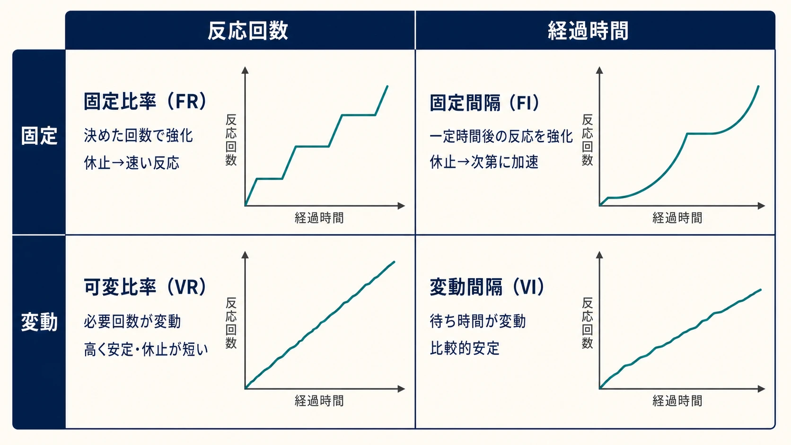
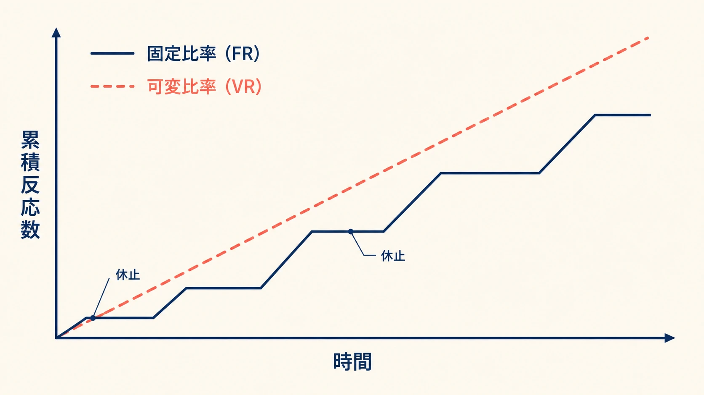
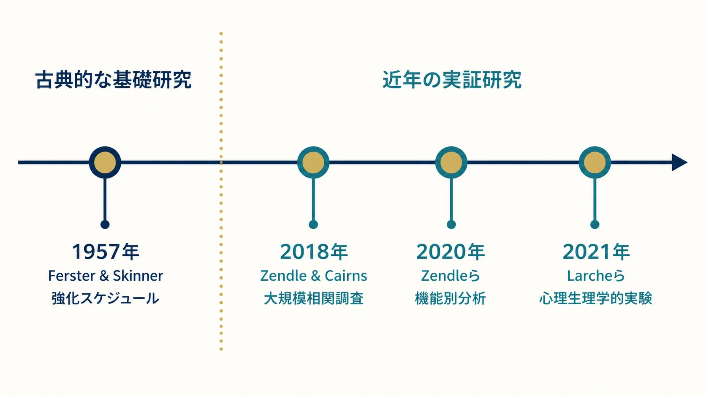
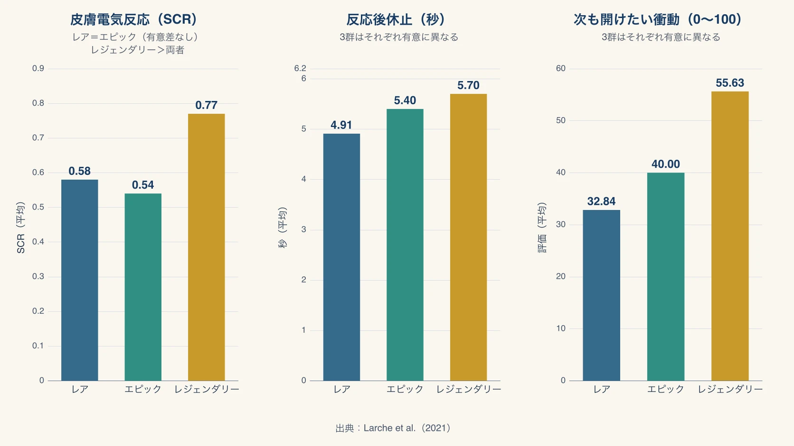

# ガチャはなぜ続けたくなるのか――可変比率強化を約70年の研究から読み解く

「ガチャは当たったときが気持ちよいから、つい次も回してしまう」。ゲームの企画現場では、このような感覚的な説明が交わされることがある。その背後にある研究の系譜は、1950年代まで遡る。

1957年、C. B. FersterとB. F. Skinnerは『Schedules of Reinforcement』を刊行し、行動の回数や経過時間に応じて結果を与える条件が、反応の速さ、休止の入り方、結果が得られなくなった後の粘り強さをどう変えるか体系的に整理した。なかでも、必要な反応回数が毎回変わる **可変比率強化スケジュール** は、高く安定した反応率と短い休止を生み、強化がなくなっても反応が残りやすかった。[[1](#ref-1)]

この知見は、予測不能な当たりが反復行動とどう結び付くかを理解するための基礎になる。現代のガチャやルートボックスのすべてを、これだけで説明できるわけではない。本稿は、約70年前の行動分析と、ルートボックスを対象にした近年の相関調査・心理生理学的実験を二段に分け、両者がどこでつながり、どこから先は説明できないかを整理する。

規制の経緯と確率表示については「[ガチャは違法になったのか？ コンプガチャ規制から確率表示までの歴史](gacha-regulation-japan-history.md)」、抽選前後の見せ方については「[ガチャ・ルートボックスの抽選演出と期待感の設計](loot-box-presentation-and-anticipation-design.md)」で扱っている。本稿では規制や演出技法の詳細に立ち入らず、心理学的な理論の理解に徹する。

***

## 行動の後に何が起きるかが、次の行動を変える

Skinnerの **オペラント条件付け** は、ある行動の後に生じた結果によって、その行動が将来どれだけ起こるかが変化する過程を指す。基本の単位は「行動→結果→その後の行動頻度の変化」である。

ここでいう **強化** は、ある結果が行動の後に生じ、その結果として同じ行動が増えたときに、はじめてその結果が行動を強化したと判断する、という機能的な定義を持つ。本人がうれしいと感じる報酬という言い換えとは異なり、豪華なアイテムを与えても以後の行動が増えなければ、行動分析上は強化として機能したとはいえない。

また、強化を「何回行動したら」「どれだけ時間が経ったら」与えるかという規則を **強化スケジュール** と呼ぶ。FersterとSkinnerは、比率と間隔、固定と変動を組み合わせた四つの基本スケジュールを、ハトを用いた実験で詳しく記録した。[[1](#ref-1)]

***

## 四つの強化スケジュールは、異なる反応パターンを作る

四つのスケジュールは、強化までの条件が「反応回数」か「経過時間」か、さらにその値が「固定」か「変動」かで区別できる。

| スケジュール | 強化される条件 | 典型的な反応パターン |
|---|---|---|
| 固定比率（FR） | 決められた回数だけ反応すると強化される | 強化後に明確な休止が入り、その後は次の強化まで速く反応する |
| 可変比率（VR） | 強化までに必要な反応回数が変動する | 高い反応率が安定して続き、強化後の休止が短い |
| 固定間隔（FI） | 一定時間が経過した後の最初の反応が強化される | 強化直後は反応が少なく、次の時点が近づくにつれて増える |
| 変動間隔（VI） | 強化が可能になるまでの時間が変動し、その後の最初の反応が強化される | 大きな休止や急加速が目立ちにくく、比較的安定した反応が続く |

固定比率と固定間隔を混同しないことが重要である。固定比率は「10回押せば1回強化」のように行動の数で決まり、固定間隔は「一定時間が過ぎた後の最初の1回」のように時間で決まる。変動間隔も同じく時間が基準であり、何度反応しても強化可能になる時刻そのものは早まらない。

*図：四つの基本強化スケジュールと、それぞれに典型的な累積反応パターン。*

***

## 可変比率では「次で強化されるか」が読めない

四つのうち、反復行動との関係でとくに重要なのが可変比率である。必要な反応回数が強化のたびに変わるため、直前に強化された事実から、次の強化までの距離を確定できない。一回反応するたびに、「次かもしれない」という状態が続く。

FersterとSkinnerの記録では、可変比率は四つの基本スケジュールのなかで、最も高く安定した **反応率**（一定時間内に生じる反応の多さ）、最も短い **反応後休止**（強化を受けてから次の反応を始めるまでの時間）、そして **消去**（それまでの強化を止め、反応が減っていく過程）への最も強い抵抗を示した。[[1](#ref-1)]

固定比率では、必要回数を達成して強化を得ると、次のひとまとまりへ入る前に明確な反応後休止が生じる。その後は速い反応が続き、また強化の後に休む。この「休止と連続反応」の繰り返しが固定比率の特徴である。

可変比率では、次の強化が遠いとも近いとも分からないため、固定比率ほど区切りの明確な休止が入りにくい。反応が高いペースで途切れず続きやすい。

*図：固定比率と可変比率で異なる、典型的な累積反応パターン。*

可変比率では、強化されない反応がもともと何度も続き得る。そのため、強化が止まった直後も、今回の未強化が通常のばらつきなのか、もう強化されない状態へ変わったのかを反応履歴だけから見分けにくい。これが、反応が長く残るという消去抵抗の形で表れる。

ここでの「最も強い」は、FersterとSkinnerが統制した実験条件のもとで、四つの基本スケジュールが作る反応パターンを比較した結果を指す。あらゆる人間の動機を横断して可変比率が常に最大の効果を生む、という一般化ではない。

***

## 一定確率のガチャは、なぜ構造的に「可変比率」になるのか

単純化したガチャを、次のように対応させると構造が見える。

| 行動分析の単位 | ガチャ・ルートボックスでの対応 |
|---|---|
| 反応 | 抽選を1回実行する |
| 強化 | 狙っていた当たりが出て、その経験が次の抽選行動を増やす |
| 比率 | 当たりまでに必要だった抽選回数 |

各回が同じ当選確率で、前回までの結果と独立して抽選される単純なモデルを考える。確率の数字は毎回同じでも、当たりが出るまでに必要な回数は毎回同じではない。1回目で出る場合もあれば、未当選が連続する場合もある。つまり、強化までに必要な反応回数が変動するため、構造は可変比率になる。

固定比率で固定されるのは、当選確率ではなく、強化に必要な反応回数である。10回目に必ず当たるなら固定比率として表せるが、各回の確率が同じでも何回目で当たるかが予測できない抽選は可変比率として働く。「確率が固定されているから固定比率」という理解では、この違いを取り違えることになる。

当たりを強化とみなせるかどうかは、その当たりによって同じ抽選行動が実際に増えたかを基準に決まる。結果の希少性だけで自動的に決まるものではない。この区別を置くことで、「高レアだから自動的に全員が条件付けされる」という乱暴な説明を避けられる。

***

## 近年の研究は、相関調査から実験室の測定へ進んだ

*図：古典的な基礎研究と、近年のルートボックス実証研究をつなぐ系譜。*

古典研究は、強化スケジュールが反応の形を変えることを、統制された環境で示した。現代の研究には、実際のプレイヤー集団で課金行動との関連を調べる方法と、ルートボックスを見た直後の反応を実験室で測る方法がある。両者は同じ問いに答えるものではない。

### 2018年――7,422人の調査で課金額との関連を測る

ZendleとCairnsは2018年、18歳以上のゲームプレイヤー7,422人を対象に、ルートボックスへの課金額と、問題ギャンブルの重症度を測るPGSIの関係を調べた。関連の大きさを示す効果量はη²=0.054であり、著者らは、問題ギャンブルと抑うつなど既知のリスク要因との関連より強いと報告した。ほかのゲーム内購入額との関連はη²=0.004であり、ルートボックス課金との関係の方が大きかった。[[2](#ref-2)]

この調査が示したのは、問題ギャンブルの重症度が高い参加者ほどルートボックスへの課金額も大きいという **相関** である。ルートボックスが問題ギャンブルを引き起こしたのか、もともと問題ギャンブル傾向のある人がルートボックスへ多く課金したのかは判別できない。論文自身も、因果の方向を確かめるには縦断研究や実験が必要だと明記している。[[2](#ref-2)]

### 2020年――個別機能を分けても関連は残る

Zendleらは2020年、Amazon Mechanical Turkで集めた1,200人の有効回答を用い、事前登録した相関分析を行った。課金額とPGSIの相関はSpearmanのρ=.304で、論文では効果量をη²=.092相当として報告している。[[3](#ref-3)]

この研究の特徴は、ルートボックスを一種類の仕組みとしてまとめず、現金化、ゲーム内での優位、ゲーム内通貨、箱と鍵、ニアミス、限定アイテムなど七つの機能に分けた点にある。現金化、ニアミス、ゲーム内通貨などは関連をわずかに強めたが、追加で説明する割合は小さかった。重要なのは、これらの機能がある場合にもない場合にも、課金額と問題ギャンブルの関連が残ったことである。[[3](#ref-3)]

調査が答えたのは、各機能の有無が「課金額とPGSIの関連」をどれだけ強めるかという問いである。この結果は因果を確定するものではなく、個別機能の差が小さいことも、それぞれの機能がプレイヤー体験に影響しないことを意味しない。

### 2021年――皮膚電気反応と反応後休止を測る

Larcheらは、『Overwatch』のルートボックス開封映像を用いて二つの実験を行った。実験1は47人を対象に主観的な価値、覚醒度、快・不快、次も開けたい衝動を測り、実験2は40人の有効データから、主観評価に加えて **皮膚電気反応**（発汗に伴う皮膚の電気的変化から覚醒反応を捉える指標）、マウスを押す力、反応後休止を測定した。[[4](#ref-4)]

実験2では、レジェンダリー級を見た後の皮膚電気反応の平均が.77、レア級では.58であり、レジェンダリー級への反応が有意に大きかった。次も開けたいという衝動の評価は、レジェンダリー級の平均55.63に対し、レア級は32.84だった。また、報酬が明らかになる前の予期段階でも、皮膚コンダクタンス水準の上昇が確認された。[[4](#ref-4)]

反応後休止は、レア級の平均4.91秒、エピック級の5.40秒、レジェンダリー級の5.70秒と、希少な報酬ほど長くなった。Larcheらは、この長い休止を大きな報酬に対する反応の指標として用いている。古典的な行動分析で蓄積された「強化後、次の反応まで何秒止まるか」という測定を、現代のルートボックス研究へ直接持ち込んだ点が重要である。[[4](#ref-4)]

*図：Larcheら（2021）の実験2で測定された、報酬の希少度別の反応。*

ここには、一見すると古典研究との矛盾がある。古典研究では可変比率の反応後休止が短く、Larcheらの実験では希少報酬ほど反応後休止が長い。しかし、比較しているものが異なる。

古典研究が比べたのは、異なる **強化スケジュール全体** のもとで次の反応へ移る速さである。Larcheらが比べたのは、同じ開封映像の系列内で **直前に得た報酬の希少度** が次の操作までの間をどう変えるかである。前者の短い休止は可変比率下で反応が途切れにくいことを示し、後者の長い休止は希少な結果に対する反応の大きさを示す。反応後休止という同じ測定名でも、何を比較した値かを見なければならない。

Larcheらの実験は、希少な非金銭的報酬が主観評価だけでなく、生理反応と次の操作までの時間にも差を生んだことを示した。一方、可変比率が課金や問題ギャンブルを引き起こす因果過程を直接検証した実験ではない。2018年・2020年の相関調査と2021年の実験を並べる価値は、異なる測定法が同じ結論を証明したことではなく、集団レベルの関連と、一回ごとの報酬反応を別々の角度から捉えたことにある。

***

## ガチャへの動機には、条件付け以外の理由も重なっている

ガチャを「スキナー箱」と呼べば、予測不能な結果が反復行動を維持しやすい構造を短く表せる。この比喩を説明の終点にせず、プレイヤーが何を強化として受け取ったのかまで踏み込む必要がある。

The Skeptic誌でShao Zihangは、ガチャを遊ぶ一人のプレイヤーへのインタビューを通じ、物語やキャラクターへの愛着、ゲーム内の目標、固定価格で買うよりも自分の運で引き当てたと感じる満足など、複数の動機が抽選に重なっていることを描いた。[[5](#ref-5)] これは代表性のある調査ではなく、一人の経験を記述した記事である。そのため動機の割合や一般性を示す証拠にはできないが、強化スケジュールの説明範囲を考える材料にはなる。

可変比率の理論は、結果が予測不能なときに「反応がどのような時間パターンで続きやすいか」を説明する。一方で、なぜそのキャラクターが欲しいのか、物語上の経験がどのような価値を与えたのか、本人が抽選結果を努力・幸運・所有とどう結び付けるのかまでは、それだけで決まらない。

したがって、ガチャと実験装置に共通する構造を認めることと、プレイヤーの経験を実験動物の反応へ還元することは別である。「スキナー箱」という比喩は入口にはなっても、理論の代わりにはならない。

***

## プランナーが持ち帰るのは、プレイヤー体験を分解する観察の枠組みである

強化スケジュールを知る目的は、プレイヤーが置かれている経験を、曖昧な「気持ちよさ」から分解して見ることにある。「どの確率なら最も回させられるか」という実装知識を得ることが目的ではない。

企画を読むときは、少なくとも次の問いを分けられる。

1. プレイヤーが繰り返している反応は何か。
2. どの結果が、その反応を実際に増やしているか。
3. 強化までの回数や時間は、プレイヤーから予測できるか。
4. 強化後の休止と、強化が得られない期間の反応はどう変化するか。
5. 抽選結果には、キャラクターへの愛着や物語上の意味がどれだけ重なっているか。

この枠組みを使えば、高い継続率を一語で「中毒性」と呼んだり、豪華な演出を一律に原因とみなしたりせず、観察している現象を分けられる。同時に、可変比率が反応を高く維持し、消去にも抵抗しやすいという知見は、ランダム報酬を単なる装飾として扱えない理由にもなる。設計者は、その反復性がどのプレイヤー体験と支出に結び付くかを理解する責任を負う。

規制、確率表示、販売条件の判断は「[ガチャは違法になったのか？](gacha-regulation-japan-history.md)」の領域であり、光・音・間・購入導線を含む演出設計は「[ガチャ・ルートボックスの抽選演出と期待感の設計](loot-box-presentation-and-anticipation-design.md)」の領域である。本稿の理論は両者の前提にはなるが、法的結論や具体的な演出手法をそれだけで導くものではない。

***

## まとめ――古典理論と現代の測定を、同じ言葉で潰さない

第一段の基礎研究では、FersterとSkinnerが、行動と結果の配置によって異なる反応パターンが生じることを示した。可変比率は、高く安定した反応率、短い反応後休止、強い消去抵抗を示す。一定の当選確率でも、当たりまでに必要な抽選回数が予測不能なら、単純化したガチャはこの構造に対応する。

第二段の近年研究では、Zendleらの調査がルートボックス課金額と問題ギャンブル指標の関連を繰り返し示し、Larcheらの実験が希少報酬に対する主観的評価、皮膚電気反応、予期的覚醒、反応後休止を測った。ただし、相関は因果ではなく、希少報酬への反応を測る実験も、可変比率が問題行動を生む過程の直接証明ではない。

約70年の研究をつなぐ価値は、どの実験が何を比較し、どの測定が何を示し、どこから先に物語・キャラクター・自己解釈という別の説明が必要になるかを見分けることにある。「ガチャはスキナー箱だ」という短い結論を強化することではない。単純な比喩を理論と証拠へ戻すことで、プレイヤー体験をより正確に語れるようになる。

## References

1. [Schedules of Reinforcement][1] - C. B. FersterとB. F. Skinnerが1957年に刊行した、強化スケジュールと反応パターンに関する古典的研究。B. F. Skinner Foundationによる書誌・復刻版案内。

2. [Video game loot boxes are linked to problem gambling: Results of a large-scale survey][2] - ZendleとCairnsによる2018年の大規模相関調査。7,422人のルートボックス課金額とPGSIを分析した。

3. [Paying for loot boxes is linked to problem gambling, regardless of specific features such as cash-out and pay-to-win][3] - Zendleらによる2020年の事前登録済み相関研究。1,200人を対象に七つの機能別の関連を分析した著者最終稿。

4. [Rare loot box rewards trigger larger arousal and reward responses, and greater urge to open more loot boxes][4] - Larcheらによる2021年の心理生理学的実験。『Overwatch』の開封映像を用い、主観評価、皮膚電気反応、反応後休止などを測定した。

5. [Are 'gacha' games and loot boxes merely gambling in disguise?][5] - Shao ZihangによるThe Skeptic誌の記事。物語・キャラクターへの愛着や、自分の運で引き当てる感覚を含むプレイヤーの動機を扱う。

[1]: https://www.bfskinner.org/product/schedules-of-reinforcement-paperback-for-education/
[2]: https://doi.org/10.1371/journal.pone.0206767
[3]: https://eprints.whiterose.ac.uk/id/eprint/148267/1/CHB_Loot_Box_Features_Accepted.pdf
[4]: https://doi.org/10.1007/s10899-019-09913-5
[5]: https://www.skeptic.org.uk/2024/09/are-gacha-games-and-loot-boxes-merely-gambling-in-disguise/

----

この文書は、Perplexity、Claude、OpenAI Codex の3つのAIの支援を受けて著述されたものです。引用画像を除き、MIT License にて提供されています。
