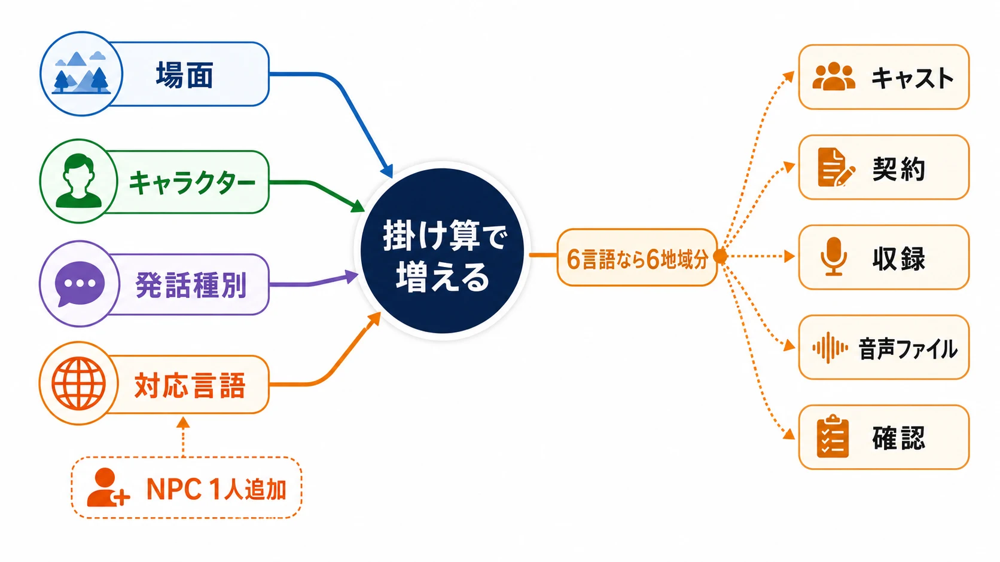
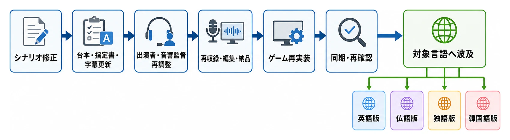
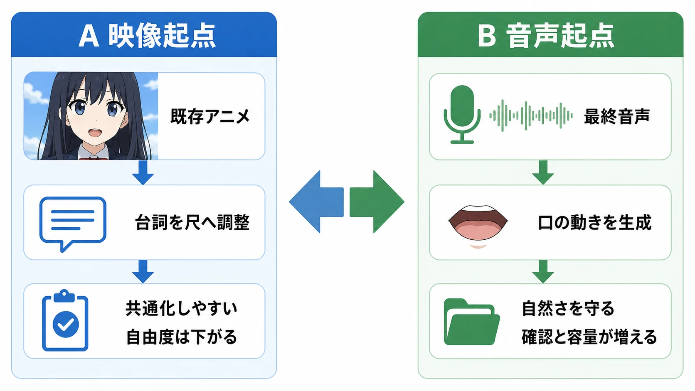
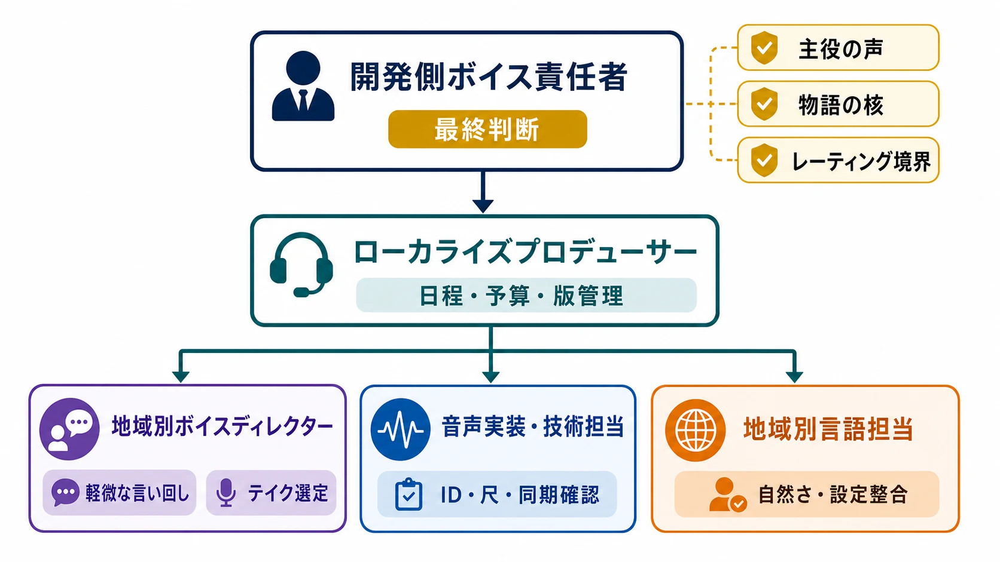

# 声優キャスティングとローカライズ収録の実務

## 「台詞が書けたら声優に読んでもらう」では終わらない

ゲームのボイス収録は、完成した台詞をマイクの前で読むだけの工程に見えやすい。しかし実務では、キャラクター解釈、出演者の予定、スタジオ、契約、映像の尺、地域別の表現基準、実装用データが一度に交差する。しかも、収録後に一文字を変えるだけでも、テキストのように担当者がその場で保存し直すことはできない。

新人プランナーが最初に解いておきたい誤解は、 **ボイスは最後に足す装飾ではない** ということだ。後工程で録ることが多いのは、重要度が低いからではなく、前工程の台詞、演出、映像、ゲーム仕様をできるだけ確定させてからでなければ手戻りが大きいからである。Microsoftのゲームローカライズ解説も、脚本変更後の再作業時間を確保するため早期着手が必要であり、細かな再収録を何度も行うより、キャラクター単位で台詞を固めてまとめて録る方が一般に安いと説明している。[[1](#ref-1)]

本記事では、日本語で企画・収録されるゲームを前提に、テキスト翻訳、用語集、言語品質保証（LQA）の一般工程は扱わない。焦点は、日本語の台詞を **演技として設計し、収録し、各言語の音声アセットとして実装するまで** に絞る。国内と海外を貫く問いは同じだ。

> 限られた予算と日程のなかで、どのキャラクター、どの場面、どの言語まで「声」を保証するのか。

国内収録では一人の出演者を再び呼ぶ難しさとして、海外収録では言語数だけ工程が枝分かれする難しさとして、この問いが姿を変えて現れる。

***

## 1. 最初に決めるのは声優名ではなく、ボイスの範囲

キャスティングの話を始める前に、プロジェクトは「どこまでを音声化するか」を決める必要がある。フルボイスという言葉も、全テキストを全言語で収録する意味とは限らない。メインストーリーだけ、主要人物だけ、戦闘中の掛け声だけ、あるいは日本語音声と英語吹き替えだけという設計もある。

範囲を考える単位は、少なくとも次の四軸に分けたい。

| 軸 | 主な選択肢 | 増えるもの |
|---|---|---|
| 場面 | ムービーのみ｜メイン会話｜サブクエスト｜汎用会話 | 台詞数、収録時間、再収録リスク |
| キャラクター | 主役のみ｜主要人物｜全NPC | キャスト数、日程調整、演技整合性の管理 |
| 発話種別 | 通常台詞｜戦闘掛け声｜ガヤ｜歌唱 | テイク数、声帯負荷、加工・編集工数 |
| 対応言語 | 日本語のみ｜一部海外吹き替え｜全対象言語 | 言語別の脚色、キャスティング、収録、実装、審査 |

この四軸は掛け算になる。たとえばNPCを一人追加する判断は、日本語版では一役の追加でも、6言語吹き替えなら6地域のキャスト、契約、収録、音声ファイル、確認作業を増やす。音声対応の範囲を、発売直前に売上予測だけで足し引きすると危険なのはこのためだ。

判断材料になるのは、台詞数だけではない。 **物語上の重要度、繰り返し聞く頻度、口の動きが見える度合い、発売後に台詞が増える可能性、対象市場の規模、ダウンロード容量、アクセシビリティ方針** まで含めて配分する。重要場面へ厚く投資し、それ以外は字幕や汎用ボイスで補う設計は、単なる品質低下ではなく、変更耐性を買う選択にもなり得る。

*画像：OpenAI gpt-image で生成したインフォグラフィック。PNG生成後、WebPへ変換。*

***

## 2. 日本語版収録を支える音響監督と「音響指定書」

### 音響監督は、台詞の読み方を指示するだけではない

音響監督は、作品側の演出意図を、出演者と録音スタッフが実行できる言葉へ変換する役割を担う。キャスティングへの参加、声質と演技の方向付け、収録中の速度・感情・間の調整、ガヤの設計、録音後の音響処理まで、担当範囲は制作体制によって変わる。

日本音声製作者連盟が公開する音響制作工程でも、音響監督はキャスト選考に関わり、収録では台詞の話し方、感情表現、速度を演出する。現場には監督や制作会社の担当者が立ち会い、脚本家や原作者が参加する場合もある。[[2](#ref-2)] ゲームではさらに、同じ一言が探索、戦闘、メニュー、通信など異なる条件で再生されるため、映像作品以上に「どこで、何に反応して出る声か」の説明が必要になる。

### 音響指定書は、演技指示と実装仕様の橋である

ここで使う **音響指定書** とは、収録台本だけでは伝わらない演出・再生条件をまとめた資料の総称である。名称はプロジェクトにより、ボイス仕様書、収録指示書、キャラクター資料などに分かれることもある。大切なのは書類名ではなく、次の情報が一意に結び付いていることだ。

- 台詞ID、話者、表示テキスト、読み仮名
- 発話前後の状況、相手、感情の変化、台詞の目的
- 通常会話、被弾、必殺技、息、ガヤなどの種別
- 尺の上限、口パク映像の有無、前後に必要な無音
- 声量、距離感、ささやき、叫びなどの演技・録音条件
- ファイル名、分割単位、ループやランダム再生などの実装条件
- 収録済み、採用テイク、要再録、欠番といった状態

ゲーム音声では、台本上は同じ「やった！」でも、敵を倒した瞬間、希少アイテムを得た瞬間、仲間を救った瞬間では演技が違う。反対に、細かい感情形容詞を大量に並べても、作品全体の基準がなければ指示はぶれる。「この人物は怒鳴らず、怒るほど声が低くなる」のような **キャラクターの演技原則** と、その行だけの状況説明を分けると、収録現場で判断しやすい。

専門会社へ音声収録を依頼する際にも、キャラクター数、個性、相関図、兼ね役、掛け声やアドリブの種類、尺合わせの有無などが事前情報として必要になる。[[3](#ref-3)] 指定書は音響監督への注文書ではなく、開発側と音響側が同じ完成像を持つための共通言語なのである。

***

## 3. キャスティングは「似た声探し」ではない

### オーディションで見ているもの

候補者を選ぶとき、声質がキャラクター像に合うかは一要素にすぎない。長い会話で感情の段階を作れるか、短い掛け声だけで状況を区別できるか、収録中の修正指示に応じて別案を出せるか、叫びを含む役を安全に継続できるかも作品によって重要になる。

オーディション用の台詞は、格好のよい決め台詞だけでなく、役の幅が見える組み合わせにする。平静時と追い詰められた場面、相手との距離が違う会話、固有名詞を含む台詞などを用意し、各候補へ同じ前提を渡す。日本音声製作者連盟の工程紹介でも、メインキャラクターは声とプロフィールを基にプロデューサー、監督、音響監督らが協議し、制作担当者は予算とスケジュールを踏まえて選考に加わるとしている。[[2](#ref-2)]

有名かどうかと、役に適しているかも別問題である。知名度は宣伝価値を持つ一方、出演料、拘束可能日、続編や追加収録への参加可能性、ほかの役との組み合わせに影響する。小規模作品なら、主役へ予算を集中するより、主要キャスト全体の演技水準と再収録可能性を揃えた方が完成度を守れる場合もある。

### 事務所とのやり取りで確定させること

所属事務所やキャスティング会社との窓口では、候補日の確認だけでなく、作品概要、役柄、台詞量、収録方法、叫びや歌唱の有無、宣伝出演、クレジット、利用媒体を伝える。未発表作品なら情報管理の条件も要る。

キャラクター解釈のすり合わせは、声優本人へ巨大な設定資料をそのまま渡せば済むわけではない。音響監督が作品側の意図を整理し、役者が演技へ変換できる情報量にする。プランナーは仕様上の事実、シナリオライターは人物の意図、音響監督は演技として成立する指示を持ち寄る。三者が別々にマイクへ注文すると、声優はどれを優先すべきか分からなくなる。 **演技指示の出口を音響監督へ集約する** ことが、現場の速度を守る。

***

## 4. 収録現場でプランナーとライターは何を判断するのか

立ち会いの価値は、全台詞へ細かく口を出すことではない。音響監督だけでは確定できないゲーム仕様と物語上の意味を、その場で回答できることにある。

プランナーは、発話条件、操作との関係、繰り返し頻度、尺、ほかのボイスとの競合を確認する。シナリオライターは、台詞の含意、人物関係、その時点で知っている情報、後の展開との整合を判断する。音響監督は、それを演技へ落とし込み、テイクを選ぶ。立会者は「もっと格好よく」のような感想ではなく、「この台詞は仲間には強がっているが、本人は失敗に気づいている」のように、演技を変える理由を短く返す。

### アドリブと掛け声は、録った瞬間にはまだ製品ではない

声優のアドリブがキャラクターを豊かにすることはある。しかし採用には、少なくとも次の確認が要る。

1. 設定、年齢区分、他地域の表現方針と矛盾しないか。
2. 字幕を付けるか。付けるなら翻訳対象へ追加できるか。
3. 対応する台詞ID、ファイル名、再生条件を作れるか。
4. ほかの言語でも同じ機能と演出を再現するか。
5. 契約上の利用範囲に収まり、採用テイクとして記録できるか。

戦闘の息、被弾声、掛け声も同じである。「何種類かください」では、軽傷と瀕死、通常攻撃と大技を実装側が区別できない。用途、長さ、強度、必要数を先に定義し、過度な叫びを連続させない収録順も音響側と相談する。予定外の良い演技を歓迎しつつ、 **採用後の字幕・翻訳・実装まで所有者を決める** のがプランナーの仕事になる。

***

## 5. なぜボイス収録は後工程になり、変更に弱いのか

ボイスは、シナリオ、ゲーム仕様、キャラクター設定、映像尺の下流にある。早すぎれば未確定台詞を録り直し、遅すぎれば実装・調整・審査に間に合わない。したがって「全仕様完成後に一度だけ録る」のではなく、変更可能性を見ながら **収録可能な塊を順に凍結する** 方が現実的である。

台詞を一行差し替えたときに動く工程を追うと、コストの正体が見える。

*画像：OpenAI gpt-image で生成したインフォグラフィック。PNG生成後、WebPへ変換。*

変更を禁止すればよいわけではない。録った後に、分かりにくい台詞や危険な表現が見つかることもある。大切なのは、変更を「文字列一個」と数えず、影響範囲で見積もることだ。

実務では、台詞に状態を持たせると判断しやすい。たとえば「執筆中」「演出確認済み」「収録ロック」「収録済み」「実装済み」を区別し、収録ロック後の変更には理由、対象言語、再録要否、責任者を記録する。軽微な字幕修正で済むのか、演技の意味が変わるため全言語を録り直すのかを、変更管理の場で決める。

***

## 6. 契約でプランナーも知っておくべき境界

契約文言の作成は法務や制作管理の領域だが、企画判断が契約条件を増やすことはプランナーも理解しておきたい。確認対象には、収録の報酬・拘束単位だけでなく、次が含まれる。

- 本編、体験版、追加コンテンツ、アップデートでの利用
- PV、配信番組、イベント、広告など本編外での利用
- 音声単体の商品、サウンドトラック、映像化などの二次利用
- 続編・派生作で同じ役を依頼する際の優先交渉、拘束、条件
- 収録済み音声の再編集、加工、別媒体への転用
- 声のデジタル複製や生成利用の同意、用途、期間

日本俳優連合は、日本音声製作者連盟との協約を通じ、声の出演について作品の二次利用条件を含むルール作りを行っている。[[4](#ref-4)] ただし、この枠組みはアニメ・外国映画吹替を対象とする協約であり、ゲームの出演料はその対象外である。日本俳優連合の関係者へのインタビューでは、ゲームはナレーションや広告と同様に音声連との統一運用表がなく、出演料がランク制度と連動せず、案件ごとの交渉に委ねられると説明されている。[[5](#ref-5)] 本記事が具体的な料率を示さないのは、単に資料が不足しているからではなく、ゲームの出演料そのものが個別交渉の性質を持つためである。海外でも条件は地域・組合・契約ごとに異なる。たとえばSAG-AFTRAの2025年Interactive Media Agreementでは、デジタル複製の作成・利用について書面の同意と用途説明を求め、フランチャイズ内の追加利用にも個別作品ごとの報酬条件を置いている。[[6](#ref-6)]

ここでの要点は、 **続編で同じ声を当然に使えるとは限らず、逆に将来作まで広く縛ればよいわけでもない** ことだ。出演者の活動を不当に拘束せず、シリーズとして声の継続性も守れる条件を、予定の現実性に合わせて設計する。企画段階で「この音声をPVにも使う」「運営で季節台詞を追加する」と分かっているなら、後から当然視せず、制作・法務へ早く共有する。

***

## 7. 海外向け収録では、一本の台詞が言語別の制作ラインになる

海外向けの吹き替えは、日本語音声を置換するだけではない。日本語原文と日本語版の採用テイクを出発点に、台詞の意図を各言語の演技へ再構成し、キャストを選び、尺を合わせ、収録し、音声アセットを実装する別の制作である。Microsoftもゲームの音声・映像ローカライズには、脚色、キャスティング、演出、表情アニメーションに合わせたリップシンクが必要になり得るとしている。[[1](#ref-1)]

### リップシンクには、逆向きの二つの設計がある

一つ目は、 **既存アニメーションへ音声を合わせる** 方法である。日本語版の口の開閉やカット尺が確定している場合、対象言語の台詞を意味と演技を保ちながら、その時間へ収める。直訳が長すぎれば、語順を変え、言い換え、間を調整する。『戦場のヴァルキュリア4』英語版の制作紹介でも、日本語版の口の動きへ英語音声を合わせるため、初稿の台詞をボイスディレクターが調整し、再収録も行ったことが説明されている。[[7](#ref-7)]

もう一つは、 **音声に合わせて口の動きを作る** 方法である。先に各言語の最終音声を作り、言語別にフェイシャルアニメーションを生成・修正する。現在は音声から口周辺のアニメーションを生成する仕組みもあり、MetaHuman AnimatorはSoundWaveアセットから顔のアニメーショントラックを作り、口周辺だけを処理する機能を提供している。[[8](#ref-8)]

後者は台詞の自然さを守りやすい一方、言語別アニメーションの生成、保存、確認、容量が増える。前者は映像資産を共通化しやすいが、台詞の自由度を削る。すべての場面を同じ方式にせず、顔が大きく映る重要ムービーは言語別、遠景やゲーム中会話は共通の簡易口パク、といった層分けも判断肢になる。

*画像：OpenAI gpt-image で生成したインフォグラフィック。PNG生成後、WebPへ変換。*

### カルチャライゼーションは、音声として成立する台詞へ作り直すこと

ここでは翻訳手順を再説明しない。収録の観点で重要なのは、日本語原文として正しい台詞と、対象言語の人物がその場で口にできる台詞が同じとは限らない点だ。冗談、侮辱、敬称、親密さ、ためらいは、直訳すると人物像や会話の速度を壊すことがある。

言い回しを作り直す判断では、日本語原文の単語よりも、その台詞が果たす機能を残す。「相手を笑わせる」「上下関係を示す」「危険を短く伝える」「後の伏線を隠す」といった機能である。ただし対象言語のディレクターだけへ自由に委ねると、設定や将来の展開と衝突する。変更理由と、絶対に変えてはいけない情報を開発側が返せる問い合わせ経路が必要になる。

### EFIGSなどを同時に動かすと、承認待ちが工程を止める

日本語原文から海外向けにローカライズする場合、最初に検討されやすい対象言語群の一つがEFIGSである。EFIGSは英語・フランス語・イタリア語・ドイツ語・スペイン語を指す略記で、そこへ韓国語、中国語、ポルトガル語などを加えるかは作品と市場によって変わる。実案件では略記だけに頼らず、言語名と地域変種を個別に明記した方が安全である。

多言語同時収録では、費用が言語数倍になるだけでなく、次の依存関係が増える。

- 日本語版側が台詞とキャラクター資料を渡す時期
- 各言語の翻訳・脚色と開発側への質問
- 言語別オーディションと承認
- 対象言語のキャスト、ディレクター、スタジオの空き
- 収録後の編集、ファイル命名、実装、修正

スクウェア・エニックスによるGDC講演も、多言語同時開発では音声ファイルとテキスト資産が同時に増え、翻訳者、サウンドエンジニア、収録スタジオ、開発チーム間の受け渡しとアセット管理が課題になると説明している。[[9](#ref-9)] 大規模例では、『Cyberpunk 2077』のローカライズチームが11音声言語の収録を扱い、成功に重要なのは技術チームとローカライズチームの密な協力だったとGDCで報告している。[[10](#ref-10)]

したがって、全言語を同じ日に開始することより、 **同じ版の日本語原文を参照し、同じIDで差分を追えること** の方が重要になる。日本語原文の更新が各言語へ届いたか、どの言語が録音前なら直せるか、録音済みなら再録するかを一つの台詞単位で見えるようにする。日程には収録日だけでなく、質問回答、キャスト承認、再録、実装確認の余白を置く。

### レーティングと表現規制は、収録前に台詞へ戻す

地域別の年齢区分は映像だけを見ているわけではない。CEROの審査倫理規定には「言語・思想関連表現」が含まれる。またIARCは質問票から地域別の年齢区分と内容記述を割り当てる。[[11](#ref-11)][[12](#ref-12)]

そのため、対象言語版だけ侮辱語を強める、冗談に薬物や性的な含意を加える、といった脚色が目標レーティングへ影響する場合がある。収録後に気づけば再収録になる。各地域の担当者へ「対象年齢を守って自然に」とだけ頼むのではなく、避ける表現、許容する強さ、物語上必要な例外を収録前のガイドへ反映する。

***

## 8. 海外スタジオと連携するための最小体制

海外の収録スタジオやボーカルディレクション会社へ丸投げしても、作品理解までは自動的に移らない。外部会社は、キャスト交渉、脚色、ボイスディレクション、収録、ミックス、ADR、フェイシャルキャプチャまで一括提供する場合がある。[[13](#ref-13)] だからこそ開発側は、何を委ね、何を承認するかを決める必要がある。

最低限、次の役割を置きたい。

| 役割 | 主な責任 |
|---|---|
| 開発側ボイス責任者 | 日本語原文の意図、仕様変更、キャスト・重要台詞の最終判断 |
| ローカライズプロデューサー | 全言語の日程、予算、版管理、問い合わせの交通整理 |
| 地域別ボイスディレクター | 対象言語の演技、キャスト、収録現場の判断 |
| 音声実装・技術担当 | ID、ファイル仕様、尺、口パク、ゲーム内再生の検証 |
| 地域別言語担当 | 台詞の自然さ、設定整合、レーティング上の確認 |

*画像：OpenAI gpt-image で生成したインフォグラフィック。PNG生成後、WebPへ変換。*

渡す資料は台本だけでは足りない。キャラクター略歴、相関図、演技原則、発音資料、日本語版の採用テイク、場面映像、尺、変更禁止情報、問い合わせ先を一つのパッケージにする。Microsoftも、キャラクター紹介、攻略情報、スタイルガイド、ゲームビルドなどを渡すほど、開発チームから離れたローカライズ側が文脈を理解しやすいとしている。[[1](#ref-1)]

承認も全部を本社へ戻すと詰まる。主役の声、物語の核となる台詞、レーティング境界は開発側が見る一方、軽微な言い回しとテイク選定は地域ディレクターへ委任する、といった **承認レベル** を先に決める。対象言語としての自然さと原作統制のどちらか一方を最大化するのではなく、判断の所在を明確にすることが品質と速度を両立させる。

***

## 9. デュアルボイスは音声ファイルを二組入れるだけではない

海外のファンには、翻訳字幕と日本語音声の組み合わせを好む層がいる。一方で、母語の吹き替えによって字幕を追わずに遊びたい層もいる。どちらかを「本来の遊び方」と決めつけず、作品、地域、プレイヤー層から判断する必要がある。

デュアルボイスを実装すると、音声データ容量だけでなく、言語選択UI、初回起動時の既定値、字幕との組み合わせ、ムービーとゲーム中音声の切替、追加ダウンロード、セーブデータとの関係、両音声での動作確認が増える。プラットフォーム側でも、インターフェース、音声、字幕は別々の言語対応項目として扱われ、言語パックを追加ダウンロードにする構成も想定されている。[[14](#ref-14)]

『戦場のヴァルキュリア4』海外版のように、英語吹き替えと日本語音声を切り替えられる例もある。[[7](#ref-7)] ただし、成功例があることと、全作品で採算が合うことは別である。判断時には次を並べる。

- 日本語音声を求めるプレイヤーの規模と、吹き替えで届く新規層
- パッケージ容量と配信コスト。言語パックを分離できるか
- 日本語音声と対象言語字幕の意味・尺がずれた際の許容方針
- 本編後の追加コンテンツでも両音声を継続できるか
- 片方のキャスト事情で配信日が遅れた場合の運用方針

デュアルボイスはファンサービスであると同時に、発売後も二本の音声ラインを維持する約束である。初回だけ実装できるかではなく、追加ストーリー、再配信、次世代機版まで含めて続けられるかを見る。

***

## 10. 予算配分を決めるための実務的な問い

最後に、フルボイス化の範囲を検討するときの判断軸をまとめる。これは採点表ではなく、制作ごとの優先順位を会話にするための材料である。

| 問い | 「広く収録」へ傾く条件 | 「範囲を絞る」へ傾く条件 |
|---|---|---|
| 声がゲーム体験の核か | 会話、演技、没入が主要価値 | システム主体で台詞の反復が多い |
| 台詞はいつ固まるか | 早期にロックできる | 分岐や運営更新で変更が多い |
| 顔はどれだけ見えるか | 重要場面で大きく映る | 遠景、汎用口パク、非表示が中心 |
| 市場ごとの需要はあるか | 吹き替えが到達可能層を広げる | 字幕＋日本語音声を強く好む層が中心 |
| 継続運用できるか | 追加収録の予算と日程を確保できる | 更新頻度が高く、キャスト再集合が難しい |
| 技術基盤はあるか | 言語別アセットと差分を自動管理できる | 手作業の命名・実装・確認が多い |

予算が足りないとき、単価だけを削ると、演技時間、対象言語のディレクション、再録余白が先に失われる。代わりに、音声化する場面を絞る、主要人物へ集中する、顔が映る場面だけ高精度なリップシンクにする、需要の高い言語から段階投入する、といった **範囲の設計** を先に検討したい。

反対に、声が商品価値の中心なら、ボイスを余った予算で作るのではなく、シナリオ制作時点からキャスティング、収録、実装、追加運用までを一本の予算として持つ。国内版の採用テイクは、海外版にとっても演技資料になる。日本語の指定書と台詞IDは、そのまま多言語制作の上流データになる。国内と海外は別工程であっても、上流の決定品質は共有されている。

***

## おわりに｜声の品質は、マイク前より前に決まる

収録現場で生まれる演技は、作品に代えがたい価値を与える。しかし、その価値をゲームへ残すには、台詞ID、演出意図、キャスト、契約、尺、実装、地域別の判断がつながっていなければならない。

日本語版では、変更後に同じ出演者とスタッフを再び集める難しさがある。海外版では、一つの変更が言語数だけ分岐し、各地域の承認、収録、口パク、審査へ波及する。どちらも問題の根は「声優費が高い」ことだけではない。 **人と判断を、必要な時点でもう一度同期させ直すコストが高い** のである。

だからプランナーが守るべきなのは、「何でもフルボイスにする」という豪華さではない。声にする価値が高い場所を見極め、変更可能性を管理し、演技が別言語と実装工程を通っても意味を失わない資料と体制を作ることだ。それが、華やかなキャスティングを、現場で破綻しないゲームの声へ変える。

## References

1. [Localize games - Globalization｜Microsoft Learn][1] - ゲーム音声の脚色、キャスティング、演出、リップシンク、資料提供、脚本変更による再収録コストを解説している。

2. [現場のお仕事〈アニメ音響制作〉｜日本音声製作者連盟][2] - キャスティング、出演交渉、台本、音響監督による演技指示、立ち会い、ミックスまでの音響制作工程を説明している。

3. [ゲームタイトルヒットのカギを握る「ゲームの音声収録」とは｜SunFlare Style][3] - ゲーム音声収録に必要なキャラクター資料、兼ね役、掛け声、アドリブ、尺・リップシンク条件を整理している。

4. [活動内容｜協同組合 日本俳優連合][4] - 声の出演について、日本音声製作者連盟との協約と二次利用条件を含むルール作りを説明している。

5. [居酒屋日俳連 先輩方に、今更聞きにくいこと聞いてきました！｜日本俳優連合][5] - ゲームの出演料はアニメ・外画吹替の統一運用表の対象外であり、ランク制度と連動せず案件ごとの交渉に委ねられると、外画動画部会関係者が説明している。

6. [Summary of 2025 Interactive Media (Video Game) Agreement｜SAG-AFTRA][6] - デジタル複製の書面同意、用途説明、追加利用、フランチャイズ内利用と報酬条件の概要を示している。

7. [Interview: Localizing the Voice Acting of Valkyria Chronicles 4｜PlayStation.Blog][7] - 英語台詞を既存の口の動きへ合わせる調整、再収録、演技の一貫性、デュアルボイス実装を制作担当者が説明している。

8. [音声駆動アニメーション｜MetaHuman Documentation][8] - 音声アセットから顔・口周辺のアニメーションを生成する公式ワークフローを解説している。

9. [Audio Localization Done Right: Simultaneous Scripting and Recording｜GDC Vault][9] - スクウェア・エニックスの講演概要。多言語同時収録における関係者間の受け渡しとアセット管理の課題を示している。

10. [Localization of 'Cyberpunk 2077': Technology, Tools, and Approach｜GDC Vault][10] - 多数の音声言語を扱うパイプラインと、技術・ローカライズ両チームの協力を扱ったCD PROJEKT REDの講演概要。

11. [CERO審査倫理規定｜コンピュータエンターテインメントレーティング機構][11] - 審査対象となる言語・思想関連表現と、表現の程度を判断する観点を定めている。

12. [How IARC Works｜International Age Rating Coalition][12] - 質問票を基に地域別の年齢区分と内容記述を割り当てる仕組みを説明している。

13. [Dubbing & Voice-Over｜Keywords Studios][13] - 海外拠点で提供するキャスト交渉、脚色、演出、収録、ミックス、ADR、フェイシャルキャプチャ等の業務範囲を示している。

14. [Supported Languages - Game Publishing Guide｜Microsoft Learn][14] - ストア上でインターフェース、音声、字幕を別々に表示し、言語パックの追加ダウンロードも扱う仕様を説明している。

[1]: https://learn.microsoft.com/ja-jp/globalization/localization/localize-games
[2]: https://onseiren.com/onseiseisaku/douga
[3]: https://blog.sunflare.com/blog/001326.html
[4]: https://www.nippairen.com/about/active.html
[5]: https://www.nippairen.com/progress/izakaya001.html
[6]: https://www.sagaftra.org/sites/default/files/2025-06/2025%20Interactive%20Media%20%28Video%20Game%29%20Agreement%20Summary.pdf
[7]: https://blog.playstation.com/2018/07/31/interview-localizing-the-voice-acting-of-valkyria-chronicles-4/
[8]: https://dev.epicgames.com/documentation/ja-jp/metahuman/audio-driven-animation
[9]: https://www.gdcvault.com/play/1015618/Audio-Localization-Done-Right-Simultaneous
[10]: https://www.gdcvault.com/play/1029219/Localization-of-Cyberpunk-2077-Technology
[11]: https://www.cero.gr.jp/relays/download/3/43/93/319/?file=/files/libs/319/202506241008217053.pdf
[12]: https://globalratings.com/how-iarc-works/
[13]: https://www.keywordsstudios.com/en/services/media-entertainment/content-localization/dubbing-voice-over/
[14]: https://learn.microsoft.com/en-us/gaming/game-publishing/concepts/metadata-supported-languages

----

この文書は、Perplexity、Claude、OpenAI Codex の3つのAIの支援を受けて著述されたものです。引用画像を除き、MIT License にて提供されています。
