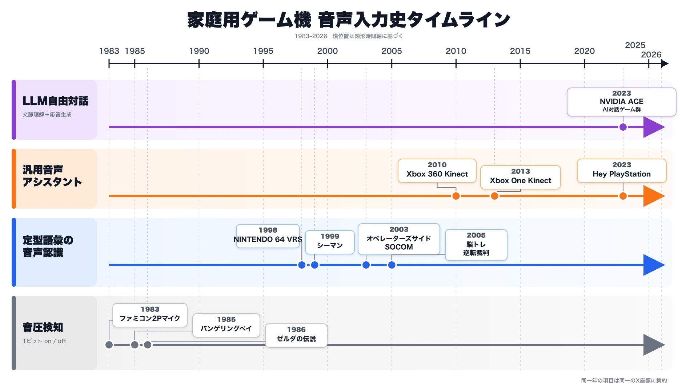
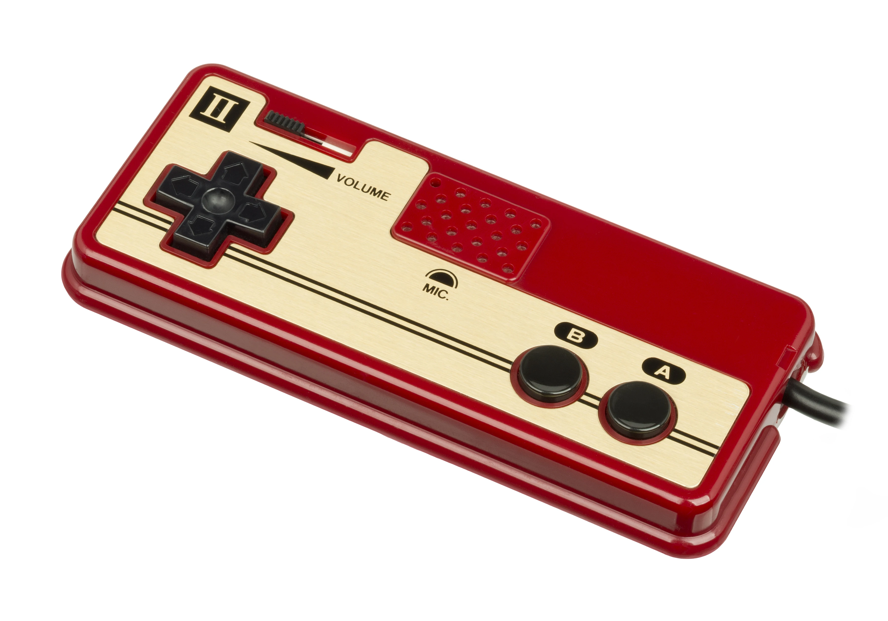
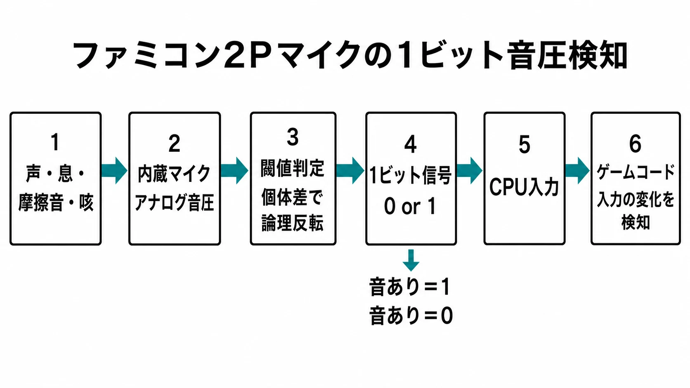
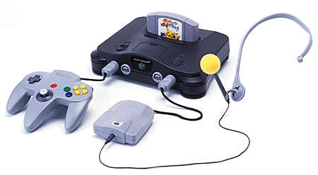
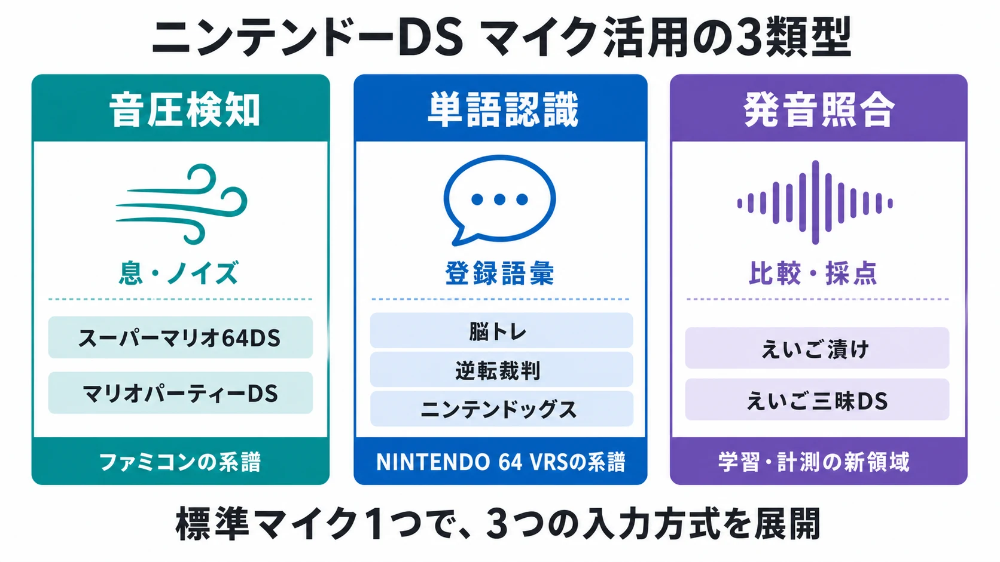
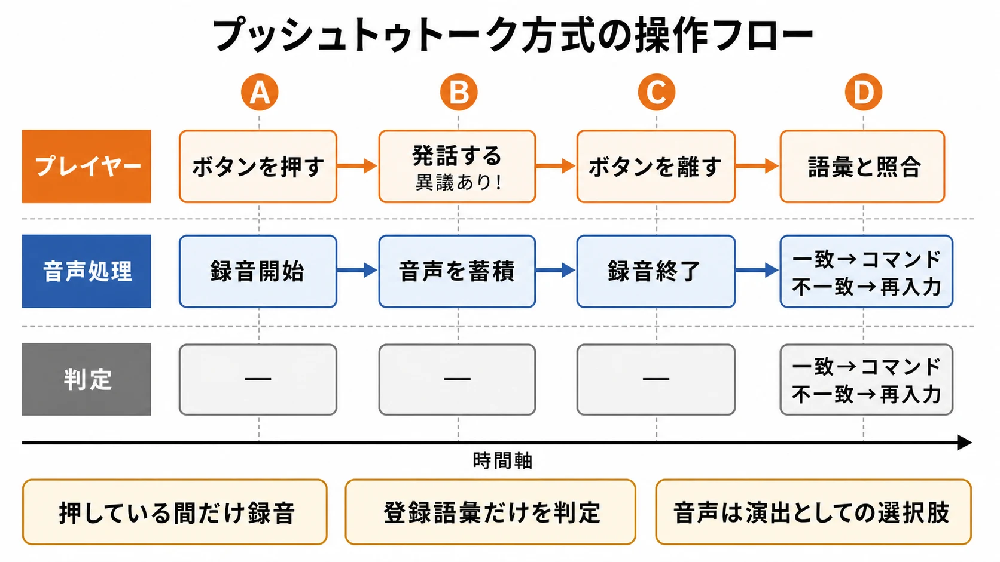
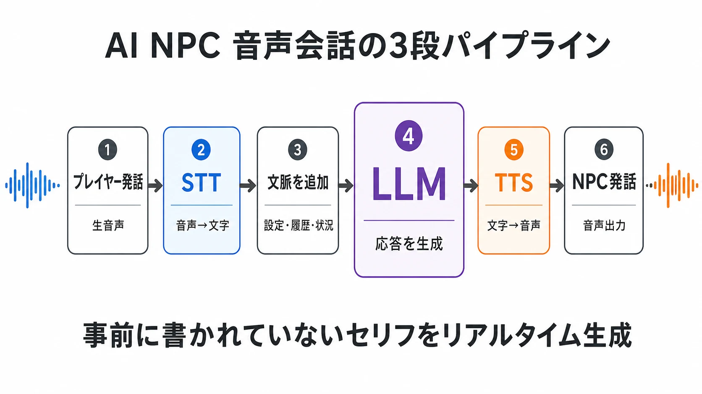
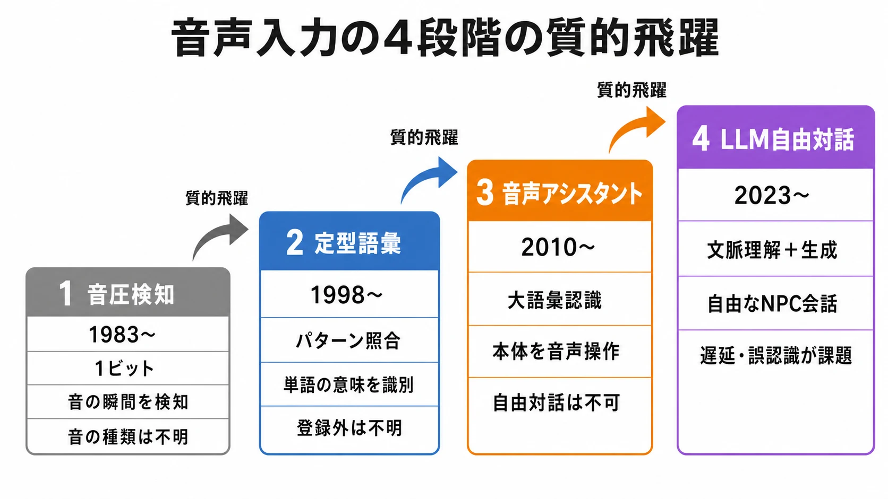

# かつて僕らは「ハドソーン！」と叫んだ — 家庭用ゲーム機における音声入力の歴史

## 概要

家庭用ゲーム機における「音声入力」の歴史は、1985年のファミリーコンピュータ版『バンゲリングベイ』でプレイヤーが2Pコントローラーのマイクに向かって「ハドソン！」と叫んだ瞬間から始まった。以来、音声入力は「単なる音圧センサー」から「本格的な音声認識」、そして現代の「大規模言語モデル（LLM）による自由対話」へと40年をかけて段階的に進化してきた。本レポートでは、その系譜を俯瞰する。[[1](#ref-1)][[2](#ref-2)][[3](#ref-3)][[4](#ref-4)]

*家庭用ゲーム機における音声入力技術の進化と代表例（1983〜2026年）*

---- 

## 第1章｜1980年代：音圧検出時代 ― ファミコン2Pコントローラーのマイク

*初代ファミコンの2Pコントローラー。1P側のスタート／セレクトボタンに相当する位置にマイクが配置されている。*

出典: [Wikimedia Commons「Nintendo-Famicom-Controller-II-FL.jpg」](https://commons.wikimedia.org/wiki/File:Nintendo-Famicom-Controller-II-FL.jpg)（撮影: Evan-Amos、パブリックドメイン）

### 1ビットの「声」

初代ファミリーコンピュータ（1983年発売）の2Pコントローラーには、スタートボタンとセレクトボタンの代わりに小型マイクが搭載されていた。ただしこのマイクは音声認識を行うものではなく、**音圧のon/offを検知する1ビット入力**に過ぎなかった。「助けてハドソーン！」と叫ぼうが、マイクを爪で擦ろうが、息を吹きかけようが、ファミコンにとっては区別できない同一の入力だった。[[5](#ref-5)][[6](#ref-6)][[7](#ref-7)]

さらに興味深いことに、ファミコンのバージョンによって論理が反転しており、「入力あり＝1」となる個体と「入力あり＝0」となる個体が混在していた。このため『バンゲリングベイ』のマイク検知処理は両方のパターンに対応する必要があったという。[[5](#ref-5)]

*何を発しても結果は1ビットに集約され、さらに個体ごとの論理反転にゲーム側で対応する必要があった。*

### 代表作① バンゲリングベイ（ハドソン／1985年2月22日）

2Pコントローラーのマイクを初めて本格的に活用したのが、ハドソンから発売されたシューティングゲーム『バンゲリングベイ』である。プレイヤーはヘリコプターを操縦してバンゲリング帝国の工場を破壊するが、2P側が「マイクに向かって叫ぶ」と敵の戦闘機が最大6機までスクランブル発進し、1P側を妨害するギミックが搭載されていた。[[2](#ref-2)][[1](#ref-1)]

本作の宣伝文句「**マイクに向かってハドソンと叫べ**」は、社内会議で大里幸夫氏が「まだハドソンは無名なのだから、ハドソンと言わせよう」と提案したことから生まれたとされる。結果として、当時無名だった「ハドソン」という社名は子供たちの叫び声と共に全国へ浸透していった。[[8](#ref-8)][[2](#ref-2)]

### 代表作② ゼルダの伝説（任天堂／1986年2月21日・ディスクシステム）

ディスクシステム版『ゼルダの伝説』では、ダンジョンに出現する敵「**ポルスボイス**」に対して、2Pコントローラーのマイクを使うと一撃で倒せるという仕掛けが実装されていた。剣では硬く倒しにくいポルスボイスも、マイクへの音声入力（実質は音圧検知）で一斉に全滅させることができた。[[9](#ref-9)][[10](#ref-10)][[11](#ref-11)]

この仕様は後の移植版では各ハードの仕様に応じて変更されている。海外NES版やロムカセット版ではマイクが無かったため「矢が有効」に、ファミコンミニではセレクトボタン4回以上連打、Wii/Wii UのVCではスティック回転、Nintendo SwitchではLR+ZLZR同時押しに置き換えられた。[[12](#ref-12)][[9](#ref-9)]

### 他の活用例

『たけしの挑戦状』『ウルトラマン倶楽部』『ゴルゴ13 第一章 神々の黄昏』など、同時期のファミコンタイトルでもマイク入力が補助的ギミックとして使われたが、いずれも音圧検知の域を出なかった。[[3](#ref-3)]

---- 

## 第2章｜1990年代末：本格音声認識の夜明け ― NINTENDO 64とドリームキャスト

### ピカチュウげんきでちゅう／NINTENDO 64 VRS（1998年）

1998年、任天堂は専用周辺機器「**NINTENDO 64 VRS（Voice Recognition System）**」を同梱した『ピカチュウげんきでちゅう』を発売した。VRSはヘッドセットマイクと認識モジュールからなり、プレイヤーの声をデジタル信号（波形データ）に変換してゲーム内の意味として識別する、家庭用ゲーム機における**初の本格的な音声認識システム**であった。[[13](#ref-13)][[14](#ref-14)]

*NINTENDO 64 VRS（Voice Recognition System）。NINTENDO 64本体に接続するVRSモジュールと専用ヘッドセットマイクで構成される。*

出典: [任天堂『ピカチュウげんきでちゅう』「VRS（音声認識システム）って何？」](https://www.nintendo.co.jp/n01/n64/software/nus_p_npgj/sound/index.html)（© Nintendo）

プレイヤーは「右」「左」「おいで」などとピカチュウに話しかけると、それが意味として伝わる。ファミコン時代の「音が鳴ったか否か」から、「何を言ったか」を認識する時代への決定的な飛躍だった。[[15](#ref-15)][[13](#ref-13)]

### シーマン（セガ／開発：ビバリウム／1999年、ドリームキャスト）

ほぼ同時期、セガのドリームキャストでは『シーマン 〜禁断のペット〜』が発売された。専用のマイクデバイス（またはシーマイクコントローラー）を通じて、人面魚「シーマン」と簡単な会話が成立するという斬新な設計だった。後年、シーマンの会話設計は「囲い込み」によって自然な応答に見せる工夫がされていたと分析されている。マニュアルには「Aボタンを押しながら話す」といったプッシュトゥトーク方式が明記されている。[[16](#ref-16)][[17](#ref-17)][[18](#ref-18)]

---- 

## 第3章｜2000年代前半：PlayStationプラットフォームにおける音声入力

### オペレーターズサイド（SCE／2003年1月30日、PS2）

PlayStation 2用『オペレーターズサイド』は、ゲーム内のほぼ**すべての操作を音声のみで行う**という挑戦的な設計の「ボイス・アクション・アドベンチャー」だった。USB接続のヘッドセットマイク（同梱）を使用し、プレイヤーはモニター越しにヒロイン「リオ」へ音声で指示を送る。[[19](#ref-19)][[20](#ref-20)][[3](#ref-3)]

ゲーム中は「走れ」「歩け」「調べろ」「撃て」「リロード」などを音声で入力し、戦闘では「よけて」「腹」「撃て」のように**部位を指定した攻撃指示**まで可能だった。リアルタイム性が要求されるアクションで音声認識を採用した稀有な例である一方、焦って誤認識されるとゲームが進まないという独特の緊張感が本作の面白さであり難しさでもあった。[[21](#ref-21)][[3](#ref-3)]

### SOCOM: U.S. Navy SEALs（SCE／2003年7月24日、PS2）

『SOCOM』はPS2初のボイスチャット対応オンラインシューターとして発売され、USBヘッドセットが同梱された。シングルプレイの「ストーリーモード」では、プレイヤーが隊長となり、音声認識で3人の隊員へ戦術指示を出せる。音声認識を「臨場感演出」として組み込んだ代表例である。[[22](#ref-22)][[23](#ref-23)]

### Hey PlayStation（PS5／2023年〜）

現代のPlayStation 5には「**Hey PlayStation**」という音声アシスタントが標準搭載されている（ただし日本語には対応していない）。「Hey PlayStation, open Astro's Playroom」のように話すだけでゲーム起動、録画、電源オフなどが可能で、PS4時代の「Voice Operation」が定型コマンド依存だったのに対し、PS5ではより自然な発話に対応する。[[24](#ref-24)][[25](#ref-25)]

---- 

## 第4章｜2000年代後半〜2010年代：携帯機とKinect ― 広がる音声入力

### ニンテンドーDS（2004年〜）

ニンテンドーDSは本体下画面に**内蔵マイク**を備え（初代DSは左下、Liteは中央、DSi・LLは中央付近）、歴代任天堂携帯機で初めて標準の入力手段としてマイクが活用された。代表的な活用タイトルを以下に整理する。[[26](#ref-26)]

*ニンテンドーDSは、標準搭載マイクで音圧検知・単語認識・発音照合の3類型を展開した。*

#### 脳を鍛える大人のDSトレーニング（任天堂／2005年5月19日）

本作はDSの**文字認識と音声認識を核に据えたトレーニングソフト**として国内約400万本・世界累計約1900万本という記録的ヒットとなった。「音読」トレーニングでは画面に表示された文章を声に出して読み、ストップウォッチで時間を計測する等、**音声入力を「脳を刺激する手段」として積極的に組み込んだ点が画期的だった**。タッチスクリーンによる手書き入力と並んで、プレイヤーが**抵抗なく自分の声をDSに聞かせる**文化を広く定着させた功績は大きい。[[27](#ref-27)][[28](#ref-28)][[29](#ref-29)]

#### 逆転裁判シリーズ（カプコン／2005年〜）

DS版『逆転裁判 蘇る逆転』以降、本シリーズは**Yボタンを押しながらマイクに向かって「異議あり！」「待った！」などを叫ぶとボタン入力と同等に扱われる**音声認識に対応した。カプコン公式FAQには「本シリーズの音声認識は**発言の内容も識別している**。『異議あり！』というセリフを言うべき箇所で『待った』と叫んでも認識しない」と明記されており、**単なる音圧検知ではなくパターンマッチングを行う音声認識である**ことが確認できる。なお、ボタン操作でも代用可能なため、音声入力は「必須」ではなく「演出としての選択肢」として提供されていた。[[30](#ref-30)][[31](#ref-31)][[32](#ref-32)][[33](#ref-33)]

*プッシュトゥトーク方式では、ボタン押下中だけ音声を録音し、登録語彙とのパターンマッチングで判定する。*

#### 息吹きかけ型ギミックの定番化（2005年〜）

『マリオパーティーDS』のミニゲームや『スーパーマリオ64DS』などでは、DSのマイクに**息を吹きかける**ことで仕掛けを作動させるノンバーバルアクションが多数採用された。言語認識ではなくマイクに入力される風ノイズを検知する点でファミコン時代の音圧検出の系譜にあるが、手軽なインタラクションとしてDSタイトルの定番表現となった。[[34](#ref-34)][[35](#ref-35)]

#### 英語学習ソフト（2006年〜）

プラト『英語が苦手な大人のDSトレーニング えいご漬け』や学研『えいご三昧DS』などの英語学習ソフト群は、**プレイヤーの発音をマイクで取り、お手本音声と照合してグラフで比較する**という本格的な音声認識活用を行った。「計測・判定」用途としての音声入力という新しい座組みを開拓した領域である。[[36](#ref-36)][[37](#ref-37)]

#### その他

『ニンテンドッグス』ではマイクに向かって愛犬の名前を呼んだり「おすわり！」などのコマンドを教え込んだりでき、ペットが単語を認識して反応する。また『おいでよ どうぶつの森』はプレイヤーが設定した名前をマイクに向かって叫ぶと村の住人が驚く等、**生活密着型ゲーム**に音声要素を組み込む演出が多数見られた。

### Xbox 360 / Xbox One Kinect（2010・2013年）

Microsoftの**Kinect**センサーは、複数マイクアレイによるノイズ除去と高精度音声認識を実装し、「Xbox オン」「Xbox クリップ」といった50種類以上の音声コマンドでゲームと本体の両方を操作できた。家庭用ゲーム機でのハンズフリー音声操作を本格的に浸透させた存在である。[[38](#ref-38)][[39](#ref-39)][[40](#ref-40)]

---- 

## 第5章｜2020年代：LLM時代 ― 自由対話とAI NPC

### パラダイムシフト

2023年以降、大規模言語モデル（LLM）の実用化により、音声入力は「あらかじめ定義されたコマンド認識」から「**自由発話による対話**」へと質的に転換した。プレイヤーは事前に覚えたコマンドを口にするのではなく、自然な言葉でNPCと会話できる。[[41](#ref-41)][[4](#ref-4)][[43](#ref-43)]

### NVIDIA ACE for Games（2023年）

NVIDIAは2023年5月のCOMPUTEXで、生成AIでNPCに命を吹き込むクラウドサービス「**NVIDIA ACE for Games**」を発表した。Convaiとの協業によるデモ『Kairos』では、ラーメン屋の店主とプレイヤーが音声で自由に対話し、AIが文脈に応じた応答と音声合成を行う様子が披露された。[[42](#ref-42)][[41](#ref-41)]

### 代表的なLLM音声ゲーム／MOD

| タイトル                             | プラットフォーム     | 特徴                                   | 出典        |
| -------------------------------- | ------------ | ------------------------------------ | --------- |
| Suck Up!                         | PC           | 吸血鬼として住民を説得し家に招き入れてもらう、リアルタイム音声交渉ゲーム | [[4](#ref-4)][[43](#ref-43)] |
| Inworld Origins                  | PC（Steam、無料） | 探偵となりAIロボットに音声質問し事件を解決               | [[4](#ref-4)]      |
| Vaudeville                       | PC           | AI探偵ゲーム。NPCとの自由対話でガスライティングが起きる問題も話題に | [[4](#ref-4)][[43](#ref-43)] |
| Whispers from the Star           | モバイル         | 単一NPCとの音声/テキスト対話がゲームの中核              | [[43](#ref-43)]     |
| Mantella（Skyrim MOD）             | PC           | Skyrimの全NPCをLLM＋音声合成で自由会話可能にする       | [[4](#ref-4)]      |
| T.A.L.K.E.R.（S.T.A.L.K.E.R. MOD） | PC           | ChatGPT連携でNPCと音声会話                   | [[43](#ref-43)]     |

これらに共通するのは、**音声認識（STT）→ LLM推論 → 音声合成（TTS）**の3段パイプラインをリアルタイムに回すことで、ゲームデザイナーがあらかじめ書いていないセリフをNPCが喋るという点である。[[4](#ref-4)][[43](#ref-43)]

*現代のAI NPCは、プレイヤーの発話をSTTで文字化し、LLMが文脈に応じた応答を生成し、TTSが音声化して返す。*

---- 

## 第6章｜時代別：技術進化の俯瞰

*家庭用ゲーム機の音声入力は、40年で4段階の質的飛躍を経た。各段階で従来の制約が解消され、新たな課題へと更新されてきた。*

| 世代         | 時期            | 代表ハード／周辺機器                      | 入力の質                   | 代表タイトル                                                |
| ---------- | ------------- | ------------------------------- | ---------------------- | ----------------------------------------------------- |
| 音圧検知       | 1983–1990年代前半 | ファミコン2Pコントローラー                  | 1ビットon/off[[5](#ref-5)]         | バンゲリングベイ[[1](#ref-1)][[2](#ref-2)]、ゼルダの伝説（ポルスボイス）[[9](#ref-9)]                   |
| 定型語彙の音声認識  | 1998–2005     | N64 VRS、DCマイクデバイス、PS2 USBヘッドセット | 登録語彙のパターンマッチ[[13](#ref-13)][[16](#ref-16)] | ピカチュウげんきでちゅう[[13](#ref-13)]、シーマン[[16](#ref-16)]、オペレーターズサイド[[3](#ref-3)]、SOCOM[[23](#ref-23)] |
| 汎用音声アシスタント | 2010–2020年代   | Kinect、PS5、DS内蔵マイク              | ノイズ除去済み大語彙認識[[38](#ref-38)][[25](#ref-25)] | Kinectタイトル群[[40](#ref-40)]、Hey PlayStation[[25](#ref-25)]                 |
| LLM自由対話    | 2023–現在       | PC（NVIDIA ACE等）、各種MOD           | 自然言語理解＋生成[[41](#ref-41)]         | Suck Up]、Inworld Origins[[4](#ref-4)]、Mantella[[4](#ref-4)]         |

---- 

## 分析と考察

### 「叫び」から「会話」へ

初代ファミコンで子供たちが「ハドソーン！」と叫んだ時、彼らはゲームと会話していたわけではない ― ゲームは音が鳴ったかどうかしか判別できなかった。しかしプレイヤーの体験としては、「叫ぶことでゲーム世界に干渉できる」という感覚が確かに成立していた。この**体験の質**こそが、40年後のLLM時代でも本質的に追求され続けている価値である。[[8](#ref-8)][[5](#ref-5)]

### 商業的には常に「難しいジャンル」

シーマン、オペレーターズサイド、ピカチュウげんきでちゅうはいずれも話題作となったが、シリーズ化は限定的で、音声入力はその後長らく「キワモノ」「ギミック」の扱いを受けてきた。リアルタイム性、誤認識、騒音問題（家族のいるリビングで大声を出す気まずさ）、そして「コントローラーの方が速い」という単純な事実が、音声入力の主流化を阻んできた。[[3](#ref-3)][[16](#ref-16)][[21](#ref-21)]

### LLMがもたらす「認識の失敗＝コンテンツ」への転換

興味深いのは、LLM時代のAI NPCゲームでは「認識の揺らぎ」そのものがコンテンツになっている点である。Vaudevilleで話題になった「NPCをガスライティングで言いくるめられる」現象は、従来の音声ゲームでは「バグ」だったが、LLMでは「遊びの余地」として受容されている。[[43](#ref-43)][[4](#ref-4)]

---- 

## 結論

家庭用ゲーム機の音声入力は、1985年の『バンゲリングベイ』という1ビットの「叫び」から始まり、NINTENDO 64 VRS・シーマン・オペレーターズサイドを経て定型コマンド認識へ、そして現在はLLMによる自由対話へと到達した。技術的にはこの40年で桁違いの進化を遂げたが、「声でゲーム世界に触れたい」というプレイヤーの根源的欲求は、かつて2Pコントローラーに向かって「ハドソーン！」と叫んだあの瞬間から、何も変わっていないのかもしれない。[[1](#ref-1)][[13](#ref-13)][[41](#ref-41)][[8](#ref-8)][[3](#ref-3)]

---

## References

1. [バンゲリングベイ【FC】2コンのマイクにハドソンって叫んだあの頃][1] - 敵の攻撃を受ける度にダメージ増、ダメージが100を超えると墜落してゲームオーバー。 コントローラー操作. 十字ボタン, 上：前進（押し続けると加速） 下：後退（ ...

2. [バンゲリング ベイ - Wikipedia][2] - 日本においては1985年2月22日にハドソンがファミリーコンピュータ（以下、FC）用ソフト向けに移植し発売された。このFC版を元に操作方法など仕様を変更した移植作品が制作 ...

3. [オペレーターズサイド - Wikipedia][3] - ファミリーコンピュータの、いわゆる「Ⅱコンのマイク」は音圧の有無の検出だけが可能であり、音声入力の一種といえなくもないがゲームへの利用は補助的なものに限られる。

4. [大規模言語モデル（LLM）で動くNPCがいて、話せるゲームって ...][4] - 「Suck Up！」はAIベースだと思うんだけど、トークン制とかで課金が必要なんじゃないかな。

5. [「助けてハドソン！」とマイク入力 ｜ Colorful Pieces of Game][5] - バンゲリングベイの時だと思うんですが、マイクの入力が反転しても検知できる方法って誰が思いついたんでしょう？ ちと聞かれたんですが、時期的には ...

6. [ファミコンのマイクを復活させる - ゲームとプログラミングと電子 ...][6] - バンゲリングベイを選んだ理由は、マイクが反応したことがわかりやすい、起動してすぐに試せるからです。Yahooフリマで安価で売られていたため、Yahoo ...

7. [レトロゲーム（ファミコン編）No.3 バンゲリングベイ ｜ 88の奇妙な][7] - 1985年にハドソンから発売されたシューティングゲームです。 ... 自分でやってみたらそーなったのかはわからないんですが... 使用しない2Pコントローラーの ...

8. [バンゲリングベイ』ウソ技の記憶を被害者が語る 「コントローラー ...][8] - 後に当時ハドソンの社員だった高橋名人が語った話では、ラジコンの操縦がうまくなりたい社員がこのようなプログラミングをしたそうです。とにかく操作がし ...

9. [【GAME(雑学)】ファミコン版ゼルダの伝説でのマイク機能][9] - 通常とは別な倒し方があるポルスボイス。 その方法とは、. 2P側コントローラーのマイクを使う. というものでした。

10. [ポルスボイス ｜ ゼルダの伝説 Wiki ｜ Fandom][10] - ... ディスクシステム（オリジナル） 2コントローラーのマイクを使うと一撃で倒せる。 NES（海外版FC） 矢が効く。 ファミコンミニ セレクトボタンを4回以上連打すると一撃 ...

11. [【ゼルダの伝説】ミニファミコン版！レベル5のノーミスクリア動画][11] - レベル5から初登場の敵キャラ「ポルスボイス」。ピョンピョン跳びはねながら移動するので狙いにくいうえ、剣で何度か突かないと倒せません。 元祖 ...

12. [ファミコンのゼルダの伝説1を見つけました。でも、ディスク ...][12] - ... ディスクシステムからROMカセットへ移植されたものです。 そのため、ディスク版でできた「2P用コントローラーのマイクへ叫んでポルスボイスを瞬殺 ...

13. [ピカチュウげんきでちゅう/NINTENDO64 VRS（音声認識システム ...][13] - 写真のようにNINTENDO64本体にNINTENDO64 VRSを接続すると、キミの声（音声信号）をNINTENDO64が識別してくれるんだ。これまでのコントローラーに加えて「声」というまったく ....

14. [主が面白い！と思ったゲームを紹介してみた！【NINTENDO64編】][14] - (1998年発売/任天堂). ピカチュウげんきでちゅう タイトル ... VRSは「Voice Recognition System」の略で「音声認識 ...

15. [ピカチュウげんきでちゅう/ピカチュウと友達になろう！][15] - 「NINTENDO 64 VRS（音声認識システム）」を使うと、人の言葉をピカチュウにわかる言葉に変えてくれるよ！ だからピカチュウにしゃべりかければ、その言葉がピカチュウに ...

16. [シーマン - Wikipedia][16] - 後年、シーマンの音声認識による会話は、所謂囲い込みというもので、プレイヤー側 ... ↑ “Seaman for Dreamcast - Angry Video Game Nerd”. 2021年8月...

17. [[PDF] Present Disc - 取說明書 - Sega Retro](https://segaretro.org/images/archive/c/cf/20220209200034!Christmas\_Seaman\_Present\_Disc\_DC\_JP\_Manual.pdf) - マイクに音声を入れるときは、Aボタンを押しながらし. ゃべります。 Aボタンを ... シーマンの音声認識が誤っていたときには. シーマンが誤ってあなたの言葉を認識 ...

18. [ドリキャス用 マイクデバイス - テレビゲームと周辺機器][17] - ドリームキャストの「 シーマン 」に代表される 音声認識を取り入れたゲームソフトに必須の周辺機器 【 マイクデバイス 】。 人間の声、言葉の意味を ...

19. [声で心通じ合う「OPERATOR'S SIDE」#01 - YouTube][18] - ... 音声入力でヒロイン・リオを導くボイス・アクション・アドベンチャーに挑戦！ ... オペレーターズサイド（PS2） 開発：ソニー ...

20. [オペレーターズサイドとは？ わかりやすく解説 - Weblio辞書][19] - ... PlayStation 2用ゲームソフト。 音声認識型ゲーム（ボイス・アクション・アドベンチャー）で、プレイするためにはUSB接続型のマイクが必要となる（ソフトにヘッド ...

21. [オペレーターズサイド - コトバノウタカタ][20] - 焦って音声入力すると誤認識したり、認識されなかったり。焦りすぎると入力する言葉を忘れてボコボコにされたり。でもそれが面白い部分でもある。音声 ...

22. [ソーコム U.S.ネイビー・シールズ(USBヘッドセット同梱)][21] - ヘッドセットを使ったボイスチャットで音声認識による仲間への指示ができたり、仲間の声や司令部からの通信が流れるなど抜群の臨場感が味わえる。

23. [PS2初のボイスチャット対応！『SOCOM:U.S.NAVYSEALs』この夏 ...][22] - また、『SOCOM』には専用USBヘッドセットが同梱されており、一人用モードとなる「ストーリーモード」では、音声で隊員に指示を出すことが可能。

24. [PS5 Voice Command: How to Enable Hey PlayStation! - YouTube][23] - You can enable 'Hey PlayStation' on your PS5 to use Voice Command to turn on games, capture gameplay...

25. [Preview: How to control a PS5 console with your voice - PlayStation][24] - From the home screen, select Settings \> Voice Command (Preview). Turn on Enable Voice Command. The s...

26. [DSのマイクって何処についているんですか？ - 初代DSは下画面の...][25] - DSのマイクって何処についているんですか？ 初代DSは下画面の左下、Liteは中央、DSi,LLは中央付近、今年発売予定の3DSは下画面右下についています。

27. [DSトレーニングの特長 - 任天堂ホームページ][26] - 最新の脳機能を測定する機器を使用した私たちの実験により、簡単な「計算」や文章の「音読」が脳に効果的なトレーニングであることが実証されました。

28. [〔中古品〕 脳を鍛える大人のDSトレーニング 【DSゲームソフト】][27] - DSで脳を鍛える！ 脳を活性化させるトレーニングドリル。DSの文字認識・音声認識を活用した、計算・音読などの問題をすらすら解くことで脳を活性化させます。 もっと ...

29. [[PDF] 取扱説明書](https://www.nintendo.co.jp/ds/andj/andj.pdf) - この「脳を鍛える大人の. DSトレーニング」では、簡単な計算や音読を基本とした脳に最適. なトレーニングを毎日楽しく続けられるように作られています。 トレーニングを ...

30. [音声が正しく認識されない (逆転裁判 蘇る逆転) - CAPCOM][28] - 「逆転裁判 蘇る逆転」の音声認識は、発言の内容も識別しています。 たとえば、「異議あり！」というセリフを言うべき箇所で「待った」と叫んでも認識してくれません。

31. [初めて『逆転裁判』（3DS）をプレイ中ですが - r/AceAttorney - Reddit][29] - それは、実際に「異議あり」や他のセリフを声に出して言うことができるようにするためのものです。DS/3DSのそのゲームのリリースでは、それが選択肢になっ ...

32. [よくある質問その2（蘇る逆転関係） - アットウィキ (@WIKI)][30] - Q2）異議あり！待った！はボイス入力しかダメ？ A2）Yボタン押している間だけボイス入力可能。まつった！というと認識しやすい。 5話エンディング前に「異議 ...

33. [スクリーンショット3][31] - ゲーム画面（タッチスクリーン）. 「逆転裁判」シリーズの代名詞「異議あり！」。マイクからの音声入力も可能なのだ！ つぎへ · まえへ. とじる.

34. [DSなどで画面に息を吹きかけるゲームなどありますがあれはどう ...][32] - DSなどで画面に息を吹きかけるゲームなどありますがあれはどういった仕組みですか？ ﾏｲｸで息の音を認識しているんだと思います。だからﾏｲｸの穴を指で ...

35. [2/2 お勧めDS学習ソフト・キャラクターソフト [子供と ...][33] - タッチペンを使ったり、マイクに息を吹きかけたりと、DSならではの遊び方が詰まったマリオパーティDS。 計60種類以上の新作ミニゲームが収録されています ...

36. [iPodやDSで学ぶ英会話――手持ちの機器で気軽に始めるモバイル ...][34] - プラトの「えいご漬け」シリーズは、単語や例文のネイティブ発音を聞き、その綴りを画面にタッチペンで書いていく。音声は何度でも聞き直せるので、正解するまで繰り返し ...

37. [英語が苦手な大人も子供も、英会話DSソフトで意識改革][35] - 苦手意識から脱却！英会話DSソフトの例 ; フォニックスでみにつくえいご, ○始めて英語を学ぶ子ども向け○「フォニックス」とは英語圏の英語学習方式のことで ...

38. [Xbox Oneの音声認識やKinectでゲームの遊び方が変わる][36] - スタンバイモードの本体に対して「Xbox オン」と日本語のアクセントで話しかけると、本体に接続されたKinectのマイクがその言葉を認識して、すぐにホーム ...

39. [Kinectの音声認識を使ってWebブラウザを操作するサンプル][37] - 例えば、ゲーム用のKinect for Xbox 360では、「Xbox」と声をかけることで音声認識モードになり、ジェスチャーを使わなくても、メニューの操作やゲーム内 ...

40. [Xbox One、音声操作など強化したKinectで新たなゲーム体験。動画 ...][38] - Kinectセンサーを使った音声操作機能は、ゲームに集中しながら他の操作なども同時にしやすくなることが大きな特徴。例えば、Xbox Oneでのゲームプレイを ...

41. [NVIDIA ACE for Games が生成 AI で仮想キャラクターに 命を吹き込む][39] - NVIDIA は、NVIDIA Inception のスタートアップである Convai と協力して、開発者がまもなく NVIDIA ACE for Games を使用して NPC を構築できるように...

42. [NVIDIA ACE for Games が生成 AI で仮想キャラクターに命を吹き込む][40] - NVIDIA は、AI に関する専門知識とゲーム開発者との数十年にわたる協業の経験値に基づいて、ゲームにおける生成 AI の活用を先導し取り組んでいます」

43. [話せるAI NPCがいる最高のゲームはどれですか？進行中のものや][41] - Whispers from the Star – 一人のNPC、音声/テキスト、会話がゲームの要素。 Suck Up! – リアルタイムのマイク入力; 説得と社会的圧力。 Vaudeville – A...

[1]:	https://famicon-meisaku.som4.net/bungeling-bay.html
[2]:	https://ja.wikipedia.org/wiki/%E3%83%90%E3%83%B3%E3%82%B2%E3%83%AA%E3%83%B3%E3%82%B0_%E3%83%99%E3%82%A4
[3]:	https://ja.wikipedia.org/wiki/%E3%82%AA%E3%83%9A%E3%83%AC%E3%83%BC%E3%82%BF%E3%83%BC%E3%82%BA%E3%82%B5%E3%82%A4%E3%83%89
[4]:	https://www.reddit.com/r/pcgaming/comments/1d4487a/are_there_any_games_with_npcs_driven_by_large/
[5]:	http://www.highriskrevolution.com/wp/gamelife/2021/03/02/%E3%80%8C%E5%8A%A9%E3%81%91%E3%81%A6%E3%83%8F%E3%83%89%E3%82%BD%E3%83%B3%EF%BC%81%E3%80%8D%E3%81%A8%E3%83%9E%E3%82%A4%E3%82%AF%E5%85%A5%E5%8A%9B/
[6]:	https://melolololongame.hatenablog.com/entry/2026/03/11/213000
[7]:	https://ameblo.jp/passione88/entry-12830664300.html
[8]:	https://magmix.jp/post/23878/2
[9]:	https://yokoyan29.hatenablog.com/entry/2023/08/21/091133
[10]:	https://zelda.fandom.com/ja/wiki/%E3%83%9D%E3%83%AB%E3%82%B9%E3%83%9C%E3%82%A4%E3%82%B9
[11]:	https://www.tsapps.net/games/famicom/classic-mini-fc-zelda-level5
[12]:	https://detail.chiebukuro.yahoo.co.jp/qa/question_detail/q1175513176
[13]:	https://www.nintendo.co.jp/n01/n64/software/nus_p_npgj/sound/index.html
[14]:	https://ameblo.jp/suikaamebro/entry-12686640004.html
[15]:	https://www.nintendo.co.jp/n01/n64/software/nus_p_npgj/freind/index.html
[16]:	https://ja.wikipedia.org/wiki/%E3%82%B7%E3%83%BC%E3%83%9E%E3%83%B3
[17]:	https://tvgames-life.seesaa.net/article/53187633.html
[18]:	https://www.youtube.com/watch?v=eykGC0Qoo0o
[19]:	https://www.weblio.jp/content/%E3%82%AA%E3%83%9A%E3%83%AC%E3%83%BC%E3%82%BF%E3%83%BC%E3%82%BA%E3%82%B5%E3%82%A4%E3%83%89
[20]:	https://ktb.hatenablog.com/entry/20040816/1372735450
[21]:	https://www.gavas.jp/products/detail.php?product_id=11197
[22]:	https://dengekionline.com/data/news/2003/4/25/f252bb208467eea3e2f33d6c7ef0a79c.html
[23]:	https://www.youtube.com/watch?v=KMcL0UGW3rg
[24]:	https://www.playstation.com/en-gb/support/hardware/ps5-voice-command/
[25]:	https://detail.chiebukuro.yahoo.co.jp/qa/question_detail/q1342667683
[26]:	https://www.nintendo.co.jp/ds/andj/feature/index.html
[27]:	https://www.sofmap.com/product_detail.aspx?sku=414836412
[28]:	https://www.capcom.co.jp/support/faq/platform_othersgames_nintendods_saiban_037061.html
[29]:	https://www.reddit.com/r/AceAttorney/comments/1qaban8/first_time_playing_ace_attorney_3ds_what_does/
[30]:	https://w.atwiki.jp/gyakusai/pages/6.html
[31]:	https://www.nintendo.co.jp/ds/software/a2gj/ss03.html
[32]:	https://detail.chiebukuro.yahoo.co.jp/qa/question_detail/q10159034365
[33]:	https://allabout.co.jp/gm/gc/189964/2/
[34]:	https://www.bcnretail.com/market/detail/071128_12066.html
[35]:	https://eikaiwa.weblio.jp/column/study/good_tools_for_learning_english/start_with_ds_software
[36]:	https://weekly.ascii.jp/elem/000/002/625/2625540/
[37]:	https://thinkit.co.jp/story/2012/07/12/3616
[38]:	https://av.watch.impress.co.jp/docs/news/663984.html
[39]:	https://www.nvidia.com/ja-jp/about-nvidia/press-releases/2023/nvidia-ace-for-games-sparks-life-into-virtual-characters-with-generative-ai/
[40]:	https://prtimes.jp/main/html/rd/p/000000385.000012662.html
[41]:	https://www.reddit.com/r/gamingsuggestions/comments/1qbnidd/what_are_the_best_games_with_ai_npcs_that_you_can/

----

この文書は、Perplexity、Claude、OpenAI Codex の3つのAIの支援を受けて著述されたものです。引用画像を除き、MIT License にて提供されています。
