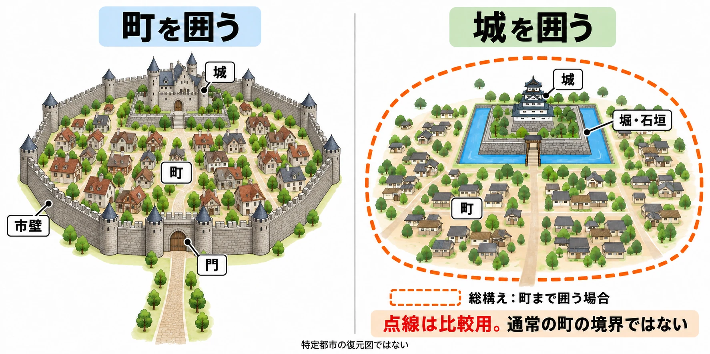

# その街は、壁で囲われているか――城塞都市と城下町から、街の内と外の境目を設計する

旅の道の先に、高い壁が横たわっている。開いた門をくぐると、家々と人の声に包まれる。ここから街に入ったのだと、一歩でわかる。

もう一つの街へは、同じ道をそのまま歩いていく。道沿いの家が少しずつ増え、人の行き来が賑やかになり、気づけば街の中にいる。奥に見える城へ近づくと、そこで初めて囲いと入口が現れる。

[第1回の架空の城下町](castle-town-design-lynch-city-image.md)は、南門から中央広場を通り、北の城へ向かう街だった。外周の壁が町全体を包むあの形は、ヨーロッパの城塞都市に近い。城塞都市とは、町を壁などの防御施設で囲った都市である。一方、城を中心に発達した町を城下町という。今回は、この二つの形から街への入り方を考えたい。

全7回のシリーズ「城と街から拠点をつくる」第4回の問いは、 **「街を壁で囲うか。囲うなら門で何を切り替え、囲わないなら外とどうつなぐか」** である。第1回の5要素でいえば、街を囲う壁は二つの領域を隔てる「縁」、門はそこを「道」が通り抜ける一点にあたる。

[第2回の城の入口](japanese-castle-gate-design-koguchi-masugata.md)、[第3回の重なる守り](western-castle-concentric-defence-layers.md)から、視点を町全体へ引いてみよう。今度は、囲いの中にどこまで暮らしを含めるかが主題だ。

***

## 囲う街――壁の内側に、町の日常がある

町を囲む壁を、市壁という。古代・中世のヨーロッパでは、市街地を壁で囲んだ都市が広く見られた。辞典でいう「城郭都市」である。[[1](#ref-1)]

ウェールズのコンウィとカーナーヴォンでは、市壁が町並みをほぼ完全に囲む形で残っている。城と町が隣り合い、町にも囲いがある関係を、現在の景色から読み取れる。[[2](#ref-2)]

フランスのカルカソンヌでは、二重の囲いが城とともに家々、通り、ゴシック様式の大聖堂を包んでいる。[[3](#ref-3)] 門の向こうに広がるのは、人が暮らし、歩き、祈る町なのだ。ここでは壁の重なり方よりも、その内側に日常の場所が含まれていることに注目したい。

市壁には、町の輪郭を示す役割もあった。イングランドの文化財機関Historic Englandは、町の防御施設について、町の範囲や予定した規模を示し、集落を区切る象徴にもなったと説明している。[[4](#ref-4)] 外から眺めた壁の線が、「この町はここまで」というまとまりを見せていたのである。

同機関のニューカッスルの指定記録には、16〜17世紀に塔や門の一部が、町の同業組合の集会所になったことも記されている。[[4](#ref-4)] 同業組合とは、同じ仕事に携わる人々の組織だ。町を守る施設は、住民が集まる場所としても使われていた。

***

## 城を囲い、その外に町が広がる

日本の中世・近世の城下町を考えるときは、城を囲う線と、町の広がりを分けると理解しやすい。『日本大百科全書（ニッポニカ）』の「城郭都市」で、浅香幸雄は、領主の城館が囲われ、一般の武家や町人が城外に住むことを、大陸の城郭都市との違いとして説明している。[[1](#ref-1)]

この典型的な形では、町へ着くことと、城の中へ入ることは別の出来事になる。領主の住まいを守る囲いの外にも、人々の日常が広がっているからだ。

日本の城を囲うものとして、堀、土塁、石垣がある。ここでは城と町の境目を引くものとして、次の意味を押さえておこう。堀と土塁の説明は、神奈川県教育委員会の考古学講座資料に基づく。[[5](#ref-5)]

| 囲いを作るもの | どのようなものか |
| --- | --- |
| 堀 | 敵の侵入を防ぐために掘った溝。水を張る水堀と、水のない空堀がある |
| 土塁（どるい） | 堀を掘った土を盛り上げて作った壁 |
| 石垣 | 石を積み上げて作った壁 |

城を構成する、地面を削って平らに整えた区画を、曲輪（くるわ）という。同資料によれば、室町時代末期以降には、その区画全体に石垣を積む城が現れた。[[5](#ref-5)]

目を向けたいのは、こうした囲いと住まいの位置関係である。城の周りに堀や石垣があっても、町の外周まで同じ囲いが続くとは限らない。 **城の囲いを描いたら、その外に誰が暮らすのかも描く。** それだけで、城と街を一つの囲いに収める案との違いが見えてくる。

***

## 小田原の総構え――囲う範囲を、町の外側まで広げる

町までまとめて囲う日本の例が、小田原城の総構えである。総構えとは、城と城下の町を含む広い範囲を、堀や土塁などで囲むことだ。

小田原では、1590年の小田原合戦に備え、総延長約9kmに及ぶ土塁と堀の囲いが築かれた。豊臣秀吉との戦いに向けて、守る範囲を大きく広げたのである。小田原市の保存活用計画が扱う総構えの内側には、城の施設のほか、武家屋敷、町人地、寺社地、小田原宿が含まれる。[[6](#ref-6)]

城を囲う堀と土塁を、町の外側まで広げた形と考えるとわかりやすい。囲いの線が外へ移れば、それまで城外にあった暮らしも、大きな囲いの中へ入る。

本稿では、城の外に町が広がる典型と、戦いに備えて町ごと囲った小田原を並べて考える。この二つを使えば、日本風の街を作るときにも、「今回は何を、誰を、囲いの中に含めるのか」と具体的に問える。

点線は町まで囲う場合を重ねた比較であり、通常の町の境界を示すものではない。特定都市の復元図ではなく、囲う範囲と道のつながりを示す模式図である。

***

## ゲームでは、境目で何を変えるかを決める

ここからは **本稿の考察として**、囲いの違いをゲームの拠点へ置き換える。まず「壁や堀がどこにあるか」という景色の設計と、「どこで何が変わるか」という遊びのルールを組み合わせて考えたい。

### 囲う街では、門に切り替わりを集められる

街の外周が壁で見えれば、プレイヤーは街の範囲をつかみやすい。帰ってきたときも、「あの門まで行けば着く」という近い目標を持てる。

門を越える瞬間には、音楽、画面、戦闘の可否などを切り替えられる。たとえば、外では敵に追われていても、門の内側では追跡が終わり、買い物や会話に集中できるようにする。これなら門は、安全と危険を分ける地点にもなる。

JRPGで見かける、門をくぐると街の画面へ切り替わる作りも、一般的な観察として、この「囲う街」に近いと考えられる。画面の切り替わりと、街の内外の切り替わりが重なるためだ。これは特定の作品の設計意図を述べるものではなく、プレイヤーに見える形の読み取りである。

### 囲わない街では、変化を道沿いに積み重ねられる

外からの道がそのまま街へ続くなら、家の間隔、人通り、道の舗装、生活音などを少しずつ変え、街へ着く感覚を作れる。入口の一点に集めていた合図を、歩く距離の中に置くのである。

そのつながりを遊びにも残せば、外から逃げてきた人や、追いかけてきた敵が街へ入り込める。帰還は「危険が終わった」だけでなく、「誰かがいる場所まで戻った」という意味を持つようになる。

壁の有無と安全のルールは、それぞれ選べる。壁があっても襲撃を受ける街は作れるし、壁がなくても敵が入らない範囲を設定できる。プレイヤーが景色から抱く予想と実際のルールが合うよう、門番の反応や戦闘の起こり方で伝えることが大切だ。

***

## 『ドラゴンズドグマ 2』――帰ってきた街でも、人を守る

外と街をつなぐ設計を考える例が、『ドラゴンズドグマ 2』である。発売前の2024年3月6日に公開されたAUTOMATONのインタビューで、同作のディレクター・伊津野英昭は、前作では城などへの移動にロードを挟んでいたのに対し、本作ではダンジョン、街、家の中まで連続してつながっていると説明した。[[7](#ref-7)] シリーズの移動や不便さの設計については、[『ドラゴンズドグマ』の核設計を扱った記事](dragons-dogma-core-design-friction-pawns-vocations.md)も参照できる。

同じインタビューで街の襲撃について尋ねられると、伊津野は住民などのNPCにも死があり、気に入った相手がいるなら守りながら戦うか、その人を抱えて逃げる必要があると述べている。[[7](#ref-7)] NPCとは、プレイヤーが直接操作しない登場人物のことだ。

この例から本稿が注目するのは、 **街へ戻ってからも、外の危険が暮らしに関わる** という体験である。街を外から切り離された安全な場所にしない設計の例として読める。

移動が途切れないことと、住民が危険にさらされることは、別々の設計判断だ。この二つが組み合わさると、慣れた街が、買い物に戻る場所であると同時に、誰かを守る場所にもなる。自分の拠点でも、外の出来事をどこまで持ち込むかを考える手がかりになる。

***

## 街へ帰る道を歩いて、境目を点検する

以下は、本稿の考察を設計の点検にまとめた表である。街の外から普段使う施設へ向かって歩き、「いつ着いたと感じるか」「その前後で何が変わるか」を確かめたい。

| 点検すること | 街を囲う場合 | 街を囲わない場合 |
| --- | --- | --- |
| 街の範囲はどこでわかるか | 壁の線と門の位置が、近づく途中で見えるか | 家の密度や人通りの変化から、街のまとまりがわかるか |
| 街に入ると何が変わるか | 門で安全、音楽、画面、行動のルールの何を切り替えるか | 変化をどの道沿いで、どのくらい徐々に感じさせるか |
| 外の危険はどこまで入るか | 門で止まるのか、侵入や襲撃があるのか | 敵や事件が街へ続くのか、どこかで止まるのか |
| 帰還したことをどう伝えるか | 門を越えた直後に、安心や賑わいを感じられるか | 舗装、家並み、声など、複数の合図がつながっているか |
| 囲いの内外に誰が暮らすか | 城だけを囲うのか、住民の家まで含めるのか | 城の囲いの外で暮らす人と、その人々を守る場所はどこか |

たとえば「帰ってきたら安心して装備を整えてほしい」なら、門を越えると追跡が終わり、音楽が変わる案が考えられる。「旅先と暮らしがつながっていてほしい」なら、家並みが徐々に増え、外の事件が街の人にも届く案が考えられる。どちらも架空の設計例であり、欲しい体験から選ぶものだ。

最後に、街の略図へ囲いの線を引き、切れ目を通る道と、その両側にいる人を描いてみよう。街を囲わないなら、道沿いのどこで到着を感じさせるかを書き込む。 **「街を壁で囲うか。囲うなら門で何を切り替え、囲わないなら外とどうつなぐか」** を説明できれば、拠点への帰り道にも役割を与えられる。

## References

1. [浅香幸雄「城郭都市」／「城郭都市」][1] — 小学館『日本大百科全書（ニッポニカ）』／『精選版 日本国語大辞典』、コトバンク掲載、公開日記載なし。前者の執筆者は浅香幸雄、後者は項目執筆者の表示なし。城下町との比較は前者、古代・中世ヨーロッパでの広がりは後者を参照。2026年10月10日閲覧。

[1]: https://kotobank.jp/word/%E5%9F%8E%E9%83%AD%E9%83%BD%E5%B8%82-530860

2. [UNESCO World Heritage Centre「Castles and Town Walls of King Edward in Gwynedd」][2] — UNESCO、1986年世界遺産登録。「Authenticity」の市壁と町並みの記述を参照。2026年10月10日閲覧。

[2]: https://whc.unesco.org/en/list/374/

3. [UNESCO World Heritage Centre「Historic Fortified City of Carcassonne」][3] — UNESCO、1997年世界遺産登録。「Brief synthesis」の二重の囲いと内部の建物・通りの記述を参照。2026年10月10日閲覧。

[3]: https://whc.unesco.org/en/list/345/

4. [Historic England「Newcastle upon Tyne town defences: section of curtain wall containing Corner Tower」][4] — Historic England、List Entry 1019810、2003年4月23日最終改訂。「Reasons for Designation」の町の範囲・象徴的役割・同業組合による利用を参照。2026年10月10日閲覧。

[4]: https://historicengland.org.uk/listing/the-list/list-entry/1019810

5. [萩原滉「神奈川の中世城郭―小田原城支城を中心に―」][5] — 神奈川県教育委員会、令和4年度第4回考古学講座資料、2022年11月26日。「2．城の歴史」の石垣の記述と、「3．城の構造」の曲輪・土塁・堀の説明を参照。

[5]: https://www.pref.kanagawa.jp/documents/8040/r4kouza4.pdf

6. [小田原市教育委員会『史跡小田原城跡保存活用計画』][6] — 小田原市教育委員会、2021年3月。「はじめに」「用語注記事項」「1-3 計画対象範囲」を参照。町人地・寺社地・小田原宿などの列挙は、同計画が扱う総構内の範囲の説明による。

[6]: https://www.city.odawara.kanagawa.jp/global-image/units/545477/1-20220804144639.pdf

7. [Jun Namba・Hideaki Fujiwara「『ドラゴンズドグマ 2』伊津野D＆平林Pインタビュー。一歩歩けば何かが起こる、絶対に退屈させないオープンワールドは“前作の不完全燃焼”から生まれた」][7] — AUTOMATON、2024年3月6日。発売前の伊津野英昭ディレクター・平林良章プロデューサーへのインタビュー。移動の連続性と街の襲撃に関する伊津野の発言を参照。

[7]: https://automaton-media.com/articles/interviewsjp/20240306-284745/

----

この文書は、Perplexity、Claude、OpenAI Codex の3つのAIの支援を受けて著述されたものです。引用画像を除き、MIT License にて提供されています。
