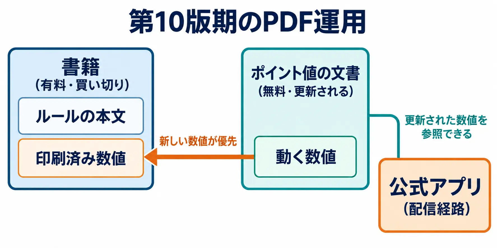
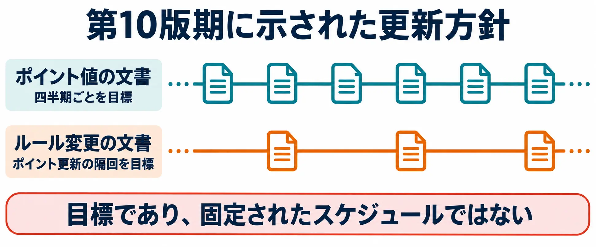

# 数値は変わる、書籍は残る――ウォーハンマー40,000に学ぶ「変更を届ける器」の設計

有料のルールブックに印刷された数値を、無料の更新資料が上書きする。『ウォーハンマー40,000』の第10版期には、この優先関係がポイント表の冒頭に明記されていた。書籍を買ったあとも、軍を編成するための点数は更新される。[[1](#ref-1)]

2026年6月に始まった第11版でも、最新のポイントを別の場所で提供する構造は続いている。現在の参照先は、専用ウェブページになったMunitorum Field Manualである。[[2](#ref-2)][[3](#ref-3)]

「読める仕様書」シリーズ第5回で扱う判断軸は、 **変更する対象と、変更を届ける器を分ける** ことだ。ここでいう器とは、書籍、更新文書、ウェブページ、アプリなど、プレイヤーが情報を受け取る場所を指す。どの数値をどう直すかとともに、何を見れば現在の条件が分かるかを、ゲームの設計に含めるのである。

***

## 第1章　ミニチュアゲームとは何か

### 自分で作った軍を、テーブルの上で動かす

ミニチュアゲームは、兵士や戦車などの小さな模型を使い、卓上に作った戦場で遊ぶゲームである。『ウォーハンマー40,000』はGames Workshopが展開するその一つで、プレイヤーはそれぞれ自分の軍を指揮する。ミニチュアを並べるテーブルには、建物や障害物など、戦場となる地形も置く。[[4](#ref-4)]

遊びは、模型を用意するところから始まる。自分でミニチュアを組み立て、塗装し、集めた軍をテーブルへ持ち寄る。公式の入門サービスWarhammer Academyも、組み立てと塗装を学ぶこと、最初の対戦を学ぶことを案内している。ここでは、組み立て・塗装を模型趣味としての過程と捉えればよい。すべての対戦について、同じ塗装水準を必須条件にするという意味ではない。[[5](#ref-5)]

テーブル上では、模型を手で動かす。「どこまで移動できるか」「相手が武器の届く範囲にいるか」を、距離を測って判断する。第11版コアルールでは距離をインチで測り、原則として模型の台座を基準にする。攻撃などの結果には六面ダイスを使う。画面上のプログラムが処理する代わりに、プレイヤーが位置とルールを確認し、ダイスを振って進めるのである。[[4](#ref-4)]

### ポイントは、軍を編成するための予算である

模型一体を「モデル」、ひとまとまりとして扱う部隊を「ユニット」と呼ぶ。ユニットは一体だけの場合も、複数の兵から成る場合もある。さらに、軍に含める模型を決めるときに使われるキーワードが「ファクション・キーワード」である。公式のポイント表の日本語版はこのファクションを「陣営」と訳しており、本稿でも以降は陣営と呼ぶ。[[3](#ref-3)][[4](#ref-4)]

軍を作るときには、使いたいものを無制限に並べるのではなく、対戦で決めた規模の枠内へ収める。ユニットには **ポイントという編成コスト** が設定されており、それらを足して軍を組む。ポイントは模型を買う代金とも、対戦中に獲得する得点とも別の数値である。第11版でも、ユニットなどのポイントはMunitorum Field Manualを参照し、編成手順は公式アプリで案内する形になっている。[[3](#ref-3)][[4](#ref-4)]

基本的な考え方は、強力なユニットほど多くの編成予算を使う、というものだ。同じ総額なら、高いユニットを選ぶほど、ほかに入れられる部隊は少なくなる。安いユニットを組み合わせれば、別の軍を作れる。実際の強さは組み合わせや戦場での役割にも左右されるため、ポイントは強さを完全に測った値というより、選択の釣り合いを取るために調整する値である。

たとえば、よく活躍するユニットのポイントを上げると、そのユニットを残すために、ほかの部隊を減らすか、編成を変える必要が生じる。攻撃力の文言を変えなくても、軍全体に組み込む負担を増やせる。反対にポイントを下げれば、採用の余地が広がる。 **ユニットの点数を変えることが、そのままバランス調整になる** のは、この予算制約があるからだ。公式の開発者解説でも、活躍しすぎるユニットの引き上げや、採用を増やしたいユニットの引き下げが説明されている。[[6](#ref-6)]

### ルールを読む本と、今の点数を調べる場所がある

このゲームには、全体の基本手順を記したコアルールと、陣営ごとのルールや背景を収めるコデックスという書籍がある。コデックスは購入する商品であり、第11版でも新しい書籍が発売されている。[[4](#ref-4)][[7](#ref-7)] 第11版のコアルールは2026年6月1日に無料公開され、紙のルールブックもローンチボックスへの同梱や単体販売で提供される。[[8](#ref-8)]

第10版のコデックスにはポイント値も印刷されており、公式は発売時の更新告知で、最新ポイントが書籍の記載と異なる場合があると案内していた。[[9](#ref-9)] 現行の第11版では、ポイントを調べる入口は専用ウェブページである。日本語の公式紹介サイトに加え、そのポイント表にも日本語版が用意されている。[[3](#ref-3)][[10](#ref-10)]

読み進めるうえでは、「模型を所有する」「軍勢のルールを読む」「現在の編成コストを調べる」という三つの行為を分けておくとよい。

***

## 第2章　動く数値が、別の器に入っている

現行のMunitorum Field Manual、すなわちミュニトルム・フィールドマニュアルは、無料で閲覧できるウェブ形式の参照資料だ。2026年9月8日時点の表示は **v1.4** 、公式ダウンロード案内の更新日は9月2日となっている。各陣営への入口があり、ユニットのポイントや、軍の編成に関する情報を調べられる。[[2](#ref-2)][[3](#ref-3)]

第11版では、部隊の組み合わせに適用するルール群である「デタッチメント」にも、選択用のポイントがある。現行資料には、その点数に加え、指揮官が合流できる部隊なども載る。 **更新される編成情報を集める器** として読むと、現在の役割を捉えやすい。[[3](#ref-3)]

この分離の優先関係が明瞭に書かれているのが、第10版期のPDF版Version 2.0である。全陣営のポイント値を収録し、冒頭で、それ以前に公開されたポイント値をすべて置き換えると定めている。書籍に記載された数値も、更新された無料PDFの数値に読み替える。[[1](#ref-1)]

この規定があると、手元の本と新しい表が食い違ったとき、プレイヤーは優先する側を選べる。印刷物はそのままでも、「いま軍を作るために使う数値」の所在は変えられるのである。

これは、第1回「[ボードゲームのルールブックは『書いた人が同席できない仕様書』である](board-game-rulebooks-as-standalone-specifications.md)」で扱った参照用文書の分離を、更新される数値へ適用した形と読める。

書籍はルールの本文を読む器、ポイント表は動く数値を参照する器として役割を分ける。ルール本文そのものの修正も、別途届けられる。この構造なら、ポイント変更のたびに書籍全体を買い直す手順を求めずに済む。

***

## 第3章　四半期更新という目標と、移行期の月次更新

第11版の開始後には、まず月ごとの更新期間が設けられた。2026年8月26日の公式告知は、9月を最後の月次調整とし、その後は四半期ごとの更新へ戻す方針を示している。9月8日時点では、その移行期間にある。[[11](#ref-11)]

更新の頻度にも経緯がある。2024年4月の公式説明は、ポイント表のMunitorum Field Manualを四半期ごと、広範なルール変更を扱うBalance Dataslateをその隔回で更新することを目標にしていた。同じ説明の中で、 **固定されたスケジュールではない** と明記し、版の開始時にはDataslateを続けて出した例も挙げている。[[9](#ref-9)]

「四半期ごとを目指す」は、変更を続けていく見通しを伝える。「固定ではない」は、必要なら間隔を詰め、変更が不要なら見送る裁量を残す。この二つを並べることで、継続して手入れする方針と、毎回必ず同じ規模の変更をする約束を分けられる。本記事が設計判断として読むのは、この区別である。

2024年の説明は、調整の目的として、陣営内の選択肢の釣り合いと、陣営を横断した勝率の改善を挙げていた。[[9](#ref-9)] 同じ陣営で特定の部隊ばかり選ばれる問題と、陣営同士で勝ちやすさが偏る問題の両方へ、ポイントを使って働きかけるということだ。

### 変える内容に応じて、届ける文書も変わる

第10版期の役割分担は、ポイント値ならMunitorum Field Manual、ルールの変更ならBalance Dataslateというものだった。第11版でも、ポイント調整とルール修正は続いている。7月の更新告知は両者を扱い、変更を公式アプリへも反映すると案内している。[[12](#ref-12)]

第11版で確認できる文書構成は、全陣営にまたがる修正を扱う **Universal Rules Updates** と、陣営別の追加・修正を扱う **Faction Pack** である。前者のVersion 1.0は、個別のFaction Packより広い範囲で基本的な仕組みやコデックスのルールを改善すると説明する。後者の一例であるティラニッドのVersion 1.1は、コデックスを補うルールとFAQを収録している。[[13](#ref-13)][[14](#ref-14)]

したがって、第11版の現状は、この文書構成と月次から四半期への移行方針で捉えたい。2024年の「Balance Dataslateを隔回」という説明は、当時の目標を示す資料である。

設計として共通するのは、 **編成コストを変えることと、処理の文言を変えることに、異なる参照先を用意する** 点だ。前者を見れば軍の予算を計算でき、後者を見れば実際の処理を読み替えられる。

***

## 第4章　変更を、どう見せるか

現行ウェブ版のMunitorum Field Manualでは、直近の更新で上がったポイントを赤、下がったポイントを緑で示し、変更幅を括弧内に記す。現在値と差分を、同じ参照先で追える形である。[[3](#ref-3)]

第10版のPDF版Version 2.0にも、同じ色分けと括弧内の変更幅が定められていた。新しいコデックスの値が初めて表に入る場合には、書籍に印刷された値と異なる箇所を強調する規定もあった。比較する相手が、前回のポイント表なのか、発売された書籍なのかまで示していたのである。[[1](#ref-1)]

第1回で紹介した[ウォーゲームのリビングルール](board-game-rulebooks-as-standalone-specifications.md)が重要な変更を本文の青字で示したのと同じく、変更後の情報に差分の目印を組み込む発想だ。

新しい値だけを掲載すると、前から遊んでいる人は自分の軍に関係する変更を探さなければならない。変更箇所と増減が見えれば、「どこを再計算するか」を見つけやすい。デジタルゲームの画面へ移す場合にも、色に加えて増減の符号や変更前後の値を併記するなど、差分を読み取れる設計が考えられる。

数値の届け方にはアプリも含まれる。2024年10月の告知は、ポイント変更が公式アプリですでに有効になっていると案内した。[[15](#ref-15)] 第11版でも2026年9月2日、新しいオルクのポイントをウェブ版と更新済みの公式アプリで参照できると告知している。[[16](#ref-16)]

卓上で遊ぶゲームにも、更新された数値の配信経路がある。書籍の印刷面を変える代わりに、編成前に開く場所へ現在値を届ける。文書を分ける判断は、その参照先へたどり着ける導線と組み合わせて機能する。

***

## 第5章　上書きされる側への配慮

更新が変えるのは、数値の表示とともに、プレイヤーが作ってきた軍の条件でもある。手持ちの模型が同じでも、ポイントが上がれば合計は増える。その影響を具体的に扱った規定が、第10版期のPDF版Version 2.0にある。[[1](#ref-1)]

対象は、Crusadeという継続キャンペーンである。そこで保持する軍の登録簿をOrder of Battle、その登録総量の上限をSupply Limitという。この規定は、更新で登録済みユニットの合計ポイントが上限を超えた場合、上限を新しい合計値まで引き上げることを認めている。通常の拡張に使うRequisitionや、そのためのポイントの消費も不要とする。[[1](#ref-1)]

ここで増えるのは、 **キャンペーンで保持する軍の登録上限** である。一回の対戦に出せるポイント上限を、片方のプレイヤーだけ増やすという規定とは区別する必要がある。

これは、更新のために登録済みの部隊を外さなければならなくなる事態への、明文化された救済と読める。新しい数値を使いながら、キャンペーンで保持してきた軍を維持できるようにする措置だ。

その線引きは、返金や旧性能の保証とは異なる。書籍の記載は古くなり、同じ対戦規模で以前と同じ編成を出せるとも限らない。守る対象を「登録した軍を保持して、キャンペーンを続けること」に定めているのである。

この救済は、第10版期の当該文書に明記された事例として扱う。現行ウェブ版の冒頭には同じ規定の掲載がないため、第11版にも自動的に引き継がれる一般規則としては適用しない。[[3](#ref-3)] 設計に持ち帰れるのは、変更後の状態を計算したうえで、誰のどの継続条件を守るかを文章にしておく、という判断である。

***

## 第6章　器を分けると、何が変わるか

デジタルゲームの課金アイテムでも、購入の案内と現在の性能だけが一体で示されていれば、購入時の性能は商品そのものの一部として受け取られやすい。本記事では、この問題の一面を **購入するものと、変更される条件の境界が、プレイヤーから見えているか** という文書設計の問題として読む。

ナーフをめぐる法的リスクやプレイヤーへの影響は、既刊の「[有償アイテムのナーフが許されない理由](why-paid-item-nerfs-are-hard.md)」で扱っている。

ウォーハンマーの例では、現在の編成コストを調べる場所が、購入した書籍から分かれている。第10版のPDFには上書きの優先関係があり、現行版には更新される参照先と差分表示がある。これらは、「いま有効な条件を、どこで知るか」を具体的にする。

開発側が内部データを別ファイルにしただけでは、この境界は読み手へ届かない。商品を紹介する画面から最新条件へたどれ、何が変更対象なのか分かって初めて、プレイヤーにとっての器の分離になる。変更への納得を器だけで説明するのではなく、変更を理解する入口の設計として使いたい。

出荷前の仕様レビューでは、次の五点を確認できる。

1. **どの数値が動きうるかを、出荷前に宣言しているか。** 攻撃力、編成コスト、獲得量など、変更対象を具体的に示す。
2. **動く数値は、どの器に置いてあるか。** 現在値を確認する場所と、古い記載に対する優先関係を決める。
3. **差分をどう見せるか。** 対象、増減、適用時点を読み取れる形にする。
4. **更新の頻度を約束するか、しないか。** 目標の間隔と確約する日程を分け、臨時更新の扱いも決める。
5. **上書きによって手持ちが使えなくなる人への措置があるか。** 保存済みの編成や進行中の遊びが、更新後にどんな状態になるかを確認する。

たとえば、買い切りの追加部隊を販売する架空の戦術ゲームを考える。販売画面では、購入により使える部隊を説明し、その部隊の「対戦用編成コスト」は更新対象だと示す。現在のコストはゲーム内の編成表を参照し、変更時には増減と適用日を表示する。

さらに、保存済みの編成が予算超過になった場合、試合開始前に該当編成と超過理由を表示し、組み直す場所へ案内する。継続キャンペーンを持つなら、登録の維持と一戦ごとの出撃条件を別々に決める。このように、動かす数値から、更新で影響を受ける保存状態までを一続きで設計できる。

***

## 第7章　器ごと変わる日

版、すなわちeditionの更新は、ゲームの基礎となるルールの世代交代である。第11版は2026年6月に始まり、それに先立つ6月1日に新しいコアルールが無料公開された。地形、戦闘、目標、ミッション選択などが見直されている。[[8](#ref-8)][[12](#ref-12)]

既存文書との接続については、公式の新版発表が、それまでのコデックスや陣営ルール、直近のキャンペーン補足書を引き続き使えると説明していた。[[17](#ref-17)] 移行時の陣営別更新は、使用するデタッチメントや、新しい基本ルールへ合わせる修正を配布する形を取った。[[18](#ref-18)]

第11版期のFaction Packにも、コデックスを補う追加ルールと修正を収録するという位置づけが明記されている。[[14](#ref-14)] 継続利用する書籍へ、新版の基本ルールと更新資料を組み合わせる構造である。

一方、ポイント表の器はPDFからウェブへ移り、収録する編成情報も広がった。書籍側にも新しい商品が登場し、第11版コデックスの公式紹介では、付属コードによってアプリの陣営ルールや版の存続期間中の追加コンテンツへアクセスできると案内している。[[3](#ref-3)][[7](#ref-7)] 書籍、追加資料、アプリの関係そのものも、版に合わせて作り直される。

**器を分けても、器ごと変わる日は来る。** 四半期の数値更新は、現在の遊びの条件を調整する約束である。版の更新は、どの基本ルールを使い、どの書籍を引き継ぎ、何を追加で参照するかを決め直す約束だ。

プランナーが別々に用意したいのも、この二つの案内である。日常の更新には変更対象と差分を、世代交代には引き継ぐものと新しく参照するものの対応を示す。更新頻度だけを宣言しても、版をまたぐ互換性の説明までは代わりに果たせない。

***

## おわりに　変える対象と、届ける器を一緒に決める

判断軸は、 **変更する対象と、変更を届ける器を分ける** ことだ。ポイント表を別に置き、現在値の参照先を示し、差分を見せ、更新の間隔と影響を受ける軍への措置を定める。変更を続けるゲームでは、数値を決めることと、その数値を読み替えられるようにすることがつながっている。

この類推には、適用の仕方という限界がある。対面のミニチュアゲームでは、相手と使うルールを合意して遊ぶ余地があり、大会では主催者が定める条件に従う。サーバー側で更新を一斉に適用するデジタルゲームでは、個々の対戦相手との合意だけで旧条件を使い続けることはできない。更新を届けることと、更新を適用することの距離が違う。

紙かデジタルかを優劣の基準にする必要はない。持ち帰るのは、何を動かし、その現在値をどこへ置くかという器の分け方である。数値が変わった日に、プレイヤーが同じ参照先を開き、自分の手持ちに起きた変化を読めるか。その問いを、出荷前の設計へ加えたい。

## References

1. [Munitorum Field Manual Version 2.0][1] — Games Workshop、第10版期・2025年1月。p.1の上書き、増減表示、CrusadeのSupply Limit規定。

2. [Warhammer 40,000 Downloads][2] — Warhammer Community。2026年9月8日確認。ポイント表の案内にupdated 02/09/2026と表示。

3. [Munitorum Field Manual v1.4][3] — Games Workshop、第11版のウェブ版。2026年9月8日、冒頭の展開パネルと日本語版（https://mfm.warhammer-community.com/ja）を確認。版番号、ポイント、増減表示、デタッチメント等の説明。

4. [Warhammer 40,000 Core Rules][4] — Games Workshop、第11版・2026年6月公開版。pp.4–5の導入、p.8のユニット、p.9の01.04／01.05、移動と射撃の節。ページは冊子表記。

5. [Warhammer Academy][5] — Games Workshop。組み立て・塗装と入門対戦の学習案内。

6. [The Warhammer 40,000 balance dataslate – Developers’ commentary][6] — Warhammer Community、2025年9月17日。採用状況や性能に応じたポイント調整。

7. [Anatomy of an 11th Edition Codex – What do you get?][7] — Warhammer Community、2026年8月19日。書籍の内容、アプリ用コードと版の期間中の追加コンテンツ。

8. [#New40k Rules – Download the free Core Rules now][8] — Warhammer Community、2026年6月1日。第11版コアルールの無料公開と物理版の案内。

9. [Warhammer 40,000 Metawatch – Points Changes Inbound in the Latest Munitorum Field Manual][9] — Warhammer Community、2024年4月25日。更新頻度の目標、固定日程ではない旨、調整目的、印刷済みポイントとの違い。

10. [ウォーハンマー40,000 日本語公式サイト][10] — Games Workshop。2026年9月8日確認。新版と日本語名称の案内。

11. [The Warhammer 40,000 August Update – Everything you need to know][11] — Warhammer Community、2026年8月26日。9月を最後の月次更新とし、四半期更新へ戻す方針。

12. [Warhammer 40,000 July Update – what you need to know!][12] — Warhammer Community、2026年7月22日。新版開始から一か月の更新、ポイントとルールの修正、アプリへの反映。

13. [Universal Rules Updates Version 1.0][13] — Games Workshop、2026年7月22日からマッチプレイ適用。全陣営にまたがる修正の位置づけ。

14. [Tyranids Faction Pack Version 1.1][14] — Games Workshop、2026年7月22日からマッチプレイ適用。p.1のコデックス補足資料という位置づけとアプリ反映。現行の最新版番号を示す用途ではなく、第11版期の文書構成の実例として参照。

15. [Warhammer 40,000 Balance Update – Points changes are here with the new Munitorum Field Manual][15] — Warhammer Community、2024年10月16日。ポイント変更の公式アプリ反映。

16. [Codex: Orks points are live on the Munitorum Field Manual][16] — Warhammer Community、2026年9月2日。最新ポイントのウェブ版・アプリ提供。

17. [Warhammer 40,000: The new edition is revealed at Adepticon Preview 2026][17] — Warhammer Community、2026年3月26日。既存コデックス、陣営ルール、キャンペーン補足書の継続利用。

18. [#New40k – Download new Xenos Faction Packs today][18] — Warhammer Community、2026年6月9日。新版向けの陣営更新、デタッチメントとコデックスへの接続。

[1]: https://assets.warhammer-community.com/eng_wh40k_munitorum_field_manual_jan25-pza48nw1eg-on4gfo3w6f.pdf
[2]: https://www.warhammer-community.com/en-gb/downloads/warhammer-40000/
[3]: https://mfm.warhammer-community.com/en
[4]: https://assets.warhammer-community.com/eng_01-06_warhammer40k_new40k_core_rules-was6fbu1ix-hfewhmxyiy.pdf
[5]: https://academy.warhammer.com/en-gb
[6]: https://www.warhammer-community.com/en-gb/articles/enrrjrvl/the-warhammer-40000-balance-dataslate-developers-commentary/
[7]: https://www.warhammer-community.com/en-gb/articles/axy3onye/anatomy-of-an-11th-edition-codex-what-do-you-get/
[8]: https://www.warhammer-community.com/en-gb/articles/nhqt9wx3/new40k-rules-download-the-free-core-rules-now/
[9]: https://www.warhammer-community.com/en-gb/articles/XUb9StBt/warhammer-40000-metawatch-points-changes-inbound-in-the-latest-munitorum-field-manual/
[10]: https://warhammer40000.com/ja/
[11]: https://www.warhammer-community.com/en-gb/articles/b4zj2o7u/the-warhammer-40000-august-update-everything-you-need-to-know/
[12]: https://www.warhammer-community.com/en-gb/articles/rgqanids/warhammer-40000-july-update-what-you-need-to-know/
[13]: https://assets.warhammer-community.com/eng_22-07_warhammer_40,000_universal_rules_updates-coltxp7ngi-3kvdfxwyon.pdf
[14]: https://assets.warhammer-community.com/eng_22-07_warhammer_40,000_faction_pack_tyranids-zt3miqmdoi-bdcud6qz2d.pdf
[15]: https://www.warhammer-community.com/en-gb/articles/g5ot1app/warhammer-40000-balance-update-points-changes-are-here-with-the-new-munitorum-field-manual/
[16]: https://www.warhammer-community.com/en-gb/articles/x82yzzth/codex-orks-points-are-live-on-the-munitorum-field-manual/
[17]: https://www.warhammer-community.com/en-gb/articles/ctdexme4/warhammer-40000-the-new-edition-is-revealed-at-adepticon-preview-2026/
[18]: https://www.warhammer-community.com/en-gb/articles/fchkklcq/new40k-download-new-xenos-faction-packs-today/

----

この文書は、Perplexity、Claude、OpenAI Codex の3つのAIの支援を受けて著述されたものです。引用画像を除き、MIT License にて提供されています。
