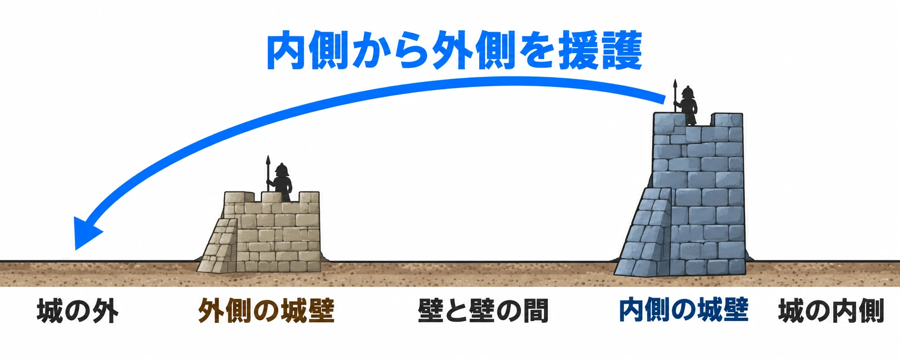

# 城壁の向こうに、また城壁がある――西洋の城の重なる守りから、奥へ進む段階を設計する

西洋風の城へ向かい、堀に架かる橋を渡る。門をくぐって顔を上げると、その先にはもう一枚、高い城壁がある。遠くにそびえる大きな塔は、城の外から見えていたものだ。目指す場所はわかる。それでも、そこへ着くにはまだ何かを越えなければならない。

JRPGの城を思い浮かべると、このような場面を想像しやすい。[第1回で扱ったリンチの5要素](castle-town-design-lynch-city-image.md)でいえば、城壁は内と外を分ける「縁」、奥の塔は行き先を示す「目印」にあたる。

全7回のシリーズ「城と街から拠点をつくる」第3回の問いは、 **「内と外を何段に分け、各段で何を見せ、何を越えさせるか」** である。[第2回](japanese-castle-gate-design-koguchi-masugata.md)で考えた入口の形から視野を広げ、今回は城全体に重なる守りを見ていこう。

***

## 主塔と城壁――目指すものと、隔てるもの

まずは、城を形づくる部分を押さえたい。イングランドの文化財機関Historic Englandは、11〜13世紀のほぼすべての城の中心に大塔があったと説明する。これが主塔で、キープやドンジョンとも呼ばれる。高さと大きさで周囲を見下ろす、領主の権威を示す建物だった。[[1](#ref-1)]

主塔には、塔を備えた城壁（カーテンウォール）が接続するか、その周囲を囲み、通常は外側に堀があった。門を建物として守る門楼には、跳ね橋や、上下させて通路を閉じる落とし格子などの防備があり、門の外に外堡（バービカン）という防御施設を設ける場合もあった。[[1](#ref-1)]

ゲームの景色として読むなら、主塔は「あそこへ行きたい」と思わせる対象になり、城壁は「ここから先へ入るにはどうするか」を考える境目になる。本稿の考察として、この二つを組み合わせれば、遠くの目的地を見せながら、近くで越えるべき場所を示せる。

ここで扱いたいのは、その境目を奥へ向けて何度つくるかだ。門の曲がり方や、その前後で足を止める工夫は第2回に譲り、城壁どうしの関係に注目しよう。

***

## 同心円城――内側の高い壁から、外側を援護する

二重の城壁を近い間隔で巡らせ、内側を外側より高くした城を、同心円城という。Historic Englandは、13世紀末から14世紀にかけて、目立つ主塔を持たず囲いを重視する城が造られ、その洗練された形として同心円城が現れたと説明する。内側の城壁と塔にいる弓兵は、低い外側の城壁の守備兵を援護できた。[[1](#ref-1)]

代表例が、ウェールズのボーマリス城とハーレック城である。UNESCOは、ジェームズ・オブ・セント・ジョージが設計を担った両城について、13世紀後半の軍事建築を特徴づける二重壁の同心円構造を評価している。[[2](#ref-2)]

このように奥行きを使って守りを重ねる考え方を、縦深防御という。Historic Englandは、この縦深防御を非常に有効だったと評価し、本気の攻め手に対しては難攻不落の城はなかったと範囲を示している。[[1](#ref-1)]

ここからは本稿の考察として、この形を攻める側から眺めてみよう。外の壁を越えたとしても、さらに奥の高い壁が残っている。攻め手は段階ごとに障害へ向き合い、守る側は奥から手前へ働きかけられる。壁の枚数に加えて、 **「次の守りが、今いる場所に届く」** ことが、この構造をゲームへ読み替える手がかりになる。

内側の高い城壁から、外側の守備兵を援護する関係を示す模式図。Historic Englandの説明をもとに作成。特定の城の復元図ではなく、距離・高さ・射程の縮尺は示していない。[[1](#ref-1)]

***

## 重なる守りの奥には、暮らしと権力がある

城は領主の住まいであり、政治権力、地方行政、裁判の中心でもあった。[[1](#ref-1)] [第2回で触れた姫路城の中心部の生活空間](japanese-castle-gate-design-koguchi-masugata.md)とも呼応する、城を考えるための大切な視点である。

本稿の考察として、ゲームでも「奥で何を守っているか」から段階を決めたい。最奥に敵の首領がいるなら、近づくにつれて相手の権力を感じさせられる。住民の暮らしがあるなら、外の警戒された場所から、内の落ち着いた場所へ移る構成にできる。

たとえば味方の拠点なら、外側では出入りする荷車や門番を見せ、内側では暮らす人々を見せ、最後に領主と会う部屋へ通す、と考えられる。これは架空の配置例だが、境目を越えるたびに、その城での自分の立場や、場所の役割が変わったと伝えられる。

何段も守る理由が見えると、奥へ進む行為にも意味が生まれる。壁を増やす前に、その先にいる人や、置かれているものを決めておこう。

***

## ゲームでは、次の段と最終目標を見せ分ける

ここからは **本稿の考察として**、二重の城壁がつくる段階と、主塔がつくる目印を、架空のゲーム用の城に組み合わせる。史実の同心円城の再現とは分けて考える。

### 外側を越えたところで、次の課題を見せる

外の門を越えると、内側の高い城壁に見張りがいる。プレイヤーは一つの境目を越えた達成感と、次に対処する相手を同時に受け取れる。

内側から見下ろされる形を使えば、手前の段にいるうちから、次の段の緊張を伝えられる。ここで決めたいのは、見張りがいると知らせるだけなのか、実際に攻撃を届かせるのかである。実際に攻撃するなら、姿や攻撃の予兆を見せ、身を隠す場所や対処の手段も一緒に用意したい。

また、段を越えるたびに同じ敵と同じ扉が現れると、移動が繰り返しに感じられる。最初は安全な進路を探す、次は高所の見張りへ対処する、最後は奥へ入る方法を選ぶ、と各段の判断を変えれば、進行に違いをつけられる。

### 近くの関門と、遠くの主塔を同じ景色に置く

目の前に次の門があり、その上方に最奥の主塔が見える。こうすれば「今はこの門を目指す」「最後はあの塔へ行く」という、近い目標と遠い目標を一つの景色で伝えられる。

道中で塔が建物に隠れるなら、各段の入口や広場で再び見えるようにする。見え直したときの大きさや角度の変化は、近づいた実感をつくる材料になる。常に画面内へ収めるか、節目で見せ直すかは、実際のカメラで歩いて確かめたい。

### 関門を越える順序と、越え方の選択を分ける

この区別を考える材料になるのが、『ELDEN RING』のディレクター、フロム・ソフトウェアの宮崎英高氏の説明である。発売前の2021年6月14日に公開されたファミ通.comのインタビューで、宮崎氏は、城などを立体的に作り込んだ大規模ダンジョンを「レガシー」と呼んでいる。これがレガシーダンジョンである。[[3](#ref-3)]

同じインタビューでは、世界全体の移動について、越えなければ先のマップへ進めない関所があり、その越え方が複数ある場合もあると説明している。また、レガシーダンジョンには地図を用意せず、手探りの探索から構造を理解する楽しさを重視したという。[[3](#ref-3)]

これを本稿の考察へ引き寄せると、 **「次の段へ進む条件」と「その条件を満たす方法」は、別々に設計できる。** 架空の城なら、内側へ入るという目標を共通にしたまま、正面から戦う道と、見張りを避けて回る道を用意する、といった考え方ができる。

第1回の「地図なしで覚えられるか」という問いも、ここにつながる。探索したあとに「外の庭から内側の壁へ上り、主塔の手前へ出た」と説明できるだろうか。次に越える境目と、最終目標の位置がつながって理解できれば、道を選ぶための手がかりになる。

***

## 『Stronghold 3』では、守る側がその形をつくる

城を築いて守るゲームでは、プレイヤーが相手の進路を設計する側に立つ。

『Stronghold 3』のデザイナーであるFirefly StudiosのSimon Bradbury氏は、2011年3月31日のGameSpotのインタビューで、攻め手を狭い場所へ誘い込み、矢で迎え撃ちやすくする工夫を説明している。さらに、攻め手を火力や罠を用意した「キリングゾーン」、つまり攻撃を集中させる場所へ導くことを、築城する側の腕の見せどころとして挙げた。[[4](#ref-4)]

同氏は、城壁の配置を格子状の制約から自由にすることで、史実の城をもとにした形も再現しやすくなると述べている。これも発売前の説明である。[[4](#ref-4)]

ここからは本稿の考察として、攻める側と守る側を入れ替えてみよう。攻めるプレイヤーにとって、内側の高い壁は次の脅威だ。守るプレイヤーにとっては、手前へ攻撃を届かせるために使いたい場所になる。狭い通路も、攻める側には避けたい場所、守る側には相手を通したい場所となる。

第2回では、『アサシン クリード シャドウズ』の複数の入口を、潜入する側が経路を選ぶ設計として取り上げた。同じように城への道を考えても、守る側を遊ばせるなら「相手の道をどう絞るか」が判断の中心になる。

| 城の形 | 攻める側に生まれる判断 | 守る側に生まれる判断 |
| --- | --- | --- |
| 重なる城壁 | 次の境目をどこから越えるか | 相手をどの段で止めるか |
| 内側の高い場所 | 見張りを避けるか、先に対処するか | 手前のどの場所へ攻撃を届かせるか |
| 壁の間の限られた通路 | 危険な場所をどう抜けるか | 相手を迎え撃つ場所へどう導くか |
| 奥の中心部 | 何を目指して進むか | 何を最後まで守るか |

この表は、城の形から考えた設計上の対比である。どちらをプレイヤーに任せるかを決めると、同じ二重の壁でも、用意したい選択肢が変わってくる。

***

## 「各段で何を見せ、何を越えさせるか」を点検する

まず、城の外から最奥までを簡単な区画に分け、境目ごとに「ここを越えたら何が変わるか」を一文で書く。次の表は、本稿の考察を点検項目にまとめたものだ。

| 観点 | 確かめること | 調整の例 |
| --- | --- | --- |
| プレイヤーの立場 | 攻める側か、守る側か | 経路を選ばせるか、相手の経路を絞らせるかを決める |
| 段の数 | 境目を越えるたびに、行動や場所の役割が変わるか | 同じ判断を繰り返す段はまとめる |
| 各段の関門 | 何をすれば先へ進めるか。越え方は一つか複数か | 戦闘、迂回、許可を得る会話などから、体験に合う条件を選ぶ |
| 次の段の見え方 | 次の門や高い壁を、どこで発見するか | 一つ越えた地点から次の課題を見せる |
| 最終目標の見え方 | 主塔などの目印を、どこから見通せるか | 各段の節目で、目標の位置を確かめ直せるようにする |
| 内側からの働きかけ | 見下ろされる緊張だけか、攻撃も届くか | 見張りの予兆、遮蔽物、対処できる経路を調整する |
| 奥にあるもの | ボス、暮らし、権力の中心など、何を守る城なのか | 奥へ近づくにつれて、人や建物の役割を伝える |

最後に、プレイヤーの視点で各段を通ってみる。「今どこにいて、次は何を越え、最後はどこへ向かうか」を景色から説明できるか。守る側のゲームなら、攻め手の道をたどり、「ここへ誘導したい」という自分の狙いが形になっているかを確かめる。

最初の門を抜けた先に、もう一枚の城壁がある。その奥には、目指していた塔が見える。城の重なる守りは、この「一つ進んだ実感」と「まだ先がある見通し」を考える手がかりになる。 **内と外を何段に分け、各段で何を見せ、何を越えさせるか。** その判断から、奥へ進む体験を組み立てていこう。

## References

1. [Mark Bowden「Stone Castles: Introductions to Heritage Assets」][1] — Historic England、2011年5月初版、2018年10月再刊 v1.1、HEAG 235。「Introduction」（冊子1ページ）と「3 Description」（冊子4〜5ページ）を参照。英語の説明は日本語で要約。2026年10月9日閲覧。

[1]: https://historicengland.org.uk/images-books/publications/iha-stone-castles/heag235-stone-castles/

2. [UNESCO World Heritage Centre「Castles and Town Walls of King Edward in Gwynedd」][2] — UNESCO、1986年世界遺産登録。「Outstanding Universal Value」の「Brief synthesis」「Criterion (i)」を参照。英語の説明は日本語で要約。2026年10月9日閲覧。

[2]: https://whc.unesco.org/en/list/374/

3. [ファミ通.com編集部「『エルデンリング』国内独占インタビュー。フロム・ソフトウェア最大規模となる新しいダークファンタジーをディレクター宮崎英高氏が語る【E3 2021】」][3] — ファミ通.com、2021年6月14日。発売前の宮崎英高氏へのインタビュー。城などの立体マップ、先のマップへ進む関所、レガシーの地図と探索に関する回答を参照。

[3]: https://www.famitsu.com/news/202106/14223605.html

4. [GameSpot Staff「Stronghold 3 Q&A – Building a Better Castle」][4] — GameSpot、2011年3月31日。発売前のSimon Bradbury氏へのインタビュー。狭い場所への誘導、自由な城壁配置、killing zonesに関する回答を参照。英語の発言は日本語で要約。

[4]: https://www.gamespot.com/articles/stronghold-3-qanda-building-a-better-castle/1100-6306669/

----

この文書は、Perplexity、Claude、OpenAI Codex の3つのAIの支援を受けて著述されたものです。引用画像を除き、MIT License にて提供されています。
