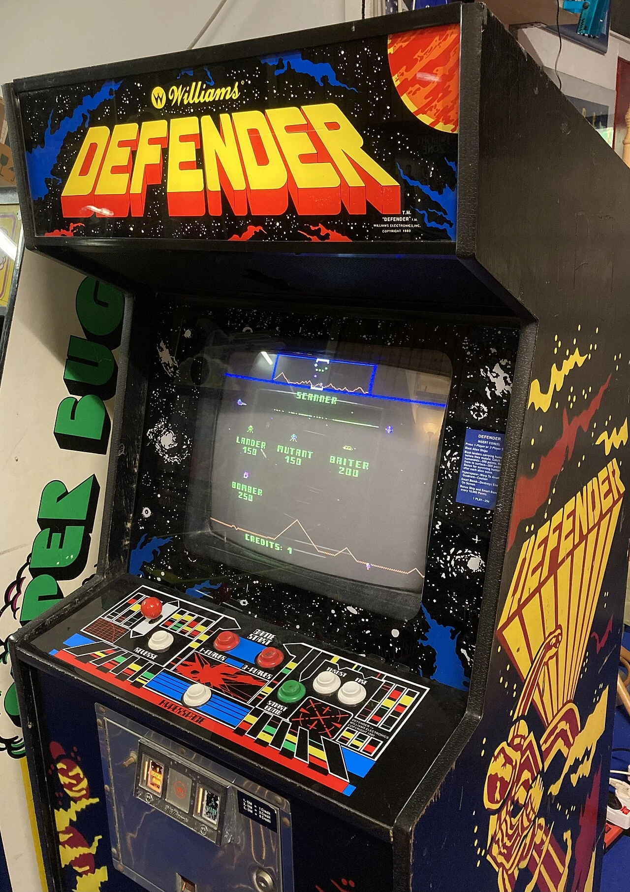
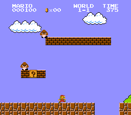
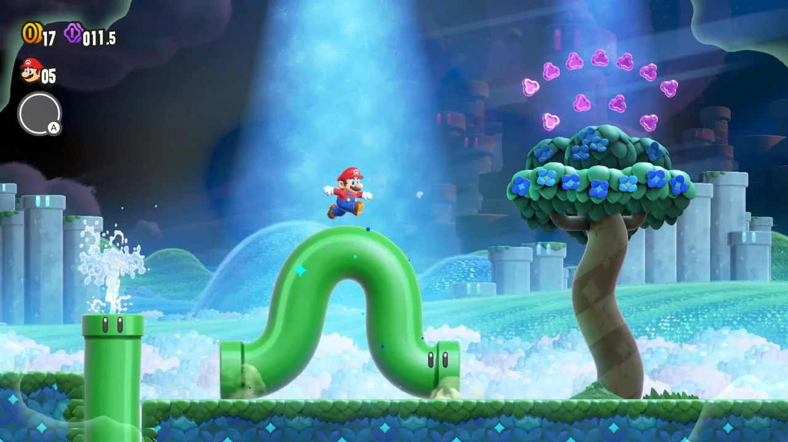

# なぜマリオは右へ進むのか？ — 横スクロールアクションゲームの変遷

## エグゼクティブサマリー

「マリオはなぜ右に進むのか」という問いは、一見シンプルに見えて、実は技術・心理・文化・デザイン哲学が複雑に絡み合った問題である。1981年のアーケードゲームによる横スクロールの発明から、1985年の『スーパーマリオブラザーズ』による様式の確立、多方向スクロールという"反骨"の試み、一度は3D革命に押され衰退しかけた2D横スクロールのインディー・携帯機での復興、そして2023年『スーパーマリオブラザーズ ワンダー』による伝統の刷新まで、横スクロールの歴史は「右方向という規範がいかに生まれ、拡大し、挑戦され、再生してきたか」の物語でもある。

---- 

## 第1章:横スクロールの黎明 — スクロールが「発明」されるまで

### 固定画面の時代

1978年にタイトーが発売した『スペースインベーダー』をはじめ、初期のビデオゲームの多くは単一画面に世界を収める「固定画面型」だった。画面内に収まりきらない広大な世界を表現する技術的な手段がなかったためである。プレイヤーキャラクターが動いても画面は動かない——それが当たり前の時代が続いた。[[1](#ref-1)]

### スクロールの萌芽 — Defender(1980)とScramble(1981)

*画像出典: [Wikimedia Commons - Williams Defender Arcade Video Game](https://commons.wikimedia.org/wiki/File:Williams_Defender_Arcade_Video_Game.jpg)（撮影: VMzB, [CC BY-SA 4.0](https://creativecommons.org/licenses/by-sa/4.0/)）*

「画面が動く」という発想自体は1980年末にWilliams Electronicsが発売した『Defender』に既に現れていた。ただしDefenderは**プレイヤーが左右どちらにも自由にスクロールできる**タイプで、ステージ進行の概念は存在せず、1つの戦場をループする設計だった。[[2](#ref-2)]

この常識を一歩進めたのが、コナミが1981年に発売したアーケードゲーム『スクランブル』である。『スクランブル』は**強制横スクロールと複数の明確な関門ステージ**を組み合わせた最初期のシューティングゲームとして歴史に名を刻む。画面が自動で右方向へと流れ、プレイヤーはその流れに抗えないまま次々とステージをクリアしていく——この「スクロール+ステージクリア」という組み合わせが、のちの横スクロールジャンルの原型となった。[[3](#ref-3)][[4](#ref-4)]

このゲームは後に『グラディウス』(1985年)へと直接つながる系譜の源流であり——グラディウスの当初の開発仮題は"Scramble 2"だった——、横スクロールシューティングというジャンルの礎を築いた。[[5](#ref-5)]

### ムーンパトロール(1982年) — 多重スクロールの本格採用

翌1982年、アイレムが発売した『ムーンパトロール』は、横スクロール史においてもう一つの革新をもたらした。月面車を操りながら進むこのゲームは、**多重スクロール(パラララックス・スクロール)**を本格的に採用した最初期の作品のひとつであり、画面の遠近感が異なる速さで流れることで「奥行き」という概念を視覚的に表現してみせた。3層のパララックス背景は当時としては先進的で、後のアクションゲーム・シューティングゲームに広く影響を与えた。[[6](#ref-6)][[7](#ref-7)]

---- 

## 第2章:「右に進む」規範の確立 — マリオとその前夜

### パックランド(1984年) — 横スクロールジャンプアクションの先駆

スーパーマリオブラザーズよりも約1年前、ナムコは1984年に『パックランド』をアーケードで発売した。『パックマン』のキャラクターを使った純粋な横スクロールジャンプアクションゲームであり、「ジャンプ」「左移動」「右移動」という3ボタンシステムを採用した(当時ナムコの『トラック&フィールド』路線を継承)。[[8](#ref-8)][[9](#ref-9)]

『パックランド』が『スーパーマリオブラザーズ』に影響を与えたかについては、**関係者間で見解が分かれている**。パックマンの生みの親である岩谷徹は「パックランドはスーパーマリオに影響を与えた。宮本茂もそう語った」と回顧している一方、宮本茂自身は後のインタビューで「直接的な影響は青空の背景色くらい」「パックランド以前から横スクロールして大きなキャラが冒険するジャンプアクションの構想はあった」と影響を縮小して語っている。両者の証言は食い違うが、少なくとも**1984〜85年に横スクロールジャンプアクションという様式が同時多発的に成立しつつあった**ことは確かである。[[10](#ref-10)][[11](#ref-11)]

### スーパーマリオブラザーズ(1985年) — 「右へ進む」の徹底的な設計

*画像引用: [Super Mario Wiki - SMB NES World 1-1 Screenshot](https://www.mariowiki.com/File:SMB_NES_World_1-1_Screenshot.png)（出典: Super Mario Bros., © Nintendo。本文中の画面構成分析に必要な範囲で引用）*

1985年9月13日、任天堂は『スーパーマリオブラザーズ』を発売した。このゲームが単なる「右スクロールゲーム」ではなく、**「右に進む」という概念をゲームデザインとして完璧に昇華させた作品**である点が特筆に値する。[[12](#ref-12)]

宮本茂の設計思想は徹底していた。

- **マリオが画面のわずかに左寄りから始まる**:プレイヤーは画面の右側に大きな空間を見つけ、無意識に右の十字キーを押したくなる[[13](#ref-13)]
- **右方向に広がる世界**:「プレイ画面はこの右へ広がる世界の一部を切り取ったもの。右に空いた空間を見れば、プレイヤーは右へ右へと進めばいいとわかる」と宮本は語っている[[14](#ref-14)]
- **ワールド1-1がチュートリアル**:テキストで説明せず、コースの地形配置そのものがゲームの仕組みを体験として教える設計になっている[[15](#ref-15)][[16](#ref-16)]

宮本の専門は**金沢美術工芸大学で学んだ工業デザイン**であり、この「機能から必然として設計された」美学がマリオのゲームデザインに色濃く反映されている。[[17](#ref-17)]

---- 

## 第3章:なぜ「右」なのか — 多角的な考察

横スクロールゲームが右方向を標準とした理由は、一つの原因に帰結するものではなく、複数の要因が重なっている。ただし**技術的必然というより、文化的規範と慣習の相互強化**が実態に近い。

### ① ハードウェアの制約と設計判断

ファミコン(NES)のハードウェアには**スプライトを画面左端にはみ出せない**という非対称性が確かに存在した。NESのPPU(Picture Processing Unit)は8ビットのX座標しか扱えず負の値を表現できないため、スプライトは右端から徐々に画面外へ消えることはできても、左端から徐々に現れる表現はハードウェア的に困難だった。後継のスーパーファミコンで9ビットX座標に拡張されたことが、この制約の存在を裏付けている。[[18](#ref-18)]

ただし**「右スクロールしかできない」というのは誤解**である。PPUのスクロール処理自体は左右対称で、実際『メトロイド』(1986)や『悪魔城ドラキュラII 呪いの封印』(1987)は左右双方向にスクロールしている。『スーパーマリオブラザーズ』が一方通行設計を採用したのは、ハードウェアの限界ではなく**ゲームデザイン上の判断**——限られたRAM(2KB)では踏破した地形全体の状態(壊したブロック等)を記憶できないため、画面1枚分だけを管理する設計にした——に起因する。技術制約は存在したが、それは規範を「促した」のであって「決定した」わけではない。[[19](#ref-19)]

### ② 左から右へ読む文化

英語や現代日本語などの横書き文化圏では、人は視線を左から右に動かす習慣がある。この「左から右へ」という認知的な流れが、ゲームの進行方向への直感的な理解を後押しした。方向と感情価に関する認知科学研究でも、左→右への運動が右→左より「前進的」「ポジティブ」に知覚されることが繰り返し確認されている。[[20](#ref-20)][[21](#ref-21)]

### ③ 右=前進・左=後退という物語的文法

ゲームデザインの視点では、右方向への移動は「未来への進行」「冒険」を象徴し、左方向は「帰還」「後退」または「抵抗」を意味するコンテクストで用いられることが多い。歌舞伎や伝統的な演劇では、**舞台向かって右(上手・かみて)が格上・上位者の位置、左(下手・しもて)が格下・来訪者の位置**という空間的序列がある。ゲームにおける右方向進行はこうした伝統的な「右=上位・目的地」の感覚とも整合している。[[22](#ref-22)]

### ④ アーケード筐体のインターフェース

アーケード筐体の操作系は時代により変化があるが、JAMMA規格が普及した1980年代中盤以降は**左手レバー・右手ボタン**が標準化した。自機やキャラクターを画面左側に配置し右へ進ませる設計は、この操作系と親和性が高い。ただし初期のアーケード(『スペースインベーダー』等)は右手レバーが多く、「人間工学が右進行を決めた」という説明は**事後的な合理化**の面もあることを付け加えておきたい。[[23](#ref-23)]

---- 

## 第4章:規範への挑戦 — 多方向・逆方向へのデザイン

### アトランチスの謎(1986年) — 左右探索のオープンワールド

1986年4月17日、サン電子(サンソフト)は『アトランチスの謎』をファミコン向けに発売した。このゲームは全100ゾーン(隠しゾーンを含めると101ゾーン)という圧倒的なボリュームを誇り、**各ゾーン内を左右どちらにもスクロール・探索できる**という自由度の高い設計を採用した。[[24](#ref-24)][[25](#ref-25)]

スーパーマリオブラザーズを超えることを開発目標として掲げながら、一方通行ではなく探索・分岐の自由を与えるという野心的なアプローチは、後の探索型アクションの発想の先駆けとも言える。ただし、その自由度の高さゆえに「どこに進めばいいかわからない」という迷子感も生まれやすく、方向性の明確さと自由度のトレードオフを示す事例でもある。[[26](#ref-26)]

### 夢工場ドキドキパニック(1987年) — 上下方向と「裏画面」

任天堂が1987年7月10日にファミコンディスクシステム向けに発売した『夢工場ドキドキパニック』は、フジテレビとの共同企画として生まれた横スクロールアクションゲームである。後にキャラクターをマリオファミリーへと置き換えて、海外では1988年に『Super Mario Bros. 2』として、さらに日本でも1992年に『スーパーマリオUSA』として発売されたことでも知られる。[[27](#ref-27)][[28](#ref-28)]

通常の横スクロールに加えて、**上下方向にも手動スクロールが可能**であり、舞台となる「**夢宇界(ムウかい)**」は現実とは異なるアラビア風の異世界として設計されていた。さらに重要なのが、魔法のランプを投げると扉が出現し、敵のいない「裏画面」（いわば裏世界）へ出入りできる仕組みである。裏画面では草からメダルを得たり、特定地点でライフ上限を上げるハートを入手したりできるため、同じ座標を表と裏の二重構造として読み替える遊びが生まれていた。[[27](#ref-27)][[48](#ref-48)]

つまり本作の空間は、右へ進む横方向、上下へ移動する縦方向、そしてランプの扉で一時的に潜る裏画面という三つの軸を持っていた。野菜を引き抜いて敵に投げるという独特のアクションシステムも相まって、「右に進んでゴール」という線的な構造ではなく、立体的・探索的な空間の楽しさを提案した作品だった。

### グラディウス(1985年) — シューティングが示す「右」の普遍性

アクションゲームだけでなく、シューティングゲームも右方向進行を採用していた。コナミが1985年に発売した『グラディウス』は、1981年の『スクランブル』の直系後継作であり、宇宙戦闘機「ビックバイパー(VIC VIPER)」——この名称は1986年のファミコン移植版から導入された——を操り右方向へ進む横スクロールシューティングの金字塔となった。ファミコン版は1986年4月25日に発売され、同年中に日本国内で100万本を超えるヒットを記録、パワーアップカプセルシステムをはじめとする革新的なゲームデザインでシューティングジャンルを牽引した。[[29](#ref-29)][[30](#ref-30)]

「右に進む」という設計がシューティングとアクションという異なるジャンルで独立して定着した事実は、この方向性の普遍的な強さを裏付けている。

### スカイキッド(1985年) — あえて「左に進む」ゲーム

横スクロールシューティングの定番を逆手に取ったのが、ナムコが1985年に発売した『スカイキッド』である。このゲームは**画面が右から左へとスクロールし、自機も左方向へ進む**という、当時としても異例の「逆スクロール」設計を採用した。左向きに飛ぶ飛行機を操り、ミッションターゲットを爆撃するプレイ感は独特であり、**ナムコ初の2人同時プレイ対応作品**でもあった(それ以前のナムコ作品は交代制)。[[31](#ref-31)][[32](#ref-32)]

### メトロイド(1986年) — 最初の一歩を「左」に踏み出す意味

任天堂が1986年8月6日にディスクシステム向けに発売した『メトロイド』は、横スクロールアクションの常識を根底から覆した作品である。通常のマリオ型ゲームであればスタート直後は「右へ進め」と誘導されるが、メトロイドでは**最初のアイテム「モーフボール(マルマリ)」がスタート地点のすぐ左にある**。つまり先へ進むには、まず左に向かわなければならない。[[33](#ref-33)][[34](#ref-34)]

この設計は「一方通行ではなく、マップを行き来するアドベンチャーゲームを作る」という開発コンセプトの体現であり、後に「メトロイドヴァニア」と呼ばれるジャンルの礎となった。メトロイドヴァニアとは、左右上下に広がる相互に接続されたマップを探索し、新たな能力を獲得することで行ける範囲が広がるゲーム様式を指す。[[35](#ref-35)]

### 悪魔城ドラキュラ(1986年) — シリーズが育てた探索型アクション

コナミが1986年9月26日にディスクシステムで発売した『悪魔城ドラキュラ』は、横スクロール型のステージクリア型アクションでありながら、固定画面と横スクロールを組み合わせたステージ設計、複雑な城の構造、そしてジャンプ操作の制限による慎重なゲームプレイを特徴とした。[[36](#ref-36)]

ただし**初代『悪魔城ドラキュラ』自体は一本道のステージクリア型**であり、探索型ではない。「メトロイドヴァニア」の「-vania」という呼称は、厳密には1997年の『悪魔城ドラキュラX 月下の夜想曲』以降のシリーズ展開を指しており、探索・成長要素を取り入れた同作以降のシリーズが『メトロイド』と合流することで、このジャンル名が定着した。[[35](#ref-35)]

---- 

## 第5章:2D横スクロールの苦境と再生 — インディー、携帯機、そしてマリオへの回帰

### 3D革命と据置機2Dの「冬の時代」

1990年代後半、プレイステーションやNINTENDO64による3Dゲームの台頭により、据置機における2D横スクロールゲームは急速に下火となった。スーパーファミコン時代までの大隆盛から、PS/N64世代にかけて据置機の主役の座を一気に失う。それは3D操作という体験が当時いかに画期的であったかの証左でもある。[[37](#ref-37)]

ただし2D横スクロールが完全に絶滅したわけではなかった。**セガサターンとプレイステーションでは**1997年の『悪魔城ドラキュラX 月下の夜想曲』が発売され、探索型2Dアクションの頂点を打ち立てた。**携帯機では**ゲームボーイアドバンス(2001-)とニンテンドーDS(2004-)の登場により2D横スクロールが連続的に発展し、「GBA 2Dルネサンス」と呼ばれるほどの活況を呈した。『メトロイド ゼロミッション』(2004)、『悪魔城ドラキュラ 蒼月の十字架』(2003)、『ロックマンゼロ』シリーズなど、携帯機こそが2D横スクロールの実験場であり続けた。[[38](#ref-38)]

### 個人開発から始まった復興 — 洞窟物語(2004年)

インディーゲームによる2D復興の象徴的出発点が、2004年12月に天野秀樹(Pixel)が一人で約5年かけて完成させた『**洞窟物語(Cave Story)**』である。日本人個人開発者によるこのフリーゲームは、メトロイドヴァニア型の探索構造と、レトロなドット絵・音楽で構成され、世界中のインディー開発者に強烈な影響を与えた。後に商用リメイク版が各プラットフォームで展開され、「個人でも2D横スクロールの傑作を作れる」という実例として、のちのインディー・ムーブメントの先駆けとなった。[[39](#ref-39)]

### インディー第一波(2008-2012年) — 配信プラットフォームの登場

Xbox Live ArcadeやSteamなどのデジタル配信プラットフォームが整備された2000年代後半、インディー2D横スクロールは爆発的な再生を迎える。

- **『Braid』**(2008年、Jonathan Blow):時間操作パズルを軸にした横スクロール。XBLAでの配信成功がインディー市場の可能性を示した
- **『Super Meat Boy』**(2010年、Team Meat):超高難度・瞬発力勝負の横スクロールアクションとして大ヒット
- **『Limbo』**(2010年、Playdead):モノクロ・無音のシネマティック横スクロールで芸術性を証明
- **『Fez』**(2012年、Polytron):2D/3D視点切替という発想で評価を獲得

これらの作品群は「2D横スクロールはノスタルジーではなく、現代の表現様式として成立する」ことを証明した。ドキュメンタリー映画『Indie Game: The Movie』(2012)がこの時代を象徴する。[[40](#ref-40)]

### 大手の2D回帰とインディー第二波(2014年前後)

インディーの成功を受け、大手パブリッシャーも2D横スクロールへ回帰した。任天堂は**『New スーパーマリオブラザーズ』**(2006年、DS)で伝統的な2Dマリオを復活させ、全世界で3,080万本超のメガヒットを記録、続くWii版・3DS版・WiiU版で2Dマリオの系譜を維持した。レトロスタジオの**『ドンキーコング リターンズ』**(2010年、Wii)、Ubisoftの**『Rayman Origins』**(2011)・**『Rayman Legends』**(2013)も2D表現の新たな高みを示した。[[41](#ref-41)]

そしてインディー側は2014年前後に第二波を迎える。

- **『Shovel Knight』**(2014年6月、Yacht Club Games):Kickstarterで目標7.5万ドルに対して31.1万ドルを調達、リリースから約半年で30万本を突破。8ビット風グラフィックとチップチューン音楽でファミコン時代の美学を現代的にアレンジした[[42](#ref-42)]
- **『Ori and the Blind Forest』**(2015年3月、Moon Studios):美麗なグラフィックとメトロイドヴァニア設計の融合で高評価を獲得[[43](#ref-43)]
- **『Hollow Knight』**(2017年2月、Team Cherry):オーストラリアの小規模スタジオによるダーク・メトロイドヴァニアの金字塔[[44](#ref-44)]

### 定着期(2017年以降) — 横スクロールは「選択」となる

2010年代後半以降、横スクロール2Dはもはや「復活したジャンル」ではなく「確立された表現様式」として定着した。

- **『Cuphead』**(2017年、Studio MDHR):1930年代のカートゥーン調アニメーションで独自の表現領域を開拓
- **『Celeste』**(2018年、Maddy Makes Games):精緻な操作感と心の葛藤を描く物語で横スクロールアクションの新たな到達点
- **『Dead Cells』**(2018年、Motion Twin):メトロイドヴァニアとローグライトの融合

これらの作品は「2D横スクロールが技術的制約の産物ではなく、**意識的・表現的な選択**であること」を完全に証明した。

### スーパーマリオブラザーズ ワンダー(2023年) — 40年の系譜が辿り着いた場所

*画像引用: [Nintendo Official Site - Super Mario Bros. Wonder](https://www.nintendo.com/us/store/products/super-mario-bros-wonder-switch/)（公式商品ページ掲載スクリーンショット, © Nintendo。本文中の表現分析に必要な範囲で引用）*

そして2023年10月20日、任天堂は『**スーパーマリオブラザーズ ワンダー(Super Mario Bros. Wonder)**』をNintendo Switch向けに発売した。2012年の『New スーパーマリオブラザーズ U』以来、**約11年ぶりとなる完全新作の2D横スクロールマリオ**である。[[45](#ref-45)]

プロデューサーの手塚卓志とディレクターの毛利志朗が率いる開発チームは、2019年から明確な締切を設けずに開発を進め、2D横スクロールマリオを根本から再発明することを目指した。中心となる「**ワンダーフラワー**」の仕組みは、ステージの途中で世界そのものが予測不能に変貌する——土管が生命を得て動き出し、マリオが巨大な棘の球に変わり、景色が垂直方向に回転する——というものだった。毛利は「かつては『新しい』という理由だけでプレイヤーを驚かせられたマリオが、40年を経て『当たり前』になってしまった。その当たり前を揺さぶりたかった」と語っている。[[45](#ref-45)]

この姿勢は象徴的である。1985年のマリオは「右へ進む」という規範を生み出したが、2023年のワンダーは「**右へ進みながら、ステージ中で世界のルールそのものが変わる**」という新たな層を加えた。進行方向は依然として右だ。しかしその右方向には、もはや予想可能な地形ではなく、予想不可能な変身体験が待っている。

ワンダーは2週間で430万本、2025年3月までに1,715万本を売り上げ、**マリオ史上最速で売れた作品**となった。発売と同時期にセガが『ソニックスーパースターズ』を投入したことも象徴的で、1990年代の任天堂vsセガの2D競争を思い起こさせる事件となった。[[45](#ref-45)]

---- 

## 第6章:「右へ進む」が生んだ文化的影響

### UXデザインへの波及

「右=前進」という感覚は、ゲームの外にも広く浸透している。現代のWebやアプリのUI設計において、「→(右矢印)=進む・次へ」「←(左矢印)=戻る・前へ」という慣習が当たり前のように機能しているが、その文化的な基盤の一つは『スーパーマリオブラザーズ』をはじめとする横スクロールゲームの体験にある(ただしRTL言語圏のiOS/Androidではこれらは自動的にミラーリングされる)。[[46](#ref-46)]

子どもたちが「右に進むと新しい世界が現れる」体験を反復することで、「右=前進」「左=後退」という感覚が身体的に学習された。このメンタルモデルは、成長後のUIインタラクションにも無意識の前提として機能している。

### 文化圏による差異

ただし、この「右=前進」の直感は普遍的ではない。アラビア語やヘブライ語のように右から左へと文章を読む文化圏では、認知的な進行方向が逆転する場合もある。

日本の文化圏の中でも、**マンガは縦書き右綴じの伝統から右→左に読み進める**という独自の方向性を保っている。一方で**日本の映画・映像文法は現代では西洋と同じ左→右を「前進」として扱うのが標準**であり(学術論文でも日本映画の視覚文法が西洋的な左→右構造を採用していることが指摘されている)、メディアによって方向性が異なる点は興味深い。[[47](#ref-47)]

伝統演劇(歌舞伎等)の空間秩序では**「上手(かみて)=舞台向かって右=格上・上位者の位置」「下手(しもて)=舞台向かって左=格下・来訪者の位置」**という位置序列がある。ただしこれは「右から左へ物語が進む」という方向性ではなく、登場人物の社会的地位を示す**位置的記号**である。[[22](#ref-22)]

---- 

## 結論:「右」は必然であり、継承される選択である

横スクロールゲームが「右に進む」のは、技術的慣習・認知的自然・文化的規範・デザイン哲学、これらすべての要因が互いを補強しあった結果である。単一の原因ではなく、複数の力が同じ方向を指し示したとき、それは規範となる。

1981年のスクランブルが強制横スクロールとステージ進行を組み合わせ、1984年のパックランドがジャンプアクションと融合させ、1985年のスーパーマリオブラザーズがその設計思想を完璧なゲームデザインとして結実させた。その後、アトランチスの謎・ドキドキパニック・メトロイドといった作品が「右一方向」という規範に挑みながら、それぞれ独自の空間設計の可能性を広げてきた。

3D革命による一時的な後退を経て、洞窟物語(2004)に始まるインディー・ムーブメントと、携帯機での連続的な発展によって、2D横スクロールは「技術的制約の産物」から「表現としての選択」へと質的に転換した。そして2023年、『スーパーマリオブラザーズ ワンダー』は、40年の系譜の上に立ちながら「右に進む」という伝統を維持したまま、その進む先に何が待つかを根本から再発明してみせた。

**マリオが右に進む理由は時代によって変化しながらも、その方向性は脈々と受け継がれている。そして右に進む先の世界は、今なお更新されつづけている。**

---

## References

1. [横スクロールゲームの世界 ｜ オンラインゲームをもっと楽しむ！][1]

2. [Defender (1981 video game) - Wikipedia][2]

3. [Scramble (video game) - Wikipedia][3]

4. [【グラディウス】傑作シューティング誕生秘話][4]

5. [Gradius (video game) - Wikipedia][5] — グラディウスの仮題"Scramble 2"および上月景正のRePlay誌(1990)インタビュー

6. [ムーンパトロール - Wikipedia][6]

7. [Parallax scrolling - Wikipedia][7]

8. [パックランド - Wikipedia][8]

9. [Pac-Land - Arcade History][9] — 3ボタンインターフェース(RUN LEFT/RUN RIGHT/JUMP)の筐体仕様

10. [スーパーマリオとパックランドの関係性について][10] — 岩谷徹による影響説

11. [Iwata Asks: New Super Mario Bros. Wii Vol.1 Page 4][11] — 宮本茂の「Pac-Land以前から構想」発言の一次ソース

12. [Super Mario Bros. - Wikipedia][12] — 1985年9月13日発売

13. [なぜマリオはスタート画面でちょっと左にいるのか？][13]

14. [どうやってマリオがデザインされたのかを任天堂の宮本茂が語る][14]

15. [Miyamoto Explains How Super Mario Bros. World 1-1 Was Created - IGN][15]

16. [How Miyamoto built Super Mario Bros.' legendary World 1-1 - Game Developer][16]

17. [Shigeru Miyamoto - Wikipedia][17] — 金沢美術工芸大学工業デザイン専攻

18. [PPU OAM - NESdev Wiki][18] — スプライトの左端非対称性

19. [NESdev Forum: Why Super Mario Bros. can't scroll left][19] — PPUは左右対称であり、SMB1の一方通行は設計判断

20. [【ゲーム研究】右方向スクロールの設計意図とその背景][20]

21. Neuendorf et al. (2018) "Which Way Did He Go?" — 方向の感情価に関する実証研究

22. [Kabuki Theatre Stages - Japan Arts Council][21] — 上手・下手の位置序列

23. [アニメや映画は逆？ ゲームのキャラクターが「左から右」へと進む][22]

24. [アトランチスの謎 - Wikipedia][23]

25. [ファミコン版「アトランチスの謎」が発売40周年！][24]

26. [「アトランチスの謎」長年解かれない謎を抱えた謎が謎を呼ぶ謎の][25]

27. [夢工場ドキドキパニック - Wikipedia][26] — 夢宇界の設定

28. [スーパーマリオUSA - Wikipedia][27]

29. [グラディウス (ゲーム) - Wikipedia][28] — ビックバイパー名称のFC版由来

30. [Vic Viper - Gradius Wiki][29]

31. [A History of Sky Kid - Retro Fan][30] — 右→左スクロールの確認

32. [Sky Kid - StrategyWiki][31] — ナムコ初の2人同時プレイ

33. [メトロイド - Wikipedia][32] — 1986年8月6日発売

34. [Morph Ball - Metroid Wiki][33] — スタート地点左の台座の上

35. [メトロイドヴァニア - Wikipedia][34] — 「-vania」が月下の夜想曲(1997)に由来

36. [初代『悪魔城ドラキュラ』がFCディスクシステムで発売された日][35] — 1986年9月26日

37. [横スクロール型のゲームが廃れたタイミング][36]

38. [The Game Boy Advance 2D Renaissance - Nintendojo][37]

39. [Cave Story - Wikipedia][38] — 2004年12月、天野秀樹個人開発

40. [Indie Game: The Movie - Wikipedia][39] — Braid/Super Meat Boy/FEZの時代

41. [New Super Mario Bros. - Wikipedia][40] — 全世界3,080万本超

42. [Shovel Knight - Wikipedia][41] — Kickstarter達成額と初期売上

43. [Ori and the Blind Forest - Wikipedia][42] — 2015年3月11日発売

44. [Hollow Knight - Wikipedia][43]

45. [Super Mario Bros. Wonder - Wikipedia][44] — 発売日、開発経緯、売上データ

46. [Nielsen Norman Group - UX patterns][45] — RTL言語でのミラーリング慣習

47. Ichikawa, Jun (2025) "Camera Movement, Reading, and Coloniality in Ichikawa Jun's Film, Tony Takitani" — 日本映画の視覚文法に関する学術論文

48. [任天堂大辞典wiki - 夢工場ドキドキパニック][46] — 魔法のランプと裏画面の仕様

[1]:	https://shinjin-debut.net/variety/%E6%A8%AA%E3%82%B9%E3%82%AF%E3%83%AD%E3%83%BC%E3%83%AB%E3%82%B2%E3%83%BC%E3%83%A0%E3%81%AE%E4%B8%96%E7%95%8C/
[2]:	https://en.wikipedia.org/wiki/Defender_(1981_video_game)
[3]:	https://en.wikipedia.org/wiki/Scramble_(video_game)
[4]:	https://www.youtube.com/watch?v=pgLMM1qVqW8
[5]:	https://en.wikipedia.org/wiki/Gradius_(video_game)
[6]:	https://ja.wikipedia.org/wiki/%E3%83%A0%E3%83%BC%E3%83%B3%E3%83%91%E3%83%88%E3%83%AD%E3%83%BC%E3%83%AB
[7]:	https://en.wikipedia.org/wiki/Parallax_scrolling
[8]:	https://ja.wikipedia.org/wiki/%E3%83%91%E3%83%83%E3%82%AF%E3%83%A9%E3%83%B3%E3%83%89
[9]:	https://www.arcade-history.com/?n=pac-land&page=detail&id=1913
[10]:	https://www.wizforest.com/diary/150116.html
[11]:	https://iwataasks.nintendo.com/interviews/wii/nsmb/0/3/
[12]:	https://en.wikipedia.org/wiki/Super_Mario_Bros.
[13]:	https://note.com/fmdj21/n/n6a225d0d011d
[14]:	https://gigazine.net/news/20170113-how-miyamoto-invent-mario/
[15]:	https://www.ign.com/articles/miyamoto-explains-how-super-mario-bros-world-1-1-was-created
[16]:	https://www.gamedeveloper.com/design/how-miyamoto-built-i-super-mario-bros-i-legendary-world-1-1
[17]:	https://en.wikipedia.org/wiki/Shigeru_Miyamoto
[18]:	https://www.nesdev.org/wiki/PPU_OAM
[19]:	https://forums.nesdev.org/viewtopic.php?t=6181
[20]:	https://note.com/royal_walrus8676/n/nbfce8d05138d
[21]:	https://www2.ntj.jac.go.jp/unesco/kabuki/en/stage/index.html
[22]:	https://nlab.itmedia.co.jp/cont/articles/3221728/
[23]:	https://ja.wikipedia.org/wiki/%E3%82%A2%E3%83%88%E3%83%A9%E3%83%B3%E3%83%81%E3%82%B9%E3%81%AE%E8%AC%8E
[24]:	https://news.livedoor.com/article/detail/31019076/
[25]:	https://appget.com/c/special/216797/purple-84/
[26]:	https://ja.wikipedia.org/wiki/%E5%A4%A2%E5%B7%A5%E5%A0%B4%E3%83%89%E3%82%AD%E3%83%89%E3%82%AD%E3%83%91%E3%83%8B%E3%83%83%E3%82%AF
[27]:	https://ja.wikipedia.org/wiki/%E3%82%B9%E3%83%BC%E3%83%91%E3%83%BC%E3%83%9E%E3%83%AA%E3%82%AAUSA
[28]:	https://ja.wikipedia.org/wiki/%E3%82%B0%E3%83%A9%E3%83%87%E3%82%A3%E3%82%A6%E3%82%B9_(%E3%82%B2%E3%83%BC%E3%83%A0)
[29]:	https://gradius.fandom.com/wiki/Vic_Viper
[30]:	https://retro-fan.com/sky-kid
[31]:	https://strategywiki.org/wiki/Sky_Kid
[32]:	https://ja.wikipedia.org/wiki/%E3%83%A1%E3%83%88%E3%83%AD%E3%82%A4%E3%83%89
[33]:	https://www.metroidwiki.org/wiki/Morph_Ball
[34]:	https://ja.wikipedia.org/wiki/%E3%83%A1%E3%83%88%E3%83%AD%E3%82%A4%E3%83%89%E3%83%B4%E3%82%A1%E3%83%8B%E3%82%A2
[35]:	https://www.famitsu.com/news/202009/26206478.html
[36]:	https://gamemos.net/2026/01/22/post-136623/
[37]:	https://www.nintendojo.com/features/editorials/the-game-boy-advance-2d-renaissance
[38]:	https://en.wikipedia.org/wiki/Cave_Story
[39]:	https://en.wikipedia.org/wiki/Indie_Game:_The_Movie
[40]:	https://en.wikipedia.org/wiki/New_Super_Mario_Bros.
[41]:	https://en.wikipedia.org/wiki/Shovel_Knight
[42]:	https://en.wikipedia.org/wiki/Ori_and_the_Blind_Forest
[43]:	https://en.wikipedia.org/wiki/Hollow_Knight
[44]:	https://en.wikipedia.org/wiki/Super_Mario_Bros._Wonder
[45]:	https://www.nngroup.com/
[46]:	https://w.atwiki.jp/nitendo/pages/7115.html

----

この文書は、Perplexity、Claude、OpenAI Codex の3つのAIの支援を受けて著述されたものです。引用画像を除き、MIT License にて提供されています。
