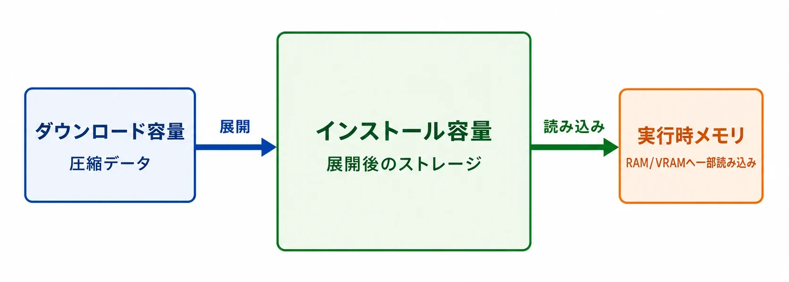
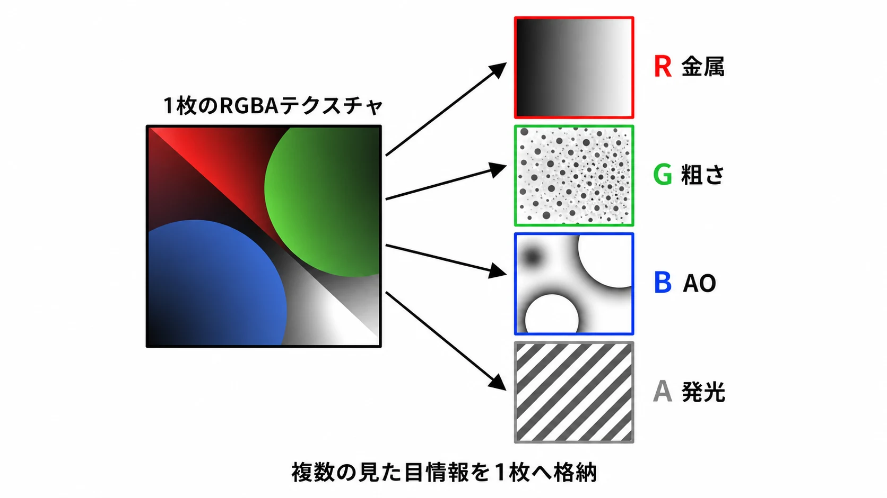
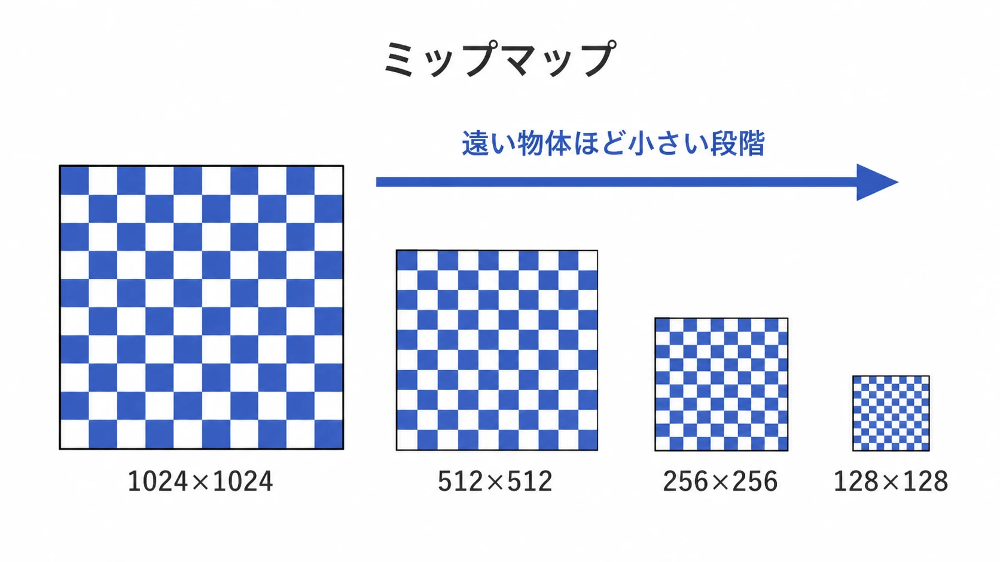
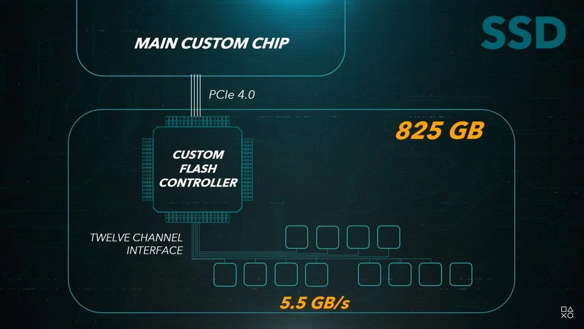
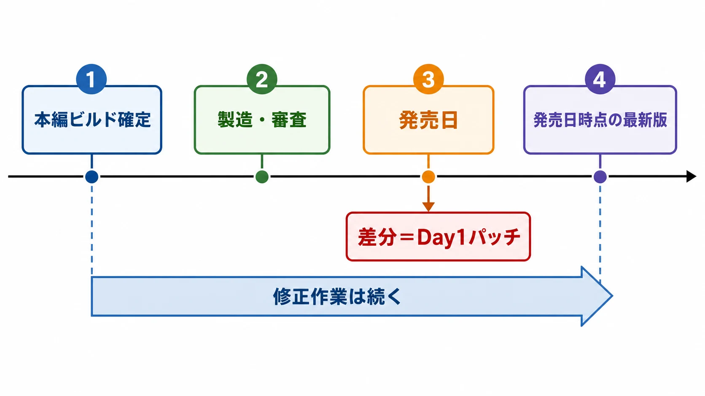
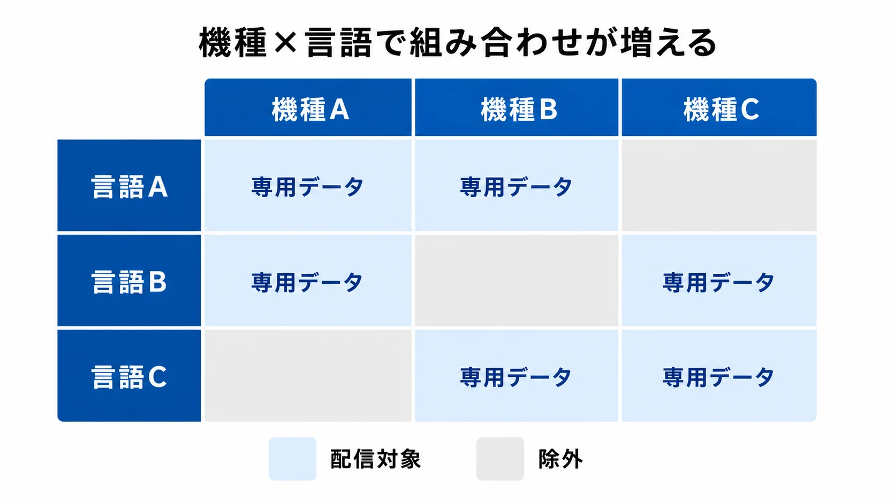

# なぜ最近のゲームは100GBを超えるのか――容量肥大化を支えるアセット、圧縮、差分パッチの実務

「最近のゲームは大きすぎる。開発者が圧縮を怠っているのではないか」。インストール前に必要容量を見れば、そう疑いたくなるのも無理はない。

しかし、ゲームの容量は「圧縮する／しない」の一項目では決まらない。画質と音質、ロード時間、実行中のCPU負荷、対応機種、配信費用、更新のしやすさが一つのパッケージで衝突する。容量を小さくするほど、別の場所で待ち時間や処理負荷が増えることもある。

だからといって、すべての大容量が必然というわけでもない。使われていない素材の混入、過剰な解像度、分割の悪いパック、全言語の一括配信は改善できる場合がある。最適化へ割ける人員と期間にも、プロジェクトごとの差が出る。

この記事では「大きいから怠慢」「圧縮済みだから最適」という二択を離れ、 **何を残し、どの負荷を誰に負担してもらうか** という実務の問題として容量を解きほぐす。

***

## まず区別したい三つの「大きさ」

容量の話では、次の数字が混同されやすい。

- **ダウンロード容量**：ネットワークから受け取るデータ量
- **インストール容量**：展開後にストレージを占める量
- **実行時のメモリ使用量**：遊んでいる最中にRAMやVRAMへ載る量

圧縮された配信データを端末で展開すれば、ダウンロード容量よりインストール容量が大きくなる。逆に、GPUが直接扱えるブロック圧縮テクスチャのように、圧縮された形のままストレージやVRAMへ置くデータもある。更新時には旧版と新版を一時的に並べて作業するため、最終的な増加量より多くの空き容量が必要になる場合もある。

プレイヤーが目にする一個の「必要容量」だけでは、どの段階が太っているのかは分からない。企画側も、まずこの三つを分けて会話する必要がある。

***

## 何が容量を占めているのか

作品によって内訳は大きく異なる。大量の会話を持つRPGと、短いステージを反復する対戦ゲームでは同じにならない。それでも、大規模な現代ゲームでは次の素材が主な候補になる。

| 要素 | 大きくなる理由 | 小さくすると起こり得ること |
|---|---|---|
| テクスチャ | 高解像度、用途別マップ、ミップマップ | 近景のぼけ、ちらつき、読み込み時の見た目の変化 |
| 3Dモデル・アニメーション | 高密度な形状、LOD、フェイシャル、物理用データ | 輪郭や動きの劣化、CPU・GPU側の別処理増加 |
| 音声・音楽 | 長時間ボイス、多言語、多チャンネル | 音質低下、デコード負荷、音切れの危険 |
| 動画 | 高解像度、高ビットレート、言語別映像 | 圧縮ノイズ、デコード負荷、機種互換性の問題 |
| シェーダー関連 | 描画条件ごとの組み合わせ、事前生成キャッシュ | 初回表示時のコンパイル停止やカクつき |
| パッチ・追加コンテンツ | 新旧データの共存、差分適用用ファイル | 更新処理の複雑化、ロールバック困難 |

ここで重要なのは、ゲームの「画像」が一枚の完成絵ではないことだ。

### テクスチャは一つの物体に何枚も使う

**テクスチャ** は、3Dモデルの表面へ貼る画像データである。壁一枚でも、色だけでなく、凹凸の向き、粗さ、金属らしさ、発光などを別の画像で表すことがある。Unreal Engineの公式資料も、単純なマテリアルでベースカラー、反射、法線など複数のテクスチャを使う例を示している。値を一枚の各色チャンネルへ詰めれば節約できるが、制作工程や画質との調整が必要になる。[[1](#ref-1)]

解像度も効く。縦横を2倍にした画像は画素数が4倍になる。さらにゲームでは、遠くの物体へ原寸画像を使わないよう、半分、4分の1、8分の1と縮小した画像をあらかじめ持つ。これが **ミップマップ** である。遠景のちらつきを抑え、VRAM帯域を節約し、必要な解像度だけを読み込むためのデータだ。複製に見えても、表示品質と速度のために役割が違う。[[2](#ref-2)]

「4K対応」は画面解像度だけを意味しない。カメラが物体へ近づいても耐える素材、精細なUI、広い視野でも崩れにくい背景が求められる。最高設定用の素材を標準素材と分けて配るか、一つの製品へ同梱するかでも容量は変わる。

### 音声は「強く圧縮すれば終わり」ではない

フルボイス作品では、台詞の長さに話者数と言語数が掛かる。音楽、環境音、効果音も加わる。立体音響用の素材や複数チャンネルを持てば、さらに増える。

音声には複数の置き方がある。Unityの公式資料では、非圧縮のPCMは容量が大きい代わりにCPUで扱いやすい。ADPCMはある程度小さくしながら処理を軽めにでき、VorbisやMP3はより小さくできる一方、再生時の展開処理が必要になると説明されている。[[3](#ref-3)]

**デコード** とは、圧縮された音声を再生可能なデータへ戻す処理である。短い効果音が同時に大量再生される場面では、一つ一つの節約よりデコードの集中が問題になることがある。逆に、長いBGMをすべて非圧縮でメモリへ置くのも現実的ではない。

そこで、短く頻繁な音は読み込み時に展開する、長い曲はストレージから少しずつ **ストリーミング再生** する、というように使い分ける。Unityにも、読み込み時展開、圧縮したままメモリ保持、ストリーミングという三つの読み込み方式がある。後二者には実行中のデコードが伴う。[[4](#ref-4)]

多言語ボイスを全部同梱すれば切り替えは簡単だが、遊ばない言語もストレージを占める。言語パックを分ければ小さくできる一方、設定変更時の追加ダウンロード、字幕と音声の組み合わせ、途中でパックが消えた場合の復旧まで設計しなければならない。

### 動画とシェーダーも「待たせない」ために場所を取る

プリレンダリングされたカットシーンは、再生時間、解像度、フレームレート、ビットレートに応じて大きくなる。高圧縮にすれば必ず得とは限らない。対応コーデックは機種やOSで異なり、ソフトウェアデコードへ落ちればCPUを使う。Unreal Engineのメディア資料も、互換性には標準的なH.264のMP4を推奨し、WindowsではGPUデコードとCPU処理の選択が再生性能へ影響すると説明している。[[5](#ref-5)]

**シェーダー** は、表面の色、影、透明、反射などをGPUでどう計算するか記した小さなプログラムである。素材、光源、描画方式、画質設定の組み合わせが増えると、必要な派生形も増える。実行中に初めてコンパイルするとカクつくため、使う組み合わせを事前に集めたキャッシュを製品へ同梱することがある。Unreal Engineでは、PSOという描画状態の組み合わせを事前生成し、実行時コンパイルによる停止を減らす仕組みが用意されている。[[6](#ref-6)]

キャッシュはテクスチャや音声ほど巨大とは限らない。それでも「コードは小さいはず」という直感だけでは見落とすデータである。

***

## なぜ「ただ圧縮すればいい」わけではないのか

圧縮には、少なくとも四つの評価軸がある。

| 判断軸 | 強い圧縮で得やすいもの | 失いやすいもの |
|---|---|---|
| 配信 | ダウンロード量の削減 | ビルド生成時間、差分効率 |
| ストレージ | インストール容量の削減 | ランダムアクセスのしやすさ |
| 実行性能 | 読み込むバイト数の削減 | CPU・GPUのデコード時間 |
| 品質 | 同じ容量へ多くの素材を収録 | 画像・音声の忠実度 |

素材を強く圧縮すれば、ストレージから読む量は減る。だが、使う前には戻さなければならない。展開が読み込みより遅ければ、ロード時間は短くならない。プレイ中のストリーミングでは、展開が締切に間に合わず、低解像度テクスチャが残ったり音が途切れたりする。

現行機には、この衝突を緩める専用機構もある。PlayStation 5では、SSDの生の読み込み速度だけでなく、I/O機構やソフトウェアスタックまで含めた設計が重視された。PlayStation 4とPlayStation 5でリードシステムアーキテクトを務めたマーク・サーニーは、WIREDのインタビューで、SSDの読み込み速度に加えてI/O機構とその上のソフトウェアスタックが重要だと説明している。[[7](#ref-7)] Digital Foundryの技術解説では、PS5のカスタムFlash Controller、12チャンネル接続、Kraken対応のハードウェア展開、DMAコントローラー、I/O用プロセッサ、CPUやGPUが見るメモリ内容の食い違いを抑えるコヒーレンシーエンジンが、SSDボトルネックとCPU側の展開負荷を減らす構成として整理されている。[[8](#ref-8)]

出典：[Inside PlayStation 5: the specs and the tech that deliver Sony's next-gen vision][8]（Digital Foundry）。画像の権利は引用元に帰属します。

つまり「圧縮率」だけでなく、対象機種に対応するデコーダーがあるか、並列に展開できるか、ゲーム本編と同時に動かして余裕があるかを見る必要がある。PCではCPU、GPU、ドライバー、ストレージの幅も広い。最上位機で速い方式が、最低動作環境でも安全とは限らない。

さらに、圧縮設定の変更は見た目だけでは終わらない。全素材を再変換し、実機でロード、メモリ、画質、音質を検証する。終盤ほど、変更によるリグレッション、つまり以前動いていた箇所の再発不具合が怖い。数GBを削る作業が技術的に可能でも、マスター提出前に再テストを終えられなければ採用できない。

圧縮は最後に押す魔法のボタンではない。素材分類、命名、変換設定、自動検査、対象機種別ビルドを早期から整えたチームほど、終盤に安全な選択肢を持てる。

***

## 「重複データ」には三種類ある

データを解析して似たファイルを見つけても、すぐに「消せるコピー」とは断定できない。少なくとも次を分けたい。

### 1. 内容が違う派生版

同じ台詞の各言語版、同じ画像の標準版と高解像度版、同じモデルの近景用と遠景用は、名前や役割が似ていても代替できない。GPUが扱えるテクスチャ形式も機種群で異なる。Unityはビルド先に応じてテクスチャを専用形式へ変換し、プラットフォーム別の上書き設定を提供している。[[9](#ref-9)]

マルチプラットフォーム製品では、開発リポジトリに複数の変換結果が存在しても、製品ビルドには対象機種分だけを入れるのが基本である。ただし、一つの配信物で幅広い端末へ対応する場合は、互換用の複数形式や代替データが必要になることもある。

### 2. 読み込み単位を独立させるためのコピー

ゲームは多数の素材を一個ずつ置くのではなく、ステージや機能ごとの **パックファイル** にまとめることが多い。細かな読み込み回数を減らし、配信や暗号化を管理しやすくするためだ。

ここで、複数のステージが同じ足音を使うとする。共通パックを必須にすればコピーは一つで済むが、依存関係が増える。各ステージのパックへ入れれば単独で読み込みやすいが、同じデータが増える。低速な媒体では、必要な位置の近くへ同じ素材を置き、シーク時間を減らす判断もあり得た。高速SSDではこの必要性が下がる場面があるが、パックの独立性や更新単位という別の理由は残る。

### 3. 本当に不要な重複

試作素材の混入、参照切れ、古い動画、設定ミスで全言語を収録、同一データの二重エクスポートは、削減対象になり得る。問題は、見つけるだけでは足りないことだ。削除後に全ルート、全言語、セーブ引き継ぎ、追加コンテンツまで壊れないと確認しなければならない。

したがって実務では、重複件数より次を問う。

- 同じバイト列なのか、用途に応じた派生版なのか
- 共通化するとロードと依存関係はどう変わるか
- パッチ時にどの単位が更新されるか
- 削除を保証する自動参照解析と実機QAがあるか

「重複は全部無駄」も「高速化のため全部必要」も正しくない。 **重複を残す理由が測定され、文書化されているか** が判断軸になる。

***

## 差分パッチなのに、なぜ更新が大きくなるのか

**フルダウンロード** は新しい製品一式を受け取る方式である。 **差分パッチ** は、旧版から変わった部分を受け取り、新版を組み立てる方式だ。後者なら常に小さいように思えるが、実際の効率はファイルの作り方に左右される。

SteamPipeはファイルをおおむね小さなチャンクへ分け、旧ビルドと一致する部分を再利用する。しかしValveの公式資料は、パック内で素材の並びが変わる、目次の絶対位置が連鎖的に変わる、複数素材をまたいで圧縮する、といった構造では、小さな素材変更が大きなダウンロードへ波及し得ると説明している。さらに更新時は新しいパックを旧パックの隣で組み立てるため、大きなローカルコピーと一時空き容量が必要になる。[[10](#ref-10)]

これは次の三つが別物だから起こる。

- **変更内容の大きさ**：修正した画像やコードそのもの
- **ダウンロード量**：配信システムが再利用できなかったチャンク
- **更新時の書き換え量**：端末内で新版を組み立てるために読む・書く量

エンジン側の差分単位も影響する。Unreal Engineの一般的なパッチ生成では、最小単位はパッケージであり、中身が一部変わるとそのパッケージ全体がパッチ対象になる。[[11](#ref-11)] 小分けにすれば差分は狭くなるが、ファイル数、管理情報、読み込み要求、テスト組み合わせが増える。大きくまとめれば実行時は扱いやすくても、更新が太りやすい。

### Day1パッチが生まれる構造

発売日に配られる更新を **Day1パッチ** と呼ぶ。物理メディアの製造、ストア審査、事前ダウンロードには、発売日より前の提出期限がある。その本編ビルドを固定した後も、チームは不具合修正や性能調整を続けられる。結果として、固定版と発売日時点の最新版の差がパッチになる。

これは必ずしも「未完成品を出してよい」という意味ではない。危険な修正を提出版へ直前に混ぜず、別更新として検証する方が安全な場合もある。一方で、オフライン時の品質、追加ダウンロード、パッチ自身のQA、旧版とのセーブ互換という負債がある。

プランナーが見るべきなのはパッチの有無ではない。提出版だけで商品として成立するか、発売日までにどの修正を安全に検証できるか、更新失敗時に復旧できるかである。

***

## マルチプラットフォームと多言語は、容量を「掛け算」にする

複数機種へ出すと、実行ファイルだけでなく、テクスチャ形式、動画コーデック、シェーダー、操作表示、画質設定、メモリ予算が変わる。通常は機種別ビルドへ不要物を入れない。しかし共通制作環境には各機種の変換済みデータが必要で、ビルドとQAの時間は増える。

多言語も、テキストだけなら比較的小さい。容量へ強く効くのはボイスと、文字を焼き込んだ動画である。一方、配信単位を分ければ必ず解決するわけではない。Steamでは言語別デポを設定し、その言語の利用者だけへ届けられる。公式資料も、言語固有データが大きい場合は別デポを推奨している。[[12](#ref-12)] ただし、ゲーム内の言語設定とストア側の選択が食い違う場合、追加取得の導線が必要になる。

### 「遊べるところだけ先に」は設計変更である

最初の章だけ入れて起動可能にし、残りをバックグラウンドで取得する方式もある。AndroidのPlay Asset Deliveryには、インストール時、直後、必要時という配信方式があり、端末に適したテクスチャ形式だけを届ける仕組みもある。[[13](#ref-13)]

ただし、分割対象を決めるだけでは動かない。

- 最初の区画が、未取得素材を参照しないよう依存関係を切る
- ダウンロード速度が遅いときの待機場所を用意する
- ムービーやボイスの取得失敗から再開する
- マルチプレイで参加者の導入済み範囲をそろえる
- パッチでチャンク構成が変わったときに移行する

自由に戻れるオープンワールドや、どのモードからでも始められる対戦ゲームほど分割は難しい。初回容量を減らす代わりに、仕様、UI、サーバー、QAの仕事が増える。ストリーミング配信は容量を消すのではなく、 **容量を受け取る時刻をずらす設計** である。

***

## プレイヤー側と開発側にできること

プレイヤー側の選択肢は、製品とプラットフォームが対応している場合に限られる。それでも次は確認する価値がある。

- 使わない音声言語を外せるか
- 高解像度テクスチャパックが任意導入か
- キャンペーン、マルチプレイなどを個別管理できるか
- 更新時に最終容量だけでなく一時空き容量を確保したか
- 遊ばないゲームを外部ストレージへ退避できるか

開発側では、後から手作業で削るより、制作工程へ予算を組み込む方が効く。

1. **容量予算を機能へ割り当てる**
   
   「全体で収める」だけでなく、テクスチャ、音声、動画、各言語、各ステージへ上限と責任者を置く。

2. **ビルドごとの差分を可視化する**
   
   何が何GB増えたかではなく、どの素材群、設定変更、パック再配置が増加を生んだかを追う。

3. **用途別に圧縮と読み込み方式を決める**
   
   すべての音、画像、動画へ同じ設定をかけない。同時再生数、視認距離、再生機種、ロードの締切で分類する。

4. **配信単位を早く設計する**
   
   言語、画質、モード、章を任意導入にするなら、参照関係とUIも初期設計から分ける。

5. **削減量だけでなく副作用を測る**
   
   インストール容量、初回取得量、パッチ量、ロード時間、フレーム時間、メモリ、ビルド時間を同時に比較する。

実例として、『FINAL FANTASY VII REBIRTH』の開発陣はPlayStation公式インタビューで、ワールドマップを含めてもディスク容量を150GB以内に収めることをパッケージ版の絶対要件として開発初期から設定し、前作『FINAL FANTASY VII REMAKE INTERGRADE』のディスク容量（約80GB）で得たOodle KrakenとOodle Textureの実運用経験を、本作の容量計画に生かしたと説明している。これは、圧縮技術そのものだけでなく、 **早期に容量を制約として扱うこと** が重要だと分かる一次情報である。ただし、この数値はパッケージ版のディスク容量要件であり、ダウンロード版の配信容量、地域・言語構成、発売後の更新による変動とは別軸で見る必要がある。[[14](#ref-14)]

ただし、専任のビルド担当、素材監査ツール、全機種の性能試験を持てる大規模チームと、小規模チームでは選択肢が違う。削減で得られるプレイヤー数や配信費用より、導入と検証のコストが大きいこともある。逆に、ライブサービスのように更新を何年も重ねる作品では、早期投資が毎回のパッチへ効く。

正解は一つではない。判断材料は、対象プレイヤーの回線とストレージ、更新頻度、最低動作環境、同時再生負荷、配信先の仕組み、そして検証へ使える人日である。

***

## まとめ：容量は、体験と運用の請求書である

ゲームが大きくなる主因は、単に「グラフィックがきれいになったから」ではない。高解像度テクスチャとその用途別画像、多言語ボイス、動画、モデル、アニメーション、シェーダー関連データが積み重なる。さらに、ロードを止めない配置、機種別形式、独立した配信単位、差分パッチの都合が加わる。

圧縮は有効だが、圧縮率、画質、デコード負荷、ロード時間、対応機種、差分効率の交換になる。重複も、派生版、独立読み込み用、本当の不要物を分けなければ評価できない。差分パッチも、修正した内容と同じ大きさになるとは限らない。

したがって、100GBを超えたという数字だけで怠慢とは判断できない。同時に「現代ゲームだから仕方ない」で監査を止めるべきでもない。容量予算、任意パック、素材再利用、パック分割、自動監査、圧縮基盤へどこまで投資したかは、プロジェクトごとに違う。

新人プランナーが持つべき問いは「もっと圧縮できないか」だけではない。 **何を削ると、どのプレイヤー体験、どの実行負荷、どの開発工程へ請求が移るのか** である。その移り先まで見て、初めて容量を設計できる。

## References

1. [Textures in Unreal Engine][1] - 一つのマテリアルが色、反射、法線など複数のテクスチャを利用し、チャンネルへの値の集約が容量削減にもなることを説明するEpic Games公式資料。

2. [Texture Streaming Overview for Unreal Engine][2] - ミップマップを事前生成された解像度列として扱い、視点とメモリ予算に応じて読み書きする仕組みを説明するEpic Games公式資料。

3. [Audio file compression in Unity][3] - PCM、ADPCM、Vorbis／MP3の容量、音質、CPU負荷の性質を比較するUnity公式資料。

4. [AudioClipLoadType][4] - 音声の読み込み時展開、圧縮メモリ保持、ストリーミングという方式と実行時挙動を説明するUnity公式資料。

5. [Media Framework Technical Reference][5] - 動画コーデックの互換性、H.264 MP4の推奨、CPU／GPUデコードの設定を説明するEpic Games公式資料。

6. [PSO Precaching for Unreal Engine][6] - 描画用PSOの事前収集と非同期コンパイルにより、実行時コンパイルのカクつきを抑える仕組みを説明するEpic Games公式資料。

7. [Exclusive: What to Expect From Sony's Next-Gen PlayStation][7] - マーク・サーニーが、SSDの生の読み込み速度だけでなくI/O機構とソフトウェアスタックが重要だと説明するWIREDのインタビュー。

8. [Inside PlayStation 5: the specs and the tech that deliver Sony's next-gen vision][8] - PS5のカスタムFlash Controller、12チャンネルSSD接続、Kraken対応ハードウェア展開、DMAコントローラー、I/O用プロセッサを説明するDigital Foundryの技術解説。

9. [推奨、デフォルト、およびサポートされているテクスチャ形式（プラットフォーム別）][9] - 実行機種ごとに対応するテクスチャ圧縮形式が異なり、ビルド先別の変換・上書きが必要になることを説明するUnity公式資料。

10. [Uploading to Steam][10] - SteamPipeのチャンク差分、パック内配置、圧縮境界、更新時のローカルコピーがパッチ量と更新時間へ与える影響を説明するValve公式資料。

11. [How to Create a Patch in Unreal Engine][11] - Unreal Engineの一般的なパッチ生成では、変更判定の最小単位がパッケージであることを説明するEpic Games公式資料。

12. [Localization and Languages][12] - 大きな言語固有データを言語別デポへ分け、利用言語に応じて配信する方法を説明するValve公式資料。

13. [Reduce game size][13] - Play Asset Deliveryによるインストール時、直後、必要時の分割配信と、端末別テクスチャ形式の配信を説明するAndroid Developers公式資料。

14. [How Final Fantasy VII Rebirth harnesses immersive PS5 technology][14] - 開発初期からディスク容量を150GB以内に収めることを要件化し、前作（約80GB）でのOodle系圧縮技術の経験を容量計画へ生かしたと開発者が説明するPlayStation公式インタビュー。

[1]: https://dev.epicgames.com/documentation/unreal-engine/textures-in-unreal-engine
[2]: https://dev.epicgames.com/documentation/en-us/unreal-engine/texture-streaming-overview-for-unreal-engine
[3]: https://docs.unity3d.com/ja/current/Manual/AudioFiles-compression.html
[4]: https://docs.unity3d.com/ja/2021.3/ScriptReference/AudioClipLoadType.html
[5]: https://dev.epicgames.com/documentation/en-us/unreal-engine/media-framework-technical-reference-for-unreal-engine
[6]: https://dev.epicgames.com/documentation/unreal-engine/pso-precaching-for-unreal-engine
[7]: https://www.wired.com/story/exclusive-sony-next-gen-console/
[8]: https://www.digitalfoundry.net/articles/digitalfoundry-2020-playstation-5-specs-and-tech-that-deliver-sonys-next-gen-vision
[9]: https://docs.unity3d.com/ja/2022.2/Manual/class-TextureImporterOverride.html
[10]: https://partner.steamgames.com/doc/sdk/uploading
[11]: https://dev.epicgames.com/documentation/en-us/unreal-engine/how-to-create-a-patch-in-unreal-engine
[12]: https://partner.steamgames.com/doc/store/localization
[13]: https://developer.android.com/games/optimize/game-size
[14]: https://blog.playstation.com/2024/02/21/how-final-fantasy-vii-rebirth-harnesses-immersive-ps5-technology/

----

この文書は、Perplexity、Claude、OpenAI Codex の3つのAIの支援を受けて著述されたものです。引用画像を除き、MIT License にて提供されています。
