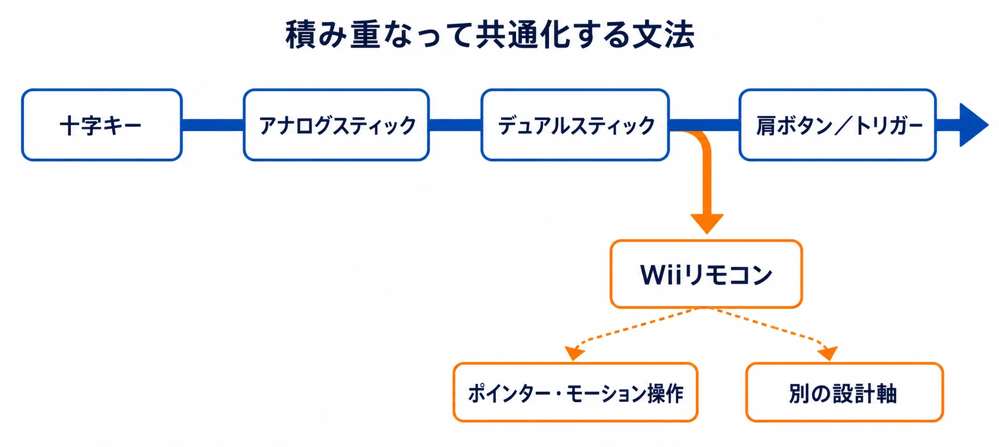
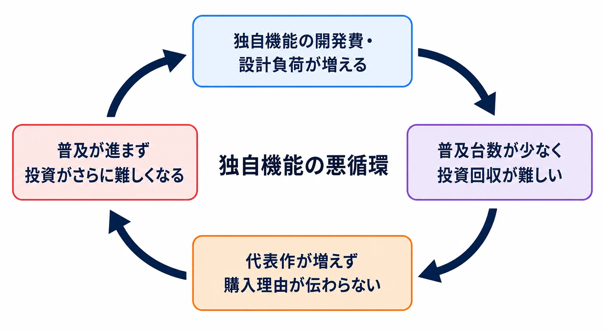
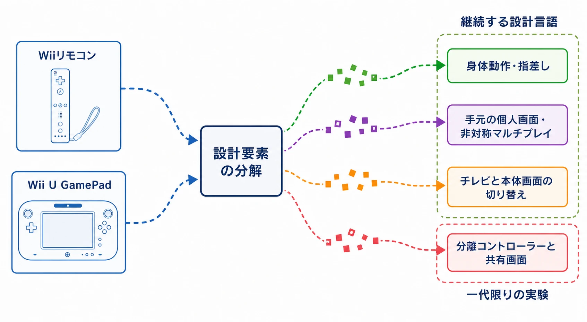

# WiiとWii Uはなぜゲームデザイン史の中心から外れやすいのか
## 売上ではなく、継承される設計言語から考える

Wiiは大成功した。任天堂の公式な累計販売数量では、Wiiは1億163万台に達している。Wii Uは1,356万台であり、Wiiの約13.3％にとどまった。数字だけを見れば、前者は成功例、後者は失敗例である。[[1](#ref-1)]

しかし、ゲームデザイン史の語り方は、販売台数の大きさと一致しない。歴史の中心に残りやすいのは、後継機で標準化された入力方式、複数のメーカーが採用した画面構成、後続タイトルが繰り返し参照した設計原則である。逆に、一世代だけ強く現れ、次世代で形を変えたり消えたりしたものは、商業的に大きな成果を上げても「一時代の現象」として整理されやすい。

WiiとWii Uは、このずれを考えるための好例である。Wiiはゲーム人口を広げるほど強い入口をつくったが、Wiiリモコンの操作体系は、従来型コントローラーを置き換える標準にはならなかった。Wii Uは、テレビと手元の画面を組み合わせる設計を先取りしていたが、その構想は一台の専用機に閉じたまま広がりにくかった。

本稿では、WiiリモコンやWii U GamePadの開発秘話を再構成するのではなく、それらが後続の設計史でどのように扱われたかを考える。結論を先に言えば、WiiとWii Uが語られにくいのは、設計上の空白だったからではない。継続する設計言語の本流から分岐し、別の製品形態や別のデバイスへ断片的に遺産を渡したからである。

***

## 1. まず商業的な対照を確認する

任天堂の公式データを並べると、両機の対照は明快である。

| ハード | 任天堂公式の累計販売数量 | Wiiを基準にした規模 |
|---|---:|---:|
| Wii | 1億163万台 | 100％ |
| Wii U | 1,356万台 | 約13.3％ |

ここでいう数量は、任天堂がIRで掲載している全世界の連結累計販売数量（セルイン）である。Wiiは任天堂の据置機として長く最高記録を保持したが、その後Nintendo Switchに抜かれている。[[1](#ref-1)] なお、Switchファミリー全体の世界累計セルスルー（小売店等での販売数）は、2021年12月末時点ですでに1億台を超えていたと任天堂は決算資料で示しており、据置機として異例の速さで普及が進んだことがうかがえる。[[2](#ref-2)]

Wii Uの販売台数をWiiの失敗として扱うのは簡単である。だが、その見方だけでは、Wii U GamePadが何を試みたのかが見えなくなる。販売規模は、その設計が成立したかどうかを測る重要な指標である一方、設計アイデアが後世にどのような形で残ったかを直接測る指標ではない。

ゲームデザイン史で重要なのは、成功したハードに搭載されたすべての機能が標準化するわけではないという点である。Wiiの大ヒットはWiiリモコンの存在を広く知らしめたが、同時に「モーション操作を中心にゲームをつくる」ことを、各ジャンルが長期的に共有する文法へ変えたわけではなかった。

***

## 2. コントローラーの本流は「操作の追加」ではなく「再利用できる文法」である

家庭用ゲーム機のコントローラーは、単純な一直線の進化ではない。十字キー、アナログスティック、二本のアナログスティック、肩ボタンやトリガーは、互いを完全に置き換えるのではなく、複数のジャンルを同じ入力装置で扱うために積み重なってきた。

十字キーは、左右や上下を低コストかつ明確に入力する。アナログスティックは、移動量や方向の連続値を扱う。デュアルスティックは、キャラクターの移動とカメラ、あるいは移動と照準を分離する。肩ボタンとトリガーは、親指をスティックから離さずに補助操作を呼び出す。任天堂のゲームキューブ用コントローラーも、二つのグリップ、アナログスティック、左右のアナログトリガーを組み合わせ、左手と右手の操作系を整理する設計を説明している。[[3](#ref-3)]

PlayStationの公式史も、アナログスティックの導入が3D空間での移動量を増やし、その後デュアルアナログスティックへつながった経緯を説明している。[[4](#ref-4)] 重要なのは、これらが「新しい操作があるから面白い」という一回限りの驚きではなく、アクション、レース、シューティング、アドベンチャーなどをまたいで使えることだった。

この本流を、設計言語として整理すると次のようになる。

- プレイヤーが別のゲームへ移っても再利用できる
- 座って長時間操作しても疲れにくい
- 画面上の行動と入力の対応を説明しやすい
- 既存タイトルを移植しやすい
- 開発者が共通の前提を持って企画を始められる

Wiiリモコンは、この文法に別の軸を持ち込んだ。任天堂の公式説明では、片手で画面を指す、振る、ひねるといった操作を、年齢やゲーム経験を問わず扱える入力として示している。[[5](#ref-5)] これは従来のボタンを増やしたのではなく、プレイヤーの身体動作や視線とゲーム内の行動を近づける設計である。

*図：共通化しやすい入力文法の蓄積と、Wiiリモコンが強化した別の設計軸。*

したがってWiiリモコンは、コントローラーの本流を次の段階へ更新したというより、別の設計軸を強くしたと見るほうが正確である。ポインター、姿勢、振る動作は、スポーツ、パーティー、照準、簡単なメニュー操作では大きな意味を持つ。しかし、すべてのゲームで必要とは限らない。動作の検出精度、プレイヤーごとの振り方の差、長時間操作時の疲労、遊ぶ場所の広さ、カメラから見た身体の向きなど、従来型入力にはなかった設計条件も増えるからである。

***

## 3. Wiiは「新しい入口」を成功させたが、入力の標準を置き換えたわけではない

Wiiの設計上の強みは、モーション操作をゲーム全体の共通文法にしたことではなく、ゲームに触れる最初の一歩を作り替えたことにある。Wiiリモコンは、複雑なボタン配置を覚えなくても、画面を指す、振る、傾けるという行為から遊び始められる。入力の意味が身体感覚に近いため、ゲーム経験の浅い人をプレイの輪へ招き入れやすい。

この入口の強さは、ゲームを深く遊ぶための操作体系と別の価値である。ゲーム経験者が長時間遊ぶときに求めるのは、入力の再現性、細かな段階制御、持ち替えの少なさ、複数の操作を同時に呼び出せることだ。Wiiリモコンはそれらを否定したのではなく、別の優先順位を選んだ。

そのためWiiの成功は、二つの意味で語られるべきである。一つは、従来のゲーム機に触れていなかった人にも操作の意味を伝えたこと。もう一つは、モーション操作だけでは、既存ジャンルを横断する標準入力にはなりにくいことを示したことである。

後継機のWii Uは、この限界をある程度理解した構成になった。Wii U GamePadには、二本のスティック、十字キー、複数のボタン、タッチスクリーン、モーションセンサーが同居している。つまり、Wii UはWiiリモコンの身体性を単純に拡大せず、従来型コントローラーを土台に別の画面を加えたのである。

ここから見えてくるのは、Wiiリモコンが失敗したから捨てられたという説明ではない。Wiiリモコンの強みは、Wiiのような入口、特定のミニゲーム、照準、身体動作を活かすタイトルに残った。一方、プラットフォーム全体の互換性とジャンル横断性を担う入力には、十字キー、スティック、ボタン、肩ボタンが戻ってきたのである。

***

## 4. Wii U GamePadは「二画面」ではなく、役割を分けるための設計だった

Wii U GamePadの構想は、単にテレビ画面を小さくした携帯機ではない。任天堂の公式説明は、テレビ画面とGamePadの画面を組み合わせ、それぞれを見ながら操作したり、GamePadだけでプレイしたりできる仕組みとして紹介している。[[6](#ref-6)]

この構成には、少なくとも三つの異なる価値があった。

第一はオフTVプレイである。テレビを家族の誰かが使っていても、対応ソフトならGamePad側で続きを遊べる。任天堂自身も、Wii U GamePadの出発点を「テレビに縛られず、家の中の別の場所で豊かなゲーム体験を提供すること」と説明している。[[7](#ref-7)]

第二は、情報を画面ごとに分けることである。テレビには共有される世界を映し、GamePadには地図、インベントリ、照準、建築画面、個人だけが見る情報を置く。これにより、プレイヤーが情報を確認するためにゲームを止める回数を減らせる。

第三は、プレイヤーごとに異なる役割を持たせる非対称マルチプレイである。任天堂の『Nintendo Land』開発者インタビューでは、GamePadを持つ一人だけが別の役を担当する構造が、早い段階から試作で発見されていたと語られている。[[8](#ref-8)] テレビを共有する複数人と、手元の画面を持つ一人の情報差を、競争や協力のルールに変えられる設計である。

これは現在の視点から見るとかなり先進的である。非対称マルチプレイでは、全員が同じ画面を見て同じ情報を共有する必要がない。情報の非対称性を意図的に設計し、会話、推測、役割分担をゲームのルールにできるからである。ゲームプランナーにとっては、画面を増やすことではなく、「誰に何を見せないか」を設計変数にした点が重要である。

ただし、先進的であることと、プラットフォームの標準になることは別である。GamePadを使うゲームは、テレビ側と手元側の画面を同期させ、入力の役割を分け、片方のプレイヤーが待っている時間まで設計しなければならない。任天堂の公式インタビューでも、二つの画面を使う環境を常時保証することの価値と、GamePadを活かした一人用体験の弱さが同時に語られている。[[9](#ref-9)]

***

## 5. GamePadが本質的に使われにくかった理由

Wii Uのサードパーティーソフトでは、GamePadが地図、インベントリ、スキャン、メニュー、テレビ画面の代替として使われる例があった。一方で、GamePadを持つプレイヤーとテレビを見るプレイヤーが異なるルールで遊ぶ、という本質的な使い方は広く定着しなかった。

これは、サードパーティーがアイデアを理解できなかったという単純な話ではない。移植作はすでに別のハード向けに成立しているルールを持っているため、GamePad専用の役割を追加すると、UIだけでなくゲームバランス、チュートリアル、テスト項目、対戦時の情報管理まで増える。Game Developerが発売期の開発者へ行った取材でも、非対称な二つの体験を成立させること、片方が待っている時間も興味を保つことが設計課題として語られている。[[10](#ref-10)]

さらに、Wii Uの市場規模が小さいほど、GamePad専用の設計へ投資する回収可能性は下がる。任天堂自身も、Wii Uではソフトメーカーによって支援意欲に差があり、任天堂の得意な子ども・ファミリー層と親和性の高いコンテンツ以外では投資回収が難しい状況を説明している。[[9](#ref-9)]

ここには、ハード独自機能の典型的な循環がある。

1. 独自機能を使うソフトは開発費と設計負荷が増える。
2. しかし、普及台数が少ない段階では、その投資を回収しにくい。
3. 独自機能を使う代表作が増えないため、購入理由が伝わりにくい。
4. 普及が進まず、ますます独自機能への投資が難しくなる。

*図：独自機能の開発負荷、普及規模、代表作、購入理由が相互に影響する悪循環。*

Wii U GamePadは、この循環を任天堂の自社ソフトだけで突破する必要があった。『Nintendo Land』は非対称マルチプレイの価値を示したが、任天堂自身が「非対称ゲームプレイ」という言葉は伝わりにくかったと振り返っている。[[11](#ref-11)] コンセプトの先進性が、購入前に一文で理解される価値へ変換されなかったのである。

***

## 6. Wii Uの商業不振が、構想の評価を覆い隠す

Wii Uの不振には、複数の要因が重なっていた。Wiiという名前を含むため新しい据置機だと認識されにくかったこと、GamePadを中心に説明するほど本体の役割が見えにくくなったこと、WiiとWii Uの違いを短時間で伝えにくかったこと、サードパーティーの支持が薄かったことなどである。

Nintendo of America（NOA）のセールス・マーケティング担当副社長も、Wii UはWiiより説明が複雑で、二画面コントローラーはモーション操作のように一目で理解されにくいと説明している。[[12](#ref-12)] 任天堂のIRでも、Wii Uの魅力を十分に広げられなかったこと、ハードの魅力が自然には伝わりにくかったことが認められている。[[9](#ref-9)]

この問題は、ハードの構想とマーケティングの問題を切り離しにくくする。Wiiリモコンなら、画面の前で振るだけでデモの意味が伝わる。Wii U GamePadの場合は、テレビ側の画面、手元側の画面、二人以上の役割、対応ソフト、テレビが空いていないときの価値を順に説明しなければならない。短い広告では、最も目立つ「大きなコントローラー」が残り、そのコントローラーが何を可能にするのかが抜け落ちやすい。

結果として、Wii Uの市場評価は「Wiiの次なのに売れなかった」という文脈に回収されやすくなった。『Nintendo Land』や『ZombiU』のようにGamePadをゲームルールへ組み込んだタイトルを個別に評価することはできても、プラットフォーム全体の設計言語として評価するには、商業的な失敗が大きすぎたのである。

ここでセガのコンソール史との対比が役立つ。セガのハード史は、商業的失敗が「組織の断絶」「拡張戦略の迷走」「市場との不一致」といった教訓へ整理されやすい。失敗した理由を言語化しやすいからである。[[13](#ref-13)] 一方、Wii Uの設計は、失敗の原因を語るだけでは十分に説明できない。なぜなら、問題になったGamePadの構想の一部は、後のハードや別デバイスで姿を変えて残っているからである。

***

## 7. 「継続する設計言語」と「一代限りの実験」

ゲームデザイン史で語られやすい設計には、次のような特徴がある。

| 語られやすい設計 | 語られにくい設計 |
|---|---|
| 後継機で同じ原則が改善される | 一世代だけで大きく形が変わる |
| 複数メーカー・複数ジャンルが採用する | 自社の少数タイトルに閉じる |
| 開発者が再利用できる共通語彙になる | 専用の設計・テスト負荷が高い |
| 失敗しても次の製品で名前や形が残る | 機能だけが別の形に分解される |

十字キーからスティック、デュアルスティック、肩ボタンへ続く入力の蓄積は、すべてのゲームが同じ使い方をするという意味ではない。共通の入力装置を使い、異なるゲームが異なる意味を割り当てられるという意味で、再利用できる文法である。

これに対してWiiリモコンの身体操作は、強い体験を生むが、ゲームのジャンルやプレイ環境に依存しやすい。Wii U GamePadの非対称マルチプレイも、強い体験を生むが、二つの画面と役割の設計をタイトルごとに解かなければならない。両者は「面白い機能」ではあっても、すぐに「業界の標準文法」にはならない。

この差が、WiiとWii Uの語られ方を決める。Wiiは売れすぎたため、モーション操作を中心にしたゲームデザインの歴史としてではなく、ゲーム人口拡大の成功物語として語られやすい。Wii Uは売れなかったため、GamePadの可能性を検討する設計史としてではなく、名前と広告とソフト不足の失敗物語として語られやすい。

どちらも、設計の本質が別の語りへ押し流されている。Wiiは商業的成功に、Wii Uは商業的失敗に吸収されているのである。

***

## 8. Switch以降に残ったのは「Wii Uそのもの」ではなく、設計要素の分解である

Nintendo Switchは、Wii U GamePadをそのまま継承しなかった。テレビと手元の画面を同時に使う専用機ではなく、本体そのものが画面になり、ドックに置けばテレビへ接続される。任天堂は発表時に、ドックから本体を外すだけでゲーム画面がテレビから本体画面へ切り替わる構造を示した。[[14](#ref-14)]

これはオフTVプレイの継承である。ただし、Wii Uのようにテレビと手元の画面を同時に役割分担するのではなく、同じゲーム画面を場所に応じて切り替える方式になった。二画面を使う先進性は、二画面の同時設計という形ではなく、「テレビを占有しなくても据置機品質のゲームを続けられる」という利用場面へ圧縮されたのである。

非対称マルチプレイの遺産も、そのままではなく分解されている。Switchは本体画面をテーブルに置き、Joy-Conを分けて一つの画面を共有できる。これは一人だけが秘密の画面を持つ非対称性とは異なるが、ゲーム機をリビングのテレビから切り離し、複数人の距離や姿勢を変えるという方向性は近い。

Wii U GamePadの「もう一つのデバイスに役割を持たせる」発想は、スマートフォン連携にも移った。Nintendo Switchの公式案内には、スマートフォン向け専用アプリをフレンドとの待ち合わせやボイスチャットに使う構成が示されている。[[15](#ref-15)] GamePadのようにゲーム画面を分担するのではなく、連絡、集合、会話といった周辺機能を別デバイスへ移した形である。

一方、Wiiリモコンの遺産はJoy-Conの分離、片手持ち、ジャイロや加速度センサー、特定タイトルの体感操作に残った。しかし、Switchの中心はモーション操作だけではない。テレビ、テーブル、携帯の三つのプレイモード、従来型に近いボタンとスティック、左右のコントローラーを一人用または二人用に切り替える構成が同時に用意されている。[[15](#ref-15)]

任天堂自身も、2023年の決算説明会で、『ゼルダの伝説 ティアーズ オブ ザ キングダム』がモーションセンサーで剣を振るようなハード固有の操作を使わず、Switchコントローラーの特性を活かして多様な動きを扱っていると説明した。[[16](#ref-16)] これはモーション機能の否定ではない。モーションを必須の主操作から、必要なタイトルが選んで使える能力へ戻したと読むべきである。

ここから導けるのは、Wii UがSwitchに直接つながったという単純な系譜ではない。Wii Uで一つの筐体に集中していた設計要素が、Switchでは次のように分解されたのである。

- オフTVプレイは、テレビと本体画面を切り替えるハイブリッドへ移った
- 手元の個人画面は、必須機能ではなく、携帯画面やスマートフォン連携へ分散した
- 非対称性は、秘密の二画面よりも、分離コントローラー、共有画面、ローカル通信へ移った
- モーション操作は、全タイトルの前提ではなく、Joy-Conの追加能力になった

*図：Wii U GamePadの設計要素が、Nintendo Switchでは複数の機能へ分解されて残った構造。*

***

## おわりに：語られなさは、設計史の空白ではない

Wiiは、十字キーやデュアルスティックの本流を置き換えなかった。それでも、ゲームを始める入口を変え、身体動作やポインティングを家庭用ゲーム機の重要な選択肢にした。Wii Uは、テレビと手元の画面、公開情報と個人情報、同じルールと異なる役割を一つのシステムにまとめようとした。販売台数はWiiに遠く及ばなかったが、GamePadの構想は、オフTVプレイ、二画面の情報設計、非対称マルチプレイという設計課題を明確にした。

ただし、設計史の本流として残るには、アイデアが後継機で同じ名前を保つだけでは足りない。複数のジャンルが使えること、サードパーティーが投資を回収できること、プレイヤーが購入前に価値を理解できること、開発者が既存の知識を再利用できることが必要である。WiiリモコンとWii U GamePadは、これらの条件をすべて満たす標準にはならなかった。

だからといって、二機種を一代限りの実験として片づけるのも正しくない。Wiiの身体性はJoy-Conの一機能になり、Wii UのオフTVプレイはSwitchの中心的な利用形態になった。GamePadの個人画面と非対称性は、別画面、スマートフォン、共有画面、分離入力へと分かれて残った。

ゲームデザイン史で重要なのは、何がそのまま残ったかだけではない。どのアイデアが、後継機の標準になれず、どの単位に分解され、どの場所へ移ったかを見ることである。WiiとWii Uは、成功した本流と失敗した本流の間にあるのではない。設計言語が別の形へ分岐する地点にある。

語られなさは、設計史の空白ではない。それは系譜の分岐点である。

## References

1. [ゲーム専用機販売実績][1] - WiiとWii Uを含む任天堂ハードの全世界累計販売数量（セルイン）。

2. [2022年3月期第3四半期 決算説明資料][2] - Nintendo Switchファミリー全体の世界累計セルスルー（小売販売数）が2021年12月末時点で1億台を超えたとする決算説明資料。

3. [ニンテンドー ゲームキューブ｜コントローラ][3] - 二つのグリップ、アナログスティック、アナログトリガーを含むコントローラー設計の公式説明。

4. [PlayStationの歴史年表（日本）][4] - アナログコントローラー、デュアルアナログスティック、DUALSHOCKの公式沿革。

5. [Wiiリモコン][5] - ポインター、モーションセンサー、振る・ひねる操作を含むWiiリモコンの公式説明。

6. [Wii U｜任天堂][6] - テレビ画面とWii U GamePadの画面を組み合わせる操作、GamePadだけでのプレイの公式説明。

7. [社長が訊く『Wii U』 Wii U GamePad篇（5. テレビがもっと魅力的に）][7] - 「ほかの人がテレビを使っていても遊べる」「テレビとWii U GamePadをセットで使うと、テレビがもっと魅力的になる」という、GamePadの狙いに関する岩田聡の総括を含む公式インタビュー。

8. [社長が訊く『Wii U』 Nintendo Land篇][8] - Wii U GamePadを使った非対称の多人数ゲームと試作の経緯に関する公式インタビュー。

9. [2014年1月30日 経営方針説明会／第3四半期決算説明会 質疑応答][9] - Wii U GamePadの構想、タイトル不足、ソフトメーカーによる支援意欲の差、Wii Uの魅力を広げ切れなかったことに関する任天堂の説明。

10. [Third Party Developers Take on the Wii U][10] - Wii U GamePadを使った非対称設計と二画面の開発課題に関する発売期の開発者取材。

11. [2013年1月31日 経営方針説明会／第3四半期決算説明会 質疑応答][11] - 「非対称ゲームプレイ」という呼び名の伝わりにくさに関する任天堂の説明。

12. [Wii U message confusing – Nintendo][12] - Wii Uの説明の複雑さ、モーション操作との対比、GamePadの伝達上の課題に関するNintendo of America（NOA）のセールス・マーケティング担当副社長への取材。

13. [セガのコンソール史：SG-1000からドリームキャストまで][13] - 商業的失敗がハード設計と組織上の教訓として語られやすい対照例。

14. [任天堂株式会社 ニュースリリース：2016年10月20日][14] - Nintendo Switch世界初公開に際し、ドックから本体を外すだけで画面が切り替わる構造を示した公式発表。

15. [Nintendo Switch｜任天堂][15] - テレビ、テーブル、携帯の三つのプレイモード、Joy-Con、スマートフォン向け専用アプリとの連動に関する公式説明。

16. [2024年3月期第2四半期決算説明会／経営方針説明会 質疑応答][16] - 『ゼルダの伝説 ティアーズ オブ ザ キングダム』とモーションセンサーに関する任天堂の説明。

[1]: https://www.nintendo.co.jp/ir/finance/hard_soft/index.html
[2]: https://www.nintendo.co.jp/ir/pdf/2022/220203_4.pdf
[3]: https://www.nintendo.co.jp/ngc/control/index.html
[4]: https://www.playstation.com/ja-jp/playstation-history/1994-ps-one/
[5]: https://www.nintendo.co.jp/wii/features/wii_remote.html
[6]: https://www.nintendo.co.jp/hardware/wiiu/index.html
[7]: https://www.nintendo.co.jp/wiiu/interview/hardware/vol2/index5.html
[8]: https://www.nintendo.co.jp/wiiu/interview/hardware/vol10/index.html
[9]: https://www.nintendo.co.jp/ir/events/140130qa/02.html
[10]: https://www.gamedeveloper.com/business/third-party-developers-take-on-the-wii-u
[11]: https://www.nintendo.co.jp/ir/events/130131qa/index.html
[12]: https://www.gamespot.com/articles/wii-u-message-confusing-nintendo/1100-6383049/
[13]: sega-console-history.md
[14]: https://www.nintendo.co.jp/corporate/release/2016/161020.html
[15]: https://www.nintendo.co.jp/gamebrowser/hardware/switch/index.html
[16]: https://www.nintendo.co.jp/ir/pdf/2023/231109.pdf

----

この文書は、Perplexity、Claude、OpenAI Codex の3つのAIの支援を受けて著述されたものです。引用画像を除き、MIT License にて提供されています。
