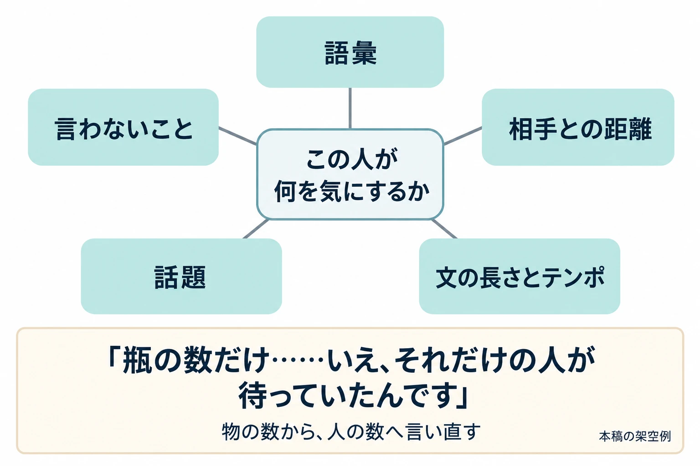

# その台詞は、誰の声か――役割語から始める口調の書き分け

「世界設定・ロアの書き方」第4回

***

## はじめに

診療所の医師、医師の娘、北門の門番、街の住人、記録を預かる灯守（ひもり）。5人が、同じ出来事をこう話したとする。

| 人物 | 最初の台詞 |
|---|---|
| 医師 | 「薬は北門の外へ届かなかった」 |
| 娘 | 「薬は北門の外へ届かなかった」 |
| 門番 | 「薬は北門の外へ届かなかった」 |
| 住人 | 「薬は北門の外へ届かなかった」 |
| 灯守 | 「薬は北門の外へ届かなかった」 |

左の列を隠せば、誰の台詞か区別できない。伝える出来事は同じでも、作った人、待った人、通さなかった人では、口にする言葉を変えられるはずだ。

日本語には、一人称、語尾、敬語など、話し手の違いを出す手段が多い。大阪大学ResOUの金水敏氏への取材でも、一人称の選択肢や文末表現が、日本語の人物表現を支える特徴として挙げられている。[[1](#ref-1)] その選択肢を、名前がなくても人物を思い浮かべられる台詞へつなげたい。

判断軸は、 **口調は、型で入口を作り、その人だけの癖で人物にする** ことだ。

[第1回](worldbuilding-lore-narrative-placement.md)では情報の置き場所を、[第2回](worldbuilding-lore-fragment-writing.md)では短い断片を、[第3回](worldbuilding-lore-unfamiliar-names.md)では知らない名前を渡す順番を扱った。今回は、日本語の原文を書く側から、台詞の話し手を作っていく。

引き継ぐのは「昔、疫病が広がった街」である。医師たちの組合、白糸会に属する医師は、北門の外の病人へ運ぶ薬瓶に白い糸を結んだ。しかし、街の評議会が出した封門令のもとで門番は通行を拒み、薬は門の内側に残った。外には医師の娘もいた。医師は、その後の娘の消息を知らない。

**以下の5人の人物と台詞は、前3回の設定を引き継いだ本稿の架空例である。実在作品の台詞は引用しない。** 5人が一堂に会する場面ではなく、同じ事実をそれぞれの立場から話す練習として並べる。娘の台詞は封鎖当時、薬が届かなかったとわかった時点の発言を想定し、その後の生死や再会は決めない。門番の台詞は、当時通行を拒んだ人物のものとする。

***

## 1. 役割語という型

言語学者の金水敏氏は、特定の言葉づかいから特定の人物像を思い浮かべられるとき、その言葉づかいを **役割語** と呼ぶ。『ヴァーチャル日本語 役割語の謎』（2003年）の定義には、逆に、人物像からいかにも使いそうな言葉づかいを思い浮かべられる場合も含まれる。本人の論文「『役割語』研究と社会言語学の接点」に、この定義が金水2003年の205頁として再掲されている。[[2](#ref-2)]

ResOUの記事は、「私は知っている」を、老人風の「わしは知っておるのじゃ」、お嬢様風の「わたくし存じておりますわ」に変える例を示している。[[1](#ref-1)] 内容がほぼ同じでも、言い方を変えるだけで人物像が浮かぶ。これは研究紹介記事の例文であり、実在の高齢者や特定の階層の人が皆そのように話すという意味ではない。

金水氏も「マンガと役割語研究」で、役割語には、長い説明を挟まず話し手の属性を伝える働きがあると述べている。[[3](#ref-3)] 初登場の短い会話で、人物の輪郭をつかんでもらえるのが型の効用だ。

### 5人へ、話す姿勢の型を当てる

ここでは、実在の地域や民族、職業集団の話し方を借りず、「慎重な人」「性急な人」といった話す姿勢から始める。以下は、金水氏による役割語の分類表ではない。言い方から人物像を連想する働きを、台詞づくりへ応用した本稿の練習である。

**書き直す前――5人とも同じ言い方**

> 「薬は北門の外へ届かなかった」

**書き直した後――内容を保ち、言い方を変える**

| 人物に仮置きする型 | 台詞 |
|---|---|
| 医師：慎重に説明する | 「薬は北門の外へ届きませんでした。その点は、確かです」 |
| 娘：結論を急ぐ | 「薬、届かなかった。北門の外には」 |
| 門番：きっぱり言い切る | 「薬は北門の外へ届かなかった。以上だ」 |
| 住人：相手を会話へ巻き込む | 「薬は北門の外へ届かなかったんだよ。ねえ、聞いてる？」 |
| 灯守：順序を整える | 「まず、薬は北門の外へ届かなかった。そこから話しましょう」 |

慎重、性急、断定的、おしゃべり、几帳面。肩書きの説明を足さなくても、態度の違いは読める。ただし、ここで得られたのは人物づくりの入口である。

***

## 2. 型だけで書くと起きること（一）――人物が記号になる

先ほどの医師の台詞を、慎重な旅人に渡してみよう。「その点は、確かです」は、そのまま使える。娘の短い言い方も、急いでいる別の人物に渡せる。

型は、広い範囲の人物を思い浮かべさせる。そのため、型を当てただけでは、 **この街で、この出来事を経験した人の言葉** になるとは限らない。5人それぞれについて、どこが入れ替え可能なのかを見る。

| 人物 | 1章の台詞で、まだ足りないこと |
|---|---|
| 医師 | 慎重さはあるが、自分で薬を用意した人の関心がない。 |
| 娘 | 勢いはあるが、門の外で待った人が次に何を望むかがない。 |
| 門番 | 断定はあるが、通行を拒んだ自分と出来事との関わりがない。 |
| 住人 | おしゃべりではあるが、何を見聞きして話しているかがない。 |
| 灯守 | 順序は整っているが、何を根拠に説明する人なのかがない。 |

まずは、その人が出来事のどこにいたかを一つ足す。

**書き直す前――医師**

> 「薬は北門の外へ届きませんでした。その点は、確かです」

**書き直した後――出来事との関わりを足す**

> 「私が用意した薬は、北門の外へ届きませんでした」

自分が用意したものについて話す台詞になった。まだ独特の声とまではいかないが、慎重という性格だけでなく、出来事の当事者として読める。

ここで全員に奇抜な語尾を足すと、見分ける目印は増やせる。しかし、なぜその人がその言葉を選ぶのかは残らない。一人称や語尾をそろえても違いが出るようにするには、言葉を選ぶ理由まで作る必要がある。

***

## 3. 型だけで書くと起きること（二）――ステレオタイプと差別

型を借りるときには、もう一つ確認したいことがある。 **その型が、現実の誰かへの決めつけを運んでいないか** という点だ。ステレオタイプとは、ある集団について共有される、ひとまとめの固定的なイメージである。

金水氏は、役割語が言語的なステレオタイプであり、社会的な集団への偏見や差別を強めることがあると指摘する。その例が、中国人を表す「アルヨことば」である。[[3](#ref-3)]

同氏の説明では、戦前の『のらくろ』の1937年・1938年の作品は、日本軍になぞらえた猛犬軍と、中国軍になぞらえた豚軍を対置した。豚軍は劣った集団として描かれ、一貫してこの話し方を与えられた。金水氏は、その描写が、話し方と集団の劣等性を結びつけて受け取らせる構造を問題にしている。[[3](#ref-3)]

ここで見るべきなのは、 **誰にその話し方を与え、どんな評価と組み合わせ、繰り返しているか** である。特定の語尾だけを取り出して判断するより、人物の扱われ方まで読む必要がある。

### 使う前に確かめる

以下は、金水氏の指摘を踏まえた本稿の実務上の提案である。まず、実在の地域、民族、国籍、職業、世代などと結びつく話し方かを調べる。そのうえで、その話し方が滑稽さ、愚かさ、悪役、劣った立場などの目印として繰り返されていないかを見る。両者が重なる箇所は、特に丁寧に見直したい。

1. **借りるものを特定する**：漠然と「田舎っぽい」「外国人っぽい」で済ませず、どの言葉をどこから持ってきたかを記す。出所がわからなければ、別の作品で覚えた型を現実の話し方と思い込んでいないか調べる。
2. **その人の側から読む**：その地域や集団の人が読んだとき、暮らしの一部として受け取れるか、からかわれていると感じるかを考える。書き手だけで答えを確定せず、確認したい点を残す。
3. **場面の役割を調べる**：笑わせたいから、信用できない人物だと示したいから、その話し方を選んでいないか。笑いが起きる理由や敵対する理由を、言葉以外の行動でも説明できるか。
4. **登場人物全体を並べる**：同じ集団に属する人が、その型でしか登場していないか。その話し方の人物だけが、いつも失敗したり見下されたりしていないか。一つの台詞に加え、作品全体の配分も見る。
5. **別の材料で書き直す**：印象づけたいものが「話が長い」「規則を盾にする」「相手を気遣う」なら、文の長さや話題の選び方で表せないか試す。4章で、その材料を増やしていく。
6. **詳しい人と確かめる**：当事者や、その言葉に詳しい人へ、台詞だけでなく人物の役回り、前後の会話、笑いや対立の意図も渡す。指摘された点と修正理由を記録する。一人の確認で集団全体の受け止め方が保証されるとは考えず、迷いが残る箇所を共有する。

方言などを、人物の出自や人間関係として丁寧に描く選択はある。その場合は、どこで暮らし、誰とその言葉を使い、相手によってどう変えるかまで調べて書ける。一方、「この言葉ならおかしく見えるはず」と型だけを借りると、生活の背景が抜け落ちる。人物の出自を描く目的と、簡単な目印として使う目的を分けて考えたい。

文化表現を参照するときの法的・社会的リスクの整理は、[「ゲーム企画者のための文化盗用リスク管理」](cedec2026-cultural-appropriation-risk-management-for-game-planners.md)で扱っている。ここでは、台詞と人物配置を直す手順に絞る。

### 集団の型を借りず、話す癖で印象を作る

先ほどの住人を、さらに「噂を話したがる人」にしたいとする。地域の話し方を足す前に、この人が何を確かめ、何を確かめずに口にするかを決められる。

**書き直す前――会話へ巻き込むだけ**

> 「薬は北門の外へ届かなかったんだよ。ねえ、聞いてる？」

**書き直した後――聞いた話を持ち出す**

> 「薬は北門の外へ届かなかったって。ねえ、その話、どこで聞いた？」

相手の話の出所まで知りたがる人物になった。ここでの伝聞好きは、この住人個人の癖である。街の住人全員の性質にはしない。また、この台詞だけで噂の内容を確定した歴史として扱わず、記録や当事者の発言と区別する。

***

## 4. その人だけの癖を作る材料

Cygamesは2017年の「キャラクターらしさ学習AI」で、人物の特徴を「発話内容・好み」と「話し方・口調」の二面から捉えている。[[4](#ref-4)] 書くときの言葉に直せば、 **何を話すかと、どう話すかを一緒に決める** という整理が役に立つ。

この二面を、台詞の手直しに使える五つの材料へ分けてみよう。以下の分け方は本稿の提案である。

| 材料 | 決めること | この街での使い方 |
|---|---|---|
| 語彙 | 仕事や生活でよく扱う物、動作、数え方 | 医師は薬瓶の本数を、待つ患者の人数へ言い換える。 |
| 相手との距離 | 誰に敬語を使い、どう呼びかけるか | 医師は聞き手へ丁寧に説明するが、娘への呼びかけでは短くなる。 |
| 文の長さとテンポ | 一息で説明するか、短く切るか、言い直すか | 娘は出来事を短く受け止め、すぐ次にできることを尋ねる。 |
| 話題の選び方 | 同じ出来事のどこから話すか | 門番は命令と通行、住人は話の出所、灯守は記録の記述から入る。 |
| 言わないこと | 避ける話題や、口にするのをためらう言葉 | 医師は娘の消息を問われても、知らない結末を断定しない。 |

職業の語彙を使うことと、「この職業なら皆こんな話し方だ」と決めることには違いがある。薬、通行、記録は、この人が実際に扱ったものだ。そこから何を選ぶかを個人の事情へ結びつける。別の医師なら調合法を、別の門番なら外で聞いた咳を先に話すかもしれない。

ここでは娘に、「待つ間も、次に自分ができることを探す」という癖を加える。医師には「物の数を人の数へ言い直す」、門番には「命令を先に置き、自分の判断は後へ回す」、灯守には「記録にあることと自分の判断を分ける」という傾向を加える。いずれも、この練習のための人物設定だ。

### 5人の台詞を、関心から書き直す

**書き直す前――1章の型を中心にした台詞**

| 人物 | 台詞 |
|---|---|
| 医師 | 「薬は北門の外へ届きませんでした。その点は、確かです」 |
| 娘 | 「薬、届かなかった。北門の外には」 |
| 門番 | 「薬は北門の外へ届かなかった。以上だ」 |
| 住人 | 「薬は北門の外へ届かなかったんだよ。ねえ、聞いてる？」 |
| 灯守 | 「まず、薬は北門の外へ届かなかった。そこから話しましょう」 |

**書き直した後――その人が気にすることを残す**

| 人物 | 台詞 |
|---|---|
| 医師 | 「私が用意した薬は、北門の外へ届きませんでした。瓶の数だけ……いえ、それだけの人が待っていたんです」 |
| 娘 | 「薬、北門の外には届かなかった。じゃあ、待つ間にできることは？」 |
| 門番 | 「封門令は通行を禁じていた。薬も北門の外へは通さなかった」 |
| 住人 | 「薬は北門の外へ届かなかったって。ねえ、その話、どこで聞いた？　私が聞いた話とは、そこが同じなんだ」 |
| 灯守 | 「薬は北門の内側に残された、と報告にあります。外へ届かなかったことは、この記録から読めます」 |

医師は薬を待った人へ、娘は次の行動へ、門番は命令へ目を向ける。住人は噂を照らし合わせ、灯守は判断の根拠を示す。「薬が届かなかった」という核を保ちながら、何を足し、どんな順番で話すかが変わった。

ただし、「言わないこと」には二種類ある。医師が娘のその後を断定しないのは、知らないからである。門番が「私が拒んだ」を避けるのは、ここで加えた人物のためらいである。 **知らないことと、知っていて言いたくないことを分ける** と、台詞の曖昧さにも理由を持たせられる。

全台詞へ五つの材料を詰め込む必要はない。たとえば医師が毎回必ず言い直すと、新しい型になってしまう。平常時の短い返事も書き、感情が動く箇所で癖が表れるようにすると扱いやすい。

***

## 5. 相手と状況で口調を動かす

一人の人物にも、相手による話し方の違いがある。初対面の人には事情を説明し、親しい人には言葉を省く。公の場では根拠を示し、個人的な会話では感想を漏らす。その変化を決めておけば、口調そのものが関係を伝える。

医師については、 **普段は人数や配布を気にするが、娘へ呼びかけるときだけは、帰りを願う短い言葉になる** と決めてみよう。

**書き直す前――事情を聞く相手への説明**

> 「私が用意した薬は、北門の外へ届きませんでした。瓶の数だけ……いえ、それだけの人が待っていたんです」

**書き直した後――返事のない娘へ、手帳の中で呼びかける**

> 「薬は、そちらへ届かなかった。娘へ。空き瓶は返さなくていい。帰ったら、戸を叩いてくれ」

後半は、第2回の[医師の手帳](worldbuilding-lore-fragment-writing.md)に残した言葉である。説明するための「私が用意した」も、聞き手へ向けた敬語も消えた。配布と回収を考える人が、娘には瓶を返さなくていいと書く。普段の関心があるからこそ、その例外が気持ちを伝える。

これは手帳に残す呼びかけであり、娘が読んだことや、返事があったことは示していない。相手への親しさを出しても、医師が知っている範囲は変えない。

### 灯守の、公の説明と個人の言葉

灯守にも、公私の違いを作れる。ここでは、記録を案内する相手に心を開いた場面を想定する。

**書き直す前――記録を読み上げ、根拠を示す**

> 「薬は北門の内側に残された、と報告にあります。外へ届かなかったことは、この記録から読めます」

**書き直した後――読み上げを終え、個人として話す**

> 「薬は届かなかった。紙には、それだけだね。私は読むたび、待っていた人のことを考える」

敬語が外れ、感想が出た。一方で、紙に書かれたことと自分が考えることを分ける癖は残っている。この「残るもの」と「変わるもの」を決めておくと、場面ごとの変化を同じ人物のものとして書きやすい。

物語の途中で距離が縮まるなら、いつから呼び方や敬語が変わるかも決める。変化した場面を記録しておけば、後の会話で急に初対面の距離へ戻ることを防げる。

***

## 6. 大勢の口調を保つ道具

人物が増え、別の担当者も書くようになったら、頭の中の感覚を共有できる形へ移そう。 **口調表** は、話し方の基準と代表例をまとめた表である。

5人分を作るなら、たとえば次のようになる。これも本稿の架空設定であり、一人称は必要なときに使うものとして記す。毎回台詞へ入れるという指定ではない。

| 人物 | 一人称・語尾・テンポ | 相手ごとの呼び方と敬語 |
|---|---|---|
| 医師 | 私。「〜ました」「〜です」。説明は丁寧。人のことに触れると言い直すことがある。 | 初対面には「あなた」と敬語。娘への記述は「娘へ」、短い常体。 |
| 娘 | 私。「〜だった」「〜は？」。出来事を短く言い、次の問いへ進む。 | 父には「お父さん」と常体。初対面には「〜ですか」と尋ねる。 |
| 門番 | 私。「〜だ」「〜した」。理由を先に置いて言い切る。 | 通行を求める相手には「あなた」と常体。上役には役職名と敬語。 |
| 住人 | 私。「〜って」「〜なんだ」。問いを挟み、相手の反応を待つ。 | 顔なじみには「ねえ」と常体。初対面には「〜ですか」から入る。 |
| 灯守 | 私。公では「〜にあります」「〜と読めます」。私的には「〜だね」。 | 記録を案内する相手には「あなた」と敬語。親しい相手には呼びかけを省き、常体。 |

| 人物 | よく使う語彙・向かう話題 | 言わないこと・避ける言葉 | 代表的な台詞 |
|---|---|---|---|
| 医師 | 瓶、人数、待つ人。物の数から人へ戻る。 | 娘の生死など、知らない結末を断定しない。 | 「瓶の数だけ……いえ、それだけの人が待っていたんです」 |
| 娘 | 待つ間、次、できること。自分が動けることを探す。 | 待っているだけで終わる返答を避ける。 | 「じゃあ、待つ間にできることは？」 |
| 門番 | 命令、通行、認める。規則から話す。 | 普段は「私が決めた」を避け、命令を先に出す。 | 「封門令は通行を禁じていた。薬も北門の外へは通さなかった」 |
| 住人 | 聞いた話、同じ、どこで。噂の出所を知りたがる。 | 聞いただけのことを「見た」とは言わない。 | 「ねえ、その話、どこで聞いた？」 |
| 灯守 | 報告、記録、紙、読む。事実と感想を分ける。 | 記録にないことを、記録の内容として言わない。 | 「紙には、それだけだね。私は読むたび、待っていた人のことを考える」 |

項目が多ければ、このように表を分けてよい。大切なのは、語尾に加えて、相手、関心、例外が見えることである。口調表を別の言語の文章づくりへ渡す話は、[『ウマ娘』英語版に学ぶ、テキストだけの創造的ローカライズ](cedec2026-umamusume-text-only-creative-localization.md)で扱っている。

### 表と、過去の台詞を一緒に使う

Cygamesの2017年の事例は、多数の人物を複数人で書く中で、監修者への依頼が集中し、書き手への助言が遅れるという課題を出発点としている。過去の台詞から人物らしさを捉え、書き手が自分で確認する支援が試みられた。[[4](#ref-4)]

2026年のCEDEC講演を報じたGameBusiness.jpの記事では、長期運営で設定が蓄積する中、方言に詳しい書き手が頻繁に監修する負担への対応が紹介されている。人物固有の言い回しを蓄えたデータベースから表現の候補を挙げる仕組みや、監修済みの過去の台詞を参照し、その人物に合う話し方を支援する仕組みである。[[5](#ref-5)]

これらは、口調を保つことが、初めに語尾を決めて終わる仕事ではないとわかる事例だ。新しい場面を書くたび、過去の表現、相手との関係、設定の変化を照らし合わせる必要がある。

小さな制作でも、口調表の各代表例に「場面」「相手」「物語の時点」を添え、元の台詞へ戻れるようにするとよい。候補と採用済みを分け、修正した理由も一行残す。感情による例外を、新しい通常の口調として広めないためである。

**書き直す前――門番の説明が、いつの間にか灯守に寄った**

> 「薬は北門の内側に残された、と報告にあります」

**書き直した後――当時の行動と、命令を先にする癖へ戻す**

> 「封門令は通行を禁じていた。薬も北門の外へは通さなかった」

ただし、後の場面で門番が自分の責任を引き受け、「私が止めた」と言うなら、それは人物の変化として成立する。口調表には、その場面以降の変化を追記する。表は誤りを見つける道具であり、人物が変わることを妨げる決まりにはしない。

***

## 7. 確認の問い

完成した台詞は、名前を伏せて読んでみよう。その後で名前と場面を戻し、相手との関係まで含めて確かめる。短い「はい」まで必ず区別できる必要はない。特徴を盛りすぎず、まとまった会話を通じて、その人の選ぶ言葉が見えてくるかを目安にする。

- 名前を伏せても、誰が何を気にしている台詞か分かるか。
- 同じ型の別人へ、そのまま渡せる言葉ばかりになっていないか。
- 実在の集団の話し方を、笑いや愚かさ、敵役の目印として使っていないか。
- 語尾だけでなく、語彙、話題、言わないことにも人物の事情があるか。
- 相手や公私の場面が変わると、口調も動くか。その中に同じ人らしい癖が残るか。
- 知らないことを断定していないか。言いたくないこととの違いが書けているか。
- 口調表と過去の台詞に照らして、違いに理由があるか。人物の変化なら、その時点を残したか。

## References

1. [大阪大学ResOU編集チーム「キャラクターに応じた『役割語』」][1] — 大阪大学ResOU、2018年8月取材。金水敏氏への取材。「私は知っている」の言い換え例と、一人称・文末表現に関する説明を参照。

[1]: https://resou.osaka-u.ac.jp/ja/story/2019/fyvba9

2. [金水敏「『役割語』研究と社会言語学の接点」][2] — 社会言語科学会第19回大会（日本大学、2007年3月）基調講演。PDF冒頭の第1節に再掲された、金水『ヴァーチャル日本語 役割語の謎』（岩波書店、2003年）205頁の定義を参照し、本文では要約した。著者公開の学会論文PDFであり、ブログ記事を根拠とするものではない。

[2]: https://skinsui.cocolog-nifty.com/sklab/files/JASS19kinsui_paper.pdf

3. [金水敏「マンガと役割語研究」][3] — 京都精華大学国際マンガ研究センター公開資料、刊行年の明記なし。PDF3頁「日本における役割語とマンガの関係」、5〜6頁「マンガが果たす負の役割」を参照。『のらくろ』については金水氏の分析を要約し、作品の台詞や図版は転載していない。

[3]: https://imrc.jp/images/upload/lecture/data/Kinsui_JPN.pdf

4. [Cygames・都築「【CEDEC 2017 フォローアップ】キャラクターらしさ学習AI：多数のキャラクターの個性や違いの可視化による シナリオライティング支援システム事例」][4] — Cygames Engineers' Blog、2017年10月23日。冒頭の課題と二面の説明、および記事内の公開講演スライド2・4・5・8頁を参照。

[4]: https://tech.cygames.co.jp/archives/3091/

5. [気賀沢昌志「方言、特有の言い回し、誤字をサポートするCygamesのシナリオ執筆支援AIツールはこうして開発された【CEDEC2026】」][5] — GameBusiness.jp、2026年9月2日。Cygames・立福寛氏の講演取材記事。「クセの強いキャラクターのセリフや方言をサポートする」を中心に参照。

[5]: https://www.gamebusiness.jp/article/2026/09/02/27866.html

----

この文書は、Perplexity、Claude、OpenAI Codex の3つのAIの支援を受けて著述されたものです。引用画像を除き、MIT License にて提供されています。
