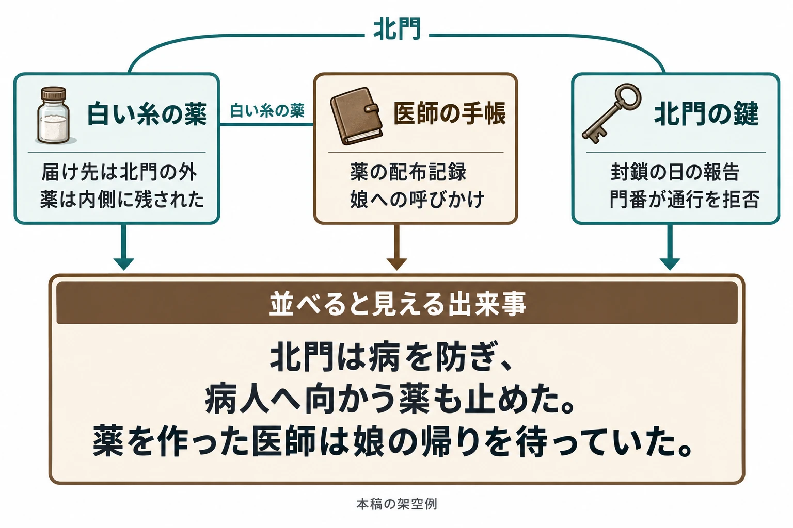

# 一つでも読めて、並べると変わる――アイテムの説明文・図鑑・武器の物語で断片を書く技法

「世界設定・ロアの書き方」第2回

***

## はじめに

持ち物の説明を読んで、使っていた人物の暮らしを想像する。図鑑を読み進めて、記録した人物の偏見に気づく。別々に拾った品の文章がつながって、通り過ぎた門の見え方が変わる。短い文章にも、こうした物語を生む力がある。

[第1回「その設定は、どこに書くか」](worldbuilding-lore-narrative-placement.md)では、会話やアイテムの説明文、背景、図鑑などから、情報の置き場所を選んだ。今回は、そこに置く文章を書く段階へ進む。ロアとは、歴史や伝承、人物や物の由来など、世界の背景を形づくる情報である。

判断軸は、 **一つだけ読んでも何かが伝わり、並べると別の意味が立ち上がること** だ。

第1回の「昔、疫病が広がった街」と、その街の薬を引き継ごう。最初の説明文は、次のようなものだったとする。

> **薬――最初の説明文**  
> HPを50回復する。昔、疫病が広がった街で作られた薬。

使い道と来歴の入口はわかる。ここから、誰かの行動や、街で起きたことまで感じられる文章に育てていく。

以下の薬、人物、品物、数値、記録や噂の例文は、すべて本稿のための架空のものである。実在する作品のゲーム内テキストは引用しない。開発者の発言から得られる手掛かりを示したうえで、書き直し方は本稿の実践例として提案する。

***

## 1. 水面下を知っておく

ヘミングウェイは『午後の死』（1932年）第16章で、書き手が十分に知り、真実味をもって書けていれば、省いたことも読者に感じ取ってもらえると述べている。対して、知らないために省くと文章に空洞ができる。水面上には一部だけが見える氷山になぞらえた、いわゆる **氷山の原理** である。[[1](#ref-1)]

日本語訳には、佐伯彰一・宮本陽吉訳を収めた『ヘミングウェイ全集 第5巻』（三笠書房、1974年）がある。[[2](#ref-2)] ここでは英語原文の趣旨を述べている。

一方、『Hollow Knight』のTeam Cherryは、物語をあまり先まで計画せず、開発中に虫たちが何を考え、どこへ行き、出来事にどう反応するかを考え続けると、小さな物語が自然に進んでいったと説明している。[[3](#ref-3)]

この二つを文章づくりへ引き寄せるなら、先に筋の正解をすべて固定することより、 **その人物が何を知り、何を失ったのかを、書き手がわかっていること** が足場になる。物についてなら、誰が作り、誰に渡るはずで、どんな出来事を経たのかである。展開を考えながら、その理解を深めてもよい。

実務では、ゲーム内に公開しない短い裏メモを先に書くと扱いやすい。薬なら、次の四項目から始められる。

| 裏メモの問い | この薬について決めておくこと |
|---|---|
| 誰が作ったか | 街の診療所の医師。病人に薬を配っていた。 |
| 誰のためか | 北門の外で待つ病人。医師の娘もそこにいた。 |
| 何が起きたか | 疫病を恐れた街は北門を封鎖した。医師は外へ運ぶ薬瓶に白い糸を結んだが、門番は通行を拒んだ。医師は薬を門の内側に残した。 |
| 何が失われたか | 病人へ薬を届ける機会。医師は娘との連絡も失い、その後の消息を知らない。 |

これは、例文を組み立てるために読者と共有する裏メモである。ゲーム内の薬の説明文に、この表を丸ごと載せる想定ではない。

### 薬を書き直す

**書き直す前**

> HPを50回復する。昔、疫病が広がった街で作られた薬。

**書き直した後**

> HPを50回復する。疫病の街で、医師が北門の外の病人へ届けようとした薬。目印に白い糸を結んだが、門は開かず、瓶は内側に残された。

今度は、薬に「届けようとした相手」と「届かなかった事情」がある。単独でも、誰かの試みが阻まれたことは伝わる。娘のことや医師のその後まで書かなくても、白い糸を結んだ理由は書き手の側にある。

裏メモには、未定のことを未定と書いてよい。たとえば娘の生死を決めていなくても、医師が消息を知らない場面は書ける。ただし、後で娘の死亡を断定する文章を足すなら、誰がどう知ったのかまで見直す必要がある。

***

## 2. 効果と由来を分ける

アイテムなどの性能とは別に、雰囲気や来歴を伝える短文を **フレーバーテキスト** と呼ぶ。GAME WatchによるCygamesの坂本正吾氏のCEDEC 2019講演記事では、アイテムの文章で仕様上の嘘や混乱を招く紹介を避けることが説明されている。掲載スライドにも、実際には存在しない機能を、文章の勢いで付け足してしまう例が示されている。[[4](#ref-4)]

この注意を、書くときの基本形にすると、 **数値や効果は効果欄へ、由来は説明文へ** と分けられる。由来を伝えるうえで必要な場合にだけ、効果に関わる性質を説明文にも残す、という整理である。

たとえば「HPを50回復する」は、使うかどうかを判断するための情報だ。「白い糸を結んだ」は、誰のための薬だったかを示す情報になる。同じ欄へ繰り返し書く必要はない。第1回の、変わりやすい情報を差し替えやすい欄に置く考え方も、この書き分けにつながる。

### 薬を書き直す

**書き直す前**

> HPを50回復する。疫病の街で、医師が北門の外の病人へ届けようとした薬。目印に白い糸を結んだが、門は開かず、瓶は内側に残された。

**書き直した後**

| 欄 | 文章 |
|---|---|
| 効果 | HPを50回復する。 |
| 説明文 | 疫病の街で、医師が北門の外の病人へ届けようとした薬。目印に白い糸を結んだが、門は開かず、瓶は内側に残された。 |

分けると、説明文では「使えばどうなるか」を繰り返す分だけ、来歴へ使える余地が増える。

また、効果を世界設定に結びつける書き方もある。『Dark Souls』シリーズの英訳者Ryan Morris氏は、宮崎英高氏がゲームの仕組みを物語へ取り込み、ゲーム的な部分を連続した語りの中に隠そうとしていたと証言している。[[5](#ref-5)] これは物語へのなじませ方の話であり、必要な効果説明を曖昧にしてよいという意味には取らない。薬が何をするかは明確に伝え、その薬が街で何を意味したかを短文で添える、と両立させられる。

***

## 3. 短く書く

Alexis Kennedy氏は『Cultist Simulator』で、対応する『Sunless Sea』『Fallen London』の断片より25％短くすることを目標の一つにしていた。同氏は、プレイヤーの注意を引けるのは操作の合間の一瞬であり、読むことを強制する工夫には意味がなかったとも語っている。[[5](#ref-5)] この25％は、その作品で掲げた目標である。自分の文章を一律に同じ割合だけ削る必要はない。

同じ記事で英訳者Ian Milton-Polley氏は、『Dark Souls II』のクラス説明が、厳しい字数制限のために小さな詩のようになったと振り返っている。[[5](#ref-5)] 短い欄では、残す言葉の選び方が文章の印象を作る。

薬の文章を削るときは、次の三つを試してみよう。

- **固有名詞は一つに絞る**：まず覚えてほしい名前を選ぶ。医師や街に名前を足すより、この例では「北門」をつながりの目印にする。
- **具体的な物を一つ入れる**：ここでは「白い糸」を残す。瓶に結ぶ手の動きを想像でき、後の断片にも使える。
- **感情を物や行動で示す**：「医師は深く悲しんだ」と言い切る代わりに、届ける準備が整った瓶だけを残す。

一つという数は、削る練習のための目安だ。すでに馴染みのある地名や、理解に必要な名前まで削ることはない。

### 薬を書き直す

**書き直す前**

> 疫病の街で、医師が北門の外の病人へ届けようとした薬。目印に白い糸を結んだが、門は開かず、瓶は内側に残された。

**書き直した後**

> 北門の外の病人へ届けるはずだった薬。瓶には、医師が結んだ白い糸が残る。

薬の受け取り手と、届かなかったことは残った。門が開かなかった経緯は別の断片へ回せる。白い糸は、かつての準備がまだ残っている手触りを担う。

短くした後は、この文章だけを初めて読むつもりで確かめる。「白い糸は、今も残る」まで削ると、響きはあっても、何の糸か、何が起きたかがつかみにくい。 **単独で受け取れる出来事を一つ残す** と、短さと伝わりやすさを両立しやすい。

***

## 4. 語り手を立てる

『Hollow Knight』の図鑑「Hunter's Journal」には、狩人のメモがある。Team Cherryは、それを読み解くことで、生き物だけでなく狩人本人についても理解が深まると説明している。[[6](#ref-6)] 何を観察し、どう評するかには、記録する人物の姿も表れる。

Cygamesの講演記事でも、一人称のカードコメントではキャラクターになりきって書くことが重視されている。また、カードの希少度に文調を合わせ、伝聞風から客観的な記述、神話風へ変える例も紹介されている。[[4](#ref-4)] 誰が話すかと、どんな存在として見せるかによって、同じ短さでも声の響きは変えられる。

薬の説明文にも、文章の持ち主を決めてみよう。

### 薬を書き直す

**書き直す前**

> 北門の外の病人へ届けるはずだった薬。瓶には、医師が結んだ白い糸が残る。

**書き直した後――医師の記録を添える**

> 白い糸の薬。瓶に結ばれた札には、医師の字がある。  
> 「北門の外へ。白い糸の瓶を、待っている人たちに」

前の文は、出来事を後から知った立場の説明だった。今度は、まだ渡せるつもりで準備した医師の声になる。同じ薬を、薬を恐れた住民が語るなら、たとえばこう変わる。

> 「白い糸の薬だろう。あれが門に積まれた晩から、外の咳が聞こえなくなったんだ」――住民の噂

医師は渡す相手を思い浮かべている。住民は、薬が現れた時期と咳がやんだ時期を結びつけている。住民が薬を恐れていることは伝わるが、薬が咳を止めたのか、人々が去ったのかまでは、この噂だけでは決まらない。

語り手を立てると、 **知っていることと、思い込んでいることの境目** も書ける。「住民の噂」という署名は、その言葉が街全体の確定した歴史ではなく、住民の受け取り方だと伝える手掛かりになる。

一方で、医師の札に「門番は私を恐れていた」と書けば、医師が門番の内心を知る根拠が要る。語り手を決めた後は、その人が見たこと、聞いたこと、推測したことを分けておこう。

***

## 5. 段階で明かし、最後に変える

『NieR:Automata』のウェポンストーリーは、武器のレベルアップとともに読める部分が解放される。[[7](#ref-7)] 電撃オンラインの公募企画では、既存のLv1〜3に続くLv4が募集された。ヨコオタロウ氏は採用理由として、最後の段階でカタカナ表現に変わるなど、表現上の工夫があったことを挙げている。[[8](#ref-8)] 最後に何を明かすかと、どんな文体で読ませるかを合わせて考える手掛かりになる。

『Hollow Knight』の図鑑も、ある敵をさらに倒すことで狩人のメモを読み解けるようになる。[[6](#ref-6)] こちらは敵との遭遇や戦いを、読める範囲の広がりにつなげている。

薬の例では、診療所に残された調合記録を集めるたび、アイテム詳細に付属する記録欄が増える設計を考えよう。効果欄はそのままに、薬の由来を段階で読む想定だ。

### 薬を書き直す

**書き直す前――一度に読める説明文**

> 白い糸の薬。瓶に結ばれた札には、医師の字がある。  
> 「北門の外へ。白い糸の瓶を、待っている人たちに」

**書き直した後――調合記録の発見に合わせて追加する文章**

| 段階 | 読める文章 |
|---|---|
| 最初の段 | 白い糸の薬。札には「北門の外へ」とある。 |
| 次の段 | 医師の調合記録。「白い糸の瓶を、門の外で待つ病人へ。配り終えたら、空き瓶を回収する」 |
| 最後の段 | 同じ記録の追記。「娘へ。空き瓶は返さなくていい。帰ったら、戸を叩いてくれ」 |

最初の段だけでも、届け先を指定された薬だとわかる。次の段では、配布と回収を考えていた医師の仕事が見える。最後に、業務の記録が娘への呼びかけへ変わる。

ここで増えたのは、「受け取り手に娘がいた」という情報だけではない。それまで事務的に見えた瓶の回収が、誰かの帰りを待つ言葉と重なる。娘が帰ったかどうかまで決めつけずに、医師の願いを読める。

最後の一文を考えたら、前の段へ戻り、読み替えの足場があるかを確かめたい。この例では、先に書いた「空き瓶を回収する」が、最後の「返さなくていい」を受け止める。突然の告白だけを足すより、 **前に読んだ言葉へ戻りたくなる変化** を作れる。

***

## 6. 並べたときに意味が変わるか

段階的な文章は、読む順序をある程度決められる。一方、別々の品の説明文は、手に入れる順番も、読む数も揃わない。そこで、一つずつに小さな出来事を残し、共通する名前や物によって結びつける。

最後に、薬と周辺の品へ文章を分けよう。薬には届け先、医師の手帳には個人的な願い、北門の鍵には届けられなかった事情を受け持たせる。

### 薬を書き直す

**書き直す前――薬の記録欄に集めた情報**

> 白い糸の薬。札には「北門の外へ」とある。  
> 医師の調合記録。「白い糸の瓶を、門の外で待つ病人へ。配り終えたら、空き瓶を回収する」  
> 同じ記録の追記。「娘へ。空き瓶は返さなくていい。帰ったら、戸を叩いてくれ」

**書き直した後――三つの品から読む**

| 品 | 説明文 |
|---|---|
| 白い糸の薬 | 北門の内側に残された薬。瓶には白い糸と、医師の字で「門の外へ」と書かれた札が結ばれている。 |
| 医師の手帳 | 白い糸の薬の配布記録。「配り終えたら、空き瓶を回収する」。末尾だけ宛名がある。「娘へ。空き瓶は返さなくていい。帰ったら、戸を叩いてくれ」 |
| 北門の鍵 | 封鎖の日、門番が預かった鍵。添えられた報告には「疫病を内へ入れぬため、通行を拒否。医師は白い糸の薬を内側に置いて去った」とある。 |

薬だけなら、届け先と置かれた場所の食い違いが伝わる。手帳だけなら、仕事の記録に家族への願いが交じっている。鍵だけなら、街を守る判断によって医師の通行が阻まれた出来事を読める。

三つを並べると、薬が届かなかった事情に、医師が娘を待っていたことが重なる。北門は、病を防ぐための門であると同時に、病人へ向かう薬も止めた門になる。鍵の持ち主の判断と、薬を作った人の願いが、同じ出来事の中に見えてくる。

つなぎ目は「北門」と「白い糸の薬」だ。ここを断片ごとに別の呼び名へ変えると、同じ出来事を指すと気づきにくくなる。反対に、すべての文章へ医師の娘の事情まで書くと、並べてわかることが少なくなる。 **共通する目印は繰り返し、それぞれの断片が渡す情報を変える** とよい。

第4章の噂をさらに重ねれば、住民が怖がった薬には、そもそも門を越えられなかったものがあったとわかる。ただし、外の咳がやんだ理由や娘の消息までは確定しない。読者がつなげられる事実と、その先に想像できることの境目を、書き手の側では保っておく。

最後の確認では、裏メモを伏せ、断片を一枚ずつ読んでみる。その後、順番を入れ替えて並べる。完成した説明文へ向ける問いは、次の五つでよい。

- 一つだけ読んでも、物の由来や誰かの行動が伝わるか。
- 裏メモと矛盾していないか。噂や思い違いなら、その立場がわかるか。
- 効果欄で伝える説明が混ざっていないか。残した性質は由来を語るために必要か。
- 語り手は誰か。その人が知り得る範囲で書いているか。
- 並べたとき、単なる情報の追加を越えて、前に読んだ文章の意味が変わるか。

## References

1. [Ernest Hemingway『Death in the Afternoon』][1] — Charles Scribner's Sons、1932年。第16章の省略と氷山に関する段落。リンク先はFaded Pageの書誌・ダウンロードページ。本文では趣旨を日本語で要約した。

[1]: https://www.fadedpage.com/books/20150366/html.php

2. [国立国会図書館「ヘミングウェイ全集 第5巻」書誌][2] — 国立国会図書館サーチ、刊行年1974年。三笠書房刊。内容細目に『午後の死』（佐伯彰一・宮本陽吉訳）を収録。日本語訳の書誌確認に使用。

[2]: https://ndlsearch.ndl.go.jp/books/R100000002-I000001269364

3. [Nintendo「The Metamorphosis of Hollow Knight, with Team Cherry」][3] — Nintendo Australia、2021年7月20日。Team Cherryの世界設定と登場人物に関する回答。

[3]: https://www.nintendo.com/au/news-and-articles/the-metamorphosis-of-hollow-knight-with-team-cherry-aussie-developer-interview/

4. [安田俊亮「今すぐ使える！ Cygames流、シナリオ“じゃない”ゲームテキストでプレイを盛り上げる鉄則」][4] — GAME Watch、2019年9月6日。CEDEC 2019の坂本正吾氏の講演報道。記事本文、写真の説明、掲載スライドに基づく。アイテムについては仕様上の嘘を避ける説明、カードについては希少度と文調、一人称コメントについてはキャラクターになりきる説明を参照。

[4]: https://game.watch.impress.co.jp/docs/news/1205688.html

5. [Alex Wiltshire「The art of flavour text」][5] — PC Gamer、2018年4月10日。Ryan Morris氏、Ian Milton-Polley氏、Alexis Kennedy氏への取材。25％短くする記述は制作目標、「小さな詩」に関する証言の対象は『Dark Souls II』のクラス説明。

[5]: https://www.pcgamer.com/the-art-of-flavour-text/

6. [Team Cherry「Filling out the Hunter's Journal, Interview, and Game Informer」][6] — Team Cherry公式ブログ、2016年8月19日。掲載年は同内容のKickstarterアップデート#45（2016年8月19日）で確認。狩人のメモと、同種の敵を倒すことによる読み解きについての開発中の説明。

[6]: https://www.teamcherry.com.au/blog/filling-out-the-hunters-journal-interview-and-game-informer

7. [スクウェア・エニックス「BATTLE｜GAMEPLAY｜NieR:Automata」][7] — 『NieR:Automata』公式サイト、公開日表記なし（2026年9月28日確認）。武器のレベルアップによるウェポンストーリーの解放を参照。

[7]: https://www.jp.square-enix.com/nierautomata/gameplay/battle.html

8. [タダツグ「『NieR：Automata』のウェポンストーリー公募企画結果発表。ヨコオさん、齊藤さんからのコメントも」][8] — 電撃オンライン、2016年10月20日。Lv4の公募内容とヨコオタロウ氏の選考コメントを参照。発売前の公募結果発表であり、本文はその選考時の工夫を扱う。

[8]: https://dengekionline.com/elem/000/001/390/1390027/

----

この文書は、Perplexity、Claude、OpenAI Codex の3つのAIの支援を受けて著述されたものです。引用画像を除き、MIT License にて提供されています。
