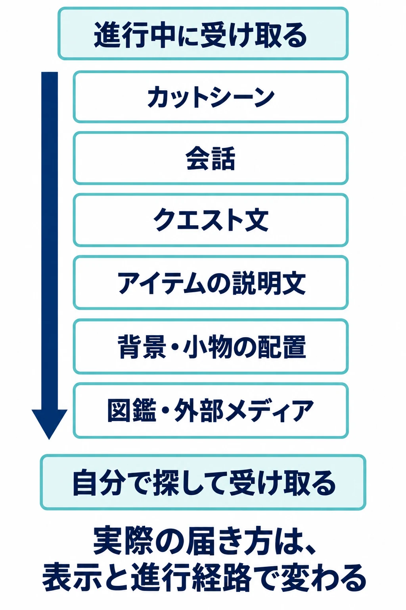

# その設定は、どこに書くか――会話・アイテムテキスト・背景・図鑑から語りの置き場所を選ぶ

「世界設定・ロアの書き方」第1回

***

## はじめに

日本のゲーム開発では、プランナーが文章を書く仕事も担う場面がある。たとえばモノリスソフトの「シナリオプランナー」は、クエストや会話などの文章を書き、遊びやイベントの演出も考える職種として紹介されている。担当範囲はプロジェクトによって異なるが、文章と遊びの両方を考える仕事は実際に存在する。[[1](#ref-1)]

そんなプランナーが「この街には昔、疫病が広がった」という設定を受け取ったとしよう。住民に話させるのか。薬の説明文に書くのか。閉ざされた家や、使われなくなった診療所で伝えるのか。どこを選ぶかで、書く文章も、プレイヤーの受け取り方も変わる。

『ELDEN RING』の、アイテムの説明文などから断片をつなぐ楽しみと、『崩壊：スターレイル』の、周辺の情報までたっぷり読める楽しみは、その違いを考える入口になる。宮崎英高氏は前者について、断片的に語る方針を保ちつつ、人間的なドラマにも力を入れたと説明している。[[2](#ref-2)] 後者について、電ファミニコゲーマーのマシーナリーとも子氏は、街の物を調べたときの文章や収集文書、チャットなどの情報量を高く評価した。こちらは同媒体のPR記事における記者の評価であり、作品間の文章量を測った結果ではない。[[3](#ref-3)]

自分のゲームで、全員に届けたいことは何か。興味のある人が拾えばよいことは何か。 **書き始める前に、情報の置き場所を選ぶ** と、この問いを文章の長さや口調へつなげられる。

このシリーズでいう「ロア」は、作品内の歴史や伝承、人物や物の由来など、世界の背景を形づくる情報を指す。第1回では、その中身をどう作るかよりも、プレイヤーへどのように渡すかを考える。

***

## 1. 語りの置き場所を、読ませる強さの順に並べる

まず、ゲームの進行中に受け取るものから、自分で探しに行くものまで、六つの置き場所を並べてみよう。ここでいう「読ませる」には、台詞を聞くことや、場面を見ることも含める。

| 置き場所 | 受け取り方の目安 | 向いている情報 |
|---|---|---|
| カットシーン | 進行上、必ず通る場面で見る | 物語の転換、人物の決断、その場で共有したい出来事 |
| 会話 | 主な進行経路なら、ほぼ接する | 今の目的、人物の気持ち、相手との関係 |
| クエスト文 | 依頼や目的を確かめるときに読む | 行き先、条件、依頼の背景、後から見直す要点 |
| アイテムの説明文 | 持ち物に興味を持った人が読む | 持ち主の来歴、道具の由来、短い伝承 |
| 背景・小物の配置 | 周囲を見て、関係に気づいた人が受け取る | 過去の出来事の痕跡、生活習慣、土地の変化 |
| 図鑑・外部メディア | もっと知りたい人が探しに行く | 歴史の整理、人物や組織の補足、詳しい資料 |

これは **置き場所を検討するための目安** である。カットシーンでもスキップや見落としは起こるし、会話にも必須のものと任意の立ち話がある。大きな崩落跡なら小さなクエスト欄より目立つこともある。実際にどれだけ届くかは、表示の仕方と進行経路によって入れ替わる。

図鑑と外部メディアにも距離の差がある。ゲーム内で一操作で開ける図鑑に比べ、公式サイトや設定資料集は、ゲームを離れて探す行動を要する。物語の理解に必要な前提を外へ出すなら、その距離まで含めて判断したい。

同じ「疫病があった街」でも、会話なら「だから今も旅人を警戒している」と住民の態度に結びつけられる。薬の説明文なら、かつて誰を救うために作られたのかを短く記せる。診療所の配置なら、街の端に追いやられていたことを歩きながら感じさせられる。置き場所は、情報の届け方とともに、何を感じてもらうかを選ぶ手段でもある。

{: width="480" style="display: block; margin: 0 auto;"}

***

## 2. 置き場所ごとに、変更の負担が変わる

もう一つの判断軸は、書いたあとに直す負担である。Microsoftのゲームローカライズ資料は、音声には翻訳だけでなく演出や口の動きへの調整が伴い、台本変更によるやり直しの時間が必要になると説明している。[[4](#ref-4)]

置き場所を選ぶ段階では、次のように見積もるとよい。表は一般的な制作上の違いを整理したものであり、個々の作品の費用を比較したものではない。

| 置き場所 | ボイスの有無 | 翻訳量を左右するもの | 仕様変更への強さ |
|---|---|---|---|
| カットシーン | 台詞があれば収録する場合がある | 台詞と字幕、画面内の文字 | 収録や映像の完成後は、再録・演出修正へ広がりやすい |
| 会話 | 全収録・一部収録・文字のみなど | 台詞の総量と対応言語 | 文字のみなら直しやすい。収録済みなら音声との一致も必要 |
| クエスト文 | 目的欄や説明欄は文字のみで作れる | 依頼数と説明の長さ | 差し替えやすいが、実際の達成条件との照合が必要 |
| アイテムの説明文 | 文字のみで作れる | アイテム数と一件の長さ | 差し替えやすいが、効果や他の設定との整合を保つ必要がある |
| 背景・小物の配置 | 見た目で伝える部分は不要 | 看板や書類など、読める文字の量 | 配置だけなら動かせる場合もあるが、造形から直すと負担が増える |
| 図鑑・外部メディア | 文章なら不要。動画などは別途必要 | 項目数、詳しさ、媒体数 | ゲーム内文章やWebは更新可能。印刷物や完成済み映像は直しにくい |

たとえば、薬の価格や入手条件がまだ変わりそうなら、登場人物に具体的な数値を読み上げさせるより、後から更新できる説明欄に置く方が扱いやすい。一方、その人物が薬を手渡すときのためらいは、声や表情に任せる価値がある。変更される情報と、演技で届けたい感情を分ければ、両方の置き場所を選べる。

文字だけでも、文章が増えれば翻訳する量は増える。短い断片には、誰のことを指しているか読み取りにくいという難しさもある。また、背景で語れば文章は減らせても、背景を作る仕事まで消えるわけではない。 **台詞の字数だけでなく、直すときに誰の作業が必要になるか** を見ておこう。

収録や翻訳の進め方を具体的に検討する際には、[「声優キャスティングとローカライズ収録の実務」](voice-casting-and-localized-recording-guide.md)と[「ゲームローカライズの工程と実践」](game-localization-guide.md)が、この先の判断材料になる。

***

## 3. 必要な情報は届け、世界の厚みは発見に委ねる

### 遊ぶのに必要な情報を、任意の読み物だけに預けない

最初の規則は、「遊ぶのに必要な情報は、読まなくても進める場所だけに置かない」である。

たとえば架空のクエストで、北門へ行くことが次の行動なら、依頼の会話で伝え、クエスト欄にも残す。北門という名前の由来は図鑑でよいが、行き先まで図鑑の長い歴史の末尾に埋めると、目的を知るために背景の勉強が必要になる。

ここで必要なのは、長い説明を全員に読ませることよりも、 **行動に必要な要点へ、必要なときに戻れること** だ。一度しか流れない映像より、短い目的表示の方が適している場合もある。文章、目印、実際に操作する練習を組み合わせる方法もある。

観察して手掛かりを見つけること自体が遊びなら、背景に必須の情報を置く設計も成立する。その場合は、「見落としてもよい飾り」として扱わず、観察すべき範囲や、行き詰まったときの助けまで用意する。

### 世界の厚みは、読まなくても進める場所に置く

次の規則は、「世界の厚みは、読まなくても進める場所に置く」である。

薬を届ける目的がわかっていれば、昔その薬が戦争に使われたことを知らなくても依頼を進められる。その由来を説明文に置けば、気になった人だけが人物や街への見方を深められる。同じ場所を、目的地として通る人と、過去を想像して歩く人がいてよい。

背景や小物の配置から出来事を読み取ってもらう手法を、ここでは **環境による語り** と呼ぶ。Harvey Smith氏とMatthias Worch氏によるGDC 2010の講演「What Happened Here? Environmental Storytelling」は、小物、照明、場面の構成などを通じて、プレイヤーが過去の出来事を推測する空間を扱っている。[[5](#ref-5)]

たとえば、先ほどの街の診療所に、子ども用の椅子だけが多く残っているとする。「子どもが大勢ここへ来たのだろうか」と感じるのは、そこを見たプレイヤー自身である。これは本稿の架空例だが、書き手の仕事が台詞以外にもあることを示している。何を置き、何と何を近づければ、その推測が生まれるのかを文章で指定し、背景や配置の担当者と共有する仕事である。

Smith氏はNieman Storyboardの取材でも、見逃す可能性があるからこそ、見つけることに意味が生まれるという趣旨を述べている。[[6](#ref-6)] 全員に同じ背景知識を持たせようとして、見つけた痕跡を直後の台詞ですべて解説すると、自分で気づいた手応えを弱めることがある。

ただし、その由来が後の人物の決断を理解するために不可欠になったなら、必要な部分を会話などでも届け直す。情報の置き場所は、設定の種類だけでなく、 **その時点で何を理解してほしいか** によって選び直せる。

***

## 4. 断片型と詰め込み型を、置き場所で読み直す

### 公表された事実――語りの方針と、媒体記者の評価

宮崎氏は『ELDEN RING』について、断片的なストーリーを自分たちの語りの方針として説明している。[[2](#ref-2)] また、ファミ通のインタビューでは、物語の基本部分を以前よりわかりやすくしつつ、断片で紡ぐ物語を大きく重層的にしたと述べている。[[7](#ref-7)]

幼少期の宮崎氏が、読めない箇所を挿絵から想像で補った体験を紹介し、『Bloodborne』の語りに結びつけたのは、GuardianのSimon Parkin記者である。[[8](#ref-8)]

『崩壊：スターレイル』については、導入で触れたマシーナリーとも子氏に加え、ジスロマ氏も、スマホの意匠を扱った記事で、文章やボイス、家具や小物にまで情報が盛り込まれていると評価している。[[3](#ref-3)][[9](#ref-9)] いずれも媒体記者による感想・評価として読むべきものであり、「他作品より何倍多い」という比較の根拠にはならない。

### ここからは編者の考察――表現の選択に、実務上の利点も重なる

ここからは編者の考察である。『ELDEN RING』のアイテムの説明文などをつないで読む体験は、世界の背景を、読まなくても先へ進める場所に寄せた設計と読める。進行する楽しみの横に、関係を発見する楽しみを置いている、という説明も立つ。

この断片型の語りには、表現上の選択に加えて、実務上の利点も付いてくると読める。文字のみの説明文なら、その情報を渡すためのボイス収録は不要になる。収録済みの会話と比べ、テキストの差し替えで対応できる変更の範囲も広い。翻訳も、音声の長さや口の動きに合わせる作業を伴わない分、扱いやすくなるという説明も立つ。

ここでいう扱いやすさは、音声の長さや口の動きに合わせる工程がない、という制作条件に限った話である。断片の意味を別の言語へ移す難しさは残る。短文の主語をあえて隠す表現や、離れた文章どうしのつながりは、訳す際に追加の説明資料を必要とし得る。工程上の利点と、文章の解釈の難しさは両立すると読める。

費用削減を主な理由とする説明に対しては、宮崎氏自身が断片的な語りを表現の方針として述べていることが反証となる。[[2](#ref-2)] 作家性に根ざした説明を優先し、実務上の利点は結果として重なり得るものと捉えるのが妥当と読める。幼少期の読書体験を紹介した2015年の記事から、後年の『ELDEN RING』の制作費や採用理由まで導くこともできない。

一方、『崩壊：スターレイル』をここで「詰め込み型」と呼ぶなら、それは周辺の情報まで豊富に用意するという意味になる。記者が挙げた収集文書や小物は、興味のある人が触れる置き場所でもある。情報を多く用意することと、全員にそのすべてを読ませることは、別々に調整できると読める。

二つの作品を一本の「文章が多い・少ない」という軸だけで見るより、どの情報を進行中に渡し、どの情報を自分で取りに行かせるかを見る方が、書き手の判断へ移しやすいという説明も立つ。

***

## 5. ゲームの約束事を、どこで説明するか

死んでも戻る。回復アイテムですぐに立ち直る。画面の隅に体力や目的地が見える。こうしたゲームの約束事も、作中の出来事として説明するかどうかを選べる。

### 作中の装置として説明する

『BioShock』のVita-Chamberは、復活を作中の設備に結びつける例である。Mac版を開発・販売するFeral Interactiveの『BioShock Remastered』公式マニュアルは、ラプチャーで死亡したプレイヤーを復活させる装置として説明している。[[10](#ref-10)] 「死んだら戻る」というルールに、世界の中で見つけられる姿と名前がある。

『Assassin's Creed』のAnimusは、過去の人物の遺伝的な記憶を体験する装置である。[[11](#ref-11)] 『Assassin's Creed II』の公式マニュアルでは、HUD――体力などを画面に重ねて示す表示――も、Animus 2.0の利用中に情報を伝えるものとして説明されている。[[12](#ref-12)] 操作のための表示に、作中の装置という受け皿を作った例である。

このように説明すると、繰り返す操作や画面の表示にも、作品固有の意味を持たせられる。説明を置くなら、復活装置を最初に使う場面で役割を見せ、詳しい原理は調べられる説明文へ回す、といった分担が考えられる。使うための理解と、仕組みを知る楽しみを分けられる。

### 操作上の約束として受け取ってもらう

一方、失敗したらチェックポイントから再開することや、体力が数字で見えることを、ゲームを遊ぶための約束として提示する選択もある。多くのゲームで馴染みのある受け取り方であり、個々の表示に作中の理屈を付けなくてもよい。

たとえば回復アイテムの効果や使い方は、プレイヤーが判断できるように伝える。そのうえで、短時間に傷が治る医学的な理由までは書かずにおく。操作に必要な説明を果たしながら、作中の説明範囲を絞ることができる。

判断の目安は、 **その説明が、後の遊びやシナリオを縛らないか** である。以下は、特定作品の設定の問題点ではなく、自分の企画へ説明を足すときの検討例だ。

| 足そうとしている説明 | 先に考えておきたいこと |
|---|---|
| この装置なら死者を戻せる | 後に誰かを救えない場面を書くとき、使える条件をどう整合させるか |
| この薬ならどんな傷もすぐ治る | 重傷や治療の難しさを扱う場面と両立できるか |
| この表示は主人公にも見えている | 主人公だけが情報を知らない場面を作れるか |

「誰でも」「必ず」「すべて」と説明すると、それだけ広い範囲で約束を守る必要が生まれる。今の場面で必要なのが「ここで回復できる」という理解なら、その範囲で伝える方法もある。原理を細かく決めて見せる方法、名前と働きだけを見せる方法、操作の説明だけにとどめる方法から選べばよい。

[「ゲームの世界設定・シナリオとゲームメカニクスの関係」](worldbuilding-scenario-and-game-mechanics.md)は、遊びのルールと設定を作る順番を扱っている。ここで選んでいるのは、すでにあるルールの理由を、どこまで作中で語るかである。

***

## 6. 書き始める前に、置き場所を決める

設定資料の一項目を、そのまま長い会話へ移す前に、受け取る場面を思い浮かべてみよう。制作メモなら「伝えること／置き場所／読む時機／見逃したときの助け」を一行で書くだけでも、文章の役割がはっきりする。

最後に、書こうとしている情報へ、次の問いを向けておきたい。

- これを知らないと、次に何をするか、なぜするかがわからなくなるか。
- その場で届けるべきか、気になった人が後から読めばよいか。
- 台詞で言う、説明文に書く、物の配置で見せるうち、どれが体験に合うか。
- 必要な情報を見逃した人が、短い要点へ戻れるか。
- 後で設定や仕様が変わったら、誰が何を直すことになるか。
- 今ここで書く説明は、後の遊びやシナリオと両立できるか。

## References

1. [モノリスソフト「シナリオプランナー編」][1] — モノリスソフト採用サイト、2023年7月18日。クエストやゲーム内文章の執筆、遊びの設計、イベント制作に関するスタッフの説明。

[1]: https://www.monolithsoft.co.jp/interview/2307.html

2. [PlayStation.Blog「『ELDEN RING』ディレクターの宮崎英高氏にインタビュー！ 著名な作家とのコラボレーションなどについて語っていただきました！」][2] — PlayStation.Blog 日本語、2022年1月29日。宮崎氏による、断片的な語りと人間的なドラマについての回答。

[2]: https://blog.ja.playstation.com/2022/01/29/20220129-eldenring/

3. [マシーナリーとも子「選択肢のクセが強すぎて主人公が『おもしれー女』になってしまうゲーム、『崩壊：スターレイル』が面白い」][3] — 電ファミニコゲーマー、2023年4月26日。「とにかく情報量が多いぜ」節。PR記事における記者の評価として参照。

[3]: https://news.denfaminicogamer.jp/kikakuthetower/230426a

4. [Microsoft「Localize games」][4] — Microsoft Learn、2023年8月29日更新。音声・映像の翻訳、収録後の変更、台本や背景資料の提供に関する説明。

[4]: https://learn.microsoft.com/ja-jp/globalization/localization/localize-games

5. [Harvey Smith・Matthias Worch「What Happened Here? Environmental Storytelling」][5] — GDC 2010、2010年。GDC Vault掲載の講演概要を参照。

[5]: https://gdcvault.com/play/1012647/What-Happened-Here-Environmental

6. [Andrea Pitzer「Harvey Smith on environmental storytelling and embedding narrative: “It has to be possible to miss some things to make finding them meaningful”」][6] — Nieman Storyboard、2011年1月14日。Smith氏の取材発言を参照。

[6]: https://niemanstoryboard.org/2011/01/14/harvey-smith-on-environmental-storytelling-and-embedding-narrative/

7. [林克彦（聞き手）、コンタカオ（文）「『エルデンリング』国内独占インタビュー。フロム・ソフトウェア最大規模となる新しいダークファンタジーをディレクター宮崎英高氏が語る【E3 2021】」][7] — ファミ通.com、2021年6月14日。物語の基本部分と断片的な語りについての宮崎氏の回答。

[7]: https://www.famitsu.com/news/202106/14223605.html

8. [Simon Parkin「Bloodborne creator Hidetaka Miyazaki: 'I didn't have a dream. I wasn't ambitious'」][8] — The Guardian、2015年3月31日。読書体験と『Bloodborne』の語りの結びつけは記者の地の文による。『ELDEN RING』についての発言としては扱わない。

[8]: https://www.theguardian.com/technology/2015/mar/31/bloodborne-dark-souls-creator-hidetaka-miyazaki-interview

9. [ジスロマ「全く役に立たない！『崩壊：スターレイル』全キャラ分のスマホを徹底解説。ゲームボーイみたいなスマホから筆箱みたいなスマホまで「実装キャラ全員に専用のスマホを用意する」狂気のこだわりを見よ」][9] — 電ファミニコゲーマー、2023年6月16日。情報量に関する記事末尾の評価のみを参照。個々の意匠についての記者の考察を、公式設定の根拠には用いていない。

[9]: https://news.denfaminicogamer.jp/kikakuthetower/230626q

10. [Feral Interactive「BioShock Remastered — Manual」][10] — Feral Interactive、公開日記載なし、2026年9月27日確認。Mac版公式マニュアル「Machines」のVita-Chambers項。開発・販売元の位置づけは同資料のCreditsによる。

[10]: https://www.feralinteractive.com/en/manuals/bioshockremastered/latest/steam/

11. [Ubisoft「The Future of Assassin's Creed: Feudal Japan, Standalone Multiplayer, & Much More」][11] — Ubisoft、2022年9月10日。Animusで遺伝的な記憶を体験するというシリーズの前提を参照。

[11]: https://news.ubisoft.com/en-gb/article/227nBAMiGtBTXKouvVkNyF/the-future-of-assassins-creed-feudal-japan-standalone-multiplayer-much-more

12. [Ubisoft「Assassin's Creed II — Xbox 360 Manual」][12] — Ubisoft、2009年。「2. HUD」節を参照。

[12]: https://static2.ubi.com/manuals/ac2/xbox/SSA20149_X360_MNL_ONLINE.pdf

----

この文書は、Perplexity、Claude、OpenAI Codex の3つのAIの支援を受けて著述されたものです。引用画像を除き、MIT License にて提供されています。
