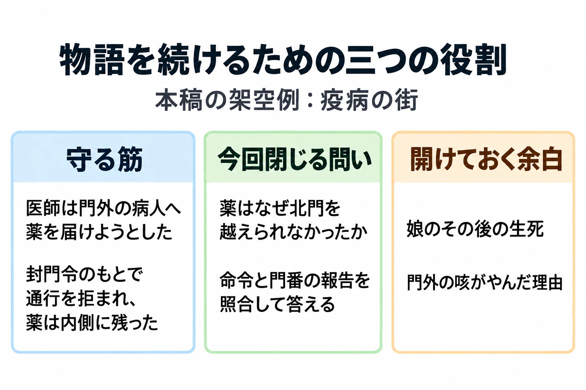

# 終わりの決まっていない物語を、どう書き続けるか――運営型タイトルの伏線・区切り・引き継ぎ

「世界設定・ロアの書き方」第6回・最終回

***

## はじめに

「次の更新では、あの街の続きを書いてください。担当は、今回からあなたです」

引き継いだのは、昔、疫病が広がった街の物語だ。北門の内側に残された白い糸の薬。通行を禁じた封門令。医師たちの組合である白糸会と、古い記録を預かる灯守。医師は北門の外にいた娘の、その後の消息を知らない。

前任者の原稿を読むと、娘へ帰りを願う言葉がある。口調表には、娘の台詞もある。では、次の更新で娘を登場させてよいのだろうか。門番の説明だけで、この街の謎に答えたことになるのだろうか。

このシリーズでは、ロア――歴史や伝承、人物や物の由来など、世界の背景を形づくる情報――を、置き場所、断片、情報の量、人物の声、設定資料という順に扱ってきた。最終回では、それらの道具を、更新を重ねる一つのタイトルの中で使う。

判断軸は、 **運営型の物語は、守る筋と、開けておく余白と、閉じる区切りを分けて書く** ことだ。

以下では、この街を運営型タイトルの一地域として扱う。街の設定、台詞、資料、追加する展開、更新予定は、すべて前5回を引き継ぐ本稿の架空例である。引き継ぎの出発点は、[第5回の設定資料](worldbuilding-lore-working-reference.md)と同じ「場面Aの直後」。白糸会の名前と役割、薬が外へ運べなかったことは提示済みで、灯守、封門令の名前、娘の事情はまだ提示していない。第5回で例示した灯守の居場所の変更は採用せず、北門の詰所のままとする。

ここから先へ進める更新案を作っていこう。扱うのは一つのタイトルの物語の続け方であり、複数タイトル間の接続は[「作品世界を『つなぐ』設計」](shared-universe-design-retrofit-versus-intent.md)に譲る。

***

## 1. 終わりの見えない物語を書くということ

運営型タイトルとは、配信後も更新やイベントを重ねていくゲームのことだ。物語も、その更新とともに続いていく。

Ubisoft Paris MobileのValentina Tamer氏によるGDC 2024の講演概要は、利益が出る限り続けることを目指すライブゲームでは、物語も際限なく続きうる形で書く必要があると説明している。講演は、テレビシリーズを参考にしたシーズンごとの構成を扱う。[[1](#ref-1)]

完結する買い切りの物語なら、最後の決断から逆算し、そのために必要な出来事を並べやすい。運営型では、タイトル全体の最後がいつ来るか決まっていなくても、次の更新は書かなければならない。そこで、遠い結末とは別に、今回の話がどこまで進むかを決める必要がある。

また、公開した文章は、プレイヤーがすでに読んだ物語になる。次の展開に都合がよいよう一行を差し替えても、その人の記憶まで差し替えられるわけではない。以後の会話や記録にも、その出来事を前提とする文章が増えていく。

修正には制作上の負担もある。2017年のGAME Watchの取材で、『ファイナルファンタジーXIV』（以下『FF14』）のプロデューサー兼ディレクター・吉田直樹氏は、更新を続けながら対応言語を増やす難しさを述べた。同作のメインシナリオを担当する石川夏子氏は、多言語同時配信では、一か所のクエスト修正でも、リリースまでに全言語を直す必要があると説明している。[[2](#ref-2)]

書く際には、 **今回見せる事実を絞り、その事実の上に次の話を載せる** と考えたい。未来をすべて決めることより、後から何を足してよいかがわかることが役に立つ。

***

## 2. 守る筋を決める

同じ2017年の取材で吉田氏は、メインストーリーは筋を決めて伏線を置いているため、流れを変えると破綻すると説明した。キャラクターの人気を理由に、メインストーリーでの立ち位置を変えたこともないという。[[2](#ref-2)] ここでいう伏線は、後の出来事につながるよう、先に置いておく手掛かりである。

自分の物語でも、まず **変えると、それまでの出来事の意味が崩れる柱** を少数だけ選ぼう。街の名前から通行人の好物まで同じ強さで固定すると、新しい書き手が動かせる部分が見えなくなる。

この街では、前5回の確定事項から次の三本を選ぶ。新たな過去を追加するのではなく、既存の事実を「この地域の続きでも守る筋」として指定する例である。

| 守る柱 | 続きを書くときの意味 |
|---|---|
| 医師は、北門の外の病人へ薬を届けようとした。そこには娘もいた。 | 薬を用意した行動には、病人への仕事と家族への思いの両方がある。後から、娘だけのためだったことにしない。 |
| 評議会は疫病の侵入を防ぐために北門の通行を禁じ、門番は医師を通さなかった。薬は内側に残った。 | 街を守ろうとする命令が、外へ向かう薬も止めた。この食い違いを、別の出来事でなかったことにしない。 |
| 医師は娘との連絡を失い、これまで描いた時点では、その後の消息を知らない。 | 待つ言葉は、答えを知らない人の言葉として保つ。後に消息が判明するなら、知る場面から先を変える。 |

第5回の資料では、それぞれを「確定」とし、根拠となる原稿へつなぐ。とくに三本目には、適用する時点が要る。「医師は永遠に娘の消息を知ってはいけない」という規則にすると、人物が新しい事実を知る展開まで閉ざしてしまう。

守る筋は、過去の行動とその意味を支える。未来の人物が何を選ぶかは、そこから書ける。

***

## 3. 開けておく余白

使う時期を決めずに、後の物語へ渡すものもある。2022年のファミ通の鼎談で石川氏は、クリスタルタワーの結末に将来の可能性を残したものの、いつ、どのように拾うかは決めていなかったと説明している。[[3](#ref-3)]

同じ鼎談で吉田氏は、設定は物語をおもしろくするために作るものであり、まだ明かしていない設定で物語を縛らないようにしていたと語った。[[3](#ref-3)] 守る筋を持つことと、未公開の案や未決定の部分を作り直すことは、両立させられる。

これは、第5回で口調表に残した、人物の変化とその時点を記録する考え方にもつながる。[第4回](worldbuilding-lore-character-voice.md)で述べたとおり、表は人物の変化を妨げる決まりにしない。過去に何を言ったかを守りながら、今度はなぜ違う言葉を選ぶのかを書けばよい。

### 答えを期待させる強さを見分ける

伏線として何度も強調した謎は、プレイヤーに「この先で答えが出る」と期待させる。一方、後から拾える余白は、その時点の場面にも意味があり、詳しい先行きには複数の道が残っている。

たとえば医師の「帰ったら、戸を叩いてくれ」という言葉は、今の場面では帰りを願う気持ちを伝える。ところが、更新のたびに正体不明の人物が戸を叩く場面で終えれば、誰なのかという答えへの期待が強くなる。後者の演出は、違いを考えるための本稿の仮案であり、今回の更新案には採用しない。

**作り手が未決定と書いただけでは、読み手の期待は弱まらない。** 回収の見込みが立たないのに、謎だけを毎回の引きに使うと、待たせる約束が増える。余白として残すなら、今の場面で伝える感情や出来事を成立させたうえで、先の答えをどれだけ期待させたかも資料へ残そう。

### 娘の生死を、今書ける範囲と一緒に残す

第5回の「医師の娘」の項目は、門外にいたことと医師の認識が確定、その後の生死が未決定である。この区別を、そのまま次の担当へ渡す。

| 次の更新での選択 | 書けることと、必要な条件 |
|---|---|
| 生死を閉じない | 医師が帰りを願った記録や、封鎖当時の娘の言葉を扱う。後年の目撃情報や新しい手紙など、生死を裏づける事実は足さない。今回の区切りは別の問いで作る。 |
| 生死を閉じる | 生存か死亡かに加え、その後に何があったか、誰がどう知るかを決める。医師が消息を知らなかった期間とつながる場面を用意し、決定者と理由を残す。 |

第4回の娘の台詞は、封鎖当時に薬が届かなかったと知った場面を想定した練習である。そこに声があることは、後年の生存の根拠にはならない。また、手紙を足す場合も、書かれた時点を確かめる。古い手紙が届くことと、現在の生存がわかることは別だからだ。

本稿の更新案では、生死を閉じない方を選ぶ。資料には「未決定」に加え、「今回扱うのは北門で薬が止まった事情。娘のその後を示す新情報は出さない」と残す。次の書き手は、相談せずに書ける範囲を持てる。

***

## 4. 閉じる区切り

運営が続く物語でも、ひとまとまりの問いには答えを出せる。『FF14』は『暁月のフィナーレ』で、ハイデリン・ゾディアーク編を完結させた。[[3](#ref-3)] タイトル全体が続くことと、一つの大きな物語が閉じることを分けた例である。

物語の完結を、サービスの終了より先に置く場合もある。任天堂とCygamesは2022年3月22日、『ドラガリアロスト』のメインストーリーを同年7月の最終章・第26章後半の追加で完結させ、その後、一定の期間を経てサービスを終了する方針を発表した。[[4](#ref-4)] 物語を閉じてから運営を畳むという順序を示した例だ。告知や法務、技術などの終了実務は、[「サービス終了をどう設計するか」](service-shutdown-design-and-practice.md)で扱っている。

自分の更新では、まず「今回、プレイヤーは何の答えを得るか」を一文にする。北門なら、 **疫病を防ぐための封鎖が、なぜ外へ向かう薬まで止めたのか** である。

### 北門の問いを閉じ、娘の消息を残す

ここからは本稿で組む架空の更新案である。第5回の場面A直後から、予定していた場面B・Cへ進み、最後に記録を読み終える短い場面を加える。薬の段階開示案も引き継ぎ、別の品へ情報を分ける第2回の代案とは混ぜない。

| 今回進めるところ | プレイヤーへ渡すもの |
|---|---|
| 場面B：北門で取り次ぎを頼む | 古い記録を預かる灯守を、詰所から呼んでもらう。 |
| 場面C：封鎖の記録を読む | 評議会の封門令と当時の門番の報告を照合する。通行禁止が医師にも適用され、薬を外へ運べなかった経緯を明かす。 |
| 薬の記録欄の「次の段」「最後の段」を開く | 調合記録と追記を発見し、病人への配布の予定、娘への呼びかけを読めるようにする。今回は両方を必須の進行に置く。 |
| 新たに加える締めの場面 | 薬が止まった事情を確かめ、灯守が命令と門番の報告を一緒に読める形で残すことを引き受ける。娘の消息は明かさない。 |

この案で明かす北門の真相は、すでに制作側で確定していた出来事である。新しい黒幕を足す必要はない。街を守るための命令が、助けを届ける行動も阻んだとわかれば、最初に見た薬瓶の意味が変わる。

締めの台詞は、たとえば次のように書ける。灯守が、記録を案内する相手へ公に説明する場面である。

> 「評議会は、疫病を入れぬために北門の通行を禁じました。門番の報告には、医師の通行を拒んだとあります。薬を届けようとした人まで止まったことが、ここから読めます。命令と報告は、一緒に読めるように残します」

記録にあることと、自分がそこから読むことを分ける、灯守の話し方を保った。そのうえで、記録をどう残すかという今回の行動を加えている。

閉じたのは、薬が北門を越えられなかった経緯と、それを調べる今回の目的である。娘の生死、門外の咳が聞こえなくなった理由は、引き続き余白に残る。北門を現在開くかどうかも、この案では決めていない。

答えを知ったうえで、この命令をどう受け止めるかはプレイヤーに委ねられる。 **出来事の答えを出すことと、その評価を一つに決めることも別** である。

***

## 5. 書き手が替わっても続ける

2022年10月9日の電撃オンラインの取材では、『FF14』のシナリオ班が、織田万里氏と石川氏を中心としたメインシナリオ制作から、二人の経験を班全体へ共有する体制へ移ったことが語られている。二人は監修に回り、複数のスタッフがメインクエストを分担する形になった。石川氏は、物語の大きな区切りを機に、従来のやり方を見直す文脈で説明している。[[5](#ref-5)]

また織田氏は、当時公開予定のヴァリアントダンジョンについて、ゲームコンテンツ班とシナリオ班の各プランナーが密接に関わって作ったと述べている。[[5](#ref-5)] 文章を引き継ぐ際も、それがどんな遊びや場面に載るかまで共有したい。

### 原稿と一緒に、判断を渡す

街の次の担当には、完成した台詞だけでなく、次の資料への入口を渡そう。以下は本稿の提案であり、『FF14』の実際の引き継ぎ書式ではない。

| 渡すもの | この街で見落としたくないこと |
|---|---|
| 第5回の設定資料 | 確定・仮・未決定を事実ごとに区別する。公開範囲、初出場面、関連項目、変更履歴、食い違いの記録も渡す。 |
| 第4回の口調表と元の台詞 | 医師は瓶の数から待つ人へ言葉を戻す。娘は次にできることを尋ねる。門番は命令から話す。住人は噂の出所を尋ねる。灯守は記録と感想を分ける。それぞれに相手と時点を添える。 |
| 守る筋と余白の一覧 | 三本の柱、娘の生死の未決定、今書ける範囲、決定が必要な場面を示す。 |
| 今回の区切りと公開予定 | 薬が止まった事情を閉じる。娘への呼びかけは提示するが、その後の消息は出さない。必須と任意の場面も区別する。 |

とくに、資料の基準地点を明記する。出発点の「場面A直後」と、今回の更新案を終えた「締めの場面の後」では、プレイヤーへ見せた範囲が違う。制作中は後者を「更新後の予定」として持ち、実際の反映を確かめてから公開記録を更新する。前の状態も残しておけば、古いあらすじを直す理由がわかる。

### 余白を閉じるときの手順

新しい担当が医師の台詞に「亡くなった娘も喜ぶでしょう」と一行足したとする。自然な補足に見えても、生死の未決定と、医師が消息を知らないという二つの前提を変えている。

このような文章を見つけたら、まず第5回の食い違いの記録に、台詞と照合した設定を残す。続けて、次の順で判断する。

1. **閉じる事実を特定する**：娘の生死なのか、医師がそれを知ったことまで含むのかを分ける。
2. **閉じる理由を決める**：今回の物語で何を描くために必要なのかを、担当と確認役で確かめる。
3. **つながる場面を用意する**：出来事の時期、知る根拠、医師の反応を、公開済みの文章と照らす。
4. **決定と反映を記録する**：決定者、日付、理由、変わる事実、直す台詞やあらすじを残す。採用しないなら、補完だったことと修正理由を残す。

決定の記録は、「娘の項目を確定にした」だけで終えない。「どの時点の生死を決めたか」「医師が知るのはいつか」「どの場面で見せるか」まで書く。そうすれば、その後の担当も、決めた答えを知らない人物の台詞を書ける。

引き継ぎで守りたいのは、前任者と同じ文章だけを書かせることより、 **過去を踏まえて新しい判断ができること** である。

***

## 6. 戻れない物語への手当て

長く続くタイトルでは、途中から来た人や、しばらく離れていた人が増える。さらに運営の変更によって、過去の物語そのものを遊べなくなる場合もある。

『Destiny 2』では、2020年11月10日の更新で、一部の地域とともに初期のストーリーキャンペーンが遊べなくなった。Bungieは事前の公式記事で、「Red War」「Curse of Osiris」「Warmind」が対象になると説明していた。[[6](#ref-6)]

2026年9月の公式発表で、Bungieは取り除いたキャンペーン、地域、レイドを戻す作業に着手すると表明した。また、それらの体験を取り除いたことが、プレイヤーの信頼と楽しさに長く影響したと認めている。[[7](#ref-7)] ここで扱うのは、2026年9月時点に示された方針である。

この事例を文章づくりへ引き寄せるなら、過去の出来事を次の話の前提にするときは、今から入る人がそこへ戻れるかまで確かめたい。[第3回のあらすじと見返し](worldbuilding-lore-unfamiliar-names.md)は、読み逃した人だけでなく、読む機会を失った人にも必要になる。

### 事情、人物の変化、元の文章へ戻る道を残す

街の例でも、仮に北門を調べる過去のクエストへ戻れなくなるなら、次の三つを用意できる。この閲覧制限も、手当てを考えるための本稿の仮定である。

| 用意するもの | 残す内容 |
|---|---|
| 次の話の冒頭で読める短いあらすじ | 薬が届かなかった事情と、これから行うこと。詳しい用語を知らなくても進める文章。 |
| 人物と出来事の見返し | 誰が何を望み、何を知ったか。医師の願いと娘の生死を混同しない。 |
| 過去の記録や場面を読める入口 | 命令、門番の報告、薬の記録欄。要約から元の言葉へ進めるようにする。 |

たとえば、今回の区切りより後に始める人へ、次の依頼を「記録を診療所へ届ける」と置くなら、導入はこう書ける。この依頼も新しく加える架空の案である。

> 疫病を防ぐために閉ざされた北門は、外の病人へ向かう医師も通さなかった。内側に残った薬の記録には、娘の帰りを願う言葉がある。その後の娘の消息はわかっていない。封鎖の命令と門番の報告を、診療所へ届けよう。

過去の答えと、残っている問いと、今の行動が分かれている。場面A直後の人には、この文章をそのまま見せない。まだ読んでいない記録や娘の事情まで先回りするためだ。第5回の公開範囲は、こうした入口の書き分けにも使える。

あらすじで事情を補えても、初めて薬を見つけ、記録を読み進めた時間まで同じにはできない。短い説明で追いつける入口を置き、可能なら元の文章や場面も残す。その二段構えにすると、次へ進みたい人と、過去を味わいたい人の両方を迎えられる。

***

## 7. 更新ごとの確認と、六つの道具

更新を書き終えたら、新しい原稿と引き継ぎ資料を並べ、短い問いを向けてみよう。

- 今使った設定は、守る筋か、開けておく余白か。
- 今回は何の問いを閉じ、どんな手応えを渡すか。
- 未決定のものを、台詞やあらすじの補足で閉じていないか。
- 閉じたなら、理由、決定者、時点と、直す範囲を残したか。
- 次の書き手へ、設定資料、口調表、守る筋と余白、今回の公開範囲を渡せるか。
- 過去の物語に戻れない人は、事情と次の目的をどこで取り戻せるか。

シリーズで育てた道具も、この確認へつながっている。

| 回と道具 | 判断軸 |
|---|---|
| [第1回：置き場所](worldbuilding-lore-narrative-placement.md) | 書き始める前に、情報の置き場所を選ぶ。 |
| [第2回：断片](worldbuilding-lore-fragment-writing.md) | 一つだけ読んでも何かが伝わり、並べると別の意味が立ち上がるようにする。 |
| [第3回：量](worldbuilding-lore-unfamiliar-names.md) | 読み手が一度に抱える「知らない名前」の数を管理する。 |
| [第4回：声](worldbuilding-lore-character-voice.md) | 口調は、型で入口を作り、その人だけの癖で人物にする。 |
| [第5回：資料](worldbuilding-lore-working-reference.md) | 決めたこと、決めていないこと、もう見せたこと、変えたことを残す。 |
| 第6回：続け方（本稿） | 守る筋と、開けておく余白と、閉じる区切りを分けて書く。 |

最初は「昔、疫病が広がった街」という一行だった。そこに情報を置く場所を選び、薬の短文を作り、名前を渡す順番を整えた。五人の声を分け、決めたことと見せたことを資料へ残した。そして今回は、北門で薬が止まった事情に区切りを付け、娘の消息を開けたまま、次の書き手へ渡せる形にした。

次の担当は、すべてを一から決め直す必要も、すべての答えを受け取る必要もない。 **ここまでは語った、ここは守る、この先は書ける。** その境目を渡すことで、同じ街の物語を、別の人の文章で続けていける。

## References

1. [Valentina Tamer「Game Narrative Summit: The Playable Series: Writing Seasonal Narratives for Live Games」][1] — GDC Vault、GDC 2024。所属はUbisoft Paris Mobile。公開されている講演概要を参照し、継続運営とテレビシリーズの構成に関する趣旨を日本語で要約した。

[1]: https://gdcvault.com/play/1034425/Game-Narrative-Summit-The-Playable

2. [石井聡（クラフル）「『FFXIV』、吉田P＆メインシナリオ石川氏インタビュー 今後の物語は、思わぬ部分が伏線になっているかも？」][2] — GAME Watch、2017年8月28日。筋と人気への対応は吉田直樹氏の説明。多言語同時配信でリリースまでに各言語を修正する具体的な説明は石川夏子氏の発言。

[2]: https://game.watch.impress.co.jp/docs/interview/1077735.html

3. [バーボン津川「『FF14』吉田直樹氏×織田万里氏×石川夏子氏シナリオ鼎談インタビュー！ 『暁月のフィナーレ』クリアー者必見！」][3] — ファミ通.com、2022年3月29日。クリスタルタワーの結末に残した可能性、未公開設定の扱い、ハイデリン・ゾディアーク編の完結を参照。リンク先には物語の詳細なネタバレを含む。

[3]: https://www.famitsu.com/news/202203/29255742.html

4. [gamebiz「任天堂とCygames、『ドラガリアロスト』のメインストーリーが7月の最終章（第26章後半）の追加をもって完結 完結後に一定の期間を経てサービス終了へ」][4] — gamebiz、2022年3月22日。両社の発表を伝えた記事。本文では、発表時点の完結とサービス終了の順序を扱う。

[4]: https://gamebiz.jp/news/345741

5. [電撃オンライン「『FF14』14時間生放送インタビュー②：個での活動が中心だったシナリオ班はチーム全体での取り組みに！」][5] — 電撃オンライン、2022年10月9日。織田万里氏・石川夏子氏の監修、複数スタッフによるメインクエストの分担、ヴァリアントダンジョンでの各班の関わりを参照。

[5]: https://dengekionline.com/articles/153016/

6. [Bungie／Cozmo_BNG「This Week at Bungie - 8/20/20」][6] — Bungie.net、2020年8月20日。2020年11月10日の変更と、初期キャンペーンがプレイできなくなることに関する公式説明。

[6]: https://www.bungie.net/7/en/News/article/49454

7. [Bungie／Poria Torkan・Josh Deane「The Next Chapter for Bungie」][7] — Bungie.net、2026年9月17日（公式ページの日付表記）。「DESTINY IS FOUNDATIONAL TO OUR FUTURE」を参照。削除した体験の影響と、キャンペーン・地域・レイドを戻す方針を日本語で要約した。2026年9月時点の発表として扱う。

[7]: https://www.bungie.net/7/en/News/Article/nextchapterofbungie

----

この文書は、Perplexity、Claude、OpenAI Codex の3つのAIの支援を受けて著述されたものです。引用画像を除き、MIT License にて提供されています。
