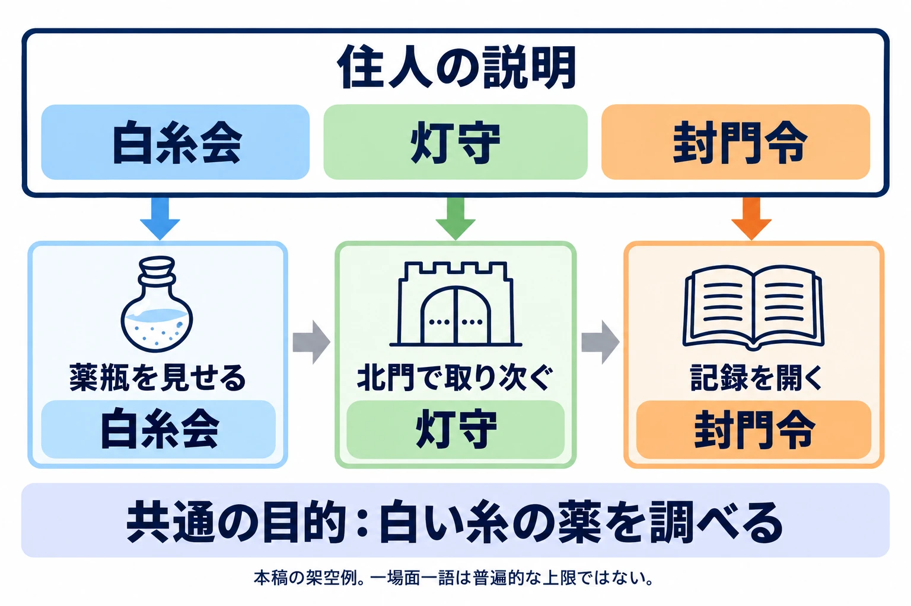

# 知らない名前は、一度にいくつまで――大量の設定を読ませる文章技法

「世界設定・ロアの書き方」第3回

***

## はじめに

「パルスのファルシのルシがパージでコクーン」というネット上で広まった言い回しは、知らない用語が連なると読み手にはこう聞こえることがある、という感覚をよく表している。

組織名、事件名、地名、役職名。書き手には一つずつ意味がある。しかし読み手は、何を指すかを考えている間にも、次の名前を渡される。情報が豊かであることと、知らない名前を一度に抱えさせることを分けて考えてみよう。

作り手自身が、その難しさを振り返る例もある。日本ファルコムの近藤季洋氏は、2025年のインタビューで『空の軌跡 FC』を改めて遊んだ印象を「設定の紹介が複雑で結構不親切」と語った。長くシリーズを作る側が、初めて触れる人へどう伝えるかを見直す文脈での発言である。[[1](#ref-1)]

[第1回「その設定は、どこに書くか」](worldbuilding-lore-narrative-placement.md)では情報の置き場所を、[第2回「一つでも読めて、並べると変わる」](worldbuilding-lore-fragment-writing.md)では短い断片の書き方を扱った。今回は、会話や文章の中で、情報をどんな順番で渡すかを考える。ロアとは、歴史や伝承、人物や物の由来など、世界の背景を形づくる情報である。

判断軸は、 **読み手が一度に抱える「知らない名前」の数を管理すること** だ。「何個まで」という上限を一律に決めるより、名前と意味が結びつく前に、次の名前を重ねていないかを見る。

第2回までの「昔、疫病が広がった街」を引き継ごう。診療所の医師は、北門の外で待つ病人へ届ける薬に白い糸を結んだ。外には医師の娘もいたが、門番は通行を拒み、薬は門の内側に残った。医師は娘のその後の消息を知らない。

主人公は、薬がなぜ届かなかったのかを調べている。そこで街の住人が、歴史も組織もまとめて話し始めたとする。

**書き直す前――街の住人の会話**

> 「灰咳禍のとき、白糸会の医師は三鐘院の封門令で北門を越えられなかった。水鏡区の診療所から運んだ白い糸の薬も内側に残った。封鎖の記録は灯守が預かっている。北門の門番に、灯守への取り次ぎを頼みな」

以下の街の会話、組織名、事件名、地名、役職名、補足文は、すべて本稿の架空例である。新しく足す設定も実在の作品に由来するものではない。実在作品のゲーム内テキストを引用せず、開発者や作家の説明を手掛かりに、この会話を書き直していく。

***

## 1. 知らない名前を数える

最初に、読み手がこの場面までに知っているものを決める。この例では、先ほど共有した北門、診療所の医師と娘、門番、白い糸の薬は知っているものとする。そのうえで、会話の初出の名前に印を付ける。

| 初出の名前 | 書き手が決めている意味 |
|---|---|
| 灰咳禍（はいせきか） | 昔、街に広がった疫病の呼び名 |
| 白糸会（しらいとかい） | 街の医師たちの組合 |
| 三鐘院（さんしょういん） | 当時、街の方針を決めていた評議会 |
| 封門令（ふうもんれい） | 疫病の侵入を防ぐため、北門の通行を禁じた命令の名 |
| 水鏡区（みかがみく） | 診療所がある地区の名 |
| 灯守（ひもり） | 街の古い記録を保管する役職の名 |

この会話では、 **新しく覚える呼び名が六つ** ある。「灯守」は二度出るが、種類としては一つと数える。ここでは厳密な品詞の区分よりも、独自の意味を覚える必要があるかを重視し、作品固有の役職名も数えている。

表を見た書き手には、もう六つとも意味がある。ところが会話だけを読む人には、「三鐘院」が人なのか建物なのか、決定を下す組織なのかさえ確かではない。設定資料を読んだ自分と、初めて台詞を見る人では、同じ一行の読みやすさが違う。

実務では、台本の初出に印を付け、「名前・初めて出る場面・そこで伝える役割」の一覧を作るとよい。分岐や任意の会話があるなら、その説明を読まずに来る経路も確認する。前の場面に書いてあっても、その人が必ず読んだとは限らない。

数えたら、今の目的に直接関わる名前を選ぼう。まずは、疫病、評議会、地区を普通の言葉に戻す。

**書き直す前**

> 「灰咳禍のとき、白糸会の医師は三鐘院の封門令で北門を越えられなかった。水鏡区の診療所から運んだ白い糸の薬も内側に残った。封鎖の記録は灯守が預かっている。北門の門番に、灯守への取り次ぎを頼みな」

**書き直した後**

> 「疫病が広がったとき、白糸会の医師は街の評議会が出した封門令で北門を越えられなかった。診療所から運んだ白い糸の薬も内側に残った。封鎖の記録は灯守が預かっている。北門の門番に、灯守への取り次ぎを頼みな」

初出の名前は、白糸会、封門令、灯守の三つになった。歴史上の呼び名や地区名は、後で必要になったときに出せる。ただし、三つなら十分読めると決まったわけではない。次は、残した名前に意味を与える。

***

## 2. 知っているものに結びつける

「白糸会は、この街の医師たちの組合だ」でも説明はできる。さらに、 **役割を先に、名前を後に** すると、初めての言葉を受け止める足場を先に渡せる。

たとえば「街の医師たちの組合、白糸会」だ。「医師」「組合」という知っている概念が先にあるので、名前を見た時点で何の仲間かをつかめる。

近藤氏も前述のインタビューで、シリーズにはオーブメントの説明がない作品もあったと振り返り、今ならイラストで例示しながら説明できると述べている。[[1](#ref-1)] ここから文章づくりへ引き寄せるなら、名前だけを渡すほかに、姿や使い方を一緒に示す方法も選べる。人物が手に持つ様子を見せれば、少なくとも道具の話だとわかる。言葉で役割を先に示すことも、そのための一つの手段になる。

**書き直す前**

> 「疫病が広がったとき、白糸会の医師は街の評議会が出した封門令で北門を越えられなかった。診療所から運んだ白い糸の薬も内側に残った。封鎖の記録は灯守が預かっている。北門の門番に、灯守への取り次ぎを頼みな」

**書き直した後**

> 「あの医師は、街の医師たちの組合、白糸会の一員だった。疫病が広がったとき、街の評議会が北門の通行を禁じたんだ。封門令と呼ばれている。医師が診療所から運んだ白い糸の薬も、門の内側に残った」  
> 「詳しく知りたいなら、封鎖の記録を預かる役の者に聞くといい。灯守という役だ。北門の門番に取り次いでもらいな」

文字数は増えたが、名前が何を指すかを推測し続ける必要は減った。「短くしたか」と「読みやすくしたか」は、別々に確かめたい。

とはいえ、まだ住人が続けて説明している。主人公が知りたいのは、薬を止めた事情と、その手掛かりだ。白糸会や灯守の説明を、この場面で一度に聞かせる必要があるかを、次に考える。

***

## 3. 説明するより、使われる場面で覚えてもらう

SF作家Jo Walton氏は、設定を一度にまとめて説明する **インフォダンプ** と並べて、本文へ情報を継ぎ目なく散らし、全体像へ積み上げる書き方を **incluing** と呼んでいる。Walton氏自身は、読み手が情報を覚えてつなぐことを高度な楽しみだと述べている。[[2](#ref-2)]

この考え方を会話に使うなら、 **その名前が誰かの行動に関わるときに出す** とよい。組合なら薬を扱う人とのつながりで、役職ならその仕事をしている人物に会うときに、命令なら何を禁じたかが見えるときに出す。

先ほどの会話を、住人との立ち話、北門での取り次ぎ、記録を読む場面に分けよう。

**書き直す前――住人が続けて話す**

> 「あの医師は、街の医師たちの組合、白糸会の一員だった。疫病が広がったとき、街の評議会が北門の通行を禁じたんだ。封門令と呼ばれている。医師が診療所から運んだ白い糸の薬も、門の内側に残った」  
> 「詳しく知りたいなら、封鎖の記録を預かる役の者に聞くといい。灯守という役だ。北門の門番に取り次いでもらいな」

**書き直した後――三つの場面に分ける**

**場面A：住人に薬瓶を見せる**

> 住人は瓶の白い糸を指でつまんだ。  
> 「あの医師の薬か。医師たちの組合、白糸会の一員だったよ。疫病で北門が閉じたとき、薬も外へ運べなくなったんだ」  
> 主人公「薬まで、どうして？」  
> 住人「封鎖の記録が残っている。北門の門番に、見せてもらえるか聞いてみな」

**場面B：北門で記録を探す**

> 主人公「封鎖の記録を見たい。白い糸の薬が、なぜここで止まったのか調べている」  
> 門番「古い記録なら、預かっている者を呼ぼう。灯守という役でね。そこの詰所にいる」

**場面C：記録を見せてもらう**

> 灯守は古い紙を広げ、一行を指した。  
> 「北門の通行を禁ずる――これが封門令だ。街の評議会が出した命令でな」  
> 主人公「薬を運ぶ医師も、通してもらえなかった？」  
> 灯守「当時の門番の報告には、通行を拒み、医師が薬を内側に置いて去ったとある」

この書き直しでは、一場面につき新しい名前を一つにした。白糸会は薬を作った医師の所属、灯守は記録を見せてくれる相手、封門令は医師の通行を阻んだ命令として登場する。名前と、その場で起きていることが結びつく。

一つという数は、この例の整理のために選んだものだ。読み手全員に共通する記憶の上限ではない。また、説明を三つの窓へ機械的に分割しただけでは、負担はあまり変わらない。薬を見せる、門へ向かう、記録を開くという行動と、主人公の疑問を間に置くことに意味がある。

分散には、読み手が情報をつなぐ手間もある。Walton氏も、それを楽しむ人と、負担に感じる人がいることに触れている。[[2](#ref-2)] この例では「白い糸の薬」と「北門」を繰り返し、何を調べていたのかを保っている。後の場面が任意なら、次へ進むために必要な事情は、必ず通る場面にも残そう。

***

## 4. 本文の外に逃がす

すべての名前に長い説明を付けると、人物が話す目的より、用語を教える目的が前に出ることがある。そこで、会話にはその場で必要な役割を残し、詳しい背景は名前から開けるようにする。

Obsidian Entertainmentの『Tyranny』には、会話中の強調された語へマウスを重ねると、背景説明を読める **lore links** がある。ゲームディレクターBrian Heins氏への取材記事では、新しく出会う人物が、なぜ自分に友好的だったり敵対的だったりするのか、その前提を補う仕組みとして紹介されている。[[3](#ref-3)]

さらに同作では、Voices of Neratという存在がこの表示欄を使い、ほかの登場人物には聞こえない形でプレイヤーへ直接語りかける。説明を載せる場所そのものが、人物の不気味さを伝える語りの場にもなるのである。[[3](#ref-3)]

ここで取り入れたいのは、 **知りたい語から、その場で補足へたどれること** だ。第1回で扱った図鑑との違いは、会話の該当箇所が入口になる点にある。図鑑に同じ文章があっても、自分でメニューを開き、名前を探す設計とは読む手順が変わる。

場面Aの白糸会に、短い補足を付けてみよう。

**書き直す前――所属の説明も会話で読む**

> 住人「あの医師の薬か。医師たちの組合、白糸会の一員だったよ。疫病で北門が閉じたとき、薬も外へ運べなくなったんだ」

**書き直した後――会話と補足を分ける**

> 住人「あの医師の薬か。白糸会の医師たちも、門を越えられなかった。疫病で北門が閉じたときのことだ」  
> 主人公「薬まで、どうして？」  
> 住人「封鎖の記録が残っている。北門の門番に、見せてもらえるか聞いてみな」

| 会話から開く語 | 補足欄の文章 |
|---|---|
| 白糸会 | 街の医師たちの組合。診療所の医師も所属していた。白い糸の薬は、その医師が北門の外の病人へ届けようとしたものである。 |

会話だけでも、医師たちが通れなかったこと、薬について調べる手掛かりが北門にあることは伝わる。補足を開くと、組合と医師の関係までわかる。補足文の中も、役割から書き始め、説明のために別の未知の名前を増やさない。

この時点の補足には、医師の娘の消息や、外の咳がやんだ理由を追加していない。知るための入口を増やす際も、その段階で明かす範囲をそろえる必要がある。

名前の説明を全部別欄に移し、台詞だけでは誰が困っているかもわからなくなると、補足を開くことが義務になる。会話だけを続けて読み、「何が起きたか」「何をしたいか」がつかめるかを確かめよう。

***

## 5. 読み逃した人が戻れる道

会話を読みやすくしても、途中で席を外す人や、先へ進みたくて飛ばす人はいる。しばらく遊ばずに戻り、人物や目的を忘れることもある。そうした人へ、 **今の物語に追いつくための短い入口** を用意する。

『原神』は2026年1月13日の公式告知で、翌14日の「Luna Ⅳ」更新に伴う新しい「任務一覧」と「思い出のシーン」を案内した。告知画像では、「旅の軌跡」でこれまでの物語のつながりや開放条件を確認できること、「思い出のシーン」ではゲーム内でストーリームービーを直接再生して見返せることが説明されている。[[4](#ref-4)]

物語のつながりを確かめることと、場面をもう一度見ることは、違う戻り方である。そこへ短いあらすじがあれば、まず目的を思い出し、気になった場面だけ見返すという使い方も考えられる。

あらすじを書く際の手掛かりになるのが、Cygamesの坂本正吾氏によるCEDEC 2019の講演である。GAME Watchの取材記事では、モバイルゲームのあらすじはストーリーを飛ばす人のためにあることが多く、その後どこへ進んでほしいかによって内容を変えるべきだと紹介されている。[[5](#ref-5)]

場面Aを読み逃し、これから北門へ行く人に向けて書いてみよう。

**書き直す前――名前を並べたあらすじ**

> 白糸会と封門令の関係を知った主人公は、灯守を訪ねることになった。

**書き直した後――事情と次の行動を残す**

> 疫病で北門が閉ざされ、医師の薬も外へ届かなかった。なぜ薬まで止められたのかを調べるため、北門へ向かい、門番に当時の記録を見せてもらえるか聞こう。

前の文は、名前を知っている人には短くまとまって見える。しかし会話を飛ばした人には、誰に何をしに行くのかがつかみにくい。後の文は、薬が届かなかった事情、調べる疑問、次の行き先を残した。場面Aでまだ出していない灯守の名前も先回りしていない。

あらすじは、進行に合わせて更新する。記録を読んだ後なら、判明したことと次の目的を書く。まだ知らない娘の消息を、要約だからと確定させることは避けたい。

操作やシステムを学び直す設計は、[「チュートリアル設計の罠」](tutorial-design-overteaching-vs-neglect.md)の「見返せる設計」で扱った。物語へ戻るための文章では、「何をしようとしていたか」「なぜそうするのか」を取り戻せるかが確認点になる。

***

## 6. 確認の問い

書き上げた会話を、設定資料を伏せて読んでみよう。できれば、その設定を知らない人に読んでもらい、「今、何を調べに、どこへ行くのか」を聞く。名前を正確に暗唱できるかより、場面の目的が伝わったかを確かめる。

- 初出の名前はいくつあるか。任意の説明を読まずに来た人には、いくつになるか。
- 名前より先に、役割や使い道が伝わるか。
- 今この場面で必要な名前だけか。後の行動と一緒に出せるものはないか。
- 場面を分けた後も、共通する物や目的をたどれるか。
- 知りたい人が、その語から補足へ進めるか。補足を開かなくても、会話の目的はわかるか。
- 読み逃した人が、事情と次の行動を取り戻せるか。あらすじに未知の名前や先の答えを詰め込んでいないか。

***

## References

1. [AUTOMATON JP「『空の軌跡 the 1st』は、『大ボリュームリメイク』であり『初心戻り』であり『続きも用意』。日本ファルコム近藤季洋社長に訊いた、人気作再誕の裏側」][1] — AUTOMATON、2025年9月1日。「『軌跡』シリーズの間口を広げたい」節の近藤季洋氏の発言。

[1]: https://automaton-media.com/articles/interviewsjp/kiseki-20250901-355966/

2. [Jo Walton「SF reading protocols」][2] — Reactor（旧Tor.com）、2010年1月18日。incluingの説明と、読み手が情報をつなぐ楽しさ・負担について、英語原文の趣旨を日本語で要約。

[2]: https://reactormag.com/sf-reading-protocols/

3. [Bryant Francis「Tyranny's unique solution for streamlining storytelling: lore links」][3] — Game Developer、2016年12月5日。Brian Heins氏への取材に基づくlore linksとVoices of Neratの説明。英語原文の趣旨を日本語で要約。

[3]: https://www.gamedeveloper.com/design/-i-tyranny-s-i-unique-solution-for-streamlining-storytelling-lore-links

4. [原神公式「新しい『任務一覧』画面が登場！『思い出のシーン』機能も同時に実装」][4] — 原神公式サイト、2026年1月13日。告知本文および画像内の「旅の軌跡」「思い出のシーン」の説明を参照。翌1月14日の更新に向けた告知。

[4]: https://genshin.hoyoverse.com/ja/news/detail/162126

5. [安田俊亮「今すぐ使える！ Cygames流、シナリオ“じゃない”ゲームテキストでプレイを盛り上げる鉄則」][5] — GAME Watch、2019年9月6日。CEDEC 2019における坂本正吾氏の講演を取材した記事。「あらすじの鉄則」を参照。

[5]: https://game.watch.impress.co.jp/docs/news/1205688.html

----

この文書は、Perplexity、Claude、OpenAI Codex の3つのAIの支援を受けて著述されたものです。引用画像を除き、MIT License にて提供されています。
