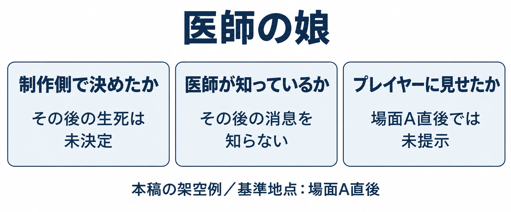

# その設定は、もう見せたか――書き手のための設定資料の作り方

「世界設定・ロアの書き方」第5回

***

## はじめに

「医師の娘は、生きていると決めたのだったか」「白糸会という名前は、もうプレイヤーに見せたか」。次の会話を書こうとして、前の原稿を開き直す。薬の説明文には娘のことが見当たらず、手帳には帰りを待つ言葉がある。住人の会話には、書き直す前と後の案が残っている。

前4回で扱った「昔、疫病が広がった街」にも、設定が増えてきた。北門、白い糸の薬、封門令、診療所の医師と娘。さらに白糸会や灯守という名前、5人の話し方まである。自分で書いたものでも、決めたことと案のままのことを、記憶だけで分け続けるのは難しい。

[第1回「その設定は、どこに書くか」](worldbuilding-lore-narrative-placement.md)では情報の置き場所を選んだ。その後、[第2回の裏メモ](worldbuilding-lore-fragment-writing.md)、[第3回の初出一覧](worldbuilding-lore-unfamiliar-names.md)、[第4回の口調表](worldbuilding-lore-character-voice.md)を作ってきた。今回は、それらを一つの設定資料として使えるようにまとめる。シリーズでいうロアとは、歴史や伝承、人物や物の由来など、世界の背景を形づくる情報である。

判断軸は、 **設定資料は、決めたことだけでなく、決めていないこと・もう見せたこと・変えたことを残す** というものだ。

以下の街、人物、台詞、資料の記入例は、すべて前4回を引き継ぐ本稿の架空例である。各回の書き直し案は選択肢として扱い、今回採用する案と、記録上の進行地点をその都度示す。資料の欄と運用方法は本稿の提案であり、紹介する企業の実際の書式ではない。

扱うのは、文章を書く人が制作中に参照する内部資料である。プレイヤーへ公開する年表や作品間の接続については、[「作品世界を『つなぐ』設計」](shared-universe-design-retrofit-versus-intent.md)で扱っている。

***

## 1. 書き溜めた設定が、書くための道具にならない理由

たとえば、「医師の娘は北門の外にいた」という文章が一行だけ残っているとする。出来事はわかる。しかし、後の消息まで決まっているか、プレイヤーは娘の存在を知っているか、どの原稿に書いたかは、この一行からはわからない。

設定の説明に加えて、 **次の文章を書くための判断材料** が要る。「これはもう書いてよいか」「前にどう書いたか」「変わったのはいつか」に答えられると、資料を開いた意味が生まれる。

Kingでナラティブデザインのリードを務めていたTracey John氏は、GDC 2019の講演で、プレイヤーは人物らしくない振る舞いや、その世界にそぐわない点に気づくと説明した。Game Developerの講演記事によると、同氏らは設定資料を使って作品間や翻訳間の一貫性を保っていた。その資料は巨大で読み込みに時間がかかる一方、とても役立つものだったという。[[1](#ref-1)]

情報を蓄える価値と、蓄えた情報を使う重さは、同時に増え得る。そこで、物語の長い説明をさらに足す前に、一件ずつ同じ問いで引ける形へ整えてみよう。

***

## 2. 一項目に持たせる欄

まずは「名前」「中身」「状態」の三つから始める。状態は、制作側で採用したものを「確定」、候補を置いているものを「仮」、まだ答えを選んでいないものを「未決定」とする。確定した設定も後で変えられるが、変更した事実を残す。

そこへ、公開範囲、初めて出した場面、関連する項目、変更履歴を加える。七つの欄の役割は、次のようになる。

| 欄 | 書くこと |
|---|---|
| 名前 | 探すときの見出し。必要なら読み方も添える。 |
| 中身 | 今、その項目について決めていること。 |
| 状態 | 確定・仮・未決定。事実ごとに違うなら分けて書く。 |
| 公開範囲 | どの進行地点で、何をプレイヤーへ見せるか。制作内だけの情報も区別する。 |
| 初めて出した場面 | 名前や事実を最初に出す場面と、元の文章の所在。予定なら「予定」と書く。 |
| 関連する項目 | 一緒に読み直す人物、物、出来事、口調表などへの参照。 |
| 変更履歴 | いつ、何を、なぜ変えたか。変更前の内容もたどれるようにする。 |

規模の大きな実例として、『Star Wars』の設定データベース「Holocron」がある。管理者Leland Chee氏の2012年の記事によれば、2000年1月、Lucas Licensingの出版部門向けに作られ、 **2012年7月の記事時点で5万5000件超** の項目を収めていた。物語、食い違い、画像、諸元に加え、発音、翻訳、衣装の差分、制作の舞台裏まで記録し、年表、綴りの辞書、スタイルガイドなどの資料も整備していた。[[2](#ref-2)]

この事例から、小さな制作へ持ち帰れるのは、必要に応じて欄を増やす考え方だ。読み方で迷うなら読みを、同じ名前の使い分けで迷うなら呼称の条件を加える。最初から全項目を埋め尽くそうとするより、書くときに探した情報を残す方が続けやすい。

### 「疫病の街」を三項目から整理する

ここでは、第2回の「調合記録を集めると読める段が増える案」と、第3回の場面A・B・Cへ名前を分散する案を採用する。第2回の「三つの品へ分ける案」は別案として残す。

記入の基準地点は、 **薬の最初の段を読めるようになり、場面Aの住人との会話を終えた直後** とする。まだ場面B・Cへ進まず、調合記録の追加分も開いていない。この進行例自体も本稿の仮定である。

表が横に長くならないよう、ここでは項目を列、欄を行にして並べる。

| 欄 | 白い糸の薬 | 封門令 | 医師の娘 |
|---|---|---|---|
| 名前 | 白い糸の薬 | 封門令（ふうもんれい） | 医師の娘。固有の名前は未設定。 |
| 中身 | 診療所の医師が北門の外の病人へ届けようとした薬。瓶に白い糸を結んだが、通行を拒まれ、門の内側に残した。 | 疫病の侵入を防ぐため、街の評議会が北門の通行を禁じた命令。 | 北門の外で待つ人々の中にいた。医師は、その後の娘の消息を知らない。 |
| 状態 | 記載した来歴は確定。 | 記載した命令の内容は確定。 | 門外にいたことと医師の認識は確定。その後の生死は未決定。 |
| 公開範囲 | 最初の段で薬の名と届け先を提示。場面Aで外へ運べなかったことを提示。娘との関係は未提示。 | 場面Aでは北門が閉じた事情まで。命令の名と詳しい記録は未提示。 | この進行地点では未提示。生死は制作側でも未決定。 |
| 初めて出した場面 | 第2回・段階開示案「最初の段」。札に「北門の外へ」。 | 名前は第3回・場面Cで提示予定。 | 薬の記録欄「最後の段」で娘への呼びかけを提示予定。 |
| 関連する項目 | 医師、医師の娘、北門、封門令、白糸会 | 北門、街の評議会、当時の門番、灯守 | 医師、白い糸の薬、娘の口調表 |
| 変更履歴 | 初回整理。段階開示案を採用し、品ごとの分割案と区別。 | 初回整理。場面Cで名前を出す案を採用。 | 初回整理。生死の未決定を明記。 |

一つの人物に、確定した事実と未決定の事実が同居していてよい。「医師の娘」という項目全体を確定扱いにすると、生死まで決まったように見える。 **状態は、項目の中のどの事実にかかるかまで書く。**

***

## 3. 決めていないことを書く

未決定の欄には「未決定」と書く。空欄だけでは、まだ考えていないのか、書き忘れなのか、別の資料に答えがあるのかを区別できない。

娘については、「その後の生死は未決定。医師は消息を知らない」と一組で残す。前半は作り手の決定状況、後半は作中人物が知っている範囲である。[第2回](worldbuilding-lore-fragment-writing.md)で扱った「知っていて省くこと」と「知らないために省くこと」の違いを、ほかの書き手も読める形にする。

さらに、先ほどの資料へ「今書ける範囲」と「決定が必要になる場面」を足そう。

| 医師の娘に追加する欄 | 記入例 |
|---|---|
| 今書ける範囲 | 医師が帰りを願う記述。娘の、封鎖当時に薬が届かなかったと知った時点の台詞。 |
| 決定が必要になる場面 | 後年の再会、死亡の断定、生存を裏づける新しい手紙の到着など。その後の消息を確定させる場面。 |
| 決める際に一緒に確認すること | いつの出来事か。誰が、どのように知るか。医師が消息を知らない期間と両立するか。 |

[第4回の娘の台詞](worldbuilding-lore-character-voice.md)は、封鎖当時の発言を想定した練習だった。台詞が存在することだけを根拠に、現在も生きていると読み替えてはいけない。代表例には「封鎖当時」と添えれば、使える時点がわかる。

未決定を明記すると、別の書き手が、自然な補足のつもりで結末を決めてしまうことを防ぎやすい。一方、帰りを待つ医師の会話まで止める必要もなくなる。どこまでなら今書けるかが見えるからだ。

***

## 4. もう見せたことを書く

制作側で確定した情報には、まだプレイヤーへ見せていないものもある。そこで公開範囲の欄を、「提示する場面」「そこで伝える範囲」「まだ伝えないこと」へ広げる。

第3回の初出一覧を、この資料の公開記録として取り込もう。基準地点は、引き続き場面Aの直後である。

| 項目 | 名前を初めて提示する場面 | そこで伝える範囲 | 基準地点での扱い |
|---|---|---|---|
| 白糸会（しらいとかい） | 場面A：住人に薬瓶を見せる | 街の医師たちの組合で、診療所の医師も一員だった。 | 名前と役割を提示済み。 |
| 灯守（ひもり） | 場面B：北門で記録を探す | 古い記録を預かる役職。詰所にいる者へ取り次ぐ。 | 未提示。場面Bで提示予定。 |
| 封門令 | 場面C：記録を見せてもらう | 評議会が出した北門の通行を禁じる命令。当時の門番の報告も読む。 | 名前は未提示。場面Cで提示予定。 |

白糸会の名前は場面Aで出た。灯守と封門令は、その後に出す予定である。こうして並べれば、場面A直後のあらすじに「灯守から封門令の話を聞いた」と書く食い違いを見つけられる。名前を設定資料で知っていることと、その場面までに提示したことを分けられる。

同じ欄へ、第2回の段階的な開示も加えられる。

| 白い糸の薬の公開記録 | 読めるようになる内容 | そこから確定させないこと |
|---|---|---|
| 最初の段 | 薬の名と、札の「北門の外へ」という届け先。 | 外で誰が受け取ったか。 |
| 次の段：調合記録の発見後 | 門外の病人への配布と、空き瓶を回収する予定。 | 実際に配布や回収が完了したこと。 |
| 最後の段：追記の発見後 | 「娘へ。空き瓶は返さなくていい。帰ったら、戸を叩いてくれ」という呼びかけ。 | 娘が帰ったこと、手紙を読んだこと、その後の生死。 |

これで、「医師の娘」という関連項目から、内部の事実と公開する文章の両方へ戻れる。白糸会の補足欄を作る人も、資料の中身を丸ごと転載せず、その進行地点で出してよい範囲を選べる。場面Aの補足に娘の事情を足すと、別に用意した開示の順番が崩れる。

ここでいう「提示済み」は、全員が読んで覚えたという意味ではない。任意の記録なら「入手後に閲覧可能」、必須会話でも「スキップ可能」など、接し方を添える。分岐があるなら、どの経路で提示するかも残す。「ゲームのどこかに書いた」を「今この人が知っている」に置き換えないためである。

制作中は、予定と実際の反映も分けたい。場面Cの台本へ書いた段階なら「提示予定」、ゲームへ組み込んで表示を確認したら「反映確認済み」とする。 **物語のどこで見せるかと、制作上どこまでできたかは、別々に記録する。**

***

## 5. 変えたことと食い違いを書く

資料を直すときは、新しい内容に加えて、変更前、変更日、理由を残す。前の台本を読んだ人が、新しい資料との違いを説明できるようにするためだ。

たとえば今後、灯守の居場所を「北門の詰所」から「北門に隣接する記録室」へ変えるとしよう。記録を読む専用の場面を設けるため、という変更である。 **これは変更履歴の書き方を示す仮定であり、前4回やここまでの採用設定を変更するものではない。**

| 変更履歴に残す欄 | 記入例 |
|---|---|
| いつ | 制作上の9月30日、第2稿の確認時。日付も本稿の仮定。 |
| 対象 | 灯守の居場所。 |
| 変更前 → 変更後 | 北門の詰所 → 北門に隣接する記録室。 |
| 理由 | 記録を広げて読む専用の場面を設けるため。 |
| 直す範囲 | 場面Bの門番の案内、場面Cの場所、目的表示、背景の配置資料。 |
| 過去の提示への対応 | すでに公開した版があるなら、旧版の案内文と公開時点を保存し、修正対象を確認する。 |
| 反映状況 | 台本修正済み、目的表示と背景は確認待ち、のように分ける。 |

設定資料だけを変えても、門番が「そこの詰所にいる」と案内したままなら、プレイヤーは旧設定へ向かう。関連する項目の欄は、このとき見直す範囲を探す手掛かりになる。

### 食い違いを見つけた段階でも残す

Chee氏の記事では、Holocronが食い違いも記録していた。[[2](#ref-2)] 自分の資料にも「食い違い」の欄を用意し、見つけた人が、該当する二つの記述と確認状況を残せるようにしよう。

たとえば、新しい台本の医師に「娘はあの晩に死んだ」と書かれていたとする。現在の設定との食い違いは、次のように記録できる。この台詞も、誤記の発見を想定した架空例である。

| 食い違いの記録 | 記入例 |
|---|---|
| 見つかった文章 | 追加台本の医師の台詞「娘はあの晩に死んだ」。 |
| 照合した設定 | 娘の生死は未決定。医師はその後の消息を知らない。 |
| 判断前の扱い | 要確認。新しい設定として採用しない。 |
| 確認すること | 意図した設定変更か、書き手の補完か。医師が知る出来事を追加する予定があるか。 |
| 対応後に残すこと | 誤記なら台詞を修正し、その理由を残す。設定変更なら、決定者と影響範囲を変更履歴へ記す。 |

一方、第2回の「薬が積まれた晩から外の咳が聞こえなくなった」という住民の噂は、話し手の受け取り方として書かれていた。薬が原因だと確定した記述にはしない。「噂として意図した差」と記録すれば、後の担当者が街の歴史として転記したり、誤りだとして消したりすることを避けられる。

食い違いを残す目的は、矛盾を放置することではない。 **何を見比べ、どう判断したかを、次の人がたどれるようにすること** である。

### 今の設定から外しても、過去の資料は残せる

『Star Wars』は2014年、創作を統括・調整するLucasfilm Story Groupの設置と、従来のExpanded Universeの作品群を「Legends」として区別する方針を公式に説明した。同時に、新作の作り手は、その豊富な内容を引き続き全面的に参照できるとしていた。[[3](#ref-3)]

資料づくりへ引き寄せれば、正史――現在の物語で基準とする設定――から外すことと、資料から消すことは別だと考えられる。自分の制作でも、採用を取りやめた案は「旧案・現在は不採用」と明記して残せる。現行の説明とは区別し、検索で見つけた人がそのまま使わないようにする。

ファイルを過去の状態へ戻す仕組みは、[「GitやSVNだけではなぜ苦しくなるのか」](version-control-and-asset-management-for-game-development.md)で扱っている。設定資料には、それに加えて「なぜこの設定を変え、どの文章まで直すことにしたか」を残したい。

***

## 6. チームで使う

書き手が増えたら、資料に「更新する人」「確認する人」「確認日」を加える。少人数なら兼任でよい。誰が追記してよいか、誰の確認で仮から確定へ移るかがわかれば、相談先を探す時間が減る。

John氏の講演を伝えた記事では、ローカライズチームとともに設定資料を保ち、用語や命名を初めに決めて記録することが紹介されている。[[1](#ref-1)] 名前の読みや呼び方まで共有すると、別の言語に移す人も、同じ人物や組織を同じものとして扱いやすい。

長期運営では、照合する量そのものが課題になる。Cygamesの立福寛氏によるCEDEC 2026の講演を報じたGameBusiness.jpの記事は、新しい人物の設定と既存人物の追加情報が蓄積し、全体の把握が難しくなる状況を紹介している。そこで、Confluenceという共同編集用の文書管理ツールにある人物設定から必要な情報を取り出し、シナリオとの矛盾をAIで検出する仕組みが試作された。ただし、記事時点では管理方法の違いなどが課題となり、本格運用には至っていない。指摘を採用するかは、書き手の判断も必要だとされている。[[4](#ref-4)]

小さなチームでも、まず人が照合できる形へ資料をそろえられる。表計算なら一つのファイルに用途別のシート、Wikiなら共通の目次からたどれるページを作ればよい。一つにまとめるとは、すべてを一枚の巨大な表へ押し込むことではない。同じ項目から、必要な記録へ迷わず戻れるようにすることである。

### 裏メモ、初出一覧、口調表を同じ入口へつなぐ

「疫病の街」の資料なら、最小構成は次のようになる。

| 資料のまとまり | 入れるもの | 項目どうしのつなぎ方 |
|---|---|---|
| 設定一覧 | 2章の七つの欄。未決定のことと、今書ける範囲も置く。 | 白い糸の薬から、医師、娘、北門、封門令へ。 |
| 公開記録 | 初出の場面、段階ごとの開示、閲覧条件、元の文章。 | 白糸会から場面Aへ。娘から薬の最後の段へ。 |
| 人物の口調 | 第4回の口調表と代表例。相手と物語の時点を添える。 | 医師や娘の設定から、それぞれの話し方へ。 |
| 変更・食い違いの記録 | 変更理由、影響する文章、判断待ちと対応済みの記録。 | 問題の記述から、照合した設定と修正後の原稿へ。 |

名前が変わる可能性のある項目には、表の番号など、変えない目印を付けてもよい。長い裏メモや口調表は一か所に置き、各場面の台本から参照する。同じ説明を何度もコピーすると、片方だけ直したときに、新たな食い違いが生まれる。

第4回の5人の口調は、人物項目から次のように引ける。ここでは資料に入れる要点だけを抜き出し、一人称や相手ごとの呼び方、台詞全文は元の口調表へつなぐ。

| 人物 | 口調表への入口に残す要点 | 一緒に残す条件 |
|---|---|---|
| 医師 | 聞き手には丁寧。瓶の数から、待つ人の数へ言い直すことがある。 | 娘への手帳の呼びかけは短い常体。消息を知らない範囲を守る。 |
| 娘 | 出来事を短く受け止め、次にできることを尋ねる。 | 代表例は封鎖当時。その後の生存を示す台詞ではない。 |
| 門番 | 命令と通行から話し、普段は自分の判断を後へ回す。 | 代表例は当時通行を拒んだ門番。「私が止めた」へ変わるなら、その場面を記録する。 |
| 住人 | 聞いた話を持ち出し、出所を尋ねる。 | 聞いただけのことを「見た」と言わない。住人全員の癖にはしない。 |
| 灯守 | 記録の記述と自分の感想を分ける。 | 公の説明は敬語。親しい相手には常体へ動く。 |

担当の決め方も、小さく始められる。新しい会話を書いた人が、使った設定と公開記録を追記する。確認役が未決定の断定や、開示の先回りを確かめる。修正があれば、原稿と資料を一緒に直し、確認日を残す。一人で書く場合も、執筆後にこの確認を行えば、後日の自分へ判断を引き継げる。

視覚の設定と接する項目は、[アートバイブルとスタイルガイド](game-art-direction-style-guide-basics-for-planners.md)にもつなぐ。白い糸の薬なら、文章で決めた目印が、薬瓶の絵にもあるかを確認する。背景担当へ渡す資料にも同じ項目への参照を付ければ、変更時に知らせる相手がわかる。

***

## 7. 確認の問い

書き始める前は、今回登場する人物や物の項目を開く。書き終えた後は、新しい文章から資料へ戻る。前者では使える情報を選び、後者では今回決めたことと見せたことを残す。

**書き始める前**

- これは確定か、仮か、未決定か。どの事実についての状態か。
- この人物は、その時点で何を知っているか。
- この進行地点で、プレイヤーにはどこまで見せたか。任意の記録を読まない経路でも通じるか。
- 前にどう書いたか。元の台詞と、その相手・時点へ戻れるか。

**書き終えた後**

- 未決定のことを、補足やあらすじで確定させていないか。
- 新しく出した名前や事実を、公開記録へ足したか。
- 変えたなら、いつ、何を、なぜ変えたかと、直す範囲を残したか。
- 食い違いを見つけたら、該当箇所と判断待ちの内容を残したか。対応後の結論も追えるか。
- 次に書く人は、誰に確認すればよいかわかるか。

## References

1. [Alissa McAloon「Crash meetings, keep a lore bible, and other narrative design tips learned at King」][1] — Game Developer、2019年3月22日。KingのTracey John氏によるGDC講演の取材記事。一貫性、設定資料、ローカライズチームとの共有、用語・命名の記録についての説明を日本語で要約した。

[1]: https://www.gamedeveloper.com/design/crash-meetings-keep-a-lore-bible-and-other-narrative-design-tips-learned-at-king

2. [Leland Chee「What is the Holocron?」][2] — StarWars.com、2012年7月20日。管理者本人による内部データベースの説明。成立時期、項目数、記録対象と付随資料を参照。5万5000件超はこの記事の公表時点の数値。

[2]: https://www.starwars.com/news/what-is-the-holocron

3. [StarWars.com「The Legendary Star Wars Expanded Universe Turns a New Page」][3] — StarWars.com、2014年4月25日。Story Groupの設置、Legendsとしての区別、新作の作り手が従来の内容を参照できることに関する公式発表。

[3]: https://www.starwars.com/news/the-legendary-star-wars-expanded-universe-turns-a-new-page

4. [気賀沢昌志「方言、特有の言い回し、誤字をサポートするCygamesのシナリオ執筆支援AIツールはこうして開発された【CEDEC2026】」][4] — GameBusiness.jp、2026年9月2日。Cygames・立福寛氏の講演取材記事。「キャラ設定とシナリオの矛盾点を検出する」を参照。本格運用前という説明は、この矛盾検出の仕組みについてのもの。

[4]: https://www.gamebusiness.jp/article/2026/09/02/27866.html

----

この文書は、Perplexity、Claude、OpenAI Codex の3つのAIの支援を受けて著述されたものです。引用画像を除き、MIT License にて提供されています。
