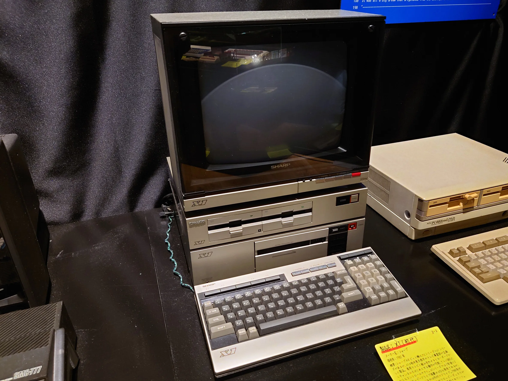
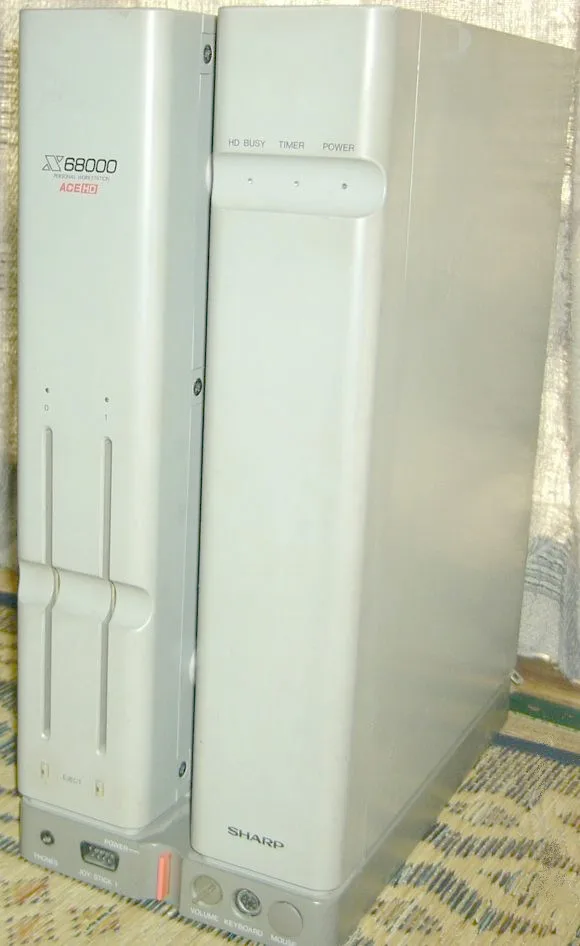
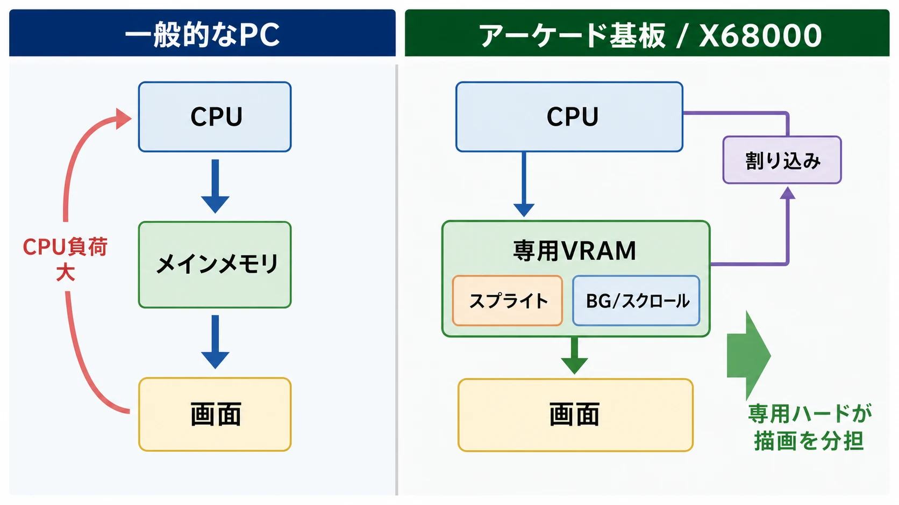
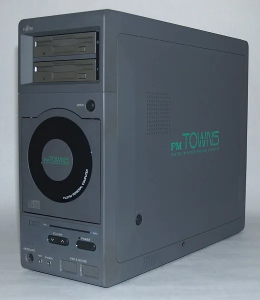
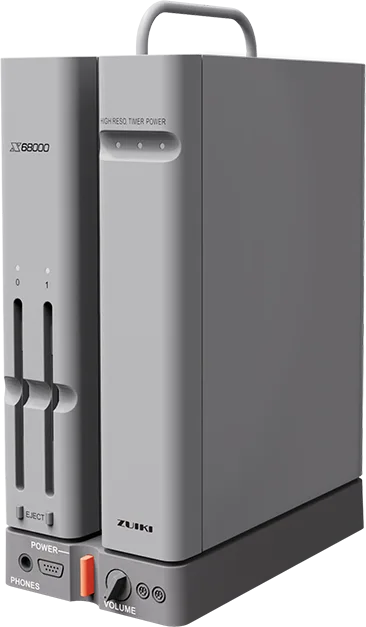

# X1/X68000シリーズの歴史：アーケードへの憧れが作ったホビーPC文化

## はじめに：これは「最強スペック機」の話ではなく、誰に向けて何を開いたかの話である

1980年代の日本のパソコン史を見ると、NECのPC-8801、PC-9801が市場標準として語られやすい。日本語処理、販売店、ソフト資産、業務用途を含むプラットフォームとして見れば、それは自然な整理である。

しかし、シャープのX1とX68000は、その標準化競争とは少し違う場所にいた。X1はテレビとの親和性、BASICをROMに固定しない「クリーンコンピュータ」的な思想、PCGなど、ホビー用途で触って遊ぶための余白を重視した。X68000はさらに踏み込み、CPU、スプライト、スクロール、FM音源、ADPCM、マウス、ジョイスティック、標準的な高性能ディスプレイ環境を組み合わせ、パソコンでできるゲーム表現の上限を押し上げようとした。

本稿では、X1を「PC-8801に勝てなかった前史」として片づけず、X68000を「高価な趣味機」としてだけ見ない。ゲームプランナー向けに言えば、これは **市場標準になれなかったプラットフォームが、なぜ制作文化の記憶には強く残ったのか** という話である。

***

## 年表

| 年 | 出来事 |
|---|---|
| 1978 | シャープがセミキット型のMZ-80Kを発売。シャープMZ系の出発点となる[[1](#ref-1)] |
| 1981 | NECがPC-8801を発売。ホビーPC市場で大きな存在になる |
| 1982 | シャープX1登場。テレビとの親和性、クリーンコンピュータ思想、ホビー向け表現を前面に出した |
| 1982 | NECが16ビット機PC-9801を発表。ビジネス向け日本語処理とカラーグラフィックを備えたPC-98系が伸び始める[[2](#ref-2)] |
| 1986 | シャープがMC68000採用の16ビットパソコンX68000を発表[[1](#ref-1)] |
| 1987 | X68000が発売。高度なグラフィック、AV機能、マンハッタンシェイプで注目を集めた[[3](#ref-3)] |
| 1989 | 富士通がFM TOWNSを発表。世界で初めてCD-ROMドライブを標準搭載した32ビットハイパーメディアパソコンと説明される[[4](#ref-4)] |
| 1990 | IBM JapanがDOS/Vを発表。日本語表示を専用ハードからソフトウェア処理へ寄せる転換点となる[[5](#ref-5)] |
| 1993 | X68030登場。X68000系は68030世代まで続く[[3](#ref-3)] |
| 1995 | Windows 95出荷。国内PC市場はPC/AT互換機とWindows中心へ大きく寄っていく[[1](#ref-1)] |
| 2000年代以降 | Human68k、IPL-ROM、純正Cコンパイラ、SX-WINDOWなどの関連ソフトウェアが無償公開資料として整理され、エミュレータ文化や保存活動の基盤になる[[6](#ref-6)] |
| 2022 | 瑞起がX68000 Zを発表。初代モデルから35年後の復刻プロジェクトとして、X68000文化の再評価を可視化した[[7](#ref-7)] |

***

## 第1章：X1――PC-8801と同じ土俵にいながら、少し違う遊び方を狙った

X1は、1982年に登場したシャープのホビー向けパソコンである。同時期のNEC PC-8801が、BASIC、ソフト資産、販売網、後のFM音源強化を通じて国内ホビーPCの中心へ伸びていったのに対し、X1はテレビや映像との親和性、自由に触れるための設計思想を強く打ち出した。

画像出典: [File:Sharp X1 computer set.jpg](https://commons.wikimedia.org/wiki/File:Sharp_X1_computer_set.jpg) / Darklanlan / [CC BY 4.0](https://creativecommons.org/licenses/by/4.0/)

当時のシャープには、すでにMZシリーズがあった。MZ-80Kは1978年に発売されたシャープの初期パソコンであり、コンピュータ博物館の年表にもセミキットMZ-80Kとして記録されている[[1](#ref-1)]。MZ系は、学校、研究室、小規模業務、プログラミング学習を含む「コンピュータとして使う」側面が強かった。一方、X1はホビー・ホビイスト向けに、テレビ的なAV表現、ゲーム、表示の遊びを前面に出した機械として位置づけられる。

ここでいう「ホビイスト」とは、完成品ソフトを買うだけの消費者ではない。BASICを読み、雑誌のリストを打ち込み、文字パターンを差し替え、周辺機器を増やし、他機種との差を楽しむユーザー層である。X1の特徴として語られるPCGは、キャラクタ表示の形をユーザー側で定義できる仕組みであり、今日のゲーム開発で言えば、限られたVRAMやタイルをどう使い回すかという低レベルな表現設計に近い。

PC-8801との差別化も、単なるCPU性能ではない。PC-8801はNECのソフト資産と販売網の厚みを背景に、市場の標準として強くなった。Computing Japanは、NECがBit-Innというショールーム網を持ち、ユーザーの関心を観察し、ISVにハードウェアや技術情報を提供したと説明している[[8](#ref-8)]。つまりPC-8801系の強みは、ハード単体ではなく、ソフトが集まり続ける期待だった。

X1は、その標準化の力ではPC-8801に及ばなかった。しかし、テレビとコンピュータを近づける発想、BASICを本体ROMに固定しない発想、表示を自分で作り替える発想は、X68000へ向かうシャープのホビーPCらしさを先取りしていた。ビジネス文書を安定して処理するための道具ではなく、映像・音・入力を触り倒すための機械だったのである。

***

## 第2章：X68000――「アーケード基板を家庭に」の技術的裏付け

X68000は、1986年に発表され、1987年3月に発売された16ビットパーソナルコンピュータである。情報処理学会コンピュータ博物館は、X68000を「パーソナルワークステーション」とも呼ばれた機種として説明し、高度なグラフィック機能、強力なAV機能、マンハッタンシェイプの特徴的な筐体を挙げている[[3](#ref-3)]。

画像出典: [File:X68000ACE-HD.JPG](https://commons.wikimedia.org/wiki/File:X68000ACE-HD.JPG) / 能無しさん / [CC BY-SA 3.0](https://creativecommons.org/licenses/by-sa/3.0/)

X68000が「アーケード基板を家庭に」と語られる理由は、雰囲気だけではない。CPUにはMC68000系を採用し、標準で1MBのRAMを持ち、テキストVRAM、グラフィックVRAM、スプライトVRAMを備えた。表示面では、ビットマップ方式の画面、ドット単位の色指定、スムーススクロール、独自の動画用スプライトICを持ち、サウンドではYM2151による8チャンネルFM音源とADPCM音源を搭載した[[3](#ref-3)]。

ゲーム制作の観点では、ここが重要である。一般的なパソコンのグラフィックは、CPUがメモリを書き換えて画面を作る比重が大きい。一方、アーケード基板や家庭用ゲーム機は、スプライト、BG、スクロール、パレット、割り込みなど、ゲーム画面を動かすための専用機能を持つ。X68000はパソコンでありながら、その発想を強く取り込んだ。

一般的なPCではCPUがメインメモリを書き換えて画面を作る比重が大きく、アーケード基板やX68000型の設計では専用VRAM、スプライト、BG・スクロール、割り込みが描画を分担する。

もちろん、X68000が当時の全アーケード基板をそのまま再現できたわけではない。アーケード基板はタイトルごとに構成が違い、同じ68000系CPUを使っていても、描画回路、音源、メモリ帯域、入力、画面解像度は異なる。しかしX68000は、パソコンとして汎用性を持ちながら、スプライト、スクロール、FM音源、ADPCMを標準で備えたことで、アーケードゲーム移植の「似せるための足場」をかなり多く持っていた。

同梱された『グラディウス』は、この機械の性格を象徴している。コンピュータ博物館は、X68000が当時アーケードゲームとして流行していた『グラディウス』をパソコン本体に搭載したと説明している[[3](#ref-3)]。これは単なるおまけではなく、「このパソコンはゲーム表現の上限を見せる機械である」というデモだった。

***

## 第3章：移植の完成度が作った評価――買う理由が「ソフト資産」ではなく「到達点」だった

X68000の評価を決定づけたのは、商用アプリケーションの豊富さではなく、アーケード移植と自作文化の両方で「ここまでできる」という感覚を作った点である。

『グラディウス』は初代機の看板だった。後年には『ストリートファイターII』系、横スクロールアクション、シューティング、アーケード由来の作品がX68000の記憶と結びついて語られる。重要なのは、タイトル名の羅列ではない。X68000は、移植作品を通じて、パソコンを「情報処理の機械」ではなく「アーケード表現を研究する機械」に見せたのである。

この評価は、ユーザー層も限定した。PC-9801のように業務ソフト、学校、企業、販売店、互換機、周辺機器が市場全体を押し広げる構造ではなく、X68000は最初から高性能を理解し、その差に価値を見いだす層に強く刺さった。ゲームセンターで見た表現を家で再現したい人、自分でもスクロールやスプライトを試したい人、FM音源やMIDIを触りたい人にとって、X68000は憧れの開発環境だった。

ここには、現代のゲーム開発にも通じる論点がある。あるプラットフォームが主流になるには、台数、価格、サポート、開発者数、流通が必要である。しかし、あるプラットフォームが制作者の記憶に残るには、必ずしも主流である必要はない。少数でも「この環境でしか得られない手触り」があると、制作文化は濃くなる。

X68000は、まさにそのタイプだった。主流標準ではないが、表現の到達点として語られた。普及率ではなく、密度で記憶された機械である。

***

## 第4章：なぜ主流になれなかったのか――価格とNEC標準の壁

X68000が商業的な主流になれなかった理由は、性能不足ではない。むしろ性能を盛ったことが、価格と市場の広がりに跳ね返った。

第一に、X68000は高価な趣味機だった。高性能CPU、専用グラフィック、FM音源、ADPCM、ツインFDD、専用ディスプレイ前提の体験は魅力的だが、一般家庭や事務用途にとっては過剰でもあった。パソコンとして買うなら、ワープロ、表計算、会計、学校、職場との互換性が重要になる。ゲーム目的で買うなら、同時期の家庭用ゲーム機ははるかに安く、ソフトも増えやすい。

第二に、NECの壁が厚かった。Computing Japanは、1990年前後の日本PC市場を、NECのPC-9801、Apple JapanのMacintosh、富士通FMRやFM TOWNS、東芝、IBM Japan、AX仕様などが並ぶ互換性の乏しい市場として描いたうえで、NECが長く50%超の市場シェアを持っていたと説明している[[8](#ref-8)]。さらにNECは、ユーザー、販売店、ソフトメーカーを巻き込む循環を持っていた。

第三に、WindowsとDOS/Vの流れがX68000の独自性を相対化した。DOS/Vは日本語表示を専用ハードに依存させず、VGAとソフトウェア処理で日本語を扱う方向を示した[[5](#ref-5)]。Windows 95以降、アプリケーションはハード固有の仕様ではなくOSのAPIへ寄っていく。こうなると、独自グラフィックや独自OSの強みは、ソフト移植・販売・保守のコストにもなる。

ただし、主流になれなかったことと、失敗したことは同じではない。X68000は、ビジネス標準を取る機械ではなく、ホビーPCの表現上限を示す機械だった。その意味で、商業的な市場規模と文化的な影響は切り分ける必要がある。

***

## 第5章：自作ソフト文化――「高価な機械」だからこそ濃くなった制作環境

X68000のカルト的人気は、アーケード移植だけでは説明できない。むしろ、移植の完成度に惹かれて入ったユーザーが、開発環境、音源、グラフィック、同人ソフトへ流れていったことが重要である。

X68000は、ゲームを遊ぶだけの箱ではなかった。Human68k、Cコンパイラ、アセンブラ、グラフィックツール、音楽制作環境、MIDI周辺機器、同人誌即売会やパソコン通信を含む交流が、制作文化を支えた。標準市場としては小さくても、作り手の密度が高ければ、プラットフォームは別の強さを持つ。

この構造は、現代のインディーゲームやMOD文化にも近い。巨大市場の標準エンジンではないが、触る人が濃く、互いの成果を見て、解析し、改造し、ツールを作る環境では、知識がコミュニティ内で急速に積み上がる。X68000は、その意味で「ユーザーが開発者になる」導線を強く持っていた。

さらに後年、シャープ関連のソフトウェアが無償公開資料として整理されたことも、再評価に大きく効いた。X68000 LIBRARYには、シャープ・プロダクツ・ユーザーズ・フォーラムで無償公開されたソフトウェアとして、IPL-ROM、Human68k version 3.02、C Compiler PRO-68K、SX-WINDOWなどが収録されている[[6](#ref-6)]。これは、エミュレータや保存活動にとって、単なる懐古ではなく、環境を再現し研究するための足場になった。

***

## コラム：FM TOWNS――CD-ROM標準搭載の先進性と、標準化できなかった痛み

X68000と同じく、主流標準になれなかったが強い記憶を残した機械に、富士通のFM TOWNSがある。

FM TOWNSは1989年2月に発表された32ビットハイパーメディアパソコンである。情報処理学会コンピュータ博物館は、世界で初めてCD-ROMドライブを標準搭載したパソコンと説明し、540MBのCD-ROM、AV機能、80386、GUI、Towns OSによる4GBリニアメモリアドレス空間などを特徴として挙げている[[4](#ref-4)]。

画像出典: [File:FMTOWNS 2F.jpg](https://commons.wikimedia.org/wiki/File:FMTOWNS_2F.jpg) / Picopon / [CC BY-SA 3.0](https://creativecommons.org/licenses/by-sa/3.0/)

この設計は非常に先進的だった。CD-ROMを標準搭載すれば、音声、画像、動画、辞書、教育ソフト、アドベンチャー、マルチメディア教材を、フロッピーよりはるかに大きな容量で提供できる。1990年代のゲーム表現がCD-ROMと音声に大きく寄っていくことを考えると、FM TOWNSは早すぎた未来を見ていた機械だった。

それでも市場を取れなかった理由は、先進性の不足ではない。Computing Japanは、富士通が1989年にFM TOWNSでNECの支配を崩そうとしたが、また別の独自MS-DOS適応を採用したこと、NEC支配下の環境で新しい独自プラットフォームを立ち上げる障害が大きかったこと、重いマーケティングにもかかわらずクリティカルマスに届かなかったことを説明している[[8](#ref-8)]。

ここでも教訓は同じである。先進的なメディアを標準搭載しても、ソフト供給、価格、互換性、販売網、開発者支援が揃わなければ、市場標準にはならない。FM TOWNSは「CD-ROM標準搭載」という正しい未来を早く提示したが、その未来を市場全体の標準に変えるだけのエコシステムを作りきれなかった。

***

## 第6章：凋落と再評価――Windows以降に「夢の機械」へ戻った

1990年代半ば以降、X68000の商業的な役割は急速に小さくなった。理由は単純な性能劣化ではない。市場の評価軸が変わったのである。

Windows時代のPCでは、ハード固有の強みより、OS、アプリケーション、互換性、価格、インターネット接続、周辺機器の標準化が重視される。PC/AT互換機が安くなり、Windowsアプリが増え、DOS/Vが日本語処理の壁を下げると、X68000のような独自仕様の高性能ホビーPCは、新規ユーザーを広く獲得しにくくなる。

一方で、商業的な凋落後にこそ、X68000の価値は別の形で見えやすくなった。エミュレータ、保存活動、実機修理、同人ソフトの再発見、音源文化、開発資料の整理によって、X68000は「当時買えなかった憧れ」から「研究できる文化資産」へ移った。

瑞起のX68000 Zは、その再評価を現代の製品として可視化した例である。公式サイトは、初代X68000を「究極のホビーパソコンを目指して発売された16ビットパーソナルワークステーション」と説明し、2022年に初代モデルから35年後の復刻プロダクトとして展開した[[7](#ref-7)]。これは単なるミニチュア商品ではなく、当時のホビーPC文化を、現代のエミュレーション、ライセンス、コミュニティ、ソフトウェアパックとして再構成する試みである。

画像出典: [X68000 Z｜瑞起](https://www.zuiki.co.jp/x68000z/) 掲載画像（© ZUIKI Inc.）

X1とX68000の歴史は、主流標準と文化的記憶が必ずしも一致しないことを示している。NECのPC-88/98は、国内PCゲーム市場の広い土台を作った。X1/X68000は、その横で、テレビ、音、スプライト、スクロール、開発環境、自作文化を通じて、ホビーPCの「触って作る喜び」を濃くした。

ゲームプランナーにとって重要なのは、ここである。プラットフォームの成功は、販売台数だけでは測れない。どの入力を標準にするか、どの表示機能を開放するか、開発環境をどこまで渡すか、ユーザーが作り手へ回れる余地を残すか。X1/X68000は、市場の主流にはなれなかったが、作り手の記憶に残る設計とは何かを教えてくれる機械だった。

***

## References

1. [パーソナルコンピュータ年表｜情報処理学会コンピュータ博物館][1] - MZ-80K、X68000発表、FM TOWNS、Windows 95などの年表確認に用いた。

2. [PC-9801｜情報処理学会コンピュータ博物館][2] - PC-9801の発表時期、ビジネス向け日本語処理、PC産業形成への寄与を確認した。

3. [X68000｜情報処理学会コンピュータ博物館][3] - X68000の発表・発売時期、MC68000、グラフィック、スプライト、FM音源、ADPCM、シリーズ展開を確認した。

4. [FM TOWNS｜情報処理学会コンピュータ博物館][4] - FM TOWNSのCD-ROM標準搭載、80386、GUI、Towns OSなどの特徴確認に用いた。

5. [DOS/V: The Soft(ware) Solution to Hard(ware) Problems｜Computing Japan][5] - DOS/Vが漢字ROM依存の日本語表示をソフトウェア処理へ寄せた経緯を確認した。

6. [無償公開されたシャープのソフトウェア｜X68000 LIBRARY][6] - Human68k、IPL-ROM、純正Cコンパイラ、SX-WINDOWなどの公開資料整理を確認した。

7. [X68000 Z｜瑞起][7] - X68000 Zの展開、X68000シリーズ年表、復刻プロダクトとしての位置づけを確認した。

8. [From Chaos to Competition: Japan's PC industry in transformation｜Computing Japan][8] - NECの市場支配、Bit-Inn、ISV支援、FM TOWNSの障害、DOS/V・Windows移行期の構造を参照した。

[1]: https://museum.ipsj.or.jp/computer/personal/index.html
[2]: https://museum.ipsj.or.jp/computer/personal/0011.html
[3]: https://museum.ipsj.or.jp/computer/personal/0038.html
[4]: https://museum.ipsj.or.jp/computer/personal/0029.html
[5]: https://www.japaninc.com/cpj/magazine/issues/1995/mar95/03dosv.html
[6]: http://retropc.net/x68000/software/sharp/index.htm
[7]: https://www.zuiki.co.jp/x68000z/
[8]: https://www.japaninc.com/cpj/magazine/issues/1997/apr97/chaos.html

----

この文書は、Perplexity、Claude、OpenAI Codex の3つのAIの支援を受けて著述されたものです。引用画像を除き、MIT License にて提供されています。
