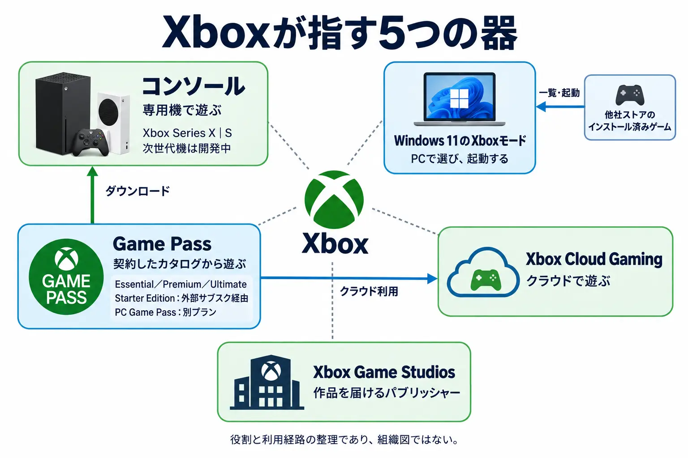
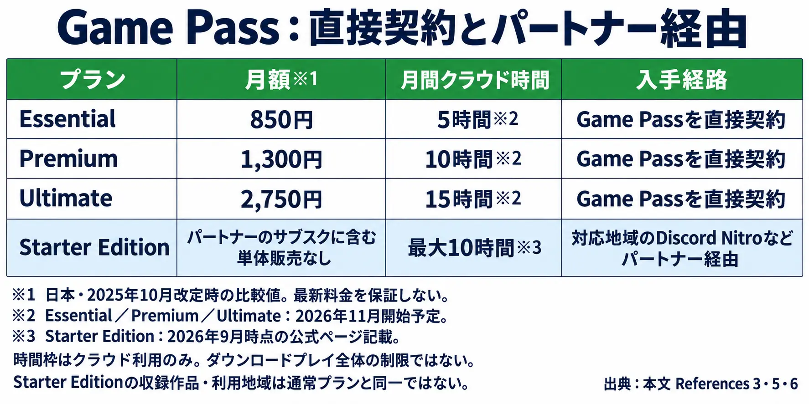
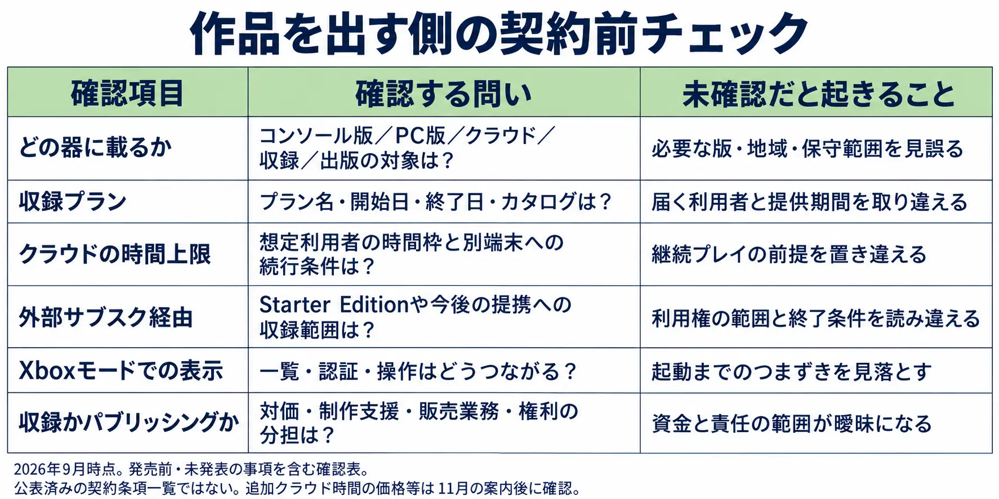

# 「Xbox」はいま、いくつの器を指しているのか ― 作品を出す側が確認すべきこと

2026年のXboxは、作品とプレイヤーを結ぶ場所を増やしている。5月にはWindows 11のXboxモードの提供と、Discord NitroにGame Passを組み込む提携が発表された。9月にはクラウドの月間利用時間の変更予定が示され、『PHYSINT』のパブリッシングを引き受けることも発表された。コンソールの開発と並行して、起動画面、配布サービス、制作のパートナーという複数の役割が、同じ名前の下で広がっている。

本稿は、Game Passへの作品提供を検討する開発会社やパブリッシング担当者、新人ゲームプランナーの立場から、この動きを読む。対象は **2026年9月11日までに公表された情報** であり、11月に詳細案内を予定する変更など、未確定の部分は未確定として示す。

「Xboxへ出す」と言ったとき、それがどの器に載ることを意味するのかは、もはや一語では決まらない。作品を出す側に必要なのは、Xboxが伸びているか縮んでいるかの判定ではなく、自分の作品がどの器に載るのかを契約の前に言葉にすることである。

***

## 1. 「Xbox」は今、いくつの器を指しているか

まず、本稿で扱う器を五つに分ける。これは組織図ではなく、作品がプレイヤーへ届く過程を読むための整理である。

| 器 | プレイヤーから見た役割 | 供給側が分けたい判断 |
|---|---|---|
| コンソール | ゲームを動かす専用機 | どのハード向けに作品を用意するか |
| Windows 11のXboxモード | PC上でゲームを選び、起動する画面 | 販売後にどこから起動されるか |
| Xbox Cloud Gaming | 離れたサーバーで動くゲームを遊ぶ手段 | どの端末・利用条件で届くか |
| Game Pass | 契約したプランに応じて作品へアクセスする配布の層 | どのカタログに、どの条件で入るか |
| Xbox Game Studios | 作品を届けるパブリッシャー | 誰と制作・販売の役割を分担するか |

これらは重なっている。Game Passの作品をコンソールにダウンロードする人もいれば、クラウドで遊ぶ人もいる。Windowsの起動画面には、他社ストアからインストールしたゲームも並ぶ。同じブランドに接していても、購入先、実行場所、作品を提供する相手は別々である。

ハードとそれ以外の器は並立している。XboxはProject Helixという次世代コンソールを開発中で、2027年から開発者へアルファ版ハードウェアを出荷する計画を公表している。製品版の発売時期を示したものではない。[[1](#ref-1)] 次世代機の論点は、既刊「[XboxとPlayStationの「PC後退」は何が違うのか](xbox-playstation-pc-strategy-channel-content-selection-2026.md)」の第4章に譲る。

一方、Xboxモードの公式説明は「Xbox モードは Windows 上に構築されているため、PC ゲームの柔軟性やオープン性を保ちつつ」と述べ、その上でゲームへ集中できる体験を提供するとしている。[[2](#ref-2)] 専用機を開発しながら、Windowsの性質を保った別の入口も作る。この並立が出発点である。

***

## 2. Xboxモードは、他社ストアの棚まで自分のライブラリに並べた

2026年5月1日、日本を含む一部地域でWindows 11 PC向けXboxモードの段階的な提供開始が発表された。署名はJason Ronald氏、肩書はVice President of Next Generation, Xboxである。Windowsハンドヘルド向けの「フルスクリーン エクスペリエンス」を出発点に、ノートPC、デスクトップ、タブレットへ広げたものだ。[[2](#ref-2)]

核心は、公式が挙げた次の機能にある。

> Xbox Game Pass に収録された全てのタイトルや主要 Windows PC ストアフロントからインストールされたゲームを含む、統合ライブラリへのアクセス

出典：Xbox Wire Japan、2026年5月1日。[[2](#ref-2)]

他社ストアで購入してインストールしたゲームも、Xboxの画面から見つけて起動する対象になる。コントローラーに適した一覧からゲームを選べ、Windows 11のデスクトップとの切り替えもできる。ここでいう統合は、起動する入口をまとめることであり、他社ストアの購入権が一律にXbox版の所有権へ変わるという説明ではない。

たとえばSteamで販売した自社タイトルについても、主要ストアからインストールしたゲームとしてXboxモードから起動される経路を想定する必要がある。供給側が実機で確認したいのは、一覧での見え方、起動時の別ランチャーや認証、コントローラー操作のつながりである。個別タイトルでどう動くかは、その作品の構成に即して確認する。

既刊が扱った「どこで売るか」に対し、ここで増えた判断は **売った後にどこで起動されるか** である。販売ストアを選ぶだけでは、プレイヤーが最初に触れる画面まで決まらなくなった。

***

## 3. Game Passは、他社のサブスクの中へ入った

Game Pass側でも、作品への到達経路が分かれている。前提となるのは、2025年10月1日に発表されたプラン再編と価格改定だ。GAME Watchが伝えた日本向けの月額は次のとおりである。これは **2025年10月の改定前後の比較** であり、その後の価格変更まで含めた現行料金表ではない。[[3](#ref-3)]

| 改定前のプラン | 改定前の月額 | 改定後のプラン | 改定後の月額 |
|---|---:|---|---:|
| Ultimate | 1,450円 | Ultimate | 2,750円 |
| Standard | 1,100円 | Premium | 1,300円 |
| Core | 842円 | Essential | 850円 |
| PC Game Pass | 990円 | PC Game Pass | 1,550円 |

そこへ2026年5月11日のDiscord提携が重なった。Xbox公式は「Game Pass をより柔軟なサービスへ進化させる取り組みの一環として」、対応地域のDiscord NitroにXbox Game Pass Starter Editionを含めると発表した。Discord上のゲーム配信やゲームアクティビティから「プレイ」を選び、「Xbox Game Pass」へ進む導線も案内している。[[4](#ref-4)]

Starter Editionの公式ページは、50本以上のライブラリ、対応するPC・コンソール等へのダウンロード、毎月最大10時間のクラウドストリーミングを案内する。単体で買う通常プランとは異なり、パートナーのウェブサイトで提供される特典である。利用条件には「アクティブなパートナー サブスクリプションの限定特典として提供され、サブスクリプションが終了すると予告なく自動的に終了します」とある。パートナー側の契約を再開してもアクセスの復旧は保証されず、ライブラリと特典は地域・時期・プラン・デバイスによって異なる。[[5](#ref-5)]

つまり、利用者と作品の接点には、Xbox側だけでなく外部サービスの契約状態も関わる。Discordで友人のプレイを見たことがきっかけでも、その人が利用できるカタログと時間枠は加入条件次第である。

**「Game Passに収録される」という一語では、どのプランの、どの時間枠の、どの導線で遊ばれるかが決まらない。** Ultimateの加入者に届くことと、Discord Nitroに付随する月10時間のクラウド枠へ届くことは、同じ収録でも意味が違う。なお、この10時間はクラウド利用の枠であり、ダウンロードして遊ぶ時間全体の上限ではない。[[5](#ref-5)]

価格は2025年10月改定時の比較値である。通常3プランの時間枠は2026年11月開始予定、Starter Editionは2026年9月時点の案内を示す。時間枠はクラウド利用のみを対象とする。[[3](#ref-3)][[5](#ref-5)][[6](#ref-6)]

***

## 4. クラウドに、時間の上限が入った

### 4-1. 公表された事実：11月からの時間枠と、残る未発表事項

2026年9月3日、Xboxはクラウドの提供方法を11月から変更すると発表した。日本語版は翌4日、Team XBOX名義で公開された。対象の通常プランに含まれる月間クラウドプレイ時間は、Ultimateが15時間、Premiumが10時間、Essentialが5時間となる。発表時点では、変更対象のメンバーはこうした月間制限なしで利用できる。[[6](#ref-6)]

時間を使い切った場合は、XBOX Storeで追加のクラウドプレイ時間を購入できるようになる。さらにGame Pass非加入者も、時間を購入して **所有している対象ゲーム** をストリーミングできる方式が始まる。ゲームの所有とクラウドの利用時間を別々に用意する経路であり、時間の購入だけで全作品にアクセスできる仕組みではない。[[6](#ref-6)]

公式は、利用者とプレイ時間の増加に伴う提供コストの増加を理由に挙げている。影響を受ける人はGame Passメンバーの4%と見込みつつ、「特にクラウド経由で日常的に長時間ゲームをプレイしている方にとって、時間制限の導入が大きな変更となることは認識しています」「一部のプレイヤーにとって、実質的に負担の増加につながることも理解しています」と記している。[[6](#ref-6)]

追加時間の価格、購入方法、対象ゲーム、提供地域、残り時間の確認方法は11月に詳しく案内するとしている。したがって9月時点では、これらの詳細は未公表・未確定として扱う必要がある。社内でも未決定なのか、公表を待つ段階なのかまでは分からない。地域によって利用可能時間や機能等が異なる場合があることも告知されている。[[6](#ref-6)]

入口となる端末への展開は続いている。英語版のクラウド公式ページは、対応するLG、Samsung、VIDAA OS搭載スマートTVとAmazon Fire TVを引き続き案内し、同じページに各プランの時間枠も載せている。[[7](#ref-7)] 日本語版もスマートTVなどの対応と今後の対応拡大を案内しているが、テレビ欄では英語版のように各ブランドを列挙していない。英語版の機種案内を、そのまま日本の全モデルでの利用保証と読み替えることはできない。[[8](#ref-8)]

技術やサービスの成否は、既刊「[クラウドゲーミングの現在地](cloud-gaming-deep-dive-proofread.md)」で扱った。本稿で見る変化は、入口の広さを保ちながら、そこから遊べる時間に条件が加わることである。

### 4-2. 編者の考察：入口を広げたまま、滞在時間を区切る意味

ここからは編者の考察である。本ブログは公表された事実を出典で支えることを原則とするが、この節では、その事実の形から読み取れることを考察として区別して書く。

考察の出発点には、編者がSNSのタイムラインで、ChromebookからXbox Cloud Gamingを遊ぶ人を比較的多く見かけたという観察がある。これは編者が見ている範囲での印象であり、利用者構成を示す統計ではない。その上で、同じ時間枠でも、別の遊び方を持つ人とクラウドを唯一の入口とする人では、重みが変わると読める。

第一に、XboxはスマートTVやFire TVという入口を保っている。第二に、対象作品をローカルで動かせるコンソールやPCと利用権を持つ人なら、クラウドの枠を使い切っても、ダウンロードしたゲームへ移る余地がある。対して、その作品を遊ぶ手段がクラウドだけである人には、時間枠が追加料金なしで遊べる月間時間の上限になる。効き方を分けるのは、単なるハードの所有ではなく、 **同じ作品を別の方法で続けられるか** だと読める。

第三に、公式の4%はGame Passメンバーを母集団とする見込みであり、クラウド専用層の4%という数字ではない。クラウド専用層の人数も、そのうち上限を超える割合も示していないため、全体比率の小ささだけでは、この層の負担を評価しきれないと読める。[[6](#ref-6)]

第四に、Chromebook側では別の変化があった。2025年8月、ChromeOSのランチャーで「Steam」を検索した際に表示される告知として、「The Steam for Chromebook beta program will conclude on January 1st, 2026.」という文面が報じられた。以降はベータ経由でインストールしたゲームを端末上で遊べなくなるとされている。[[9](#ref-9)] これはGoogle側の判断であり、Xboxの施策ではない。対象はこのベータによるローカル実行の経路であって、Chromebookのあらゆるローカルゲームではない。なお、Googleのサポートページは2026年9月時点でもこのベータの導入手順を案内しており、告知後に実際どう提供されているかまでは公表資料から確定できない。ただし、この経路を当てにしていた人がPCゲームを遊び続ける際、クラウドへの依存が高まるという説明は立つ。

こうして見ると、入口を広げる施策と、滞在時間を区切る施策が同時に走っている。「まず触れられる場所は多く、長く遊ぶには追加時間か別の実行環境が必要になる」という設計であり、別の入口への誘導としても読める。

ただし、Xboxが特定の層を絞りたいと考えているかは公表されておらず、外部からは分からない。公式自身は、Xbox Oneの所有者が機器をすぐ更新せずにXbox Series X｜S向けの対象作品を遊べる価値を挙げ、ゲーム機の入手や購入が難しい地域で役立つ可能性を強調している。[[6](#ref-6)] 入口を残すことが機器購入の負担を下げる価値と、その入口に依存する人ほど時間枠の影響を受けやすいことは両立する。公表されたコスト増への対応として説明できる一方、利用環境によって負担が偏る設計とも読める。

***

## 5. Xbox Game Studiosは、作品を引き受ける側でもある

収録先とは別に、制作・販売のパートナーとしてのXboxがある。2026年9月10日、日本向けに『PHYSINT』のパブリッシングをXboxが担う提携拡大が発表された。Xbox Game Studiosがパブリッシングを予定する『OD』に続き、コジマプロダクションとの協業がもう一作へ広がった形である。[[10](#ref-10)][[11](#ref-11)] 今回のXbox公式発表は提携先をXBOXと表記しており、個別契約の法人名や権利分担までは示していない。

この出来事は、三つの当事者発信を分けて読む必要がある。

PlayStation公式Xアカウントは、日本時間9月10日11時30分の投稿で、慎重な検討の末に『PHYSINT』での協業から退くという難しい決断をした、と説明した。同時に小島氏の構想への敬意を述べ、「Our relationship remains strong after three decades of industry-leading, genre-defining creative cooperation, and we look forward to continued close collaboration with Hideo Kojima and his award-winning independent studio in the future.」と続けている。[[12](#ref-12)]

一方、小島秀夫氏本人のXアカウントは同日11時38分の投稿で、6月中旬にSIEから制作中のプロジェクトをキャンセルする通達が届いた経緯を「突然、SIEより届きました」と記している。その後3か月間、新たなパートナーを模索し、未来のビジョンを共有できる相手としてXboxと組むことになり、制作は継続していると説明した。[[13](#ref-13)]

慎重な検討を語るPlayStationと、突然の通達を語る小島氏では、同じ出来事の説明に隔たりがある。ただし、発信した側の検討過程と、受け手にとっての突然さは別の事柄でもある。公表文だけでどちらが正しいかを判定することも、SIEが退いた理由を推測することもできない。外から確認できるのは、SIEが協業から退いたこと、小島氏が新たな相手を探したと説明していること、そしてXboxとの提携で制作が続くことまでである。

三つ目となるXbox公式発表では、CEOのAsha Sharma氏が「クリエイターには、自らのアイデアをどこで、どのような形で実現するかを選ぶ自由があります」と述べている。発表は『OD』『PHYSINT』に加え、映画・テレビ分野にも協力を広げるとしている。[[10](#ref-10)]

供給側から見ると、Xboxはカタログの収録先であると同時に、他社が手を引いた作品の継続先にもなった。これはスタジオをどの会社が所有するかとは別の、タイトル単位の行き先である。組織の出口は「[Xbox再編から考える、スタジオの「独立・売却・閉鎖」はなぜ分かれるのか](xbox-studio-restructuring-exit-paths-2026.md)」に譲り、ここではパブリッシングの合意とGame Pass収録の合意を分けて押さえたい。今回の発表だけから、個別作品の収録プランや発売条件まで確定することはできない。

***

## 6. 作品を出す側が、分けて考えるべきこと

既刊が分けた「どこで売るか」と「何を出すか」の内側に、もう一つの分岐がある。 **Xboxへ出すと言ったとき、どの器に載るのか** である。契約前の打ち合わせでは、ブランド名をそのまま条件として扱わず、次の問いに置き換えるとよい。

### 6-1. 到達範囲を、作品・プラン・経路で書き出す

第一に、対象をコンソール版、PC版、クラウド対応、Game Pass収録、パブリッシングへ分ける。ある一つへの対応から、残りも自動的に含まれると見積もらない。対象地域、提供期間、必要な版と更新対応まで、作品ごとに並べる。

第二に、Game Passでは収録プランを名指しする。通常プランだけか、Starter Editionも含むか、将来の外部提携経由も対象になるかを確認する。外部サブスクへの組み込みが対象なら、利用者のアクセス終了を誰が案内するのかも問いになる。公式サービスの説明と、自社作品の収録範囲は別々に確かめる必要がある。

第三に、クラウドでは想定利用者がどの時間枠を使うかを見る。時間枠は一作品のために確保された枠とは限らず、プレイヤーは他作品にも使う。自社作のセッション時間だけでなく、途中でやめた場合の再開、別端末での続行、セーブの扱いを確認したい。長い作品が不利になるという結論には、利用者構成や実際の行動データが要る。現段階では、時間枠が体験に触れる場所を洗い出すのが先である。

第四に、Xboxモードでは自社のPC版を実際に起動し、一覧、認証、コントローラー操作までの流れを見る。他社ストアで売る方針を保ったままでも、この確認は必要になる。ライブラリへの表示と、ストアや特集での露出が約束されることも分けて扱う。

### 6-2. 収録の対価と、制作を引き受ける条件を分ける

Game Pass収録を検討する際には、契約金だけでなく単体販売との関係も確認したい。AUTOMATONは、Xbox Game Studios元VPのShannon Loftis氏がLinkedInで、発売後のDLCや課金アイテムによる収益化を計画する場合を除き、多くのGame Pass作品が相当の小売売上を犠牲にするとの見解を示した、と報じている。これは **元幹部個人の見解であり、Microsoftの公式見解でも、自社作品の損失を示す実測値でもない** 。同じ報道は、契約金を得る利点、注目を集める機会、発売後のDLCで収益につなげる可能性も取り上げている。[[14](#ref-14)]

したがって、自社の判断表では、確定する対価、単体販売の見通し、露出の条件、追加コンテンツの収益機会、移植・保守の費用を分ける。契約金の支払時期と条件を押さえた上で、販売減少も追加購入も予測として置き、どの前提で計画が成り立つのかを確認する。Game Passの賛否ではなく、自社の作品と契約条件の対応を調べる作業である。

パブリッシングを依頼するなら、さらに開発資金、販売業務、承認権限、IP・配信権、制作を継続する条件を確かめる。収録の約束と制作支援の約束は、それぞれ何を含むのか。『PHYSINT』が示したのは新しい引受先が成立した事実であり、どの作品にも同じ条件が用意されるという保証ではない。

2026年9月時点の確認項目であり、公表済みの契約条項一覧ではない。追加クラウド時間の価格等は11月の案内後に確認する。

未発表の条件には、空欄のまま担当者と確認時期を付ける。とりわけ11月のクラウド詳細は、確定した価格として収支計画へ埋め込まず、案内後に見直す項目とする。「Xboxで遊べる」という対外説明も、この確認表のどこまでが決まったかに合わせれば、実態に即した言葉になる。

***

## 結論：契約の前に、器を名指しする

「Xbox」という一語だけで作品の行き先まで共有できる場面は、少なくなっている。専用機は開発され続け、その隣でWindowsの起動画面、クラウドの時間枠、外部サブスクの特典、パブリッシングの関係が広がる。それぞれが届ける相手と、作品を供給する側の責任は異なる。

供給側に必要なのは、Xboxが伸びているか縮んでいるかの判定ではない。自分の作品が、どの器に、どの条件で載るのかを契約の前に言葉にすることである。

## References

1. [From GDC: Building the Next Generation of Xbox][1] — Xbox Wire、2026年3月11日。次世代機と開発者向けアルファ版の計画。

[1]: https://news.xbox.com/en-us/2026/03/11/project-helix-building-next-generation-of-xbox/

2. [Windows 11 PC 向け Xbox モードを本日より提供開始][2] — Xbox Wire Japan、Jason Ronald、2026年5月1日。

[2]: https://news.xbox.com/ja-jp/2026/05/01/xbox-mode-pc-windows-11/

3. [「Xbox Game Pass」各種が価格改定。「Ultimate」は1,300円値上げに][3] — GAME Watch、徳永浩貴、2025年10月2日。日本向け改定額の報道。

[3]: https://game.watch.impress.co.jp/docs/news/2051813.html

4. [Xbox Game Pass と Discord: パートナーシップの発展が、より多くの特典をプレイヤーに提供][4] — Xbox Wire Japan、Team Xbox、2026年5月11日。

[4]: https://news.xbox.com/ja-jp/2026/05/11/xbox-game-pass-and-discord-partnership-announce/

5. [XBOX Game Pass Starter Edition][5] — Xbox公式。ライブラリ、時間枠、パートナー特典の条件。2026年9月11日確認。

[5]: https://www.xbox.com/ja-jp/xbox-game-pass/partner

6. [XBOX Cloud Gaming の今後の変更について][6] — Xbox Wire Japan、Team XBOX、2026年9月4日。米国時間9月3日の発表に基づく。

[6]: https://news.xbox.com/ja-jp/2026/09/04/xbox-cloud-gaming-changes/

7. [XBOX Cloud Gaming（英語版）][7] — Xbox公式。対応テレビと月間時間枠。2026年9月11日確認。

[7]: https://www.xbox.com/en-US/cloud-gaming

8. [XBOX Cloud Gaming（日本語版）][8] — Xbox公式。日本語版のデバイス案内。2026年9月11日確認。

[8]: https://www.xbox.com/ja-JP/cloud-gaming

9. [Google ending Steam for Chromebook support in 2026][9] — 9to5Google、2025年8月7日。ChromeOSのランチャー上に表示された告知の文面を伝える報道。なおGoogleのサポートページ「Play Steam for Chromebook (Beta)」（support.google.com/chromebook/answer/14220699）には、2026年9月11日時点で当該告知の掲載がない。

[9]: https://9to5google.com/2025/08/07/steam-chromebook-2026/

10. [XBOX とコジマプロダクションは『PHYSINT』のパブリッシングに向けパートナーシップを拡大][10] — Xbox Wire Japan、Team XBOX、2026年9月10日。米国時間9月9日の発表の抄訳。

[10]: https://news.xbox.com/ja-jp/2026/09/10/xbox-and-kojima-productions-expand-partnership-to-publish-physint/

11. [コジマプロダクション、新作『PHYSINT』ではPlayStationではなくXBOXとタッグに。SIEの“『PHYSINT』プロジェクト中止”通達を受けて][11] — AUTOMATON、Hideaki Fujiwara、2026年9月10日。『OD』のパブリッシャーと提携の経緯。

[11]: https://automaton-media.com/articles/newsjp/20260910-466428/

12. [PlayStation公式アカウントによる『PHYSINT』の協業終了に関する発信][12] — @PlayStation、2026年9月10日11時30分（日本時間）。本文では冒頭を要約し、後半を原文で引用した。

[12]: https://x.com/PlayStation/status/2097875212427735146

13. [小島秀夫氏本人による『PHYSINT』の制作継続に関する発信][13] — @Kojima_Hideo、2026年9月10日11時38分（日本時間）。

[13]: https://x.com/Kojima_Hideo/status/2097877326159917497

14. [Xbox元幹部が「Game Passは、大多数のゲームが売上を犠牲にして成り立っている」と警鐘鳴らす。ビジネスモデルとせめぎ合う“開発者側のメリット”][14] — AUTOMATON、Kosuke Takenaka、2025年9月9日。Loftis氏のLinkedIn発言を伝える報道。

[14]: https://automaton-media.com/articles/newsjp/game-pass-20250909-356860/

----

この文書は、Perplexity、Claude、OpenAI Codex の3つのAIの支援を受けて著述されたものです。引用画像を除き、MIT License にて提供されています。
