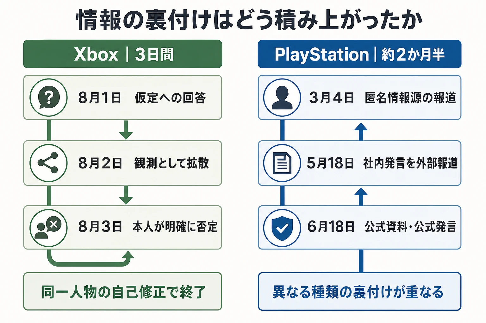
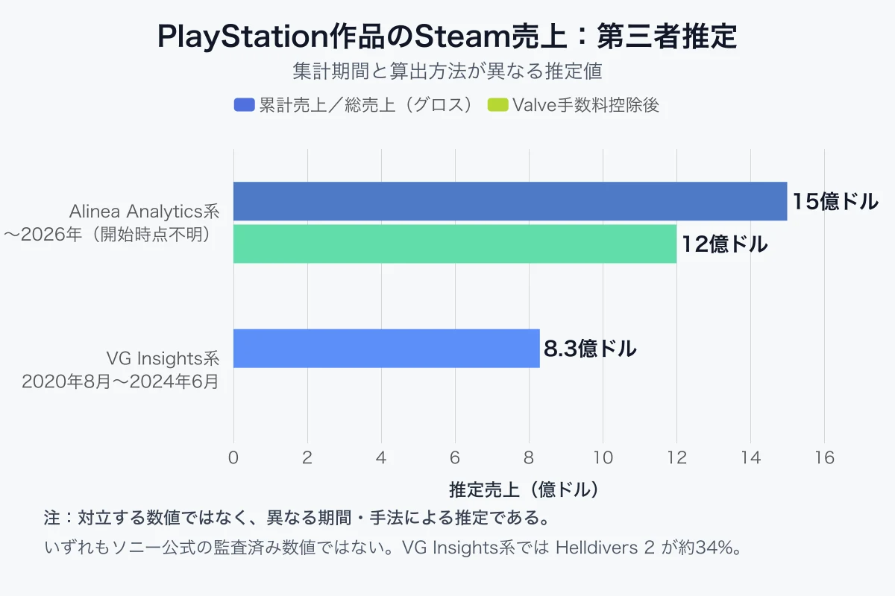
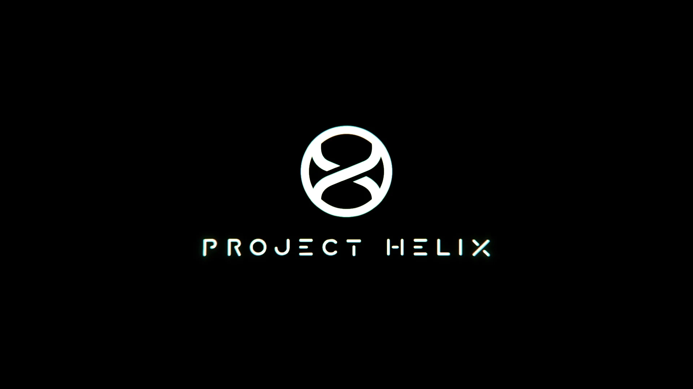
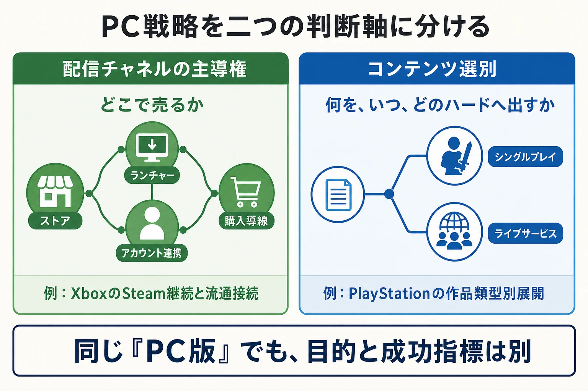

# XboxとPlayStationの「PC後退」は何が違うのか――配信チャネルとコンテンツ選別を分けて読む

2026年の夏、XboxとPlayStationについて、PC展開が後退するという趣旨のニュースが相次いだ。一方はXboxがSteamから離れるかもしれないという観測であり、もう一方はPlayStationの自社開発シングルプレイ作品がPCへ出なくなるという報道である。見出しだけを並べれば、両社が揃ってPCから距離を取るように映る。

しかし、二つは同じ問いへの答えではない。Xboxで問われたのは、Steamという **配信チャネル** を手放すのか、そして自社のPC流通網をどのように広げるのかであった。PlayStationで問われたのは、どの **自社IP・作品類型** をPCに出すのかであった。前者はストア、ランチャー、アカウント連携の設計であり、後者は作品の到達範囲と自社ハードの価値をどう組み合わせるかというポートフォリオ設計である。

本稿は、スタジオの独立・売却・閉鎖を扱った「[Xbox再編から考える、スタジオの「独立・売却・閉鎖」はなぜ分かれるのか](xbox-studio-restructuring-exit-paths-2026.md)」の続編ではない。同記事が所有権の出口に焦点を絞ったのに対し、ここではプラットフォームとストアの意思決定を扱う。7月のXbox再編は、誰が判断したかを読むための文脈に留める。

先に結論を置く。「PCへ出すか」という一文だけでは、企画と事業の判断対象を取り違える。配信先を増減させる判断と、作品をどのハードへ出すかという判断は、同じ会議で扱われることがあっても、測るべき便益、失うもの、成功指標が異なる。

***

## 1. XboxのSteam離脱観測は、数日で発言者自身が否定した

発端は2026年8月1日の Xbox Two ポッドキャストである。Windows CentralのJez Corden氏は、視聴者から「XboxがSteamを離れる場面はあるか」と問われ、Xboxの独占戦略や自社PC流通網をめぐる可能性を語った。この発言が切り出され、翌2日に「MicrosoftがSteamから離脱することを検討している」という観測として複数のニュースサイトへ広がった。

ここで止めると、単独の発言から企業方針を確定したことになる。Corden氏は8月3日、自身のWindows Central記事で、その発言がニュース集約サイトによって文脈から切り離されたと説明し、MicrosoftはSteamからの離脱を「現時点ではまったく検討していない」と明記した。ポッドキャストの問いは仮定のシナリオであり、Steam離脱の取材報道ではなかった。[[1](#ref-1)]

この訂正は、最初の観測が無価値だったという意味ではない。Corden氏が同じ記事で示したPC事業の方向は、Steamを捨てることではなく、PC上の接点を増やすことである。ただし、以下には同氏の取材に基づく記述と、公式発表済みの事項が混在する。確定事項として一括りにしないことが重要である。

- **Ubisoft Connectとの連携**：Ubisoftは、Xbox Series X｜S版所有者にPC版を無料提供する統合を、Corden氏の記事の前週にすでに発表済みである。これは観測ではなく確定済みの事実である。[[1](#ref-1)]
- **Battle.netのサードパーティ開放**：複数の取材源から、BlizzardのBattle.netをサードパーティ開発者に開く構想があると伝えられた。記事自身も、新体制で継続しているかは未確認としており、取材源に基づく観測の段階である。[[1](#ref-1)]
- **Xbox PCアプリのマルチストア統合、EA appとの連携**：Xbox PCアプリのプラグイン機構を、Battle.netなどとの橋渡しに使い、複数のライブラリや購入導線を一つの体験に近づける方向、およびEAのPCストアとの連携も、同氏の取材に基づく観測として伝えられた。ここでいうランチャー統合とは、ゲームの購入先や起動先が異なる状態を前提に、一覧、アカウント、機能連携を接続することである。[[1](#ref-1)]

したがって、8月3日時点で読めるXboxの方向は「外部ストアを排して自社ストアへ閉じる」ではない。Steamを含むPC市場の複数チャネルを前提にしながら、Xbox PC、Battle.net、各社ランチャーとの接点を増やし、アカウント、購入、継続利用の主導権をどこまで持てるかを探る方向である。

### 1-1. 再編の文脈はあるが、Steam離脱の証拠にはならない

2026年2月20日、Phil Spencer氏の退任とSarah Bond氏の退社に伴い、Asha Sharma氏がMicrosoft GamingのCEOに就任した。7月6日にはSharma氏の下で、2027年度を通じ約3,200人の役割を削減する計画と、複数スタジオの扱いを見直す大規模再編が公表された。[[2](#ref-2)][[3](#ref-3)]

この人事と再編は、8月のPC戦略を同じ経営陣が判断する背景ではある。一方で、再編があったことからSteam離脱までを演繹することはできない。実際にCorden氏の訂正後の記事は、Steamの継続とPC流通網の拡張を同時に語っている。組織再編の詳細は前掲記事に譲り、本稿では「体制変化」と「ストア離脱の事実」を混同しないための時系列として押さえる。

***

## 2. PlayStationは、報道から公式発言へと方針が積み上がった

PlayStation側の経緯は、情報の裏付けが段階的に強くなった。3月4日、BloombergのJason Schreier氏は、PlayStationが自社開発のナラティブ型シングルプレイ作品についてPC展開から後退し、*Ghost of Yōtei* や *Saros* をPlayStation 5に留める方針だと報じた。一方で、オンライン性の強い *Marathon* や *MARVEL Tōkon: Fighting Souls* はPCにも出すという線引きが報じられていた。[[4](#ref-4)]

5月18日には、SIEのStudio Business Group CEOであるHermen Hulst氏が社内タウンホールで、ナラティブ型シングルプレイ作品をPlayStation専売にすると従業員へ伝えた、とSchreier氏が報じた。これは外部から社内発言を報じた段階であり、なお公式リリースではない。しかし3月の匿名情報だけで終わらず、社内説明という次の出来事で同じ内容が確認された。[[4](#ref-4)]

6月18日には、ソニーの年次報告書から、前年度にあった「PCなど追加プラットフォームへのファーストパーティ作品展開を継続する」という趣旨の説明が見当たらなくなった。記述の削除は、単独では今後の全タイトルを規定する法的な宣言ではない。それでも、同じ時期の方針見直しと整合する公式資料上の変化である。2026年の年次報告書は、ファーストパーティについてシングルプレイ作品の毎年の安定したリリースと、ライブサービス作品のポートフォリオ構築を並べて記している。[[5](#ref-5)][[6](#ref-6)]

そして同日、SIE CEOの西野秀明氏が『ファミ通』のインタビューで、公開の言葉として基準を示した。西野氏は、PCで展開することで体験を最大化できる場合は検討を続けると前置きした上で、現時点の主方針として、ファーストパーティで開発するシングルプレイ作品はPlayStationで提供する体験価値をさらに磨き、ライブサービス作品はPS5とPCでの展開を基本とすると述べた。[[7](#ref-7)]

ここから導けるのは「PC全面撤退」ではない。自社開発のナラティブ型シングルプレイと、オンラインマルチプレイを前提とするライブサービスを、同じPC展開基準で扱わないという二本立てである。外部パブリッシング作品、個別のPC展開が体験を高める作品、将来の例外まで一律に否定した発言でもない。[[7](#ref-7)]

| 作品類型 | 2026年6月時点で読める主方針 | PC展開の狙い |
|---|---|---|
| 自社開発のシングルプレイ作品 | PlayStationで提供する体験価値を研ぎ澄ます | ハードと自社IPの接点を強める |
| ライブサービス作品 | PS5とPCでの展開を基本とする | オンラインのプレイヤー母集団を広げる |
| 個別の例外・外部作品 | タイトル特性と体験最大化に照らして判断 | 一律のルールに還元しない |

「シングルプレイ」「ライブサービス」は販売形態だけのラベルではない。前者では、専用ハードの価値、シリーズへの接点、コントローラーや機能を含む体験設計が投資回収と結び付き得る。後者では、同時接続、マッチメイキングの待ち時間、友人と遊べる端末の多さ、継続運営の母集団が、作品の価値に直接作用する。西野氏の発言は、この二つを同じ市場拡大策として扱わない選択である。

***

## 3. PC版の売上推定は、規模感だけを読む

PC展開の是非を語る際、売上推定は魅力的な根拠に見える。しかし、PlayStationのSteam売上について公表された二つの数字は、同じ母集団と期間を測った公式会計数値ではない。

VG Insights系の推定は、2020年8月から2024年6月までにPCで約8.3億ドル、*Helldivers 2* が約34%を占めるとしている。この数字はSteam上の推定値であり、2024年6月時点までのスナップショットである。[[8](#ref-8)] 一方、Alinea Analytics系の推定は、PlayStation Studios作品のSteam累計売上を約15億ドル、Valveの取り分を考慮した後を約12億ドルとしている。こちらは2026年時点までを含むより長い累計で、推定する対象と手数料計算も異なる。[[9](#ref-9)]

*出典：[Game World Observer][8]、[Alinea Analytics][9]の推定値をもとに作成。*

したがって、8.3億ドルと15億ドルを対立する正解・不正解として扱うべきではない。前者は2024年半ばまで、後者はより後の時点までの異なる推定である。いずれもソニーが監査済みのPC事業売上として発表した数値ではなく、第三者アナリティクス企業のモデルに基づく。読めるのは、PC展開が無視できない規模になったこと、そして *Helldivers 2* のような同時展開のライブサービス作品が全体像を大きく動かし得ることまでである。

この留保はPlayStationの方針を批評する際にも必要である。推定売上の大きさだけから「PC展開を続けるべきだった」または「PC展開は失敗だった」とは結論できない。自社ハードの稼働、追加コンテンツ、サブスクリプション、IPへの接触、開発・移植コスト、作品類型ごとのネットワーク効果までを含めて初めて判断対象になる。

***

## 4. Project Helixは、Xboxにもコンテンツ選別の問いを持ち込む

*画像出典：[Xbox Wire「From GDC: Building the Next Generation of Xbox」][10]（© Microsoft 2026）*

次世代XboxのコードネームであるProject Helixは、この対比を固定したままにはしない。Xbox Wireは2026年3月、Project HelixをXboxコンソールゲームとPCゲームを遊べる次世代機として紹介し、AMDとのカスタムSoC、2027年から開発者へアルファ版ハードウェアを出荷する計画を公表した。これは開発キットの予定であり、製品版の発売時期を確定する情報ではない。[[10](#ref-10)]

一方、SteamやEpic Games Storeがこのハードでネイティブ対応するかは、2026年8月時点で確定していない。ネイティブ対応とは、別のOSやストリーミングを介さず、そのハード上でストアのクライアントや購入済みゲームを直接動かせる状態を指す。Epic Games Storeを率いるSteve Allison氏は2月、方針変更がなければ次世代Xboxで初日から利用できると期待している旨を語ったとされる。4月のGame File取材では、Sharma氏はその協議に自分は関与していなかったとした上で、今後はチームとパートナーで決めると答えた。[[11](#ref-11)]

この回答は、SteamやEpicの非対応を意味しない。同時に、対応を保証するものでもない。Xbox Wireが「他の主要ストア」から遊べる選択肢に触れる一方、個別ストアのネイティブ対応は明言していない。[[10](#ref-10)]

ここに、Xboxが将来直面し得る別の問いがある。PCとのハイブリッド機であっても、ハード上で何を直接動かすか、どのストアを体験の一部にするか、どのコンテンツと経済圏を自社へ結び付けるかは、製品の輪郭を決める。Xboxが現在PCで取り組む「チャネルを増やす」方針と、専用ハードでのコンテンツ・ストアの選別は、同時に成立し得るが同じ判断ではない。

***

## 5. プランナーが分けて持つべき二つの判断軸

### 5-1. 「どこで売るか」と「何を出すか」を別の問いにする

自社IPをマルチプラットフォームへ展開するとき、まず意思決定の文を二つに分けるとよい。

| 判断軸 | 確認する問い | 近い事例 |
|---|---|---|
| 配信チャネルの主導権 | どのストア、ランチャー、アカウント連携、購入導線を許容・統合するか | XboxのSteam継続とXbox PC・Battle.net・各社ランチャーの接続 |
| コンテンツ選別 | どの作品を、どの時点で、どのハードへ出すか | PlayStationの自社開発シングルプレイとライブサービスの二本立て |

チャネルの議論では、取り分、顧客データ、アカウント、ライブラリ、クロス購入、検索性、パッチ配信、コミュニティ導線を確認する。コンテンツ選別の議論では、作品の核となる体験、ハードの訴求、同時接続の必要性、シリーズの成長、移植コスト、発売時期を確認する。同じ「PC版」という言葉で一つにすると、どの条件を最適化しているのかが曖昧になる。

特にライブサービスとシングルプレイを同じ物差しで採点しないことが重要である。オンラインのプレイヤー密度が価値の一部である作品は、複数プラットフォーム展開で便益が増えやすい。一方、物語体験を軸に自社ハードへ誘導する作品では、販売本数以外の接点設計が大きくなる。どちらが常に正しいかではなく、作品ごとに目的関数が違う。

### 5-2. 観測報道は、内容より先に裏付けの段階を読む

今回の二件は、海外業界ニュースの読み方にも好例を与える。XboxのSteam離脱観測は、発言者本人が数日のうちに文脈を訂正し、現時点の検討を否定した。PlayStationのPC方針は、Bloombergの報道、社内タウンホールの報道、年次報告書の記述変化、CEOによる公開インタビューという順に、複数の異なる種類の裏付けが重なった。

リークや観測に触れるときは、次の順で確認するとよい。

1. **誰が、どの立場で述べたか**：匿名筋、記者の推測、当事者の発言、公式資料を区別する。
2. **本人の留保・訂正はあるか**：仮定への回答か、記事化した取材報道か、後に同じ発言者が後退させたかを確認する。
3. **独立した系統の裏付けがあるか**：同じ投稿の転載が何本あっても、情報源が増えたことにはならない。
4. **公式発言・公式資料は何を確定しているか**：公式が発表した範囲を、推測の結論より狭く読む。

この手順は、噂を無視するためのものではない。未確定情報を、検証すべき仮説として扱うための手順である。Xboxの件は「報道者自身の訂正まで含めて読む」例であり、PlayStationの件は「報道、資料、公式発言がどこまで積み上がったか」を読む例である。

***

## 終わりに――PC戦略は一枚岩ではない

XboxとPlayStationの2026年の動きを、コンソールメーカーが揃ってPCから後退したという一文に縮めると、実務の論点が消える。XboxのSteam離脱は確認された方針ではなく、発言者本人が否定した観測だった。そこから見えるXboxの課題は、外部ストアを捨てることではなく、PCの分散した流通をどう接続し、自社の接点を増やすかである。

PlayStationが示したのは、PCを全面的に閉じる方針ではなく、作品類型ごとに到達範囲を分ける方針である。自社開発のシングルプレイ作品ではPlayStationの体験価値を重視し、ライブサービス作品ではPS5とPCでプレイヤー母集団を広げる。ここで問われているのは、ストアの選択ではなく、IPごとの展開設計である。

プランナーが持ち帰るべきなのは、PC対応の賛否ではない。「配信チャネルの主導権」と「作品単位のコンテンツ選別」を別々に設計し、そのうえで、見出しの強さではなく情報源の裏付けの強さでニュースを読むことである。

## References

1. [No, Xbox isn't quitting Steam — but it IS doubling down on PC gaming. Here's how][1] - Jez Corden氏が8月3日に自身のポッドキャスト発言の文脈を訂正し、Steam離脱を否定したWindows Central記事。Battle.net、Xbox PC、Ubisoft・EAとの連携に関する同氏の取材内容も含む。

[1]: https://www.windowscentral.com/gaming/xbox/no-xbox-isnt-quitting-steam-but-it-is-doubling-down-on-pc-gaming-heres-how

2. [Microsoft Names Sharma to Lead Xbox, Recommits to Console][2] - 2026年2月20日のPhil Spencer氏退任、Sarah Bond氏退社、Asha Sharma氏のMicrosoft Gaming CEO就任を報じたBloomberg記事。

[2]: https://www.bloomberg.com/news/articles/2026-02-20/microsoft-names-ai-exec-sharma-to-run-xbox-recommits-to-console

3. [Resetting XBOX][3] - 2026年7月6日のXbox再編に関するXbox Wireの公式発表。

[3]: https://news.xbox.com/en-us/2026/07/06/resetting-xbox/

4. [Sony Interactive Entertainment to no longer release single-player games on PC][4] - Bloombergの3月報道と、5月18日のHermen Hulst氏による社内タウンホール発言について伝えたGematsu記事。

[4]: https://www.gematsu.com/2026/05/sony-interactive-entertainment-to-no-longer-release-single-player-games-on-pc

5. [Sony Group Corporation Form 20-F for the fiscal year ended March 31, 2026][5] - 2026年度の年次報告書。G&NSのファーストパーティ戦略として、シングルプレイ作品の安定した年間リリースとライブサービス作品のポートフォリオ構築を記載する。

[5]: https://www.sony.com/en/SonyInfo/IR/library/FY2025_20F_PDF.pdf

6. [Sony Group Corporation Form 20-F for the fiscal year ended March 31, 2025][6] - 2025年度の年次報告書。同じG&NS戦略の箇所に、PCなど複数プラットフォームへファーストパーティ作品を展開し続ける旨を記載する。

[6]: https://www.sony.com/en/SonyInfo/IR/library/FY2024_20F_PDF.pdf

7. [〖VIPインタビュー〗SIE 西野秀明氏「PS5にとって日本市場を活性化させるための投資は非常に重要だと考えています」][7] - 西野秀明氏が、ファーストパーティのシングルプレイ作品とライブサービス作品で異なるPC展開方針を公式に説明した『ファミ通』のインタビュー。

[7]: https://www.famitsu.com/article/202606/77607?page=1

8. [PlayStation’s PC revenue estimated at $830 million, with Helldivers 2 outselling all first-party ports][8] - VG Insightsの2024年6月時点のSteam推定を紹介したGame World Observer記事。推定であることを明記している。

[8]: https://gameworldobserver.com/2024/06/07/playstation-pc-revenue-830-million-game-sales-steam

9. [The top-selling PlayStation games on Steam][9] - Alinea Analytics自身によるSteam売上分析ブログ。PlayStation Studios作品のSteam総売上を約15億ドル、Valveの手数料を除いた後を約12億ドルと試算している。

[9]: https://alineaanalytics.com/blog/steamps/

10. [From GDC: Building the Next Generation of Xbox][10] - Project HelixのAMD製カスタムSoC、PCゲーム対応、2027年からのアルファ版ハードウェア出荷計画を示したXbox Wireの公式発表。

[10]: https://news.xbox.com/en-us/2026/03/11/project-helix-building-next-generation-of-xbox/

11. [The big things that we're thinking about][11] - Stephen Totilo氏によるGame Fileのインタビュー。Epic Games Storeを含む外部ストア対応について、Sharma氏が以前の協議には関与しておらず、今後チームとパートナーで決めると述べた。

[11]: https://www.gamefile.news/p/xbox-asha-sharma-matt-booty-interview

----

この文書は、Perplexity、Claude、OpenAI Codex の3つのAIの支援を受けて著述されたものです。引用画像を除き、MIT License にて提供されています。
