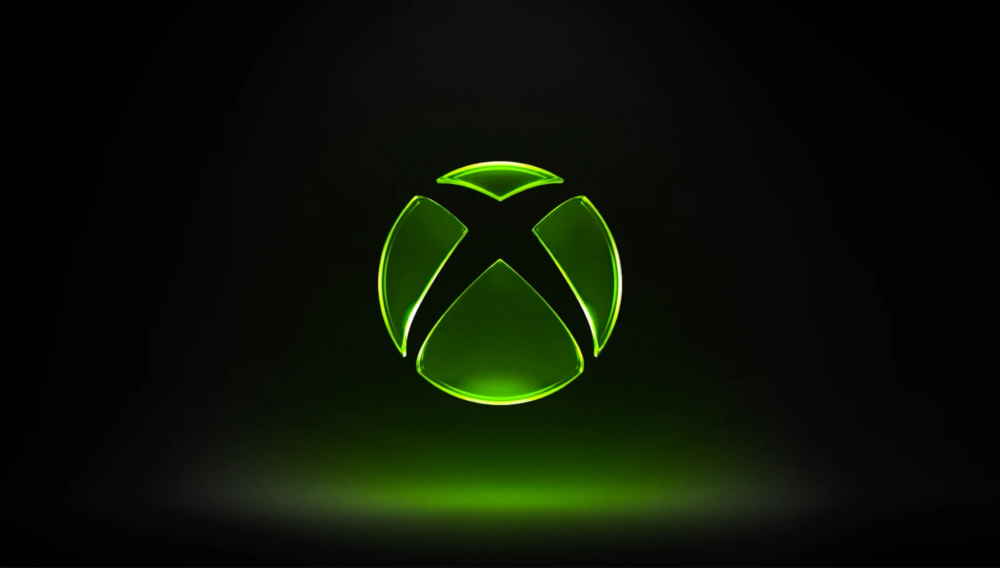
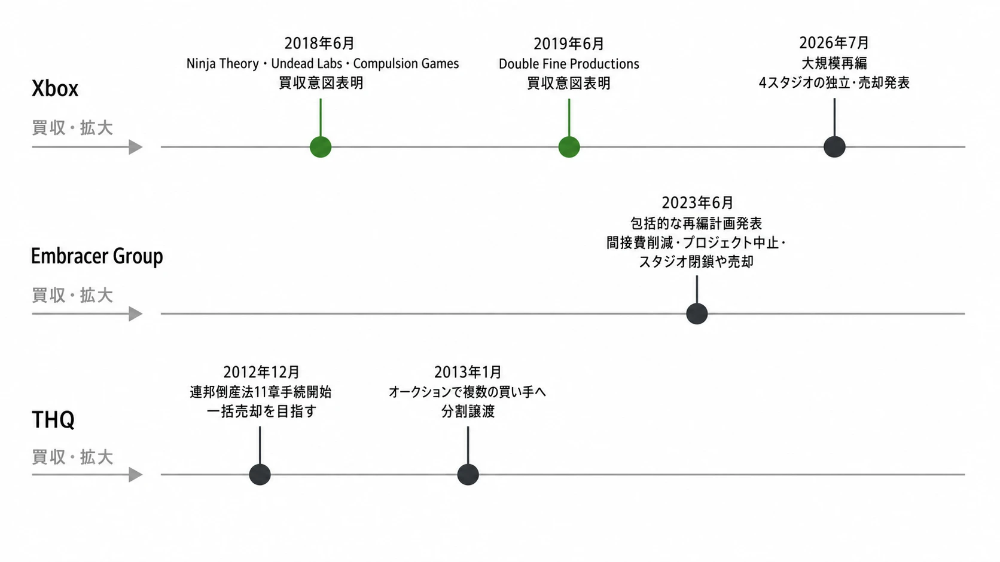
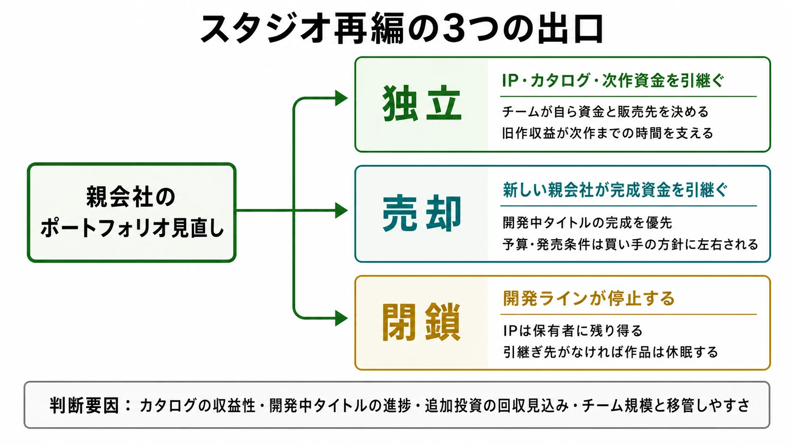
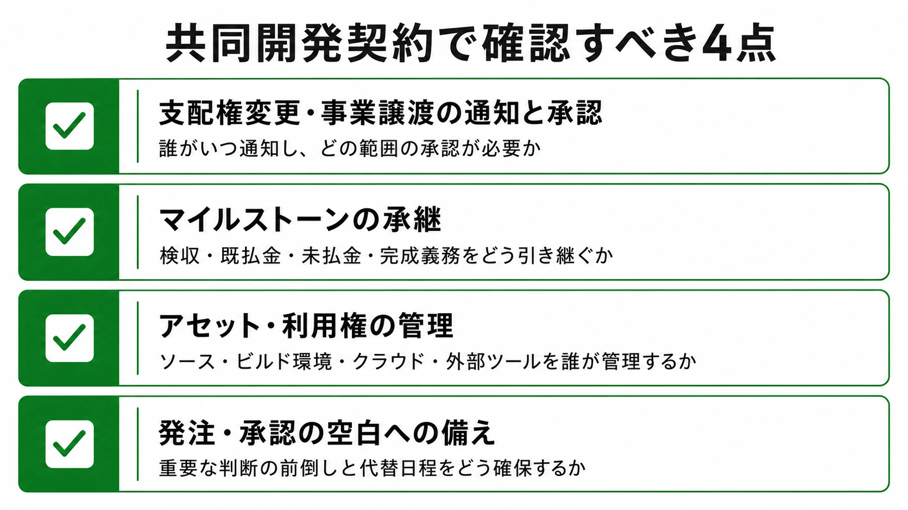

# Xbox再編から考える、スタジオの「独立・売却・閉鎖」はなぜ分かれるのか

2026年7月、Xboxは大規模な人員削減と、傘下スタジオの切り離しを同時に発表した。数字の大きさだけを追えばレイオフのニュースである。しかし企画・開発の現場にとって、より長く効く論点は別にある。同じ親会社の下にあったスタジオが、なぜあるチームは独立し、別のチームは売却先を探し、さらに別のチームは閉鎖の候補になり得るのか、という問いである。

本稿は、欧米ゲーム業界のレイオフ規模や日本の労働法制を扱った「[欧米ゲーム業界で続く大規模レイオフと、日本の労働法制](game-industry-mass-layoffs-japan-labor-law.md)」とは異なり、雇用法制には立ち入らない。また、単一企業の非上場化を扱った「[EA非上場化（LBO）――大型買収の構造とパブリッシャー経営への影響](ea-lbo-take-private-publisher-capital-structure-shift.md)」とも切り分ける。ここで見るのは、親会社の資本構造そのものではなく、保有スタジオをどの出口に振り分けるかというポートフォリオの実務である。

先に結論を置く。独立、売却、閉鎖は、作品の品質を三段階に採点した結果ではない。IPと過去作カタログが単体で事業を回せるか、完成に近い開発中タイトルを誰が引き受けられるか、追加投資を回収できる見通しがあるか、組織を移管できる規模かといった条件の組み合わせで分岐する。外部と組むプランナーも内製組織を評価するプランナーも、買収の発表だけで安定を判断せず、この分岐条件を平時から読む必要がある。

*画像出典（引用）：Xbox Wire, [Resetting XBOX](https://news.xbox.com/en-us/2026/07/06/resetting-xbox/)。記事のヘッダー画像を、再編発表の一次資料として引用。WebP変換。*

***

## 1. 2026年7月のXbox再編で発表されたこと

XboxのCEOであるAsha Sharmaは2026年7月6日、2027年度を通じて約3,200の役割を削減する計画を示した。うち約1,600は同日付で削減され、残る約1,600は年度内の追加削減と組織再編で進める予定である。発表当日のMicrosoft全体の削減は約4,800人規模であり、その全社数と、年度を通じたXboxの3,200人計画は、同じ数字ではない。前者には当日削減されるXboxの1,600人が含まれ、後者はその先の計画も含む、と分けて読むべきである。[[1](#ref-1)]

同時に、4つのスタジオがXboxの所有から離れる方針が示された。報道と公開された社内メモによれば、扱いは一律ではない。[[2](#ref-2)][[3](#ref-3)]

| スタジオ | 2026年7月時点で示された扱い | 読む際の注意 |
|---|---|---|
| Compulsion Games | 従来の経営陣の下で独立。IP、過去作カタログ、次作に向けた開発資金を伴う | 独立後の販売契約、配信先、次作の規模は別途決まる |
| Double Fine Productions | 従来の経営陣の下で独立。IP、過去作カタログ、次作に向けた開発資金を伴う | 「独立」は資金調達リスクが消える意味ではない |
| Ninja Theory | 新たな所有者の下へ移る条件を協議。開発中の Senua を完成・成長させる資金を伴う見込み | 買い手、発売条件、以後のシリーズ計画は公表済みではない |
| Undead Labs | 新たな所有者の下へ移る条件を協議。開発中の State of Decay 3 を完成・成長させる資金を伴う見込み | 同上。完成資金の報道は発売保証そのものではない |
| Arkane Studios | フランスで必要な協議を始め、売却・スピンアウトを含む戦略的選択肢を検討 | 決定済みの売却や独立として扱ってはならない |

ここで重要なのは、Ninja TheoryとUndead Labsが「閉鎖を免れた」とだけ発表されたわけではない点である。報道上は、開発中タイトルを完成・成長させるための資金を伴って新たな所有者に移る条件を協議している段階である。一方、Compulsion GamesとDouble Fine Productionsは、過去作のIPとカタログを持つ独立スタジオとして戻る形が示された。どちらもXboxから離れるが、引き継ぐ資産と次の意思決定者が異なる。[[2](#ref-2)][[3](#ref-3)]

Arkane Studiosについては、フランスでの協議の結果として売却、スピンアウト、その他の選択肢があり得るとされる。2026年7月時点で確定した出口ではない。ニュースの見出しで「5スタジオを売却」と一括りにすると、この未確定性が失われる。[[2](#ref-2)]

***

## 2. 買収後に再編へ向かうのは、Xboxだけの物語ではない

これを「Xbox固有の失敗」として説明すると、業界で繰り返されてきた時間軸を見失う。大手パブリッシャーや持株会社は、成長局面ではスタジオ、IP、開発ラインを買収して供給能力を増やす。その後、資本コスト、開発費、販売見通し、重複機能が見直される局面で、プロジェクトの中止、組織の統合、売却、独立が発生する。買収時の期待が直ちに虚偽だったというより、数年後には事業全体の条件が変わるためである。

Microsoftは2018年、Ninja Theory、Undead Labs、Compulsion Gamesの買収意図を公表し、同時期に自社開発体制を拡大した。Double Fine Productionsの買収意図は2019年に発表された。2026年の再編は、前者の買収発表から約8年、後者から約7年を経た局面にある。買収時に「資源と自由度を得て、より野心的な作品を作る」と説明されたチームが、後年には別の資本配分の判断対象になるという時間差こそ、ここで見るべき事実である。[[4](#ref-4)][[5](#ref-5)]

先例として、Embracer Groupは2023年6月に大規模な再編計画を発表した。公式発表は、間接費・本社費・販売管理費の削減、低い収益見込みの未発表プロジェクトの中止、スタジオ閉鎖や売却、事業構造の見直しを含んでいた。これは、買収と成長投資の局面から、キャッシュフローと投資審査を重視する局面へ移ることを明示した例である。[[6](#ref-6)]

さらにさかのぼると、THQは2012年12月に連邦倒産法11章の手続を開始し、当初は一括での資産売却を目指した。しかし2013年1月のオークションでは、スタジオと開発中タイトル、IPが複数の買い手へ分割して譲渡された。一部のチームや資産は引受先を得た一方で、買い手が付かない組織も生じた。これは「会社を売れば、全スタジオが同じ条件で救われる」という期待が成り立たないことを示す極端な先例である。[[7](#ref-7)][[8](#ref-8)]

もちろん、Xboxの再編は倒産手続ではなく、Microsoft全体の人員削減と事業再設計の一部である。THQやEmbracerと原因を同一視することはできない。ただし、買収による拡張の後に、保有資産を一枚岩ではなく出口別に整理する、という構図は共通する。

*図：買収・拡大から再編・売却に至る主な公表時点。*

***

## 3. 「独立」「売却」「閉鎖」は、何を残して誰が引き受けるかの違いである

これらは厳密な法律用語ではなく、取引条件によって中身が変わる。特に「独立」と言っても、IPの帰属、配給権、旧作の販売権、開発資金の期間は案件ごとに異なる。以下は今回のXbox再編を手掛かりにした、実務上の読み分けである。

| 出口 | 主な特徴 | 誰が次の開発リスクを負うか | 継続性を読む鍵 |
|---|---|---|---|
| 独立 | チームが親会社から離れ、IP・カタログ・一定の開発資金を持つ形 | 経営陣と新たな資金提供者。今回のCompulsionとDouble Fineでは既存経営陣へ戻る形が示された | 旧作収益、IPの権利範囲、次作までの資金余力 |
| 売却 | チームや開発中タイトルを、新しい親会社が引き受ける形 | 買い手と、その買い手の予算・販売戦略 | 買収契約の資金、完成条件、プラットフォーム、承継される契約 |
| 閉鎖 | 法人・拠点・開発ラインを止め、チームを解散する形 | 原則として継続開発の担い手がいない | IPの保有者、引継ぎ先、アセットと契約の扱い |

閉鎖は、法的にIPが永久凍結されることを必ずしも意味しない。IPは親会社、破産財団、買い手などに残り、後にライセンスや売却、別チームでの再始動が起こり得る。ただし、少なくとも当該チームによる開発は中断し、引継ぎ先が決まるまで作品は実質的に休眠する。この意味で、プレイヤーや協業先にとっては最も連続性を失いやすい出口である。

*図：スタジオ再編の3つの出口と、その判断要因。*

では、親会社は何を見て出口を分けるのか。Microsoftが各スタジオについて詳細な評価式を公開したわけではないため、以下は一般化した分析であり、今回の個別判断理由を断定するものではない。

1. **カタログの独立採算性**：過去作が継続販売、追加コンテンツ、移植、サブスクリプション対価などで、チームの固定費や次作の初期費用をどの程度支えられるかである。IPとカタログを渡して独立させても価値を保ちやすいなら、親会社にとっても閉鎖より低摩擦な選択になり得る。
2. **開発中タイトルの進捗度**：完成が近く、作品の核となる知識がチームに残っているなら、売却先が完成資金を出す余地が生まれる。逆に、企画初期でコストと市場性が読みにくい案件は、引受先を見つけにくいと考えられる。
3. **追加投資の回収見込み**：ここでいう回収は初週売上だけではない。シリーズの継続、プラットフォームへの集客、サブスクリプション、PC・他機種展開、ライセンスなどを含む。ただし、親会社にとっての戦略価値と、独立会社にとっての事業価値は一致しない場合がある。
4. **チーム規模と移管可能性**：雇用、契約、ビルド環境、外部委託、地域ごとの手続きを、別の法人へ無理なく移せるかも条件になる。優れたチームであっても、移管のコストと時間が高ければ、売却や独立は難しくなる。

したがって、独立は「より高く評価された出口」、売却は「劣った出口」、閉鎖は「作品が悪かった証拠」と読むべきではない。出口は、資産、契約、時間、買い手の有無を同時に処理する取引設計である。

***

## 4. SenuaとState of Decay 3に残る不確実性

Ninja Theoryの Senua とUndead Labsの State of Decay 3 は、発表時点で完成に向けた資金を伴い新たな所有者の下に移る条件が協議されている、と伝えられた。これは開発継続にとって前向きな材料である。しかし、買い手の名称、最終契約、発売日、対応プラットフォーム、発売後の運営体制は、少なくともこの時点の公表情報だけからは確定できない。[[2](#ref-2)][[3](#ref-3)]

プレイヤーにとっては、完成するかだけでなく、どの環境で、どの価格・提供形態で、どこまで長期サポートされるかが体験を左右する。新たな親会社が単体販売を優先するのか、サブスクリプションやマルチプラットフォーム展開を選ぶのか、シリーズの次作へ投資するのかで、同じゲームでも接点が変わる。これらは現時点での推測であり、今回の発表だけから特定の方針を断定することはできない。

協業パートナーの視点では、さらに具体的な確認が必要になる。音声収録、ローカライズ、品質保証、共同開発、ミドルウェア、流通、ライセンスの各契約について、発注者と支払主体が誰になるのか、既存の承認権限や秘密保持の相手方が変わるのか、マイルストーンの検収が引き継がれるのかを確認しなければならない。売却が発表された瞬間に作業が止まるとは限らないが、意思決定の窓口と予算執行が切り替わる移行期は、遅延が起きやすい局面と見ておくべきである。

***

## 5. 日本のゲームプランナーが持ち帰るべき三つの論点

### 5-1. 共同開発契約では、買収・出資構造の変化を「例外」ではなく前提にする

海外スタジオとの共同開発やパブリッシングでは、相手が買収される、親会社が事業を売る、資金提供者が変わるという事態を、起こりにくい例外として扱わない方がよい。法務・事業部門と協力し、少なくとも次の確認点を契約と計画に織り込む必要がある。

- 支配権の変更や事業譲渡が起きた場合、誰がいつ通知し、どの範囲の承認が必要か。
- マイルストーンの検収、既払金、未払金、完成義務を、旧法人から新法人へどう承継するか。
- ソース、アセット、ビルド環境、クラウドアカウント、外部ツールの利用権を、移行期間中に誰が管理するか。
- 発注・承認の空白を想定し、重要な判断をどこまで前倒しするか、代替日程を何週間確保するか。

これは「相手を信用しないため」の条項ではない。相手の組織が変わっても、作品とプレイヤーへの約束を途切れさせないための設計である。プランナーは契約書を単独で作らないが、どの承認が止まると仕様、収録、レーティング、発売準備に連鎖するかを、制作計画の言葉で法務と共有できる。

### 5-2. 内製スタジオの評価に「独立採算性」を入れる

スタジオの評価を、最新作の売上予測だけで行うと、独立後に自走できる力を見誤る。ここでいう独立採算性は、単年度で完全に黒字かという単純な指標ではない。親会社の資本配分が変わっても、どの程度の時間と選択肢を自力で確保できるかである。

見るべき指標は、たとえば次のように分解できる。

| 観点 | プランナーとスタジオ運営が確認する問い |
|---|---|
| カタログの厚み | 旧作は値引き時だけでなく、継続的な販売・配信・移植・追加コンテンツの収益を持つか |
| IP集中度 | 売上、開発人員、マーケティング投資が単一IPや単一プラットフォームに偏りすぎていないか |
| 次作までの資金距離 | 現行タイトルの収益、外部パブリッシング、共同開発受託で、次の検証期間をどこまで賄えるか |
| 知識の可搬性 | エンジン、ビルド、制作パイプライン、外部委託の知見が特定の親会社システムに依存しすぎていないか |

この評価は、独立を目指すためだけのものではない。親会社に残る場合でも、各チームの投資判断を「次作の売上予測」だけでなく、ポートフォリオ全体に残す選択肢として説明しやすくなる。

### 5-3. 「大手に買収された」は、長期の安泰を意味しない

買収は、資金、販売網、品質保証、マーケティング、技術基盤にアクセスする機会をもたらす。特に開発期間が長い新規IPでは、その利点は大きい。だが、買収時の事業計画は数年後も不変ではない。市場、ハードウェア、サブスクリプション、親会社の投資優先順位、他スタジオとの重複が変われば、同じチームは再び「持ち続けるか」「売るか」「独立させるか」の対象になる。

だからこそスタジオの持続可能性は、親会社の知名度ではなく、権利の所在、カタログの収益性、開発中タイトルの引継ぎ可能性、チームが自律して意思決定できる範囲で評価する必要がある。Xboxの今回の事例は、買収を失敗と決めつける材料ではない。買収後にも出口の設計が必要であり、その設計が作品、チーム、協業先、プレイヤーの連続性を左右することを示した事例である。

*図：共同開発契約で確認すべき4点。*

***

## 終わりに――再編に備え、開発の継続性を設計する

再編のニュースは、数字と社名だけで読むと遠い経営判断に見える。しかし、独立ならIPとカタログを誰が持つか、売却なら完成義務と承認権限を誰が継ぐか、閉鎖なら制作知識と契約をどこへ残すかという問いは、日々の企画・制作管理に直結している。

プランナーに必要なのは、親会社の意思決定を予言することではない。プロジェクトが所属変更に耐えられるように、権利、承認、データ、マイルストーン、収益源を可視化しておくことである。出口を危機の言葉としてだけでなく、開発継続性を設計する言葉として扱うことが、再編の多い時代の実務になる。

## References

1. [Microsoft cuts 4,800 jobs, about 2% globally, revamps salesforce and launches massive Xbox overhaul][1] - GeekWireによる、Microsoft全体の約4,800人とXboxの当日1,600人・年度内3,200人計画の報道。CEOのAsha Sharma氏によるメモの内容も引用している。

[1]: https://www.geekwire.com/2026/microsoft-cuts-4800-jobs-about-2-globally-revamps-salesforce-and-launches-massive-xbox-overhaul/

2. [Xbox announces massive layoffs, sale of multiple studios][2] - The Washington Postによる、4スタジオの独立・売却方針とArkaneの協議を扱った報道。

[2]: https://www.washingtonpost.com/style/2026/07/06/xbox-announces-massive-layoffs-sale-multiple-studios/

3. [Xbox to lay off 3,200 employees, divest five studios][3] - Xboxの公開メモを基に、Compulsion Games、Double Fine Productions、Ninja Theory、Undead Labsの扱いを整理した報道。

[3]: https://www.gematsu.com/2026/07/xbox-to-lay-off-3200-employees-divest-five-studios

4. [Microsoft doubles its game development studios and showcases more than 50 games on E3 stage][4] - Microsoftによる2018年のNinja Theory、Undead Labs、Compulsion Gamesの買収意図の公式発表。

[4]: https://news.microsoft.com/source/2018/06/10/microsoft-doubles-its-game-development-studios-and-showcases-more-than-50-games-on-e3-stage-including-18-console-launch-exclusives-and-15-world-premieres/

5. [Xbox showcases 60 anticipated games, including 34 to premiere in Xbox Game Pass][5] - Microsoftによる2019年のDouble Fine Productions買収意図の公式発表。

[5]: https://news.microsoft.com/source/2019/06/09/xbox-showcases-60-anticipated-games-including-34-to-premiere-in-xbox-game-pass/

6. [Embracer Group announces comprehensive restructuring program with immediate implementation][6] - Embracer Groupによる2023年再編計画の公式発表。

[6]: https://embracer.com/releases/embracer-group-announces-comprehensive-restructuring-program-with-immediate-implementation/

7. [THQ Inc. Secures Asset Purchase Agreement with Affiliates of Clearlake Capital Group, L.P.][7] - THQによる2012年の連邦倒産法11章手続と資産売却計画のSEC提出資料。

[7]: https://www.sec.gov/Archives/edgar/data/865570/000086557012000066/a12-19x12pressrelease.htm

8. [Court approves THQ sale][8] - 2013年のオークションでTHQのスタジオ・開発中タイトルが分割して譲渡された経緯を伝える報道。

[8]: https://www.gamespot.com/articles/court-approves-thq-sale/1100-6402885/

----

この文書は、Perplexity、Claude、OpenAI Codex の3つのAIの支援を受けて著述されたものです。引用画像を除き、MIT License にて提供されています。
