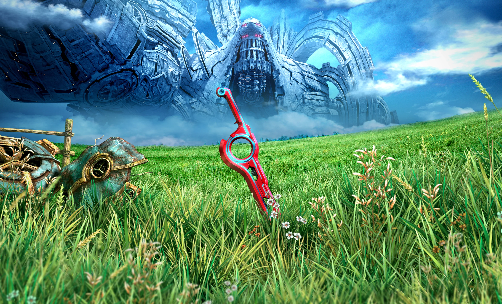
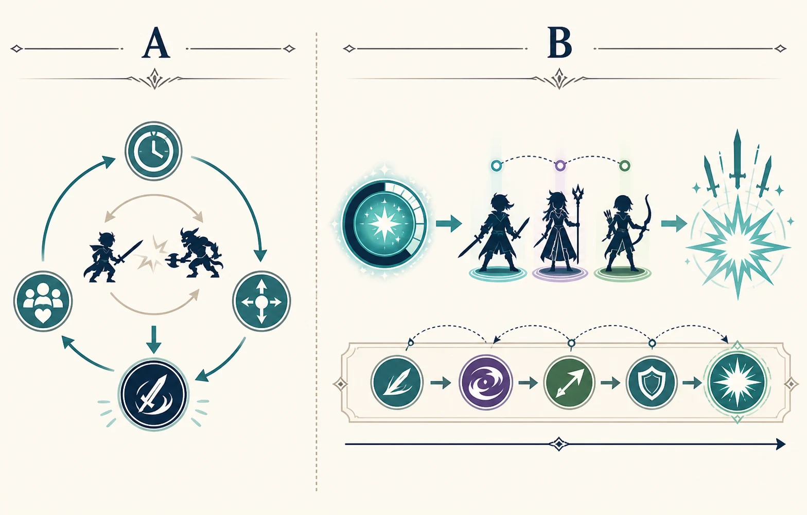
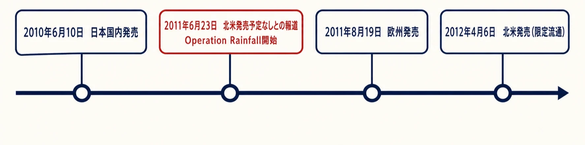
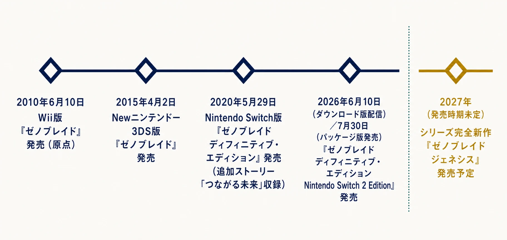

# 『ゼノブレイド』は、なぜ四世代のハードを渡れたのか
## WiiからNintendo Switch 2まで、「歩いて渡れる世界」の設計骨格を読む

***

## はじめに：後継機に渡ったのは、物語だけではない

『ゼノブレイド』は2010年6月10日にWiiで国内発売されたRPGである。二柱の巨大な神の骸を舞台に、人間と機械の対立を描く。任天堂は後年の紹介でも、巨神と機神の身体が「すべて地続きの世界」として存在し、フィールドをシームレスに移動できることを本作の特徴としている。[[1](#ref-1)]

2026年の時点で本作は、Wii、Newニンテンドー3DS、Nintendo Switch、Nintendo Switch 2という四つのハード世代にまたがって提供されている。これは単に古いRPGを何度も表示し直した歴史ではない。遠くに見える場所へ歩いて行けるフィールド、敵の位置と味方の技を見ながら判断するリアルタイム戦闘、仲間との関係を育成と会話に接続する仕組みが、各世代の表現と遊びやすさの更新に耐えてきた歴史である。

本稿が扱うのは、任天堂ハードの設計言語そのものではない。また、複数版の差分を機能数で採点することでもない。個別タイトルの中にある **再提示しても意味を失わない設計骨格** を、原作と四度の展開から読む。

*画像出典（引用）：任天堂、[Xenoblade Definitive Edition（ゼノブレイド ディフィニティブ・エディション） Nintendo Switch 2 Edition](https://www.nintendo.com/jp/games/switch2/aubqb/index.html)。*

***

## 1. 巨神の背を「背景」にしなかった

2010年前後の日本製RPGで広い場所を表現することは、珍しい発想ではなかった。しかし、広大に見える背景と、プレイヤーが実際に行ける場所は別物である。遠景を見せても、次の地点へは地図選択や場面転換で移動する構成なら、遠さは演出であって空間的な約束にはならない。

『ゼノブレイド』は、この約束を強くした。巨神の脚、胴、腕、頭部という身体の部位が、冒険の順番を作ると同時に、フィールドの高さや地形の連続性を説明する。公式サイトは、遥か彼方まで続くフィールドを移動できる一方、部位から部位への移動では読み込みが発生すると明記している。[[2](#ref-2)] ここに重要な割り切りがある。すべてを一枚の完全な連続空間にするのではなく、探索中の広がりと、制作・読み込み上の区切りを両立させたのである。

したがって、本作を今日の意味での完全なオープンワールドと同一視する必要はない。進行に応じて開く大きなエリアをつないだRPGである。それでも、遠方に見える地形を次の探索の目標にし、フィールド内で発見や強敵との遭遇を起こす文法は、後年に一般化するオープンワールド的な期待を先取りしていた。Wiiという制約のあるハードで、何を完全な連続にし、何を節目で読み込むかを選んだからこそ、「あそこへ行ける」という感覚を保てた。

プランナーがここから学べるのは、マップの面積を増やすことではない。 **プレイヤーが見た目から予測した到達可能性に、どこまで応えるか** を決めることである。目的地を見せる、経路の途中にも寄り道の理由を置く、到達後には次の高さや遠景を見せる。この連鎖があるなら、エリア間に技術上の区切りがあっても、世界は「歩いて渡った」と記憶される。

***

## 2. リアルタイム戦闘は、操作量ではなく判断点を配置した

フィールド上の敵に近づくと、場面を切り替えず戦闘が始まる。戦闘中もプレイヤーは位置を変え、敵の背後や側面を取ってアーツを使える。[[1](#ref-1)] この構造は、アクションの反射神経だけに勝敗を委ねるものではない。通常攻撃は自動で進み、プレイヤーはアーツの再使用時間、敵との位置関係、仲間の状態、ここで大技を使うべきかを見て選ぶ。

つまり、オートアタックは操作を省いた部分ではなく、判断を置く余地を作る土台である。毎回の通常攻撃を手で入力させないから、プレイヤーは「いま何を優先するか」に視線を割ける。アーツのクールダウンは、強い技をただ連打できない制約であり、次に使えるまでの時間を読ませるリズムでもある。

さらにチェインアタックは、蓄積した機会を一度に使う判断を作る。ここでは、単独の技の威力だけでなく、誰の順番で、どの効果をつなぐかが問われる。普段の戦闘は位置と個別アーツの短い判断、チェインアタックはパーティ全体を見渡す長い判断へ、時間の粒度を変える仕組みである。

この二層構造は、リアルタイム戦闘を忙しさだけで終わらせない。プレイヤーに常時の手数を要求する代わりに、状況を観察する時間と、まとまった決断の場を交互に渡す。原作公式サイトが「アクションゲームのような手応えとコマンド式バトルの戦術性を融合」と説明した理由も、この役割分担にある。[[3](#ref-3)]

*図：オートアタック中は状況を短い周期で読み、チェインアタックではパーティ全体の技順と効果の接続をまとめて決める。*

### キズナトークは、会話を戦闘の外へ追い出さない

仲間同士の関係を描く会話は、RPGでは寄り道として扱われやすい。『ゼノブレイド』のキズナトークは、特定の場所と条件を見つけて見る会話であり、キャラクター同士の関係を可視化するキズナの仕組みとつながっている。関係は好意的な台詞を読むだけの表示ではなく、成長や戦闘上の恩恵へ接続される。

ここで有効なのは、「物語パート」と「効率パート」を切り離さないことである。会話を見たいプレイヤーには探索の動機が生まれ、戦闘を有利にしたいプレイヤーには仲間を知る入口が生まれる。一つの動機だけで全員を動かそうとせず、同じ仕組みに異なる入口を用意している。

ただし、この接続は会話を見ないと戦えない強制にしてはならない。関係性を数値化して利得へ結びつけるなら、会話の発生条件、進捗の見え方、取り逃しへの配慮まで含めて設計する必要がある。『ゼノブレイド ディフィニティブ・エディション Nintendo Switch 2 Edition』でキズナトークがフルボイス化されたのは、会話の量を増やす変更ではない。既存の関係性の導線を、現在の表現密度で受け取りやすくする更新と読める。[[4](#ref-4)]

***

## 3. 海外展開は、設計の評価と販売判断を分けて見る

国内発売時点で、北米版の予定は公表されていなかった。2011年6月23日、Nintendo of Americaが北米で販売する予定のない製品をE3で見せたくなかったとする、Nintendo Franceのマーケティング担当者の発言が報じられた。[[5](#ref-5)] これをきっかけに、北米でのローカライズを求めるファン運動「Operation Rainfall」が始まった。

同年8月19日には欧州で『Xenoblade Chronicles』が発売され、2012年4月6日には北米でGameStopと任天堂のオンライン販売を通じた限定的な流通が始まった。[[6](#ref-6)][[7](#ref-7)] 発売告知時の業界報道は、北米発売の背景に欧州での評価とファン運動があったこと、ただしNintendo of Americaが北米版を検討していたことも伝えている。[[8](#ref-8)]

*図：日本発売、北米発売予定なしとの報道とOperation Rainfallの開始、欧州発売、北米限定流通の順序。出典：本文の参照[[5](#ref-5)][[6](#ref-6)][[7](#ref-7)][[8](#ref-8)]。*

ここから「ファン運動が発売を実現した」と一本の因果で語るのは簡単である。しかし、地域ごとの販売・流通・ローカライズの判断は、企画チームだけで完結するものではない。本作の場合も、運動が最終判断の唯一の原因だったとする一次資料は見当たらない。むしろ、設計の価値と、どの地域でいつ提供するかの事業判断は、関連しながらも別のレイヤーに置くべきである。

それでもOperation Rainfallが示した事実は重い。発売済みの作品であっても、プレイヤーはその設計を体験し、別の市場の人へ伝え、提供を求める言葉を作る。企画側が直接コントロールできない受容の広がりはある。ただしプランナーの仕事は、それを当てにして地域展開を設計することではない。最初から、体験の核が紹介映像、画面写真、口コミ、実プレイのどこで伝わるかを考え、事業判断を受け止められる製品の輪郭を作ることである。

***

## 4. 四世代の展開で、変えたものと残したもの

本作の各版を、「新しい版ほど完全」という序列で見ると、設計上の選択が見えにくくなる。各世代が解決したのは、同じ原作をどの利用場面、どの表示水準、どの導線で届けるかという異なる問題である。

| 版 | 発売・配信日 | 主な更新 | 保たれた骨格 |
| --- | --- | --- | --- |
| Wii版『ゼノブレイド』 | 2010年6月10日 | 巨神と機神の身体を歩くフィールド、リアルタイム戦闘、キズナの仕組みを提示 | 原点 |
| Newニンテンドー3DS『ゼノブレイド』 | 2015年4月2日 | 携帯機で原作を遊べるようにした | 探索・戦闘・物語の進行構造 |
| Nintendo Switch『ゼノブレイド ディフィニティブ・エディション』 | 2020年5月29日 | HD画質、主要キャラクターモデル、UI、一部楽曲を刷新。「つながる未来」を収録 | 本編のフィールドと戦闘の因果 |
| 『ゼノブレイド ディフィニティブ・エディション Nintendo Switch 2 Edition』 | 2026年6月10日〈ダウンロード版〉／7月30日〈パッケージ版〉 | 4K・60fps、エーテルジェット、キズナトークのフルボイス化 | 原作本編を探索・判断・関係性で進める構造 |

*図：四世代にわたる展開と、別の金色マーカーで示した2027年予定の完全新作『ゼノブレイド ジェネシス』。出典：本文の参照[[1](#ref-1)][[4](#ref-4)][[9](#ref-9)][[10](#ref-10)]。*

Newニンテンドー3DS版は2015年4月2日に発売された。[[9](#ref-9)] ここでの問いは、巨大なRPGを携帯機へ届けられるかである。表現を豪華にするより先に、プレイ場所を変えることが価値になった。作品を保存するとは、元の画面をそのまま保管することだけではない。生活の中で遊べる場面を増やすことでもある。

2020年5月29日のNintendo Switch版「ディフィニティブ・エディション」は、グラフィックをHD画質で描き直し、主要キャラクターのモデル、UI、一部楽曲を更新した。さらに本編の後日譚となる追加ストーリー「つながる未来」を収録した。[[10](#ref-10)] ここで目立つのは追加物語だが、設計的にはUI改善も同じくらい重要である。過去の操作感を神格化せず、アーツの効果やメニューの情報を今のプレイヤーが読み取りやすい形へ直した。原作の判断点を守るために、判断材料の見せ方を更新したのである。

2026年6月10日にダウンロード版が配信され、7月30日にパッケージ版が発売された『ゼノブレイド ディフィニティブ・エディション Nintendo Switch 2 Edition』は、TVモードで4K・60fpsに対応する。[[11](#ref-11)] 新たな乗り物「エーテルジェット」は広大なフィールドの高速探索を可能にし、キズナトークはフルボイスになった。[[4](#ref-4)] これは原作の徒歩探索を否定する変更ではない。既に地理の見通しを得たプレイヤーにも、広いフィールドを移動し直す選択肢を与えたものである。

四つの版に共通するのは、「どこまで原作を変えるか」ではなく、「何を変えても原作らしさが保たれるか」という判断である。画質、移動速度、UI、音声、追加エピソードは変えられる。しかし、遠くの目的地を目指し、戦闘で位置と技を判断し、仲間との関係を探索へ戻す循環を壊せば、それは同じ作品を別の時代へ渡す仕事ではなくなる。

***

## コラム：後年の完全新作へ、キャラクターを渡すということ

『ゼノブレイド3』の有料追加コンテンツ第4弾「新たなる未来」は、2023年4月26日に配信された。これは『ゼノブレイド3』本編の前日譚であり、「ゼノブレイド」シリーズ3作をつなぐ完全オリジナルストーリーとして案内されている。[[12](#ref-12)] 公式サイトには、成長したシュルクとレックスが登場することも明記されている。[[13](#ref-13)]

ここで重要なのは、物語上の詳細を知ることではない。2010年の一作目のキャラクターが、13年後の完全新作コンテンツで再び機能するためには、名前や外見だけでは足りない。プレイヤーがその人物の判断、仲間との関係、世界を歩いた経験を受け取っている必要がある。

長期シリーズの企画では、過去作を参照することが目的になりやすい。だが、再登場を単なる記号にしないためには、最初の作品の時点でキャラクターとゲーム体験が結びついていなければならない。『ゼノブレイド』が後年へ渡したのは、設定資料の項目ではなく、探索、戦闘、関係性の中でプレイヤーが積み上げた人物像だったと考えられる。

***

## おわりに：保存すべきは、解像度ではなく因果である

『ゼノブレイド』が四世代を渡れた理由を、単に作品の人気やシリーズの継続だけで説明することはできない。Wii版の時点で、遠くに見える場所へ進む空間、通常攻撃の自動化によって判断を際立たせる戦闘、仲間を知ることと成長をつなぐ仕組みが、互いに支え合っていた。

だから後年の版は、解像度を上げ、UIを直し、音を加え、移動を速くしても、作品の手触りを保てた。変更の対象が表現と到達のしやすさに留まり、プレイヤーが世界で行う因果を置き換えなかったからである。

リマスターや移植の企画では、「原作に何を足すか」から議論を始めがちだ。先に問うべきなのは、プレイヤーが原作で何を見て、どこへ行き、どの瞬間に判断し、誰との関係を持ち帰ったのかである。その答えが共有されていれば、ハードが変わっても、作品は同じ骨格のまま新しい入口を作れる。

付言すれば、この『ゼノブレイド ディフィニティブ・エディション Nintendo Switch 2 Edition』が配信を開始した同じ日、任天堂は「ゼノブレイド」シリーズの完全新作『ゼノブレイド ジェネシス』を2027年に発売すると発表した。原作から続く「年代記（クロニクル）」三部作の完結を経て、「創世記（ジェネシス）」という新たな物語が始まるという。総監督には引き続き高橋哲哉氏が名を連ねる。[[4](#ref-4)] 新作の設計がどこまで本稿で見た骨格を引き継ぐかは、現時点では分からない。ただし、16年前に一本のWiiソフトとして世に出た作品が、今なお新章の発表と同じ日に語られる現在地にいることだけは確かである。

## References

1. [Xenoblade ゼノブレイド | Wii U | 任天堂][1] - 2010年発売のWii用RPGであること、巨神と機神の身体が地続きの世界として構成され、フィールドと戦闘がシームレスに接続することを確認した。

2. [Xenoblade ゼノブレイド：SYSTEM フィールド][2] - 巨大な神の上に広がるフィールド、部位間の読み込みを含む移動構成を確認した。

3. [Xenoblade ゼノブレイド：BATTLE][3] - リアルタイム戦闘をアクション的な手応えとコマンド式の戦術性の融合として説明する公式表現を確認した。

4. [Nintendo Switch 2 ソフト『ゼノブレイド ジェネシス』を2027年に発売。『ゼノブレイド ディフィニティブ・エディション Nintendo Switch 2 Edition』が本日より配信開始。『ゼノブレイド2』『ゼノブレイド3』のNintendo Switch 2 Editionも2026年に発売。][4] - Nintendo Switch 2 Editionの解像度対応、エーテルジェット、キズナトークのフルボイス化、ダウンロード版・パッケージ版の日程に加え、同日発表された完全新作『ゼノブレイド ジェネシス』（2027年発売、総監督・高橋哲哉）の情報を確認した。

5. [Xenoblade Chronicles Not Coming to North America][5] - 2011年6月23日当時に報じられた、北米発売予定に関するNintendo France担当者の発言を確認した。

6. [European Release Moved Forward for Xenoblade Chronicles][6] - 任天堂の2011年7月8日付欧州向け発表を転載した当時の報道から、欧州版の2011年8月19日発売を確認した。

7. [Nintendo IR: Financial Results Briefing for the Three-Month Period Ended June 2012][7] - 任天堂のIR資料から、北米Wii版『Xenoblade Chronicles』の2012年4月6日発売を確認した。

8. [Nintendo's Xenoblade Chronicles Finally Comes To America][8] - 北米版の限定流通、欧州での受容とファン運動、Nintendo of Americaの検討に関する同時期の業界報道を確認した。

9. [amiibo対応ソフト ゼノブレイド（Newニンテンドー3DS専用ソフト）][9] - Newニンテンドー3DS版の発売日を確認した。

10. [未来を変える、未来につながる物語。『ゼノブレイド ディフィニティブ・エディション』5月29日に発売決定！][10] - Nintendo Switch版の発売日、HD画質への描き直し、モデル・UI・一部楽曲の更新、「つながる未来」の収録を確認した。

11. [Xenoblade Definitive Edition（ゼノブレイド ディフィニティブ・エディション） Nintendo Switch 2 Edition][11] - Nintendo Switch 2 EditionがTVモードで4K、携帯モードで1080pの解像度に対応し、フレームレートが60fpsに対応することを確認した。

12. [Xenoblade3 エキスパンション・パス | 商品情報][12] - 「新たなる未来」が2023年4月26日配信の第4弾であり、シリーズ3作をつなぐ完全オリジナルストーリーであることを確認した。

13. [Xenoblade3 新たなる未来][13] - 「新たなる未来」に登場するシュルクとレックスの公式紹介を確認した。

[1]: https://www.nintendo.com/jp/titles/20010000010286.html
[2]: https://www.nintendo.co.jp/wii/sx4j/system/field/index.html
[3]: https://www.nintendo.co.jp/wii/sx4j/battle/index.html
[4]: https://www.nintendo.com/jp/topics/article/116a7a43-e627-4972-8a6e-48aea029f985
[5]: https://www.nintendoworldreport.com/news/26928/xenoblade-chronicles-not-coming-to-north-america
[6]: https://www.nintendoworldreport.com/news/27149/european-release-moved-forward-for-xenoblade-chronicles
[7]: https://www.nintendo.co.jp/ir/pdf/2012/120725_2e.pdf
[8]: https://www.gamedeveloper.com/business/nintendo-s-em-xenoblade-chronicles-em-finally-comes-to-america
[9]: https://www.nintendo.com/jp/hardware/amiibo/game/cafj/index.html
[10]: https://www.nintendo.com/jp/topics/article/cb1ad150-d450-4a04-af26-0d614737f188
[11]: https://www.nintendo.com/jp/games/switch2/aubqb/index.html
[12]: https://www.nintendo.com/jp/switch/az3ha/products/dlc.html
[13]: https://www.nintendo.com/jp/switch/az3ha/extra-story/index.html

----

この文書は、Perplexity、Claude、OpenAI Codex の3つのAIの支援を受けて著述されたものです。引用画像を除き、MIT License にて提供されています。
